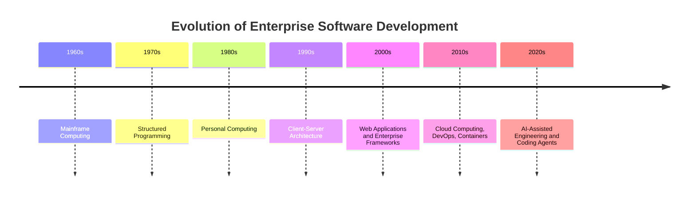
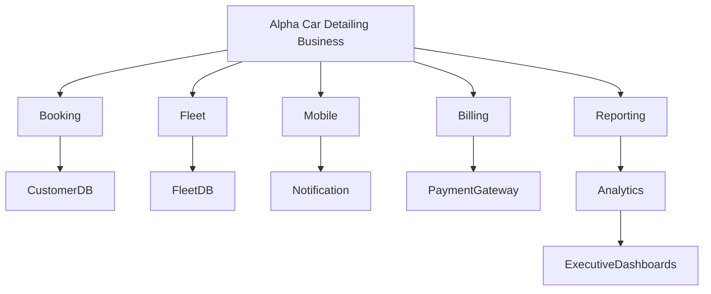
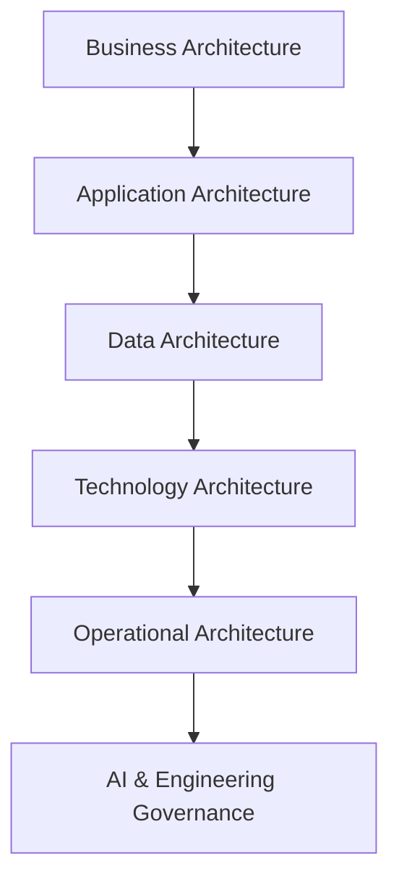
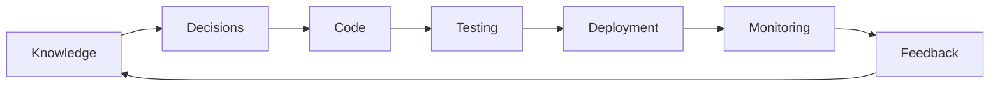
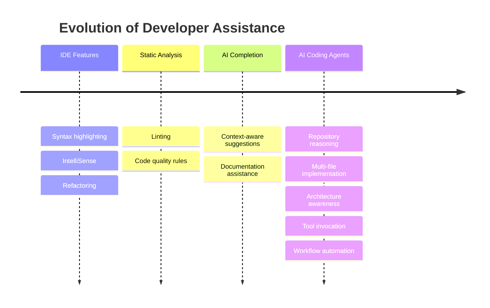
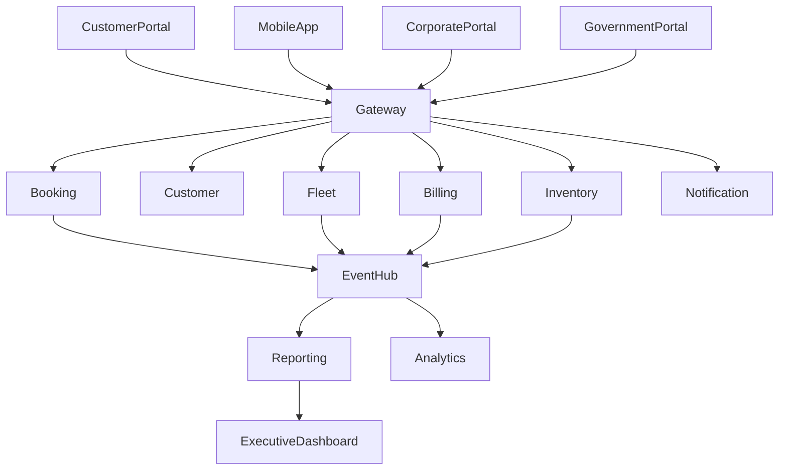

# Chapter 1

# The Evolution of Software Development

> *Every major shift in software engineering has been driven by one persistent reality: the complexity of the systems we build eventually exceeds the capacity of the methods we use to build them.*

---

## Story-Driven Opening

On a cold Monday morning in 1998, a small development team gathered around a whiteboard to design a customer management system for a regional business. The architecture was simple. A desktop application connected directly to a relational database. Four developers shared a single source code repository. Deployments happened by copying executable files to a shared network folder after office hours. Documentation fit comfortably inside a printed binder.

For the business they served, the solution was more than adequate.

Twenty-five years later, that same organization has transformed into a nationwide enterprise operating hundreds of locations across multiple regions. Thousands of customers interact with its services every hour through mobile applications, web portals, partner integrations, payment gateways, and automated scheduling platforms. The software ecosystem now includes dozens of independently deployed services, cloud infrastructure spanning multiple environments, real-time event streaming, zero-trust security models, continuous deployment pipelines, regulatory compliance requirements, observability platforms, and artificial intelligence assisting engineers throughout the development lifecycle.

The software did not merely become larger.

It became fundamentally different.

Modern enterprise systems are no longer isolated applications. They are living ecosystems that evolve continuously. Every architectural decision affects scalability, operational resilience, deployment velocity, regulatory compliance, and long-term maintainability.

This increasing complexity has forced software engineering to reinvent itself repeatedly.

Programming languages evolved from assembly language to structured programming. Software design evolved from procedural development to object-oriented design. Enterprise architecture emerged to manage distributed systems. Agile transformed delivery practices. DevOps unified development and operations. Cloud computing redefined infrastructure ownership. Containers and orchestration reshaped deployment strategies.

Today, artificial intelligence represents the next major transformation—not because it replaces engineers, but because it changes how engineering work is performed.

Understanding this evolution is essential for every software architect, engineering manager, and senior developer. AI-assisted engineering is not an isolated technology trend; it is the latest response to an enduring challenge: managing complexity while continuing to deliver reliable software at enterprise scale.

Throughout this handbook, we will examine this transformation through the lens of a realistic enterprise system: **Alpha Car Detailing**, a nationwide vehicle detailing organization serving individual customers alongside corporate fleets, government agencies, insurance providers, and vehicle rental companies. Rather than relying on simplified examples, every architectural discussion will build upon this single enterprise domain, allowing concepts introduced in one chapter to mature naturally throughout the remainder of the book.

The journey begins not with artificial intelligence, but with the decades of engineering evolution that made AI-assisted software development both necessary and practical.

---

## Learning Objectives

After completing this chapter, you should be able to:

* Explain the major phases in the evolution of software development.
* Describe why software systems have become significantly more complex over the past three decades.
* Understand the architectural forces that led to modern enterprise engineering practices.
* Distinguish AI-assisted engineering from traditional development tooling.
* Compare conventional IDE assistance with modern AI coding agents.
* Evaluate when AI provides meaningful engineering value and when traditional engineering practices remain essential.
* Apply these concepts to enterprise software initiatives such as Alpha Car Detailing.

---

# 1.1 The Evolution of Software Development

Software engineering has never been static. Each generation of technology emerged to solve the limitations of the previous one. While programming languages and tools often receive the greatest attention, the more significant transformations have occurred in how engineers think about systems, collaboration, architecture, and software delivery.

The history of software development can be understood as a series of responses to increasing complexity.

Although each era introduced new technologies, the underlying engineering challenges remained remarkably consistent:

| Era                 | Primary Challenge                              | Dominant Engineering Response         |
| ------------------- | ---------------------------------------------- | ------------------------------------- |
| Mainframe Computing | Limited computing resources                    | Centralized processing                |
| Client-Server       | User interaction and scalability               | Layered architectures                 |
| Internet Era        | Global connectivity                            | Web platforms and distributed systems |
| Cloud Era           | Elastic infrastructure                         | Automation and platform engineering   |
| AI Era              | Engineering productivity and system complexity | AI-assisted software development      |

Notice that the progression is not driven by programming languages alone. Instead, each transition reflects an attempt to reduce cognitive load while increasing organizational capability.

As systems expanded from thousands of lines of code to millions, engineering practices evolved alongside them.

---

## From Individual Programming to Team Engineering

Early software projects were often created by a single developer or a very small team. Knowledge resided primarily in individual expertise rather than documented architectural standards.

Modern enterprise development operates under fundamentally different conditions.

A single business capability may involve:

* Backend engineers
* Frontend engineers
* Mobile teams
* DevOps engineers
* Cloud platform specialists
* Security engineers
* Data engineers
* AI specialists
* Product managers
* Solution architects
* Quality engineering teams

Each discipline contributes to a shared software ecosystem.

This shift required engineering practices that emphasize communication, repeatability, governance, and automation rather than individual productivity alone.

> **Architect's Note**
>
> Enterprise software rarely fails because engineers cannot write code. It fails when teams cannot coordinate architectural decisions consistently over time. Successful organizations invest as heavily in engineering processes as they do in programming expertise.

---

## Alpha Car Detailing: A View Across Three Decades

Consider how the Alpha Car Detailing business might have been implemented at different points in software history.

| Time Period | Typical Solution                                                                                                                                                               |
| ----------- | ------------------------------------------------------------------------------------------------------------------------------------------------------------------------------ |
| Late 1990s  | Desktop application connected directly to a SQL database at a single location                                                                                                  |
| Mid-2000s   | Centralized web application serving all detailing stations                                                                                                                     |
| Mid-2010s   | Multi-tier web platform hosted in the cloud with REST APIs                                                                                                                     |
| Today       | Event-driven microservices supporting nationwide operations, mobile applications, corporate integrations, AI-assisted engineering workflows, and continuous delivery pipelines |

The business objective remained largely unchanged:

> Schedule vehicles, perform detailing services, process payments, and maintain customer relationships.

Everything else evolved.

The architecture, deployment model, operational tooling, development process, security model, and engineering practices changed dramatically because the scale and expectations of the business changed.

This observation illustrates an important principle that will recur throughout this handbook:

> **Architecture evolves primarily because business complexity evolves. Technology follows business needs—not the other way around.**

---

# 1.2 Software Complexity Explosion

Software systems have grown more complex in every measurable dimension.

A modern enterprise application is expected to be:

* Highly available
* Horizontally scalable
* Secure by default
* Continuously deployable
* Observable in production
* Resilient to partial failures
* Integrated with dozens of external systems
* Compliant with industry regulations
* Cost-efficient in cloud environments
* Maintainable by distributed engineering teams

None of these concerns existed simultaneously in early enterprise applications.

The result is an exponential increase in architectural responsibility.

Every layer added to the system introduces new capabilities, but also new dependencies, operational considerations, and architectural trade-offs.

This is the environment in which modern software architects operate—and it is the environment that ultimately created the conditions for AI-assisted engineering to emerge.

## 1.3 Rise of Enterprise Architecture

As software systems expanded beyond departmental applications, organizations discovered that writing correct code was no longer sufficient. Individual applications could succeed while the enterprise as a whole became increasingly difficult to evolve.

The challenge shifted from **building software** to **building sustainable software ecosystems**.

Enterprise architecture emerged as a discipline for managing this complexity.

Rather than focusing on individual applications, enterprise architecture examines how business capabilities, information, technology platforms, development practices, governance, and operational processes interact over many years.

For software architects, this represents an important shift in perspective.

A developer typically asks:

> *How should I implement this feature?*

An architect asks:

> *How will this decision affect every feature that follows?*

This difference in thinking separates software construction from software evolution.

---

### From Systems to Ecosystems

A modern enterprise rarely operates a single application.

Instead, it manages an ecosystem of interconnected services.

For Alpha Car Detailing, the nationwide business includes:

* Customer-facing booking applications
* Corporate fleet management portals
* Government contract management
* Mobile applications
* Vehicle inspection systems
* Payment gateways
* Notification services
* Inventory management
* Workforce scheduling
* Financial reporting
* Customer loyalty programs
* Business intelligence platforms

Each system has different deployment schedules, different scalability requirements, different security boundaries, and often different development teams.

The architectural challenge is no longer writing each application correctly.

It is ensuring that the ecosystem remains coherent as every application evolves independently.

Enterprise architecture provides the principles that allow these independently evolving systems to function as a unified business platform.

---

### Architectural Drivers

Although technologies change rapidly, the forces that influence architectural decisions remain relatively stable.

| Driver                     | Architectural Impact                    |
| -------------------------- | --------------------------------------- |
| Business growth            | Horizontal scalability                  |
| Geographic expansion       | Distributed deployment                  |
| Increased customers        | Performance optimization                |
| Regulatory requirements    | Security and governance                 |
| Faster releases            | Automation and CI/CD                    |
| Multiple engineering teams | Standardization and shared architecture |
| Cloud adoption             | Infrastructure abstraction              |
| AI-assisted engineering    | Repository intelligence and governance  |

Notice that technology rarely appears as the primary driver.

Architecture is usually a response to business needs rather than technological trends.

---

> **Enterprise Tip**
>
> Organizations that adopt new technologies without identifying the underlying business driver often create unnecessary complexity. Mature engineering teams begin architectural discussions with business objectives rather than platform selection.

---

### Layers of Enterprise Architecture

Modern systems are designed across several architectural layers.

Each layer influences the others.

For example, introducing AI coding agents affects far more than developer productivity.

It influences:

* Repository organization
* Engineering standards
* Review processes
* Security controls
* Knowledge management
* Documentation quality
* Governance policies

These topics will be explored in depth throughout later chapters.

---

## Real-World Scenario

Alpha Car Detailing signs a nationwide agreement with a government transportation authority to maintain thousands of official vehicles.

The new contract introduces several requirements:

* Regional service centers
* Approval workflows
* Compliance reporting
* Role-based security
* Audit trails
* High availability
* Service-level agreements
* Automated billing
* Government identity integration

None of these requirements affect only one application.

Each capability crosses multiple services.

Without enterprise architecture, every development team would implement these concerns independently, resulting in inconsistent behavior, duplicated effort, and increased operational risk.

With shared architectural principles, these concerns become reusable enterprise capabilities rather than isolated implementations.

---

## 1.4 Why AI-Assisted Engineering Emerged

Artificial intelligence did not emerge because developers forgot how to write code.

It emerged because software engineering accumulated more information than individual engineers could reasonably retain.

Consider the responsibilities of a senior engineer working on Alpha Car Detailing.

Before implementing a single feature, the engineer may need to understand:

* Business rules
* Coding standards
* Security requirements
* Repository conventions
* Microservice boundaries
* API contracts
* Database migrations
* Event schemas
* Infrastructure configuration
* CI/CD pipelines
* Testing requirements
* Logging standards
* Monitoring dashboards
* Compliance policies
* Documentation expectations

Each requirement is reasonable in isolation.

Together, they create substantial cognitive load.

The problem is not writing code.

The problem is remembering everything surrounding the code.

---

### The Cognitive Load Problem

Software engineering has gradually shifted from implementation-centric work to decision-centric work.

Writing code occupies only one stage of a much larger engineering cycle.

Senior engineers spend increasing amounts of time answering questions such as:

* Which service owns this business capability?
* Does an API already exist?
* Which event schema should be published?
* Is there an established skill for this task?
* Does this change violate repository standards?
* What architectural decision was made six months ago?

These are knowledge problems rather than programming problems.

AI-assisted engineering is fundamentally an attempt to reduce the cost of retrieving and applying engineering knowledge.

---

### AI as an Engineering Multiplier

An effective AI coding agent behaves less like an automated programmer and more like a knowledgeable engineering collaborator.

Its value comes from helping engineers navigate large repositories, summarize architectural context, explain unfamiliar code, draft implementations, identify inconsistencies, and accelerate routine tasks.

It does **not** replace architectural judgment.

The distinction is critical.

| AI Can Assist            | Human Engineers Remain Responsible |
| ------------------------ | ---------------------------------- |
| Repository exploration   | Business priorities                |
| Documentation generation | Architectural decisions            |
| Code generation          | Security ownership                 |
| Test creation            | Regulatory compliance              |
| Refactoring suggestions  | System design                      |
| Pattern recognition      | Final approval                     |

---

> **Architect's Note**
>
> AI changes the economics of software development, not the accountability model. Organizations remain responsible for the software they design, build, and operate.

---

### Why Enterprise Teams Adopt AI

Enterprise adoption is rarely driven by curiosity.

Organizations invest in AI-assisted engineering because they expect measurable improvements.

Typical objectives include:

* Faster onboarding of new engineers
* Improved consistency across teams
* Reduced time spent searching repositories
* Better documentation quality
* Faster creation of repetitive code
* More comprehensive test generation
* Improved review efficiency

These are productivity objectives rather than attempts to eliminate engineering expertise.

The highest-performing teams treat AI as a force multiplier for experienced engineers rather than a substitute for engineering discipline.

---

## 1.5 Evolution of AI Coding Agents

The first generation of development tools focused on syntax.

Integrated development environments introduced features such as:

* Syntax highlighting
* Auto-completion
* Refactoring
* Debugging
* Static analysis

These capabilities accelerated programming without understanding the intent of the software.

Modern AI coding agents represent a different category of tool.

Rather than completing individual statements, they attempt to reason about broader engineering context.

The progression reflects an increasing understanding of engineering context.

Early tools understood programming languages.

Modern AI agents attempt to understand software systems.

This distinction explains why repository organization, engineering standards, skills, instructions, and harnesses have become increasingly important.

An AI agent can only reason effectively when the repository itself communicates architectural intent.

This observation forms one of the central themes of this handbook:

> **Well-structured repositories enable better AI-assisted engineering. Poorly structured repositories limit both humans and AI.**

## 1.6 Traditional IDE Assistance vs. AI Coding Agents

For decades, integrated development environments (IDEs) have steadily improved developer productivity. Features such as syntax highlighting, IntelliSense, debugging, code navigation, and automated refactoring reduced repetitive work while leaving architectural reasoning entirely to the engineer.

AI coding agents represent a different evolution. Rather than assisting with individual lines of code, they participate in broader engineering workflows by understanding repository context, documentation, coding standards, and, increasingly, project objectives.

This distinction is subtle but significant.

An IDE helps developers write code more efficiently.

An AI coding agent helps engineers complete engineering tasks more effectively.

---

### Comparing Responsibilities

| Capability                | Traditional IDE | AI Coding Agent |
| ------------------------- | --------------- | --------------- |
| Syntax highlighting       | ✓               | ✓               |
| Code completion           | ✓               | ✓               |
| Refactoring               | ✓               | ✓               |
| Error detection           | ✓               | ✓               |
| Repository-wide reasoning | Limited         | Yes             |
| Multi-file implementation | No              | Yes             |
| Documentation generation  | Limited         | Yes             |
| Test generation           | Limited         | Yes             |
| Architectural discussion  | No              | Yes             |
| Tool invocation           | No              | Yes             |
| Workflow automation       | No              | Yes             |

The table highlights an important engineering principle.

AI coding agents are **not replacements for IDEs**.

Instead, they extend the development environment into areas that previously depended almost entirely on human knowledge.

---

### An Enterprise Example

A product owner requests a new capability for Alpha Car Detailing:

> "Corporate fleet customers need monthly invoices grouped by department, detailing station, and cost center."

A traditional IDE provides excellent support while the developer manually performs the following tasks:

* Locate relevant projects.
* Search for invoice models.
* Find database entities.
* Discover existing APIs.
* Identify integration points.
* Implement code.
* Create tests.
* Update documentation.

An AI coding agent approaches the problem differently.

It can assist by:

* Discovering existing billing services.
* Explaining current invoice workflows.
* Identifying reusable components.
* Suggesting implementation locations.
* Drafting code changes across multiple files.
* Generating unit tests.
* Updating documentation.
* Highlighting architectural implications.

The engineer still evaluates every recommendation, but significantly less time is spent locating information.

---

### The Shift from Code-Centric to Knowledge-Centric Development

Historically, software productivity was limited by typing speed and programming experience.

Today, productivity is increasingly constrained by knowledge retrieval.

Notice that implementation occupies only one stage of the overall workflow.

Most engineering effort occurs before the first line of code is written.

This is precisely where AI coding agents provide their greatest value.

---

> **Enterprise Tip**
>
> Teams often measure AI success by the amount of code generated. A more meaningful metric is the reduction in time required to understand an unfamiliar codebase while maintaining architectural consistency.

---

## 1.7 Alpha Car Detailing Case Study

Throughout this handbook, Alpha Car Detailing serves as the reference enterprise system.

The company operates hundreds of detailing stations nationwide and serves four primary customer groups:

* Individual walk-in customers
* Corporate fleet operators
* Government departments
* Insurance and rental organizations

Unlike a simple car wash application, Alpha Car Detailing manages an extensive operational ecosystem.

Its responsibilities include:

* Customer management
* Vehicle history
* Booking and scheduling
* Work order management
* Technician assignments
* Inventory tracking
* Billing and invoicing
* Corporate contracts
* Government compliance
* Fleet reporting
* Notifications
* Analytics

Each capability is implemented independently while contributing to a cohesive enterprise platform.

---

### High-Level Architecture

This architecture illustrates several recurring themes explored throughout the handbook:

* Business capabilities are separated into independently deployable services.
* Services communicate through APIs and asynchronous events.
* Operational reporting is decoupled from transactional processing.
* Each service owns its own business logic and data.

As new chapters introduce topics such as Clean Architecture, Event-Driven Architecture, repository intelligence, and AI-assisted development, this solution will evolve incrementally rather than being replaced with isolated examples.

---

### Where AI Fits

AI is not introduced as another microservice.

Instead, it becomes part of the engineering lifecycle.

Notice that AI supports engineers during design and implementation rather than participating directly in production business workflows.

Keeping this separation is an important architectural practice.

---

## Real-World Scenario

A senior developer joins the Alpha Car Detailing project after several months working on another product.

The repository contains:

* Nearly 200 projects
* Thousands of classes
* Multiple bounded contexts
* Hundreds of REST endpoints
* GraphQL APIs
* Event schemas
* Shared engineering standards
* AI skills
* Repository instructions
* Architectural decision records

Without AI assistance, understanding the repository may require weeks.

With well-governed AI assistance, much of the repository discovery process can be accelerated while preserving human ownership of technical decisions.

---

## 1.8 Claude-First Engineering Example

Throughout this handbook, examples primarily use Claude because it is the standard engineering platform adopted by the organization behind this handbook.

However, the engineering principles remain vendor-neutral.

The following scenario demonstrates how Claude can assist an architect implementing a new feature.

### Requirement

> Add premium detailing packages for corporate fleet customers without affecting existing booking workflows.

A mature engineering workflow might proceed as follows:

1. Review repository instructions.
2. Read the current steering note.
3. Discover existing booking services.
4. Identify reusable pricing components.
5. Review architectural decision records.
6. Draft implementation changes.
7. Generate tests.
8. Validate against repository standards.
9. Submit for human review.

The AI agent participates throughout the workflow, but the engineer remains responsible for approving design decisions, validating business rules, and reviewing generated changes.

---

### Why Repository Context Matters

Claude performs most effectively when it has access to structured engineering context, such as:

* Repository instructions
* Skills
* Steering notes
* Architectural documentation
* Coding standards
* Existing implementations

Without this context, AI recommendations become less consistent.

This is one of the reasons later chapters focus extensively on repository intelligence.

---

> **Architect's Note**
>
> AI quality is strongly influenced by repository quality. Investing in documentation, architectural standards, and reusable skills improves outcomes for both human engineers and AI agents.

---

## 1.9 Vendor Comparison

Although this handbook demonstrates examples using Claude, enterprise teams frequently evaluate multiple AI coding platforms.

Each platform has different strengths, workflow models, and integration capabilities.

The objective is not to identify a universally superior tool but to understand which engineering scenarios each platform supports effectively.

| Characteristic        | Claude                                                                   | GitHub Copilot                                          | OpenAI Codex                                       |
| --------------------- | ------------------------------------------------------------------------ | ------------------------------------------------------- | -------------------------------------------------- |
| Primary strength      | Large-scale repository reasoning and engineering workflows               | IDE-integrated code completion and developer assistance | Agent-based coding tasks and automation            |
| Best suited for       | Architecture discussions, multi-file implementation, repository analysis | Interactive coding within the IDE                       | Automated development workflows and task execution |
| Repository context    | Strong                                                                   | Moderate                                                | Strong                                             |
| Workflow automation   | Strong                                                                   | Limited                                                 | Strong                                             |
| Enterprise governance | Depends on organizational implementation                                 | Depends on organizational implementation                | Depends on organizational implementation           |

The differences are practical rather than ideological.

Many organizations successfully combine multiple tools according to their engineering workflows.

For example:

* Architects may use Claude for repository analysis and design discussions.
* Developers may use GitHub Copilot for rapid implementation within the IDE.
* Automation pipelines may employ agent-based capabilities for repetitive engineering tasks.

This handbook emphasizes the engineering practices that remain valuable regardless of which AI platform an organization adopts.

---

## Decision Matrix

| Engineering Activity  | Recommended Approach               |
| --------------------- | ---------------------------------- |
| Repository discovery  | AI coding agent                    |
| Architecture design   | Architect with AI assistance       |
| Security review       | Human-led with AI support          |
| Regulatory compliance | Human ownership                    |
| Code generation       | AI-assisted                        |
| Final approval        | Human review                       |
| Production deployment | Automated pipeline with governance |

The pattern is consistent throughout enterprise engineering:

**Use AI to accelerate execution, but retain human responsibility for architectural decisions, security, compliance, and business accountability.**

## 1.10 Best Practices

The adoption of AI-assisted engineering should strengthen existing engineering discipline rather than replace it. Organizations that achieve sustainable productivity gains establish clear architectural standards, governance processes, and repository conventions before introducing AI into day-to-day development.

The following practices have consistently proven valuable across enterprise software teams.

| Practice                                | Rationale                                                                                                     |
| --------------------------------------- | ------------------------------------------------------------------------------------------------------------- |
| Maintain a well-structured repository   | AI and human engineers both rely on discoverable project organization.                                        |
| Document architectural decisions        | Provides long-term context for future development and AI-assisted analysis.                                   |
| Define repository-wide instructions     | Encourages consistent implementations across teams and projects.                                              |
| Build reusable engineering skills       | Eliminates duplication and standardizes recurring engineering tasks.                                          |
| Treat AI as an engineering collaborator | Engineers remain accountable for architecture, security, and quality.                                         |
| Require human review of generated code  | Prevents subtle design, security, and business-rule errors from reaching production.                          |
| Continuously improve documentation      | Better documentation produces better engineering decisions for both humans and AI.                            |
| Measure outcomes, not generated code    | Productivity should be evaluated through quality, maintainability, delivery speed, and operational stability. |

---

### Build for Understanding

Repositories should communicate intent.

Every engineer joining a project should be able to understand:

* Why the system exists
* How it is organized
* Which architectural principles guide development
* Where business capabilities are implemented
* How services communicate
* Which engineering standards must be followed

Well-organized repositories reduce onboarding time while improving the effectiveness of AI-assisted engineering.

---

### Standardize Before Automating

Organizations sometimes attempt to automate inconsistent development processes.

This rarely succeeds.

Automation amplifies existing practices—whether they are good or bad.

Before introducing AI coding agents, engineering teams should establish:

* Coding standards
* Architectural conventions
* Documentation expectations
* Review processes
* Testing strategies
* Security policies

AI can then reinforce these standards consistently across the engineering organization.

---

> **Enterprise Tip**
>
> If two senior developers would implement the same feature in completely different ways, AI will not solve the inconsistency. Establish engineering standards first, then use AI to reinforce them.

---

## 1.11 Anti-Patterns

Like any engineering technology, AI can be applied effectively or poorly.

The following anti-patterns frequently appear during early adoption.

| Anti-Pattern                                              | Why It Is Risky                                                                |
| --------------------------------------------------------- | ------------------------------------------------------------------------------ |
| Accepting generated code without review                   | Introduces architectural, security, or business-rule defects.                  |
| Using AI as the primary system designer                   | Architectural decisions require business context and long-term accountability. |
| Ignoring repository organization                          | Poor repository structure limits both human and AI productivity.               |
| Measuring success by lines of generated code              | Quantity is not a meaningful engineering metric.                               |
| Replacing documentation with AI                           | AI complements documentation but cannot replace durable engineering knowledge. |
| Allowing AI to modify engineering standards automatically | Standards require deliberate governance and human approval.                    |

---

### Common Mistake

> **"The AI generated it, so it must be correct."**

Generated code should be treated like code written by any new member of the engineering team.

It deserves the same level of review, testing, architectural validation, and security assessment.

---

### Another Common Mistake

Organizations often begin AI adoption by asking:

> *"Which AI platform should we purchase?"*

A more valuable question is:

> *"How mature are our engineering practices?"*

Teams with inconsistent architecture, limited documentation, and weak governance typically experience inconsistent AI outcomes regardless of platform selection.

---

## 1.12 Architect's Notes

> ### Architect's Note 1 — Complexity Never Stops Growing
>
> Every generation of software engineers believes their systems are exceptionally complex. History suggests that today's architecture will eventually become tomorrow's legacy system. Design with future evolution in mind.

---

> ### Architect's Note 2 — AI Does Not Remove Trade-Offs
>
> AI can generate multiple implementation options, but it cannot eliminate architectural trade-offs. Decisions regarding scalability, coupling, consistency, cost, and operational risk remain engineering responsibilities.

---

> ### Architect's Note 3 — Repository Quality Determines AI Quality
>
> AI agents reason from the information available to them. Clear documentation, well-defined boundaries, architectural decision records, and reusable engineering skills significantly improve the quality of AI-assisted development.

---

## 1.13 Enterprise Tips

### Enterprise Tip 1

Treat repository documentation as production assets rather than optional project artifacts.

Future engineers—and future AI agents—will rely on these documents to understand architectural intent.

---

### Enterprise Tip 2

Introduce AI incrementally.

Begin with repository discovery, documentation assistance, and test generation before expanding into implementation workflows.

This approach allows engineering teams to develop confidence while refining governance processes.

---

### Enterprise Tip 3

Measure engineering outcomes such as:

* Deployment frequency
* Lead time
* Production incidents
* Mean time to recovery
* Code review duration
* Onboarding time

These metrics provide a more accurate picture of AI adoption than measuring code generation alone.

---

## 1.14 Decision Points

As your organization begins adopting AI-assisted engineering, consider the following questions.

| Question                                          | Considerations                                                      |
| ------------------------------------------------- | ------------------------------------------------------------------- |
| Is the repository organized consistently?         | Repository intelligence depends on discoverable structure.          |
| Are architectural standards documented?           | AI should reinforce existing standards rather than invent them.     |
| Who approves AI-generated changes?                | Accountability must remain clearly defined.                         |
| Which engineering activities should be automated? | Prioritize repetitive, well-understood workflows.                   |
| How will AI success be measured?                  | Focus on delivery quality, consistency, and engineering efficiency. |

These questions will reappear throughout later chapters as we examine governance, repository intelligence, harnesses, and enterprise workflows.

---

## 1.15 Hands-on Exercise

### Objective

Evaluate how engineering complexity has evolved within one of your organization's existing software systems.

### Exercise

Choose an application currently maintained by your team.

Document the following:

1. Identify the major business capabilities.
2. List the services or modules supporting those capabilities.
3. Count external integrations.
4. Identify architectural standards currently documented.
5. Estimate onboarding time for a new senior developer.
6. Identify repetitive engineering tasks that could benefit from AI assistance.
7. Identify architectural decisions that should always remain under human ownership.

### Reflection Questions

* Which engineering activities consume the most time?
* How much effort is spent locating information compared to implementing features?
* Is repository knowledge centralized or distributed across individual engineers?
* Which documentation would most improve developer productivity?
* Where could AI accelerate engineering without increasing risk?

---

## 1.16 Interview Questions

The following questions assess understanding of the concepts introduced in this chapter.

### Conceptual Questions

1. Why has software development evolved from application-centric to ecosystem-centric architecture?
2. What business factors contributed to the emergence of enterprise architecture?
3. Explain the relationship between software complexity and AI-assisted engineering.
4. Why is repository organization important for AI coding agents?
5. What distinguishes an AI coding agent from traditional IDE assistance?

### Architectural Questions

6. When should architectural decisions remain exclusively under human control?
7. How can organizations measure the success of AI adoption?
8. Why are repository instructions and reusable engineering skills valuable?
9. How should AI-generated code be incorporated into enterprise development workflows?
10. Why is governance essential when adopting AI-assisted engineering?

---

## 1.17 Chapter Summary

Software engineering has always evolved in response to increasing complexity.

From centralized mainframe applications to distributed cloud-native platforms, every major architectural transition has been driven by the need to build larger, more resilient, and more maintainable systems.

Enterprise architecture emerged because organizations required a disciplined approach to managing software ecosystems rather than isolated applications.

As these ecosystems expanded, engineers became responsible for far more than writing code. They were expected to understand architecture, security, infrastructure, governance, compliance, operational practices, and business context simultaneously.

AI-assisted engineering represents the latest response to this challenge.

Its purpose is not to replace software engineers but to reduce the cognitive burden associated with modern software development, allowing engineering teams to spend more time making sound architectural decisions and less time searching for information.

Throughout this handbook, Alpha Car Detailing will demonstrate how these principles apply to a realistic enterprise environment.

Subsequent chapters will build upon this foundation by exploring AI coding agents, repository intelligence, engineering harnesses, governance models, and enterprise-scale implementation patterns.

---

## 1.18 Further Reading

To deepen your understanding of the topics introduced in this chapter, the following resources are recommended:

| Topic                               | Suggested Reading                                                                                                                                        |
| ----------------------------------- | -------------------------------------------------------------------------------------------------------------------------------------------------------- |
| Software Architecture               | *Software Architecture: The Hard Parts* — Ford, Richards, Parsons & Kua                                                                                  |
| Domain-Driven Design                | *Domain-Driven Design* — Eric Evans                                                                                                                      |
| Clean Architecture                  | *Clean Architecture* — Robert C. Martin                                                                                                                  |
| Building Evolutionary Architectures | *Building Evolutionary Architectures* — Ford, Parsons & Kua                                                                                              |
| Team Topologies                     | *Team Topologies* — Skelton & Pais                                                                                                                       |
| Accelerate Metrics                  | *Accelerate* — Forsgren, Humble & Kim                                                                                                                    |
| DevOps Practices                    | *The DevOps Handbook* — Kim, Humble, Debois & Willis                                                                                                     |
| AI Engineering                      | Official documentation and technical papers from leading AI platform providers, used alongside your organization's governance and engineering standards. |

---

# Closing Thoughts

The evolution of software development is a story of increasing complexity—and of the engineering practices created to manage that complexity.

AI-assisted engineering is not a departure from this history. It is the next stage in it.

Organizations that combine strong architectural foundations, disciplined engineering practices, effective governance, and thoughtfully applied AI will be better positioned to build software systems that continue to evolve long after the technologies discussed in this handbook have changed.

The next chapter examines the capabilities, limitations, and engineering role of modern AI coding agents, establishing the conceptual foundation for repository intelligence, engineering harnesses, and AI-assisted enterprise software development.
