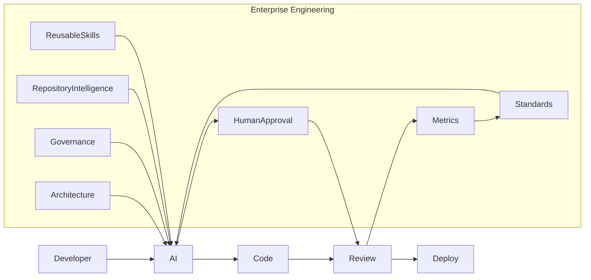

# Chapter 4 — Enterprise AI Engineering

> *"Organizations do not become AI-enabled by deploying AI tools. They become AI-enabled by engineering repeatable, governed, measurable systems that allow humans and AI to build software together safely at enterprise scale."*

---

# Story-Driven Opening

On a Monday morning, the engineering dashboard at **Alpha Car Detailing** looked healthier than ever.

Over 120 developers across six product teams had embraced AI coding assistants. Feature throughput had increased, pull requests were arriving faster than ever, and developers reported significant reductions in repetitive coding tasks.

Initially, leadership celebrated the results.

The Customer Portal team used AI to accelerate ASP.NET APIs.

The Fleet Management team generated Entity Framework repositories in minutes instead of hours.

The Government Contracts team automated repetitive DTO mappings.

The Mobile Services team generated REST endpoints and OpenAPI specifications with minimal manual effort.

Every team appeared to be succeeding.

Yet after only a few months, a different picture emerged.

---

During architecture review meetings, enterprise architects began noticing subtle inconsistencies.

Different services solved identical problems in entirely different ways.

One team used repository patterns.

Another relied on direct DbContext access.

Some services implemented distributed tracing.

Others logged only application errors.

Several APIs followed the organization's Clean Architecture standards.

Others quietly bypassed architectural boundaries because an AI assistant suggested a "simpler" implementation.

No individual decision appeared catastrophic.

Collectively, however, they represented architectural drift.

---

Security teams faced an equally difficult challenge.

The same authentication problem had been implemented six different ways.

JWT validation differed between services.

Authorization policies were inconsistently applied.

Secrets occasionally appeared inside generated configuration files before being caught during code review.

The organization had adopted AI-assisted development without adopting AI engineering.

---

Code review metrics revealed another pattern.

Developers using carefully refined prompts consistently produced production-quality code.

Developers new to AI tools generated code requiring extensive rework.

Knowledge became trapped inside individual engineers.

One senior developer possessed an exceptional collection of prompts for building resilient Event Hub consumers.

Another had perfected prompts for creating Kubernetes deployment manifests.

A third maintained private instructions for generating observability instrumentation.

None of these assets were shared.

AI effectiveness depended on who happened to write the prompt.

The organization was unintentionally creating "AI silos."

---

Leadership commissioned an engineering assessment.

The findings were unexpected.

The problem was not Claude Code.

It was not GitHub Copilot.

It was not OpenAI Codex.

Every platform produced excellent results when provided with appropriate context, standards, and engineering guidance.

The real issue was organizational.

AI had been introduced as an individual productivity tool rather than as an enterprise engineering capability.

The company had invested in AI licenses.

It had not invested in AI engineering.

---

Within six months, Alpha Car Detailing established an Enterprise AI Engineering initiative.

A dedicated AI Platform Team defined shared engineering instructions.

Architecture standards became reusable organizational assets.

Prompt libraries evolved into version-controlled engineering resources.

Reusable skills encapsulated common development workflows.

AI governance became part of architecture governance.

Repository intelligence ensured every AI interaction understood the project's architectural context.

Every AI-generated change required human approval before integration.

Rather than allowing each team to invent its own AI practices, the organization established a unified engineering operating model.

The result was not merely faster software development.

It was predictable, governed, measurable AI-assisted engineering at enterprise scale.

That transformation represents the essence of **Enterprise AI Engineering**.

---

# Learning Objectives

After completing this chapter, you will be able to:

* Distinguish between AI-assisted software development and Enterprise AI Engineering.
* Understand why successful AI adoption requires organizational engineering rather than individual experimentation.
* Design an enterprise AI operating model that aligns with existing software engineering practices.
* Integrate AI into an enterprise Software Development Lifecycle without sacrificing governance or architectural integrity.
* Establish reusable engineering assets that improve consistency across development teams.
* Define organizational roles and responsibilities for AI-enabled software delivery.
* Evaluate enterprise AI maturity using practical assessment models.
* Identify common organizational anti-patterns that hinder AI adoption.
* Apply Enterprise AI Engineering principles using the Alpha Car Detailing solution as a reference architecture.

---

# Why AI-Assisted Development Is Not Enough

The first generation of AI adoption focused primarily on developer productivity.

Organizations purchased licenses for AI coding assistants expecting immediate gains in software delivery velocity. Developers began using natural language to generate APIs, write unit tests, refactor classes, and explain unfamiliar code.

These improvements were genuine.

However, they represented only the first stage of enterprise adoption.

AI-assisted development improves how **individual developers** produce software.

Enterprise AI Engineering improves how the **organization** produces software.

This distinction is fundamental.

An enterprise consists of hundreds or thousands of engineers working across multiple products, repositories, business domains, and regulatory environments. Every architectural decision influences long-term maintainability, operational resilience, security posture, and organizational knowledge.

If each developer independently instructs AI systems, architectural consistency rapidly deteriorates.

The result is not faster engineering.

It is faster divergence.

---

## Individual Optimization vs Organizational Optimization

Many organizations unintentionally optimize the wrong objective.

They measure how quickly developers generate code rather than how effectively engineering systems produce maintainable software.

The difference is significant.

A developer may save thirty minutes generating a service implementation.

The organization may lose weeks later if that implementation violates architectural standards, duplicates existing capabilities, or introduces security vulnerabilities.

Enterprise AI Engineering shifts optimization from individual productivity toward organizational capability.

Instead of asking:

> "How can AI help this developer?"

organizations begin asking:

> "How can AI help every developer produce software that reflects our engineering standards?"

---

## AI Without Engineering Creates Organizational Variance

Consider two development teams building nearly identical microservices.

Both teams receive identical functional requirements.

One team uses carefully maintained organizational instructions describing:

* Clean Architecture
* Domain-driven design
* Logging standards
* Event publishing conventions
* Security policies
* Testing expectations

The second team provides only a feature description.

Although both teams use the same AI platform, the resulting solutions differ substantially.

One reflects organizational architecture.

The other reflects whatever engineering assumptions the model inferred.

The difference is context.

Enterprise AI Engineering treats organizational context as a reusable engineering asset rather than an individual developer responsibility.

---

## Enterprise Architecture Discussion

Traditional software engineering standardized many aspects of development:

* Coding standards
* Branching strategies
* CI/CD pipelines
* Testing policies
* Security reviews
* Architecture governance

Enterprise AI Engineering extends these same principles to AI-assisted development.

Rather than replacing software engineering disciplines, AI becomes another participant within those disciplines.

Architecture continues to define system structure.

Security continues to define acceptable risk.

Platform engineering continues to define deployment standards.

AI simply accelerates implementation within those established boundaries.

---

The diagram illustrates an important principle.

AI is not positioned outside the engineering process.

It becomes another engineering participant governed by the same organizational controls applied to human developers.

---

> **Architect's Note**
>
> Mature organizations rarely ask whether AI-generated code is acceptable. Instead, they ask whether the engineering system consistently produces acceptable software regardless of whether implementation originated from humans or AI.

---

# What Is Enterprise AI Engineering?

Enterprise AI Engineering is the discipline of designing, governing, and continuously improving the organizational systems that enable AI-assisted software development at scale.

Unlike prompt engineering, which focuses on interactions with individual AI models, Enterprise AI Engineering focuses on organizational capability.

It encompasses architecture, governance, reusable engineering assets, operational processes, measurement, security, compliance, and human collaboration.

The objective is not simply to produce more code.

The objective is to produce better software through repeatable engineering systems.

Enterprise AI Engineering therefore combines multiple established disciplines:

* Software Architecture
* Platform Engineering
* DevOps
* AI Governance
* Developer Experience
* Security Engineering
* Knowledge Management
* Organizational Change Management

Rather than existing as a separate engineering practice, it becomes an extension of enterprise software engineering.

---

## Enterprise AI Engineering Defined

An Enterprise AI Engineering capability typically includes:

* Shared engineering instructions
* Repository intelligence
* Organizational prompt libraries
* Reusable engineering skills
* AI-enabled SDLC processes
* Architecture governance
* Human approval workflows
* AI quality measurement
* Productivity analytics
* Risk management
* Continuous learning mechanisms
* Platform enablement teams

Together, these components transform isolated AI usage into an organizational engineering capability.

---

> **Enterprise Tip**
>
> Treat prompts, reusable skills, architectural instructions, validation rules, and governance policies as version-controlled engineering assets. If they influence software quality, they deserve the same lifecycle management as source code.

---

## AI as an Engineering Participant

Historically, software engineering involved three primary participants:

* People
* Processes
* Technology

Enterprise AI introduces a fourth participant:

**AI Engineering Agents**

These agents assist with:

* Feature implementation
* Code reviews
* Documentation
* Test generation
* Refactoring
* Security analysis
* Architecture validation
* Deployment preparation

However, unlike autonomous systems, enterprise AI agents operate within organizational constraints established by human engineering leadership.

AI accelerates engineering decisions.

It does not own them.

---

### Real-World Scenario

At Alpha Car Detailing, every new microservice begins with the same repository template. Before any AI-generated code is produced, the repository already contains standardized architectural instructions, coding conventions, observability requirements, security policies, Docker configuration, GitHub Actions workflows, and deployment standards.

When a developer asks Claude Code to implement a new Fleet Pricing Service, the AI works within an established engineering framework rather than inventing one. Another developer using GitHub Copilot or OpenAI Codex benefits from the same organizational context because the engineering standards reside in the repository, not in individual developers' private prompts.

The outcome is consistent software regardless of which AI platform assists with implementation.

---
