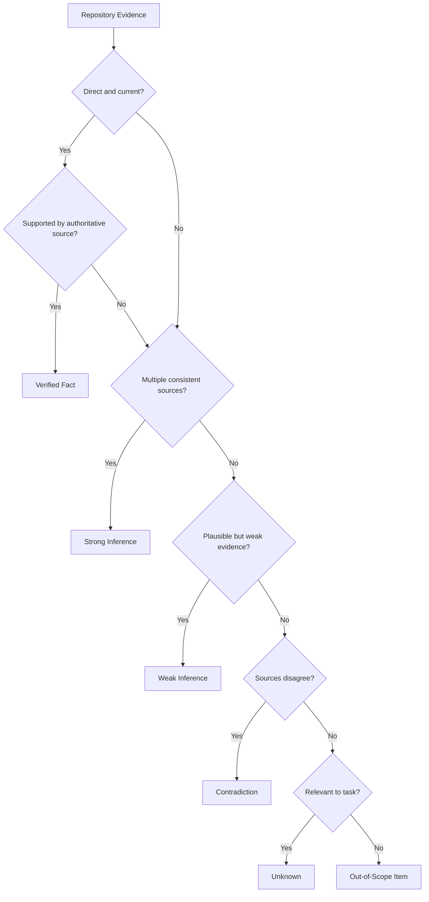
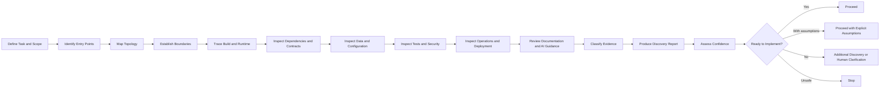
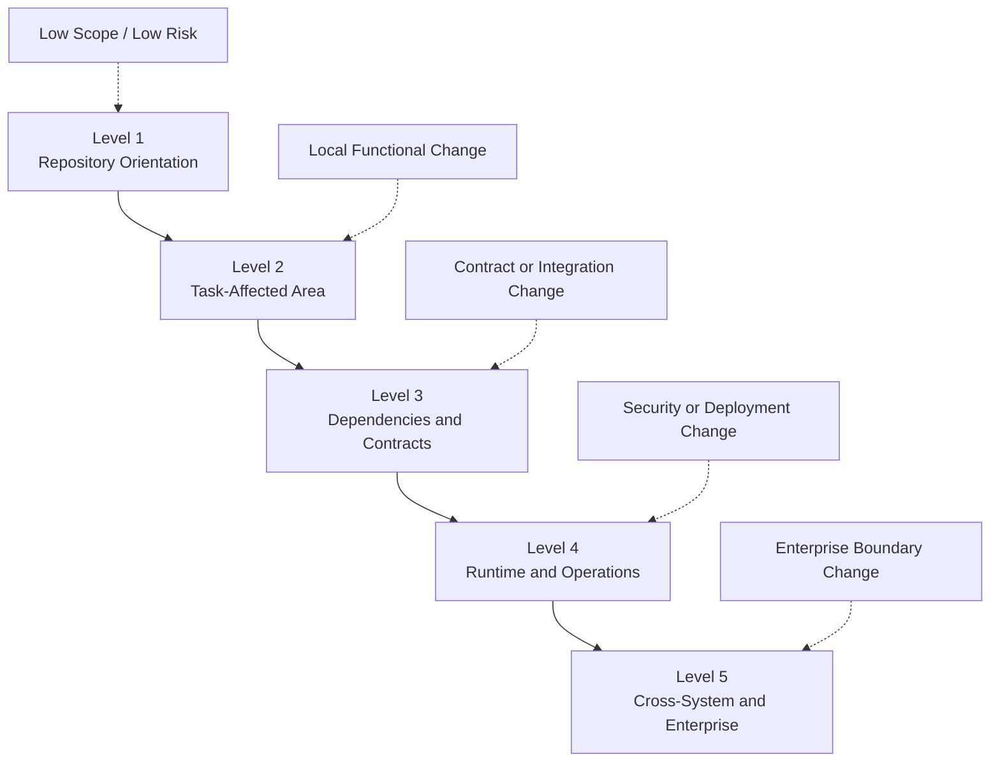
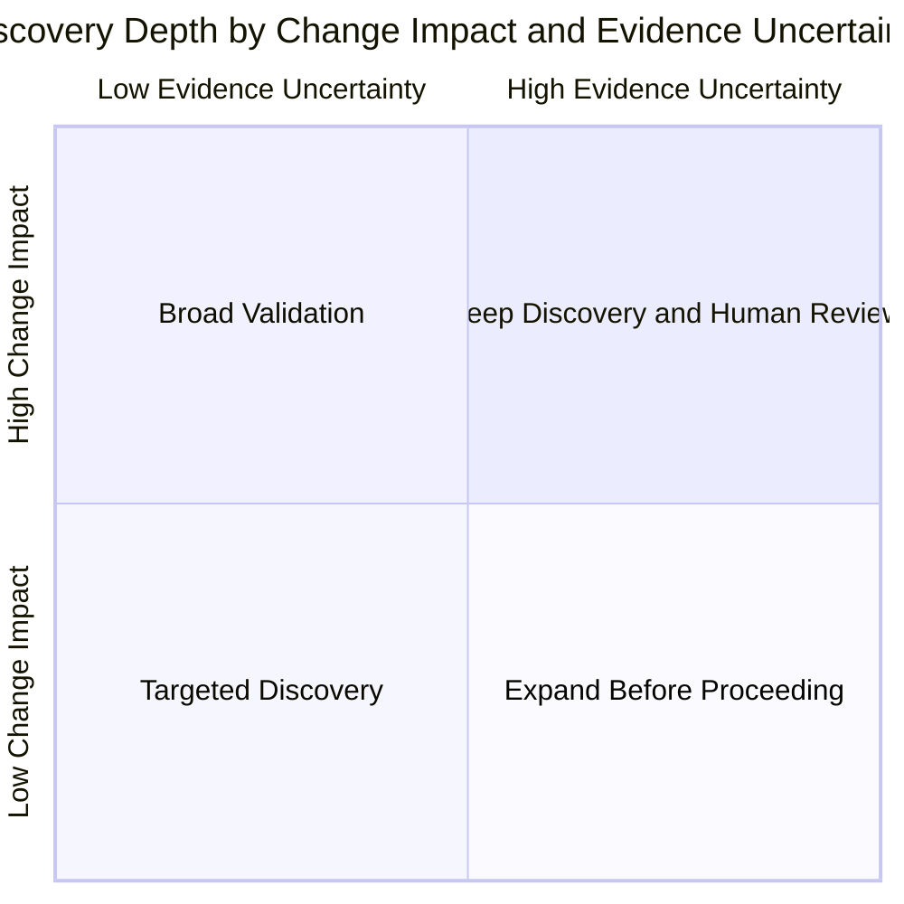
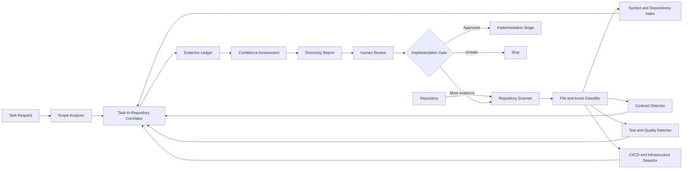
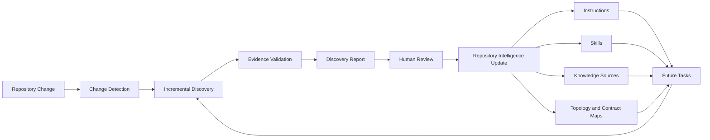

# Chapter 5 — Repository Discovery

*Part II — Repository Intelligence*

## The Change That Looked Local

The request arrived during the final week of a release cycle:

> “Allow an approved corporate customer to reserve detailing capacity for multiple vehicles at a selected station.”

For Alpha Car Detailing, the business value was obvious. Corporate fleet customers wanted to schedule groups of vehicles rather than create individual bookings. A regional rental company might need twenty vehicles cleaned before a holiday weekend. A government department might reserve detailing capacity for an entire maintenance division. An insurance company might need a set of recovered vehicles processed at a designated station within a defined service window.

The feature appeared straightforward.

The initial implementation plan seemed equally straightforward:

1. Add a bulk-booking endpoint.
2. Accept a corporate account identifier, station identifier, vehicle list, service package, and requested time.
3. Validate station availability.
4. Create reservations.
5. Return confirmation details.

An experienced developer could sketch the API contract in minutes. An AI coding agent could generate the controller, request model, validator, command handler, persistence changes, and unit tests shortly afterward.

That speed was precisely the danger.

The Alpha Car Detailing platform had evolved over several years. The repository contained a Booking Service, Station Operations Service, Corporate Account Service, Customer Service, Fleet Service, Billing Service, Notification Service, shared integration contracts, Kubernetes manifests, infrastructure definitions, test projects, architecture decision records, repository instructions, reusable skills, prompts, and harness automation.

The task description did not reveal which service owned the capability.

The Booking Service accepted consumer appointments, but station capacity was calculated by Station Operations. Corporate account approval was maintained by Corporate Accounts, while vehicle ownership for fleet customers appeared partly in the Customer Service and partly in the Fleet Service. Some services communicated through synchronous APIs. Others published events. Shared contracts existed in more than one location. A scheduling diagram referred to a capacity model that no longer matched the deployment manifests. One configuration template defined a feature flag that was not present in the production pipeline.

The agent could not safely answer several essential questions:

* Did Booking own the reservation transaction, or did Station Operations own capacity allocation?
* Was corporate account approval checked synchronously or represented through replicated state?
* Did the Fleet Service own corporate vehicles, or did it only enrich external vehicle records?
* Could a bulk booking be partially accepted, or was the operation atomic?
* Were reservations stored in the Booking database or projected into a Station Operations database?
* Which event schema represented a confirmed reservation?
* Which service enforced authorization for corporate account users?
* Which tests protected station capacity rules?
* Which deployment configuration enabled the corporate booking capability?
* Which repository instructions applied to changes spanning multiple services?

The code could compile while every one of these questions remained unanswered.

A premature implementation might place capacity logic in the Booking Service because that was where the endpoint lived. It might query the Corporate Account database directly because the required data appeared available through a shared connection library. It might duplicate a vehicle model because the existing contract was difficult to locate. It might publish an event with a new naming convention, bypass an established outbox, omit a required tenant claim, and add tests that verified only the new handler rather than the real scheduling constraints.

The result could pass local tests and still violate service ownership, transactional boundaries, security policy, deployment conventions, and operational expectations.

This is the central problem addressed by repository discovery:

> An AI agent must not make material repository changes until it has developed sufficient evidence-based understanding of the affected system.

Repository discovery is the engineering discipline used to build that understanding.

It is not casual browsing. It is not opening a few obvious files. It is not searching for a class name and treating the first result as authoritative. It is not reading the README and assuming the implementation still matches it.

Repository discovery is a systematic process for collecting, validating, classifying, and communicating evidence about a repository before implementation begins.

For an experienced engineer, discovery makes implicit reasoning explicit.

For an AI coding agent, discovery is the difference between code generation and engineering.

---

## Learning Objectives

By the end of this chapter, you will be able to:

* Distinguish repository search, repository discovery, and Repository Intelligence.
* Define discovery scope according to change impact and operational risk.
* Identify repository entry points across source code, build assets, runtime configuration, infrastructure, tests, documentation, and AI guidance.
* Map service boundaries, dependency relationships, contracts, data ownership, and runtime communication paths.
* Classify findings as verified facts, strong inferences, weak inferences, contradictions, unknowns, or out-of-scope items.
* Apply progressive discovery instead of indiscriminately reading an entire repository.
* Produce a professional Repository Discovery Report.
* Assess discovery confidence using explicit evidence factors.
* Determine when implementation may proceed, when assumptions must be declared, and when work must stop.
* Integrate repository discovery into an enterprise AI harness.
* Compare how Claude Code, GitHub Copilot, and OpenAI Codex support repository exploration and validation.
* Establish governance controls that prevent uncertain architectural assumptions from becoming code.

---

## From Repository Access to Repository Understanding

Source access does not imply system understanding.

A developer may be able to open every file in a repository while still misunderstanding the architecture. An AI agent may index millions of tokens, search symbols, execute tests, and summarize directories while still failing to identify the true ownership boundary of a change.

Enterprise repositories express architecture through many forms of evidence:

* Directory structure
* Solution and project references
* Dependency injection registrations
* Startup code
* API routes
* Event producers and consumers
* Database contexts
* Migration projects
* Infrastructure definitions
* Deployment manifests
* Pipeline templates
* Test fixtures
* Security policies
* Operational dashboards
* Architecture decision records
* Repository instructions
* Historical conventions
* Runtime behavior

No single form is always authoritative.

A project name may suggest ownership but contain only an adapter. A README may describe an earlier architecture. An interface may imply one implementation while runtime composition registers another. A deployment manifest may reveal that two apparently independent modules run in the same process. A test suite may encode a business rule that is absent from the documentation. A production pipeline may override the configuration committed to source control.

Repository discovery exists because enterprise architecture is distributed across artifacts.

### Repository Search

Repository search is the act of locating information.

Examples include:

* Finding all references to `StationCapacity`.
* Locating the definition of `CorporateAccountId`.
* Searching for a topic name.
* Finding API route registrations.
* Listing files named `CLAUDE.md`, `AGENTS.md`, or `copilot-instructions.md`.
* Searching for a connection-string key.
* Finding consumers of `BookingConfirmed`.

Search answers questions such as:

* Where is this symbol defined?
* Which files contain this phrase?
* Which projects reference this package?
* Where is this event handled?

Search is necessary, but it is not sufficient.

A search result is evidence. It is not automatically understanding.

### Repository Discovery

Repository discovery is the systematic collection and validation of evidence about repository structure, architecture, behavior, conventions, dependencies, and constraints.

Discovery answers broader questions:

* Which component owns the requested capability?
* Which runtime path executes the behavior?
* Which data store is authoritative?
* Which contracts cross boundaries?
* Which deployment assets affect the change?
* Which tests represent protected behavior?
* Which instructions govern implementation?
* Which assumptions remain unresolved?
* How confident are we that the affected system is understood?

Search locates artifacts.

Discovery interprets and validates them.

### Repository Intelligence

Repository Intelligence is the maintained, reusable understanding created from repository discovery together with repository instructions, skills, prompts, roles, steering notes, and knowledge sources.

It is both a body of knowledge and an organizational capability.

Repository Intelligence may include:

* Current topology maps
* Service inventories
* Ownership definitions
* Contract catalogs
* Data ownership records
* Dependency indexes
* Architecture decisions
* Discovery reports
* Known contradictions
* Repository conventions
* Approved instructions
* Reusable skills
* Operational knowledge
* Historical change context

Discovery is an activity.

Repository Intelligence is the maintained result and the capability that allows future work to begin with better context.

| Concern                        | Repository Search               | Repository Discovery                            | Repository Intelligence                                    |
| ------------------------------ | ------------------------------- | ----------------------------------------------- | ---------------------------------------------------------- |
| Primary purpose                | Locate artifacts                | Understand the affected system                  | Maintain reusable organizational understanding             |
| Typical scope                  | Symbol, file, phrase, reference | Task-oriented architecture and runtime evidence | Repository-wide and cross-repository knowledge             |
| Output                         | Search results                  | Validated findings and discovery report         | Curated knowledge, instructions, maps, skills, and history |
| Evidence validation            | Usually limited                 | Required                                        | Continuously maintained                                    |
| Unknown tracking               | Rare                            | Explicit                                        | Preserved and refreshed                                    |
| Contradiction handling         | Not inherent                    | Required                                        | Governed over time                                         |
| Relationship to implementation | Supports investigation          | Determines readiness                            | Accelerates and constrains future work                     |
| Typical failure                | First result treated as truth   | Incomplete or unscoped exploration              | Stale or ungoverned knowledge                              |

> **Architect’s Note**
>
> Repository discovery should not be treated as overhead before “real work.” For architecture-sensitive changes, discovery is part of the implementation. A team that skips discovery does not eliminate the work; it moves that work into defect analysis, production incidents, security remediation, and architectural erosion.

---

## The Repository Is a Distributed Architecture Record

Enterprise teams often speak about “the architecture” as though it exists in one place.

In practice, the architecture of Alpha Car Detailing is distributed.

The intended architecture may be described in decision records. The implemented architecture exists in project references and composition roots. The deployed architecture exists in container definitions, Helm charts, Kubernetes manifests, Terraform modules, pipeline variables, and environment configuration. The operational architecture appears in traces, dashboards, alerts, runbooks, and incident procedures. The governed architecture appears in instructions, policies, code ownership rules, validation scripts, and pull-request checks.

These views can disagree.

A reliable discovery process must therefore examine several architectural dimensions.

### Structural Architecture

Structural architecture describes how the repository is organized:

* Solutions
* Projects
* Modules
* Packages
* Shared libraries
* Test assemblies
* Generated assets
* Infrastructure folders
* Documentation
* AI engineering assets

This is the easiest dimension to observe and the easiest to overtrust.

### Dependency Architecture

Dependency architecture describes which components depend on which others:

* Project references
* Package references
* Runtime client dependencies
* Event-contract dependencies
* Shared database dependencies
* Infrastructure dependencies
* Pipeline-template dependencies

A directory tree may suggest separation while dependency analysis reveals coupling.

### Runtime Architecture

Runtime architecture describes what actually executes:

* Process boundaries
* Startup paths
* Dependency injection
* Hosted services
* API endpoints
* Consumers
* Schedulers
* Background workers
* Database connections
* Cache access
* External integrations
* Feature flags

Runtime composition often provides stronger evidence than naming.

### Deployment Architecture

Deployment architecture describes how components are packaged and operated:

* Containers
* Pods
* Deployments
* Services
* Ingress rules
* Secrets
* Managed identities
* Autoscaling
* Environment variables
* Network policies
* Release stages

A service that appears independent in source may be deployed with another component. A worker may use a different identity from its API. A feature may exist in source but be disabled in every environment.

### Governance Architecture

Governance architecture describes how work must be performed:

* Repository instructions
* Code ownership
* Security policies
* Required reviews
* Quality gates
* Approved skills
* Harness stages
* Architectural guardrails
* Exception procedures

An agent that understands the code but ignores governance still lacks repository understanding.

### Operational Architecture

Operational architecture describes how the system is monitored and recovered:

* Logs
* Metrics
* Traces
* Health checks
* Alerts
* Runbooks
* Dead-letter handling
* Retry policies
* Rollback procedures
* Support ownership

Operational assets often reveal failure assumptions that are invisible in the main application code.

---

## Evidence Before Interpretation

Repository discovery must separate what has been observed from what has been concluded.

Without this separation, both humans and AI agents tend to convert plausible interpretations into assumed facts.

Consider the following Alpha Car Detailing findings:

* A folder is named `Booking`.
* A `BookingDbContext` contains a `Reservation` table.
* The Station Operations Service exposes `GetAvailableCapacity`.
* A `BookingRequested` event is consumed by Station Operations.
* An ADR states that Station Operations owns capacity allocation.
* A unit test in Booking calculates capacity locally.
* The production manifest enables a legacy scheduling flag.

What does this prove?

The folder name alone proves almost nothing about runtime ownership. The database context strongly suggests Booking stores reservations, but it does not establish ownership of capacity. The API and event consumer indicate cross-service coordination. The ADR documents intent. The unit test suggests either duplication, a legacy path, or stale architecture. The feature flag creates further uncertainty.

A disciplined discovery process classifies each finding.

## Evidence Classification

### Verified Fact

A verified fact is supported by direct, current, and sufficiently authoritative evidence.

Examples:

* `Booking.Api` references `Booking.Application` and `Booking.Infrastructure` in the current solution.
* The production deployment manifest defines a `booking-api` container.
* `BookingDbContext` maps the `Reservations` table.
* The current dependency injection configuration registers `StationCapacityClient`.
* The active pipeline deploys the Booking Service from a specific Dockerfile.
* An integration test verifies that an unauthorized corporate user receives `403 Forbidden`.

A fact is not necessarily permanent. It is verified relative to the inspected repository state and evidence set.

### Strong Inference

A strong inference is a conclusion supported by multiple consistent evidence sources but not directly proven.

Example:

* Station Operations probably owns capacity allocation because an ADR assigns that responsibility, the Booking Service calls its capacity API, and Station Operations publishes capacity-change events.

The conclusion is highly credible, but runtime observation or owner confirmation may still be needed.

### Weak Inference

A weak inference is plausible but supported by limited or ambiguous evidence.

Example:

* The Corporate Account Service may own user authorization because it contains a policy named `ApprovedCorporateCustomer`.

The policy might only validate account state. Actual access enforcement could occur in the API gateway or Identity Service.

### Contradiction

A contradiction exists when evidence sources materially disagree.

Examples:

* The README states that Booking owns station capacity, while current source code calls Station Operations.
* The architecture diagram shows Kafka, while deployment manifests configure Azure Event Hubs.
* The interface name suggests SQL persistence, while runtime composition registers a Redis-backed implementation.
* The configuration template enables a feature, while the production pipeline disables it.
* Tests expect partial acceptance, while the current business rule document requires atomic bulk booking.

Contradictions must be recorded, not silently resolved.

### Unknown

An unknown is a relevant question for which available evidence is insufficient.

Examples:

* Whether corporate fleet bookings must be approved by a station manager.
* Whether the operation may partially succeed.
* Which team owns a shared event schema.
* Whether an external service guarantees idempotency.
* Whether a production-only policy modifies capacity behavior.

Unknowns are not discovery failures. Unrecorded unknowns are.

### Out-of-Scope Item

An out-of-scope item is observed but not relevant enough to justify further investigation for the current task.

Example:

* The Notification Service contains an unrelated SMS-provider migration.

The item may matter in another task, but it should not consume the current discovery budget.

| Classification    | Meaning                                               | Appropriate agent behavior                                     |
| ----------------- | ----------------------------------------------------- | -------------------------------------------------------------- |
| Verified Fact     | Directly supported by current, authoritative evidence | Use as a foundation and cite the evidence                      |
| Strong Inference  | Supported by multiple consistent signals              | Use cautiously and label explicitly                            |
| Weak Inference    | Plausible but weakly supported                        | Do not design around it without validation                     |
| Contradiction     | Sources materially disagree                           | Record, investigate, and escalate when significant             |
| Unknown           | Relevant evidence is unavailable or insufficient      | Add to the unknowns register                                   |
| Out-of-Scope Item | Observed but not materially relevant                  | Record only when useful; do not expand discovery unnecessarily |



> **Common Mistake**
>
> An agent finds a class called `StationCapacityService` and reports, “Station Operations owns capacity.” The class name is evidence. The ownership conclusion is an inference. Until project references, runtime registration, contracts, data access, deployment, and architectural decisions are examined, ownership has not been established.

---

## Determining Evidence Strength

Evidence strength depends on more than the type of file.

A README is not always weak evidence. A source file is not always strong evidence. A generated source file may reflect a contract accurately while obscuring its true ownership. A deployment manifest may be authoritative for one environment but irrelevant to another.

Evidence should be assessed across several dimensions.

### Directness

Does the artifact directly demonstrate the claim?

A dependency injection registration directly demonstrates which implementation is selected in that composition root. A folder name only indirectly suggests ownership.

### Currency

Does the evidence represent the current repository and deployment state?

A recent commit date is useful but not conclusive. A copied document may be newly committed and still describe an old architecture.

### Authority

Who or what controls the behavior?

Runtime wiring is usually more authoritative for current execution than a design proposal. An approved ADR may be authoritative for intended ownership. A production pipeline may be authoritative for deployed configuration.

### Consistency

Do independent sources agree?

Confidence rises when source code, tests, deployment assets, and architecture documentation tell the same story.

### Coverage

Does the evidence cover the whole affected path?

An API controller may reveal the entry point but not event publication, persistence, downstream processing, or authorization.

### Executability

Can the claim be validated through build, test, runtime trace, or controlled execution?

Executable evidence is often stronger than descriptive evidence, although tests can also be stale or incomplete.

### Environmental Relevance

Does the evidence apply to the target environment?

Development configuration may not represent staging or production. Local Docker Compose may differ from Kubernetes deployment. A test fixture may bypass production identity.

### Ownership Confirmation

Is the evidence supported by code ownership, team boundaries, or human confirmation?

For high-risk decisions, explicit ownership evidence may be required even when technical signals appear strong.

A discovery report should preserve these dimensions rather than reduce confidence to an unsupported adjective.

---

## The Formal Repository Discovery Workflow

Repository discovery should be repeatable.

The following workflow establishes a practical enterprise standard.



## 1. Establish the Task, Intended Outcome, and Discovery Scope

Discovery begins with the requested outcome, not with the repository root.

For Alpha Car Detailing, the task is not merely “add a bulk-booking endpoint.” The intended business outcome is:

> An approved corporate customer can reserve detailing capacity for multiple eligible vehicles at a selected station without violating station capacity, customer authorization, reservation ownership, billing policy, or operational constraints.

That statement immediately identifies likely discovery domains:

* Corporate account approval
* User authorization
* Fleet vehicle eligibility
* Station capacity
* Booking transaction rules
* Cross-service communication
* Persistence ownership
* Contract design
* Tests
* Deployment and feature enablement

A useful discovery scope records:

* Requested change
* Business outcome
* Candidate components
* Known constraints
* Risk level
* Target environments
* Expected deliverables
* Explicit exclusions

The initial scope is provisional. Discovery may reveal that additional components are affected.

> **Enterprise Tip**
>
> Write the discovery scope before running broad searches. Without a task-oriented scope, agents tend to explore whichever files are easiest to summarize rather than the evidence required to make the change safely.

## 2. Identify Repository Entry Points

Repository entry points are the assets that reveal how the repository should be approached.

Typical entry points include:

* Root README
* Solution files
* Workspace files
* Build scripts
* Package manifests
* Docker Compose files
* Makefiles
* CI/CD definitions
* Main application projects
* Infrastructure roots
* Architecture documentation
* Contribution guides
* Code ownership files
* Repository instructions
* Harness entry scripts

For a .NET enterprise repository, initial entry points may include:

```text
AlphaCarDetailing.sln
Directory.Build.props
Directory.Packages.props
global.json
docker-compose.yml
README.md
CONTRIBUTING.md
CODEOWNERS
.github/
azure-pipelines/
deploy/
infra/
docs/architecture/
CLAUDE.md
AGENTS.md
```

The purpose is not to read every file immediately. It is to determine the repository’s organizing mechanisms.

Questions include:

* Is there one solution or several?
* Are package versions centralized?
* Are services built independently?
* Are generated sources committed?
* Is infrastructure colocated?
* Are deployment manifests environment-specific?
* Are AI instructions hierarchical?
* Is there a harness entry point that constrains discovery or modification?

## 3. Map Directories, Solutions, Projects, Modules, and Services

The next step is to build a structural inventory.

A realistic Alpha Car Detailing repository might contain:

```text
src/
  Booking/
    Booking.Api/
    Booking.Application/
    Booking.Domain/
    Booking.Infrastructure/
    Booking.Contracts/
    Booking.Worker/
  StationOperations/
    StationOperations.Api/
    StationOperations.Application/
    StationOperations.Domain/
    StationOperations.Infrastructure/
    StationOperations.Contracts/
    StationOperations.CapacityWorker/
  CorporateAccounts/
  Customers/
  Fleet/
  Billing/
  Notifications/
  ApiGateway/
shared/
  EventContracts/
  Observability/
  Security/
  Testing/
tests/
  Unit/
  Integration/
  Contract/
  Architecture/
deploy/
  helm/
  kubernetes/
infra/
  terraform/
  bicep/
pipelines/
docs/
  architecture/
  adr/
  runbooks/
ai/
  instructions/
  skills/
  prompts/
harness/
  roles/
  scripts/
  reports/
  knowledge/
```

This topology is an inventory, not yet an architecture conclusion.

For each project or module, capture:

* Name
* Path
* Type
* Build target
* Deployment unit
* Referenced projects
* External packages
* Database access
* Exposed APIs
* Produced events
* Consumed events
* Test projects
* Owning team, when known

The inventory should distinguish source projects from:

* Test projects
* Build utilities
* Code generators
* Migration tools
* Shared packages
* Deployment projects
* Developer-only tools
* Archived or deprecated components

## 4. Identify Architectural and Ownership Boundaries

Structural grouping must be tested against actual boundaries.

For each candidate service or module, investigate:

* Domain responsibilities
* Public APIs
* Event contracts
* Database ownership
* Deployment unit
* Runtime identity
* Scaling boundary
* Failure boundary
* Team ownership
* Change authority

A microservice boundary is not established merely because a folder is named `Service`.

A stronger boundary has several aligned characteristics:

* Independent deployment
* Owned data
* Explicit contracts
* Controlled dependencies
* Separate runtime identity
* Defined operational responsibility

In Alpha Car Detailing, Booking may own reservation lifecycle while Station Operations owns capacity calculations. Corporate Accounts may own account approval, while Identity owns authenticated user claims. Fleet may own corporate vehicle association without owning customer identity.

These distinctions determine where business rules belong.

### Clean Architecture Boundaries

Within each service, discovery should determine whether Clean Architecture conventions are real or nominal.

Inspect:

* Direction of project references
* Domain dependencies
* Application ports
* Infrastructure adapters
* API composition root
* Cross-layer shortcuts
* Shared abstractions
* Persistence leakage
* Framework dependencies in the domain
* Test boundaries

A repository may contain projects named `Domain`, `Application`, and `Infrastructure` while violating dependency direction through shared utilities or static service locators.

Architecture tests may provide stronger evidence than folder names.

## 5. Trace Build, Startup, Runtime, and Deployment Paths

The build path answers how the code becomes an artifact.

The startup path answers how the artifact becomes a running process.

The runtime path answers how the requested behavior executes.

The deployment path answers how the process reaches an environment.

For the Booking Service, discovery might trace:

```text
AlphaCarDetailing.sln
    ↓
Booking.Api.csproj
    ↓
Program.cs
    ↓
Booking service registrations
    ↓
Authentication and authorization
    ↓
Endpoint mapping
    ↓
CorporateFleetBooking endpoint
    ↓
Command handler
    ↓
Station capacity client
    ↓
Booking repository
    ↓
Outbox publisher
    ↓
BookingConfirmed integration event
```

Then the deployment trace might continue:

```text
Booking.Api Dockerfile
    ↓
CI build template
    ↓
Container registry
    ↓
Helm chart
    ↓
Environment values
    ↓
Kubernetes Deployment
    ↓
Managed identity
    ↓
Service and ingress
    ↓
Runtime configuration
```

The trace should include workers and background processes. Many enterprise workflows continue after the API returns.

For example:

* Booking API stores a reservation and outbox record.
* Booking Worker publishes `CorporateFleetBookingConfirmed`.
* Billing consumes the event.
* Notification consumes the event.
* Station Operations updates projected capacity.
* Reporting receives a separate analytics event.

Reading only the API source would miss most of the operational behavior.

## 6. Discover Dependencies, Contracts, APIs, and Events

Dependencies should be examined at several levels.

### Compile-Time Dependencies

* Project references
* Package references
* Shared libraries
* Generated clients
* Build-time analyzers
* Source generators

### Runtime Dependencies

* HTTP clients
* gRPC clients
* Message brokers
* Databases
* Caches
* Object storage
* Identity providers
* External APIs
* Feature-flag services
* Secret stores

### Contract Dependencies

* REST schemas
* gRPC definitions
* Event schemas
* Shared DTO packages
* JSON Schema
* OpenAPI specifications
* AsyncAPI documents
* Avro or Protobuf definitions
* Database views
* File formats

For each contract, determine:

* Owner
* Consumers
* Versioning strategy
* Compatibility policy
* Serialization format
* Validation mechanism
* Deployment coordination requirements
* Deprecation process

In the fleet-booking scenario, the agent must locate whether a contract already exists for:

* Corporate account status
* Fleet vehicle eligibility
* Station capacity request
* Reservation confirmation
* Booking rejection
* Billing initiation
* Notification scheduling

Creating a new contract without this inventory can produce duplication or incompatible semantics.

### Event Discovery

Event-driven systems require particular care.

Capture:

* Event type
* Producer
* Consumers
* Topic, queue, or event stream
* Schema location
* Version
* Partition key
* Correlation identifier
* Idempotency expectations
* Retry behavior
* Dead-letter handling
* Outbox or inbox usage
* Ordering assumptions

A class named `BookingConfirmedEvent` may be:

* A domain event
* An application notification
* An integration event
* A persistence record
* A test fixture
* A deprecated contract

The name alone is insufficient.

## 7. Examine Configuration, Data Stores, and Environment Assumptions

Configuration is architecture.

A feature’s behavior may depend on:

* Environment variables
* Feature flags
* Secret references
* Tenant configuration
* Station configuration
* Retry settings
* Capacity thresholds
* Time-zone settings
* Regional overrides
* Identity audiences
* External endpoints

Discovery should trace configuration from declaration to runtime use.

For each relevant setting:

* Where is it defined?
* Where is it bound?
* Which component consumes it?
* Does it have environment overrides?
* Is it secret or non-secret?
* Is it validated at startup?
* Is it documented?
* Is it present in deployment assets?
* Does a pipeline transform it?

Data-store discovery should establish ownership and access patterns.

For each store:

* Owning service
* Technology
* Schema or container
* Accessing components
* Write authority
* Read replicas or projections
* Migration mechanism
* Backup and recovery assumptions
* Transaction boundaries
* Cross-service access

A direct SQL connection from Booking to Corporate Accounts may indicate an architectural violation, a temporary migration path, or an intentionally shared database. The discovery report should not guess which one.

### Data Ownership Questions for Corporate Fleet Booking

* Which service owns the reservation aggregate?
* Which service owns station capacity?
* Which service owns corporate account approval?
* Which service owns corporate vehicle association?
* Is corporate account status copied into Booking?
* Are vehicle records referenced by identifier or duplicated as snapshots?
* Is capacity reserved synchronously?
* What transaction protects concurrent reservations?
* Is the event stream authoritative or only integrative?
* Can bookings be reconciled after downstream failure?

These are implementation-shaping questions.

## 8. Inspect Test Architecture and Validation Mechanisms

Tests are executable architecture documentation, but they must also be evaluated critically.

Discovery should inventory:

* Unit tests
* Integration tests
* Contract tests
* Architecture tests
* End-to-end tests
* Performance tests
* Security tests
* Migration tests
* Pipeline validation
* Static analysis
* Mutation testing, when present
* Harness validation scripts

For each affected behavior, identify:

* What is protected?
* At which layer?
* Which tests use real infrastructure?
* Which tests substitute dependencies?
* Which environments run the tests?
* Which tests are mandatory quality gates?
* Which test assumptions conflict with current rules?

In Alpha Car Detailing, capacity behavior may be protected by:

* Domain tests for reservation invariants
* Integration tests against SQL locking behavior
* Contract tests for Station Operations
* End-to-end tests for bulk bookings
* Load tests for concurrent reservations
* Authorization tests for corporate users
* Architecture tests preventing direct cross-service data access

Ignoring these tests may cause the agent to implement a behavior that passes new tests while violating existing guarantees.

> **Real-World Scenario**
>
> An agent adds a handler-level unit test proving that twenty vehicle reservations are created. Existing integration tests use a station capacity semaphore and require all-or-nothing reservation under concurrency. The unit test passes, but the implementation bypasses the concurrency mechanism. Discovery failed because the agent inspected the handler but not the test architecture.

## 9. Review Security, Identity, Authorization, and Secrets Handling

Security discovery is mandatory whenever a change affects:

* User identity
* Permissions
* Tenant boundaries
* Customer data
* Government accounts
* Financial workflows
* Administrative actions
* Secrets
* Network access
* External integrations

The agent should trace:

* Authentication mechanism
* Token issuer
* Audience
* Claims
* Roles
* Policies
* Resource-based authorization
* Tenant or account scoping
* Service-to-service identity
* Managed identities
* Certificate use
* Secret retrieval
* Audit requirements

For corporate fleet booking, “approved corporate customer” may involve several separate checks:

* The account is active.
* The user belongs to the account.
* The user has booking permission.
* The account is authorized for the selected station or region.
* The requested vehicles belong to the account.
* The service package is permitted under the contract.
* The account is within credit or billing limits.

A single boolean named `IsApproved` is unlikely to represent the entire authorization model.

Sensitive paths should also be identified before automated scanning or summarization.

Examples include:

* Private keys
* Local secret files
* Production exports
* Customer data
* Incident evidence
* Credential caches
* Compliance artifacts

The harness must exclude or specially handle such paths.

## 10. Examine Observability, Operations, CI/CD, and Infrastructure

A change is not production-ready merely because its source code is correct.

Discovery should identify:

* Logging conventions
* Correlation requirements
* Metrics
* Distributed tracing
* Health checks
* Alerts
* Dashboards
* Retry policies
* Dead-letter handling
* Runbooks
* Deployment stages
* Approval gates
* Rollback mechanisms
* Infrastructure dependencies
* Scaling behavior

For corporate fleet booking, relevant operational questions include:

* Is bulk-booking duration measured?
* Is capacity rejection counted?
* Can support teams trace one request across Booking, Station Operations, Billing, and Notification?
* Does the worker expose backlog metrics?
* Are failed integration events replayable?
* Can the feature be disabled?
* Does the deployment need additional permissions?
* Will the API or worker require different scaling?
* Are station-specific failures visible?

CI/CD discovery should trace:

* Build entry points
* Test stages
* Security scans
* Container builds
* Artifact publishing
* Environment promotion
* Configuration injection
* Database migrations
* Infrastructure deployment
* Manual approvals
* Post-deployment validation

An agent may add a new project that is never included in the build pipeline. It may add a migration that production deployment does not execute. It may require a secret that no environment provides.

These are repository-discovery failures, not merely deployment failures.

## 11. Review Architecture Documentation, Decision Records, and AI Guidance

Documentation should be used, but not blindly trusted.

Inspect:

* README files
* Architecture overviews
* Context and container diagrams
* ADRs
* Operational runbooks
* Contribution guides
* Migration plans
* Deprecation notices
* Repository instructions
* Skills
* Prompts
* Steering notes
* Previous discovery reports
* Knowledge bases

AI-specific guidance may include:

```text
CLAUDE.md
AGENTS.md
.github/copilot-instructions.md
.github/instructions/*.instructions.md
.github/prompts/*.prompt.md
skills/
prompts/
harness/
Search/steering-note.md
```

For each guidance source, determine:

* Scope
* Precedence
* Owner
* Freshness
* Applicability
* Conflicts
* Whether it is mandatory or advisory

An instruction may prohibit direct cross-service database access. A skill may define the approved event-publication workflow. A steering note may temporarily prohibit contract changes during a release freeze. A previous discovery report may identify known contradictions.

The agent must inspect these before proposing a change.

However, existing knowledge remains evidence, not unquestionable truth.

Repository discovery validates and refreshes Repository Intelligence.

## 12. Classify Findings

Every material finding should be assigned an evidence classification.

A simple discovery ledger may contain:

| Finding                                    | Classification    | Evidence                                                  | Impact                                       |
| ------------------------------------------ | ----------------- | --------------------------------------------------------- | -------------------------------------------- |
| Booking stores reservations                | Verified Fact     | `BookingDbContext`, migrations, repository implementation | Booking owns reservation persistence         |
| Station Operations owns capacity           | Strong Inference  | ADR, API client, event flow                               | Capacity logic should remain outside Booking |
| Corporate Accounts owns user authorization | Weak Inference    | Policy name only                                          | Requires further security tracing            |
| Bulk booking is atomic                     | Contradiction     | Test says atomic; old design document says partial        | Must resolve before implementation           |
| Production feature flag behavior           | Unknown           | Flag absent from inspected production values              | Deployment discovery required                |
| SMS provider migration                     | Out-of-Scope Item | Notification ADR                                          | No effect on current task                    |

This ledger prevents conclusions from becoming detached from their evidence.

## 13. Produce a Repository Discovery Report

The report converts exploration into an engineering artifact.

It should be concise enough to review and detailed enough to support implementation.

A professional template appears later in this chapter.

## 14. Assess Discovery Confidence

Confidence must be assessed explicitly.

It should account for:

* Affected-component coverage
* Evidence quality
* Source agreement
* Runtime traceability
* Test coverage
* Documentation freshness
* Known unknowns
* Contradiction severity
* External systems unavailable for inspection
* Environmental gaps

Confidence is not the same as certainty.

A well-discovered system can still contain unknowns. The purpose is to determine whether those unknowns are acceptable for the requested change.

## 15. Decide Whether Implementation May Begin

The discovery process ends with a decision:

* Proceed
* Proceed with explicit assumptions
* Perform additional discovery
* Request human clarification
* Stop because the change is unsafe

This decision should be recorded in the discovery report.

---

## Progressive Discovery

A common response to uncertainty is to read more files.

That approach does not scale.

Large repositories may contain millions of lines of source, generated code, archived assets, infrastructure definitions, test data, and historical documents. Attempting to understand everything before making any change is inefficient and often impossible.

Repository discovery should be progressive.

Progressive discovery expands according to task risk, architectural reach, and unresolved uncertainty.

## Level 1 — Repository Orientation

Purpose:

* Understand the repository’s basic shape.
* Locate entry points.
* Identify build and instruction mechanisms.
* Determine likely affected areas.

Typical activities:

* Inspect root files.
* Identify solutions and major projects.
* Locate repository instructions.
* Identify build and test commands.
* Review top-level architecture documentation.
* Detect generated or archived areas.

Appropriate for:

* Very small local changes
* Initial repository entry
* Low-risk symbol-level work

## Level 2 — Task-Affected Area Discovery

Purpose:

* Understand the immediate component and its local conventions.

Typical activities:

* Trace the target symbol or endpoint.
* Inspect adjacent application, domain, and infrastructure code.
* Review local tests.
* Identify local configuration.
* Confirm ownership within the component.
* Check applicable instructions.

Appropriate for:

* Private refactoring
* Local validation changes
* Small endpoint behavior changes with no contract impact

## Level 3 — Dependency and Contract Discovery

Purpose:

* Understand upstream, downstream, and shared-contract effects.

Typical activities:

* Trace project and package dependencies.
* Inspect API clients and consumers.
* Inventory contract definitions.
* Identify event producers and consumers.
* Examine compatibility requirements.
* Review data ownership.

Appropriate for:

* Public API changes
* Integration-event changes
* Shared-library changes
* Cross-module behavior

## Level 4 — Runtime and Operational Discovery

Purpose:

* Understand deployment, configuration, security, observability, and failure behavior.

Typical activities:

* Trace startup and runtime composition.
* Inspect environment configuration.
* Review authentication and authorization.
* Inspect pipelines and manifests.
* Review logs, metrics, retries, and runbooks.
* Validate test and quality gates.

Appropriate for:

* Authorization changes
* Background-worker changes
* Database migrations
* Reliability-sensitive changes
* Deployment topology changes

## Level 5 — Cross-System and Enterprise Discovery

Purpose:

* Understand effects across repositories, teams, platforms, and governance boundaries.

Typical activities:

* Explore related repositories.
* Confirm contract ownership.
* Review enterprise platform dependencies.
* Validate organization-wide policies.
* Map rollout coordination.
* Identify migration and compatibility strategy.
* Obtain human architectural review.

Appropriate for:

* Data ownership changes
* Shared platform components
* Identity-model changes
* Cross-repository event evolution
* Enterprise infrastructure changes
* High-risk architectural decisions



### Task Risk Versus Discovery Depth

| Change type                           | Minimum discovery level | Why                                                                                             |
| ------------------------------------- | ----------------------: | ----------------------------------------------------------------------------------------------- |
| Rename a private method               |                 Level 2 | Local references, reflection, tests, and conventions must be checked                            |
| Add validation to one endpoint        |                 Level 2 | Requires endpoint flow, domain rules, error conventions, and tests                              |
| Change a public API contract          |                 Level 3 | Consumers, versioning, compatibility, and documentation are affected                            |
| Introduce an integration event        |               Level 3–4 | Producer, consumers, schema, outbox, retries, observability, and deployment matter              |
| Move data ownership between services  |                 Level 5 | Requires migration, compatibility, team ownership, operational, and governance analysis         |
| Modify authorization                  |               Level 4–5 | Identity, policies, claims, tenants, audit, and deployment configuration are security-sensitive |
| Change deployment topology            |               Level 4–5 | Runtime identity, networking, scaling, pipelines, observability, and rollback are affected      |
| Introduce a shared platform component |                 Level 5 | Creates organization-wide coupling and lifecycle responsibilities                               |

The matrix defines a minimum, not a limit.

A private method rename may require deeper discovery when the method is accessed through reflection, source generation, configuration, or plugin loading. An endpoint validation change may affect a public error contract.

> **Decision Point**
>
> When discovery reveals that the change crosses a boundary not identified in the original task, increase the discovery level. Do not preserve an artificially narrow scope merely because the task description was narrow.

---

## Discovery Depth as a Risk Function

Discovery depth should be proportional to:

* Change scope
* Architectural impact
* Operational risk
* Security sensitivity
* Number of affected services
* Confidence in available Repository Intelligence

A practical model considers both impact and uncertainty.



A low-impact change with strong evidence may proceed after targeted discovery.

A low-impact change with weak evidence may still require expansion.

A high-impact change with strong evidence requires broad validation.

A high-impact change with unresolved contradictions requires deep discovery and human review.

Token limits, time pressure, or agent context limits do not reduce architectural risk. They only affect how discovery must be staged.

---

## Repository Topology Mapping

A repository topology map records what exists and how the parts relate.

It should not be limited to a folder tree.

A professional topology map includes:

* Source modules
* Deployment units
* Runtime communication
* Shared contracts
* Data stores
* Infrastructure
* Tests
* Documentation
* AI engineering assets
* External dependencies

The following conceptual topology illustrates Alpha Car Detailing.

```mermaid
flowchart TB
    subgraph Channels
        Web[Customer and Corporate Portals]
        Mobile[Station Mobile Application]
        Partner[Partner Integrations]
    end

    Gateway[API Gateway]

    subgraph Core Services
        Booking[Booking Service]
        Station[Station Operations Service]
        Corporate[Corporate Account Service]
        Customer[Customer Service]
        Fleet[Fleet Service]
        Billing[Billing Service]
        Notification[Notification Service]
    end

    subgraph Data
        BookingDB[(Booking SQL)]
        StationDB[(Station Operations SQL)]
        CorporateDB[(Corporate Accounts SQL)]
        FleetDB[(Fleet SQL)]
        Redis[(Redis)]
    end

    subgraph Messaging
        Broker[Enterprise Event Platform]
        Contracts[Shared Event Contracts]
    end

    subgraph Platform Assets
        K8s[Kubernetes and Helm]
        IaC[Terraform and Bicep]
        CICD[CI/CD Pipelines]
        Obs[Logs, Metrics, and Traces]
    end

    subgraph Repository Intelligence
        ADR[Architecture Decisions]
        Instructions[AI Instructions]
        Skills[Reusable Skills]
        Prompts[Prompt Library]
        Harness[Harness Scripts and Reports]
    end

    subgraph Validation
        Unit[Unit Tests]
        Integration[Integration Tests]
        ContractTests[Contract Tests]
        ArchitectureTests[Architecture Tests]
    end

    Web --> Gateway
    Mobile --> Gateway
    Partner --> Gateway

    Gateway --> Booking
    Gateway --> Station
    Gateway --> Corporate
    Gateway --> Customer
    Gateway --> Fleet

    Booking --> BookingDB
    Booking --> Redis
    Station --> StationDB
    Corporate --> CorporateDB
    Fleet --> FleetDB

    Booking <--> Station
    Booking <--> Corporate
    Booking <--> Fleet
    Booking --> Broker
    Station --> Broker
    Corporate --> Broker
    Fleet --> Broker
    Broker --> Billing
    Broker --> Notification
    Contracts --- Broker

    K8s --> Core Services
    IaC --> K8s
    CICD --> K8s
    Core Services --> Obs

    ADR -.guides.-> Core Services
    Instructions -.constrains.-> Harness
    Skills -.used by.-> Harness
    Prompts -.executed by.-> Harness
    Harness -.validates.-> Validation
```

This map communicates more than the directory structure.

It reveals that:

* Booking coordinates with Station Operations, Corporate Accounts, and Fleet.
* Multiple services own separate stores.
* Events connect Booking to Billing and Notification.
* Contracts are shared.
* Infrastructure and observability are part of the system.
* Tests and Repository Intelligence assets constrain implementation.

### Directory Structure Versus Runtime Architecture

Directory structure may align with runtime architecture, but the relationship must be verified.

Common mismatches include:

* Multiple folders deployed as one process
* One folder producing multiple deployment units
* Shared libraries containing business ownership
* Workers located under API projects
* Infrastructure code stored in a separate repository
* Contracts duplicated across services
* Generated clients appearing to be service implementations
* Legacy modules retained beside active replacements
* Feature-specific folders spanning multiple services

A topology map should therefore include at least three views:

1. Structural view
2. Runtime view
3. Ownership view

When these views differ, the differences are themselves important findings.

---

## Repository Types and Discovery Strategy

Discovery methods must adapt to repository shape.

| Repository type                        | Primary discovery concern                               | Recommended strategy                                                                              |
| -------------------------------------- | ------------------------------------------------------- | ------------------------------------------------------------------------------------------------- |
| Single-service repository              | Hidden external dependencies and deployment assumptions | Trace full build-to-runtime path and external contracts                                           |
| Modular monolith                       | Real versus nominal module boundaries                   | Analyze project references, internal APIs, shared database access, and module tests               |
| Monorepository                         | Scale, ownership, and selective relevance               | Use progressive discovery, ownership metadata, build graph, and affected-component analysis       |
| Multi-repository microservice platform | Missing system context                                  | Discover local repository, then inspect contract, infrastructure, and owning-service repositories |
| Shared platform repository             | Broad downstream impact                                 | Inventory consumers, versioning, compatibility, rollout, and support ownership                    |
| Infrastructure repository              | Indirect application effects                            | Trace modules to deployed services, identities, networks, secrets, and environment overlays       |
| Generated-code repository              | Source-of-truth ambiguity                               | Locate generators, schemas, generation pipeline, and ownership                                    |
| Legacy-modern hybrid                   | Multiple architectural eras                             | Identify active paths, strangler boundaries, compatibility layers, and retirement plans           |

### Single-Service Repositories

A single-service repository may appear easy to discover, but important dependencies often exist outside it.

The agent must identify:

* External APIs
* Shared packages
* Central pipelines
* Infrastructure modules
* Identity configuration
* Contract repositories
* Runtime secrets
* Operational dashboards

Repository boundaries do not necessarily match system boundaries.

### Modular Monoliths

In a modular monolith, module folders may suggest strong boundaries while all modules share:

* One database
* One process
* One transaction
* Internal classes
* Common dependency injection
* Shared migrations

Discovery should determine whether module contracts are enforced or merely conventional.

Architecture tests and project references are especially valuable.

### Monorepositories

Monorepositories require disciplined scope control.

Useful entry points include:

* Build graph
* Workspace configuration
* Ownership metadata
* Affected-project tooling
* Package boundaries
* Shared pipeline templates
* Central instruction files
* Nested instruction scopes

The agent should avoid both extremes:

* Reading the entire repository
* Restricting discovery to the first matching project

### Multi-Repository Microservice Platforms

The complete system may not be available in one repository.

The local repository may contain a client for a service whose contract is defined elsewhere. Deployment manifests may exist in a platform repository. Shared events may live in a contract repository. Environment configuration may be managed separately.

The discovery report must state which repositories were unavailable.

Missing repositories reduce confidence and may require human clarification.

### Shared Platform Repositories

Changes to shared observability, security, messaging, or persistence packages can affect many teams.

Discovery must include:

* Consumer inventory
* Version adoption
* Compatibility
* Release strategy
* Ownership
* Support model
* Migration burden
* Rollback

A locally safe change can be enterprise-wide breaking.

### Infrastructure Repositories

Infrastructure discovery should map definitions to runtime consumers.

A Terraform module name may not reveal which services use it. Environment overlays may change identity, networking, scaling, and secrets.

The agent should trace:

```text
Module
  → Environment composition
  → Resource
  → Workload identity
  → Application deployment
  → Runtime dependency
```

### Generated Code

Generated code is evidence of a generated artifact, not necessarily the source of truth.

Discovery must locate:

* Generator
* Input schema
* Generation command
* Output path
* Commit policy
* Validation
* Custom extension points
* Regeneration workflow

Editing generated output directly may be prohibited.

### Legacy-Modern Hybrid Systems

Hybrid repositories often contain:

* Legacy applications
* Modern services
* Adapters
* Shared databases
* Replication jobs
* Compatibility APIs
* Migration flags
* Dual-write paths

Discovery should identify which path is active for the target environment. Naming alone is rarely sufficient.

---

## Contradictions Are First-Class Findings

Enterprise repositories accumulate contradictions naturally.

Documentation lags implementation. Migration code coexists with target architecture. Tests preserve old behavior. Deployment overrides differ by environment. Teams introduce temporary exceptions that become long-lived.

The discovery process should not hide these contradictions to produce a clean narrative.

A contradiction log should capture:

* Topic
* Source A
* Source B
* Why they conflict
* Potential impact
* Required resolution
* Owner, when known
* Status

Example:

| Topic                  | Source A                                 | Source B                                                 | Impact                                      | Status                              |
| ---------------------- | ---------------------------------------- | -------------------------------------------------------- | ------------------------------------------- | ----------------------------------- |
| Capacity ownership     | ADR-014 assigns Station Operations       | `BookingCapacityCalculator` implements local calculation | Risk of duplicate business rules            | Unresolved                          |
| Messaging platform     | Architecture diagram shows Kafka         | Production Helm values reference Event Hubs              | Contract and operational assumptions differ | Diagram likely stale                |
| Bulk-booking atomicity | Integration test requires all-or-nothing | Product notes allow partial acceptance                   | API and transaction design blocked          | Human clarification required        |
| Corporate approval     | README says nightly synchronization      | Runtime client calls Corporate Accounts synchronously    | Latency and failure behavior differ         | Verified runtime path; README stale |
| Feature enablement     | Default config enables bulk booking      | Production values omit flag                              | Deployment readiness unknown                | Additional discovery required       |

Contradictions have different severities.

A stale diagram may be low risk when runtime evidence is clear.

A contradiction about transaction semantics or authorization is high risk and may block implementation.

> **Architect’s Note**
>
> The goal of discovery is not to force every artifact into agreement. The goal is to know where disagreement exists and prevent the implementation from depending on an unverified interpretation.

---

## Unknowns and Open Questions

Unknowns should be separated from open questions.

An unknown is a missing fact.

An open question is an unknown that requires an answer or decision before work can proceed.

Example:

**Unknown:** No evidence was found describing whether corporate bulk bookings may partially succeed.

**Open question:** Must the API reject the entire request when one vehicle is ineligible, or may it accept eligible vehicles and return item-level failures?

The unknowns register may include relevant uncertainties that do not block the task.

The open-question register should identify:

* Question
* Why it matters
* Required owner
* Blocking status
* Decision deadline
* Temporary assumption, if permitted

An agent must never conceal an open question by selecting the most convenient implementation.

---

## Discovery Outputs

Professional repository discovery produces reusable artifacts.

| Output                           | Purpose                                                            |
| -------------------------------- | ------------------------------------------------------------------ |
| Repository topology map          | Shows structural, runtime, and ownership relationships             |
| Project and service inventory    | Lists components, types, deployment units, and responsibilities    |
| Ownership boundary map           | Identifies domain, data, contract, and operational ownership       |
| Dependency map                   | Shows compile-time, runtime, and platform dependencies             |
| Runtime flow map                 | Traces the target behavior across components                       |
| API and event contract inventory | Records exposed and consumed contracts                             |
| Data ownership map               | Identifies authoritative stores, projections, and write boundaries |
| Configuration inventory          | Records relevant settings, flags, secrets, and overrides           |
| Test inventory                   | Shows protected behaviors and quality gates                        |
| Security boundary map            | Traces identities, policies, tenants, and sensitive paths          |
| CI/CD and deployment inventory   | Maps build, release, environment, and infrastructure paths         |
| Repository convention summary    | Captures implementation and validation conventions                 |
| Contradiction log                | Preserves conflicting evidence                                     |
| Unknowns register                | Records unresolved relevant facts                                  |
| Open-question register           | Identifies decisions required before implementation                |
| Confidence assessment            | Evaluates implementation readiness                                 |
| Recommended exploration steps    | Defines further discovery when required                            |

These outputs do not always require separate documents. For small tasks, several may be sections within one report. For high-risk work, dedicated maps and inventories may be justified.

---

## Repository Discovery Report Template

```markdown
# Repository Discovery Report

## 1. Task

- Request:
- Intended business outcome:
- Target repository:
- Target branch or revision:
- Discovery date:
- Discovery owner:
- Requested implementation scope:

## 2. Risk Classification

- Change scope:
- Architectural impact:
- Operational risk:
- Security sensitivity:
- Affected services:
- Required discovery level:

## 3. Repository Entry Points

- Solutions/workspaces:
- Build files:
- Startup projects:
- Deployment roots:
- Documentation roots:
- Repository instructions:
- Harness entry points:

## 4. Affected Components

| Component | Role | Deployment Unit | Owner | Relevance |
|---|---|---|---|---|

## 5. Topology Summary

- Structural topology:
- Runtime topology:
- Ownership topology:
- External repositories or systems:

## 6. Runtime Flow

1.
2.
3.

## 7. Dependencies and Contracts

### APIs

| Contract | Owner | Consumers | Versioning | Evidence |
|---|---|---|---|---|

### Events

| Event | Producer | Consumers | Transport | Schema | Evidence |
|---|---|---|---|---|---|

## 8. Data Ownership

| Data | Authoritative Owner | Store | Readers | Writers | Evidence |
|---|---|---|---|---|---|

## 9. Configuration and Environments

| Setting | Consumer | Source | Environment Overrides | Sensitive | Evidence |
|---|---|---|---|---|---|

## 10. Security

- Authentication:
- Authorization:
- Tenant/account boundaries:
- Service identities:
- Secrets:
- Audit requirements:
- Sensitive paths excluded from automated scanning:

## 11. Tests and Quality Gates

| Behavior | Test Type | Location | Pipeline Gate | Coverage Notes |
|---|---|---|---|---|

## 12. Operations and Deployment

- Build path:
- Deployment path:
- Observability:
- Retry and recovery:
- Rollback:
- Runbooks:

## 13. Evidence Ledger

| Finding | Classification | Evidence | Confidence | Impact |
|---|---|---|---|---|

## 14. Contradictions

| Topic | Conflicting Sources | Impact | Required Resolution |
|---|---|---|---|

## 15. Unknowns

| Unknown | Relevance | Blocking | Next Step |
|---|---|---|---|

## 16. Open Questions

| Question | Decision Owner | Blocking | Temporary Assumption |
|---|---|---|---|

## 17. Applicable Repository Guidance

- Instructions:
- Skills:
- Prompts:
- Steering notes:
- ADRs:
- Previous discovery reports:

## 18. Discovery Confidence

- Coverage:
- Evidence quality:
- Source agreement:
- Runtime traceability:
- Test confidence:
- Documentation freshness:
- External visibility:
- Overall confidence:

## 19. Readiness Decision

- [ ] Proceed
- [ ] Proceed with explicit assumptions
- [ ] Perform additional discovery
- [ ] Request human clarification
- [ ] Stop because the change is unsafe

Rationale:

## 20. Recommended Next Steps

1.
2.
3.
```

This template is deliberately evidence-oriented.

It does not ask the agent merely to “summarize the repository.” It requires the agent to connect findings to the task and state whether implementation is safe.

---

## Discovery Confidence

Confidence is a structured assessment of whether the evidence is sufficient for the intended change.

It is not a feeling.

A useful model evaluates several factors.

| Confidence factor           | High-confidence condition                   | Confidence-reducing condition                     |
| --------------------------- | ------------------------------------------- | ------------------------------------------------- |
| Affected-component coverage | All relevant components traced              | Candidate components remain unexplored            |
| Evidence quality            | Direct, current, authoritative evidence     | Naming, comments, or stale summaries dominate     |
| Source agreement            | Code, tests, deployment, and docs align     | Material contradictions remain                    |
| Runtime traceability        | End-to-end execution path is understood     | Background or external behavior is unclear        |
| Test coverage               | Critical rules are protected and executable | No tests or unclear quality gates                 |
| Documentation freshness     | Documentation matches implementation        | Stale or undated documents                        |
| Known unknowns              | Unknowns are limited and non-blocking       | Core behavior depends on unresolved assumptions   |
| Contradictions              | None or low-impact contradictions           | Security, data, or contract conflicts             |
| External visibility         | Dependencies and contracts are inspectable  | Required repositories or environments unavailable |
| Ownership clarity           | Domain and operational owners are known     | Responsibility is disputed or absent              |

A scoring system may be used, but scores should not create false precision.

For example:

* **High confidence:** Evidence is broad, consistent, current, and executable. Unknowns are non-blocking.
* **Moderate confidence:** Core path is understood, but limited assumptions or external gaps remain.
* **Low confidence:** Important areas are inferred, contradictory, or unavailable.
* **Unsafe:** Security, data ownership, transactional behavior, or deployment impact cannot be established.

### Proceed

Proceed when:

* Affected components are identified.
* Ownership is sufficiently clear.
* Runtime and data paths are understood.
* Contracts and tests are known.
* Security implications are resolved.
* No blocking contradictions remain.
* Unknowns are non-material.

### Proceed with Explicit Assumptions

Proceed with assumptions only when:

* The assumptions are clearly recorded.
* Their impact is bounded.
* They can be validated during implementation.
* Rollback is practical.
* The change is not security-sensitive or architecturally irreversible.
* Human review is required before merge.

Example:

> Assume the existing `StationCapacityClient` remains the approved integration path because current runtime registration and integration tests support it, although the owning ADR has not been updated.

### Request Human Clarification

Clarification is required when:

* Business semantics are ambiguous.
* Ownership is disputed.
* Documentation and implementation conflict on a material rule.
* External system behavior is unavailable.
* Compliance or contractual interpretation is required.
* Several valid designs have different organizational consequences.

### Perform Additional Discovery

Additional discovery is required when:

* Candidate consumers remain unknown.
* Runtime wiring has not been traced.
* Environment configuration is missing.
* Tests indicate unexplained behavior.
* A related repository must be inspected.
* A contradiction can likely be resolved through further evidence.

### Stop Because the Change Is Unsafe

Stop when:

* Authorization behavior cannot be established.
* Data ownership is unknown and the change would create writes.
* A public contract could break unknown consumers.
* Production deployment behavior cannot be validated.
* Secrets or sensitive data would be exposed.
* The agent cannot distinguish generated artifacts from source-of-truth inputs.
* The proposed change bypasses known governance controls.
* Required human approval is unavailable.

> **Decision Point**
>
> “Proceed with assumptions” is not a softer phrase for “we did not investigate enough.” It is appropriate only when uncertainty is bounded, visible, reversible, and governed.

---

## Repository Discovery Inside an Enterprise Harness

Manual discovery does not scale across a large engineering organization.

An enterprise AI harness can automate significant portions of the process, but automation must preserve evidence quality and uncertainty.

A discovery stage may perform:

* Repository scanning
* File classification
* Dependency extraction
* Symbol indexing
* Reference indexing
* Architecture asset detection
* Contract inventory
* Test discovery
* CI/CD discovery
* Infrastructure discovery
* Sensitive-path exclusion
* Report generation
* Result caching
* Incremental refresh
* Change detection
* Confidence scoring
* Human review routing



### Repository Scanning

The scanner inventories files, languages, projects, manifests, documentation, and known AI assets.

It should respect:

* Ignore files
* Generated-code markers
* Repository boundaries
* Sensitive-path policies
* File-size limits
* Binary exclusions
* Legal or compliance restrictions

### File Classification

Files may be classified as:

* Application source
* Domain source
* Infrastructure adapter
* Contract
* Test
* Build asset
* Deployment asset
* Infrastructure as Code
* Documentation
* Instruction
* Skill
* Prompt
* Steering note
* Harness script
* Generated code
* Secret-sensitive
* Archived or deprecated

Classification should preserve confidence. A path-based classifier may infer that a file is a contract, but semantic validation is required before treating it as authoritative.

### Dependency Extraction

The harness may extract:

* Project references
* Package references
* Import relationships
* API clients
* Event producers and consumers
* Database clients
* Environment dependencies
* Pipeline-template references
* Infrastructure-module references

The result should support both structural and task-specific dependency graphs.

### Symbol and Reference Indexing

Symbol indexing accelerates search, but the harness must avoid equating symbol proximity with architectural ownership.

Useful capabilities include:

* Definition lookup
* Reference lookup
* Call hierarchy
* Implementation lookup
* Route mapping
* Dependency injection registration
* Event-handler mapping
* Test-to-production-code mapping

### Architecture Asset Detection

The harness can locate:

* ADR directories
* Mermaid diagrams
* C4 models
* PlantUML files
* OpenAPI documents
* AsyncAPI documents
* Runbooks
* Code ownership files
* Service catalogs
* Architecture tests

Detection is the first step. Freshness and agreement must still be assessed.

### Contract Inventory

The harness can identify:

* API specifications
* Event schemas
* Protobuf files
* Shared DTO packages
* Serialization attributes
* Schema Registry identifiers
* Version markers
* Consumers

It should report duplicate or conflicting contract definitions.

### Test Discovery

The harness should map:

* Test projects
* Test categories
* Affected tests
* Integration dependencies
* Pipeline execution
* Coverage data, when available
* Architecture validation
* Contract validation

A test existing in source does not prove that the pipeline runs it.

### CI/CD and Infrastructure Discovery

The harness can inspect:

* Workflow files
* Pipeline templates
* Container definitions
* Helm charts
* Kubernetes manifests
* Terraform
* Bicep
* Environment overlays
* Release gates
* Security scans
* Deployment identities

This enables the discovery report to connect source changes to operational effects.

### Security-Sensitive Path Exclusion

Automated discovery must not indiscriminately read or transmit every file.

A security policy may exclude or restrict:

* `.env` files
* Secret exports
* Private keys
* Production data
* Incident evidence
* Credential stores
* Legal documents
* Regulated customer records

The report should state that a path was excluded and how that exclusion affects confidence.

It should never silently imply complete coverage.

### Discovery Result Caching

Repeated discovery is expensive.

A harness may cache:

* File classification
* Dependency graphs
* Symbol indexes
* Contract inventories
* Topology maps
* Previous reports

Cached results must include:

* Repository revision
* Generation timestamp
* Tool version
* Scope
* Exclusions
* Confidence
* Invalidation rules

A report without revision context should be treated as potentially stale.

### Incremental Refresh and Change Detection

The harness should refresh only affected knowledge when possible.

Examples:

* A new project reference updates the dependency graph.
* A contract change triggers consumer rediscovery.
* A pipeline modification refreshes deployment inventory.
* A new ADR triggers architecture review.
* A changed instruction invalidates prior implementation guidance.
* A new event consumer expands the runtime flow.

Incremental discovery turns Repository Intelligence into a maintained capability rather than a static report.

### Confidence Scoring

A harness may calculate a confidence score, but the score must be explainable.

It should expose:

* Covered areas
* Missing evidence
* Contradictions
* Excluded paths
* External dependencies
* Staleness
* Assumptions

The harness must not silently declare uncertain architecture facts.

It should say:

> Strong inference: Station Operations owns capacity allocation. Evidence includes ADR-014, the registered `StationCapacityClient`, and the `CapacityReserved` event producer. A conflicting local calculator remains in the Booking Service.

It should not say:

> Station Operations owns capacity allocation.

The distinction is fundamental to governance.

### Human Review

High-risk discovery reports should be reviewed by:

* Service owner
* Architect
* Security reviewer
* Platform engineer
* Data owner
* Product owner

The required reviewers depend on the findings.

Human review should focus on:

* Material inferences
* Contradictions
* Open questions
* Cross-team impact
* Security
* Irreversible architecture decisions
* Readiness decision

---

## Discovery-to-Repository-Intelligence Lifecycle

Repository discovery is not a one-time onboarding activity.

It creates and refreshes Repository Intelligence.



A discovery finding may lead to:

* An updated architecture map
* A corrected README
* A new ADR
* A revised instruction
* A reusable skill
* A contract ownership record
* A new validation rule
* A harness improvement
* A stale knowledge item being retired

The harness must not silently change organizational standards.

It may recommend:

* “Update the repository instruction to prohibit direct reads from the Corporate Accounts database.”
* “Add a skill for publishing integration events through the approved outbox.”
* “Refresh the scheduling architecture diagram.”
* “Add an architecture test for Station Operations ownership.”

Human approval remains mandatory.

---

## Hands-On Example: Discovering Corporate Fleet Booking

The Alpha Car Detailing task will now be examined using the formal workflow.

### Step 1: Restate the Outcome

The original request is expanded into an engineering outcome:

> Enable an authenticated and authorized user from an approved corporate account to reserve station capacity for multiple eligible fleet vehicles, using existing ownership boundaries, contracts, transaction rules, event-publication standards, observability conventions, and deployment controls.

This wording exposes what must be discovered.

### Step 2: Establish Initial Scope

Candidate components:

* Booking Service
* Station Operations Service
* Corporate Account Service
* Fleet Service
* API Gateway
* Shared event contracts
* Integration tests
* CI/CD
* Kubernetes deployment
* Repository instructions
* Harness validation

Potentially affected but not yet confirmed:

* Billing Service
* Notification Service
* Customer Service

Initial risk:

* Cross-service
* Public API
* Transaction-sensitive
* Authorization-sensitive
* Event-driven
* Operationally visible

Required discovery level:

* Level 4 initially
* Level 5 if contract ownership or authorization crosses repositories

### Step 3: Inspect Entry Points

The agent identifies:

```text
AlphaCarDetailing.sln
Directory.Build.props
Directory.Packages.props
README.md
docs/architecture/system-context.md
docs/adr/
src/Booking/
src/StationOperations/
src/CorporateAccounts/
src/Fleet/
shared/EventContracts/
tests/Integration/
deploy/helm/
pipelines/
CLAUDE.md
.github/copilot-instructions.md
skills/
harness/
```

The root `CLAUDE.md` requires:

* No material code changes during discovery.
* All cross-service changes must include a dependency map.
* Integration events must use the shared event envelope.
* New persistence writes require ownership evidence.
* Security-sensitive assumptions require human review.

These instructions immediately shape the discovery process.

### Step 4: Build the Component Inventory

The agent finds:

* `Booking.Api`
* `Booking.Application`
* `Booking.Domain`
* `Booking.Infrastructure`
* `Booking.Worker`
* `StationOperations.Api`
* `StationOperations.Application`
* `StationOperations.Domain`
* `StationOperations.Infrastructure`
* `CorporateAccounts.Api`
* `Fleet.Api`
* `Shared.EventContracts`

The Booking API and Worker are separate deployment units.

This matters because event publication does not occur in the API process.

### Step 5: Trace the Existing Booking Flow

The current consumer-booking flow is:

```text
POST /api/bookings
    ↓
Authentication
    ↓
Booking policy
    ↓
CreateBookingCommand
    ↓
Booking aggregate validation
    ↓
StationCapacityClient.ReserveAsync
    ↓
Reservation persisted
    ↓
Outbox record persisted
    ↓
API returns confirmation
    ↓
Booking Worker publishes BookingConfirmed
```

This trace reveals:

* Booking owns reservation persistence.
* Station capacity is reserved synchronously through a client.
* Event publication is asynchronous.
* The outbox is part of the transaction.
* The API response does not depend on Billing or Notification.

### Step 6: Trace Station Capacity

Evidence:

1. `StationCapacityClient` calls Station Operations.
2. Station Operations owns a `CapacitySlot` aggregate.
3. `StationOperationsDbContext` stores slot reservations.
4. ADR-014 states that Station Operations owns capacity.
5. Integration tests verify concurrent reservation behavior.
6. A legacy `BookingCapacityCalculator` remains but is registered only when a retired feature flag is enabled.

Classification:

* Station Operations ownership: Verified Fact, based on current runtime registration, owned persistence, tests, and ADR.
* Legacy calculator relevance: Verified Fact for inactive code path in inspected environments.
* Production retirement of the legacy path: Strong Inference until all environment values are inspected.

### Step 7: Trace Corporate Authorization

Evidence:

* API Gateway authenticates users.
* Booking Service applies `CorporateBookingPolicy`.
* The policy requires `account_id` and `corporate_booking` claims.
* Corporate Account Service owns account approval.
* A synchronization worker projects account status into Booking.
* An API fallback exists when projection data is stale.
* Government accounts require an additional contract-status check.

The phrase “approved corporate customer” therefore includes:

* Authenticated user
* Account membership
* Booking permission claim
* Active account projection
* Contract status
* Government-specific eligibility when applicable

The implementation cannot reduce this to a new request-field check.

### Step 8: Trace Vehicle Ownership

Evidence:

* Fleet Service owns fleet-to-account vehicle relationships.
* Customer Service owns walk-in customer vehicles.
* Booking stores a vehicle snapshot at reservation time.
* The existing consumer endpoint accepts a vehicle identifier and retrieves details from Customer Service.
* No bulk Fleet client exists.
* Fleet exposes a batch eligibility endpoint in its OpenAPI specification but no generated client is present in Booking.

Findings:

* Fleet ownership: Verified Fact.
* Booking should use the batch eligibility endpoint: Strong Inference.
* Client-generation workflow: Unknown.
* Whether vehicle snapshots require all fleet attributes: Unknown.

### Step 9: Inspect Contracts

Existing event:

```text
BookingConfirmedV2
```

It supports one vehicle per reservation event.

A shared envelope includes:

* `eventId`
* `eventType`
* `occurredAt`
* `correlationId`
* `causationId`
* `source`
* `schema`
* `tenantId`
* `data`

Potential designs include:

1. Publish one event per vehicle reservation.
2. Introduce a batch-confirmed event.
3. Publish a corporate booking aggregate event plus item events.

Discovery does not choose among these designs yet.

It identifies:

* Consumers of `BookingConfirmedV2`
* Their batching assumptions
* Billing behavior
* Notification behavior
* Reporting behavior
* Contract ownership
* Compatibility constraints

The contract inventory reveals that Billing expects one reservation per event. Notification groups events by `correlationId`. Reporting can consume either shape but uses the current schema name.

This evidence favors preserving one event per reservation unless a broader contract change is approved.

### Step 10: Inspect Tests

Relevant tests include:

* Booking-domain reservation invariants
* Station-capacity concurrency integration tests
* Corporate policy authorization tests
* Fleet contract tests
* Outbox publication tests
* End-to-end booking tests
* Architecture tests prohibiting cross-service database references

No test covers atomic multi-vehicle booking.

This is a gap, not proof that partial success is allowed.

### Step 11: Inspect Deployment and Operations

Findings:

* Booking API and Booking Worker use different managed identities.
* Booking API may call Station Operations and Fleet.
* Booking Worker may publish events.
* A new Fleet client permission may be required for the API identity.
* Bulk booking may increase Station Operations call duration.
* Existing tracing propagates `correlationId`.
* A dashboard tracks single-booking latency but not batch size.
* No feature flag exists for corporate fleet booking.

Operational implications:

* Add batch-size and outcome metrics.
* Preserve correlation across item reservations.
* Add Fleet access to the API identity.
* Consider a feature flag for controlled rollout.
* Define timeout and partial-failure behavior.
* Validate API request limits.

### Step 12: Record Contradictions and Unknowns

Contradiction:

* Product notes imply partial acceptance.
* The architecture test fixture assumes reservation commands are atomic.

Unknowns:

* Maximum vehicles per request
* Required behavior when one vehicle is ineligible
* Whether all vehicles must use one service package
* Whether station capacity must be reserved in one transaction
* Whether government accounts require manual approval
* Whether the batch Fleet endpoint is approved for production use

### Step 13: Assess Confidence

Coverage:

* High for Booking and Station Operations
* Moderate for Corporate Accounts and Fleet
* Moderate for deployment
* Low for business semantics of partial acceptance

Readiness:

* Not ready to implement the transaction model
* Ready to propose API and architecture options
* Human clarification required for atomicity and maximum batch size
* Additional discovery required for Fleet client generation and production permissions

This is a successful discovery outcome.

The agent has not written code, but it has prevented several likely defects.

---

## Claude Code Example: Discovery Before Modification

Claude Code can perform repository discovery effectively when the task explicitly separates discovery from implementation.

A suitable initial instruction might be:

```text
Perform repository discovery for the corporate fleet booking request.

Do not modify any files.

Business outcome:
Allow an approved corporate customer to reserve detailing capacity
for multiple vehicles at a selected station.

Discovery requirements:
1. Identify affected services, projects, and deployment units.
2. Trace the existing booking flow from API entry to persistence and event publication.
3. Determine ownership of station capacity, corporate approval, fleet vehicles, and reservations.
4. Inventory relevant APIs, events, schemas, databases, configuration, tests, authorization policies, pipelines, and deployment assets.
5. Read all applicable CLAUDE.md files and repository instructions.
6. Classify every material conclusion as Verified Fact, Strong Inference,
   Weak Inference, Contradiction, Unknown, or Out-of-Scope Item.
7. Do not silently resolve contradictions.
8. Produce a Repository Discovery Report with evidence paths.
9. End with a readiness decision:
   Proceed, Proceed with Explicit Assumptions, Additional Discovery,
   Human Clarification, or Stop.

Do not generate implementation code.
Do not edit repository files.
```

The key controls are:

* Explicit task outcome
* Explicit no-modification rule
* Required evidence areas
* Classification requirement
* Readiness gate

### Inspecting Entry Points

A Claude-oriented discovery session may begin by asking the agent to:

* List root assets.
* Locate solution and build files.
* Locate all `CLAUDE.md` files.
* Identify repository-specific instructions.
* Identify service roots.
* Locate architecture documentation and ADRs.
* Locate CI/CD and deployment assets.

The agent should summarize what it found and state which areas it will inspect next.

### Tracing Dependencies

A focused instruction may be:

```text
Trace the Booking Service dependency path relevant to station capacity.

Include:
- Project references
- Dependency injection registrations
- Interfaces and implementations
- HTTP or gRPC clients
- Configuration
- Authentication between services
- Tests
- Deployment permissions

For each ownership conclusion, provide evidence and classification.
Do not modify files.
```

### Finding Architecture Boundaries

A useful Claude task is:

```text
Determine whether Booking or Station Operations owns station capacity.

Evaluate:
- Domain models
- Persistence
- runtime registrations
- APIs
- events
- tests
- ADRs
- deployment units
- code ownership

Do not decide based on directory or class names.
Report contradictions and confidence.
```

### Recording Assumptions

Assumptions should appear in the report as explicit statements:

```text
Assumption A-01:
The existing batch eligibility endpoint in Fleet is approved for internal
production use.

Classification:
Weak Inference.

Evidence:
The endpoint exists in the current OpenAPI specification, but no Booking
client or production usage was found.

Impact:
The proposed implementation depends on this endpoint for efficient vehicle
validation.

Required validation:
Confirm with the Fleet Service owner or locate an approved consumer.
```

### Preventing Premature Modification

Claude should be given an explicit discovery gate:

```text
You are in discovery mode.

Prohibited actions:
- Editing source files
- Creating migrations
- Modifying contracts
- Updating documentation
- Running destructive commands
- Committing changes

Allowed actions:
- Read files
- Search symbols
- Inspect project metadata
- Run non-destructive build and test discovery commands
- Produce reports outside the repository working tree when supported

Implementation may begin only after the discovery report is reviewed.
```

This separation is especially important in agentic workflows where the platform can edit files and execute commands.

---

## GitHub Copilot Comparison

GitHub Copilot can support repository discovery through workspace context, code search, instruction files, chat, and agent workflows.

Its strengths often include:

* Tight integration with the active workspace
* Symbol-aware exploration
* Repository indexing
* Inline navigation between code and references
* Instruction support through repository files
* Developer-controlled iterative investigation

Discovery quality still depends on task framing.

A developer may ask Copilot to explain a selected project and then progressively inspect references, tests, and deployment assets. Repository instructions can establish conventions and discovery requirements.

The main governance concern is visibility.

When discovery happens through many local chat interactions, conclusions may remain scattered rather than becoming a reviewed report. Enterprise teams should require material findings, assumptions, and contradictions to be captured in a durable artifact.

Copilot is effective for interactive exploration, but Repository Intelligence should not depend solely on transient chat context.

---

## OpenAI Codex Comparison

OpenAI Codex can explore repositories, execute commands in its environment, inspect files, plan changes, and validate results.

Its discovery workflow should account for:

* The available repository checkout
* Environment boundaries
* Tool and network availability
* Build dependencies
* External repositories
* Secret access restrictions
* Command execution permissions

Codex can be instructed to perform a discovery-only phase before implementation.

A suitable task structure is:

1. Inspect repository instructions.
2. Produce a topology and affected-component inventory.
3. Trace runtime and dependency paths.
4. Execute non-destructive validation commands.
5. Record facts, inferences, contradictions, and unknowns.
6. State environment limitations.
7. Stop before modifying files.

Execution-environment limits must be reflected in confidence.

For example, failure to reach an external package source does not prove the build is broken. Inability to access a related repository means cross-repository ownership remains unverified.

Codex should report these as environmental limitations, not architectural conclusions.

---

## Platform Comparison

| Capability             | Claude Code                                             | GitHub Copilot                                         | OpenAI Codex                                              |
| ---------------------- | ------------------------------------------------------- | ------------------------------------------------------ | --------------------------------------------------------- |
| Repository exploration | Strong command- and file-oriented exploration           | Strong workspace-integrated exploration                | Strong environment-based exploration and execution        |
| Instruction handling   | Repository guidance can be made central to the workflow | Workspace and repository instruction mechanisms        | Task and repository instructions within execution context |
| Discovery visibility   | Can produce explicit structured reports                 | Often interactive unless report generation is required | Can produce explicit plans and reports                    |
| Command execution      | Useful for build, search, and validation workflows      | Depends on workflow and environment                    | Strong execution-oriented workflow                        |
| Workspace indexing     | File and tool driven                                    | Deeply integrated with editor workspace context        | Repository and environment dependent                      |
| Main enterprise risk   | Editing before discovery gate                           | Conclusions remain in transient interaction            | Environment limitations mistaken for repository facts     |
| Recommended control    | Explicit discovery mode and no-edit rule                | Durable discovery report and instruction policy        | Environment-limit reporting and implementation gate       |

Platform differences matter, but the engineering discipline remains the same:

* Scope the task.
* Collect evidence.
* Validate conclusions.
* Record uncertainty.
* Gate implementation.

---

## Best Practices

### Scope Discovery Around the Intended Outcome

Begin with the business and engineering outcome.

Avoid a search-only formulation such as:

> Find the booking code.

Prefer:

> Determine how approved corporate users reserve station capacity, which services own the required data and rules, and what contracts and deployment assets are affected by multi-vehicle booking.

### Separate Discovery from Design

Discovery describes the current system.

Design proposes a future system.

Do not allow proposed architecture to contaminate evidence classification.

A report may state:

* Verified Fact: Booking owns reservation persistence.
* Design option: Introduce a batch reservation aggregate.

These are different categories.

### Require Evidence Paths

Every material finding should reference:

* File
* Symbol
* Configuration
* Test
* Manifest
* ADR
* Command output
* Runtime trace

Evidence paths make the report reviewable.

### Triangulate Important Conclusions

For high-impact conclusions, seek multiple evidence types.

To establish data ownership, inspect:

* Domain model
* Persistence
* Migrations
* Service APIs
* Runtime writes
* ADRs
* Team ownership

### Record Assumptions Immediately

Do not wait until the end of discovery.

Assumptions become harder to detect after they have influenced design reasoning.

### Preserve Contradictions

Do not rewrite the report to create artificial consistency.

Contradictions are valuable signals of architectural debt, migration state, or stale knowledge.

### Protect Sensitive Assets

Define exclusion rules before scanning.

Report exclusions and their confidence impact.

### Use Progressive Depth

Start broad enough to orient, then deepen around affected paths.

Expand when:

* New service boundaries appear
* Contracts cross repositories
* Security is affected
* Deployment behavior is unclear
* Contradictions remain

### Treat Tests as Evidence, Not Absolute Truth

Tests may encode intended behavior, old behavior, or incomplete behavior.

Compare them with runtime code, product rules, and current deployment.

### Connect Discovery to Pull Requests

For material changes, attach or link the discovery report to the pull request.

The pull request should state:

* Discovery revision
* Key facts
* Assumptions
* Contradictions resolved
* Open risks
* Validation performed

### Refresh Repository Intelligence

After implementation:

* Update stale diagrams.
* Correct instructions.
* Record new contracts.
* Refresh topology.
* Add missing tests.
* Retire contradicted knowledge.
* Preserve new operational findings.

### Require Human Review for High-Risk Uncertainty

Human review is mandatory when uncertainty affects:

* Security
* Data ownership
* Public contracts
* Financial behavior
* Compliance
* Deployment topology
* Shared platforms
* Irreversible migrations

---

## Anti-Patterns

### Coding After Reading Only the Task Description

The task describes intent, not architecture.

This anti-pattern leads agents to place logic in the first plausible component.

**Mitigation:** Require a discovery report before material edits.

### Assuming Directory Names Represent Ownership

Folders communicate organization, not necessarily domain authority.

**Mitigation:** Validate ownership through runtime, data, contracts, deployment, and ADR evidence.

### Trusting README Files Without Validation

README files are valuable but frequently stale.

**Mitigation:** Compare documentation with current code, tests, manifests, and pipelines.

### Reading Only Application Source Code

This ignores deployment, operations, security, tests, and infrastructure.

**Mitigation:** Use a multi-area discovery checklist.

### Ignoring Tests

The agent misses executable business rules and architecture constraints.

**Mitigation:** Map affected behavior to unit, integration, contract, and architecture tests.

### Ignoring Deployment Assets

The code may never be built, configured, permitted, or deployed correctly.

**Mitigation:** Trace source to artifact to environment.

### Ignoring Event Contracts

A local change may break downstream consumers.

**Mitigation:** Inventory producers, consumers, schemas, versions, and compatibility.

### Treating Generated Code as Authoritative Architecture

Generated code may obscure ownership and regeneration rules.

**Mitigation:** Locate generator inputs and source-of-truth schemas.

### Searching for a Symbol and Calling That Discovery

A symbol search reveals location, not system behavior.

**Mitigation:** Trace ownership, runtime, dependencies, data, tests, and deployment.

### Exploring the Entire Repository Without Task Scope

This consumes time and context without improving readiness.

**Mitigation:** Apply progressive discovery.

### Failing to Record Unknowns

Uncertainty becomes invisible and later appears as an architectural assumption.

**Mitigation:** Maintain unknown and open-question registers.

### Presenting Inferences as Facts

This creates false confidence.

**Mitigation:** Require evidence classification in every report.

### Reusing Stale Discovery Reports

Repository topology and contracts change.

**Mitigation:** Bind reports to repository revision and refresh rules.

### Allowing the Agent to Modify Files During Discovery

Early edits bias later interpretation and make review difficult.

**Mitigation:** Enforce a no-modification discovery mode.

### Using Token Limits as an Excuse for Unsafe Assumptions

Context constraints do not reduce system risk.

**Mitigation:** Stage discovery, persist reports, and expand incrementally.

### Confusing a Successful Build with Correct Discovery

Compilation confirms syntactic and dependency consistency, not architectural correctness.

**Mitigation:** Validate ownership, contracts, runtime behavior, security, and operations separately.

---

## Architect’s Notes

> **Architect’s Note — Discovery Is Proportional, Not Optional**
>
> Every change requires some discovery. The depth varies. Even a private method rename should verify references, reflection, generated code, and tests when those mechanisms are present.

> **Architect’s Note — Runtime Wiring Outranks Naming**
>
> When interface names, directory names, and comments disagree with dependency injection and deployment, runtime wiring is usually stronger evidence for current behavior. It does not automatically define intended ownership, which may require ADR or human confirmation.

> **Architect’s Note — Data Ownership Requires Write Analysis**
>
> A service reading a table does not prove ownership. Identify who controls writes, schema evolution, invariants, migrations, and operational recovery.

> **Architect’s Note — Contradictions May Reveal Transition Architecture**
>
> Conflicting artifacts do not always indicate negligence. They may represent an active migration, strangler pattern, emergency fallback, or environment-specific design.

> **Architect’s Note — Discovery Reports Are Versioned Engineering Assets**
>
> A report should identify the repository revision it describes. Without revision context, it is historical narrative rather than reliable Repository Intelligence.

---

## Enterprise Tips

> **Enterprise Tip — Add a Discovery Gate to High-Risk Work**
>
> Require an approved discovery report before an AI agent may modify authorization, shared contracts, data ownership, infrastructure, or cross-service workflows.

> **Enterprise Tip — Use Architecture Tests to Support Discovery**
>
> Tests that enforce dependency direction, prohibited references, and ownership boundaries convert implicit architecture into executable evidence.

> **Enterprise Tip — Maintain a Service Catalog**
>
> A current service catalog containing owners, repositories, APIs, events, databases, and deployment units dramatically improves discovery quality.

> **Enterprise Tip — Record Negative Findings**
>
> “No consumer found in the inspected repository set” is useful when paired with scope and limitations. It is safer than “there are no consumers.”

> **Enterprise Tip — Separate Current State from Recommended State**
>
> A discovery report should state what exists. A design proposal should state what should change. Mixing the two weakens both.

---

## Decision Points

### Has the Affected Ownership Boundary Been Established?

* **Yes:** Continue to dependencies, contracts, and runtime validation.
* **Partially:** Record inference and expand discovery.
* **No:** Do not implement ownership-sensitive logic.

### Is the Change Publicly Observable?

Examples include API contracts, events, database schemas, authorization, and deployment behavior.

* **Yes:** Minimum Level 3 discovery.
* **No:** Level 2 may be sufficient if local behavior is well understood.

### Are Material Contradictions Unresolved?

* **No:** Continue.
* **Yes, low impact:** Proceed only with explicit documentation.
* **Yes, high impact:** Request clarification or stop.

### Are External Repositories or Systems Required?

* **Available:** Extend discovery.
* **Unavailable but non-blocking:** Record limitation.
* **Unavailable and material:** Do not claim high confidence.

### Can the Change Be Safely Reversed?

* **Yes:** Explicit assumptions may be acceptable.
* **No:** Increase discovery depth and require human review.

---

## Exercises

### Exercise 1 — Create a Repository Topology Map

Using a repository available to you:

1. Identify source projects, test projects, infrastructure, deployment assets, documentation, and AI guidance.
2. Create separate structural, runtime, and ownership views.
3. Mark every relationship that is inferred rather than verified.
4. Identify at least three places where directory structure does not fully represent runtime architecture.

### Exercise 2 — Classify Discovery Evidence

Classify each statement:

1. A folder named `Billing` contains invoice DTOs.
2. Production dependency injection registers `StripeBillingAdapter`.
3. An ADR assigns payment ownership to the Billing Service.
4. A test references a legacy payment gateway.
5. The README states that invoices are stored in Customer Service.
6. No production database mapping was found.

For each item, explain whether it is a fact, inference, contradiction, unknown, or out-of-scope item.

### Exercise 3 — Trace a Cross-Service Workflow

Trace an existing workflow from:

* API entry
* Authentication
* Application handler
* Domain logic
* Persistence
* Event publication
* Downstream consumers
* Observability
* Deployment

Produce a runtime-flow diagram and evidence ledger.

### Exercise 4 — Identify Contradictions

Find at least three disagreements among:

* Documentation
* Source code
* Tests
* Deployment manifests
* Configuration
* Pipelines

Assess the risk of each contradiction.

### Exercise 5 — Produce a Discovery Report

Use the template in this chapter for a proposed public API change.

End with one readiness decision and justify it.

### Exercise 6 — Assess Discovery Confidence

Score a discovery effort across:

* Coverage
* Evidence quality
* Source agreement
* Runtime traceability
* Tests
* Documentation freshness
* External visibility
* Ownership clarity

Explain why the overall confidence is high, moderate, low, or unsafe.

### Exercise 7 — Design a Harness Discovery Stage

Design a harness stage that:

* Scans a repository
* Excludes sensitive paths
* Builds dependency and contract inventories
* Generates an evidence ledger
* Detects contradictions
* Calculates explainable confidence
* Requires human review for high-risk findings

Include cache invalidation and incremental refresh.

### Exercise 8 — Determine Implementation Readiness

Given the Alpha Car Detailing fleet-booking scenario, decide whether the agent may begin implementation under each condition:

1. Station capacity ownership is verified, but partial-success behavior is unknown.
2. Authorization tests exist, but production policy configuration is unavailable.
3. Event consumers are known, but one external repository cannot be inspected.
4. Data ownership is disputed between Booking and Station Operations.
5. All evidence agrees, tests are present, and unknowns are non-blocking.

Explain the appropriate readiness decision for each.

---

## Interview Questions

### 1. What is the difference between repository search and repository discovery?

Repository search locates files, symbols, references, or text. Repository discovery systematically gathers and validates evidence about architecture, ownership, runtime behavior, dependencies, tests, security, deployment, and constraints.

### 2. Why is directory structure insufficient for determining service ownership?

Directories express organization, but ownership is established through aligned evidence such as domain responsibility, write authority, contracts, deployment units, runtime wiring, ADRs, and team accountability.

### 3. What makes a repository finding a verified fact?

A finding is a verified fact when it is supported by direct, current, sufficiently authoritative evidence. The required strength depends on the claim and risk.

### 4. When should an inference be allowed to guide implementation?

Only when it is explicitly labeled, strongly supported, bounded in impact, reversible, and acceptable under the change’s risk level. Security- or ownership-sensitive decisions generally require stronger validation.

### 5. Why should contradictions be preserved in the discovery report?

Contradictions reveal stale documentation, migration states, architectural debt, or unresolved ownership. Hiding them creates false confidence.

### 6. How does progressive discovery improve efficiency?

It begins with repository orientation and deepens only around task-affected areas, dependencies, runtime behavior, and enterprise boundaries as risk requires.

### 7. What changes require cross-system discovery?

Examples include public contract changes, new integration events, data ownership moves, authorization changes, deployment topology changes, and shared platform components.

### 8. How should discovery work in a multi-repository microservice system?

The agent should discover the local repository first, identify external ownership and contracts, inspect related repositories when available, and explicitly record unavailable sources and confidence impact.

### 9. Why are tests useful but not automatically authoritative?

Tests provide executable evidence, but they may be stale, incomplete, disabled in pipelines, or based on outdated business assumptions.

### 10. What should a discovery confidence assessment include?

Coverage, evidence quality, source agreement, runtime traceability, tests, documentation freshness, known unknowns, contradictions, external visibility, and ownership clarity.

### 11. When must an AI agent stop rather than proceed with assumptions?

When uncertainty affects security, data ownership, public compatibility, irreversible migration, compliance, secrets, or production safety.

### 12. How can a harness automate discovery without creating false certainty?

It can scan, classify, index, map, and score evidence while preserving classifications, exposing contradictions, recording exclusions, and requiring human review for high-risk findings.

### 13. Why should discovery and implementation be separate harness stages?

Separation prevents early edits from biasing analysis, enables independent review, and creates an explicit readiness gate.

### 14. How does Repository Intelligence differ from a discovery report?

A discovery report is a task- and revision-specific output. Repository Intelligence is the maintained organizational capability and knowledge base formed from reports, instructions, skills, prompts, maps, decisions, and operational knowledge.

### 15. What is the most dangerous AI-agent discovery failure?

Presenting a plausible architectural inference as a verified fact and implementing against it without exposing uncertainty.

---

## Chapter Summary

Repository discovery is the foundational discipline of Repository Intelligence.

It transforms an unfamiliar repository from a collection of files into an evidence-based model of structure, ownership, runtime behavior, contracts, data, security, tests, operations, deployment, and governance.

The distinction is critical:

* Repository search locates evidence.
* Repository discovery validates and interprets evidence.
* Repository Intelligence maintains reusable understanding.

A professional discovery process:

1. Establishes the task and scope.
2. Identifies entry points.
3. Maps topology.
4. Determines ownership boundaries.
5. Traces build, startup, runtime, and deployment.
6. Inventories dependencies and contracts.
7. Examines data and configuration.
8. Reviews tests and security.
9. Inspects operations and infrastructure.
10. Validates documentation and AI guidance.
11. Classifies findings.
12. Records contradictions and unknowns.
13. Produces a discovery report.
14. Assesses confidence.
15. Gates implementation.

The process is progressive. Discovery depth increases with architectural impact, operational risk, security sensitivity, affected services, and uncertainty.

The governing principle remains:

> An AI agent must not make material repository changes until it has developed sufficient evidence-based understanding of the affected system.

Discovery tells the agent what the repository currently contains.

The next discipline determines how work must be performed within it.

Chapter 6 introduces **Instructions**: persistent, governed guidance that constrains architecture, implementation, testing, security, validation, and agent behavior across the repository.

## Further Reading

* Domain-driven design literature on bounded contexts and ownership boundaries
* Software architecture documentation practices, including C4 and architecture decision records
* Continuous delivery guidance on build, deployment, and environment traceability
* Contract-testing practices for APIs and event-driven systems
* Zero Trust architecture guidance for workload identity and authorization
* Supply-chain security guidance for repositories, builds, dependencies, and deployment artifacts
* Observability practices for distributed tracing, structured logging, and service-level indicators
* Repository governance practices for code ownership, contribution policies, and architectural fitness functions

Chapter 5 status: Complete
