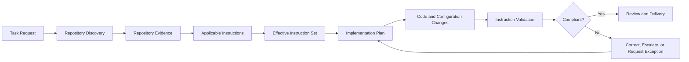
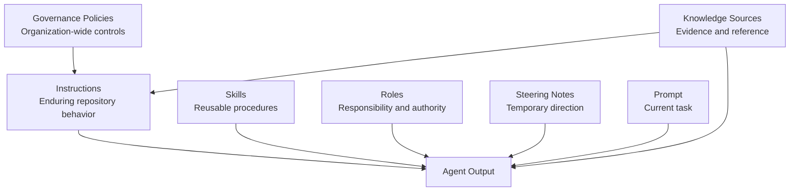
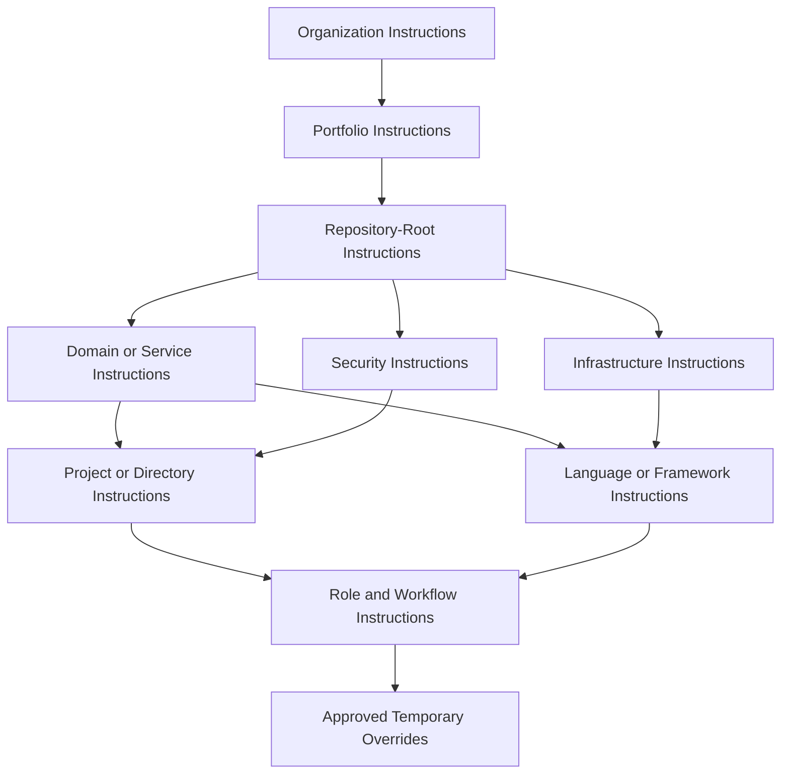
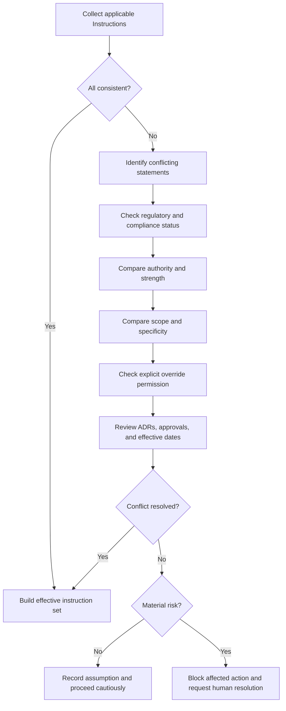
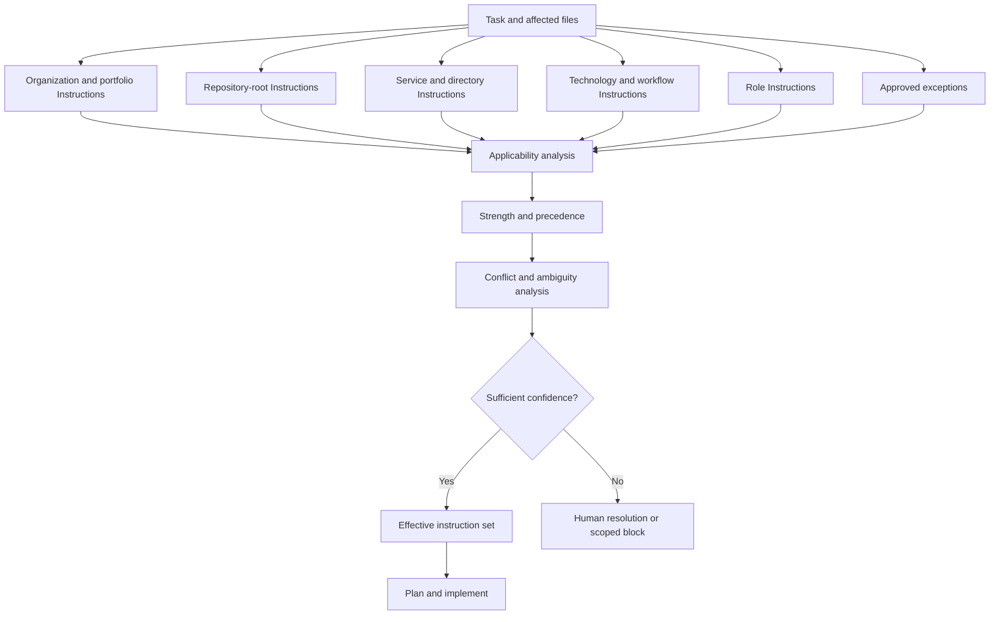
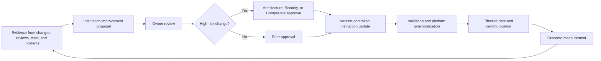
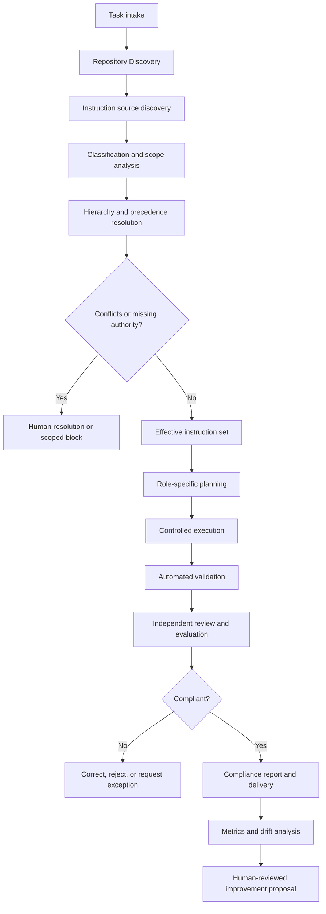
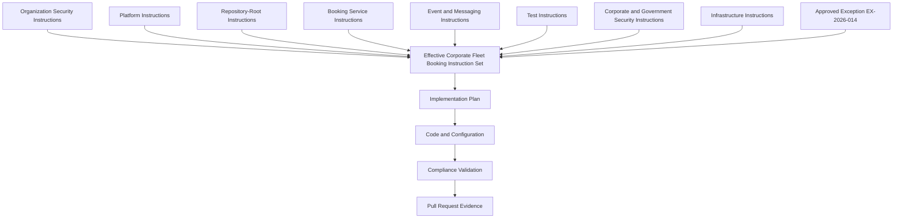

# Chapter 6 — Instructions

The repository was no longer unfamiliar.

During repository discovery, the Alpha Car Detailing engineering team had asked an AI agent to examine the platform before implementing corporate fleet booking. The agent had identified the relevant services, traced the major dependencies, reviewed the solution structure, inspected architecture tests, examined deployment assets, and mapped the primary data and integration boundaries.

The discovery evidence appeared strong.

Booking Service owned reservations. Corporate Account Service owned corporate customer eligibility and contractual entitlements. Fleet Service owned corporate vehicles. Station Operations Service owned station capacity, operating hours, service-bay availability, and local scheduling restrictions. Billing Service owned invoicing and payment obligations. Notification Service handled customer and operational communications.

Each service owned its own database. Public APIs and integration events were versioned. Shared contracts existed in controlled packages. Kubernetes manifests, Infrastructure as Code, CI/CD pipelines, unit tests, integration tests, and architecture tests were all present.

The agent therefore understood **what the repository contained**.

It did not yet understand, with sufficient authority, **how changes were required to be implemented**.

The corporate fleet booking request appeared straightforward:

> Allow an authorized corporate fleet coordinator to reserve detailing services for multiple registered vehicles at an eligible station.

A repository-informed agent could identify the likely implementation path. It could add an endpoint to Booking Service, retrieve fleet and account information, validate station availability, create reservations, publish events, and extend the automated tests.

Yet several materially different implementations would satisfy the visible feature request.

The agent could query the Corporate Account database directly to reduce network calls. It could place eligibility and scheduling logic in the API controller. It could introduce a synchronous dependency from Booking Service to Station Operations Service even if the platform preferred event-driven coordination. It could publish an event without a schema version. It could commit the booking transaction and publish the event separately, creating a consistency gap. It could omit idempotency because the endpoint appeared internal. It could authorize requests using a broad role check rather than the platform’s policy-based authorization model.

The agent could also expose exception details through an API response, add a convenient package that had not passed licensing review, store a development credential in `appsettings.json`, skip integration tests because unit tests passed, or modify a shared contract without architecture approval.

None of these decisions would necessarily result from poor repository discovery.

They would result from the absence, ambiguity, or ineffective application of **Instructions**.

Repository code provides evidence of existing implementation. It does not automatically establish which behavior is mandatory, which behavior is accidental, which behavior is legacy, which behavior is temporarily tolerated, or which behavior is prohibited.

A repository may contain direct database access that predates service boundaries. It may contain controllers with business logic that the architecture team is actively eliminating. It may contain unversioned events from an earlier integration model. It may contain credentials committed before secret-scanning controls were introduced. It may contain incomplete tests around code that is scheduled for remediation.

Existing code is therefore an important knowledge source, but it is not unquestionable engineering authority.

Instructions provide that authority.

An Instruction states how repository work must be performed. It defines enduring engineering behavior, boundaries, obligations, prohibitions, validation expectations, and approval requirements. It converts organizational intent into guidance that an AI agent, developer, reviewer, or automated harness can discover, interpret, apply, and verify.

For Alpha Car Detailing, an applicable Instruction might state:

> Services must not read from or write to another service’s database. Cross-service information must be obtained through an approved versioned API, integration event, replicated read model, or other architecture-approved contract.

Another might state:

> State changes that must be published to other services must use the transactional outbox. A database transaction must not be committed independently of the corresponding integration-event record.

A security Instruction might require:

> Corporate and government account operations must use policy-based authorization. Role-name checks alone are insufficient for actions involving fleet eligibility, contractual pricing, billing responsibility, or government-account data.

A testing Instruction might require:

> New corporate booking behavior requires domain unit tests, persistence integration tests, API authorization tests, and contract tests for any modified public API or integration event.

These Instructions do not merely describe the repository. They govern work performed within it.

> **Architect’s Note**
>
> Repository Discovery establishes evidence about the current system. Instructions establish authoritative expectations for changing that system. Mature AI engineering requires both. Discovery without Instructions creates informed but unconstrained implementation. Instructions without discovery create governed but context-poor implementation.

## Learning Objectives

After completing this chapter, you will be able to:

* define Instructions as persistent, governed engineering guidance;
* distinguish Instructions from Skills, Prompts, Roles, Steering Notes, Knowledge Sources, and governance policies;
* design instruction scopes for organizations, portfolios, repositories, services, projects, technologies, environments, and workflows;
* establish an instruction hierarchy that accounts for authority, scope, specificity, strength, and regulatory status;
* determine precedence when multiple Instructions apply;
* classify Instructions by engineering concern and risk;
* assign explicit strength to Instructions, including mandatory, recommended, informational, and prohibited behavior;
* write Instructions that are specific, testable, traceable, maintainable, and enforceable;
* define architecture, security, testing, API, event, persistence, dependency, observability, infrastructure, and CI/CD Instructions;
* resolve instruction conflicts without allowing task convenience to override mandatory controls;
* assemble an effective instruction set for a specific change;
* validate instruction compliance through automated and human controls;
* govern instruction ownership, approval, exceptions, review, deprecation, and audit history;
* detect and remediate instruction drift;
* integrate instruction discovery, interpretation, enforcement, validation, and reporting into an AI harness;
* evaluate instruction effectiveness using quality and compliance outcomes rather than productivity measures alone;
* apply the instruction model across Claude Code, GitHub Copilot, OpenAI Codex, and future AI coding platforms.

## 6.1 From Repository Knowledge to Governed Action

Chapter 5 introduced Repository Discovery as a formal evidence-gathering discipline. Discovery establishes the repository’s current structure, architecture, dependencies, conventions, constraints, and state.

Its questions include:

* Which services and modules exist?
* Which component owns a business capability?
* Which database belongs to which service?
* Which APIs and events connect the system?
* Which architecture patterns are implemented?
* Which tests enforce structural boundaries?
* Which deployment assets and operational controls exist?
* Which sources are current and trustworthy?
* Where do contradictions, legacy patterns, and unresolved unknowns remain?

Instructions answer a different class of questions:

* Which implementation behavior is mandatory?
* Which architectural boundaries must be preserved?
* Which practices are prohibited?
* Which test suites must be added or executed?
* Which security controls apply?
* Which dependency decisions require approval?
* Which contracts must be versioned?
* Which exceptions are permitted?
* Who may approve those exceptions?
* Which evidence must be presented before a change can be accepted?

Discovery describes the environment in which work occurs. Instructions govern the work.



The distinction becomes especially important in mature enterprise repositories. Such repositories frequently contain several generations of architecture, platform conventions, security controls, and delivery practices. Some code expresses the desired architecture. Some code reflects temporary migration states. Some code survives only because replacing it would be expensive. Some code violates current standards but remains operationally critical.

An AI agent cannot safely determine engineering policy by counting patterns.

Suppose Repository Discovery finds that eight services use a transactional outbox while two older services publish directly to the message broker. Pattern frequency suggests that the outbox is dominant. It does not prove whether the outbox is mandatory, recommended, or optional.

Suppose most API endpoints use policy-based authorization, while several administrative endpoints use direct role checks. The agent cannot infer whether those endpoints represent approved exceptions, incomplete migration, or security defects.

Suppose a shared project contains business calculations used by three services. Its existence does not establish that adding more cross-domain logic to the project is acceptable. The architecture team may consider the project a known liability.

Instructions remove these ambiguities when they are well designed and properly governed.

### 6.1.1 The limits of inference

AI coding agents are powerful inference systems. That strength can become a liability when enterprise expectations remain implicit.

An agent may infer:

* naming conventions from existing types;
* dependency direction from project references;
* event structures from published schemas;
* testing patterns from neighboring test projects;
* deployment conventions from Kubernetes manifests;
* logging practices from current instrumentation.

These inferences are useful, but they remain probabilistic. Critical engineering constraints should not depend exclusively on probabilistic interpretation when they can be stated explicitly.

The more consequential the decision, the less acceptable it is to rely on silent inference.

Examples include:

* access to government customer data;
* use of privileged cloud identities;
* handling of payment information;
* cross-service database access;
* modification of public contracts;
* introduction of synchronous service dependencies;
* disabling of security checks;
* changes to audit-event behavior;
* production infrastructure modifications;
* dependency licensing exceptions;
* data retention changes;
* bypassing human approval.

The core principle of this chapter is therefore:

> **An AI agent should not be expected to infer critical enterprise engineering standards from repository code alone when those standards can be explicitly defined, versioned, governed, validated, and enforced through Instructions.**

### 6.1.2 Instructions as executable governance context

Instructions are not executable in the same way that application code is executable. They do, however, participate directly in execution decisions.

An effective Instruction changes what an agent plans, what it edits, what it refuses to edit, which tools it runs, which validations it performs, and when it requests human approval.

Consider the corporate fleet booking feature.

Without Instructions, the agent’s implementation plan might be:

1. Add a bulk-booking endpoint.
2. Read corporate eligibility data.
3. check fleet vehicles.
4. check station availability.
5. save bookings.
6. publish a confirmation event.
7. add tests.

With applicable Instructions, the plan becomes materially more precise:

1. Add a versioned endpoint to Booking Service because Booking Service owns reservation creation.
2. Enforce the `CorporateFleetBooking` authorization policy.
3. Obtain account eligibility through the approved Corporate Account Service contract; do not access its database.
4. Obtain vehicle ownership through Fleet Service or an approved replicated read model.
5. use the Station Operations capacity contract; do not reproduce station scheduling rules in Booking Service.
6. keep orchestration in the application layer and domain invariants in the domain model; do not place business decisions in the controller.
7. use an idempotency key for externally retryable booking commands.
8. commit booking records and integration-event records through the transactional outbox.
9. publish a versioned `CorporateFleetBookingCreated` event owned by Booking Service.
10. propagate the correlation identifier through APIs, persistence, logs, traces, and events.
11. return expected failures as RFC 7807 Problem Details.
12. exclude confidential contract details and vehicle identifiers from logs.
13. add domain, integration, authorization, contract, and architecture tests appropriate to the change.
14. execute dependency, security, contract, container, and infrastructure validations required by CI.
15. request architecture approval before modifying shared public contracts or introducing a new cross-service dependency.

The second plan is not merely more detailed. It is governed.

## 6.2 What Is an Instruction?

An **Instruction** is persistent engineering guidance that governs how work must be performed within a defined scope.

Instructions may define:

* architecture constraints;
* domain ownership;
* coding and implementation standards;
* testing obligations;
* security requirements;
* dependency policies;
* API and event conventions;
* data ownership;
* error-handling behavior;
* observability requirements;
* CI/CD expectations;
* documentation standards;
* review obligations;
* prohibited actions;
* exception processes;
* human approval requirements.

Three characteristics distinguish an Instruction.

First, it is **persistent**. It remains applicable beyond a single task, conversation, sprint, or agent session unless explicitly time-bounded.

Second, it is **governing**. It influences or constrains implementation behavior rather than merely providing background information.

Third, it has **scope**. It applies to a defined organizational level, repository area, technology, workflow, role, environment, or class of change.

An Instruction may be expressed in a repository-root file, a service-level guidance file, an architecture standard, a security instruction set, a test-specific document, or a platform-recognized mechanism such as `CLAUDE.md` or `AGENTS.md`. The storage mechanism is secondary. The handbook concept remains the same.

### 6.2.1 Instructions are not informal preferences

A statement such as “we usually use MediatR” does not necessarily constitute an Instruction.

It might describe:

* current implementation history;
* a team preference;
* a default that can be changed freely;
* a pattern used only in selected services;
* an obsolete convention;
* an unapproved personal opinion.

An Instruction should make its governing intent clear.

For example:

> Application-layer command and query handling in Booking Service must use the approved request-handler abstraction. Introducing a second in-process messaging framework requires platform architecture approval.

This statement defines required behavior, scope, and an approval boundary.

### 6.2.2 Instructions are not generic documentation

Documentation explains a system. Instructions govern changes to it.

An architecture overview may state:

> Booking Service communicates with Billing Service after a reservation is completed.

An Instruction may state:

> Booking Service must notify Billing Service of billable reservation completion through a versioned integration event. A direct write to the Billing database is prohibited. Introducing a synchronous billing command requires architecture approval and documented failure-mode analysis.

The overview provides knowledge. The Instruction defines acceptable behavior.

The same document may contain both information and Instructions, but the distinction should remain visible. Otherwise, agents and reviewers cannot reliably determine which statements are explanatory and which are mandatory.

### 6.2.3 Instructions are not platform configuration

Configuration controls runtime or tool behavior through settings. Instructions communicate engineering expectations to human and AI actors.

A `.editorconfig` setting that requires spaces is configuration.

An Instruction stating that all public asynchronous methods must accept a `CancellationToken` is governing engineering guidance.

A package feed declaration is configuration.

An Instruction prohibiting packages from unapproved public feeds is governing guidance.

The two may support each other, but they are not interchangeable.

### 6.2.4 Instructions are not conversational reminders

A developer might tell an agent:

> Remember to use the outbox for this change.

That reminder may help the current task, but it is not an adequate substitute for a persistent Instruction if the outbox is an enduring architectural requirement.

Conversational guidance is easy to omit, lose, contradict, or misapply. Critical standards should be represented in persistent, version-controlled form.

> **Common Mistake**
>
> Teams often compensate for missing Instructions by placing increasingly detailed requirements into every task Prompt. This duplicates standards, increases inconsistency, and makes compliance depend on the quality of each individual request.

## 6.3 Instructions and Related AI Engineering Assets

Instructions operate alongside Skills, Prompts, Roles, Steering Notes, Knowledge Sources, and governance policies. These assets are related, but they are not interchangeable.

| Asset             | Primary purpose                                                                             |         Typical lifespan | Governing authority                                                       | Example                                                                     |
| ----------------- | ------------------------------------------------------------------------------------------- | -----------------------: | ------------------------------------------------------------------------- | --------------------------------------------------------------------------- |
| Instruction       | Define enduring behavior, constraints, obligations, and prohibitions                        |               Long-lived | Repository, architecture, security, platform, or governance owner         | “Services must not access another service’s database.”                      |
| Skill             | Define a reusable procedure for performing recurring work                                   | Long-lived but evolvable | Skill owner or engineering capability owner                               | “Create a versioned integration-event consumer with retry and idempotency.” |
| Prompt            | Define the current task and requested outcome                                               |            Task-specific | Requester within granted authority                                        | “Implement corporate fleet booking.”                                        |
| Role              | Define responsibilities, perspective, decision authority, and expected outputs              |                 Reusable | Harness or organizational design                                          | “Architecture Reviewer evaluates boundary and dependency changes.”          |
| Steering Note     | Define temporary mission direction, current constraints, priorities, or acceptance criteria |              Short-lived | Product, technical, or delivery leadership                                | “This sprint excludes Billing Service changes.”                             |
| Knowledge Source  | Provide evidence, reference material, or context                                            |                 Variable | Source owner                                                              | ADR, API specification, domain glossary, operational runbook                |
| Governance Policy | Define organizational controls across repositories or business units                        |               Long-lived | Enterprise governance, legal, compliance, security, or platform authority | “Production secrets must be managed through approved secret stores.”        |

### 6.3.1 Instructions define enduring behavior

Instructions answer questions such as:

* What must always happen?
* What must never happen?
* Which conditions require approval?
* Which validations are mandatory?
* Which architecture boundaries apply?
* Which exceptions are permitted?

For Alpha Car Detailing:

> Every externally retryable create command must support idempotent processing.

This remains applicable across multiple feature Prompts.

### 6.3.2 Skills define reusable procedures

A Skill describes how to perform a recurring engineering activity within applicable Instructions.

For example, an `implement-idempotent-command` Skill may describe:

1. identify the idempotency boundary;
2. select the request key;
3. persist request state;
4. protect concurrent execution;
5. return the original result for duplicate requests;
6. add integration tests;
7. expose metrics for duplicate detection.

The Skill does not decide whether idempotency is required. The Instruction does.

The Skill explains how to implement it correctly when required.

### 6.3.3 Prompts define current work

A Prompt describes the desired task outcome.

> Add corporate fleet booking to Booking Service.

The Prompt does not possess unlimited authority. It must operate inside applicable Instructions.

A Prompt asking for “the fastest possible implementation” does not authorize cross-service database access, skipped security validation, or removal of required tests.

### 6.3.4 Roles define responsibility and decision authority

A Role defines what an agent is responsible for evaluating or producing.

A Developer Role may implement the change.

A Reviewer Role may examine code quality and instruction compliance.

An Architecture Reviewer Role may determine whether a new service dependency is permitted.

A Security Reviewer Role may assess changes involving government account data.

Roles do not replace Instructions. They establish who applies, validates, interprets, or approves them.

### 6.3.5 Steering Notes define temporary direction

A Steering Note captures temporary mission context.

For example:

> Corporate fleet booking must be delivered without modifying Billing Service during the current release window. Billing integration will use the existing reservation-completed event.

This constraint may apply only to the current release.

It should not be permanently encoded as a repository Instruction unless the restriction becomes an enduring engineering requirement.

A Steering Note also cannot silently weaken a mandatory Instruction. A note stating “skip authorization tests to meet the deadline” has no legitimate precedence over a security or testing Instruction unless an authorized exception process explicitly permits it.

### 6.3.6 Knowledge Sources provide evidence

An ADR explaining why Alpha Car Detailing adopted transactional outbox processing is a Knowledge Source.

An Instruction requiring transactional outbox processing for cross-service state-change events is governing guidance.

The ADR provides rationale and architectural history. The Instruction defines current required behavior.

An effective Instruction should link to its supporting Knowledge Sources when the rationale or decision history is important.

### 6.3.7 Governance policies operate across broader boundaries

An enterprise governance policy may require that all production credentials be stored in approved secret-management systems.

Repository Instructions translate that policy into local engineering behavior:

> Kubernetes workloads must reference secrets through the approved external-secrets integration. Secret values must not appear in repository files, Helm values, deployment manifests, pipeline variables stored as plain text, or application configuration committed to source control.

Governance policy defines the organizational control. Repository Instructions operationalize it for the codebase.



> **Enterprise Tip**
>
> Store each kind of guidance in the asset designed for it. Permanent standards belong in Instructions. Reusable implementation procedures belong in Skills. Sprint-specific constraints belong in Steering Notes. Current outcomes belong in Prompts. Mixing these concerns makes precedence, ownership, and maintenance unnecessarily difficult.

## 6.4 Instruction Scope

Every Instruction requires a scope.

Scope determines where, when, and to whom the Instruction applies. Without scope, an otherwise clear statement may be applied too broadly, too narrowly, or not at all.

Instruction scope can be modeled across several dimensions:

* organizational boundary;
* repository boundary;
* directory or project boundary;
* domain or service boundary;
* technology boundary;
* file category;
* workflow;
* agent Role;
* deployment environment;
* change type;
* data classification;
* operational risk.

An Instruction may apply to one or several dimensions simultaneously.

For example:

> Production Kubernetes workloads processing government account data must use the government-workload managed identity and must not share an identity with public customer workloads.

This Instruction is scoped by:

* environment: production;
* infrastructure technology: Kubernetes;
* workload category: government-account processing;
* identity type: managed identity;
* security classification: government data.

### 6.4.1 Organization-wide Instructions

Organization-wide Instructions apply across repositories, portfolios, or business units.

Typical subjects include:

* secret management;
* approved source-control practices;
* software composition analysis;
* dependency licensing;
* data classification;
* production access;
* vulnerability remediation;
* audit logging;
* human approval for high-risk operations;
* use of AI coding agents;
* prohibited data exposure.

An Alpha Car Detailing organization-wide Instruction might state:

> Credentials, tokens, certificates, private keys, and connection secrets must be stored only in approved secret-management systems. They must not be committed to source control, embedded in container images, written to logs, or included in agent Prompts.

Repository-level Instructions may specialize how this requirement is implemented, but they cannot silently weaken it.

### 6.4.2 Portfolio Instructions

A portfolio may contain several related repositories that share architecture, platform, regulatory, or delivery expectations.

Alpha Car Detailing may maintain separate repositories for:

* business services;
* mobile applications;
* data and analytics;
* platform engineering;
* Infrastructure as Code;
* shared contracts;
* AI harness automation.

Portfolio Instructions can establish:

* supported .NET versions;
* shared package sources;
* integration-event conventions;
* observability standards;
* container base images;
* CI/CD controls;
* API compatibility expectations;
* service ownership models.

Portfolio scope prevents every repository from independently redefining foundational engineering standards.

### 6.4.3 Repository-root Instructions

Repository-root Instructions apply by default to the entire repository.

They typically define:

* architecture principles;
* repository structure;
* dependency constraints;
* general coding standards;
* test expectations;
* security baseline;
* approved build and validation commands;
* documentation requirements;
* prohibited actions;
* approval boundaries.

For the Alpha Car Detailing service repository, root Instructions might establish that:

* each service owns its database;
* domain projects cannot depend on infrastructure;
* public contracts require versioning;
* state-change events require the outbox;
* secrets cannot be committed;
* all changes must pass architecture and security tests;
* agents cannot modify Instructions without explicit human approval.

Root Instructions should define the common baseline without absorbing every service-specific detail.

### 6.4.4 Directory and project Instructions

Directory-level Instructions apply to a subtree or file category.

Examples include:

* all files under `/services/booking`;
* all Terraform files under `/infra`;
* all contract definitions under `/contracts`;
* all tests under `/tests`;
* all Kubernetes assets under `/deploy/kubernetes`;
* all generated clients under `/generated`.

Directory scope is useful when repository areas have distinct responsibilities and validation requirements.

For example:

> Files under `/contracts/integration-events` define public cross-service schemas. Changes require compatibility analysis, schema-version review, contract tests, and architecture approval.

A narrower directory Instruction may add obligations that do not apply to ordinary internal code.

### 6.4.5 Service Instructions

Service Instructions define behavior within a bounded service.

Booking Service Instructions may specify:

* reservation ownership;
* booking aggregate invariants;
* allowed dependencies;
* orchestration boundaries;
* idempotency expectations;
* event ownership;
* supported persistence patterns;
* service-specific tests;
* authorization policies;
* operational metrics.

For example:

> Booking Service owns reservation creation and lifecycle state. It may validate external account, fleet, and station facts through approved contracts, but it must not reproduce the authoritative business rules owned by Corporate Account, Fleet, or Station Operations services.

This Instruction is more specific than a repository-wide statement about service autonomy, but it does not weaken it.

### 6.4.6 Language-specific Instructions

Language-specific Instructions apply to code written in a particular language.

For .NET code, Alpha Car Detailing may define:

* nullable reference types;
* asynchronous API conventions;
* cancellation-token propagation;
* dependency injection;
* analyzer requirements;
* serialization behavior;
* exception handling;
* package versioning;
* test framework conventions.

For example:

> Public asynchronous application and infrastructure methods must accept and propagate `CancellationToken` unless the underlying operation is intentionally non-cancellable and the reason is documented.

A language-specific Instruction should not be placed in every service file if a single portfolio or repository Instruction can govern all .NET projects consistently.

### 6.4.7 Framework-specific Instructions

Framework Instructions apply to a particular framework or platform.

Examples include:

* ASP.NET Core API behavior;
* EF Core migration practices;
* OpenTelemetry instrumentation;
* Kubernetes probes;
* Terraform modules;
* GitHub Actions;
* Azure DevOps pipelines.

An EF Core Instruction might state:

> Database migrations must be generated in the owning service’s Infrastructure project, reviewed as source code, validated against a disposable instance of the supported database provider, and applied through the deployment pipeline. Application startup must not automatically migrate production databases.

### 6.4.8 Infrastructure Instructions

Infrastructure Instructions govern:

* Infrastructure as Code;
* cloud identities;
* network controls;
* secret references;
* container images;
* Kubernetes resources;
* deployment approvals;
* environment-specific configuration;
* rollback capabilities;
* manual production changes.

For example:

> Production cloud resources must be changed through version-controlled Infrastructure as Code. Manual portal changes are prohibited except during an approved incident response, and all emergency changes must be reconciled into source control after the incident.

### 6.4.9 Test Instructions

Test Instructions may apply to:

* all tests;
* a test category;
* a service;
* public contract changes;
* persistence changes;
* security-sensitive behavior;
* performance-critical paths.

They should define obligations by risk and behavior rather than relying exclusively on a universal coverage percentage.

For example:

> Changes to station-capacity allocation require concurrency-focused integration tests because multiple booking requests may compete for the same service-bay capacity.

### 6.4.10 Security Instructions

Security Instructions often combine broad authority with precise applicability.

Examples include:

* authorization requirements for corporate and government operations;
* logging restrictions for sensitive fields;
* identity boundaries between workloads;
* encryption requirements;
* input-validation obligations;
* dependency scanning;
* security approval for high-risk changes.

Because security Instructions often derive from organization-wide governance or compliance obligations, narrower scopes may specialize their implementation but must not silently weaken them.

### 6.4.11 Role-specific Instructions

Some Instructions apply to a particular agent Role.

A Developer Role Instruction might require:

> The Developer Agent must not approve its own architecture exception.

A Reviewer Role Instruction might require:

> The Reviewer Agent must report each applicable mandatory Instruction as verified, violated, exception-approved, or unverifiable.

A Harness Lead Role Instruction might require:

> The Lead Agent must block implementation when unresolved instruction conflicts affect security, compliance, data ownership, or public contract compatibility.

Role-specific Instructions govern responsibility. They do not create authority beyond the role’s approved boundaries.

### 6.4.12 Workflow Instructions

Workflow Instructions apply to activities such as:

* feature implementation;
* dependency upgrades;
* schema migration;
* incident remediation;
* release preparation;
* contract modification;
* infrastructure deployment;
* security exception handling.

For example:

> A public integration-event change must include compatibility analysis, consumer-impact identification, contract tests, schema-version decision, and approval from the contract owner before merge.

### 6.4.13 Environment-specific Instructions

Environment-specific Instructions may apply to:

* local development;
* test;
* staging;
* preproduction;
* production;
* disaster recovery;
* government-isolated environments.

For example:

> Production debugging must not enable verbose request-body logging. Diagnostic changes involving customer payloads require security and operations approval.

Environment-specific Instructions should not create a lower security standard merely because an environment is non-production. Test environments frequently contain production-like or copied data and must be governed accordingly.

### 6.4.14 Temporary approved overrides

A temporary override is a formally approved exception to an applicable Instruction.

It should define:

* the Instruction being overridden;
* the reason;
* the precise scope;
* the approving authority;
* compensating controls;
* effective date;
* expiration date;
* remediation owner;
* evidence required for closure.

A temporary override is not equivalent to a task Prompt or Steering Note.

For example:

> Exception `EX-2026-014` permits Booking Service to call the legacy Fleet eligibility endpoint synchronously until the replicated eligibility read model is available. The exception applies only to corporate fleet booking, expires on 30 September 2026, requires a two-second timeout, circuit breaker, operational metric, and fallback response, and is approved by Platform Architecture and Security.

The explicit exception preserves visibility and accountability. A Prompt saying “use the old endpoint for now” does not.

### 6.4.15 Scope inheritance

Scope often follows repository structure, but file proximity alone is insufficient.

A root Instruction may apply to every service. A service Instruction may add narrower behavior. A security Instruction stored outside the service directory may still have greater authority than a nearby implementation preference. A regulatory Instruction may apply based on data classification rather than path.

The applicable Instruction set must therefore be calculated using both structural and semantic scope.



The diagram resembles a hierarchy, but applicability does not always flow through a single path. A Booking Service change may simultaneously inherit repository, service, .NET, EF Core, API, security, test, and role Instructions.

> **Decision Point**
>
> When deciding whether to create a new instruction file, ask whether the guidance has a distinct scope, owner, change cadence, or validation method. Do not create another file merely because a new directory exists.

## 6.5 Instruction Hierarchy

Instruction hierarchy establishes levels of authority and specialization.

A suitable enterprise hierarchy is:

1. regulatory and compliance requirements;
2. organizational governance Instructions;
3. enterprise platform Instructions;
4. repository-root Instructions;
5. domain or service Instructions;
6. project or directory Instructions;
7. technology, workflow, and Role Instructions;
8. temporary approved task overrides.

This order is not a simplistic “highest file wins” model. It represents typical authority boundaries. Actual precedence must consider authority, applicability, specificity, strength, and explicit override permission.

| Hierarchy level               | Typical owner                                          | Typical concerns                                           | Can lower levels specialize it? | Can lower levels weaken it silently? |
| ----------------------------- | ------------------------------------------------------ | ---------------------------------------------------------- | ------------------------------: | -----------------------------------: |
| Regulatory and compliance     | Legal, compliance, risk                                | Retention, privacy, government controls, auditability      |                             Yes |                                   No |
| Organizational governance     | Security, architecture council, engineering governance | Secrets, AI usage, dependency licensing, production access |                             Yes |                                   No |
| Enterprise platform           | Platform engineering                                   | Runtime versions, identity, observability, CI/CD baseline  |                             Yes |                                   No |
| Repository root               | Repository maintainers, architecture owner             | Architecture, boundaries, tests, delivery workflow         |                             Yes |         No for mandatory constraints |
| Domain or service             | Domain owner, service team                             | Ownership, invariants, contracts, local patterns           |                             Yes |                  Only where explicit |
| Project or directory          | Component owner                                        | File-category or project-specific behavior                 |                             Yes |                  Only where explicit |
| Technology, workflow, or Role | Capability owner, harness owner                        | .NET, EF Core, Terraform, review, execution behavior       |                             Yes |                  Only where explicit |
| Temporary approved override   | Named approval authority                               | Time-bounded exception                                     |                    Not normally |           Only within approved scope |

### 6.5.1 Authority

Authority identifies who established the Instruction and what mandate that owner possesses.

A security Instruction approved by the Chief Information Security Office has different authority from a local development preference.

An architecture Instruction approved through an ADR process has different authority from a code comment.

An Instruction’s authority should be discoverable through ownership metadata, repository history, approval records, or linked governance sources.

### 6.5.2 Scope

An Instruction must apply to the task before it can affect precedence.

An infrastructure Instruction governing Terraform does not apply to a domain-only C# change unless that change also modifies infrastructure.

A government-data Instruction applies when the affected workflow processes government account data, even if the files are located in a shared service directory.

### 6.5.3 Specificity

A more specific Instruction may specialize a broader one.

A repository Instruction may require structured logging. A Booking Service Instruction may define the exact booking operation names and required dimensions.

The narrower Instruction is more specific, but it must remain consistent with the broader requirement.

### 6.5.4 Instruction strength

A mandatory security Instruction outranks a recommended implementation preference, even when the recommendation is more specific.

For example:

* Repository security Instruction: “Sensitive customer identifiers must not be logged.” — Mandatory.
* Booking Service Instruction: “Include vehicle registration details in booking diagnostic logs.” — Recommended.

These Instructions conflict. The mandatory security Instruction prevails. The service Instruction must be corrected or interpreted to require a non-sensitive surrogate identifier.

### 6.5.5 Regulatory status

Regulatory and compliance obligations cannot be overridden through ordinary repository guidance.

A task Prompt cannot authorize the retention of government account data beyond an approved retention period.

A directory Instruction cannot authorize logging data prohibited by privacy requirements.

A temporary override cannot exist unless the governing compliance framework permits an exception and the authorized body approves it.

### 6.5.6 Explicit override permission

Some Instructions intentionally permit specialization or exception.

For example:

> Services must use the standard retry policy unless an approved service-specific resilience analysis documents a different retry strategy.

This Instruction allows a controlled specialization.

Without explicit permission, a lower-level Instruction should not be assumed to possess override authority.

### 6.5.7 Human approval

Some precedence questions require human judgment.

An AI agent may determine that two Instructions conflict. It may identify likely authority and scope. It may find linked ADRs and approval records.

It must not fabricate governance authority when ambiguity remains material.

The required principle is:

> **A narrower Instruction may specialize a broader Instruction but must not silently weaken mandatory security, regulatory, compliance, or architectural requirements.**

## 6.6 Instruction Precedence

Precedence determines which Instruction controls when multiple applicable Instructions differ or conflict.

A robust precedence decision evaluates:

1. applicability;
2. regulatory status;
3. authority;
4. instruction strength;
5. explicit override permission;
6. scope;
7. specificity;
8. approval status;
9. effective date and recency;
10. supporting architecture or governance records.

Recency matters, but newer is not automatically stronger. A recently added team preference does not override an older regulatory control. Likewise, an outdated Instruction may still remain authoritative until formally superseded, although it should be flagged for review.

### 6.6.1 Can a task Prompt override a repository Instruction?

Ordinarily, no.

A task Prompt defines the current outcome. It does not possess inherent authority to override persistent mandatory Instructions.

A Prompt may select among alternatives already permitted by Instructions. It may also reference a formally approved exception. It cannot create that exception merely by requesting prohibited behavior.

Prompt:

> Implement corporate fleet booking as quickly as possible. Call the Corporate Account database directly to avoid API work.

Applicable Instruction:

> Services must not access another service’s database.

The agent must reject the requested implementation approach while continuing to pursue the legitimate feature outcome through an approved contract.

### 6.6.2 Can a service Instruction override a root Instruction?

A service Instruction may specialize a root Instruction when:

* the root Instruction permits specialization;
* the service Instruction remains within its scope;
* the service owner has appropriate authority;
* mandatory controls are not weakened;
* the specialization is consistent with regulatory, security, and architecture obligations.

For example:

Root Instruction:

> Cross-service queries must use an approved API or replicated read model.

Service Instruction:

> Booking Service must use the Fleet Eligibility read model for vehicle ownership checks. Direct Fleet Service calls are reserved for administrative reconciliation workflows.

The service Instruction specializes the approved mechanism without weakening the root boundary.

### 6.6.3 Can a Steering Note override a security Instruction?

No, not silently.

A Steering Note may reference a formally approved security exception. It cannot create one by assertion.

A sprint note stating “temporarily log full request payloads to troubleshoot government bookings” is insufficient. The agent must require the approved security process, defined scope, redaction review, access controls, retention limit, and removal plan.

### 6.6.4 Can an agent ignore an Instruction because existing code violates it?

No.

Existing violations do not cancel an Instruction.

The agent should:

* preserve the Instruction for new work;
* avoid expanding the violation;
* report the contradiction;
* determine whether the touched code must be remediated;
* request guidance when compliance would materially expand scope;
* identify any approved legacy exception.

For example, if an older Booking Service handler publishes directly to the broker but current Instructions require the outbox, the agent should not copy the older implementation into the new corporate booking flow.

### 6.6.5 What happens when two instruction files conflict?

The agent must not select whichever Instruction is closer to the edited file or easier to implement.

It should:

1. identify the conflicting statements;
2. establish applicability;
3. compare authority;
4. compare strength;
5. examine scope and specificity;
6. check explicit override permissions;
7. inspect effective dates and linked decisions;
8. preserve mandatory security, regulatory, and architecture constraints;
9. record the conflict;
10. request human resolution if ambiguity remains material.

### 6.6.6 Who approves exceptions?

Exception authority should be defined by the Instruction or governance model.

Examples include:

* Architecture Council for service-boundary exceptions;
* Security Architecture for authentication or secret-management exceptions;
* Data Governance for retention or classification exceptions;
* Platform Engineering for unsupported runtime or infrastructure patterns;
* Contract Owner for compatibility-breaking API or event changes;
* Operations for production deployment exceptions;
* Compliance or Legal where regulated obligations are involved.

The feature requester is not automatically the exception approver.

### 6.6.7 What should an agent do when precedence remains ambiguous?

The agent should block the unsafe or irreversible portion of the implementation.

It may continue with unaffected work, such as:

* adding internal domain models;
* creating tests that do not depend on the unresolved decision;
* documenting implementation alternatives;
* preparing a compatibility analysis;
* identifying required approvers.

It should not make a material architectural, security, or compliance decision through convenience-based inference.



> **Real-World Scenario**
>
> The Alpha Car Detailing root Instructions require integration events for cross-service state-change notifications. A Booking Service instruction file recommends synchronous HTTP calls for “immediate consistency.” The task Prompt asks for the fastest implementation, and existing code contains both patterns.
>
> The agent must not choose synchronous HTTP merely because it is quicker or already appears in the repository. It must determine whether the service Instruction has authority to specialize the root requirement, whether it applies to commands or only queries, whether an ADR approves the pattern, and whether an exception exists. If the conflict remains unresolved, the agent must escalate rather than invent precedence.

## 6.7 Instruction Classification

Classification helps enterprises organize, discover, assign, validate, and govern Instructions.

A professional classification model should include the following categories.

| Classification                  | Primary concern                                                | Alpha Car Detailing example                                                         |
| ------------------------------- | -------------------------------------------------------------- | ----------------------------------------------------------------------------------- |
| Architectural Instruction       | Structural boundaries and system shape                         | Services must not access another service’s database.                                |
| Domain Instruction              | Business ownership and invariants                              | Fleet Service owns vehicle-to-corporate-account association.                        |
| Implementation Instruction      | Local coding and design behavior                               | Application orchestration must not be implemented in API controllers.               |
| Security Instruction            | Protection, identity, access, and secure behavior              | Government booking operations require policy-based authorization and audit events.  |
| Testing Instruction             | Required evidence by change type                               | Public event changes require producer and consumer contract tests.                  |
| Dependency Instruction          | Package, framework, licensing, and version controls            | New external packages require approved source, license, and vulnerability review.   |
| API Instruction                 | HTTP contract and endpoint conventions                         | Expected failures must use RFC 7807 Problem Details.                                |
| Event and Messaging Instruction | Event ownership, schemas, delivery, retry, and idempotency     | State-change events must use the outbox and versioned schemas.                      |
| Persistence Instruction         | Data ownership, migrations, transactions, and storage behavior | Each service owns its migrations and database schema.                               |
| Operational Instruction         | Runtime behavior and production readiness                      | New background consumers require health, lag, retry, and poison-message metrics.    |
| Observability Instruction       | Logs, traces, metrics, and diagnostics                         | Correlation identifiers must propagate across API and event boundaries.             |
| Documentation Instruction       | Required technical and operational records                     | Public contract changes require updated contract documentation and migration notes. |
| Workflow Instruction            | Delivery and review process                                    | Architecture-affecting changes require an ADR or existing ADR reference.            |
| Prohibition                     | Explicitly forbidden behavior                                  | Secrets must not be stored in `appsettings.json`.                                   |
| Approval Requirement            | Human authorization boundary                                   | New synchronous service dependencies require architecture approval.                 |
| Exception Rule                  | Conditions for formal deviation                                | Temporary direct API use requires a time-bounded approved exception.                |
| Platform-Specific Instruction   | Tool-specific representation or execution behavior             | Claude must load root and service-level `CLAUDE.md` guidance before planning.       |

An Instruction may belong to more than one classification. A requirement for an outbox is architectural, persistence-related, event-related, and operational.

Classification should support multiple tags rather than forcing every Instruction into exactly one category.

### 6.7.1 Why classification matters

Classification improves:

**Ownership.** Security Instructions can be assigned to Security Engineering, while domain Instructions remain with service owners.

**Discovery.** An agent modifying an API contract can search specifically for API, security, documentation, and contract-testing Instructions.

**Validation.** Architectural Instructions may map to architecture tests; dependency Instructions may map to software composition analysis; infrastructure Instructions may map to policy-as-code.

**Governance.** High-risk classifications can require stronger review and more frequent recertification.

**Reporting.** A harness can report violation rates by classification and identify systemic weaknesses.

**Change impact.** Modifying a security or data-ownership Instruction may trigger a broader approval workflow than changing a preferred naming convention.

## 6.8 Instruction Strength

Instruction strength communicates how strictly an agent must follow the guidance.

A practical strength model includes:

| Strength                          | Meaning                                                              | Expected agent behavior                                          |
| --------------------------------- | -------------------------------------------------------------------- | ---------------------------------------------------------------- |
| Mandatory                         | Must be followed                                                     | Implement only in compliance; block or escalate if impossible    |
| Required unless formally exempted | Must be followed unless an approved exception exists                 | Search for valid exception; otherwise comply or request approval |
| Recommended                       | Strong default supported by engineering rationale                    | Follow unless a justified alternative is documented              |
| Preferred                         | Consistency preference where several valid options exist             | Use by default; alternative may be acceptable                    |
| Informational                     | Context that aids reasoning but does not constrain behavior directly | Consider during planning                                         |
| Prohibited                        | Must not be performed                                                | Refuse or block the prohibited action                            |

The difference between **Mandatory** and **Required unless formally exempted** is important.

A mandatory Instruction may represent a requirement for which no local exception process exists. A regulatory prohibition may fall into this category.

A requirement that permits controlled exceptions must identify the exception process and approval authority.

### 6.8.1 Vague strength creates inconsistent behavior

Consider:

> Prefer asynchronous communication where possible.

This statement does not establish:

* which interactions require asynchronous communication;
* what “where possible” means;
* when synchronous calls are allowed;
* whether the preference is mandatory;
* who approves deviations;
* how compliance is validated.

A stronger Instruction states:

> Cross-service state-change notifications must use versioned integration events. Synchronous APIs may be used for immediate queries or commands requiring a direct response. Introducing a new synchronous service dependency requires architecture approval and documented timeout, retry, circuit-breaker, and failure-mode analysis.

The stronger version defines:

* required behavior;
* permitted behavior;
* approval boundary;
* operational obligations;
* decision criteria.

### 6.8.2 Strength should match risk

Not every Instruction should be mandatory.

Overusing mandatory language creates several problems:

* harmless variation becomes governance overhead;
* teams seek informal workarounds;
* exceptions become routine;
* genuinely critical Instructions lose visibility;
* agents become over-constrained;
* instruction conflicts increase.

Mandatory strength is appropriate for areas such as:

* security boundaries;
* regulatory obligations;
* service data ownership;
* public contract compatibility;
* secret handling;
* production change control;
* required validation for high-risk changes.

Preferred or recommended strength is more appropriate for:

* internal naming conventions;
* non-critical code organization;
* local implementation patterns with multiple safe alternatives;
* documentation style;
* low-risk library choices within an approved set.

### 6.8.3 Prohibitions require explicit wording

A prohibition should state what is forbidden and, where useful, what approved alternatives exist.

Weak:

> Avoid direct database access.

Strong:

> A service must not read from or write to another service’s database. Use an approved versioned API, integration event, or replicated read model. Architecture approval is required for any temporary exception.

The word “avoid” allows convenience-based interpretation. “Must not” establishes a clear boundary.

> **Architect’s Note**
>
> Instruction strength is part of the architecture model. When strength is omitted, agents and reviewers are forced to invent it. That converts governance into interpretation.

## 6.9 The Anatomy of a Professional Instruction

A professional Instruction should contain enough information to be correctly interpreted, applied, validated, and governed.

Useful elements include:

| Element                       | Purpose                                                                   |
| ----------------------------- | ------------------------------------------------------------------------- |
| Identifier                    | Provides a stable reference                                               |
| Title                         | Summarizes the Instruction                                                |
| Purpose                       | Explains the intended outcome                                             |
| Scope                         | Defines where it applies                                                  |
| Applicability                 | Defines conditions that activate it                                       |
| Strength                      | States whether it is mandatory, recommended, prohibited, or another level |
| Required behavior             | Defines what must be done                                                 |
| Prohibited behavior           | Defines what must not be done                                             |
| Rationale                     | Explains why the Instruction exists                                       |
| Exceptions                    | Defines permitted deviations                                              |
| Examples                      | Demonstrates compliant and noncompliant behavior                          |
| Validation method             | Defines how compliance is assessed                                        |
| Owner                         | Identifies the responsible maintainer                                     |
| Approval authority            | Identifies who may change or exempt it                                    |
| Effective date                | States when it became active                                              |
| Review date                   | Defines when it should be reassessed                                      |
| Related architecture decision | Links governing rationale                                                 |
| Related Skill                 | Links reusable implementation procedure                                   |
| Related test or policy        | Links enforcement mechanisms                                              |

Not every Instruction needs full metadata.

A repository may reasonably express several low-risk implementation Instructions in concise prose. Excessive metadata can make guidance unreadable and discourage maintenance.

High-risk Instructions deserve stronger traceability. Security, architecture, compliance, public contract, data ownership, and production infrastructure Instructions should generally identify ownership, strength, validation, and approval boundaries.

### 6.9.1 Example: service database ownership

```markdown
## ACD-ARCH-004 — Service Database Ownership

**Classification:** Architectural, Persistence, Prohibition  
**Strength:** Mandatory  
**Scope:** All production services  
**Owner:** Enterprise Architecture  
**Approval authority:** Architecture Council  
**Effective date:** 2026-07-01  
**Review date:** 2027-01-01  
**Related ADR:** ADR-012 — Service Data Ownership

### Purpose

Preserve service autonomy, independent deployment, and explicit integration boundaries.

### Required behavior

A service must access business data owned by another service through an
approved versioned API, integration event, replicated read model, or
architecture-approved data product.

### Prohibited behavior

A service must not read from, write to, join against, or create database
objects in another service’s database.

### Exceptions

Temporary exceptions require Architecture Council approval, a defined
expiration date, compensating controls, and an approved migration plan.

### Validation

- Architecture review
- Database permission review
- Infrastructure policy
- Integration tests
- Harness dependency analysis
```

This structure is intentionally explicit because the Instruction protects a foundational architecture boundary.

### 6.9.2 Example: lower-risk code preference

A lower-risk Instruction may be concise:

```markdown
## Booking test naming

Use `MethodOrBehavior_WhenCondition_ExpectedOutcome` for new Booking Service
unit tests. Existing test names do not need to be renamed unless the test is
substantially modified.
```

The Instruction remains clear without requiring a governance record.

### 6.9.3 Rationale is not optional for consequential constraints

An Instruction without rationale can appear arbitrary. Agents and developers may then apply it mechanically or resist it unnecessarily.

Rationale supports:

* correct interpretation;
* exception analysis;
* future review;
* conflict resolution;
* drift detection;
* migration planning.

For example, the prohibition on cross-service database access exists to preserve ownership, deployment autonomy, security boundaries, and independent evolution. Understanding that rationale helps an architect evaluate whether a proposed read model satisfies the intent.

### 6.9.4 Validation should be stated where possible

An Instruction that cannot be validated may still be necessary, but its validation limitations should be visible.

For example:

> Domain projects must not reference Infrastructure projects.

Validation: architecture test and project-reference analysis.

Another Instruction might state:

> Business terms used in public contracts must align with the approved domain glossary.

This may require a combination of automated terminology checks and human domain review.

The validation method clarifies how compliance evidence will be produced.

## 6.10 Instruction Quality Model

Instruction quality determines whether guidance can be applied consistently by humans, AI agents, and automated harnesses.

A useful quality model evaluates:

* clarity;
* specificity;
* scope;
* rationale;
* testability;
* consistency;
* discoverability;
* maintainability;
* traceability;
* enforceability;
* ownership;
* freshness.

### 6.10.1 Clarity

The Instruction should use unambiguous language.

Weak:

> Keep services separate.

Improved:

> Each service owns its domain model, application logic, persistence schema, and database migrations. A service must not reference another service’s internal projects or database.

### 6.10.2 Specificity

The Instruction should define observable behavior and decision criteria.

Weak:

> Use events where appropriate.

Improved:

> Publish a versioned integration event when a committed state change must be communicated to another service. Use synchronous APIs for immediate queries or commands requiring a direct response. New synchronous service dependencies require architecture approval.

### 6.10.3 Scope

The Instruction should identify where it applies.

Weak:

> Use an outbox.

Improved:

> All service-owned state changes that publish integration events must persist the event in the same database transaction through the service’s transactional outbox.

### 6.10.4 Rationale

The Instruction should explain the engineering concern.

Weak:

> Do not add business logic to shared libraries.

Improved:

> Shared libraries must not contain cross-domain business logic because shared domain behavior creates ownership ambiguity and coordinated-release coupling. Shared libraries are limited to approved technical primitives and versioned contracts.

### 6.10.5 Testability

The Instruction should identify evidence where possible.

Weak:

> Follow Clean Architecture.

Improved:

> Domain projects must not reference Application, Infrastructure, API, or platform-specific packages. Application projects may reference Domain but must not reference Infrastructure. Infrastructure implementations must be registered through the API composition root. Architecture tests must verify these dependency constraints.

### 6.10.6 Consistency

Instructions should not contradict each other or use different terminology for the same concept.

If one file requires `ProblemDetails` and another requires a custom error envelope, the conflict must be reconciled or scoped explicitly.

### 6.10.7 Discoverability

Applicable Instructions must be easy to locate.

Discoverability depends on:

* predictable file placement;
* repository indexes;
* platform-recognized files;
* metadata;
* path associations;
* harness discovery;
* links from root Instructions;
* classification tags.

An excellent Instruction that the agent never loads has no operational effect.

### 6.10.8 Maintainability

Instructions should be modular enough to update but not fragmented into dozens of overlapping files.

Maintainability improves when:

* ownership is explicit;
* duplication is minimized;
* scope is clear;
* references are stable;
* obsolete Instructions are deprecated;
* platform-specific representations derive from shared sources where possible.

### 6.10.9 Traceability

Consequential Instructions should connect to:

* ADRs;
* policies;
* controls;
* tests;
* CI gates;
* owners;
* exception records;
* review history.

Traceability helps determine whether the Instruction remains authoritative.

### 6.10.10 Enforceability

An Instruction should identify whether it can be:

* statically enforced;
* dynamically tested;
* reviewed manually;
* validated by a harness;
* monitored operationally;
* enforced through access control;
* enforced through approval workflow.

Not all Instructions are fully automatable. Enforceability means that the organization has a credible compliance mechanism, not that every decision must be encoded in a linter.

### 6.10.11 Ownership

Every material Instruction set needs an owner.

Without ownership:

* conflicts remain unresolved;
* stale guidance persists;
* exceptions become informal;
* platform files diverge;
* review dates are ignored.

Ownership may belong to a team rather than an individual, but the responsible authority must be identifiable.

### 6.10.12 Freshness

Instructions should reflect the current architecture, platform, and governance model.

An Instruction referencing a retired service, obsolete package, deprecated runtime, or superseded ADR should be treated as suspect and reviewed.

### 6.10.13 Weak and improved examples

#### Example 1: architecture

Weak:

> Follow Clean Architecture.

Improved:

> Domain projects must not reference Application, Infrastructure, API, or platform-specific packages. Application projects may reference Domain but must not reference Infrastructure. Infrastructure implementations must be registered through the API composition root. Architecture tests must verify these dependency constraints.

#### Example 2: error handling

Weak:

> Handle errors properly.

Improved:

> Expected validation and domain errors must be returned as RFC 7807 Problem Details. Unexpected exceptions must be handled by centralized exception middleware, logged with the current correlation identifier, and excluded from response details.

#### Example 3: testing

Weak:

> Write tests.

Improved:

> New domain rules require unit tests. New persistence behavior requires integration tests against the supported database provider. Public API contract changes require contract tests. The pull request must include evidence of all affected test suites.

#### Example 4: security logging

Weak:

> Do not log sensitive data.

Improved:

> Logs must exclude access tokens, refresh tokens, secret values, government account identifiers, full vehicle registration numbers, payment details, and unredacted customer contact information. Use approved surrogate identifiers for correlation and diagnostics.

#### Example 5: dependencies

Weak:

> Avoid unnecessary packages.

Improved:

> A new external package may be introduced only when the required capability is not adequately provided by the approved platform stack or existing dependencies. The change must document purpose, license, maintenance status, vulnerability status, transitive dependencies, and package owner.

| Weak pattern                | Failure                     | Improved pattern                                                                        |
| --------------------------- | --------------------------- | --------------------------------------------------------------------------------------- |
| “Follow best practices.”    | No defined behavior         | Name the required practice and validation                                               |
| “Where possible.”           | Undefined decision boundary | State when the behavior is required and when alternatives are allowed                   |
| “Use secure coding.”        | Too broad to apply          | Define concrete authentication, authorization, validation, logging, and secret controls |
| “Add enough tests.”         | No risk model or evidence   | Map test categories to behavior and change type                                         |
| “Do not break anything.”    | Unverifiable                | Define compatibility, regression, and validation obligations                            |
| “Ask before major changes.” | “Major” is undefined        | List change categories and approval authority                                           |

> **Enterprise Tip**
>
> Review Instructions as if they were public APIs. Ambiguous wording, hidden assumptions, inconsistent terminology, and undocumented breaking changes create downstream failures for every human and AI actor that depends on them.

## 6.11 Architecture Instructions

Architecture Instructions protect the structural decisions that allow an enterprise system to evolve safely.

They should govern:

* dependency direction;
* domain boundaries;
* service ownership;
* shared libraries;
* cross-service communication;
* database ownership;
* API gateway responsibilities;
* event-driven integration;
* dependency inversion;
* composition roots;
* generated code;
* legacy integration;
* architecture decision records;
* approval of new dependencies.

### 6.11.1 Clean Architecture dependency direction

A generic statement to “use Clean Architecture” is insufficient. The dependency rules must be explicit.

For Alpha Car Detailing:

```markdown
### Clean Architecture dependency direction

- Domain projects must not reference Application, Infrastructure, API,
  persistence, messaging, hosting, or cloud platform packages.
- Application projects may reference Domain.
- Application projects must not reference Infrastructure or API projects.
- Infrastructure projects may implement Application or Domain abstractions.
- API and worker hosts act as composition roots.
- Dependency direction must be verified by architecture tests.
```

This Instruction turns an architectural label into enforceable constraints.

### 6.11.2 Domain boundaries

Each service should own a coherent business capability.

For corporate fleet booking:

* Booking Service owns reservation creation and lifecycle;
* Corporate Account Service owns contract eligibility and account status;
* Fleet Service owns corporate vehicles and account association;
* Station Operations Service owns station capacity and operational availability;
* Billing Service owns invoicing and payment;
* Notification Service owns delivery of notifications.

An applicable Instruction might state:

> Booking Service may orchestrate booking decisions using facts obtained from other services, but it must not redefine corporate eligibility, vehicle ownership, station-capacity, or billing rules owned by those services.

This prevents local duplication of authoritative domain logic.

### 6.11.3 Service database ownership

The service database boundary should be explicit:

> Services must not access another service’s database. Cross-service data must be obtained through approved APIs, versioned integration events, replicated read models, or governed analytical products.

Database ownership affects architecture, security, deployment, and organizational accountability. It should therefore be mandatory and validated through network access, database permissions, repository analysis, and architecture review.

### 6.11.4 Shared libraries

Shared libraries can become hidden integration layers.

A strong Instruction should define their permitted content:

> Shared libraries may contain approved technical primitives, common observability helpers, platform abstractions, and versioned contracts. They must not contain business workflows, domain entities shared across bounded contexts, or logic requiring coordinated releases between services.

For Alpha Car Detailing, a shared library may define a correlation abstraction or event envelope. It should not contain a `CorporateFleetBookingEligibilityCalculator` used by Booking, Corporate Account, and Fleet services. That logic requires a clear owner.

### 6.11.5 Cross-service communication

Instructions should distinguish:

* synchronous queries;
* synchronous commands;
* asynchronous state-change notifications;
* event-carried state transfer;
* replicated read models;
* batch integration;
* external legacy integration.

For example:

> Cross-service state-change notifications must use versioned integration events. Synchronous APIs may be used for immediate queries or commands requiring a direct response. New synchronous dependencies require architecture approval and resilience analysis.

This Instruction prevents a simplistic “events everywhere” interpretation while preserving the preferred integration model.

### 6.11.6 API gateway usage

An API gateway Instruction might state:

> External clients must access public service APIs through the approved API gateway. Internal service-to-service traffic must not be routed through the external gateway unless a documented platform requirement exists.

This avoids using the gateway as a universal service bus and keeps external concerns separate from internal topology.

### 6.11.7 Dependency inversion and composition roots

Instructions should protect application and domain code from infrastructure dependencies.

> Infrastructure implementations must be registered in the API or worker composition root. Domain and Application projects must not instantiate database contexts, message-broker clients, cache clients, cloud SDK clients, or HTTP clients directly.

The Instruction can be validated through project references, static analysis, and architecture tests.

### 6.11.8 Generated code

Generated code requires explicit treatment.

> Generated API clients and schema-derived models must be placed in designated generated directories and must not be edited manually. Custom behavior must be implemented through partial types, adapters, decorators, or generator configuration. Generated output must be reproducible in CI.

Without this Instruction, agents may “fix” generated files directly, creating changes that disappear during regeneration.

### 6.11.9 Legacy integration

Legacy code should not become the default pattern for new work.

> Legacy integration patterns may be extended only when the approved migration plan requires compatibility with the legacy system. New domain behavior must not be placed in legacy adapters. Any extension must preserve the anti-corruption boundary and reference the applicable migration decision.

### 6.11.10 Architecture decision records

Instructions should define when an ADR is required.

For example:

> Create or update an ADR when a change introduces a new service, changes domain ownership, adds a synchronous service dependency, changes persistence technology, modifies public contract-versioning strategy, introduces a new messaging pattern, or creates a long-lived exception to repository architecture.

An agent should not create an ADR for every implementation detail. It should create one when the decision has structural significance, alternatives, and long-term consequences.

> **Architect’s Note**
>
> Architecture Instructions should preserve architectural intent, not merely current folder structure. A repository can be reorganized without changing architecture, and it can violate architecture while retaining familiar directories.

## 6.12 Security Instructions

Security Instructions convert broad security expectations into concrete engineering behavior.

Statements such as “follow secure coding practices” or “protect customer data” are too general to guide an AI agent through implementation decisions. A professional security Instruction must define the required control, its scope, the protected asset, the expected evidence, and the authority required for exceptions.

Alpha Car Detailing serves walk-in customers, corporate fleets, rental companies, insurance companies, and government departments. These customers do not present identical risk profiles.

A walk-in customer booking may contain contact information, vehicle details, station selection, and payment references. A corporate fleet booking may additionally contain contractual pricing, account eligibility, vehicle assignments, departmental cost centers, and authorized coordinator information. A government booking may be subject to stronger identity, audit, data-handling, retention, and operational controls.

The implementation request may appear to concern booking behavior, but the applicable security Instructions may affect:

* endpoint exposure;
* authentication mechanism;
* authorization policy;
* identity propagation;
* audit-event generation;
* data minimization;
* log redaction;
* database encryption;
* secret management;
* service identity;
* test data;
* infrastructure segmentation;
* approval workflow.

Security Instructions should therefore be loaded early, not added as a final review checklist after implementation.

### 6.12.1 Authentication Instructions

Authentication Instructions define how identities are established and trusted.

For Alpha Car Detailing:

```markdown
### Authentication

- Public users must authenticate through the approved customer identity provider.
- Corporate fleet coordinators must authenticate through the approved
  enterprise identity federation.
- Government users must use the identity provider and tenant configuration
  approved for government accounts.
- Services must validate token issuer, audience, signature, lifetime, and
  required claims.
- Custom authentication schemes require Security Architecture approval.
- Application code must not manually parse unvalidated bearer tokens.
```

These Instructions prevent an agent from implementing a local authentication shortcut simply because it appears faster.

Authentication Instructions should also distinguish human identities from workload identities.

A user token should not be reused as a service credential where a dedicated workload identity is required. Similarly, a service identity should not be granted permissions intended for a human administrator.

### 6.12.2 Authorization Instructions

Authentication establishes who or what is calling. Authorization determines what the caller may do.

Corporate fleet booking requires more than checking whether the caller has a generic `CorporateUser` role.

The platform may need to verify:

* the caller belongs to the corporate account;
* the caller is authorized to schedule vehicles;
* the caller may act for the specified department or cost center;
* the vehicles belong to or are managed by the account;
* the requested service type is contractually permitted;
* the selected station is eligible for the customer;
* government-specific restrictions are satisfied.

A suitable Instruction is:

```markdown
### Corporate and government authorization

Corporate and government booking operations must use policy-based
authorization.

Authorization must evaluate the caller’s account relationship, granted
permissions, applicable department or cost-center scope, and the requested
resource.

Role-name checks alone are prohibited for operations involving contractual
pricing, fleet eligibility, billing responsibility, or government-account data.
```

This Instruction preserves a distinction between coarse identity classification and resource-level authorization.

### 6.12.3 Policy-based access

Policy-based authorization should define named business-relevant policies rather than scattering claims checks throughout controllers.

Examples include:

* `CreateCorporateFleetBooking`;
* `ViewGovernmentBooking`;
* `ApproveContractException`;
* `ManageFleetVehicles`;
* `AccessCorporatePricing`;
* `CancelFleetReservation`.

An implementation Instruction may state:

> Controllers and endpoint handlers must invoke named authorization policies. Business-specific authorization logic must be implemented in approved authorization handlers or domain services, not duplicated across endpoint methods.

This supports consistency, testability, and auditability.

### 6.12.4 Secret management

Secrets include:

* database credentials;
* API keys;
* signing keys;
* certificates;
* client secrets;
* message-broker credentials;
* storage access keys;
* webhook secrets;
* private endpoints;
* third-party tokens.

A repository Instruction should state:

```markdown
### Secret management

Secret values must not be committed to source control, embedded in source code,
stored in container images, included in test snapshots, written to logs, or
placed in agent Prompts.

Applications must obtain secrets through the approved secret-management
integration and workload identity.

Configuration files may contain secret references or local-development
placeholders, but not production secret values.
```

This Instruction must apply to AI-generated code, tests, examples, documentation, scripts, deployment assets, and troubleshooting output.

An agent should also treat values that appear to be credentials as security-sensitive even when the Prompt labels them as temporary.

### 6.12.5 Sensitive data handling

Sensitive data Instructions should identify protected categories.

For Alpha Car Detailing, these may include:

* access and refresh tokens;
* government account identifiers;
* personal contact details;
* vehicle registration numbers;
* driver identifiers;
* contractual rates;
* payment references;
* billing account details;
* insurance claim references;
* internal security identifiers;
* precise operational location data;
* audit evidence.

A strong Instruction is:

> Collect, persist, transmit, and expose only the sensitive fields required for the business operation. Public API responses, integration events, logs, metrics, traces, and exception details must not contain sensitive fields unless the contract explicitly requires them and the data-handling design is approved.

Data minimization should apply to integration events. An event should not contain an entire booking aggregate merely because the data is available.

### 6.12.6 Logging restrictions

Logs are operational records, not unrestricted data archives.

For corporate fleet booking:

```markdown
### Security logging restrictions

Logs must not contain:

- access tokens or refresh tokens;
- secret values;
- full payment details;
- unredacted government account identifiers;
- full vehicle registration numbers;
- complete customer contact data;
- contract documents;
- raw request or response bodies containing sensitive data.

Use booking identifiers, correlation identifiers, account surrogate identifiers,
vehicle surrogate identifiers, policy names, and classified error codes for
diagnostics.
```

The Instruction should apply to normal logs, exception logs, test output, telemetry exporters, and debugging code.

A temporary diagnostic change that increases data exposure requires explicit security and operational approval.

### 6.12.7 Input validation

Input validation Instructions should distinguish transport validation from domain validation.

Transport validation may confirm:

* required fields;
* supported formats;
* maximum lengths;
* valid identifiers;
* bounded collection sizes;
* acceptable date ranges;
* supported enumeration values.

Domain validation may confirm:

* corporate account eligibility;
* vehicle ownership;
* station capability;
* service compatibility;
* booking window;
* capacity;
* contractual limits.

A suitable Instruction is:

> Validate untrusted input at the system boundary for shape, size, format, and supported values. Enforce business invariants in the owning domain layer. Input validation must not be treated as a substitute for authorization.

This prevents an agent from placing every validation rule in an API model validator or assuming that a valid account identifier is authorized for the caller.

### 6.12.8 Secure defaults

Secure defaults ensure that new components begin in a protected state.

Examples include:

* endpoints require authorization unless explicitly public;
* network exposure is private unless approved;
* workload identities receive no permissions by default;
* TLS is required;
* diagnostic logging is non-sensitive;
* debug features are disabled in production;
* containers run as non-root where supported;
* Kubernetes service accounts do not receive unnecessary token access;
* storage accounts deny public access;
* database encryption is enabled;
* new feature flags default to disabled for high-risk behavior.

An Instruction might state:

> New endpoints are authenticated by default. Public anonymous access must be explicitly declared, justified, tested, and approved by the API owner.

### 6.12.9 Least privilege

Least privilege applies to:

* users;
* applications;
* services;
* build pipelines;
* deployment pipelines;
* databases;
* cloud identities;
* Kubernetes service accounts;
* message consumers;
* storage access;
* observability systems.

For example:

> Booking Service workload identity may access only Booking-owned data stores, approved secret references, required messaging entities, and explicitly approved downstream endpoints. It must not receive broad subscription, cluster, storage-account, or database-administrator permissions.

An agent modifying Infrastructure as Code should not solve an authorization failure by granting a broad contributor or owner role.

### 6.12.10 Infrastructure identities

Alpha Car Detailing may run API and worker workloads separately.

An Instruction can require separate identities where responsibilities differ:

> API and background-worker workloads must use separate managed identities when their external permissions differ materially. Shared identities require documented justification and security approval.

This prevents privilege expansion caused by operational convenience.

For example, a Booking API may require database and authorization access, while an outbox publisher requires broker permissions. Combining them under one identity may increase exposure unnecessarily.

### 6.12.11 Encryption

Encryption Instructions should cover:

* transport encryption;
* database encryption;
* storage encryption;
* key management;
* certificate management;
* message transport;
* backups;
* sensitive configuration;
* key rotation.

A concise Instruction may state:

> Sensitive data must be encrypted in transit and at rest using approved platform controls. Application-managed cryptography requires Security Architecture approval. Keys and certificates must use approved lifecycle and rotation mechanisms.

The Instruction should discourage custom cryptographic implementations unless a specific approved requirement exists.

### 6.12.12 Audit events

Security-relevant business actions should produce audit evidence distinct from ordinary diagnostic logging.

Corporate and government booking operations may require audit events for:

* booking creation;
* cancellation;
* account override;
* pricing exception;
* authorization failure;
* administrative access;
* contract eligibility override;
* manual reassignment;
* changes to government booking data.

An Instruction might state:

```markdown
### Audit events

Security-sensitive and contract-sensitive operations must create immutable audit
events containing:

- actor identifier;
- actor type;
- action;
- target resource identifier;
- account identifier;
- timestamp;
- outcome;
- authorization policy;
- correlation identifier;
- approved reason when an override is used.

Audit events must not contain secret values or unnecessary sensitive payloads.
```

Audit events should be designed for accountability and investigation, not as a copy of every business object.

### 6.12.13 Dependency and image scanning

Security Instructions should require software supply-chain controls.

For example:

> Application dependencies, container base images, build images, and Infrastructure as Code providers must be scanned through approved tooling. Critical findings must block release unless a formally approved exception exists.

The Instruction should also define ownership of remediation and whether severity thresholds differ across environments.

### 6.12.14 Human approval for high-risk changes

Some changes should not be completed solely by an AI agent or ordinary developer review.

Examples include:

* changing authentication providers;
* weakening authorization;
* introducing public anonymous access;
* changing encryption behavior;
* modifying government data handling;
* disabling scanning;
* expanding privileged identities;
* changing audit retention;
* exposing new network paths;
* adding unsupported cryptographic packages;
* modifying security Instructions.

A high-risk approval Instruction may state:

> Changes affecting authentication trust, authorization policy, secret handling, encryption, privileged identity, government data, audit controls, or public network exposure require human Security Review before merge.

> **Common Mistake**
>
> Teams frequently place security guidance in a central policy repository but do not translate it into repository-applicable Instructions. The policy may be valid, but the agent cannot reliably operationalize it without local scope, implementation expectations, and validation criteria.

## 6.13 Testing Instructions

Testing Instructions define the evidence required to demonstrate that a change behaves correctly and preserves the system’s obligations.

They should not be reduced to a single code-coverage target.

A universal percentage does not distinguish between:

* a formatting change;
* a new domain invariant;
* a concurrency-sensitive booking algorithm;
* a contract-breaking API modification;
* a persistence migration;
* an authorization change;
* a message consumer;
* a production infrastructure update.

Testing obligations should follow risk, behavior, and change type.

### 6.13.1 Test obligations by change type

| Change type               | Expected evidence                                                          |
| ------------------------- | -------------------------------------------------------------------------- |
| New domain rule           | Unit tests for valid, invalid, and boundary behavior                       |
| Persistence behavior      | Integration tests against the supported database provider                  |
| Public API contract       | Contract tests, compatibility analysis, authorization tests                |
| Integration event         | Schema validation, producer tests, consumer compatibility tests            |
| Authorization policy      | Positive, negative, ownership, and scope tests                             |
| Outbox behavior           | Transactional integration tests and publisher recovery tests               |
| Message consumer          | Idempotency, retry, poison-message, duplicate, and replay tests            |
| Database migration        | Migration validation, rollback or forward-recovery plan, data-impact tests |
| Cache behavior            | Cache invalidation, stale-data, fallback, and consistency tests            |
| Performance-critical path | Load, latency, concurrency, or resource tests                              |
| Infrastructure change     | Plan validation, policy checks, environment-specific validation            |
| Security-sensitive change | Security tests and required human review                                   |
| Bug fix                   | Regression test demonstrating the original defect                          |

### 6.13.2 Unit tests

Unit tests should focus on domain behavior, application decisions, and deterministic logic.

For corporate fleet booking, unit tests may cover:

* ineligible corporate account;
* inactive vehicle;
* duplicate vehicle in the request;
* unsupported service type;
* invalid booking window;
* maximum fleet size per request;
* partial eligibility;
* cancellation constraints;
* pricing category selection;
* domain-event creation.

A testing Instruction might state:

> New or changed domain behavior requires focused unit tests that demonstrate successful, rejected, and boundary cases. Tests must assert business outcomes rather than internal implementation sequence.

This discourages brittle tests that mirror private method calls without validating business behavior.

### 6.13.3 Integration tests

Integration tests verify behavior across real infrastructure boundaries.

For Booking Service, these may include:

* EF Core persistence against the supported SQL provider;
* transaction rollback;
* outbox record creation;
* unique idempotency constraints;
* optimistic concurrency;
* repository queries;
* API authentication and authorization;
* cache integration;
* message publication;
* consumer checkpoint behavior.

A strong Instruction is:

> Persistence behavior must be tested against the supported database provider. In-memory substitutes must not be treated as sufficient evidence for relational constraints, transactions, concurrency, migration behavior, or provider-specific SQL.

### 6.13.4 Contract tests

Public APIs and integration events require compatibility evidence.

Contract tests may verify:

* required and optional fields;
* response status codes;
* Problem Details structure;
* event schema;
* field semantics;
* versioning;
* backward compatibility;
* serialization behavior;
* consumer expectations.

An Instruction may state:

> Changes to public APIs or integration-event contracts require contract tests and compatibility analysis. Removing, renaming, retyping, or changing the meaning of a published field requires an approved versioning strategy.

### 6.13.5 Architecture tests

Architecture tests convert structural Instructions into executable checks.

They may verify:

* Domain does not reference Infrastructure;
* Application does not reference API;
* services do not reference other services’ internal projects;
* controllers do not depend directly on database contexts;
* domain assemblies do not reference cloud SDKs;
* contracts reside in approved assemblies;
* generated code remains isolated;
* composition roots contain registrations;
* prohibited package references are absent.

For Alpha Car Detailing:

```csharp
[Fact]
public void Domain_Must_Not_Reference_Infrastructure()
{
    var result = Types
        .InAssembly(typeof(Booking).Assembly)
        .ShouldNot()
        .HaveDependencyOn("AlphaCarDetailing.Booking.Infrastructure")
        .GetResult();

    result.IsSuccessful.Should().BeTrue();
}
```

The specific framework is less important than the enforced boundary.

### 6.13.6 Security tests

Security testing should include behavior, not only scanning.

Examples include:

* unauthenticated access rejection;
* unauthorized account access rejection;
* cross-account resource access;
* missing policy claims;
* privilege escalation attempts;
* invalid token handling;
* audit-event creation;
* sensitive-field exclusion;
* input size limits;
* injection defenses;
* secret scanning;
* dependency scanning;
* container scanning.

For corporate fleet booking, a negative test should prove that a coordinator for one corporate account cannot book vehicles owned by another account.

### 6.13.7 Performance and concurrency tests

Some booking behavior is inherently concurrent.

Station capacity may be consumed by several simultaneous requests. A fleet operation may submit dozens or hundreds of vehicles. A corporate campaign may produce sudden demand at selected stations.

An Instruction may state:

> Changes affecting station-capacity reservation, fleet batch processing, or high-volume booking must include concurrency and performance evidence appropriate to the expected load. Unit-test success alone is insufficient.

Relevant evidence may include:

* concurrent reservation tests;
* database contention analysis;
* queue throughput;
* consumer lag;
* response latency;
* memory behavior;
* timeout behavior;
* retry amplification;
* batch-size limits.

### 6.13.8 Regression tests

A defect fix should include evidence that the defect cannot recur through the same path.

Instruction:

> Every production defect fix must include a regression test that fails before the correction and passes afterward, unless the defect cannot be reproduced in an automated environment. Any exception must document alternative evidence.

### 6.13.9 Test naming and organization

Test naming conventions should aid diagnosis without becoming an end in themselves.

For example:

```markdown
### Test naming

Use behavior-focused test names that identify:

- the behavior or operation;
- the relevant condition;
- the expected outcome.

Tests must be organized by business capability or component, not by arbitrary
implementation details.
```

### 6.13.10 Test data

Test data Instructions should prevent sensitive data misuse.

> Automated tests must use synthetic or approved anonymized data. Production customer, corporate, government, vehicle, payment, or identity data must not be copied into source-controlled test assets.

Test builders should make business intent visible while minimizing irrelevant setup.

### 6.13.11 Test isolation

Tests should not depend on execution order or shared mutable state.

For integration tests:

* create isolated schemas, databases, containers, or transactions;
* use unique identifiers;
* reset state predictably;
* avoid shared external environments where possible;
* make cleanup reliable;
* control clocks and randomness where needed.

### 6.13.12 CI evidence

A pull request should present evidence of applicable tests.

An Instruction might require:

> The pull request must identify affected test categories and provide CI evidence for each mandatory suite. A passing unit-test job does not satisfy required integration, contract, architecture, security, or infrastructure validation.

### 6.13.13 Coverage as a supporting indicator

Code coverage can identify untested areas, but it does not establish behavioral adequacy.

A high percentage can still omit:

* authorization failures;
* transaction boundaries;
* duplicate events;
* concurrency;
* incompatible contracts;
* secret exposure;
* failure recovery.

Coverage may support review, but test obligations should be derived from risk and behavior.

> **Enterprise Tip**
>
> Define test Instructions as a change-to-evidence mapping. The agent should be able to determine which test categories become mandatory from the nature of the change.

## 6.14 API and Event Instructions

APIs and events are enterprise contracts. Their Instructions should protect meaning, compatibility, ownership, reliability, and observability.

### 6.14.1 API versioning

An API Instruction should define when versioning is required and what constitutes a breaking change.

Potential breaking changes include:

* removing a field;
* renaming a field;
* changing a field type;
* making an optional field required;
* changing field semantics;
* narrowing allowed values;
* changing status-code behavior;
* changing authorization expectations;
* changing pagination behavior;
* changing error structure.

A suitable Instruction is:

> Public API contracts must be versioned. Breaking changes require a new contract version, consumer-impact analysis, migration guidance, and approval from the API owner.

Not every internal refactoring requires a new version. Contract behavior, not implementation structure, determines compatibility.

### 6.14.2 Contract compatibility

Compatibility should be evaluated from the consumer’s perspective.

Adding an optional response field may be backward compatible for tolerant consumers but disruptive for strict schema validators. Adding a new enumeration value may break consumers that assume a closed set.

Instructions should require explicit compatibility analysis rather than simplistic assumptions.

### 6.14.3 RFC 7807 Problem Details

Expected API failures should use a consistent, machine-readable error structure.

```markdown
### API error responses

Expected validation, authorization, conflict, not-found, and domain failures must
be returned as RFC 7807 Problem Details.

Problem Details extensions may include approved fields such as:

- errorCode;
- correlationId;
- validationErrors;
- retryable.

Unexpected exceptions must be handled centrally and must not expose stack traces,
internal type names, database details, secret values, or infrastructure topology.
```

### 6.14.4 Idempotency

Externally retryable commands require explicit idempotency behavior.

Corporate fleet booking is a strong candidate because:

* clients may retry after timeouts;
* gateways may retry;
* mobile connectivity may be unstable;
* operators may resubmit;
* batch requests may be duplicated;
* downstream events may be replayed.

An Instruction might state:

> Public create commands that may be retried must accept or derive an idempotency key. Duplicate requests with the same key and equivalent payload must return the original outcome without creating duplicate business state.

The Instruction should also define behavior for the same key with a different payload.

### 6.14.5 Correlation identifiers

Correlation identifiers support end-to-end diagnosis.

They should propagate across:

* inbound HTTP;
* internal API calls;
* application processing;
* database records where appropriate;
* outbox messages;
* integration events;
* consumers;
* logs;
* traces;
* audit events.

Instruction:

> Every externally initiated operation must have a correlation identifier. Services must preserve an accepted valid identifier or create one when absent, propagate it across approved boundaries, and include it in structured logs, traces, Problem Details, and integration-event metadata where applicable.

Correlation identifiers should not replace business identifiers or idempotency keys.

### 6.14.6 Event schema versioning

Integration events should have explicit schema identity and version.

For example:

```json
{
  "eventId": "42c7e722-058f-46c5-99fa-f169f654040c",
  "eventType": "CorporateFleetBookingCreated",
  "occurredAtUtc": "2026-07-21T06:45:00Z",
  "correlationId": "9e492247-4660-471a-922c-a5f3c3637ae7",
  "source": "booking-service",
  "schema": {
    "name": "com.alphacardetailing.booking.corporate-fleet-booking-created",
    "version": "1.0"
  },
  "data": {
    "bookingId": "9dd3a580-5c18-49b7-a46d-c31030b89017",
    "corporateAccountId": "a607cf11-d374-4556-9770-55474e72f83c",
    "stationId": "7a57b8b9-5e15-4ff2-8f49-90ecf619b693",
    "vehicleCount": 18
  }
}
```

The event should include only data required by approved consumers.

### 6.14.7 Event naming

Event names should describe facts that have occurred.

Preferred:

* `CorporateFleetBookingCreated`;
* `BookingCancelled`;
* `StationCapacityReserved`;
* `CorporateAccountSuspended`.

Avoid ambiguous commands disguised as events:

* `ProcessBooking`;
* `HandleFleet`;
* `UpdateData`;
* `DoReservation`.

A naming Instruction might state:

> Integration-event names must use past-tense business facts owned by the publishing service. Commands and events must not be represented as the same contract type.

### 6.14.8 Event ownership

The service that owns the state transition should own the event.

Booking Service owns `CorporateFleetBookingCreated` because it owns reservation creation.

Corporate Account Service owns `CorporateAccountSuspended`.

Station Operations Service owns `StationCapacityChanged`.

Shared ownership creates ambiguity around schema evolution, support, and meaning.

### 6.14.9 Transactional outbox

A state change and its integration event must not be committed independently.

```markdown
### Transactional outbox

When a committed service state change must publish an integration event, the
service must persist the event in its outbox within the same database
transaction as the state change.

Direct broker publication from the business transaction path is prohibited
unless an approved platform mechanism provides equivalent atomicity.
```

This Instruction should be backed by integration tests and operational monitoring.

### 6.14.10 Consumer retry

Retry Instructions should distinguish transient from permanent failures.

A consumer should not retry every exception indefinitely.

A suitable Instruction is:

> Consumers may retry failures classified as transient according to the approved bounded retry policy. Validation, schema, authorization, and permanently unsupported data failures must not enter unbounded retry loops.

Retry policies should consider:

* maximum attempts;
* exponential backoff;
* jitter;
* broker behavior;
* processing time;
* ordering;
* partition impact;
* duplicate processing;
* downstream pressure.

### 6.14.11 Poison-message handling

Messages that cannot be processed safely require a defined terminal path.

Instruction:

> After bounded retry is exhausted, a message must be moved or recorded through the approved poison-message mechanism with event identity, failure classification, correlation identifier, attempt count, and diagnostic reference. Sensitive payloads must not be exposed in operational alerts.

The system should support controlled replay after correction.

### 6.14.12 Duplicate processing

At-least-once delivery means consumers must expect duplicates.

> Integration-event consumers must be idempotent. Consumer state must record sufficient event identity or business outcome to prevent duplicate side effects during redelivery, restart, or replay.

A duplicate `CorporateFleetBookingCreated` event must not create duplicate invoices or duplicate notifications.

### 6.14.13 Contract approval

Public contracts should have identified owners and approval requirements.

> New or breaking public API and integration-event contracts require approval from the owning domain team and architecture review when they create new cross-service dependencies or materially alter data exposure.

> **Architect’s Note**
>
> Event-driven architecture does not remove coupling. It changes the location and form of coupling. Instructions must govern event meaning, ownership, compatibility, reliability, and lifecycle with the same discipline applied to APIs.

## 6.15 Persistence Instructions

Persistence Instructions define how data is owned, accessed, changed, migrated, cached, retained, and audited.

### 6.15.1 Data ownership

The primary persistence Instruction is:

> Each service owns its operational data model, persistence schema, migrations, and database access. Other services must interact through approved contracts.

Ownership means more than write access. A service should not build hidden dependencies on another service’s tables, views, stored procedures, or undocumented schema.

### 6.15.2 EF Core usage

An EF Core Instruction may define:

* placement of `DbContext`;
* mapping configuration;
* migration ownership;
* tracking behavior;
* cancellation;
* query projection;
* transaction use;
* compiled queries where justified;
* provider-specific behavior;
* test requirements.

For example:

```markdown
### EF Core

- DbContext types belong in the owning service’s Infrastructure layer.
- Domain and Application layers must not reference EF Core.
- Read queries should project only required fields.
- CancellationToken must be propagated to asynchronous database operations.
- Provider-specific behavior must be covered by integration tests.
- Lazy loading is prohibited unless explicitly approved.
```

### 6.15.3 Migration rules

Database migrations are production changes and should be governed accordingly.

Instructions should address:

* migration generation;
* naming;
* review;
* compatibility;
* long-running operations;
* data transformation;
* rollback or forward recovery;
* deployment ordering;
* application compatibility;
* destructive operations.

A strong Instruction is:

> Destructive schema changes require an expand-and-contract migration strategy unless an approved maintenance window and rollback plan permit otherwise.

For example, renaming a column may require:

1. add new column;
2. write to both;
3. backfill;
4. update readers;
5. verify;
6. stop writing old column;
7. remove old column later.

### 6.15.4 Transaction boundaries

Transaction Instructions should follow service ownership and aggregate consistency.

> A local transaction may include only resources governed by the owning service’s approved transaction mechanism. Distributed transactions across service databases are prohibited unless explicitly approved.

Cross-service workflows should use integration patterns such as events, orchestration, compensation, or process managers rather than hidden distributed database transactions.

### 6.15.5 Repository abstractions

Repository abstractions should represent domain persistence needs rather than mirror every `DbSet`.

Instruction:

> Repository abstractions must be defined by the Application or Domain layer according to business use cases. Generic repositories that expose unrestricted query behavior are prohibited unless approved as a platform standard.

The goal is not to require a repository wrapper for every operation. It is to preserve dependency direction and domain-relevant access boundaries.

### 6.15.6 Direct SQL restrictions

Direct SQL may be valid for performance, bulk processing, or specialized queries, but it requires boundaries.

> Direct SQL must use parameterized commands, remain inside the owning Infrastructure layer, include provider-specific integration tests, and document why the approved ORM approach is insufficient. Dynamic SQL assembled from untrusted input is prohibited.

### 6.15.7 Cross-service querying

Cross-service joins are prohibited in operational service code.

For reporting or analytics, a governed data product, warehouse, lakehouse, or replicated model may be appropriate.

Instruction:

> Operational services must not perform cross-service database joins. Cross-domain reporting must use an approved analytical or replicated data model with defined ownership, refresh, lineage, and access controls.

### 6.15.8 Auditing

Persistence auditing may include:

* created timestamp;
* created actor;
* modified timestamp;
* modified actor;
* version;
* status history;
* security audit link;
* correlation identifier.

Not every table needs identical audit fields. Instructions should distinguish business auditing from technical timestamps.

### 6.15.9 Concurrency

Booking and station-capacity data may be concurrency-sensitive.

A persistence Instruction might state:

> Concurrent updates to reservation and capacity state must use an approved concurrency strategy such as optimistic concurrency tokens, atomic database operations, or serialized processing. Silent last-write-wins behavior is prohibited for capacity-sensitive state.

### 6.15.10 Soft deletion

Soft deletion should not be adopted by default for every entity.

An Instruction should define when it applies:

> Soft deletion may be used when business recovery, audit, or retention requirements require logical removal. Queries must apply approved filters, uniqueness behavior must be defined, and eventual physical deletion must follow retention policy.

### 6.15.11 Data retention

Retention is a governance concern, not merely a database cleanup preference.

Instructions should define:

* retention period;
* legal hold behavior;
* deletion mechanism;
* anonymization;
* archival;
* backup implications;
* audit evidence;
* environment scope.

### 6.15.12 Cache usage

Redis or another cache may improve performance, but it introduces freshness and failure concerns.

```markdown
### Cache usage

- The system of record must remain explicit.
- Cache entries must have an ownership model and expiration strategy.
- Sensitive data must not be cached without security approval.
- Cache keys must use approved namespacing.
- Cache failure must not corrupt authoritative state.
- Invalidation and stale-data behavior must be tested.
- Distributed locks must not be introduced without concurrency and failure-mode
  analysis.
```

> **Common Mistake**
>
> An agent may discover that another service’s database is technically reachable and interpret that as permission. Network reachability, connection availability, or existing credentials do not establish architectural ownership.

## 6.16 Dependency Instructions

Dependencies expand the application’s code, security, licensing, operational, and maintenance surface.

A package should not be introduced merely because it reduces the amount of generated code.

### 6.16.1 Approved packages and sources

Instructions should identify:

* approved package feeds;
* prohibited public sources;
* package signing requirements;
* allowlists or denylists;
* ownership;
* review process.

For example:

> Dependencies must be restored only from approved package sources. Adding a new source or bypassing repository lock and verification controls requires Platform Security approval.

### 6.16.2 Package justification

A new dependency should solve a material problem.

Required evidence may include:

* capability needed;
* alternatives considered;
* why existing platform functionality is insufficient;
* maintenance health;
* release cadence;
* license;
* vulnerabilities;
* transitive dependencies;
* expected owner;
* removal strategy.

### 6.16.3 Versioning

Dependency Instructions should define:

* central package management;
* version pinning;
* floating version prohibition;
* lock files;
* framework alignment;
* patching policy;
* major-version upgrades;
* compatibility testing.

A repository may state:

> Shared framework and platform package versions must be centrally managed. Individual projects must not override centrally governed versions without Platform Engineering approval.

### 6.16.4 Security review

Dependencies should be scanned before merge and continuously afterward.

A package that is secure when added may later acquire known vulnerabilities.

Instructions should therefore address both introduction and ongoing monitoring.

### 6.16.5 Licensing

An agent may not understand whether a package’s license is acceptable for commercial or government use.

Instruction:

> New external dependencies require license classification through the approved process. Packages with unknown, incompatible, source-available, or restricted licenses must not be introduced without Legal approval.

### 6.16.6 Transitive dependencies

A small package may introduce a large or risky transitive graph.

Review should include:

* transitive package count;
* native binaries;
* runtime downloads;
* telemetry;
* abandoned components;
* conflicting versions;
* vulnerable dependencies.

### 6.16.7 Dependency upgrades

Upgrade Instructions should distinguish:

* security patch;
* patch release;
* minor release;
* major release;
* runtime upgrade;
* platform framework upgrade.

A major upgrade may require an ADR, compatibility analysis, performance validation, or coordinated rollout.

### 6.16.8 Unnecessary package introduction

An Instruction may state:

> Do not introduce an external package for functionality that is adequately provided by the approved framework or a small maintainable internal implementation, unless the package materially reduces security, correctness, or operational risk.

This is not a universal “build instead of buy” rule. It requires proportional judgment.

### 6.16.9 Platform ownership

Each significant shared dependency should have an owner responsible for:

* version strategy;
* upgrades;
* vulnerabilities;
* migration;
* usage guidance;
* deprecation.

> **Enterprise Tip**
>
> Require agents to report every newly introduced dependency explicitly. Dependency changes should never be hidden inside a large feature diff.

## 6.17 Observability Instructions

Observability Instructions ensure that the system can explain its behavior in production without exposing sensitive information.

They should govern:

* structured logging;
* correlation;
* tracing;
* metrics;
* health checks;
* operational event names;
* error classification;
* alert readiness;
* sensitive data;
* cardinality;
* ownership.

### 6.17.1 Structured logging

Logs should use stable event names and structured fields.

Poor:

```csharp
_logger.LogInformation(
    $"Booked {request.VehicleCount} vehicles for {request.AccountId}");
```

Improved:

```csharp
_logger.LogInformation(
    "CorporateFleetBookingCreated BookingId={BookingId} AccountId={AccountId} VehicleCount={VehicleCount} StationId={StationId}",
    booking.Id,
    accountSurrogateId,
    booking.VehicleCount,
    booking.StationId);
```

The improved log is searchable and avoids uncontrolled string composition.

An Instruction may require:

> Operational logs must use approved structured event names and fields. String interpolation must not be used for structured production logs.

### 6.17.2 Correlation and trace propagation

Trace context should flow across synchronous and asynchronous boundaries.

For integration events, the message envelope may contain:

* correlation identifier;
* trace identifier;
* causation identifier;
* event identifier.

The consumer should start or continue the appropriate trace and preserve links during retries and replay.

### 6.17.3 OpenTelemetry

An OpenTelemetry Instruction may define:

* standard service-name attributes;
* environment attributes;
* trace propagation;
* approved exporters;
* sampling;
* custom spans;
* metric naming;
* sensitive-field restrictions;
* version alignment.

Agents should not create a custom observability framework when the platform has an approved standard.

### 6.17.4 Metrics

Corporate fleet booking may require metrics such as:

* booking requests;
* accepted bookings;
* rejected bookings by category;
* idempotent duplicate requests;
* station-capacity conflicts;
* booking latency;
* vehicle count per request;
* outbox backlog;
* event-publication delay;
* consumer failures;
* poison messages.

Metrics should be actionable and bounded in cardinality.

An Instruction should prohibit identifiers such as `bookingId` or `customerEmail` as metric labels.

### 6.17.5 Health checks

Health checks should distinguish:

* liveness;
* readiness;
* dependency diagnostics.

A liveness probe should not fail because a downstream service is temporarily unavailable if the process itself is healthy.

A readiness probe may fail when the workload cannot safely accept traffic.

Instructions should define which dependencies are critical and prevent expensive or destructive health-check behavior.

### 6.17.6 Sensitive data exclusion

Observability Instructions must reinforce security requirements across logs, traces, metrics, dashboards, and alerts.

An agent may correctly redact logs while accidentally adding sensitive fields to span attributes. The restriction must apply to all telemetry forms.

### 6.17.7 Operational event naming

Stable operational event names improve dashboards and alert rules.

Examples:

* `CorporateFleetBookingAccepted`;
* `CorporateFleetBookingRejected`;
* `CorporateFleetBookingDuplicateDetected`;
* `BookingOutboxPublishFailed`;
* `StationCapacityConflictDetected`.

### 6.17.8 Error classification

Errors should be classified consistently.

Potential categories include:

* validation;
* authorization;
* conflict;
* dependency transient;
* dependency permanent;
* infrastructure;
* concurrency;
* schema;
* poison message;
* unexpected.

This classification supports retry, alerting, SLO analysis, and incident response.

### 6.17.9 Alert readiness

A new operational component should not be considered production-ready until its failure modes can be observed.

For example:

> New background consumers must expose processing success, failure, retry, lag, poison-message, and checkpoint health indicators before production deployment.

> **Architect’s Note**
>
> Observability is part of functional architecture. A workflow that succeeds only when everything behaves normally but cannot be diagnosed or recovered during failure is incomplete.

## 6.18 CI/CD and Infrastructure Instructions

CI/CD and Infrastructure Instructions protect the path from source code to production.

They should govern:

* reproducible builds;
* pipeline validation;
* container construction;
* image scanning;
* Kubernetes conventions;
* Infrastructure as Code;
* environment configuration;
* secret references;
* approvals;
* rollback;
* production changes;
* manual intervention.

### 6.18.1 Build reproducibility

A build should produce the same result from the same source and declared dependencies.

Instructions may require:

* pinned SDK versions;
* locked dependencies;
* controlled package feeds;
* deterministic build settings;
* versioned build images;
* no undeclared network downloads;
* generated-code verification;
* artifact checksums;
* provenance metadata.

### 6.18.2 Pipeline validation

Required pipeline stages may include:

1. restore verification;
2. formatting and analyzers;
3. compilation;
4. unit tests;
5. architecture tests;
6. integration tests;
7. contract tests;
8. security scanning;
9. dependency and license scanning;
10. container build;
11. image scanning;
12. Infrastructure as Code validation;
13. deployment-manifest validation;
14. artifact signing;
15. approval gates.

Not every repository requires identical stages, but applicable requirements should be explicit.

### 6.18.3 Container requirements

A container Instruction may state:

```markdown
### Container requirements

- Use approved, version-pinned base images.
- Use multi-stage builds.
- Run as a non-root user where supported.
- Do not include SDKs or build tools in runtime images unless approved.
- Do not embed secrets.
- Minimize packages and operating-system components.
- Expose only required ports.
- Include required metadata and health configuration.
- Pass image vulnerability scanning before release.
```

### 6.18.4 Image scanning

Container image scanning should occur before deployment and continue in the registry because new vulnerabilities may be disclosed after publication.

Instructions should define severity thresholds, exception authority, remediation expectations, and quarantine posture.

### 6.18.5 Kubernetes conventions

Kubernetes Instructions may cover:

* resource requests and limits;
* probes;
* service accounts;
* workload identity;
* security context;
* namespace ownership;
* network policies;
* disruption budgets;
* autoscaling;
* configuration;
* secrets;
* labels;
* deployment strategy.

For example:

> Every production workload must define resource requests and limits based on measured or approved initial values. Unbounded workloads are prohibited.

### 6.18.6 Infrastructure as Code

Instruction:

> Cloud resources, Kubernetes resources, network controls, identities, and environment configuration must be managed through version-controlled Infrastructure as Code. Manual production changes are prohibited except under an approved incident procedure.

The Instruction should also require plan review and policy validation.

### 6.18.7 Environment configuration

Applications should use environment-specific configuration through approved mechanisms.

Configuration should not create divergent binaries for each environment unless required.

An Instruction may state:

> Build artifacts must be environment-neutral. Environment differences must be supplied through approved runtime configuration and secret references.

### 6.18.8 Secret references

Pipeline and deployment files should contain references, not values.

The agent should not copy a secret from a Prompt into a Kubernetes `Secret` manifest encoded with Base64. Encoding is not protection.

### 6.18.9 Deployment approvals

High-risk deployments may require:

* change record;
* human approval;
* security approval;
* architecture approval;
* maintenance window;
* rollback validation;
* operational readiness.

Instructions should identify which change categories require which approval.

### 6.18.10 Rollback and recovery

Rollback is not always a simple previous-image deployment. Database migrations and event schemas may make rollback unsafe.

A delivery Instruction might state:

> Production changes must include a rollback or forward-recovery strategy appropriate to application, database, contract, and infrastructure changes. “Redeploy the previous version” is insufficient when schema or message compatibility may prevent rollback.

### 6.18.11 Production changes

Production changes should be attributable, reviewed, and reproducible.

Emergency changes should be reconciled into source control and reviewed after the incident.

### 6.18.12 Manual modifications

Manual changes create drift.

An Instruction should define:

* when they are permitted;
* who may perform them;
* how they are recorded;
* how they are reconciled;
* when they expire.

> **Decision Point**
>
> When an agent proposes a pipeline bypass, ask whether the requested outcome requires speed or whether it requires uncontrolled change. Urgency may justify an emergency process; it does not eliminate governance.

## 6.19 Platform-Specific Instruction Files

The engineering model defined in this chapter is platform-neutral. Different AI coding platforms expose different files, loading rules, workspace behaviors, and execution models, but the underlying enterprise requirement remains unchanged: the agent must receive the authoritative Instructions that apply to the work it is about to perform.

Platform-specific instruction files should therefore be treated as delivery mechanisms for governed Instructions, not as independent sources of architecture truth.

A repository may support:

* Claude Code through `CLAUDE.md`;
* GitHub Copilot through repository and path-specific instruction files;
* OpenAI Codex through repository guidance such as `AGENTS.md`;
* internal harness agents through generated effective-instruction manifests;
* future platforms through other conventions.

The file name may change. The governing model should not.

A mature enterprise should avoid maintaining unrelated architecture standards for each coding platform. Where several platforms are supported, platform files should derive from the same approved instruction sources or remain synchronized through a controlled process.

### 6.19.1 Claude Code and `CLAUDE.md`

Claude Code commonly uses `CLAUDE.md` files to provide persistent project guidance.

A root `CLAUDE.md` can define repository-wide Instructions such as:

* architecture boundaries;
* repository structure;
* approved commands;
* build and test obligations;
* dependency policy;
* security constraints;
* prohibited actions;
* human approval requirements.

Directory-level `CLAUDE.md` files can specialize the root guidance for a service, infrastructure area, test project, or contract directory.

For Alpha Car Detailing, the repository might contain:

```text
Enterprise-AI-Engineering-Handbook/
└── alpha-car-detailing/
    ├── CLAUDE.md
    ├── services/
    │   ├── booking/
    │   │   └── CLAUDE.md
    │   ├── corporate-account/
    │   │   └── CLAUDE.md
    │   └── station-operations/
    │       └── CLAUDE.md
    ├── contracts/
    │   └── CLAUDE.md
    ├── infrastructure/
    │   └── CLAUDE.md
    └── tests/
        └── CLAUDE.md
```

The root file defines the common baseline. A service-level file adds domain-specific guidance. Infrastructure and contract directories apply their own specialized obligations.

#### Root and directory-level guidance

Root and directory files should form a coherent hierarchy.

The root may state:

> All services own their databases and communicate through approved contracts.

The Booking Service file may add:

> Booking Service uses the Fleet Eligibility read model for vehicle ownership checks.

The service-level Instruction specializes the root requirement. It does not override service data ownership.

A directory file should not repeat the entire root file. Duplication increases drift and makes future changes difficult to reconcile.

#### Relationship to Repository Discovery

Claude should not load Instructions as a substitute for understanding the repository.

Repository Discovery still identifies:

* which files are affected;
* which service owns the capability;
* which technologies are used;
* which contracts and dependencies exist;
* which directory-level Instructions may apply;
* which code patterns contradict the Instructions;
* which validation assets are available.

The discovery output determines which `CLAUDE.md` files belong in the effective instruction set.

#### Relationship to Skills and commands

A `CLAUDE.md` file should not become a procedural handbook containing every implementation sequence.

For example:

* the Instruction may require transactional outbox publication;
* a Skill may describe how to implement an outbox-backed event;
* a command may invoke the associated workflow;
* the Prompt identifies the current event to implement.

Keeping these responsibilities separate improves maintainability.

#### Practical instruction loading

Before planning corporate fleet booking, Claude should load:

1. organization or portfolio Instructions available to the environment;
2. repository-root `CLAUDE.md`;
3. Booking Service `CLAUDE.md`;
4. applicable API, security, contract, event, persistence, and testing Instructions;
5. Role-specific guidance;
6. approved temporary exceptions;
7. relevant Steering Notes and Knowledge Sources.

The agent should report which instruction sources were considered, especially when the work affects architecture, security, public contracts, or production infrastructure.

#### Enterprise governance

An enterprise should govern `CLAUDE.md` through:

* version control;
* code ownership;
* pull-request review;
* approval requirements;
* linked architecture and security sources;
* automated consistency checks;
* periodic review;
* change history;
* exception records.

Claude must not silently modify `CLAUDE.md`.

If the agent finds missing or contradictory guidance, it may propose a change separately. The proposal should include evidence, impact, affected scopes, and validation consequences.

#### Conflict handling

Claude should not resolve conflict based only on the nearest file.

Suppose:

* root `CLAUDE.md` requires event-driven state-change notification;
* Booking Service `CLAUDE.md` recommends synchronous service calls;
* a Steering Note requests the fastest solution.

Claude must apply the hierarchy and precedence model defined earlier. The root mandatory architecture requirement remains controlling unless the narrower file has explicit authority and approved override permission.

#### Validation

Claude should validate both implementation and instruction compliance.

Its final report should identify:

* applicable Instructions;
* validation performed;
* detected violations;
* approved exceptions;
* unresolved ambiguity;
* evidence produced.

### 6.19.2 Alpha Car Detailing root `CLAUDE.md`

The following example is intentionally production-oriented. It does not attempt to reproduce every governance source. It provides an effective repository baseline and links specialized concerns to their owners.

```markdown id="g5d9ag"
# Alpha Car Detailing Repository Instructions

## Purpose

These Instructions govern AI-assisted engineering work in the Alpha Car
Detailing service repository.

## Instruction authority

- Regulatory, compliance, organizational security, and enterprise platform
  Instructions remain authoritative.
- Directory-level Instructions may specialize this file but must not weaken
  mandatory architecture, security, data-ownership, or compliance requirements.
- Task Prompts and Steering Notes do not override mandatory Instructions.
- AI agents must not modify Instruction files without explicit human approval.

## Repository architecture

- Each service owns its domain model, application logic, persistence schema,
  migrations, and operational data.
- A service must not read from or write to another service's database.
- Domain projects must not reference Application, Infrastructure, API, hosting,
  persistence, messaging, or cloud platform packages.
- Application projects may reference Domain but must not reference
  Infrastructure or API projects.
- Infrastructure implements approved Application or Domain abstractions.
- API and worker hosts are composition roots.
- Shared libraries must not contain cross-domain business logic.
- New cross-service dependencies require architecture review.

## APIs and integration events

- Public APIs and integration events must be versioned.
- Expected API failures must use RFC 7807 Problem Details.
- Externally retryable create commands must be idempotent.
- Cross-service state-change notifications must use versioned integration
  events.
- Integration events must use the transactional outbox.
- Consumers must handle duplicate delivery.
- Public contract changes require compatibility analysis, contract tests, and
  approval from the contract owner.

## Security

- New endpoints require authentication unless explicitly approved as public.
- Corporate and government operations require policy-based authorization.
- Secrets must not be stored in source code, configuration files, scripts,
  container images, logs, test data, or Prompts.
- Sensitive customer, corporate, government, vehicle, payment, and identity
  data must be excluded from logs, metrics, and traces unless explicitly
  approved.
- Workloads must use approved least-privilege identities.
- Authentication, authorization, encryption, privileged identity, public
  exposure, and government-data changes require human Security Review.

## Persistence

- EF Core belongs in Infrastructure projects.
- Production migrations must be applied through the deployment pipeline.
- Application startup must not automatically migrate production databases.
- Destructive schema changes require an approved expand-and-contract strategy
  or maintenance plan.
- Direct SQL must be parameterized, isolated in Infrastructure, justified, and
  integration tested.
- Cross-service operational database joins are prohibited.

## Dependencies

- Restore dependencies only from approved sources.
- New external packages require documented purpose, license, maintenance,
  vulnerability, and transitive-dependency review.
- Centrally governed package versions must not be overridden without Platform
  Engineering approval.
- Floating package versions are prohibited.

## Testing

- New domain behavior requires unit tests.
- Persistence behavior requires provider-backed integration tests.
- Public API and event changes require contract tests.
- Architecture changes require architecture-test updates.
- Authorization changes require positive and negative access tests.
- Message consumers require duplicate, retry, poison-message, and replay tests.
- Production defects require regression tests unless an approved alternative
  evidence path is documented.
- Pull requests must include evidence of all applicable test suites.

## Observability

- Use structured logging with stable event names.
- Propagate correlation and trace context across API and event boundaries.
- Do not place sensitive values in logs, traces, metrics, alerts, or exceptions.
- New consumers must expose processing, retry, failure, lag, and poison-message
  indicators.
- New production workflows must have actionable metrics and health behavior.

## CI/CD and infrastructure

- Builds must use approved pinned SDKs, package sources, and build images.
- Containers must use approved version-pinned base images and run as non-root
  where supported.
- Container and dependency scans must pass required release thresholds.
- Cloud and Kubernetes resources must be managed through version-controlled
  Infrastructure as Code.
- Production manual changes are prohibited except through the approved incident
  process.
- Production changes require an appropriate rollback or forward-recovery plan.

## Prohibited actions

AI agents must not:

- access another service's database;
- commit secrets;
- disable required tests or security scans;
- modify public contracts without compatibility analysis;
- introduce broad cloud permissions to resolve an access failure;
- edit generated files manually;
- modify Instructions or governance files without approval;
- create or approve their own architecture or security exception;
- claim compliance without validation evidence.

## Required validation

Before reporting completion, run or provide evidence for all applicable:

- formatting and analyzers;
- build;
- unit tests;
- architecture tests;
- integration tests;
- contract tests;
- security and dependency scans;
- container validation;
- Infrastructure as Code validation.

Report any validation that could not be executed.

## Human approval boundaries

Human approval is required for:

- new service dependencies;
- changes in domain or data ownership;
- breaking public contract changes;
- security-control changes;
- production infrastructure changes outside approved patterns;
- unsupported dependencies or runtimes;
- instruction changes;
- exceptions to mandatory Instructions.
```

### 6.19.3 Booking Service `CLAUDE.md`

The service-level file should contain only guidance specific to Booking Service.

```markdown id="o4w947"
# Booking Service Instructions

These Instructions specialize the repository-root Instructions for files under
`services/booking`.

## Domain ownership

- Booking Service owns reservation creation, modification, cancellation, and
  reservation lifecycle state.
- Corporate Account Service owns account status, contractual eligibility, and
  corporate-service entitlement.
- Fleet Service owns vehicle registration and corporate-account association.
- Station Operations Service owns station capability, operating hours,
  service-bay capacity, and local scheduling restrictions.
- Billing Service owns invoicing, payment responsibility, and financial state.

Booking Service must not reproduce authoritative rules owned by these services.

## Corporate fleet booking

- Corporate fleet booking must use the `CreateCorporateFleetBooking`
  authorization policy.
- The command must be idempotent.
- Booking orchestration belongs in the Application layer.
- Booking invariants belong in the Domain layer.
- Controllers must remain transport-focused.
- Vehicle eligibility must come from the approved Fleet Eligibility read model.
- Corporate eligibility must use the approved Corporate Account contract.
- Station capacity must use the approved Station Operations contract.
- The booking and corresponding outbox records must commit atomically.
- `CorporateFleetBookingCreated` is owned by Booking Service.
- Event payloads must not expose contractual rates or unnecessary vehicle
  details.

## Persistence

- Booking aggregates use optimistic concurrency.
- Batch booking writes must use the approved transaction boundary.
- Capacity failures must not leave partially committed reservations unless the
  product requirement explicitly defines partial success.
- New queries must project only required fields.

## Testing

Corporate fleet booking changes require:

- domain unit tests;
- account and vehicle eligibility tests;
- policy-based authorization tests;
- provider-backed persistence integration tests;
- idempotency tests;
- concurrency tests;
- outbox tests;
- API contract tests;
- integration-event contract tests;
- architecture tests when dependency boundaries change.

## Observability

Emit approved operational events for:

- booking accepted;
- booking rejected;
- duplicate request detected;
- station-capacity conflict;
- outbox publication delay;
- booking-processing failure.

Do not use account names, full vehicle registration numbers, government
identifiers, or contact information as log fields or metric labels.
```

This file improves local precision without restating the entire enterprise model.

### 6.19.4 GitHub Copilot instruction mechanisms

GitHub Copilot supports repository-level guidance and path-specific instruction mechanisms that can influence chat and agent workflows.

The enterprise concerns remain similar:

* discoverability;
* scope;
* consistency;
* path applicability;
* Prompt separation;
* governance;
* compliance evidence.

Repository Instructions can establish general expectations. Path-specific files can apply specialized guidance to selected areas such as Booking Service, Terraform, tests, or integration contracts.

Prompt files can provide reusable task requests, but they should not be confused with persistent Instructions.

For example:

* repository Instruction: public contract changes require compatibility analysis;
* path-specific Instruction: files under `/contracts/events` require schema validation;
* Prompt file: create a new versioned integration event;
* Skill: procedure for event design, registration, testing, and publication.

Copilot workspace context can help the agent understand surrounding code, but workspace visibility does not establish authority. The agent still requires an explicit hierarchy and governance model.

#### Enterprise governance considerations

An enterprise should determine:

* which Copilot instruction files are authoritative;
* who owns repository and path-specific guidance;
* how shared standards are synchronized;
* how conflicting Instructions are detected;
* how agents report applied Instructions;
* how compliance is validated outside the chat interaction;
* whether Prompt files are reviewed and versioned;
* how exceptions are represented.

A common failure is to create detailed Copilot-specific Instructions that diverge from `CLAUDE.md` and `AGENTS.md`. The repository then contains several competing architectures depending on which agent performs the work.

### 6.19.5 OpenAI Codex and `AGENTS.md`-style guidance

OpenAI Codex workflows may use repository guidance such as `AGENTS.md` to communicate persistent expectations.

Such guidance can define:

* repository structure;
* build commands;
* required tests;
* code ownership;
* architectural boundaries;
* execution constraints;
* environment setup;
* prohibited commands;
* validation expectations;
* reporting requirements.

The same enterprise principles apply.

Root guidance should establish common repository behavior. Nested guidance may specialize local directories. Task-level requests must remain subordinate to mandatory Instructions.

Codex may operate in an execution environment where it can inspect files, edit code, and run commands. Therefore, Instructions should explicitly govern command execution.

For example:

```markdown id="4s7lzp"
## Command execution

- Use repository-provided build and test commands.
- Do not install global tools or modify the host environment without approval.
- Do not access production systems, cloud subscriptions, registries, or secret
  stores.
- Do not disable validation to obtain a passing result.
- Report commands that could not be executed and the reason.
- Destructive commands require explicit human approval.
```

Planning Instructions can require Codex to identify:

* affected services;
* applicable Instructions;
* public contracts;
* migrations;
* dependencies;
* security impact;
* required tests;
* human approvals.

The final report should state not only what changed but also how instruction compliance was established.

### 6.19.6 Platform comparison

| Concern                               | Claude Code                                | GitHub Copilot                                       | OpenAI Codex                                          |
| ------------------------------------- | ------------------------------------------ | ---------------------------------------------------- | ----------------------------------------------------- |
| Common persistent repository guidance | `CLAUDE.md`                                | Repository instruction files                         | `AGENTS.md`-style repository guidance                 |
| Narrower path or directory guidance   | Directory-level `CLAUDE.md`                | Path-specific instruction mechanisms                 | Nested repository guidance where supported            |
| Task-specific work                    | Prompt or command                          | Chat request, Prompt file, agent task                | Task Prompt                                           |
| Workspace understanding               | Repository exploration and loaded context  | Workspace context and repository indexing            | Repository and execution-environment inspection       |
| Procedure reuse                       | Skills and commands                        | Prompt files, agent workflows, repository procedures | Repository procedures and task workflows              |
| Execution control                     | Tool permissions and explicit Instructions | Agent workflow and repository controls               | Environment and command Instructions                  |
| Compliance evidence                   | Agent report plus external validation      | Agent output plus CI and review                      | Execution report plus CI and review                   |
| Governance risk                       | Divergent nested files                     | Confusion between Prompt and Instruction files       | Environment guidance mixed with architecture guidance |

The engineering model should remain the source of truth. Platform files are representations of that model.

> **Enterprise Tip**
>
> Maintain a canonical instruction catalog or governed source where practical, then generate or validate platform-specific representations. Do not allow each AI platform to define a separate architecture.

## 6.20 Instruction Composition

A task rarely depends on one Instruction file.

An AI agent must assemble an **effective instruction set** containing every applicable Instruction after scope, precedence, strength, exceptions, and conflicts have been evaluated.

The effective instruction set is task-specific, even though the Instructions themselves are persistent.

For corporate fleet booking, the effective set may combine:

* organization security Instructions;
* enterprise platform Instructions;
* repository-root architecture Instructions;
* Booking Service domain Instructions;
* API Instructions;
* event and messaging Instructions;
* EF Core persistence Instructions;
* corporate and government security Instructions;
* testing Instructions;
* observability Instructions;
* CI/CD Instructions;
* Developer Role Instructions;
* temporary release Steering Notes;
* an approved legacy integration exception.

### 6.20.1 Effective instruction assembly process

A suitable process is:

1. identify the files and services affected by the task;
2. load organizational and repository Instructions;
3. load applicable directory, service, technology, and Role Instructions;
4. determine instruction strength and scope;
5. resolve precedence;
6. identify conflicts and unknowns;
7. include approved temporary overrides;
8. build the effective instruction set;
9. record assumptions and unresolved ambiguity;
10. execute only when instruction confidence is sufficient.

### 6.20.2 Step 1: identify affected files and services

Repository Discovery should identify:

* Booking Service API;
* Booking Application and Domain projects;
* Booking Infrastructure;
* Fleet Eligibility client or read model;
* Corporate Account contract;
* Station Operations contract;
* integration-event definitions;
* outbox implementation;
* test projects;
* deployment and pipeline assets if required.

The affected surface determines which Instructions must be loaded.

### 6.20.3 Step 2: load broad Instructions

The agent loads:

* regulatory obligations;
* organizational security;
* enterprise platform baseline;
* repository-root guidance.

These establish the non-negotiable foundation.

### 6.20.4 Step 3: load specialized Instructions

The agent then loads:

* Booking Service Instructions;
* contract-directory Instructions;
* .NET Instructions;
* ASP.NET Core Instructions;
* EF Core Instructions;
* event and messaging Instructions;
* testing Instructions;
* Role Instructions.

Specialized Instructions add precision.

### 6.20.5 Step 4: determine strength and scope

Each Instruction should be classified as:

* applicable;
* conditionally applicable;
* not applicable;
* unclear.

Its strength should also be recorded.

For example:

| Instruction                                       | Applicability                                | Strength                  |
| ------------------------------------------------- | -------------------------------------------- | ------------------------- |
| Services must not access another database         | Applicable                                   | Mandatory                 |
| Corporate operations require policy authorization | Applicable                                   | Mandatory                 |
| Public create commands must be idempotent         | Applicable                                   | Mandatory                 |
| Use Fleet Eligibility read model                  | Applicable                                   | Mandatory                 |
| Prefer mediator-based handlers                    | Applicable                                   | Preferred                 |
| Government audit retention                        | Conditional on government account scope      | Mandatory                 |
| Terraform validation                              | Not applicable unless infrastructure changes | Mandatory when applicable |

### 6.20.6 Step 5: resolve precedence

The agent checks whether specialized Instructions conflict with broader ones.

A preferred service-level implementation style cannot override a mandatory security boundary.

An approved exception may override a requirement only within its precise scope and duration.

### 6.20.7 Step 6: identify conflicts and unknowns

Examples include:

* event requirement conflicts with synchronous service guidance;
* one file permits partial batch success while product criteria require atomic success;
* the contract versioning Instruction does not define whether a new optional field requires review;
* the Fleet Eligibility read model appears stale for government accounts;
* an exception has no expiration date.

These issues should be surfaced before implementation.

### 6.20.8 Step 7: include approved overrides

The agent verifies:

* exception identifier;
* Instruction affected;
* scope;
* approval authority;
* expiration;
* compensating controls;
* remediation plan.

An unapproved note does not qualify.

### 6.20.9 Step 8: build the effective instruction set

The effective set should be concise enough to guide execution but complete enough to preserve critical obligations.

It may be represented as a manifest:

```yaml id="zukl9e"
task: implement-corporate-fleet-booking
affectedScopes:
  - repository
  - services/booking
  - contracts/integration-events
  - tests/booking
roles:
  - developer
  - reviewer
mandatoryInstructions:
  - ACD-ARCH-004
  - ACD-SEC-011
  - ACD-API-006
  - ACD-EVT-003
  - ACD-TEST-009
prohibitions:
  - cross-service-database-access
  - secret-commit
  - unversioned-public-event
  - direct-broker-publication
approvalRequirements:
  - public-contract-owner
conditionalRequirements:
  governmentAccount:
    - government-audit-event
    - restricted-telemetry
approvedExceptions:
  - EX-2026-014
requiredValidation:
  - build
  - unit
  - architecture
  - integration
  - authorization
  - contract
  - security
unresolved:
  - confirm-partial-success-semantics
```

The representation is not itself the authoritative Instruction. It is a task-specific assembly of authoritative sources.

### 6.20.10 Step 9: record assumptions and ambiguity

The agent should state assumptions explicitly.

For example:

* the batch command is atomic unless acceptance criteria state otherwise;
* the existing Fleet Eligibility read model is approved for corporate but not government accounts;
* no Billing Service change is required;
* the existing event envelope remains current.

Material assumptions should be reviewed before implementation.

### 6.20.11 Step 10: execute only with sufficient confidence

Instruction confidence depends on:

* complete discovery;
* authoritative sources;
* resolved conflicts;
* valid exceptions;
* clear scope;
* known validation path.

The agent should block only the affected portion when uncertainty is material. It may continue with safe, reversible work that does not depend on the unresolved decision.



> **Architect’s Note**
>
> The effective instruction set is analogous to a resolved dependency graph. The repository may contain many Instructions, but only a subset applies to a given task. That subset must be complete, noncontradictory, and traceable.

## 6.21 Instruction Conflicts

Instruction conflict is not an edge case. It is a predictable result of distributed ownership, evolving architecture, multiple AI platforms, and long-lived repositories.

Conflicts may arise when:

* root and service files disagree;
* security and observability guidance disagree;
* an ADR supersedes an instruction file;
* a temporary exception has expired;
* platform-specific files diverge;
* existing tests enforce undocumented behavior;
* a Prompt requests prohibited action;
* a Steering Note assumes authority it does not possess;
* an older file remains discoverable after migration;
* duplicate Instructions use different strength.

### 6.21.1 Conflict-resolution method

A professional conflict-resolution method includes:

1. identify all conflicting statements;
2. determine each Instruction’s authority;
3. determine scope and specificity;
4. determine instruction strength;
5. check explicit override rules;
6. preserve security, compliance, and regulatory obligations;
7. examine architecture decisions and governance records;
8. record the conflict;
9. request human resolution where material ambiguity remains;
10. block unsafe implementation.

### 6.21.2 Identify the exact statements

The agent should quote or reference the specific Instructions, not report a vague “guidance conflict.”

For example:

* `ACD-ARCH-008`: state-change notifications must use integration events;
* Booking `CLAUDE.md`: use synchronous Station Operations calls for immediate consistency;
* Prompt: choose the fastest implementation;
* existing handler: directly calls Station Operations;
* ADR-021: synchronous capacity reservation approved only for immediate reservation commands.

The apparent conflict may resolve when the precise wording is examined. The root Instruction concerns notifications, while the ADR permits a synchronous command requiring a direct response.

### 6.21.3 Determine authority

The agent identifies:

* owner;
* approval history;
* linked policy;
* linked ADR;
* repository code ownership;
* governance classification.

An approved ADR may clarify a root Instruction. A local note without ownership should not override either.

### 6.21.4 Determine scope and specificity

The root Instruction may apply to state-change notifications, while the service Instruction applies to immediate capacity reservation commands.

If so, both can be valid.

The effective design might use:

* synchronous Station Operations command to reserve capacity;
* asynchronous `CorporateFleetBookingCreated` event after booking commit.

### 6.21.5 Determine strength

A mandatory Instruction prevails over a preferred pattern.

If both are mandatory and genuinely contradictory, human resolution is required unless an explicit hierarchy rule resolves the conflict.

### 6.21.6 Check explicit override rules

The agent should determine whether the broader Instruction permits local specialization.

If the root file states that service-specific communication patterns require an ADR, the service Instruction is valid only when the ADR exists and applies.

### 6.21.7 Preserve non-negotiable obligations

Security, compliance, regulatory, and mandatory architecture boundaries must be preserved while the conflict is analyzed.

The agent must not log sensitive data simply because an observability file requests full payload diagnostics.

### 6.21.8 Examine decisions and governance records

Relevant sources may include:

* ADRs;
* security standards;
* exception records;
* contract governance;
* platform standards;
* recent pull requests;
* issue records;
* migration plans.

Existing code may provide context but not final authority.

### 6.21.9 Record the conflict

A conflict record should contain:

* conflicting Instruction identifiers;
* affected task;
* affected scope;
* risk;
* current interpretation;
* blocking impact;
* proposed resolution;
* required owner;
* final decision;
* remediation action.

### 6.21.10 Request human resolution

Material ambiguity requires the appropriate owner.

The agent should ask a focused decision question:

> ADR-021 permits synchronous station-capacity reservation commands, while `ACD-ARCH-008` requires integration events for state-change notifications. The proposed design uses a synchronous capacity command and an asynchronous booking-created event. Confirm that this interpretation is approved for corporate fleet booking.

This is more useful than asking, “Should I use HTTP or events?”

### 6.21.11 Block unsafe implementation

If the conflict concerns:

* data ownership;
* authorization;
* secret handling;
* contract compatibility;
* audit behavior;
* production access;
* regulatory controls;
* irreversible migration;

the affected implementation should stop until resolution.

### 6.21.12 Conflict scenario matrix

| Scenario                                                         | Resolution                                                               |
| ---------------------------------------------------------------- | ------------------------------------------------------------------------ |
| Prompt asks for direct database access; root prohibits it        | Root Instruction prevails; reject approach                               |
| Service recommends HTTP; root mandates events for notifications  | Determine whether HTTP is a query or command; preserve event requirement |
| Steering Note says skip tests; testing Instruction requires them | Testing Instruction prevails                                             |
| Existing code violates current architecture                      | Do not copy violation; report and contain it                             |
| Newer local file conflicts with regulatory control               | Regulatory control prevails                                              |
| Two mandatory architecture Instructions conflict                 | Escalate to architecture authority                                       |
| Approved exception permits temporary deviation                   | Apply only within documented scope and expiration                        |
| Exception is expired                                             | Treat as invalid and escalate                                            |
| `CLAUDE.md` and `AGENTS.md` disagree                             | Use canonical authority; flag platform drift                             |
| Test enforces undocumented behavior                              | Treat test as evidence; seek Instruction or test correction              |

> **Common Mistake**
>
> Agents sometimes resolve conflicts by following the most specific file. Specificity matters only after authority, strength, applicability, and override permission have been considered.

## 6.22 Instruction Validation

An Instruction becomes operationally useful when its application can be evaluated.

Validation determines whether the implemented change follows applicable Instructions.

### 6.22.1 Instruction states

A harness or review workflow should distinguish at least six states:

| State                          | Meaning                                                     |
| ------------------------------ | ----------------------------------------------------------- |
| Declared Instruction           | The Instruction exists and is applicable                    |
| Applied Instruction            | The implementation plan or change reflects the Instruction  |
| Verified Instruction           | Evidence confirms compliance                                |
| Violated Instruction           | Evidence shows noncompliance                                |
| Exception-Approved Instruction | A valid approved exception permits deviation                |
| Unverifiable Instruction       | Compliance could not be established with available evidence |

These states prevent a weak binary assumption that loading an Instruction means following it.

### 6.22.2 Static analysis

Static analysis can validate:

* project-reference restrictions;
* prohibited APIs;
* analyzer rules;
* naming conventions;
* nullability;
* direct secret patterns;
* unsafe serialization;
* restricted logging calls;
* forbidden package references;
* generated-code boundaries.

Static analysis is most effective for precise structural behavior.

### 6.22.3 Architecture tests

Architecture tests can verify:

* dependency direction;
* service isolation;
* layer boundaries;
* composition-root constraints;
* namespace rules;
* forbidden references;
* contract placement;
* infrastructure isolation.

These tests convert architecture Instructions into executable controls.

### 6.22.4 Unit and integration tests

Behavioral Instructions require executable tests.

Examples include:

* authorization policies;
* domain invariants;
* idempotency;
* transaction boundaries;
* outbox atomicity;
* concurrency;
* cache fallback;
* migration behavior;
* duplicate consumption.

### 6.22.5 Contract tests

Contract tests validate:

* API schema;
* event schema;
* serialization;
* compatibility;
* required metadata;
* Problem Details;
* version behavior;
* consumer expectations.

### 6.22.6 Security scanning

Security validation may include:

* static application security testing;
* secret scanning;
* dependency scanning;
* container scanning;
* Infrastructure as Code scanning;
* dynamic testing;
* authorization tests;
* identity permission analysis;
* policy-as-code.

A passing scanner does not prove complete security compliance. It provides evidence for selected Instructions.

### 6.22.7 Dependency scanning

Dependency validation should evaluate:

* known vulnerabilities;
* package source;
* license;
* version;
* transitive dependencies;
* deprecated packages;
* unsupported runtime components.

### 6.22.8 Infrastructure validation

Infrastructure Instructions may be validated through:

* formatting;
* plan generation;
* policy checks;
* manifest schema validation;
* Kubernetes admission policy;
* network policy validation;
* identity permission analysis;
* cost checks;
* environment deployment tests.

### 6.22.9 CI/CD gates

CI/CD gates enforce mandatory validation before merge or deployment.

Examples include:

* architecture tests;
* contract compatibility;
* vulnerability thresholds;
* required approvals;
* signed artifacts;
* protected branches;
* deployment gates;
* production change records.

### 6.22.10 Pull-request templates

A pull-request template can require the author or agent to identify:

* affected services;
* applicable Instructions;
* public contract changes;
* new dependencies;
* migrations;
* security impact;
* tests executed;
* exceptions;
* human approvals.

Templates improve visibility but should not become a check-box substitute for evidence.

### 6.22.11 Reviewer checklists

Human reviewers can evaluate Instructions that resist automation, including:

* domain ownership;
* architecture rationale;
* business terminology;
* data minimization;
* operational usability;
* exception appropriateness;
* test adequacy;
* compatibility semantics.

### 6.22.12 Harness evaluators

A harness evaluator can:

* load the effective instruction set;
* inspect the code diff;
* map Instructions to validation evidence;
* run automated checks;
* detect prohibited patterns;
* classify unresolved obligations;
* generate compliance reports;
* block unsafe delivery.

The evaluator should be independent of the Developer Agent where possible.

### 6.22.13 Compliance reports

An instruction compliance report may include:

```text
Instruction Compliance Report
-----------------------------
Task: Corporate Fleet Booking

Verified:
- ACD-ARCH-004 Service database ownership
- ACD-SEC-011 Policy-based authorization
- ACD-API-006 RFC 7807 responses
- ACD-EVT-003 Transactional outbox
- ACD-TEST-009 Required test categories

Exception-approved:
- EX-2026-014 Legacy Fleet eligibility endpoint

Unverifiable:
- Government audit retention deployment setting
  Reason: production environment configuration unavailable

Violated:
- None

Human approvals required:
- Contract owner approval for CorporateFleetBookingCreated v1
```

This report makes compliance visible and reviewable.

### 6.22.14 Not every Instruction can be automated

Some Instructions require:

* human code review;
* architecture review;
* security review;
* operational review;
* compliance assessment;
* domain expert judgment.

Examples include:

* whether an event exposes excessive business data;
* whether a new service dependency is justified;
* whether a compensation strategy is acceptable;
* whether a temporary exception presents tolerable risk;
* whether a domain responsibility belongs in Booking or Corporate Account Service.

Automation should support judgment, not falsely replace it.

> **Architect’s Note**
>
> “Unverifiable” is a valid and important result. A trustworthy agent reports missing evidence rather than converting uncertainty into a claim of compliance.

## 6.23 Instruction Governance

Instructions are enterprise engineering assets. They influence architecture, security, testing, delivery, operations, and the behavior of AI agents. They therefore require governance comparable to other high-value engineering assets such as public contracts, architecture decisions, security controls, and deployment policies.

Instruction governance defines:

* who owns an Instruction;
* who may approve changes;
* how changes are reviewed;
* how exceptions are authorized;
* how history is retained;
* how obsolete Instructions are removed;
* how platform-specific representations remain consistent;
* how AI-generated recommendations are evaluated;
* how instruction effectiveness is measured.

Without governance, instruction files become informal documentation. They may still contain useful advice, but they cannot reliably function as authoritative operating guidance.

### 6.23.1 Ownership

Every material Instruction set needs a named owner.

Ownership may belong to:

* Enterprise Architecture;
* Security Engineering;
* Platform Engineering;
* a domain team;
* a service team;
* Quality Engineering;
* DevOps;
* Data Governance;
* Compliance;
* an AI Engineering team;
* a repository maintenance group.

The owner is responsible for:

* correctness;
* scope;
* consistency;
* review;
* conflict resolution;
* deprecation;
* validation mapping;
* exception routing;
* platform synchronization.

Ownership does not necessarily mean that one team writes every Instruction. It means that the authority responsible for the subject can approve, reject, clarify, or retire it.

For Alpha Car Detailing:

| Instruction area                            | Typical owner                         |
| ------------------------------------------- | ------------------------------------- |
| Service boundaries and dependency direction | Enterprise Architecture               |
| Corporate and government authorization      | Security Architecture                 |
| Booking domain ownership                    | Booking Service team                  |
| Integration-event standards                 | Platform Architecture                 |
| EF Core and migration conventions           | Data Platform or service architecture |
| Container and Kubernetes standards          | Platform Engineering                  |
| Test obligations                            | Quality Engineering and service owner |
| AI instruction loading and reporting        | AI Engineering team                   |
| Regulatory retention                        | Data Governance and Compliance        |

### 6.23.2 Approval authority

The owner and approver may differ.

A service team may own Booking Service Instructions, while an architecture reviewer must approve changes involving cross-service dependencies.

Security Engineering may own authorization Instructions, while Compliance must approve changes affecting government data.

Approval requirements should be proportional to risk.

Low-risk changes may use ordinary peer review. High-risk changes may require:

* domain-owner approval;
* architecture approval;
* security approval;
* platform approval;
* compliance approval;
* legal review;
* operational approval.

An Instruction should identify its approval authority where ambiguity would create risk.

### 6.23.3 Version control

Instructions should be stored in version control whenever practical.

Version control provides:

* authorship;
* review history;
* effective change dates;
* comparison;
* rollback;
* traceability;
* links to issues and decisions;
* audit evidence.

Instruction changes should not be distributed through private chat messages, undocumented shared drives, or personal agent configuration when they are expected to govern repository work.

A versioned Instruction can be reviewed alongside the code, tests, policies, and architecture decisions it affects.

### 6.23.4 Pull-request workflow

Instruction changes should follow a controlled pull-request workflow.

A pull request modifying Instructions should explain:

* what changed;
* why it changed;
* which scopes are affected;
* whether strength changed;
* whether behavior is newly mandatory or prohibited;
* which Instructions are superseded;
* which tests or controls must change;
* whether platform files require synchronization;
* whether existing code becomes noncompliant;
* whether migration or remediation work is required.

A pull request that changes an Instruction from “recommended” to “mandatory” may have greater organizational impact than a large application-code change.

### 6.23.5 Review frequency

Review frequency should depend on risk and change rate.

Examples:

* regulatory and security Instructions: scheduled formal review;
* platform Instructions: reviewed with major platform releases;
* repository-root Instructions: reviewed at defined architecture intervals;
* service Instructions: reviewed during major service evolution;
* temporary exceptions: reviewed before expiration;
* low-risk style preferences: reviewed as needed.

A review date should not become ceremonial metadata. The review should confirm:

* continued applicability;
* current ownership;
* correct references;
* valid validation methods;
* alignment with architecture;
* alignment with supported platforms;
* absence of contradiction;
* absence of obsolete technologies.

### 6.23.6 Architecture governance

Architecture Instructions should align with:

* architecture principles;
* service ownership;
* ADRs;
* platform patterns;
* modernization plans;
* known legacy exceptions.

Architecture governance should prevent Instruction files from preserving obsolete architecture indefinitely.

For example, if Alpha Car Detailing replaces a synchronous corporate eligibility API with a replicated read model, relevant Instructions, Skills, tests, and harness validators should be updated together.

### 6.23.7 Security governance

Security Instructions require careful change control because small wording changes can weaken controls.

Changing:

> Corporate operations must use policy-based authorization.

to:

> Corporate operations should normally use authorization.

is not editorial cleanup. It changes strength and may create a security gap.

Security Instruction changes should therefore identify:

* control objective;
* affected threats;
* compensating controls;
* validation;
* approval;
* rollout impact.

### 6.23.8 Exception approval

An exception is a governed deviation, not an undocumented workaround.

A professional exception record should contain:

```yaml id="uq20nt"
exceptionId: EX-2026-014
instructionId: ACD-ARCH-008
title: Temporary synchronous Fleet eligibility lookup
scope:
  service: Booking Service
  capability: Corporate fleet booking
  environment:
    - test
    - staging
    - production
reason: Fleet eligibility read model is not yet available
approvedBy:
  - Enterprise Architecture
  - Security Architecture
effectiveDate: 2026-07-01
expiresOn: 2026-09-30
compensatingControls:
  - two-second timeout
  - bounded retry
  - circuit breaker
  - dependency health metric
  - correlation propagation
  - fallback error response
remediationOwner: Fleet Platform Team
remediationPlan: Replace API dependency with replicated eligibility read model
status: Approved
```

The exception should be discoverable during instruction composition.

### 6.23.9 Audit history

For high-risk Instructions, the enterprise should retain:

* original approval;
* change history;
* previous versions;
* exception records;
* conflict resolutions;
* affected repositories;
* validation updates;
* deprecation decisions.

This supports architecture review, security investigation, compliance evidence, and post-incident analysis.

### 6.23.10 Deprecation

An Instruction should be formally deprecated when it is no longer authoritative.

Deprecation should identify:

* the replacement Instruction;
* the date;
* affected scopes;
* migration expectations;
* remaining exceptions;
* removal timeline.

Simply deleting a file can remove important history and leave other platform files or Skills pointing to obsolete guidance.

### 6.23.11 Rollback

Instruction changes may require rollback if they introduce:

* unintended implementation friction;
* conflict with regulation;
* widespread false violations;
* incompatible platform behavior;
* incorrect architecture constraints;
* unsafe operational consequences.

Rollback should restore both the Instruction and its associated enforcement mechanisms.

Reverting only the text while leaving a CI gate, analyzer, or harness evaluator unchanged creates inconsistency.

### 6.23.12 Platform consistency

If Alpha Car Detailing supports Claude Code, GitHub Copilot, Codex, and an internal harness, equivalent Instructions should remain aligned.

Consistency can be maintained through:

* a canonical source;
* generated platform files;
* automated comparison;
* shared identifiers;
* common validation;
* a platform-consistency review;
* drift reports.

The enterprise should not require developers to determine which AI platform contains the “real” architecture.

### 6.23.13 AI agents must not silently modify Instructions

This principle is mandatory:

> **AI agents must not silently modify enterprise Instructions.**

An AI agent may detect that an Instruction is incomplete, obsolete, contradictory, or harmful. It may prepare a proposed change. It must not merge or apply that change as an invisible side effect of feature implementation.

An instruction-change proposal should contain:

* evidence;
* affected Instructions;
* affected code and workflows;
* risk;
* proposed wording;
* validation impact;
* migration implications;
* required approvers.

### 6.23.14 Self-learning harness recommendations

A self-learning harness may identify:

* repeated ambiguity;
* common violations;
* missing Instructions;
* contradictions;
* obsolete Instructions;
* validation gaps;
* Instructions causing unnecessary friction;
* frequent exceptions;
* recurring reviewer corrections.

The harness may recommend improvements. Human approval remains mandatory.

This preserves the benefits of adaptive learning without delegating governance authority to an automated system.



> **Common Mistake**
>
> Treating instruction files as ordinary text files allows an agent to “clean them up” during unrelated work. Even apparently harmless edits may alter scope, strength, terminology, or precedence.

## 6.24 Instruction Drift

Instruction drift occurs when the declared Instructions no longer align with the current architecture, implementation, enforcement, governance, or operational reality.

Drift can exist even when every instruction file is syntactically valid and under version control.

### 6.24.1 Forms of instruction drift

Instruction drift includes:

* architecture drift;
* implementation drift;
* enforcement drift;
* platform drift;
* ownership drift;
* terminology drift;
* exception drift;
* technology drift;
* governance drift.

### 6.24.2 Architecture drift

The system architecture changes, but the Instructions do not.

Example:

Alpha Car Detailing migrates from synchronous account-status queries to replicated eligibility data, but Booking Service Instructions still require direct API calls.

The old Instruction now drives new code toward obsolete architecture.

### 6.24.3 Implementation drift

The codebase gradually violates declared Instructions.

Example:

The root Instruction prohibits business logic in controllers, but several new endpoints contain orchestration and domain decisions.

The Instruction remains current, but implementation has drifted.

### 6.24.4 Enforcement drift

Tests and policies enforce behavior that is not documented, or documented Instructions are no longer enforced.

Examples:

* architecture tests prohibit a dependency not mentioned in Instructions;
* the Instruction requires container scanning, but the pipeline no longer runs it;
* a security analyzer was removed during a build optimization;
* a new mandatory Instruction has no validation path.

### 6.24.5 Platform drift

Platform-specific instruction files disagree.

Examples:

* `CLAUDE.md` requires transactional outbox;
* `AGENTS.md` describes direct broker publication;
* Copilot path guidance omits contract approval;
* the harness uses an older generated instruction manifest.

Platform drift can cause the same task to produce different architecture depending on the selected agent.

### 6.24.6 Ownership drift

The named owner no longer exists, has changed responsibility, or no longer recognizes the Instruction.

An Instruction without an active owner becomes difficult to clarify, update, or deprecate.

### 6.24.7 Terminology drift

Business or architecture terminology changes while Instructions retain older names.

For example:

* “Fleet Customer” becomes “Corporate Account”;
* “Branch” becomes “Station”;
* “BookingCreated” becomes “ReservationConfirmed”;
* a service is renamed or split.

Terminology drift can cause agents to create duplicate concepts or modify the wrong component.

### 6.24.8 Exception drift

A temporary exception becomes permanent through repetition.

The exception may:

* expire without remediation;
* be copied into new services;
* lose its compensating controls;
* be treated as a normal pattern;
* become undocumented after ownership changes.

This is one of the most dangerous forms of drift because repeated exceptions can quietly replace architecture.

### 6.24.9 Technology drift

Instructions may refer to:

* packages that no longer exist;
* deprecated APIs;
* unsupported framework versions;
* retired services;
* old pipeline commands;
* removed directories;
* obsolete cloud resources.

An AI agent may follow the stale Instruction and reintroduce unsupported technology.

### 6.24.10 Governance drift

An Instruction may not reflect updated:

* regulatory controls;
* security standards;
* approval authority;
* data classification;
* retention rules;
* enterprise platform policies.

Governance drift can create compliance risk even when the repository implementation has not changed.

### 6.24.11 Drift examples in Alpha Car Detailing

| Drift example                                                            | Consequence                                              |
| ------------------------------------------------------------------------ | -------------------------------------------------------- |
| Instructions require synchronous fleet lookup after read-model migration | New avoidable service dependency                         |
| Tests enforce outbox usage, but root Instructions omit it                | Agents cannot understand rationale before implementation |
| `CLAUDE.md` and `AGENTS.md` define different event envelopes             | Platform-specific contract divergence                    |
| Service Instruction references retired `CorporatePricing` package        | Agent may reintroduce deprecated dependency              |
| Temporary direct database exception has no expiration                    | Architecture erosion                                     |
| Government logging restriction exists only in security policy            | Repository agents may expose sensitive telemetry         |
| Generated event code follows schema v2 while Instructions require v1     | Contract confusion                                       |
| Instruction owner changed teams two years earlier                        | Conflicts remain unresolved                              |

### 6.24.12 Drift detection

Instruction drift can be detected through:

* scheduled instruction reviews;
* repository scans;
* test-to-instruction mapping;
* ADR comparison;
* platform-file comparison;
* exception-expiry checks;
* package and project reference checks;
* code-pattern analysis;
* harness violation trends;
* reviewer correction patterns;
* incident retrospectives;
* owner verification;
* terminology analysis.

A harness can identify signals such as:

* repeated code that conflicts with Instructions;
* Instructions never referenced in implementation plans;
* controls without linked Instructions;
* Instructions without validators;
* multiple versions of the same requirement;
* high exception frequency;
* files referencing removed assets.

### 6.24.13 Drift remediation

A drift remediation process should:

1. confirm the current authoritative behavior;
2. determine whether code, Instructions, validation, or all three are wrong;
3. identify the governing owner;
4. update or deprecate Instructions;
5. update platform representations;
6. update tests and policies;
7. remediate noncompliant code;
8. close or renew exceptions;
9. communicate effective dates;
10. measure the result.

The remediation should not automatically assume the Instructions are correct.

Sometimes the architecture changed legitimately and the Instructions are stale. Sometimes the code drifted and must be corrected. Sometimes both require migration.

### 6.24.14 Drift reporting

A useful drift report may include:

```text id="ne7nui"
Instruction Drift Report
------------------------
Instruction: ACD-EVT-003
Declared behavior: State-change events use transactional outbox
Observed:
- Booking Service: compliant
- Billing Service: compliant
- Notification Service: 4 direct broker publishers
- CLAUDE.md: compliant
- AGENTS.md: missing requirement
- Architecture tests: cover Booking and Billing only

Classification:
- Implementation drift
- Platform drift
- Enforcement drift

Recommended actions:
1. Add outbox requirement to AGENTS.md from canonical source.
2. Extend architecture validation to Notification Service.
3. Create remediation backlog for direct publishers.
4. Confirm whether any approved exceptions exist.
```

> **Architect’s Note**
>
> Drift is not always evidence of negligence. It is often evidence that architecture, tools, and organizational decisions evolved faster than their governing assets. The engineering failure is not that drift occurred; it is that the organization failed to detect and reconcile it.

## 6.25 Instructions Inside an AI Harness

An enterprise AI harness can operationalize Instructions across the full change lifecycle.

Its responsibilities may include:

* discovering instruction sources;
* classifying Instructions;
* resolving hierarchy;
* building effective instruction sets;
* applying Instructions to Roles;
* detecting conflicts;
* blocking prohibited actions;
* running validation;
* requesting approvals;
* recording exceptions;
* generating compliance reports;
* tracking violations;
* detecting drift;
* recommending improvements.

The harness must distinguish five separate capabilities:

1. loading Instructions;
2. interpreting Instructions;
3. enforcing Instructions;
4. validating Instructions;
5. governing Instructions.

### 6.25.1 Loading Instructions

Loading is the discovery and retrieval of potentially applicable Instructions.

The harness may scan:

* organization instruction catalogs;
* repository-root files;
* nested `CLAUDE.md`;
* `AGENTS.md`;
* Copilot repository and path Instructions;
* security directories;
* architecture records;
* test guidance;
* infrastructure guidance;
* Role Instructions;
* approved exception records.

Loading does not prove applicability or compliance.

### 6.25.2 Interpreting Instructions

Interpretation determines:

* meaning;
* scope;
* strength;
* applicability;
* precedence;
* conflict;
* required evidence;
* approval boundaries.

Interpretation should be traceable. The harness should be able to explain why it treated an Instruction as applicable or controlling.

### 6.25.3 Enforcing Instructions

Enforcement constrains what the agent may do.

Examples include:

* preventing edits to protected instruction files;
* blocking direct database references;
* denying destructive commands;
* prohibiting secret access;
* requiring approved commands;
* requiring human approval before contract changes;
* preventing skipped tests;
* restricting cloud permissions.

Some enforcement occurs through tool permissions rather than natural-language guidance.

For example, the harness should not merely instruct the Developer Agent not to access production. The execution environment should also lack production credentials.

### 6.25.4 Validating Instructions

Validation assesses whether the output complies.

The harness may run:

* static analysis;
* architecture tests;
* unit tests;
* integration tests;
* contract tests;
* scanners;
* policy checks;
* diff analysis;
* compliance evaluators.

Enforcement operates before or during action. Validation evaluates the result.

### 6.25.5 Governing Instructions

Governance controls the Instructions themselves.

The harness may:

* identify proposed improvements;
* route changes for approval;
* record history;
* detect platform divergence;
* track review dates;
* flag expired exceptions;
* generate governance reports.

The harness must not autonomously grant itself authority to change standards.

### 6.25.6 Harness instruction pipeline

A professional harness may implement the following stages:



### 6.25.7 Instruction source registry

A harness can maintain a registry such as:

```yaml id="p4wp2i"
instructionSources:
  - id: org-security
    type: organization
    authority: mandatory
    owner: Security Engineering
    location: governance/security/instructions
  - id: repository-root
    type: repository
    owner: Enterprise Architecture
    location: CLAUDE.md
  - id: booking-service
    type: service
    owner: Booking Team
    location: services/booking/CLAUDE.md
  - id: event-contracts
    type: directory
    owner: Platform Architecture
    location: contracts/CLAUDE.md
  - id: approved-exceptions
    type: exception-registry
    owner: Architecture Governance
    location: governance/exceptions
```

The registry improves discoverability and ownership.

### 6.25.8 Applying Instructions to Roles

Different Roles consume the same effective instruction set differently.

#### Lead Agent

The Lead Agent:

* determines affected scope;
* assembles Instructions;
* identifies conflicts;
* requests approvals;
* produces the plan.

#### Developer Agent

The Developer Agent:

* implements within constraints;
* avoids prohibited actions;
* records assumptions;
* runs required checks.

#### Reviewer Agent

The Reviewer Agent:

* verifies instruction application;
* identifies missed obligations;
* checks architecture and security impact;
* challenges unsupported assumptions.

#### Validator Agent

The Validator Agent:

* executes tests, scans, and policies;
* records evidence;
* classifies unverifiable Instructions.

#### Evaluator Agent

The Evaluator Agent:

* assesses overall compliance;
* compares outcome against Instructions and acceptance criteria;
* identifies systemic improvement opportunities.

No Role should approve its own high-risk exception.

### 6.25.9 Blocking prohibited actions

The harness should block actions such as:

* editing protected Instructions;
* reading production secrets;
* connecting to production databases;
* disabling security scanning;
* bypassing mandatory tests;
* adding unrestricted cloud roles;
* modifying public contracts without review;
* executing destructive infrastructure commands.

Natural-language warnings are insufficient where technical controls are possible.

### 6.25.10 Approval requests

Approval requests should be specific and evidence-based.

Poor:

> I need approval to continue.

Improved:

> The change introduces a synchronous Booking-to-Station Operations dependency for capacity reservation. `ACD-ARCH-012` requires Architecture approval. The proposed dependency has a two-second timeout, bounded retry, circuit breaker, and no fallback write. Approve, reject, or require an asynchronous alternative.

### 6.25.11 Exception recording

If an exception is approved during the task, the harness should capture:

* Instruction;
* approver;
* scope;
* expiration;
* compensating controls;
* remediation;
* evidence.

The exception should be available in later tasks.

### 6.25.12 Compliance reporting

The harness should produce a report suitable for pull-request review and audit.

The report should distinguish:

* applied Instructions;
* verified Instructions;
* violations;
* exceptions;
* unverifiable obligations;
* pending approvals;
* commands and tests executed.

### 6.25.13 Violation tracking

Violation tracking can reveal:

* frequently misunderstood Instructions;
* inadequate Skills;
* weak enforcement;
* stale guidance;
* recurring architecture pressure;
* missing training;
* high-friction controls.

A high violation count does not automatically mean developers or agents are careless. It may indicate that the Instruction is unclear, misplaced, obsolete, or difficult to validate.

### 6.25.14 Measuring instruction effectiveness

The harness may record:

* violation rate;
* first-pass compliance;
* reviewer corrections;
* test omissions;
* exceptions;
* ambiguity;
* conflict frequency;
* time to compliant output;
* recurrence of the same failure.

These metrics must be interpreted with quality context.

### 6.25.15 Improvement recommendations

A self-learning harness may propose:

* clearer wording;
* stronger scope;
* new architecture tests;
* consolidation of duplicate Instructions;
* retirement of obsolete guidance;
* creation of a missing Skill;
* synchronization of platform files;
* exception remediation.

The proposal must remain subject to human governance.

> **Enterprise Tip**
>
> Do not build a harness that merely injects instruction text into an agent Prompt. A mature harness also resolves scope, restricts tools, runs validation, manages approval, and records evidence.

## 6.26 Instruction Effectiveness

An enterprise should evaluate whether Instructions improve engineering outcomes.

The objective is not to maximize the number of Instructions. It is to reduce ambiguity, prevent high-risk violations, improve consistency, and shorten the path to compliant implementation.

### 6.26.1 Architecture violation rate

Measure violations such as:

* prohibited dependencies;
* cross-service database access;
* business logic in shared libraries;
* direct infrastructure references from Domain;
* unapproved service dependencies;
* public contract changes without versioning.

A declining rate may indicate better instruction clarity, stronger validation, improved Skills, or better repository structure.

### 6.26.2 Security violation rate

Relevant indicators include:

* secret exposure;
* missing authorization;
* sensitive logging;
* excessive permissions;
* scan failures;
* insecure defaults;
* missing audit events.

Security metrics should distinguish prevented violations from escaped violations.

### 6.26.3 Pull-request rework

Measure rework caused by:

* missed architecture constraints;
* omitted tests;
* incompatible contracts;
* dependency-policy failures;
* observability gaps;
* instruction ambiguity.

A reduction in avoidable rework indicates that Instructions are reaching the implementer before the change is written.

### 6.26.4 Reviewer correction frequency

Repeated reviewer comments can reveal missing or ineffective Instructions.

Examples:

* “Do not query another service’s database.”
* “Use Problem Details.”
* “Add an authorization test.”
* “Use the outbox.”
* “Do not log vehicle registration.”

If the same correction appears repeatedly, the organization should determine whether the Instruction is absent, unclear, undiscoverable, or unenforced.

### 6.26.5 Test omission rate

Track changes that omit required:

* unit tests;
* integration tests;
* contract tests;
* architecture tests;
* authorization tests;
* concurrency tests;
* regression tests.

The rate should be analyzed by change type and risk.

### 6.26.6 Dependency-policy violations

Measure:

* unapproved packages;
* unsupported versions;
* license issues;
* vulnerable dependencies;
* version overrides;
* unapproved package feeds.

### 6.26.7 Contract compatibility failures

Track:

* broken API consumers;
* incompatible event changes;
* missing versions;
* changed semantics;
* failed contract tests;
* undocumented migration requirements.

### 6.26.8 Agent clarification frequency

Clarification frequency can indicate ambiguity.

Not every clarification is negative. Complex architecture work should prompt questions.

The useful signal is repeated clarification about the same Instruction or decision boundary.

### 6.26.9 Instruction conflict frequency

Frequent conflicts may indicate:

* excessive fragmentation;
* unclear hierarchy;
* platform divergence;
* ownership overlap;
* stale files;
* duplicated standards.

### 6.26.10 Exception frequency

A high exception rate may mean:

* the Instruction is unrealistic;
* the architecture is under migration;
* teams are bypassing governance;
* the platform lacks required capability;
* the Instruction is too broad;
* temporary exceptions have become permanent.

Exceptions should be analyzed by Instruction and root cause.

### 6.26.11 Time to compliant output

Measure the time or number of iterations required to produce an output that passes required validation.

This metric should not reward speed at the expense of quality.

A fast change that later causes a security incident is not evidence of instruction effectiveness.

### 6.26.12 Repeated failure patterns

Repeated failures may reveal:

* a missing Skill;
* unclear examples;
* inadequate validation;
* poor repository discoverability;
* obsolete Instructions;
* tooling friction;
* architectural inconsistency.

### 6.26.13 Balanced instruction scorecard

| Indicator                     | Desired direction | Quality context                           |
| ----------------------------- | ----------------: | ----------------------------------------- |
| Architecture violation rate   |              Down | Confirm violations are not merely hidden  |
| Security escape rate          |              Down | Separate blocked from production escapes  |
| First-pass compliance         |                Up | Do not reduce validation strictness       |
| Reviewer correction frequency |              Down | Preserve meaningful design review         |
| Test omission rate            |              Down | Evaluate by risk category                 |
| Conflict frequency            |              Down | Ensure real conflicts are still surfaced  |
| Exception frequency           | Context-dependent | Analyze whether architecture is migrating |
| Time to compliant output      |              Down | Pair with defect and rework measures      |
| Instruction freshness         |                Up | Verify ownership and review               |
| Platform consistency          |                Up | Compare all supported agent files         |

> **Architect’s Note**
>
> Productivity metrics without quality context can incentivize agents to produce fast but noncompliant output. Instruction effectiveness should be measured through risk reduction, evidence quality, and reduced rework.

## 6.27 Anti-Patterns

Instruction systems fail in predictable ways.

### 6.27.1 Vague Instructions

Examples:

* “Use best practices.”
* “Handle errors properly.”
* “Write enough tests.”
* “Keep things secure.”
* “Use events where possible.”

These statements force the agent to invent criteria.

**Mitigation:** define scope, strength, required behavior, exceptions, and validation.

### 6.27.2 Contradictory Instructions

Different files may require incompatible behavior.

**Mitigation:** establish authority, hierarchy, ownership, conflict detection, and canonical sources.

### 6.27.3 One enormous instruction file

A single file may accumulate architecture, security, testing, infrastructure, prompts, procedures, release notes, and historical discussion.

Consequences include:

* poor discoverability;
* excessive context;
* unclear ownership;
* difficult review;
* accidental broad applicability;
* frequent conflict.

**Mitigation:** separate by meaningful scope and ownership while preserving a root index.

### 6.27.4 Excessive fragmentation

The opposite failure creates dozens of tiny files.

The agent may fail to load all applicable guidance, while maintainers duplicate context and lose precedence visibility.

**Mitigation:** create a new file only when scope, owner, cadence, or validation differs materially.

### 6.27.5 Copying Instructions into many files

Duplication creates drift.

**Mitigation:** reference canonical Instructions or generate platform-specific representations.

### 6.27.6 Mixing Prompts with Instructions

A file may contain both permanent standards and current tasks.

Example:

> All services must use structured logging. Complete Booking Service by Friday.

The first statement is an Instruction. The second is a Steering Note or delivery constraint.

**Mitigation:** separate enduring behavior from temporary work.

### 6.27.7 Mixing Skills with Instructions

An instruction file may contain several pages of implementation steps.

**Mitigation:** keep mandatory behavior in Instructions and move reusable procedures into Skills.

### 6.27.8 Encoding temporary sprint goals permanently

A temporary release restriction may be placed in a root file and remain for years.

**Mitigation:** use a Steering Note or approved time-bounded override.

### 6.27.9 Omitting scope

“Use Redis for caching” may be applied to every service and every read path.

**Mitigation:** define affected services, data types, consistency model, and conditions.

### 6.27.10 Omitting ownership

No one can clarify, approve, or retire the Instruction.

**Mitigation:** assign owners to material instruction sets.

### 6.27.11 Omitting rationale

Agents apply the wording mechanically and cannot evaluate edge cases.

**Mitigation:** document the engineering intent for consequential Instructions.

### 6.27.12 Writing unverifiable Instructions

“Write elegant code” cannot be consistently validated.

**Mitigation:** translate desired quality into observable behaviors and review criteria.

### 6.27.13 Allowing Prompts to override security

A task requester asks to log full payloads or bypass authorization for testing.

**Mitigation:** deny silent override and require the approved exception path.

### 6.27.14 Treating existing code as unquestionable policy

The agent copies legacy violations.

**Mitigation:** treat code as evidence, compare it with authoritative Instructions, and report contradictions.

### 6.27.15 Allowing agents to edit Instructions silently

The agent changes the standards to make its implementation compliant.

**Mitigation:** protect instruction files and require human approval.

### 6.27.16 Retaining stale Instructions

Files refer to old packages, services, or architecture.

**Mitigation:** review freshness and detect references to removed assets.

### 6.27.17 Platform-specific divergence

Claude, Copilot, Codex, and the harness receive different architecture guidance.

**Mitigation:** maintain a canonical model and validate synchronization.

### 6.27.18 Over-constraining implementation

Every minor choice becomes mandatory.

Consequences include:

* reduced innovation;
* excessive exceptions;
* agent paralysis;
* governance fatigue;
* unnecessary coupling to current implementation.

**Mitigation:** reserve mandatory strength for material constraints and provide decision criteria.

### 6.27.19 Preserving obsolete architecture

An Instruction can freeze an architecture that should evolve.

**Mitigation:** link Instructions to review dates, ADRs, metrics, and migration plans.

### 6.27.20 Assuming compliance without validation

The agent says it followed the Instructions because it read them.

**Mitigation:** require evidence and classify unverifiable obligations honestly.

### 6.27.21 Passive documentation only

Instructions exist but are not loaded, enforced, tested, reviewed, or reported.

**Mitigation:** integrate Instructions into agent planning, CI/CD, review, and harness workflows.

## 6.28 Architect’s Notes

> **Architect’s Note — Instructions are architecture interfaces**
>
> Instructions expose enterprise architecture to human and AI implementers. They should be designed with the same care as service contracts: clear semantics, defined ownership, compatibility awareness, and versioned change.

> **Architect’s Note — The nearest file is not always authoritative**
>
> Directory proximity is only one applicability signal. Regulatory status, governance authority, instruction strength, and explicit override permission may outweigh local specificity.

> **Architect’s Note — Existing code is evidence, not authority**
>
> Repositories contain desired patterns, legacy compromises, defects, experiments, and temporary exceptions. An agent should compare code with Instructions rather than equating prevalence with correctness.

> **Architect’s Note — Validation closes the instruction loop**
>
> Declaring a boundary without testing, scanning, reviewing, or enforcing it creates a documentation dependency. Material Instructions need credible evidence paths.

> **Architect’s Note — Exceptions are architecture data**
>
> Exceptions reveal pressure against the architecture. Their frequency, age, and repetition should inform modernization priorities and instruction review.

## 6.29 Enterprise Tips

> **Enterprise Tip**
>
> Begin with a small set of high-value Instructions covering service ownership, security, public contracts, testing, dependencies, and production changes. Expand only when recurring ambiguity or risk justifies additional guidance.

> **Enterprise Tip**
>
> Assign stable identifiers to consequential Instructions. Identifiers improve exception records, CI messages, compliance reports, and review discussions.

> **Enterprise Tip**
>
> Pair important Instructions with both compliant and noncompliant examples. Examples help agents interpret intent without weakening the normative statement.

> **Enterprise Tip**
>
> Map Instructions to Skills. The Instruction says what must be achieved; the Skill provides the approved procedure for achieving it.

> **Enterprise Tip**
>
> Include instruction-impact analysis in architecture reviews and platform upgrades. A new platform pattern may require updates to guidance, tests, scanners, Skills, and harness logic.

> **Enterprise Tip**
>
> Protect instruction files with code owners and branch policies. A repository that protects production code but not its governing Instructions has an incomplete control model.

## 6.30 Decision Points

### Decision Point 1: Should this guidance be an Instruction?

Create an Instruction when the guidance is:

* persistent;
* applicable beyond one task;
* important to correctness, consistency, risk, or governance;
* owned by an identifiable authority;
* capable of influencing implementation behavior.

Use another asset when it is:

* a reusable procedure: Skill;
* a current task: Prompt;
* temporary direction: Steering Note;
* explanatory evidence: Knowledge Source.

### Decision Point 2: Where should the Instruction live?

Choose the broadest scope that remains accurate.

* organization-wide security control: governance instruction catalog;
* repository architecture: root Instruction;
* Booking-specific domain behavior: Booking Service Instruction;
* contract rules: contract-directory Instruction;
* Terraform guidance: infrastructure Instruction;
* current release exception: exception registry or Steering Note reference.

### Decision Point 3: How strong should it be?

Ask:

* What is the consequence of deviation?
* Is variation legitimately acceptable?
* Is an exception process available?
* Can the behavior be validated?
* Does mandatory wording create unnecessary friction?

### Decision Point 4: Does a narrower Instruction specialize or weaken?

A specialization adds precision while preserving intent.

A weakening reduces protection, obligation, or authority.

If a narrower Instruction weakens security, compliance, regulatory, or mandatory architecture guidance, require explicit approval.

### Decision Point 5: Can the agent proceed with ambiguity?

Proceed only when ambiguity is:

* low-risk;
* reversible;
* isolated;
* documented;
* not related to protected boundaries.

Block or escalate when ambiguity affects:

* security;
* compliance;
* data ownership;
* public compatibility;
* production infrastructure;
* irreversible migration;
* privileged access.

### Decision Point 6: Should an Instruction be automated?

Automate when the behavior is:

* objective;
* repeatable;
* machine-detectable;
* important enough to justify maintenance.

Retain human review where interpretation, business ownership, risk judgment, or architecture trade-offs remain central.

## 6.31 Hands-on Example: Building the Alpha Car Detailing Instruction Set

The corporate fleet booking feature provides a practical opportunity to assemble a production-oriented instruction set.

The repository has already been discovered. The major services, boundaries, contracts, tests, infrastructure, and delivery assets are known. The next task is to convert that repository knowledge into explicit governing guidance that can be applied consistently by developers, reviewers, AI agents, and the harness.

The instruction set will include:

* repository-root Instructions;
* Booking Service Instructions;
* event-driven architecture Instructions;
* testing Instructions;
* security Instructions;
* infrastructure Instructions;
* an exception model;
* validation mappings.

The goal is not to create the largest possible instruction library. The goal is to create the smallest coherent set that protects the system’s important boundaries and provides enough precision for compliant implementation.

### 6.31.1 Repository context

The relevant Alpha Car Detailing repository structure is:

```text
alpha-car-detailing/
├── CLAUDE.md
├── src/
│   ├── Services/
│   │   ├── Booking/
│   │   │   ├── CLAUDE.md
│   │   │   ├── AlphaCarDetailing.Booking.Api/
│   │   │   ├── AlphaCarDetailing.Booking.Application/
│   │   │   ├── AlphaCarDetailing.Booking.Domain/
│   │   │   └── AlphaCarDetailing.Booking.Infrastructure/
│   │   ├── CorporateAccount/
│   │   ├── Fleet/
│   │   ├── StationOperations/
│   │   ├── Billing/
│   │   └── Notification/
│   └── Shared/
│       ├── Contracts/
│       │   └── CLAUDE.md
│       └── Platform/
├── tests/
│   ├── CLAUDE.md
│   ├── Unit/
│   ├── Integration/
│   ├── Architecture/
│   └── Contract/
├── infrastructure/
│   ├── CLAUDE.md
│   ├── kubernetes/
│   ├── terraform/
│   └── pipelines/
├── governance/
│   ├── instructions/
│   ├── exceptions/
│   └── approvals/
├── skills/
├── prompts/
└── harness/
```

The structure separates broad Instructions from narrower service, contract, test, and infrastructure guidance.

### 6.31.2 Step 1: Define repository-root Instructions

The root file establishes the baseline for every change.

A practical root Instruction set should cover only concerns that genuinely apply across the repository.

```markdown
# Alpha Car Detailing Repository Instructions

## Authority and precedence

- Regulatory, compliance, organizational security, and enterprise platform
  Instructions remain authoritative.
- Directory and service Instructions may specialize this file but must not
  silently weaken mandatory architecture, security, data-ownership, testing,
  or compliance requirements.
- Prompts and Steering Notes cannot override mandatory Instructions.
- Approved exceptions must identify the affected Instruction, precise scope,
  approver, compensating controls, and expiration date.
- AI agents must not modify Instruction files without explicit human approval.

## Architecture

- Each service owns its domain model, application behavior, persistence schema,
  migrations, and operational data.
- A service must not access another service's database.
- Domain projects must not reference Application, Infrastructure, API,
  persistence, messaging, hosting, or cloud packages.
- Application projects may reference Domain but must not reference
  Infrastructure or API projects.
- Infrastructure implements approved Application or Domain abstractions.
- API and worker hosts act as composition roots.
- Shared libraries must not contain cross-domain business logic.
- New service dependencies require architecture review.

## Contracts and integration

- Public APIs and integration events must be versioned.
- Public contract changes require compatibility analysis and contract-owner
  approval.
- Expected API failures must use RFC 7807 Problem Details.
- Externally retryable commands must be idempotent.
- Cross-service state-change notifications must use versioned integration
  events.
- State changes and corresponding integration events must use the
  transactional outbox.
- Event consumers must tolerate duplicate delivery.

## Security

- New endpoints require authentication unless anonymous access is explicitly
  approved.
- Corporate and government operations require policy-based authorization.
- Secrets must not be committed, logged, embedded in images, or included in
  Prompts.
- Sensitive customer, corporate, government, vehicle, payment, identity, and
  contract data must be excluded from telemetry unless explicitly approved.
- Workloads must use least-privilege identities.
- Security-sensitive changes require human Security Review.

## Testing and validation

- New domain behavior requires unit tests.
- Persistence behavior requires provider-backed integration tests.
- Public API and integration-event changes require contract tests.
- Dependency-direction changes require architecture-test updates.
- Authorization changes require positive and negative tests.
- Event consumers require duplicate, retry, poison-message, and replay tests.
- Production defect fixes require regression tests unless an approved
  alternative evidence path exists.
- Completion reports must identify all validation executed and any validation
  that could not be performed.

## Dependencies

- Dependencies must use approved sources and centrally governed versions.
- New external packages require purpose, license, maintenance, vulnerability,
  and transitive-dependency review.
- Floating versions are prohibited.
- Centrally managed versions must not be overridden without approval.

## CI/CD and infrastructure

- Builds must use approved pinned SDKs and build images.
- Production cloud and Kubernetes changes must use version-controlled
  Infrastructure as Code.
- Containers must use approved base images and pass vulnerability scanning.
- Production changes require an appropriate rollback or forward-recovery plan.
- Manual production changes are prohibited except through the approved
  incident process.

## Prohibited actions

Agents and contributors must not:

- access another service's database;
- commit or expose secrets;
- disable mandatory tests, scanners, analyzers, or policy gates;
- modify public contracts without compatibility analysis;
- grant broad permissions to resolve access problems;
- edit generated files manually;
- approve their own architecture or security exceptions;
- modify Instructions silently;
- claim compliance without evidence.
```

This file establishes the repository’s non-negotiable baseline.

### 6.31.3 Step 2: Define Booking Service Instructions

The Booking Service file narrows the guidance to the business capability.

```markdown
# Booking Service Instructions

These Instructions apply to files under `src/Services/Booking`.

## Domain ownership

Booking Service owns:

- reservation creation;
- reservation modification;
- reservation cancellation;
- booking lifecycle state;
- booking identifiers;
- booking integration events.

Booking Service does not own:

- corporate eligibility;
- corporate contract terms;
- vehicle ownership;
- station capability;
- station capacity;
- invoicing;
- payment state;
- notification delivery.

Authoritative rules owned by other services must not be duplicated locally.

## Corporate fleet booking

- Corporate fleet booking must use the
  `CreateCorporateFleetBooking` authorization policy.
- Booking orchestration belongs in the Application layer.
- Booking invariants belong in the Domain layer.
- Controllers must remain transport-focused.
- The command must support idempotent processing.
- Corporate eligibility must use the approved Corporate Account contract.
- Vehicle ownership and eligibility must use the approved Fleet Eligibility
  read model.
- Station capacity must use the approved Station Operations contract.
- Booking records and outbox records must commit atomically.
- Partial success is prohibited unless explicitly defined by approved product
  acceptance criteria.
- Booking Service owns the `CorporateFleetBookingCreated` event.
- Event payloads must not expose contractual rates, full vehicle registration
  numbers, or unnecessary customer data.

## Persistence

- Booking aggregates must use the approved optimistic-concurrency mechanism.
- Batch booking writes must execute within the approved local transaction
  boundary.
- New EF Core queries must project only the fields required by the use case.
- Direct SQL requires documented justification and provider-backed integration
  tests.
- Production migrations must not run automatically at application startup.

## Observability

Emit structured operational events for:

- corporate booking accepted;
- corporate booking rejected;
- idempotent duplicate detected;
- station-capacity conflict;
- outbox publication delay;
- unexpected processing failure.

Use surrogate account and vehicle identifiers in telemetry.

## Required tests

Corporate fleet booking requires:

- domain unit tests;
- application-handler tests;
- policy-based authorization tests;
- provider-backed persistence integration tests;
- idempotency tests;
- optimistic-concurrency tests;
- transactional-outbox tests;
- API contract tests;
- integration-event contract tests;
- architecture tests when dependency boundaries change.
```

The service file defines ownership, implementation placement, approved dependencies, and evidence.

### 6.31.4 Step 3: Define event and messaging Instructions

Event guidance may be shared across services and stored under the contract or platform area.

```markdown
# Event and Messaging Instructions

## Event design

- Integration events must represent completed business facts.
- Event names must use past-tense business terminology.
- The publishing service owns the event and its semantic meaning.
- Event contracts must define a schema name and version.
- Event payloads must contain only the data required by approved consumers.
- Internal domain events must not be exposed as public integration events
  without an explicit mapping boundary.

## Publication

- A state change and its corresponding integration event must be committed
  through the transactional outbox.
- Direct broker publication from the business transaction path is prohibited.
- Outbox publishers must expose backlog, age, success, retry, and failure
  metrics.
- Publication must propagate event, correlation, causation, and trace metadata.

## Consumption

- Consumers must be idempotent.
- Duplicate delivery must not produce duplicate business side effects.
- Retry must be bounded and limited to failures classified as transient.
- Permanently invalid messages must use the approved poison-message workflow.
- Replay must be controlled, observable, and auditable.
- Consumer failures must not expose sensitive event payloads in logs or alerts.

## Compatibility

- Removing, renaming, retyping, or changing the meaning of a published field is
  a breaking change.
- New required fields require a new compatible versioning strategy.
- Enumeration expansion requires consumer-impact analysis.
- Public event changes require producer and consumer contract tests.
```

### 6.31.5 Step 4: Define test Instructions

Test Instructions should map changes to evidence.

```markdown
# Test Instructions

## General principles

- Tests must demonstrate business and technical behavior, not merely execute
  lines of code.
- Tests must be deterministic, isolated, and independent of execution order.
- Production data must not be used in source-controlled tests.
- Test failures must provide enough context for diagnosis without exposing
  sensitive data.

## Required evidence by change type

### Domain behavior

Add unit tests for:

- successful behavior;
- rejected behavior;
- boundary conditions;
- invariant preservation.

### Persistence behavior

Add integration tests against the supported SQL provider for:

- mappings;
- constraints;
- transactions;
- concurrency;
- query semantics;
- migration behavior.

In-memory database substitutes are not sufficient evidence for relational
behavior.

### Public APIs

Add tests for:

- authentication;
- authorization;
- request validation;
- status codes;
- RFC 7807 responses;
- compatibility;
- idempotency where applicable.

### Integration events

Add tests for:

- schema;
- serialization;
- required metadata;
- compatibility;
- outbox persistence;
- duplicate consumption;
- retry;
- poison-message handling.

### Defect correction

Add a regression test that demonstrates the original defect before the fix,
unless automation is not technically feasible and an approved alternative is
documented.

## CI evidence

Pull requests must identify all applicable test categories and link to passing
CI evidence.

A passing unit-test job does not satisfy required integration, architecture,
contract, security, or infrastructure validation.
```

### 6.31.6 Step 5: Define security Instructions

The security file should translate broad organizational controls into repository-applicable behavior.

```markdown
# Corporate and Government Security Instructions

## Authentication

- Corporate users must authenticate through the approved enterprise identity
  federation.
- Government users must use the approved government identity configuration.
- Services must validate issuer, audience, signature, lifetime, and required
  claims.
- Application code must not manually trust unvalidated token contents.

## Authorization

- Corporate and government operations require named authorization policies.
- Role-name checks alone are insufficient for access to contractual pricing,
  billing responsibility, fleet eligibility, or government data.
- Authorization must evaluate account relationship and resource scope.
- Cross-account access must be denied and explicitly tested.

## Sensitive data

The following must not appear in logs, metrics, traces, alerts, exceptions, or
unapproved events:

- tokens;
- secret values;
- government identifiers;
- full vehicle registration numbers;
- contractual rates;
- payment details;
- unredacted personal contact information.

## Audit

Corporate and government booking overrides must generate an audit event with:

- actor identifier;
- action;
- target resource;
- account identifier;
- timestamp;
- outcome;
- authorization policy;
- correlation identifier;
- approved reason.

## Human approval

Human Security Review is required for changes affecting:

- authentication trust;
- authorization policy;
- privileged identity;
- encryption;
- secret management;
- public exposure;
- government data;
- audit controls.
```

### 6.31.7 Step 6: Define infrastructure Instructions

```markdown
# Infrastructure Instructions

## Infrastructure as Code

- Cloud, Kubernetes, network, identity, and deployment resources must be managed
  through version-controlled Infrastructure as Code.
- Manual production changes are prohibited except through the approved incident
  process.
- Emergency changes must be reconciled into source control after the incident.

## Workload identity

- Each workload must use an approved least-privilege identity.
- API and worker workloads must use separate identities when their permissions
  differ materially.
- Broad subscription, cluster, storage, or database-administrator permissions
  are prohibited unless formally approved.

## Kubernetes

Production workloads must define:

- resource requests and limits;
- liveness and readiness probes;
- approved security context;
- required labels and ownership metadata;
- workload identity;
- secret references;
- deployment strategy;
- disruption and scaling behavior where applicable.

## Containers

- Use approved version-pinned base images.
- Use multi-stage builds.
- Run as non-root where supported.
- Do not include build tools in runtime images unless approved.
- Do not embed secrets.
- Expose only required ports.
- Pass image vulnerability scanning before release.

## Deployment

- Production deployments require an appropriate rollback or forward-recovery
  strategy.
- Database and contract compatibility must be considered before rollback is
  declared safe.
- Required approvals must be complete before deployment.
```

### 6.31.8 Step 7: Create instruction identifiers and ownership

The high-risk Instructions should be cataloged.

| Identifier    | Title                                | Strength                  | Owner                   | Primary validation               |
| ------------- | ------------------------------------ | ------------------------- | ----------------------- | -------------------------------- |
| ACD-ARCH-001  | Service data ownership               | Mandatory                 | Enterprise Architecture | Architecture review, permissions |
| ACD-ARCH-002  | Clean Architecture dependencies      | Mandatory                 | Enterprise Architecture | Architecture tests               |
| ACD-SEC-001   | Policy-based corporate authorization | Mandatory                 | Security Architecture   | Authorization tests              |
| ACD-SEC-002   | Sensitive telemetry exclusion        | Prohibited                | Security Engineering    | Static analysis, review          |
| ACD-API-001   | RFC 7807 API errors                  | Mandatory                 | API Platform            | Contract tests                   |
| ACD-API-002   | Idempotent create commands           | Mandatory when applicable | API Platform            | Integration tests                |
| ACD-EVT-001   | Transactional outbox                 | Mandatory                 | Platform Architecture   | Integration tests                |
| ACD-EVT-002   | Idempotent consumers                 | Mandatory                 | Platform Architecture   | Consumer tests                   |
| ACD-TEST-001  | Change-based test evidence           | Mandatory                 | Quality Engineering     | CI report                        |
| ACD-INFRA-001 | Infrastructure as Code               | Mandatory                 | Platform Engineering    | Pipeline policy                  |
| ACD-DEP-001   | Dependency approval                  | Required unless exempted  | Platform Engineering    | Dependency scan and review       |

This catalog makes Instructions easier to reference in plans, exceptions, test output, and compliance reports.

### 6.31.9 Step 8: Map Instructions to validation

An Instruction without a validation path may still be valuable, but critical Instructions should have identified evidence.

| Instruction                              | Automated validation                | Human validation                       |
| ---------------------------------------- | ----------------------------------- | -------------------------------------- |
| Domain does not reference Infrastructure | Architecture test                   | Architecture review                    |
| Services do not access another database  | Project and configuration scan      | Architecture and infrastructure review |
| Policy-based authorization               | API integration tests               | Security review                        |
| Sensitive data excluded from telemetry   | Static analysis and test assertions | Security review                        |
| Public contracts versioned               | Schema validation                   | Contract-owner approval                |
| Outbox used                              | Persistence integration test        | Architecture review                    |
| Consumer idempotency                     | Duplicate-delivery test             | Reviewer assessment                    |
| Approved packages only                   | Package-source and license checks   | Platform approval                      |
| Infrastructure uses least privilege      | Policy-as-code and role analysis    | Security review                        |
| Production rollback defined              | Pipeline metadata check             | Operations approval                    |

### 6.31.10 Step 9: Define the exception workflow

Suppose the Fleet Eligibility read model is unavailable. Booking Service must temporarily call Fleet Service synchronously.

The feature Prompt cannot authorize this deviation.

A formal exception is required.

```markdown
# EX-2026-014 — Temporary Fleet Eligibility API Dependency

**Affected Instruction:** ACD-ARCH-006  
**Scope:** Booking Service corporate fleet booking only  
**Strength:** Exception-approved  
**Effective date:** 2026-07-01  
**Expiration date:** 2026-09-30  
**Approvers:** Enterprise Architecture, Security Architecture  
**Remediation owner:** Fleet Platform Team

## Reason

The approved Fleet Eligibility read model will not be available before the
corporate fleet booking release.

## Permitted deviation

Booking Service may call the existing versioned Fleet Eligibility API for
vehicle ownership and active-status checks.

## Prohibited expansion

The exception does not permit:

- direct Fleet database access;
- Fleet data writes;
- use by unrelated Booking workflows;
- copying Fleet eligibility logic into Booking Service;
- additional synchronous Fleet dependencies.

## Compensating controls

- two-second timeout;
- bounded retry for transient failures;
- circuit breaker;
- dependency failure metric;
- correlation and trace propagation;
- no sensitive payload logging;
- controlled fallback response;
- integration tests for timeout and failure behavior.

## Exit condition

Replace the API dependency with the approved read model and remove the
exception before expiration.
```

This record preserves architecture visibility.

### 6.31.11 Step 10: Assemble the effective instruction set

For the corporate fleet booking task, the harness generates:

```yaml
task:
  id: ACD-BOOK-247
  title: Implement corporate fleet booking

affectedScopes:
  - repository-root
  - src/Services/Booking
  - src/Shared/Contracts
  - tests/Booking

mandatoryInstructions:
  - ACD-ARCH-001
  - ACD-ARCH-002
  - ACD-SEC-001
  - ACD-SEC-002
  - ACD-API-001
  - ACD-API-002
  - ACD-EVT-001
  - ACD-EVT-002
  - ACD-TEST-001

approvedExceptions:
  - EX-2026-014

prohibitedActions:
  - direct-corporate-account-database-access
  - direct-fleet-database-access
  - unversioned-event
  - direct-broker-publication
  - secret-commit
  - sensitive-telemetry
  - skipped-mandatory-tests

requiredApprovals:
  - corporate-fleet-booking-event-owner
  - architecture-review-for-temporary-fleet-dependency
  - security-review-for-government-account-flow

requiredValidation:
  - build
  - unit-tests
  - architecture-tests
  - persistence-integration-tests
  - authorization-tests
  - idempotency-tests
  - concurrency-tests
  - outbox-tests
  - API-contract-tests
  - event-contract-tests
  - dependency-scan
  - security-scan

unresolvedQuestions:
  - Is batch booking atomic, or is partial success permitted?
  - Does the first release include government accounts?
```

The unresolved questions affect domain and security behavior. They must be resolved before the related implementation is finalized.

### 6.31.12 Instruction map



### 6.31.13 Expected implementation plan

After instruction composition, the agent can produce a governed plan:

1. Add a versioned corporate fleet booking endpoint to Booking Service.
2. Apply the `CreateCorporateFleetBooking` authorization policy.
3. Add a command containing the idempotency key, account identifier, station identifier, requested services, and vehicle references.
4. Keep request mapping in the API layer.
5. Place orchestration in the Application layer.
6. Enforce booking invariants in the Domain layer.
7. Retrieve corporate eligibility through the approved Corporate Account contract.
8. Retrieve vehicle eligibility through the temporary approved Fleet API exception.
9. Reserve station capacity through the approved Station Operations command.
10. Persist the booking aggregate and outbox event atomically.
11. Publish `CorporateFleetBookingCreated` version 1.
12. Exclude contractual rates and unnecessary vehicle details from the event.
13. Return expected failures as RFC 7807 Problem Details.
14. Propagate correlation, trace, event, and causation identifiers.
15. Emit structured metrics and operational events.
16. Add all required test categories.
17. produce contract-owner, architecture, and security approval evidence.
18. report exception usage and remaining migration work.

The plan is now bounded by authoritative Instructions rather than implementation convenience.

## 6.32 Claude Code Workflow

Claude Code can apply the instruction model through an explicit repository workflow.

The workflow should make instruction discovery and compliance visible rather than treating `CLAUDE.md` as invisible background context.

### 6.32.1 Step 1: Perform Repository Discovery

Claude begins by examining:

* repository structure;
* service boundaries;
* project references;
* API contracts;
* integration events;
* persistence patterns;
* test projects;
* deployment assets;
* architecture decisions;
* existing corporate booking behavior.

It identifies Booking Service as the change owner and Corporate Account, Fleet, and Station Operations as collaborating services.

Claude records contradictions such as:

* some older handlers publish directly to the broker;
* one legacy service calls another service’s database;
* both policy authorization and role checks exist;
* multiple event-envelope versions remain in the repository.

These observations are evidence, not permission.

### 6.32.2 Step 2: Locate applicable `CLAUDE.md` files

Claude locates:

* root `CLAUDE.md`;
* Booking Service `CLAUDE.md`;
* contract-directory `CLAUDE.md`;
* test `CLAUDE.md`;
* infrastructure `CLAUDE.md` if deployment changes are required.

It also checks referenced governance and exception records.

### 6.32.3 Step 3: Determine scope

Claude maps each file to the task:

| Source                           |    Applies? | Reason                                           |
| -------------------------------- | ----------: | ------------------------------------------------ |
| Root `CLAUDE.md`                 |         Yes | Applies to all repository changes                |
| Booking `CLAUDE.md`              |         Yes | Feature belongs to Booking Service               |
| Contracts `CLAUDE.md`            |         Yes | New public event is required                     |
| Tests `CLAUDE.md`                |         Yes | New domain, API, event, and persistence behavior |
| Infrastructure `CLAUDE.md`       | Conditional | Applies only if deployment resources change      |
| Billing `CLAUDE.md`              |          No | No Billing implementation change                 |
| Government security Instructions | Conditional | Applies if government accounts are in scope      |

### 6.32.4 Step 4: Build the effective instruction set

Claude resolves:

* mandatory architecture boundaries;
* domain ownership;
* API behavior;
* event publication;
* persistence;
* authorization;
* telemetry;
* tests;
* approvals;
* the approved Fleet exception.

The result should be summarized before implementation.

Example:

```text
Effective instruction summary

Mandatory:
- Booking Service owns reservation lifecycle.
- No cross-service database access.
- Corporate booking requires policy authorization.
- Create command must be idempotent.
- Booking and outbox records must commit atomically.
- Public event must be versioned and contract tested.
- Sensitive customer and vehicle data must not appear in telemetry.

Approved exception:
- EX-2026-014 permits temporary synchronous Fleet eligibility API use.

Human approvals:
- Event contract owner.
- Security review if government accounts are included.

Unresolved:
- Atomic versus partial batch success.
```

### 6.32.5 Step 5: Identify conflicts

Claude finds:

* root Instructions require event-driven state-change notification;
* older Booking code uses direct broker publication;
* the service file requires outbox publication;
* the Prompt requests “reuse the existing implementation.”

Claude resolves that the existing direct publisher violates current Instructions and must not be copied.

Claude also identifies that the approved Fleet exception permits a synchronous query but does not permit direct database access or copied Fleet logic.

### 6.32.6 Step 6: Plan the change

Claude produces a file-level plan:

```text
Booking.Api
- Add versioned endpoint and request contract.
- Apply CreateCorporateFleetBooking policy.
- Return RFC 7807 responses.

Booking.Application
- Add command and handler.
- Orchestrate eligibility and capacity checks.
- Enforce idempotency.
- Add approved client abstractions.

Booking.Domain
- Add corporate fleet booking aggregate behavior.
- Enforce atomic batch invariants.
- Create domain event.

Booking.Infrastructure
- Add EF Core mappings.
- Add idempotency persistence.
- Persist integration-event outbox record.
- Add Fleet and Station Operations adapters.

Shared.Contracts
- Add CorporateFleetBookingCreated v1.

Tests
- Add unit, integration, authorization, idempotency, concurrency,
  outbox, API contract, and event contract tests.
```

### 6.32.7 Step 7: Implement within constraints

During implementation, Claude must not:

* add direct service database connections;
* place orchestration in the controller;
* publish directly to the broker;
* add a package without review;
* expose sensitive data;
* skip required tests;
* edit Instructions to fit the implementation.

If a necessary decision falls outside the approved guidance, Claude requests human direction.

### 6.32.8 Step 8: Validate instruction compliance

Claude executes applicable validation:

```text
dotnet format --verify-no-changes
dotnet build
dotnet test tests/Unit
dotnet test tests/Architecture
dotnet test tests/Integration
dotnet test tests/Contract
```

The repository may wrap these through approved scripts, containers, or harness commands.

Claude also verifies:

* no prohibited project references;
* no new cross-service database configuration;
* no secret patterns;
* no unapproved dependencies;
* event version and schema;
* required authorization coverage;
* outbox atomicity;
* telemetry field restrictions.

### 6.32.9 Step 9: Report assumptions, exceptions, and evidence

A professional completion report might state:

```text
Corporate Fleet Booking — Completion Report

Implemented:
- Versioned Booking Service endpoint
- CreateCorporateFleetBooking authorization policy
- Idempotent command processing
- Corporate and vehicle eligibility integration
- Station capacity reservation
- Transactional booking and outbox persistence
- CorporateFleetBookingCreated v1
- RFC 7807 error handling
- Structured telemetry

Instructions applied:
- ACD-ARCH-001
- ACD-ARCH-002
- ACD-SEC-001
- ACD-SEC-002
- ACD-API-001
- ACD-API-002
- ACD-EVT-001
- ACD-EVT-002
- ACD-TEST-001

Exception used:
- EX-2026-014 temporary Fleet Eligibility API dependency

Validation passed:
- Build
- Unit tests
- Architecture tests
- Persistence integration tests
- Authorization tests
- Idempotency tests
- Concurrency tests
- Outbox tests
- API contract tests
- Event contract tests
- Dependency scan

Assumptions:
- Batch booking is atomic.
- Government accounts are excluded from the first release.

Pending human evidence:
- Event contract-owner approval.
```

This report makes instruction compliance reviewable.

## 6.33 GitHub Copilot Comparison

GitHub Copilot can apply the same instruction model through repository guidance, path-specific Instructions, workspace context, Prompt files, and agent workflows.

The engineering differences concern delivery and visibility rather than the underlying standards.

### 6.33.1 Repository instruction discovery

Repository-level Instructions should define common architecture, security, testing, and delivery behavior.

Path-specific guidance can specialize:

* Booking Service;
* integration contracts;
* tests;
* Terraform;
* Kubernetes;
* pipeline files.

The enterprise should confirm that Copilot discovers and applies the relevant path guidance for every modified file.

### 6.33.2 Workspace context

Copilot can use workspace context to understand:

* neighboring code;
* project relationships;
* existing contracts;
* test patterns;
* configuration;
* architecture.

Workspace context remains evidence. It does not replace explicit Instructions.

### 6.33.3 Prompt files

Prompt files are useful for reusable task requests such as:

* implement a versioned API endpoint;
* review architecture compliance;
* add integration tests;
* design an event consumer.

Prompt files should not contain the sole copy of mandatory architecture or security requirements.

A Prompt may invoke or reference Instructions, but it should not redefine their authority.

### 6.33.4 Agent workflows

Copilot agent workflows may:

* inspect the repository;
* modify multiple files;
* run commands;
* iterate on failures.

The workflow should require:

* instruction discovery;
* plan reporting;
* validation;
* compliance evidence;
* escalation of conflicts.

### 6.33.5 Compliance visibility

An enterprise should not assume that repository guidance was applied merely because the generated code looks reasonable.

Compliance should be visible through:

* pull-request summaries;
* required checks;
* architecture tests;
* contract tests;
* security scans;
* reviewer checklists;
* explicit instruction references.

### 6.33.6 Governance

Copilot repository and path-specific files should have:

* code owners;
* version control;
* synchronized terminology;
* canonical identifiers;
* conflict checks;
* review dates.

The primary risk is not that Copilot uses a different file format. The risk is that its files gradually describe a different engineering system.

## 6.34 Codex Comparison

OpenAI Codex can apply the instruction model through repository guidance, task planning, execution constraints, command controls, and validation reporting.

### 6.34.1 Repository guidance

`AGENTS.md`-style guidance can define:

* repository boundaries;
* build commands;
* architecture expectations;
* service ownership;
* test obligations;
* prohibited actions;
* reporting requirements.

Nested guidance may add service or directory specificity.

### 6.34.2 Execution environment

Codex may operate in a controlled environment where it can inspect files and execute commands.

Instructions should define:

* permitted commands;
* prohibited network access;
* secret access restrictions;
* environment modification limits;
* destructive command approval;
* expected build and test commands.

Technical restrictions should reinforce natural-language guidance.

### 6.34.3 Planning

Before editing, Codex should report:

* affected services;
* applicable Instructions;
* dependencies;
* public contracts;
* migrations;
* security impact;
* tests;
* approvals;
* unresolved conflicts.

### 6.34.4 Command execution

Codex should use repository-provided commands rather than inventing alternative build paths that bypass controls.

It must not:

* install unapproved global tools;
* disable analyzers;
* remove failing tests;
* change security thresholds;
* access production resources;
* mutate host configuration without approval.

### 6.34.5 Validation

Codex can execute and report:

* build;
* tests;
* analyzers;
* architecture checks;
* contract validation;
* dependency scanning;
* Infrastructure as Code validation.

Unavailable checks should be reported as unavailable, not assumed to have passed.

### 6.34.6 Instruction compliance reporting

The final result should include:

* Instructions applied;
* validations executed;
* detected violations;
* approved exceptions;
* remaining human approvals;
* unresolved risks.

Across Claude Code, GitHub Copilot, and Codex, the essential enterprise pattern remains constant:

```text
Discover → Load → Resolve → Plan → Execute → Validate → Report
```

The platform changes how the pattern is implemented. It does not change the need for governed Instructions.

## 6.35 Best Practices

Effective Instructions are deliberately designed engineering assets. They are not produced by copying architecture documents into an agent file or collecting every reviewer preference in one place.

The following practices help enterprises create Instruction systems that remain authoritative, usable, and enforceable as repositories and AI platforms evolve.

### 6.35.1 Write for observable behavior

Instructions should describe behavior that an engineer, reviewer, test, policy, or harness can evaluate.

Weak:

> Keep the application maintainable.

Stronger:

> Application handlers must coordinate use cases through Domain and Application abstractions. They must not access `DbContext`, broker clients, cache clients, or cloud SDKs directly.

The stronger Instruction identifies visible dependency and implementation behavior.

Observable Instructions improve:

* implementation consistency;
* review quality;
* automated validation;
* conflict resolution;
* exception analysis;
* agent reporting.

### 6.35.2 Use normative language consistently

Use terms such as:

* **must** for mandatory behavior;
* **must not** for prohibited behavior;
* **required unless formally exempted** where an exception process exists;
* **should** for recommended behavior;
* **may** for permitted alternatives.

Avoid switching casually among:

* should;
* generally;
* preferably;
* ideally;
* normally;
* where possible.

These words may be appropriate when supported by decision criteria, but ambiguous wording should not carry critical architecture or security obligations.

For example:

> Consumers should normally retry failures where appropriate.

provides little operational guidance.

A better Instruction is:

> Consumers must retry failures classified as transient through the approved bounded retry policy. Validation, schema, authorization, and permanent business failures must not be retried automatically.

### 6.35.3 Select the narrowest accurate scope

An Instruction should not apply more broadly than its intent.

An authorization requirement for government fleet coordinators should not be presented as a universal policy for every public endpoint.

Conversely, a repository-wide prohibition on cross-service database access should not be hidden inside Booking Service guidance.

Use scope to express:

* where the Instruction applies;
* which data it concerns;
* which environments it governs;
* which change types activate it;
* which Roles must follow it.

### 6.35.4 Keep broad Instructions stable

Repository-root and organization-wide Instructions should focus on durable principles and boundaries.

Examples include:

* service data ownership;
* dependency direction;
* secret handling;
* contract versioning;
* required validation;
* production change control.

Frequently changing implementation details should live in narrower guidance, Skills, or platform documentation.

This separation prevents broad instruction files from becoming unstable and noisy.

### 6.35.5 Separate mandatory constraints from preferred conventions

A mandatory security boundary and a preferred naming convention should not appear equally authoritative.

For example:

**Mandatory**

> Government identifiers must not be written to application logs.

**Preferred**

> New application handlers should use names ending in `Handler`.

The distinction allows agents and reviewers to prioritize correctly when several Instructions apply.

### 6.35.6 Include rationale for consequential Instructions

Rationale helps agents interpret edge cases and propose valid alternatives.

Instruction:

> Services must not access another service’s database.

Rationale:

> The boundary preserves data ownership, independent deployment, security isolation, schema autonomy, and explicit integration contracts.

With this rationale, an agent can understand why a replicated read model may be acceptable while a cross-database view is not.

### 6.35.7 Provide decision criteria, not only defaults

A preferred architecture pattern should define when alternatives are legitimate.

Instead of:

> Use integration events rather than APIs.

Use:

> Use versioned integration events for cross-service state-change notifications. Use synchronous APIs for immediate queries or commands requiring a direct response. New synchronous dependencies require architecture review and resilience analysis.

The improved version prevents mechanical application of event-driven patterns to interactions that require immediate responses.

### 6.35.8 Link Instructions to Knowledge Sources

Consequential Instructions should reference supporting material such as:

* ADRs;
* security standards;
* threat models;
* API standards;
* domain glossaries;
* operational runbooks;
* compliance controls;
* migration plans.

The Instruction remains concise while the linked source preserves detailed reasoning and history.

### 6.35.9 Link Instructions to Skills

Where an Instruction mandates recurring work, provide an approved Skill.

Examples include:

| Instruction                                 | Related Skill                              |
| ------------------------------------------- | ------------------------------------------ |
| State-change events must use an outbox      | Implement transactional outbox event       |
| Public create commands must be idempotent   | Add idempotent command handling            |
| API failures must use Problem Details       | Implement centralized API error handling   |
| Consumers must handle duplicate delivery    | Build idempotent event consumer            |
| New services require OpenTelemetry          | Instrument .NET service with OpenTelemetry |
| Infrastructure must use approved identities | Configure Kubernetes workload identity     |

The Instruction establishes the obligation. The Skill reduces implementation variation.

### 6.35.10 Define validation with the Instruction

Whenever possible, state how compliance is verified.

For example:

> Domain projects must not reference Infrastructure projects. Validate through the repository architecture-test suite.

Or:

> New external packages require license and vulnerability review. Validate through the dependency pipeline and Platform Engineering approval.

Validation should be part of instruction design rather than added after violations appear.

### 6.35.11 Assign clear ownership

Ownership should be visible in:

* metadata;
* code-owner configuration;
* instruction catalogs;
* governance directories;
* approval workflows.

An agent should be able to determine whom to ask when:

* guidance conflicts;
* an exception is needed;
* a technology is obsolete;
* validation is unavailable;
* Instruction wording is ambiguous.

### 6.35.12 Establish a hierarchy before conflicts occur

Teams should not wait for an active feature to decide whether root, service, security, or platform guidance has precedence.

The hierarchy should define:

* authority levels;
* permitted specialization;
* non-overridable controls;
* exception authority;
* escalation paths.

Predefined precedence reduces arbitrary decisions during delivery pressure.

### 6.35.13 Minimize duplication

Do not copy the same database ownership or secret-management Instruction into every service file.

Use:

* root Instructions;
* references;
* canonical identifiers;
* generated platform representations;
* centralized catalogs.

Service files should specialize only what is unique to the service.

### 6.35.14 Keep platform files synchronized

Where the repository supports multiple coding agents, establish consistency controls for:

* `CLAUDE.md`;
* Copilot Instructions;
* `AGENTS.md`;
* harness instruction manifests;
* internal agent profiles.

A synchronization process may:

1. maintain a canonical catalog;
2. generate platform-specific files;
3. compare semantic content;
4. detect missing mandatory Instructions;
5. fail validation when platforms diverge materially.

### 6.35.15 Protect instruction changes

High-value instruction files should use:

* code owners;
* protected branches;
* required reviews;
* signed commits where appropriate;
* change templates;
* governance approval;
* audit history.

Agents may propose modifications but should not merge them independently.

### 6.35.16 Design formal exception paths

A realistic Instruction system acknowledges that exceptions will occur.

A strong exception process prevents exceptions from becoming hidden architecture.

Require:

* identifier;
* affected Instruction;
* justification;
* scope;
* approver;
* compensating controls;
* expiration;
* remediation owner;
* exit criteria.

### 6.35.17 Review Instructions alongside architecture changes

When an ADR changes the architecture, reviewers should ask:

* Which Instructions become obsolete?
* Which Skills must change?
* Which tests and policies must change?
* Which platform-specific files require synchronization?
* Which exceptions can be closed?
* Which existing code becomes noncompliant?

Architecture changes are incomplete until governing guidance is aligned.

### 6.35.18 Treat tests and policies as instruction evidence

Tests should not become undocumented shadow Instructions.

If an architecture test enforces a boundary, the corresponding Instruction should be discoverable.

Likewise, if an Instruction is mandatory, the organization should determine whether a test, analyzer, policy, review, or approval mechanism can verify it.

### 6.35.19 Report unavailable validation honestly

An agent should not claim compliance because implementation appears correct.

If an integration environment, scanner, deployment plan, or contract consumer is unavailable, the report should state:

* which validation was not performed;
* why it was unavailable;
* what risk remains;
* who must review it;
* whether delivery should be blocked.

### 6.35.20 Use metrics to improve Instructions, not punish teams

Instruction metrics should identify system weaknesses.

Repeated violations may reveal:

* unclear wording;
* missing Skills;
* poor discoverability;
* unrealistic requirements;
* architecture migration pressure;
* broken validation;
* platform divergence.

Metrics should improve the engineering system rather than reward superficial compliance.

### 6.35.21 Review for over-constraint

Periodically identify Instructions that:

* mandate incidental implementation details;
* prohibit safe alternatives;
* create frequent low-risk exceptions;
* prevent platform upgrades;
* preserve obsolete architecture;
* duplicate analyzer or formatter configuration unnecessarily.

Governance includes removing Instructions that no longer create value.

### 6.35.22 Require human approval at consequential boundaries

Human approval should remain mandatory for decisions involving:

* regulatory obligations;
* security control weakening;
* domain ownership;
* new service dependencies;
* public breaking contracts;
* privileged identities;
* production infrastructure;
* instruction modification;
* exception approval.

The AI agent may prepare evidence and recommendations. Authority remains with accountable humans.

## 6.36 Exercises

The exercises in this section are designed for architecture, engineering, governance, and AI harness teams. They should be completed using the Alpha Car Detailing repository model rather than isolated toy examples.

### Exercise 1: Classify Instructions

Classify each statement as one or more of the following:

* Architectural Instruction;
* Domain Instruction;
* Security Instruction;
* Testing Instruction;
* API Instruction;
* Event and Messaging Instruction;
* Persistence Instruction;
* Dependency Instruction;
* Observability Instruction;
* Prohibition;
* Approval Requirement;
* Steering Note;
* Skill;
* Prompt.

Statements:

1. Booking Service must not access the Corporate Account database.
2. Implement corporate fleet booking before the end of the current sprint.
3. Use the approved procedure to create an idempotent event consumer.
4. Public API failures must use RFC 7807 Problem Details.
5. Government booking logs must not include vehicle registration numbers.
6. Introduce a new synchronous service dependency only after architecture approval.
7. This release must not modify Billing Service.
8. Add provider-backed integration tests for the new booking transaction.
9. Implement the corporate fleet booking endpoint.
10. Integration-event consumers must tolerate duplicate delivery.

For each statement, explain:

* why the classification applies;
* whether it is persistent or temporary;
* which owner should govern it;
* whether validation can be automated.

### Exercise 2: Improve weak Instructions

Rewrite the following statements as professional Instructions:

1. Follow Clean Architecture.
2. Handle errors correctly.
3. Use secure authentication.
4. Write enough tests.
5. Avoid too many dependencies.
6. Use events where possible.
7. Keep logs useful.
8. Do not make bad database changes.
9. Check with the architect for major changes.
10. Use Redis appropriately.

Each improved Instruction should define:

* scope;
* strength;
* required or prohibited behavior;
* decision criteria;
* validation;
* approval requirements where relevant.

### Exercise 3: Design an instruction hierarchy

Design an instruction hierarchy for Alpha Car Detailing that includes:

* organization security;
* enterprise platform;
* repository root;
* Booking Service;
* contract directory;
* infrastructure directory;
* testing;
* Developer Role;
* temporary exceptions.

For each level, define:

* owner;
* authority;
* scope;
* examples;
* permitted specialization;
* prohibited weakening;
* approval authority.

Create a Mermaid diagram showing how applicable Instructions are assembled for a Booking Service API and event change.

### Exercise 4: Resolve conflicting Instructions

Consider the following evidence:

Root Instruction:

> Cross-service state-change notifications must use integration events.

Booking Service Instruction:

> Booking Service should use synchronous HTTP for interactions requiring immediate consistency.

Prompt:

> Implement corporate fleet booking using the fastest approach.

Existing code:

* one handler uses HTTP;
* another publishes an event;
* an older handler accesses a shared database view.

ADR:

> Station capacity reservation uses a synchronous command because the booking operation requires an immediate capacity decision. Booking completion is published asynchronously.

Determine:

* which statements actually conflict;
* which are complementary;
* which existing code is noncompliant;
* which implementation should be used;
* whether human approval is required;
* which evidence should appear in the pull request.

### Exercise 5: Create a root Instruction file

Create a repository-root Instruction file for Alpha Car Detailing covering:

* architecture;
* data ownership;
* APIs;
* events;
* security;
* testing;
* dependencies;
* observability;
* CI/CD;
* prohibited actions;
* approval boundaries.

Limit the file to durable repository-wide guidance. Do not include:

* service-specific domain behavior;
* current sprint goals;
* step-by-step implementation procedures;
* temporary exceptions.

### Exercise 6: Create Booking Service Instructions

Create a Booking Service instruction file covering:

* domain ownership;
* boundaries with Corporate Account, Fleet, Station Operations, Billing, and Notification services;
* Application and Domain responsibilities;
* idempotency;
* transaction boundaries;
* event ownership;
* authorization;
* test obligations;
* telemetry restrictions.

Identify which root Instructions are specialized but not repeated.

### Exercise 7: Define architecture-test enforcement

Design architecture tests for:

* Domain independence;
* Application independence from Infrastructure;
* API composition-root behavior;
* prohibition of internal cross-service project references;
* prohibition of direct `DbContext` use in controllers;
* isolation of generated code;
* placement of public integration contracts.

For each test, identify the Instruction it verifies.

### Exercise 8: Create an exception workflow

Create an exception record allowing Booking Service to call a legacy Station Operations API temporarily.

Include:

* affected Instruction;
* scope;
* rationale;
* risks;
* approval authority;
* compensating controls;
* expiration;
* remediation owner;
* validation;
* exit criteria.

Then describe how the harness discovers and applies the exception without allowing it to affect unrelated services.

### Exercise 9: Detect instruction drift

Review the following conditions:

* `CLAUDE.md` requires .NET 10;
* one service still targets .NET 8;
* `AGENTS.md` references .NET 9;
* the CI build uses .NET 10;
* a Skill still generates .NET 8 projects;
* the platform ADR approves .NET 10;
* an exception permits one legacy .NET 8 service until year-end.

Produce an instruction drift report that distinguishes:

* valid exception;
* platform drift;
* Skill drift;
* implementation drift;
* enforcement state;
* remediation actions.

### Exercise 10: Design a harness instruction stage

Design the Instruction stage of an AI harness.

It must:

1. discover sources;
2. classify scope;
3. determine strength;
4. resolve precedence;
5. locate exceptions;
6. detect conflicts;
7. build the effective set;
8. apply Role-specific obligations;
9. restrict prohibited tools or commands;
10. map Instructions to validation;
11. generate a compliance report;
12. recommend improvements without modifying Instructions.

Provide:

* component diagram;
* input and output schemas;
* failure states;
* escalation behavior;
* audit records.

### Exercise 11: Compare platform approaches

Create equivalent instruction representations for:

* Claude Code;
* GitHub Copilot;
* OpenAI Codex;
* an internal enterprise harness.

Compare:

* root guidance;
* path-specific guidance;
* Prompt separation;
* command execution;
* compliance reporting;
* governance;
* drift risk.

Identify which content should remain canonical and which content must be platform-specific.

### Exercise 12: Measure instruction effectiveness

Design a balanced scorecard for Alpha Car Detailing.

Include:

* architecture violation rate;
* security violation rate;
* first-pass compliance;
* reviewer correction frequency;
* test omission rate;
* contract failures;
* exception frequency;
* platform divergence;
* instruction freshness;
* time to compliant output.

For each metric, define:

* data source;
* owner;
* interpretation;
* possible misleading conclusion;
* corrective action.

## 6.37 Interview Questions and Model Answers

### 1. What is an Instruction in enterprise AI engineering?

An Instruction is persistent, governed engineering guidance that defines how repository work must be performed within a specified scope. It may establish required behavior, prohibitions, validation, exceptions, ownership, and approval boundaries.

### 2. Why are Instructions necessary if an AI agent can inspect the repository?

Repository code reveals existing behavior but does not reliably distinguish approved architecture from legacy code, defects, experiments, or temporary exceptions. Instructions explicitly define authoritative expectations.

### 3. How do Instructions differ from Prompts?

Instructions define enduring behavior and constraints. Prompts define the current task and desired outcome. A Prompt must operate within applicable Instructions and cannot silently override mandatory guidance.

### 4. How do Instructions differ from Skills?

Instructions define what must or must not be achieved. Skills define reusable procedures for carrying out recurring work within those Instructions.

For example, an Instruction may require idempotent consumers, while a Skill explains how to implement one.

### 5. How do Steering Notes differ from Instructions?

Steering Notes provide temporary mission direction, release constraints, sprint priorities, or acceptance criteria. Instructions define enduring behavior. Steering Notes cannot silently weaken mandatory Instructions.

### 6. What determines instruction precedence?

Precedence depends on:

* applicability;
* regulatory status;
* authority;
* instruction strength;
* explicit override permission;
* scope;
* specificity;
* approval status;
* effective date;
* supporting governance decisions.

File proximity alone is insufficient.

### 7. Can a service-level Instruction override a repository-root Instruction?

It may specialize a root Instruction when the root permits specialization, the service owner has authority, and mandatory security, compliance, data ownership, or architecture requirements are not weakened. Otherwise, formal approval is required.

### 8. Can a Prompt override an Instruction?

Not by itself. A Prompt may reference a formally approved exception, but it does not create exception authority.

### 9. Can an agent ignore an Instruction because the current code violates it?

No. Existing violations should be treated as evidence of drift or legacy behavior. New work should comply unless an approved exception applies.

### 10. What should an agent do when two mandatory Instructions conflict?

The agent should identify the exact conflict, compare authority and scope, inspect linked decisions, record the issue, and request resolution from the appropriate human authority. It should block unsafe or irreversible work until resolved.

### 11. Why should instruction strength be explicit?

Without explicit strength, agents and reviewers must infer whether guidance is mandatory, recommended, optional, or prohibited. This creates inconsistent implementation and conflict resolution.

### 12. What makes an Instruction testable?

A testable Instruction defines observable behavior and a validation method.

For example:

> Domain projects must not reference Infrastructure projects. Validate through architecture tests.

### 13. Must every Instruction be automated?

No. Some Instructions require human architecture, security, operational, compliance, or domain review. The important requirement is a credible validation path and honest classification when evidence is unavailable.

### 14. What is an effective instruction set?

It is the task-specific set of all applicable Instructions after scope, strength, precedence, conflicts, and approved exceptions have been resolved.

### 15. What is instruction drift?

Instruction drift occurs when declared Instructions no longer align with architecture, implementation, tests, policies, platforms, ownership, technology, or governance.

### 16. How can instruction drift be detected?

Through:

* scheduled reviews;
* code and configuration scans;
* ADR comparison;
* platform-file comparison;
* exception-expiry checks;
* test-to-instruction mapping;
* violation trends;
* ownership verification;
* incident analysis.

### 17. Why are exceptions important?

Exceptions make deviations visible, controlled, time-bounded, and accountable. Without formal exceptions, temporary compromises can quietly become permanent architecture.

### 18. What information should an exception contain?

It should identify:

* affected Instruction;
* precise scope;
* reason;
* approver;
* compensating controls;
* effective date;
* expiration;
* remediation owner;
* exit criteria.

### 19. Why must AI agents not silently edit Instructions?

Instruction changes alter enterprise standards and authority. Allowing an agent to modify them while implementing a feature would permit it to redefine compliance around its own output.

### 20. How should a self-learning harness improve Instructions?

It may detect ambiguity, violations, duplication, drift, obsolete guidance, and excessive friction. It may propose evidence-based changes, but human approval must remain mandatory.

### 21. What is the difference between loading and enforcing Instructions?

Loading retrieves guidance. Enforcement restricts behavior through tool controls, permissions, blocked actions, required approvals, or mandatory workflow steps.

### 22. What is the difference between enforcing and validating Instructions?

Enforcement prevents or constrains actions before or during execution. Validation evaluates whether the resulting output complies.

### 23. How should instruction compliance be reported?

A report should distinguish:

* declared;
* applied;
* verified;
* violated;
* exception-approved;
* unverifiable Instructions.

It should include validation evidence and pending human approvals.

### 24. Why should public contract Instructions be strict?

APIs and events create dependencies beyond the implementation repository. Uncontrolled changes can break consumers, alter semantics, expose data, and require coordinated releases.

### 25. Why is service database ownership commonly a mandatory Instruction?

It protects domain ownership, schema autonomy, security boundaries, independent deployment, and explicit integration contracts.

### 26. Why should test Instructions be based on change type rather than a universal coverage percentage?

Different changes present different risks. A concurrency-sensitive persistence change requires different evidence from an internal refactoring. Coverage percentage does not prove authorization, compatibility, transaction, or failure behavior.

### 27. How should multiple AI platform instruction files be governed?

They should derive from or align with a canonical instruction model, use shared terminology and identifiers, and be checked for material divergence.

### 28. What is the most important risk of platform-specific Instructions?

The same repository may effectively have different architecture depending on whether Claude Code, GitHub Copilot, Codex, or an internal harness performs the change.

### 29. When should an AI agent block implementation?

It should block the affected portion when unresolved ambiguity concerns security, compliance, data ownership, public compatibility, privileged access, production infrastructure, or irreversible changes.

### 30. How do Instructions prepare the foundation for Skills?

Instructions establish the boundaries, standards, and required outcomes. Skills can then encode reusable procedures that perform recurring engineering work without redefining those boundaries.

## 6.38 Chapter Summary

Repository Discovery gives an AI agent evidence about a repository. It identifies structure, services, dependencies, conventions, tests, infrastructure, contracts, and current implementation patterns.

That knowledge is necessary, but it is not sufficient.

Code alone cannot reliably tell the agent which patterns are approved, which are legacy, which are defects, which are temporary exceptions, or which are prohibited. Critical enterprise behavior should not depend on silent inference when it can be explicitly expressed and governed.

Instructions provide persistent engineering guidance that defines how repository work must be performed.

They can establish:

* architecture boundaries;
* domain ownership;
* coding expectations;
* security controls;
* testing obligations;
* dependency policies;
* API and event conventions;
* persistence behavior;
* observability requirements;
* infrastructure standards;
* CI/CD expectations;
* prohibited actions;
* human approval boundaries.

Instructions are distinct from other AI engineering assets.

* Instructions define enduring behavior.
* Skills define reusable procedures.
* Prompts define current work.
* Roles define responsibility and authority.
* Steering Notes define temporary direction.
* Knowledge Sources provide evidence and reference.
* Governance policies establish broader organizational controls.

A professional instruction system requires scope.

Instructions may apply at organization, portfolio, repository, service, project, directory, technology, workflow, Role, environment, or data-classification levels. Scope inheritance must account for both repository structure and governing authority.

Instruction hierarchy cannot be determined by file proximity alone.

Precedence depends on:

* applicability;
* authority;
* regulatory status;
* strength;
* scope;
* specificity;
* override permission;
* approval;
* recency;
* supporting governance records.

A narrower Instruction may specialize a broader one, but it must not silently weaken mandatory security, compliance, regulatory, data ownership, or architecture requirements.

Instruction strength should be explicit.

Useful levels include:

* Mandatory;
* Required unless formally exempted;
* Recommended;
* Preferred;
* Informational;
* Prohibited.

Consequential Instructions should include sufficient anatomy for traceability and governance:

* identifier;
* scope;
* strength;
* required behavior;
* prohibited behavior;
* rationale;
* exceptions;
* validation;
* owner;
* approval authority;
* effective and review dates;
* related decisions and tests.

Instruction quality depends on:

* clarity;
* specificity;
* scope;
* rationale;
* testability;
* consistency;
* discoverability;
* maintainability;
* traceability;
* enforceability;
* ownership;
* freshness.

Architecture Instructions protect dependency direction, domain boundaries, service ownership, database ownership, communication patterns, composition roots, generated code, legacy boundaries, and architectural decisions.

Security Instructions govern authentication, policy-based authorization, secret handling, sensitive data, telemetry restrictions, least privilege, infrastructure identity, encryption, audit events, scanning, and human approval.

Testing Instructions should map change types to evidence rather than relying on universal coverage percentages.

API and event Instructions govern:

* versioning;
* compatibility;
* Problem Details;
* idempotency;
* correlation;
* schema versions;
* event naming;
* ownership;
* outbox processing;
* retry;
* poison messages;
* duplicate delivery.

Persistence Instructions define data ownership, EF Core boundaries, migrations, transaction scope, direct SQL, concurrency, auditing, retention, and cache behavior.

Dependency Instructions protect package sources, versions, licenses, vulnerabilities, transitive dependencies, upgrades, and ownership.

Observability Instructions define structured logging, tracing, metrics, health checks, sensitive-data exclusion, error classification, and alert readiness.

CI/CD and Infrastructure Instructions define reproducible builds, container controls, scanning, Kubernetes conventions, Infrastructure as Code, configuration, approvals, and recovery.

Platform-specific files such as `CLAUDE.md`, Copilot Instructions, and `AGENTS.md` are delivery mechanisms. They should not become independent architecture authorities.

For each task, the agent or harness must assemble an effective instruction set by:

1. identifying affected scopes;
2. loading broad and specialized Instructions;
3. determining applicability and strength;
4. resolving precedence;
5. finding conflicts;
6. applying approved exceptions;
7. recording assumptions;
8. executing only with sufficient confidence.

Instruction conflict must be handled deliberately. Prompts, Steering Notes, existing code, and local preferences must not silently override mandatory controls.

Validation should distinguish:

* Declared Instruction;
* Applied Instruction;
* Verified Instruction;
* Violated Instruction;
* Exception-Approved Instruction;
* Unverifiable Instruction.

Validation may include automation and human review. A trustworthy agent reports missing evidence rather than claiming compliance without proof.

Instructions require governance through ownership, approval, version control, review, exception management, audit history, deprecation, rollback, and platform consistency.

A self-learning harness may identify missing, ambiguous, contradictory, obsolete, or ineffective Instructions. It may recommend improvements based on evidence. It must not silently change enterprise standards.

Instruction drift occurs when guidance no longer aligns with architecture, implementation, enforcement, technology, ownership, platforms, or governance. Drift should be detected, classified, and remediated as a normal engineering responsibility.

Inside an AI harness, Instructions must be:

* loaded;
* interpreted;
* enforced;
* validated;
* governed.

These are separate capabilities.

The central principle remains:

> **An AI agent should not be expected to infer critical enterprise engineering standards from repository code alone when those standards can be explicitly defined, versioned, governed, validated, and enforced through Instructions.**

Instructions define the standards, constraints, boundaries, and obligations that govern engineering work.

The next chapter introduces **Skills**.

Where Instructions define what must be preserved and achieved, Skills encode reusable procedures for carrying out recurring engineering work within those Instructions.

## 6.39 Further Reading

The following topics should be studied alongside this chapter:

* architecture decision records;
* Clean Architecture dependency enforcement;
* domain-driven design and bounded contexts;
* microservice data ownership;
* API versioning and compatibility;
* event schema governance;
* transactional outbox patterns;
* idempotent message processing;
* RFC 7807 Problem Details;
* policy-based authorization;
* zero-trust and least-privilege design;
* software supply-chain security;
* Infrastructure as Code governance;
* policy-as-code;
* architecture testing;
* OpenTelemetry semantic conventions;
* secure software development lifecycle practices;
* exception and risk-acceptance governance;
* configuration and instruction drift detection;
* human-in-the-loop AI governance;
* multi-agent validation and evaluation;
* repository-level guidance mechanisms for Claude Code, GitHub Copilot, and OpenAI Codex.

Readers should also review the Alpha Car Detailing architecture decisions, security standards, contract catalog, testing strategy, exception registry, and harness design as companion materials to the chapter.

Chapter 6 status: Complete
