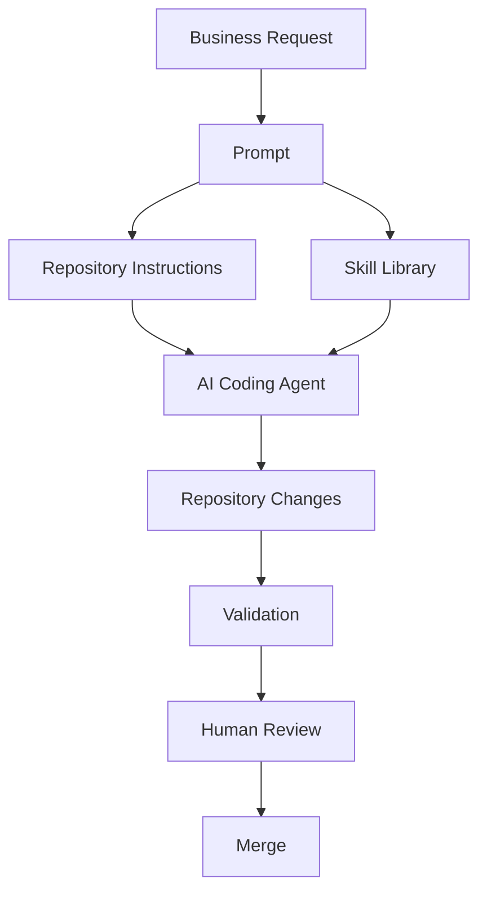
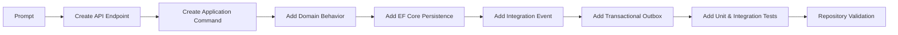
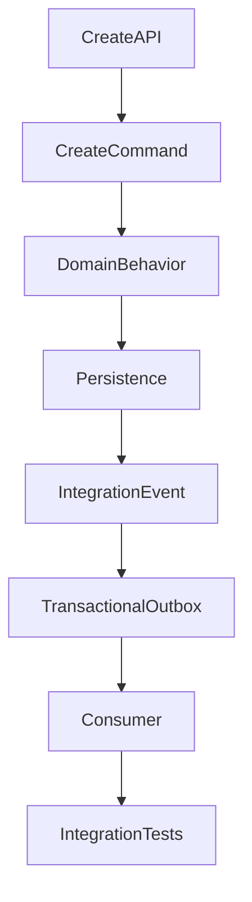
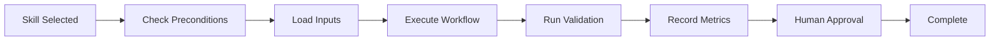
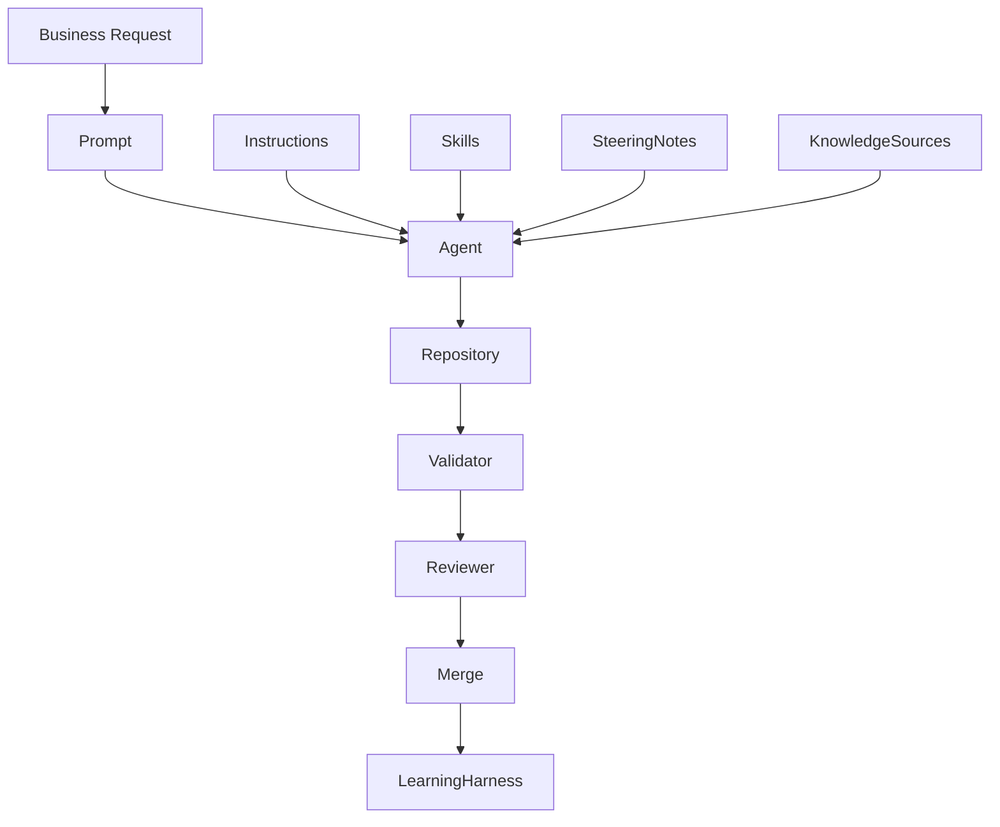
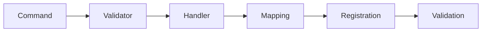
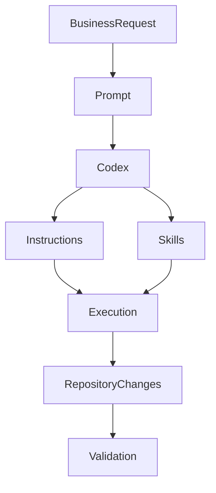

# Chapter 7 — Skills

## Part II — Repository Intelligence

# 1. Story-Driven Opening

On Monday morning, the Alpha Car Detailing engineering team receives a new enterprise requirement.

One of the company's largest corporate customers wants to manage thousands of company-owned vehicles across multiple regional offices. Instead of booking detailing appointments individually, fleet managers need to schedule services for entire vehicle groups, approve recurring maintenance plans, monitor utilization, and receive completion notifications through their fleet management system.

The Product Owner creates a work item:

> **Implement Corporate Fleet Booking.**

A developer opens Claude Code and submits the request.

> *"Add corporate fleet booking capability."*

The request appears deceptively simple.

The repository already contains comprehensive Instructions that define the organization's engineering standards.

The AI agent already knows that every API must:

* follow Clean Architecture
* use CQRS
* publish integration events
* write through a transactional outbox
* expose OpenTelemetry traces
* implement authorization
* produce structured logging
* include unit and integration tests
* satisfy repository validation rules

These repository-wide standards are not part of today's task. They were established long before this feature request arrived and are automatically enforced through repository Instructions.

The prompt identifies *what* must be built.

The Instructions define *how engineering standards must be followed.*

Neither explains *how to implement* recurring engineering work.

When the AI reaches the point of creating a new endpoint, it should not improvise.

Instead, it invokes the organization's reusable engineering Skill:

> **Create API Endpoint**

That Skill performs the same sequence every time:

1. Create the API endpoint.
2. Create the application command.
3. Register validation.
4. Add dependency injection.
5. Create response contracts.
6. Implement authorization.
7. Add OpenTelemetry instrumentation.
8. Register structured logging.
9. Create unit tests.
10. Create integration tests.
11. Validate architecture rules.

When persistence is required, the agent invokes another Skill.

> **Add EF Core Persistence**

When an event must be published:

> **Add Integration Event**

When reliable messaging is required:

> **Add Transactional Outbox**

When another service consumes events:

> **Add Idempotent Consumer**

Each Skill represents proven engineering knowledge captured by the organization after years of production experience.

The AI agent is no longer inventing implementation steps.

It is executing standardized engineering workflows that have already been reviewed, approved, versioned, tested, and governed.

This distinction transforms AI-assisted development from prompt-driven code generation into disciplined enterprise engineering.

Skills are not shortcuts.

They are executable engineering playbooks.

---

# 2. Learning Objectives

After completing this chapter, you will be able to:

* Define a Skill within an enterprise AI engineering environment.
* Distinguish Skills from Instructions, Prompts, Roles, and Steering Notes.
* Understand why Skills should capture reusable engineering procedures instead of repository policies.
* Design Skills with well-defined inputs, outputs, execution steps, validation, and approval points.
* Build modular Skills that remain reusable across repositories and AI coding platforms.
* Organize Skill libraries suitable for enterprise governance.
* Compose multiple Skills to implement complex software features.
* Measure Skill effectiveness using engineering metrics rather than code generation success alone.
* Integrate Skills into AI harnesses while maintaining human oversight.
* Establish processes for Skill ownership, versioning, testing, and continuous improvement.

---

# 3. Background

Chapter 5 introduced Repository Discovery as the process by which an AI agent develops an evidence-based understanding of an unfamiliar codebase before making changes.

Chapter 6 introduced Instructions, which capture the enduring engineering standards that every change must satisfy regardless of who performs the work.

This chapter introduces the next layer of Repository Intelligence: **Skills**.

If Instructions answer the question,

> **"What standards must always be followed?"**

Skills answer a different question:

> **"How is this recurring engineering activity consistently performed?"**

Modern enterprise software development is dominated by repetition.

Developers repeatedly:

* create APIs
* implement commands
* add repositories
* introduce database migrations
* publish events
* configure authentication
* add health checks
* implement telemetry
* write tests
* review pull requests

Although each feature is unique, the engineering workflow behind these activities is remarkably consistent.

Experienced developers internalize these procedures over years of practice.

AI agents cannot rely on tacit organizational knowledge.

Unless these recurring workflows are explicitly captured, every execution becomes a new interpretation of the task. Different prompts may produce different implementations, varying quality, and inconsistent architectural outcomes.

Skills address this challenge by converting organizational engineering experience into reusable, governed workflows.

Rather than relying on increasingly detailed prompts, enterprise teams encode recurring implementation procedures into Skills that can be invoked repeatedly across projects, repositories, and AI platforms.

This separation allows organizations to evolve engineering workflows independently from repository standards and independently from the day-to-day tasks assigned to AI agents.

As a result:

* Instructions remain stable.
* Skills evolve as engineering practices mature.
* Prompts remain focused on the immediate business objective.

This layered model is fundamental to scalable AI-assisted software development and forms one of the central architectural patterns of Enterprise AI Engineering.

---

# 4. Concepts

## What Is a Skill?

A **Skill** is a reusable, governed engineering workflow that defines the procedure an AI coding agent follows to complete a recurring software development activity.

Unlike a prompt, which describes a single task, a Skill captures the organization's preferred implementation process for a class of work.

Unlike Instructions, which define mandatory engineering standards, a Skill defines the sequence of activities required to complete a recurring engineering operation.

A well-designed Skill is:

* reusable
* deterministic
* validated
* versioned
* independently testable
* owned by the engineering organization
* applicable across many repositories

The emphasis is not on generating code.

The emphasis is on executing an engineering process.

---

## Skills as Organizational Knowledge

Consider two organizations implementing the same requirement:

> Add a secured REST endpoint.

The first organization relies entirely on prompts.

Each developer writes a different request.

Each AI agent interprets the prompt independently.

Small differences accumulate:

* inconsistent validation
* missing authorization
* inconsistent telemetry
* different testing approaches
* varying documentation quality

The second organization invokes a single Skill:

```
Create API Endpoint
```

Regardless of which developer or AI platform executes the Skill, the engineering workflow remains consistent.

The implementation details may differ slightly, but the process remains governed.

Over time, this consistency becomes one of the organization's competitive advantages.

---

## The Relationship Between Instructions, Skills, and Prompts

One of the most common sources of confusion in enterprise AI engineering is the tendency to blur repository standards, reusable workflows, and task requests into a single artifact.

They serve fundamentally different purposes.

| Artifact     | Primary Purpose                              | Scope                      | Frequency of Change |
| ------------ | -------------------------------------------- | -------------------------- | ------------------- |
| Instructions | Define engineering standards and constraints | Repository-wide            | Infrequent          |
| Skills       | Define reusable implementation procedures    | Organization or repository | Periodic            |
| Prompts      | Describe today's engineering objective       | Individual task            | Every execution     |

Returning to the Alpha Car Detailing example:

**Prompt**

> Add corporate fleet booking support.

**Instructions**

* Use Clean Architecture.
* All commands require validation.
* Every externally visible API requires authorization.
* Publish integration events through the transactional outbox.
* Instrument distributed tracing.

**Skills**

* Create API Endpoint
* Add Command Handler
* Add EF Core Persistence
* Add Authorization
* Add Integration Event
* Add Unit Tests

Each artifact addresses a different concern.

Combining them weakens all three.

---

## Skills Versus Instructions

Instructions express policy.

Skills express procedure.

Instructions rarely describe implementation sequences.

For example:

> "Every API must expose OpenTelemetry traces."

This is an Instruction.

It specifies a mandatory engineering outcome.

The corresponding Skill defines the implementation procedure:

1. Register ActivitySource.
2. Start an activity.
3. Record business attributes.
4. Record exception details.
5. Propagate context.
6. Validate exported traces.

The Instruction remains unchanged even if the implementation Skill evolves.

---

## Skills Versus Prompts

Prompts communicate intent.

Skills execute repeatable engineering workflows.

The prompt:

> Add fleet booking.

contains no implementation detail.

The Skill determines how that request is fulfilled within the architectural constraints established by the repository.

A stronger prompt should never replace a missing Skill.

If developers repeatedly extend prompts with implementation instructions, the organization has identified an engineering workflow that should instead be formalized as a reusable Skill.

---

## Skills Versus Roles

Roles define **who** performs an activity.

Skills define **how** the activity is performed.

For example:

| Role            | Possible Skills                                      |
| --------------- | ---------------------------------------------------- |
| Developer Agent | Create API Endpoint, Add Domain Behavior             |
| Reviewer Agent  | Review Architecture Compliance, Review Security      |
| Validator Agent | Validate Build, Execute Test Suite                   |
| Evaluator Agent | Measure Skill Effectiveness, Analyze Quality Metrics |

Multiple Roles may execute the same Skill.

Likewise, a single Role may invoke many different Skills during a workflow.

The separation keeps organizational responsibilities independent from engineering procedures.

---

## Skills Versus Steering Notes

Steering Notes communicate temporary priorities, project context, or sprint-specific guidance.

Examples include:

* prioritize fleet booking work
* avoid schema changes this sprint
* optimize for performance
* defer caching implementation

A Skill should not contain temporary project direction.

Instead, it should remain reusable regardless of the current sprint or business priority.

If a Skill depends on information that changes frequently, that information belongs in a Steering Note rather than in the Skill definition.

---

## Characteristics of High-Quality Skills

Effective Skills exhibit several defining characteristics:

* They solve one recurring engineering problem.
* They produce predictable outcomes.
* They include explicit entry criteria.
* They define measurable completion criteria.
* They validate their own work.
* They fail safely when prerequisites are not satisfied.
* They evolve through governance rather than ad hoc modification.

Organizations that invest in these qualities build Skill libraries that remain valuable across many years of software evolution.

---

# 5. Architecture Discussion

The introduction of Skills fundamentally changes the architecture of AI-assisted software development.

Without Skills, every prompt becomes a miniature engineering specification. Developers repeatedly explain implementation details that should already be institutional knowledge. AI agents repeatedly rediscover the same engineering process, often producing inconsistent results despite following the same repository Instructions.

Enterprise organizations cannot scale this approach.

Instead, they separate engineering knowledge into distinct architectural layers.



This layered architecture has several important properties.

The Prompt remains focused on business intent.

The Instructions continue to enforce repository-wide engineering standards.

The Skill provides the implementation workflow.

The AI agent combines all three while producing code.

As a result, organizations can improve engineering quality without rewriting prompts or modifying repository Instructions.

---

## Skills as Reusable Engineering Assets

Enterprise software organizations already treat many artifacts as reusable assets.

Examples include:

* Architecture decision records
* Shared libraries
* Infrastructure modules
* CI/CD pipelines
* Terraform modules
* Coding standards

Skills belong in the same category.

They are not temporary prompt snippets.

They are reusable engineering assets that encapsulate proven implementation knowledge.

Just as infrastructure engineers avoid rewriting Terraform modules for every deployment, AI engineering teams should avoid rewriting implementation procedures for recurring development tasks.

For Alpha Car Detailing, the engineering organization may maintain Skills such as:

| Skill                    | Purpose                                          |
| ------------------------ | ------------------------------------------------ |
| Create API Endpoint      | Add REST endpoint following repository standards |
| Create Query             | Add CQRS query workflow                          |
| Create Command           | Add CQRS command workflow                        |
| Add Domain Behavior      | Implement aggregate behavior                     |
| Add Repository           | Extend persistence layer                         |
| Add Integration Event    | Publish business event                           |
| Add Transactional Outbox | Ensure reliable messaging                        |
| Add Idempotent Consumer  | Safely process duplicate messages                |
| Add Authorization        | Apply security policies                          |
| Add OpenTelemetry        | Instrument distributed tracing                   |
| Add Health Check         | Extend platform monitoring                       |
| Add Unit Tests           | Verify application behavior                      |
| Add Integration Tests    | Validate end-to-end functionality                |

Each Skill represents engineering knowledge accumulated over many successful implementations.

---

## Skill Invocation During Feature Development

Consider the fleet booking feature.

The developer submits the prompt:

> Add Fleet Booking capability.

The AI agent begins planning.

Repository discovery identifies that:

* Fleet Booking belongs to the Booking Service.
* CQRS is mandatory.
* EF Core is the persistence mechanism.
* Integration events use the transactional outbox.
* OpenTelemetry is required.
* Authorization policies are repository-wide.

Instead of implementing everything from scratch, the AI invokes multiple Skills.



The feature itself becomes an orchestration of reusable engineering workflows.

---

## Skill Composition

Enterprise features rarely require only one Skill.

Instead, complex changes emerge from composing multiple smaller Skills.

For example:

```text
Corporate Fleet Booking

├── Create API Endpoint
├── Create Booking Command
├── Add Validation
├── Add Authorization
├── Add Domain Behavior
├── Add Repository
├── Add EF Core Mapping
├── Add Integration Event
├── Add Transactional Outbox
├── Add Consumer
├── Add OpenTelemetry
├── Add Logging
├── Add Unit Tests
└── Add Integration Tests
```

None of these Skills understands Fleet Booking.

Each understands a recurring engineering activity.

This distinction keeps Skills reusable across many unrelated features.

A Skill should never become business-domain specific unless the organization intentionally maintains domain Skills.

---

## Skill Granularity

One of the most difficult architectural decisions concerns Skill size.

Skills that are too large become difficult to maintain.

Skills that are too small become difficult to compose.

Consider these examples.

### Poorly Scoped Skill

```text
Implement Complete Booking System
```

This Skill attempts to:

* create APIs
* create commands
* update persistence
* publish events
* create tests
* update documentation

It spans multiple architectural layers and business concerns.

Changing one part risks destabilizing everything else.

---

### Overly Fragmented Skills

```text
Create Controller Constructor

Create Endpoint Attribute

Register Dependency

Create DTO

Register Mapper

Add Route

Add Parameter
```

Each Skill performs almost no meaningful engineering work.

Feature implementation now requires invoking dozens of tiny Skills, increasing orchestration complexity without improving reuse.

---

### Appropriate Skill Scope

```text
Create API Endpoint
```

This Skill can reasonably include:

* Endpoint
* DTO
* Validation
* Dependency Injection
* Mapping
* Authorization
* Logging
* Telemetry
* Tests

Everything belongs to a single recurring engineering workflow.

This balance maximizes reuse while keeping governance manageable.

---

## Skill Dependencies

Many Skills depend on the successful completion of others.

For example:



Dependency management prevents invalid execution sequences.

An AI harness should understand these dependencies rather than relying on prompt wording.

For example, invoking **Add Transactional Outbox** before persistence exists should immediately fail the Skill's precondition checks instead of attempting partial implementation.

---

## Skill Selection

A recurring question is:

**Who decides which Skills should execute?**

Several strategies exist.

### Prompt-Driven Selection

The prompt explicitly names the required Skills.

Example:

> Add Fleet Booking using Create API Endpoint and Add Integration Event Skills.

This approach provides complete control but increases prompt complexity.

---

### Agent-Driven Selection

The AI agent analyzes the requested change and automatically selects applicable Skills based on repository structure, feature type, and engineering context.

For example:

Fleet Booking requires:

* API
* Command
* Persistence
* Event
* Authorization

The agent selects the appropriate Skill chain automatically.

This is the preferred enterprise model because developers focus on business intent rather than implementation mechanics.

---

### Harness-Orchestrated Selection

The AI harness becomes responsible for Skill orchestration.

The prompt only states:

> Implement Fleet Booking.

The harness determines:

* required repository Instructions
* applicable Skills
* execution order
* validation sequence
* approval checkpoints

This model produces the highest consistency across teams and platforms.

---

## Skill Execution Lifecycle

Regardless of the AI platform, enterprise Skill execution should follow a consistent lifecycle.



Every phase is independently observable.

The harness can identify exactly where failures occur, which Skills require improvement, and whether the resulting implementation satisfied engineering expectations.

This lifecycle transforms Skills from static documentation into governed, measurable engineering workflows.

---

# 6. Professional Diagrams

## Enterprise Skill Architecture

The relationship between repository artifacts can be summarized as follows.



Each artifact contributes a distinct responsibility.

* **Prompt** communicates business intent.
* **Instructions** enforce repository-wide standards.
* **Skills** define reusable implementation workflows.
* **Steering Notes** provide temporary project guidance.
* **Knowledge Sources** supply contextual information.
* **The AI agent** synthesizes all inputs into repository changes.
* **Validation and review** ensure engineering quality before integration.
* **The learning harness** captures execution metrics and recommendations for future improvement.

---

# 7. Hands-on Example

Throughout this handbook, Alpha Car Detailing has evolved from a simple vehicle detailing application into a nationwide enterprise platform serving walk-in customers, corporate fleets, government agencies, insurance companies, and rental organizations.

The Product Owner has approved a new feature:

> **Corporate Fleet Booking**

The business requirement is straightforward.

Corporate customers should be able to submit a single booking request for multiple company-owned vehicles rather than scheduling appointments individually.

The engineering work, however, affects multiple architectural layers.

The repository Instructions already require:

* Clean Architecture
* CQRS
* Domain-Driven Design
* Authorization
* OpenTelemetry
* Transactional Outbox
* Structured Logging
* Unit Tests
* Integration Tests

Those standards are automatically enforced.

The AI agent now needs reusable implementation procedures.

This is where Skills become the primary engineering mechanism.

---

## Feature Request

The Product Owner creates the following work item.

```text
Implement Corporate Fleet Booking.

Requirements

• Fleet manager creates booking for multiple vehicles
• Booking requires approval workflow
• Publish FleetBookingCreated integration event
• Persist using EF Core
• Require FleetManager role
• Expose REST endpoint
• Include telemetry
• Include unit tests
• Include integration tests
```

The developer intentionally submits a concise prompt.

```text
Implement Corporate Fleet Booking.
```

The prompt focuses exclusively on business intent.

No architectural instructions are embedded inside it.

No implementation guidance is repeated.

The repository already contains those engineering assets.

---

## Skills Selected by the Agent

After repository discovery, the AI determines which Skills apply.

| Execution Order | Skill                      |
| --------------- | -------------------------- |
| 1               | Create API Endpoint        |
| 2               | Create Application Command |
| 3               | Add Domain Behavior        |
| 4               | Add EF Core Persistence    |
| 5               | Add Authorization          |
| 6               | Add Integration Event      |
| 7               | Add Transactional Outbox   |
| 8               | Add OpenTelemetry          |
| 9               | Add Unit Tests             |
| 10              | Add Integration Tests      |

Notice that none of these Skills mention Fleet Booking.

Each Skill represents a reusable engineering workflow that could be used for hundreds of future features.

---

## Skill 1 — Create API Endpoint

The Skill begins by validating its preconditions.

### Inputs

| Input                 | Description               |
| --------------------- | ------------------------- |
| Service               | Booking Service           |
| Endpoint Type         | POST                      |
| Feature               | Fleet Booking             |
| Authentication Policy | Fleet Manager             |
| Command Name          | CreateFleetBookingCommand |

### Preconditions

Before execution, the Skill verifies:

* Booking Service exists.
* CQRS pattern is used.
* Authentication middleware is configured.
* API project structure matches repository conventions.
* Required application layer exists.

If any precondition fails, execution stops immediately.

No partial implementation is performed.

---

### Execution Steps

The Skill performs the following workflow.

1. Create request DTO.
2. Create response DTO.
3. Create endpoint.
4. Register route.
5. Add dependency injection.
6. Configure authorization attribute.
7. Register validation.
8. Add OpenAPI documentation.
9. Add telemetry instrumentation.
10. Register structured logging.

The AI agent does not invent these steps.

They already exist within the Skill definition.

---

### Validation

The Skill concludes by verifying:

* Endpoint builds successfully.
* Route matches repository conventions.
* Authorization attribute exists.
* Request validation is registered.
* OpenAPI generation succeeds.
* Repository architecture validation passes.

Only after validation succeeds does the Skill report completion.

---

## Skill 2 — Create Application Command

The next Skill extends the application layer.

### Inputs

```text
Command Name

CreateFleetBookingCommand
```

### Outputs

```text
CreateFleetBookingCommand

CreateFleetBookingHandler

Validator

Mapping Registration

Dependency Injection
```

---

### Execution Workflow



The Skill guarantees that every command follows identical engineering conventions.

---

## Skill 3 — Add Domain Behavior

The Domain layer is responsible for enforcing business rules.

The Skill verifies:

* aggregate boundaries
* invariants
* domain events
* business validation
* transactional consistency

Rather than allowing AI to scatter business logic across controllers and repositories, the Skill ensures that behavior remains inside the aggregate.

Example responsibilities include:

* maximum fleet size
* duplicate vehicle prevention
* booking status transitions
* approval workflow initialization

Because these checks are encoded in the Skill, every developer receives identical architectural behavior regardless of which AI platform executes the work.

---

## Skill 4 — Add EF Core Persistence

The repository Instructions already specify EF Core as the persistence technology.

The Skill defines how persistence is implemented.

### Execution Steps

```text
Create Entity Configuration

↓

Update DbContext

↓

Configure Relationships

↓

Configure Indexes

↓

Create Migration

↓

Execute Migration Validation

↓

Verify Repository Rules
```

The Skill also validates repository naming conventions, migration ordering, and configuration standards before reporting success.

---

## Skill 5 — Add Authorization

Security implementation should never depend on prompt quality.

Instead, the Authorization Skill standardizes every implementation.

### Inputs

| Property       | Value        |
| -------------- | ------------ |
| Policy         | FleetManager |
| Authentication | JWT          |
| Scope          | Booking APIs |

---

### Execution

The Skill:

* applies authorization attributes
* validates policy registration
* verifies middleware configuration
* checks endpoint accessibility
* confirms anonymous access is denied

Only after these checks succeed does the Skill complete.

---

## Skill 6 — Add Integration Event

Fleet Booking must notify downstream services.

The AI invokes:

```text
Add Integration Event
```

Outputs include:

* FleetBookingCreated event
* Event schema
* Publisher
* Registration
* Serialization validation

The Skill also validates event versioning and repository messaging standards before completion.

---

## Skill 7 — Add Transactional Outbox

Publishing an event directly from application code risks message loss.

The repository Instructions require reliable messaging.

The Skill implements the approved pattern.


The AI agent does not need to remember every implementation detail.

The Skill already contains the approved engineering workflow.

---

## Skill 8 — Add OpenTelemetry

Observability is another recurring engineering activity.

Instead of prompting:

> Remember to add tracing.

the agent invokes:

```text
Add OpenTelemetry
```

The Skill performs:

* Activity creation
* Context propagation
* Trace attributes
* Exception recording
* Metrics registration
* Export validation

Every implementation becomes identical across the enterprise.

---

## Skill 9 — Add Unit Tests

Testing is treated as part of implementation rather than a follow-up task.

The Skill automatically creates tests covering:

* successful booking creation
* authorization failure
* validation failure
* duplicate fleet booking
* business rule violations

Validation confirms:

* required coverage exists
* tests compile
* naming conventions match repository standards

---

## Skill 10 — Add Integration Tests

Finally, the AI executes the integration testing Skill.

Typical workflow:

```mermaid
flowchart TD

Deploy Test Host

-->

Execute API

-->

Persist Data

-->

Publish Event

-->

Verify Outbox

-->

Verify Consumer

-->

Verify Telemetry

-->

Report Success
```

The Skill validates the entire feature rather than isolated components.

---

## Complete Feature Workflow

The complete implementation is now visible as a composition of reusable Skills.


The AI agent never needed to invent the engineering process.

It simply selected and executed the organization's approved Skill library.

This demonstrates the central principle of Enterprise AI Engineering:

> **Prompts express business intent. Instructions enforce engineering standards. Skills execute reusable engineering workflows.**

---

# 8. Claude Code Example

Claude Code provides first-class support for structured repository workflows, making it particularly well suited to executing reusable Skills alongside repository Instructions.

Assume the repository already contains:

```text
skills/

├── create-api-endpoint.md
├── create-command.md
├── add-domain-behavior.md
├── add-efcore-persistence.md
├── add-integration-event.md
├── add-transactional-outbox.md
├── add-authorization.md
├── add-opentelemetry.md
├── add-unit-tests.md
└── add-integration-tests.md
```

The developer's interaction remains intentionally simple.

```text
Implement Corporate Fleet Booking.
```

Claude Code first performs repository discovery, loads the applicable Instructions, identifies the relevant Skills, plans the implementation sequence, and then executes each Skill while continuously validating repository compliance.

The developer does not need to enumerate every engineering step in the prompt because the reusable workflows already exist as governed Skills. This separation keeps prompts concise, promotes consistent implementations across teams, and allows engineering workflows to evolve independently of day-to-day feature requests.

---

# 9. GitHub Copilot Comparison

GitHub Copilot has evolved from an inline code completion assistant into a broader AI-assisted development platform capable of chat-driven code generation, repository awareness, and workflow automation. Nevertheless, its engineering effectiveness still depends heavily on how organizations structure and expose reusable engineering knowledge.

The architectural principles described in this chapter remain unchanged.

Instructions define repository standards.

Skills define reusable engineering workflows.

Prompts define the current engineering task.

The primary difference lies in how these artifacts are surfaced to the AI agent.

---

## Skill Execution with GitHub Copilot

Consider the same business request used throughout this chapter.

> **Implement Corporate Fleet Booking.**

The engineering organization has already established repository Instructions that define:

* Clean Architecture
* CQRS
* Security
* Testing
* Event publishing
* OpenTelemetry
* Logging
* Repository conventions

These Instructions provide the engineering constraints.

The implementation workflow is still provided by reusable Skills.

A typical execution sequence appears as follows.


The engineering model remains identical to Claude Code.

Only the mechanism for discovering and invoking Skills differs.

---

## Repository-Centric Engineering

GitHub Copilot performs best when engineering knowledge exists as discoverable repository assets rather than being embedded inside prompts.

For example, an enterprise repository may contain:

```text
.github/

├── copilot-instructions.md

skills/

├── create-api-endpoint.md
├── create-command.md
├── add-domain-behavior.md
├── add-efcore-persistence.md
├── add-opentelemetry.md
├── add-unit-tests.md
└── add-integration-tests.md
```

Rather than embedding implementation guidance into every request, developers simply ask:

> Implement Corporate Fleet Booking.

The reusable Skill library provides the implementation procedure.

---

## Comparing the Development Experience

With no reusable Skills, developers frequently submit prompts such as:

```text
Implement Fleet Booking.

Use Clean Architecture.

Create CQRS command.

Add EF Core.

Implement authorization.

Publish integration event.

Use transactional outbox.

Add OpenTelemetry.

Write unit tests.

Write integration tests.
```

Although technically correct, the prompt now duplicates repository knowledge.

Every future developer must remember the same implementation details.

Every prompt becomes an engineering checklist.

With reusable Skills, the prompt becomes significantly simpler.

```text
Implement Corporate Fleet Booking.
```

The engineering process resides inside the Skill library rather than inside the prompt.

This separation greatly improves maintainability.

---

## Advantages

GitHub Copilot benefits from reusable Skills in several ways.

* Prompts remain concise and business-focused.
* Engineering consistency improves across development teams.
* Repository standards are applied uniformly.
* Recurring implementation procedures are centralized.
* Skill improvements automatically benefit future feature development.

These benefits become increasingly valuable as repositories and engineering teams grow.

---

## Considerations

Organizations should avoid assuming that GitHub Copilot will automatically infer enterprise engineering workflows.

Reusable Skills should remain:

* explicit
* version controlled
* independently reviewed
* tested
* governed

Treating engineering procedures as repository assets rather than conversational knowledge leads to far more predictable AI-assisted development.

---

# 10. OpenAI Codex Comparison

OpenAI Codex operates within the same architectural model described throughout this handbook.

Regardless of the underlying AI platform, successful enterprise engineering depends on separating business intent from engineering standards and reusable implementation procedures.

The repository should therefore expose:

* Instructions
* Skills
* Prompts

as independent engineering artifacts.

Codex consumes these artifacts while planning and implementing repository changes.

---

## Skill-Based Development with Codex

For the Alpha Car Detailing repository, the workflow remains familiar.



The developer's request is intentionally minimal.

> Implement Corporate Fleet Booking.

The reusable Skills determine *how* recurring engineering activities should be performed.

---

## Planning Before Implementation

One characteristic of Codex-based workflows is the emphasis on explicit planning before making repository modifications.

When reusable Skills are available, planning becomes substantially more reliable because the agent reasons about higher-level engineering activities rather than individual source files.

Instead of deciding:

* which files to edit
* where validation belongs
* how telemetry should be implemented
* how authorization should be configured

the AI plans around reusable engineering workflows such as:

* Create API Endpoint
* Add Domain Behavior
* Add EF Core Persistence
* Add Integration Event
* Add Transactional Outbox
* Add OpenTelemetry

This produces implementation plans that are easier for architects and reviewers to evaluate before execution begins.

---

## Enterprise Benefits

Organizations using Codex gain the same advantages described for Claude Code and GitHub Copilot.

Reusable Skills provide:

* predictable implementation workflows
* reduced prompt complexity
* improved architectural consistency
* repeatable engineering outcomes
* easier governance and auditing

Because Skills are repository assets rather than model-specific features, they remain portable as AI coding platforms evolve.

---

## Cross-Platform Comparison

The engineering philosophy presented in this handbook intentionally remains vendor-neutral.

Although the interaction model differs between platforms, the role of Skills is consistent.

| Capability              | Claude Code                             | GitHub Copilot                         | OpenAI Codex                           |
| ----------------------- | --------------------------------------- | -------------------------------------- | -------------------------------------- |
| Repository Instructions | Native repository guidance              | Repository guidance                    | Repository guidance                    |
| Reusable Skills         | Strong support for structured workflows | Repository-based workflow organization | Repository-based workflow organization |
| Prompt Style            | Business-focused, concise               | Business-focused, concise              | Business-focused, concise              |
| Engineering Workflow    | Driven by reusable Skills               | Driven by reusable Skills              | Driven by reusable Skills              |
| Governance Model        | Repository-controlled                   | Repository-controlled                  | Repository-controlled                  |

The important observation is that **Skills are an enterprise engineering concept rather than a product feature**.

Organizations should design their Skill libraries so that they remain reusable regardless of whether future development is performed using Claude Code, GitHub Copilot, OpenAI Codex, or the next generation of AI coding agents.

---

# 11. Best Practices

Enterprise AI engineering succeeds when Skills are treated as long-lived engineering assets rather than collections of useful prompts. Organizations that invest in well-designed Skill libraries consistently achieve higher implementation quality, greater architectural consistency, and reduced onboarding effort for both developers and AI coding agents.

The following practices have proven effective across large software engineering organizations.

---

## Design Skills Around Recurring Engineering Activities

A Skill should represent a recurring engineering workflow rather than a specific business feature.

Good examples include:

* Create API Endpoint
* Add CQRS Command
* Add Domain Behavior
* Add EF Core Persistence
* Configure Authorization
* Add OpenTelemetry
* Add Transactional Outbox

Poor examples include:

* Implement Fleet Booking
* Build Insurance Dashboard
* Add Government Customer Module

Business features change frequently.

Engineering workflows change much less often.

Organizations maximize reuse by centering Skills around engineering activities rather than business requirements.

---

## Keep Skills Focused

Each Skill should have a clearly defined responsibility.

For example, the **Add OpenTelemetry** Skill should concern itself only with observability.

It should not also:

* configure authorization
* modify database schema
* publish events
* update documentation

Keeping responsibilities focused produces Skills that are easier to understand, test, govern, and compose.

---

## Define Explicit Inputs and Outputs

Every Skill should clearly specify:

### Required Inputs

* repository location
* service name
* project type
* architectural layer
* technology selection
* configuration options

### Expected Outputs

* generated source files
* modified files
* tests
* configuration changes
* validation results

For example:

| Skill                   | Inputs                  | Outputs                        |
| ----------------------- | ----------------------- | ------------------------------ |
| Create API Endpoint     | Service, Route, Command | Controller, DTOs, Registration |
| Add EF Core Persistence | Entity, DbContext       | Configuration, Migration       |
| Add Integration Event   | Event Name              | Event Contract, Publisher      |
| Add Authorization       | Policy Name             | Attributes, Registration       |

Well-defined interfaces allow Skills to be composed predictably.

---

## Always Validate Preconditions

A Skill should never assume the repository is ready.

Before execution, it should verify all prerequisites.

Examples include:

* required project exists
* correct architectural layer exists
* dependencies are available
* repository Instructions have been loaded
* required NuGet packages are installed
* supporting Skills have already completed

For example, the **Add Transactional Outbox** Skill should verify that:

* persistence already exists
* event publishing infrastructure is available
* messaging configuration has been completed

If these conditions are not met, execution should stop immediately.

---

## Include Validation as Part of the Skill

Successful code generation does not mean successful Skill execution.

Every Skill should verify its own results.

Typical validation includes:

* project builds
* tests compile
* architecture validation passes
* naming conventions are satisfied
* dependency injection is correctly registered
* generated code follows repository standards

Validation should be considered an integral part of the Skill rather than a separate activity.

---

## Design Skills for Composition

Enterprise features usually require multiple Skills working together.

A well-designed Skill should integrate cleanly with others.

For example:

```text
Create API Endpoint

↓

Create Command

↓

Add Domain Behavior

↓

Add Persistence

↓

Publish Event

↓

Add Tests
```

Each Skill performs one meaningful engineering workflow while remaining compatible with adjacent Skills.

---

## Avoid Repository-Specific Assumptions

Reusable Skills should minimize hard-coded assumptions about individual repositories.

Instead of assuming:

```text
BookingService\Application\Commands\
```

prefer configuration such as:

```text
<Application Command Folder>
```

or

```text
Configured CQRS Command Location
```

This allows the same Skill to operate across multiple repositories with minimal adaptation.

---

## Treat Skills as Versioned Assets

Skills evolve over time.

New architectural patterns emerge.

Frameworks change.

Security standards improve.

Organizations should therefore version Skills exactly as they version application code.

Example:

```text
Create API Endpoint

Version 1.0

↓

Version 1.1

• Added OpenTelemetry

↓

Version 1.2

• Added Endpoint Filters

↓

Version 2.0

• Added Native AOT support
```

Version history provides transparency and enables controlled adoption across engineering teams.

---

## Review Skills Like Production Code

Every Skill should undergo the same engineering governance as application source code.

Recommended review criteria include:

* correctness
* architectural compliance
* maintainability
* security
* performance
* reusability
* clarity

Pull requests that modify Skills should receive careful architectural review because changes may affect hundreds of future implementations.

---

## Measure Engineering Outcomes

Organizations often evaluate AI solely by code generation speed.

A more meaningful measure is Skill effectiveness.

Useful metrics include:

| Metric                 | Description                              |
| ---------------------- | ---------------------------------------- |
| Success Rate           | Percentage of successful executions      |
| Validation Pass Rate   | Percentage passing all validation steps  |
| Human Rework           | Average changes required after execution |
| Reuse Frequency        | Number of executions across repositories |
| Failure Categories     | Common causes of Skill failure           |
| Average Execution Time | End-to-end workflow duration             |

These metrics provide actionable insight into engineering quality rather than AI productivity alone.

---

# 12. Anti-patterns

As organizations adopt Skills, several recurring mistakes appear repeatedly.

Recognizing these anti-patterns early prevents significant maintenance and governance problems.

---

## Anti-pattern: Mixing Skills with Instructions

One of the most common mistakes is embedding repository policy inside implementation workflows.

Example:

```text
Skill

Every API must use JWT authentication.
```

This is not a Skill.

It is a repository-wide Instruction.

The corresponding Skill should instead describe how authorization is implemented after that policy has already been established.

A simple guideline is:

* **Instructions define mandatory standards.**
* **Skills define reusable procedures.**

Mixing the two makes both harder to maintain.

---

## Anti-pattern: Writing Skills as Large Prompts

Some organizations create Skills that resemble conversational requests.

Example:

```text
Please build a REST API using Clean Architecture,
follow best practices,
write tests,
use logging,
add telemetry,
make everything production ready.
```

This is simply a verbose prompt.

A professional Skill should instead define:

* inputs
* preconditions
* execution workflow
* validation
* outputs
* failure handling

Structured workflows are significantly more reliable than conversational descriptions.

---

## Anti-pattern: Missing Preconditions

Skipping prerequisite validation frequently produces incomplete or inconsistent implementations.

For example:

```text
Add Transactional Outbox
```

without verifying that persistence infrastructure already exists often results in partially generated code that requires extensive manual repair.

Every Skill should fail early rather than proceed with invalid assumptions.

---

## Anti-pattern: Missing Validation

Many organizations incorrectly assume that generated code is automatically correct.

Generation alone proves nothing.

Every Skill should validate:

* compilation
* architecture compliance
* tests
* repository conventions
* dependency registration
* runtime behavior where appropriate

Only validated execution should be considered successful.

---

## Anti-pattern: Overly Large Skills

Skills that attempt to implement an entire business feature become difficult to understand, review, version, and reuse.

For example:

```text
Implement Complete Fleet Management System
```

Such Skills inevitably combine unrelated engineering concerns and become tightly coupled to a single business domain.

Smaller, well-scoped engineering workflows are far more maintainable.

---

## Anti-pattern: Excessive Skill Fragmentation

The opposite problem occurs when organizations divide workflows into dozens of trivial Skills.

For example:

```text
Create DTO

Create Controller

Register Service

Add Route

Configure Mapping

Create Validator
```

Each performs too little useful work.

Complex features then require orchestrating an unnecessarily large number of tiny Skills, increasing operational complexity without improving reuse.

---

## Anti-pattern: Hard-Coded Repository Assumptions

Embedding repository paths, project names, or folder structures directly into Skills limits portability.

Instead, Skills should rely on repository discovery and configuration wherever possible.

This enables the same Skill library to support multiple repositories and future architectural changes.

---

## Anti-pattern: Uncontrolled Skill Changes

Because Skills influence many future implementations, modifying them without governance introduces significant organizational risk.

Changes should always be:

* reviewed
* versioned
* tested
* approved
* documented

A Skill library deserves the same change management discipline as production source code.

---

## Anti-pattern: Allowing the Harness to Silently Rewrite Skills

A self-learning AI harness may identify opportunities to improve engineering workflows.

However, it should **never** modify approved Skills automatically.

Instead, the harness should generate recommendations such as:

```text
Suggested Improvement

Create API Endpoint v1.4

Recommendation:

Automatically register endpoint filters for all new APIs.

Evidence:

Observed in 94% of manually reviewed pull requests.
```

A human architect should evaluate the proposal before the Skill is updated.

Autonomous learning should support governance—not replace it.

---

## Anti-pattern: Reusing Skills Without Verifying Applicability

Not every Skill is appropriate for every repository.

For example, invoking an EF Core persistence Skill within a repository that uses MongoDB or Cosmos DB is unlikely to produce correct results.

Skill selection should consider:

* repository architecture
* technology stack
* Instructions
* project conventions
* current engineering context

Reuse should always be informed rather than automatic.

---

## Anti-pattern: Equating Code Generation with Skill Success

The final and perhaps most important mistake is assuming that successful code generation equals successful Skill execution.

A Skill succeeds only when:

* all preconditions were satisfied
* the workflow completed
* validation passed
* repository standards were maintained
* required tests succeeded
* the implementation was accepted during review

Engineering quality—not generated source code—is the true measure of Skill effectiveness.

---

# 13. Architect's Notes

> **Architect's Note**
>
> One of the biggest misconceptions in AI-assisted software development is treating Skills as a collection of useful prompts. They are not.
>
> A Skill is an engineering asset that deserves the same architectural discipline as a shared framework, a reusable library, or a CI/CD pipeline.
>
> Organizations that govern Skills as first-class engineering artifacts consistently achieve better architectural consistency, lower maintenance costs, and significantly higher AI reliability.

---

## Skills Capture Organizational Engineering Knowledge

Experienced architects make thousands of engineering decisions over their careers.

Examples include:

* where validation belongs
* how aggregates enforce invariants
* how events are published
* how persistence is structured
* how observability is implemented
* how failures are handled

Traditionally, this knowledge exists only in the minds of senior engineers.

As organizations grow, this creates several challenges.

New developers require months of mentoring.

Engineering approaches vary across teams.

Architecture gradually drifts away from established standards.

AI coding agents encounter exactly the same problem.

Unless organizational engineering knowledge is explicitly captured, every implementation becomes a new interpretation of the same engineering activity.

Skills solve this problem by transforming implicit architectural knowledge into explicit, executable engineering workflows.

---

## Skills Should Be Stable but Evolvable

A mature Skill library changes much less frequently than application code.

Daily feature development should consume Skills rather than modify them.

Skill evolution should occur only when there is sufficient engineering evidence that the workflow itself requires improvement.

Typical reasons include:

* introduction of new architectural patterns
* framework upgrades
* security improvements
* observability enhancements
* lessons learned from production incidents
* recurring review comments
* automation opportunities

This separation allows application development to move quickly while preserving the stability of engineering workflows.

---

## Think Beyond Individual Repositories

Many organizations initially design Skills specifically for one repository.

For example:

```text
Create Booking API
```

Although useful, this Skill has limited long-term value.

Architects should instead ask:

"What engineering activity is actually being repeated?"

The answer is usually something broader.

For example:

```text
Create REST API Endpoint
```

This Skill immediately becomes reusable across:

* Booking Service
* Customer Service
* Payment Service
* Notification Service
* Inventory Service

The broader engineering abstraction significantly increases return on investment.

---

## Skill Libraries Become Enterprise Standards

As organizations mature, Skill libraries begin to resemble internal engineering frameworks.

Different repositories consume the same Skills.

Different AI platforms execute the same workflows.

Different development teams produce similar implementations.

Eventually, Skills become part of the organization's engineering standards alongside:

* coding standards
* architecture guidelines
* deployment pipelines
* security policies
* testing frameworks

This consistency reduces architectural drift while improving onboarding for both developers and AI coding agents.

---

## Skills Should Remain Technology-Aware, Not Technology-Locked

A Skill should understand the engineering technologies used by a repository.

For example:

* EF Core
* MongoDB
* Event Hub
* Kafka
* OpenTelemetry

However, implementation details should remain configurable wherever practical.

For example:

```text
Persistence Provider

↓

EF Core
```

should not require creating an entirely different engineering workflow from:

```text
Persistence Provider

↓

MongoDB
```

The overall workflow remains similar even though implementation details differ.

Architects should maximize reuse without sacrificing engineering correctness.

---

## Enterprise Architecture Emerges from Reusable Skills

One of the most powerful observations in Enterprise AI Engineering is that architecture becomes increasingly consistent as organizations expand their Skill libraries.

Rather than relying solely on architecture documents and code reviews, organizations continuously reinforce architectural decisions through reusable implementation workflows.

Every successful Skill execution strengthens architectural consistency.

Over thousands of executions, this produces measurable improvements in engineering quality.

---

# 14. Enterprise Tips

> **Enterprise Tip**
>
> Do not measure the maturity of your AI adoption by the number of prompts your developers write.
>
> Measure it by the quality, governance, and reuse of your organization's Skill library.

---

## Build an Enterprise Skill Catalog

Treat Skills as discoverable engineering assets.

An enterprise catalog should classify Skills by engineering discipline.

Example:

```text
API

├── Create Endpoint
├── Version Endpoint
├── Secure Endpoint

Application

├── Create Command
├── Create Query
├── Register Validation

Domain

├── Add Aggregate
├── Add Domain Event

Persistence

├── EF Core
├── MongoDB
├── Redis

Messaging

├── Integration Event
├── Transactional Outbox
├── Kafka Consumer

Observability

├── OpenTelemetry
├── Logging
├── Metrics

Testing

├── Unit Tests
├── Integration Tests
├── Performance Tests
```

This organization makes Skill discovery significantly easier for both humans and AI agents.

---

## Assign Clear Ownership

Every Skill should have an identifiable owner.

Typical ownership may include:

| Skill Category       | Recommended Owner          |
| -------------------- | -------------------------- |
| Architecture Skills  | Software Architecture Team |
| Security Skills      | Security Engineering       |
| Observability Skills | Platform Engineering       |
| CI/CD Skills         | DevOps Team                |
| Testing Skills       | Quality Engineering        |
| Messaging Skills     | Integration Team           |

Ownership ensures that improvements, bug fixes, and architectural changes follow a controlled governance process.

---

## Maintain Backward Compatibility

When improving a Skill, avoid introducing breaking behavior without careful planning.

Instead:

* introduce new versions
* deprecate old versions
* document migration guidance
* communicate adoption timelines

This approach mirrors API versioning and reduces disruption across repositories.

---

## Continuously Measure Skill Effectiveness

Enterprise Skill libraries should be monitored like production systems.

Useful operational dashboards include:

* execution frequency
* success rate
* validation failures
* average execution time
* review acceptance rate
* rollback rate
* post-merge defects
* developer satisfaction

These metrics identify where engineering workflows need refinement.

---

## Encourage Cross-Team Contributions

The best Skill libraries evolve through contributions from multiple engineering disciplines.

For example:

* architects improve design workflows
* platform engineers enhance deployment Skills
* security teams strengthen authorization workflows
* QA engineers improve testing Skills
* operations teams refine observability Skills

A collaborative governance model produces more comprehensive and resilient engineering assets.

---

## Document Skill Dependencies

As the Skill catalog grows, dependencies become increasingly important.

Maintaining explicit dependency information enables:

* reliable orchestration
* parallel execution where appropriate
* early prerequisite validation
* simplified troubleshooting
* automated planning by AI harnesses

Dependency documentation should be maintained alongside each Skill definition.

---

# 15. Decision Points

Enterprise architects should establish clear organizational decisions before introducing Skills at scale.

The following questions help guide those decisions.

---

## Decision Point 1 — Where Should Skills Be Stored?

Possible approaches include:

* repository-local Skill library
* organization-wide shared repository
* centralized AI engineering platform
* hybrid model

For most enterprises, a hybrid approach is recommended.

Core engineering Skills remain centrally governed, while repository-specific Skills reside alongside the source code.

---

## Decision Point 2 — Who Owns Skill Governance?

Potential owners include:

* Enterprise Architecture
* Platform Engineering
* AI Engineering Center of Excellence
* Technical Leads

Whatever model is chosen, ownership should be explicit.

Unowned Skill libraries inevitably drift in quality and consistency.

---

## Decision Point 3 — How Should Skills Be Versioned?

Possible strategies include:

* semantic versioning
* repository release alignment
* annual engineering baselines

Semantic versioning is generally the most flexible because it communicates compatibility expectations clearly.

---

## Decision Point 4 — Can AI Modify Skills?

This handbook recommends a clear governance policy:

**No.**

AI agents may:

* recommend improvements
* generate proposed revisions
* analyze effectiveness
* identify recurring implementation issues

AI agents should **not** silently update approved Skills.

Every Skill modification should follow normal engineering review and approval processes.

---

## Decision Point 5 — What Defines Successful Skill Execution?

Organizations should define success using measurable engineering outcomes rather than code generation alone.

Recommended criteria include:

* all preconditions satisfied
* workflow completed successfully
* validation passed
* repository Instructions followed
* tests passed
* reviewer approval obtained
* production quality achieved

Only then should the Skill be considered successful.

---

## Decision Point 6 — Should Skills Be Shared Across AI Platforms?

The answer is generally **yes**.

Skills represent organizational engineering knowledge, not platform-specific capabilities.

By keeping Skills vendor-neutral, organizations preserve their engineering investment even as AI coding platforms evolve.

---

# 16. Exercises

### Exercise 1 — Classify Repository Artifacts

For each of the following, identify whether it should be implemented as an **Instruction**, **Skill**, or **Prompt**.

1. Every externally accessible API must require JWT authentication.
2. Add a REST endpoint for Fleet Booking.
3. Create an EF Core migration.
4. Implement Corporate Fleet Booking.
5. Every integration event must use the transactional outbox.
6. Configure OpenTelemetry tracing for a new service.

Discuss why each classification supports long-term maintainability.

---

### Exercise 2 — Design a Reusable Skill

Design a Skill named **Add Background Worker** for the Alpha Car Detailing platform.

Your design should include:

* purpose
* inputs
* outputs
* preconditions
* execution steps
* validation steps
* failure handling
* approval requirements

---

### Exercise 3 — Evaluate Skill Granularity

Review the following proposed Skills.

* Implement Booking Module
* Create Controller
* Create API Endpoint
* Configure Route Attribute
* Implement Complete Customer Service

Identify which Skills are:

* appropriately scoped
* too large
* too fragmented

Explain your reasoning.

---

### Exercise 4 — Create a Skill Composition

Using the Alpha Car Detailing architecture, define the sequence of Skills required to implement a **Corporate Fleet Maintenance Schedule** feature.

Include:

* dependency order
* validation points
* approval checkpoints

---

### Exercise 5 — Improve a Skill

Assume the **Add OpenTelemetry** Skill has a 72% validation success rate.

Identify:

* possible causes
* required metrics
* proposed improvements
* governance process for updating the Skill

---

# 17. Interview Questions

The following questions are intended for software architects, senior developers, AI engineering leads, and platform engineers. They focus on conceptual understanding, architectural reasoning, and enterprise-scale implementation rather than memorization.

---

## Conceptual Questions

### 1. What is a Skill in Enterprise AI Engineering?

**Expected discussion points**

* Reusable engineering workflow
* Defines implementation procedure
* Independent of individual business features
* Governed and versioned
* Executable by AI coding agents

---

### 2. How do Skills differ from Instructions?

Candidates should explain that:

| Instructions                 | Skills                                 |
| ---------------------------- | -------------------------------------- |
| Define engineering standards | Define engineering workflows           |
| Repository-wide              | Reusable engineering activity          |
| Rarely change                | Evolve as engineering practices mature |
| Specify constraints          | Specify implementation procedures      |

A strong candidate should emphasize that Instructions answer *what must always be true*, while Skills answer *how recurring engineering work is performed*.

---

### 3. How do Skills differ from Prompts?

Expected answer:

Prompts describe today's engineering task.

Skills describe reusable implementation procedures.

Example:

Prompt

> Implement Corporate Fleet Booking.

Skill

> Create API Endpoint

The prompt changes daily.

The Skill may remain unchanged for years.

---

### 4. Why shouldn't engineering knowledge be embedded inside prompts?

Look for discussion around:

* duplicated engineering knowledge
* inconsistent implementations
* prompt maintenance
* lack of governance
* architectural drift

Strong candidates should explain why reusable Skills improve consistency and maintainability.

---

### 5. Why are Skills considered engineering assets?

A complete answer should include:

* version control
* ownership
* testing
* governance
* review
* reuse
* measurable quality improvements

---

## Architecture Questions

### 6. How should Skills be organized in a large enterprise?

Expected topics:

* categorized Skill libraries
* ownership by engineering teams
* dependency management
* versioning
* repository discovery
* centralized governance

---

### 7. What information belongs inside a Skill?

Expected answer:

* purpose
* inputs
* outputs
* preconditions
* execution workflow
* validation
* failure handling
* dependencies
* approval requirements

---

### 8. Why should Skills validate preconditions?

Candidates should discuss:

* preventing partial implementations
* predictable execution
* improved diagnostics
* reduced recovery effort
* safer automation

---

### 9. What is Skill composition?

Expected discussion:

Large software features are implemented by orchestrating multiple reusable Skills.

Example:

```text id="4t3q9v"
Create API

↓

Create Command

↓

Add Domain Behavior

↓

Persistence

↓

Integration Event

↓

OpenTelemetry

↓

Testing
```

The candidate should recognize that complex engineering work emerges from coordinated execution of smaller reusable workflows.

---

### 10. Should a Skill understand business requirements?

The preferred answer is:

No.

A Skill should understand recurring engineering activities rather than individual business features.

Business intent belongs in the Prompt.

Engineering implementation belongs in the Skill.

---

## Governance Questions

### 11. Who should own enterprise Skills?

Possible answers include:

* Architecture Team
* Platform Engineering
* AI Engineering Center of Excellence
* Domain Engineering Teams

The important point is that ownership should be explicit.

---

### 12. Should AI agents modify Skills automatically?

The expected answer is:

No.

AI agents may:

* identify improvement opportunities
* generate proposed revisions
* recommend optimizations

Human approval should always be required before modifying governed engineering assets.

---

### 13. How should Skill effectiveness be measured?

Candidates should discuss metrics such as:

* execution success rate
* validation success
* review acceptance
* human rework
* defect rate
* reuse frequency
* execution time

Engineering quality—not generation speed—should be the primary objective.

---

### 14. What are the risks of poorly designed Skills?

A comprehensive answer may include:

* architectural inconsistency
* duplicated engineering logic
* increased maintenance
* difficult governance
* reduced AI reliability
* higher onboarding costs

---

### 15. How do Skills contribute to Enterprise AI Engineering?

Strong candidates should conclude that Skills transform engineering experience into reusable organizational knowledge, enabling AI coding agents to execute proven implementation workflows consistently across repositories and teams.

---

# 18. Chapter Summary

This chapter introduced **Skills** as one of the foundational building blocks of Repository Intelligence.

While Instructions define the engineering standards that govern a repository, Skills define the reusable implementation procedures that AI coding agents follow when performing recurring development activities.

This distinction is fundamental to Enterprise AI Engineering.

Without Skills, AI agents rely heavily on increasingly detailed prompts, leading to duplicated engineering knowledge, inconsistent implementations, and greater architectural drift.

With Skills, organizations capture proven engineering workflows once and reuse them across repositories, projects, teams, and AI coding platforms.

Using the Alpha Car Detailing application as a running example, this chapter demonstrated how a single business request—implementing Corporate Fleet Booking—can be realized through the composition of reusable Skills such as:

* Create API Endpoint
* Create Application Command
* Add Domain Behavior
* Add EF Core Persistence
* Add Authorization
* Add Integration Event
* Add Transactional Outbox
* Add OpenTelemetry
* Add Unit Tests
* Add Integration Tests

Each Skill encapsulates organizational engineering knowledge rather than business logic.

The chapter also explored the complete lifecycle of enterprise Skills, including:

* Skill anatomy
* inputs and outputs
* preconditions
* execution workflows
* validation
* failure handling
* ownership
* versioning
* governance
* testing
* composition
* dependency management
* execution within AI harnesses

A recurring theme throughout the chapter has been that **successful code generation is not equivalent to successful Skill execution**.

A Skill is successful only when:

* prerequisites are satisfied
* the workflow executes correctly
* validation passes
* repository standards are maintained
* reviewers approve the implementation

Finally, the chapter introduced the concept of **self-learning AI harnesses**.

Rather than silently modifying approved Skills, an enterprise harness should continuously measure Skill effectiveness, analyze engineering outcomes, identify recurring improvement opportunities, and generate evidence-based recommendations for human review.

In this model, AI augments engineering governance without replacing it.

As AI-assisted software development continues to mature, organizations that invest in governed, reusable Skill libraries will achieve greater consistency, stronger architectural alignment, and higher engineering quality across every AI coding platform.

---

# 19. Further Reading

The concepts introduced in this chapter provide the foundation for the remaining chapters in Part II and later sections of this handbook.

Recommended continuation within this handbook:

* **Chapter 6 — Instructions** — Repository-wide engineering standards that govern every AI-assisted change.
* **Chapter 8 — Prompts** — Task-specific requests that express business intent while remaining independent of engineering implementation details.
* **Chapter 9 — Roles** — Specialized AI engineering responsibilities such as Developer, Reviewer, Validator, and Architect.
* **Chapter 10 — Steering Notes** — Temporary project guidance that influences current priorities without changing repository standards.
* **Chapter 11 — Knowledge Sources** — How AI coding agents discover and use repository documentation, architecture records, and engineering references.
* **Part III — Harness Engineering** — Orchestrating Skills, Instructions, Roles, and Prompts within automated AI engineering workflows.
* **Part VI — Self-Learning AI Systems** — Measuring Skill effectiveness, recommending improvements, and evolving engineering workflows through governed feedback loops.

By progressing through these chapters, readers will move from understanding individual repository intelligence artifacts to designing complete enterprise AI engineering systems capable of delivering reliable, repeatable, and governable software development at scale.

---

**Chapter 7 status: Complete**
