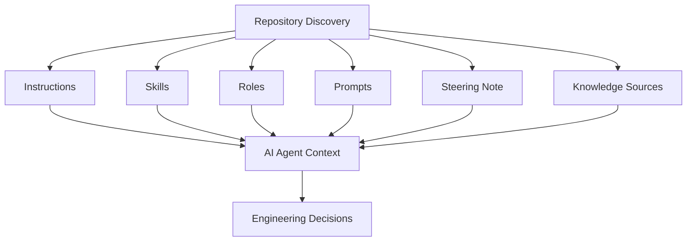
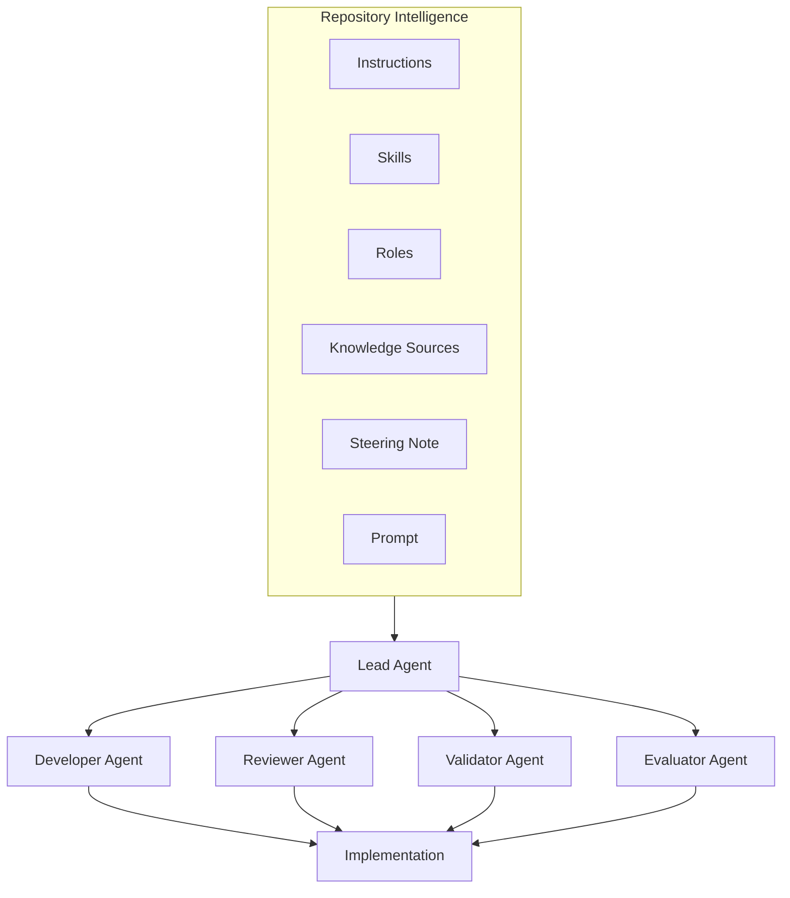
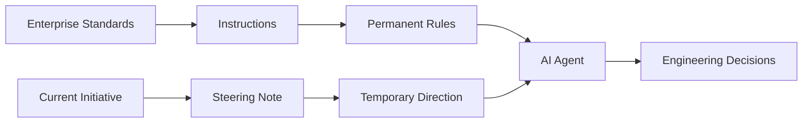
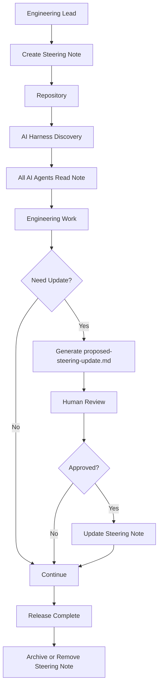
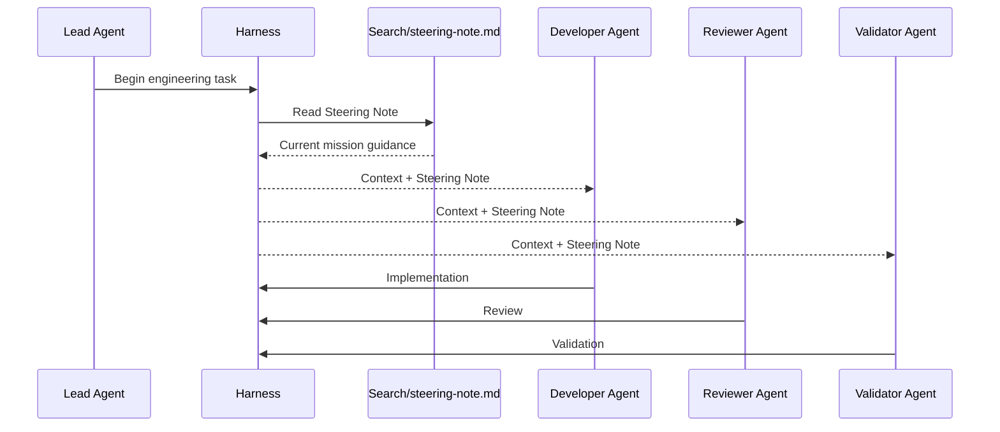
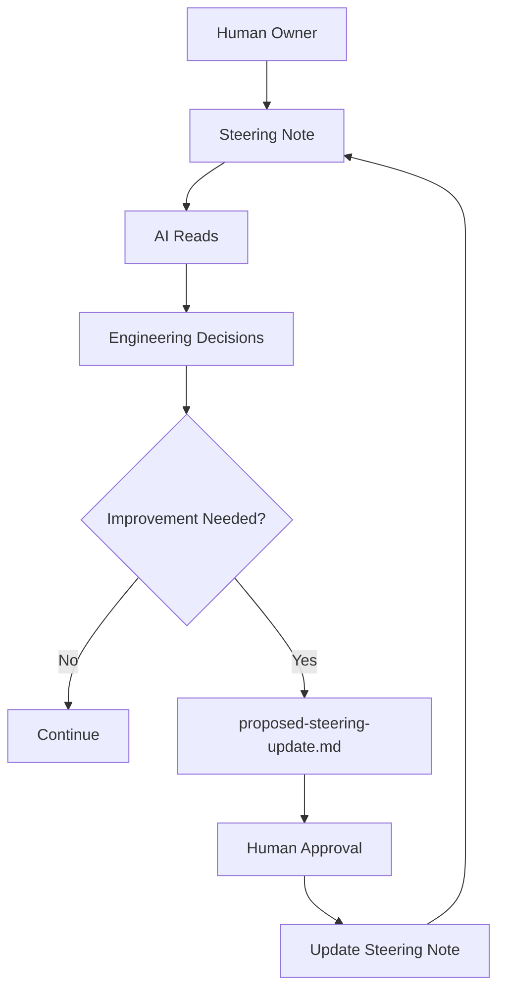
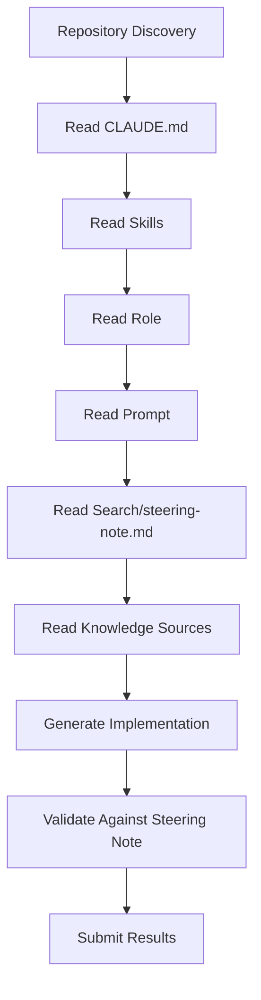
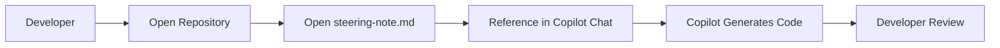
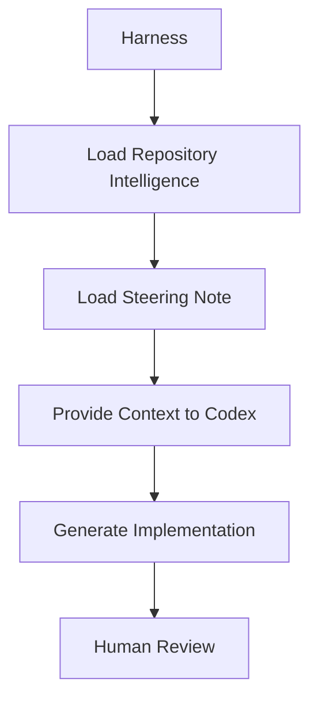
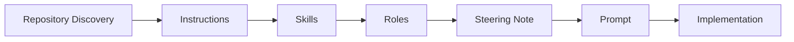

# Chapter 10 — Steering Notes

## 1. Story-Driven Opening

The Alpha Car Detailing engineering organization was entering the final week before the quarterly enterprise release.

One feature had become the company's highest business priority: **Corporate Fleet Booking**.

The sales organization had already demonstrated the feature to three national fleet customers. Marketing campaigns had been scheduled. Customer onboarding sessions were booked. The executive steering committee had committed to the release date.

The repository already contained mature engineering guidance.

Repository Instructions defined architecture standards, coding conventions, testing requirements, security policies, logging practices, and review expectations.

Skills described repeatable engineering procedures such as creating APIs, publishing domain events, implementing transactional outbox patterns, adding OpenTelemetry instrumentation, and writing integration tests.

Roles separated responsibilities among Lead Agent, Developer Agent, Reviewer Agent, Validator Agent, Security Reviewer, and Evaluator Agent.

Prompts described today's engineering work.

Everything appeared ready.

Then an unexpected situation emerged.

A production issue affecting another service required emergency engineering attention. At the same time, the corporate fleet customers requested one additional capability before signing their contracts.

Engineering priorities changed overnight.

Not every service should continue receiving new features.

Some services were now frozen.

Some architectural improvements were postponed.

Certain infrastructure work was temporarily suspended.

Additional security approval became mandatory before deployment.

The repository Instructions remained correct.

The Skills remained correct.

The Roles remained correct.

The Prompt requesting implementation of Corporate Fleet Booking remained valid.

Yet none of those artifacts communicated the organization's **current mission**.

Every AI coding agent needed immediate awareness that:

* Fleet Booking was the organization's highest priority.
* Customer Notification Service was temporarily out of scope.
* Pricing Service changes required architecture approval.
* The Booking Service must be completed before Friday.
* Security review was mandatory before merging.
* Database schema changes required DBA approval.
* Existing APIs could be extended, but no new microservices could be introduced during the release stabilization period.
* Any performance degradation exceeding agreed thresholds required immediate escalation.

These directions were temporary.

They would disappear after the release.

Embedding them into repository Instructions would permanently pollute engineering standards.

Embedding them into Skills would incorrectly alter reusable implementation workflows.

Embedding them into Prompts would require repeating identical business context across dozens of engineering tasks.

Instead, the engineering lead updated a single repository file:

```text
Search/steering-note.md
```

Every AI agent began its work by reading that file.

Developer agents understood current priorities.

Reviewer agents knew which rules required additional attention.

Validator agents recognized temporary acceptance criteria.

Evaluator agents understood release risks.

The Steering Note aligned every participant around the current mission without changing the long-term engineering standards of the repository.

This distinction represents one of the most important concepts in Enterprise AI Engineering.

A repository contains both permanent knowledge and temporary direction.

Instructions preserve institutional engineering standards.

Steering Notes communicate today's operational reality.

---

# 2. Learning Objectives

After completing this chapter, you will be able to:

* Explain the purpose of Steering Notes in enterprise AI engineering.
* Distinguish Steering Notes from Instructions, Skills, Prompts, Roles, and Knowledge Sources.
* Identify the information that belongs in a Steering Note.
* Define the lifecycle, ownership, approval process, and expiration of Steering Notes.
* Understand how multiple AI agents consume the same Steering Note during a development initiative.
* Design AI harnesses that automatically discover and distribute current steering guidance.
* Prevent AI agents from modifying Steering Notes without explicit authorization.
* Implement a controlled proposal process using `proposed-steering-update.md`.
* Recognize common anti-patterns associated with temporary engineering guidance.
* Govern Steering Notes as auditable engineering artifacts rather than informal documentation.

---

# 3. Background

Enterprise software development rarely occurs under static conditions.

Business priorities evolve.

Release schedules change.

Security incidents emerge.

Production defects require immediate attention.

Architecture reviews introduce temporary constraints.

External dependencies become unavailable.

Compliance requirements change before deployment.

While permanent engineering standards remain relatively stable, operational priorities can change several times during a single sprint.

Human engineering teams naturally communicate these changes through meetings, release briefings, architecture reviews, chat channels, sprint planning sessions, and daily stand-ups.

AI coding agents do not participate in these conversations.

Without an explicit mechanism for communicating temporary direction, different agents may optimize for different objectives.

One agent may continue refactoring code during a release freeze.

Another may introduce architectural improvements that delay deployment.

A third may implement features that have already been deprioritized.

None of these actions violate repository Instructions.

None violate Skills.

None violate their assigned Role.

They simply lack awareness of the organization's current mission.

Steering Notes bridge this gap.

They provide a concise, human-maintained briefing that informs every AI agent of the current engineering context before work begins.

Unlike Instructions, Steering Notes are intentionally temporary.

Unlike Prompts, they are shared across many engineering tasks.

Unlike Skills, they describe priorities rather than procedures.

Unlike Roles, they describe mission context rather than responsibilities.

They are operational guidance rather than institutional knowledge.

---

# 4. Concepts

## What Is a Steering Note?

A **Steering Note** is a temporary, human-authored engineering document that communicates the current mission, priorities, constraints, risks, dependencies, and expectations for AI agents participating in a specific initiative, sprint, release, or operational activity.

Its primary purpose is alignment.

Rather than explaining how software should always be built, a Steering Note explains how work should proceed under today's circumstances.

Typical Steering Notes are stored in a well-known repository location such as:

```text
Search/
    steering-note.md
```

An AI harness can automatically discover this location during repository initialization and include its contents in the context supplied to every participating AI agent. This aligns with the agreed project convention that `Search/steering-note.md` serves as the mission briefing maintained by humans for AI consumption.

---

## Characteristics of a Steering Note

A professional Steering Note has several defining characteristics.

| Characteristic     | Description                                                                  |
| ------------------ | ---------------------------------------------------------------------------- |
| Temporary          | Exists only for the current initiative or operational period.                |
| Human-maintained   | Normally written and updated by engineering leadership.                      |
| Repository-visible | Stored in a consistent repository location where all agents can discover it. |
| Mission-oriented   | Communicates business priorities rather than implementation details.         |
| Read-only for AI   | AI agents consume the document but do not modify it without authorization.   |
| Time-bound         | Includes an expected expiration date or review date.                         |
| Auditable          | Changes are tracked through version control and code review.                 |

---

## Why Temporary Guidance Is Needed

Enterprise repositories already contain substantial engineering knowledge.

However, permanent knowledge alone cannot answer questions such as:

* Which initiative has the highest business priority today?
* Which services are frozen for release stabilization?
* Which architectural work has been postponed?
* Which production issues require immediate attention?
* Which dependencies currently present elevated risk?
* Which approvals are mandatory before merge?
* Which engineering trade-offs have been temporarily accepted?

These are operational decisions.

They belong in a Steering Note because they change frequently and should not become permanent engineering standards.

---

## Typical Contents of a Steering Note

Although organizations may customize the format, enterprise Steering Notes commonly include sections such as:

| Section                   | Purpose                                                        |
| ------------------------- | -------------------------------------------------------------- |
| Current Business Priority | Explains why the initiative matters.                           |
| Services In Scope         | Defines where engineering effort should be focused.            |
| Services Out of Scope     | Prevents unnecessary work.                                     |
| Architecture Constraints  | Identifies temporary architectural limitations.                |
| Security Considerations   | Highlights heightened security expectations.                   |
| Known Risks               | Documents technical or business risks requiring attention.     |
| Dependencies              | Lists teams, systems, or approvals that affect delivery.       |
| Release Milestones        | Defines important delivery dates.                              |
| Required Approvals        | Identifies mandatory human reviews.                            |
| Escalation Conditions     | Defines situations requiring immediate human involvement.      |
| Expected Outputs          | Clarifies the deliverables expected from participating agents. |
| Expiration                | Specifies when the Steering Note is no longer valid.           |

---

## Example Steering Note

The following simplified example illustrates a Steering Note for the Corporate Fleet Booking release.

```text
Mission
Corporate Fleet Booking Release

Business Priority
Highest priority for Q3 enterprise release.

Services In Scope
- Booking Service
- Fleet Management Service
- Customer API

Services Out of Scope
- Loyalty Service
- Notification Enhancements
- Pricing Optimization

Architecture Constraints
No new microservices.
No database technology changes.
Reuse existing event contracts.

Release Deadline
Friday 18:00 UTC

Known Risks
Large fleet imports.
Peak booking traffic.

Required Approvals
Architecture Review
Security Review
DBA Approval for schema changes

Escalation
Performance regression
Security vulnerability
Breaking API change

Expiration
Remove after Q3 release completion.
```

This document provides operational context that every participating AI agent can understand before beginning work.

Unlike repository Instructions, it intentionally describes only the current initiative.

---

## Steering Notes Are Normally Human-Maintained

One of the most important governance principles in Enterprise AI Engineering is ownership.

Steering Notes represent organizational intent.

They are typically authored and maintained by individuals responsible for delivery, such as:

* Technical Leads
* Solution Architects
* Engineering Managers
* Release Managers
* Product Engineering Leads

AI agents are expected to:

* Read the Steering Note.
* Follow the guidance it contains.
* Respect its constraints.
* Reference it when making implementation decisions.

AI agents should **not** silently modify the Steering Note.

If an agent discovers conflicting priorities, outdated guidance, missing dependencies, or new operational risks, it should prepare a recommendation instead of altering the repository.

The recommendation should be written as:

```text
proposed-steering-update.md
```

A human reviewer evaluates the proposal and decides whether the official Steering Note should be updated.

This governance model preserves accountability while allowing AI systems to surface valuable observations without becoming the authority over organizational priorities.

---

# 5. Architecture Discussion

Steering Notes are most effective when treated as a first-class architectural component of the AI engineering ecosystem rather than as informal project documentation.

In earlier chapters, we established that every AI coding agent requires **Repository Intelligence** before making engineering decisions. Repository Intelligence consists of multiple complementary knowledge sources, each serving a distinct purpose.

Instructions define long-term engineering standards.

Skills define repeatable implementation workflows.

Prompts describe the current engineering task.

Roles establish responsibility and authority.

Steering Notes provide the operational context within which all of those artifacts are interpreted.

Without Steering Notes, every AI agent possesses the same permanent engineering knowledge but may optimize for different business objectives because the current mission has not been communicated.

Steering Notes therefore occupy a unique architectural position.

They are not implementation guidance.

They are not organizational policy.

They are mission guidance.

---

## Steering Notes Within Repository Intelligence

The following architecture illustrates how Steering Notes complement the other repository artifacts.



Each repository artifact answers a different question.

| Repository Artifact | Primary Question                               |
| ------------------- | ---------------------------------------------- |
| Instructions        | What rules must always be followed?            |
| Skills              | How is recurring work performed?               |
| Prompts             | What work must be completed now?               |
| Roles               | Who performs the work and with what authority? |
| Steering Notes      | What is currently most important?              |
| Knowledge Sources   | What information should the agent use?         |

Collectively, these artifacts enable AI agents to make decisions that are technically correct, procedurally consistent, organizationally aligned, and operationally relevant.

---

## Steering Notes Versus Instructions

This distinction is fundamental to Enterprise AI Engineering.

Instructions define persistent engineering standards that remain valid across many releases.

Examples include:

* Coding standards
* Security requirements
* Logging conventions
* Testing expectations
* Naming conventions
* Architectural patterns
* Branch policies

These standards rarely change.

Steering Notes, by contrast, intentionally change whenever organizational priorities change.

Consider the following example from Alpha Car Detailing.

### Repository Instruction

```text
Every externally accessible API must expose OpenTelemetry traces.
```

This requirement should remain valid for years.

Now consider a Steering Note.

```text
During the Fleet Booking release, prioritize API stability over performance optimization.
```

This guidance applies only during the current release.

After deployment, the guidance disappears.

Promoting temporary operational guidance into permanent Instructions creates unnecessary long-term complexity.

Likewise, embedding permanent standards into Steering Notes risks those standards disappearing after the note expires.

Enterprise repositories therefore maintain a clear separation between enduring engineering policy and temporary operational direction.

---

## Steering Notes Versus Prompts

Prompts define individual engineering tasks.

For example:

```text
Implement Corporate Fleet Booking support for the Booking Service.
```

The Prompt tells the agent **what to build**.

The Steering Note explains **the environment in which the work is occurring**.

For example:

```text
Fleet Booking is the highest business priority.

Notification enhancements are postponed.

Architecture review is mandatory before merge.

Performance regressions require immediate escalation.
```

Every Prompt issued during the release automatically inherits this context.

Instead of repeating these conditions across dozens of prompts, the repository centralizes them within a single Steering Note.

This significantly improves consistency while reducing prompt duplication.

---

## Steering Notes Versus Roles

Roles define responsibilities.

A Reviewer Agent evaluates implementation quality.

A Validator Agent verifies correctness.

A Security Reviewer focuses on security risks.

A Lead Agent coordinates overall execution.

These responsibilities remain stable.

Steering Notes temporarily adjust operational focus.

For example, the Security Reviewer always performs security review.

However, during a release involving payment processing, the Steering Note may state:

```text
Prioritize authentication and authorization validation above all other security checks.
```

The Role has not changed.

Only the mission emphasis has changed.

Similarly, a Developer Agent continues implementing software according to its assigned responsibilities.

The Steering Note merely explains which work should receive immediate attention.

---

## Steering Notes Versus Knowledge Sources

Knowledge Sources provide factual information.

Examples include:

* Architecture Decision Records
* API specifications
* Domain documentation
* Database schemas
* Business rules
* Operational runbooks

Knowledge Sources answer questions such as:

* How does Fleet Booking work?
* What fields exist in the Booking database?
* Which integration events are published?

Steering Notes answer different questions.

* Which feature has priority today?
* Which systems should remain untouched?
* Which architectural risks require additional review?
* Which dependencies are currently unstable?

Knowledge Sources describe the system.

Steering Notes describe today's operational priorities.

Because they solve different problems, both should be supplied to AI agents.

---

## Scope and Lifetime

One of the defining characteristics of Steering Notes is their deliberately limited lifespan.

A Steering Note should never become permanent repository documentation.

Instead, it should exist only for the duration of a clearly defined operational activity.

Typical scopes include:

| Scope              | Example                             |
| ------------------ | ----------------------------------- |
| Engineering task   | Database migration initiative       |
| Sprint             | Sprint 18 implementation priorities |
| Release            | Q3 Corporate Fleet Booking release  |
| Incident           | Production outage stabilization     |
| Security event     | Emergency vulnerability remediation |
| Platform migration | Azure Kubernetes migration          |

Every Steering Note should explicitly state:

* Effective date
* Review date
* Expiration date
* Owning team
* Current version

When the initiative concludes, the Steering Note should either:

* be removed,
* be archived,
* or be replaced by a new Steering Note.

Allowing obsolete Steering Notes to remain active creates confusion for both humans and AI agents.

---

## Ownership and Update Responsibility

Unlike Skills or Prompts, Steering Notes represent organizational intent rather than engineering implementation.

Consequently, ownership should remain with designated human leaders.

Typical owners include:

| Owner                    | Typical Responsibility      |
| ------------------------ | --------------------------- |
| Technical Lead           | Sprint priorities           |
| Solution Architect       | Architecture constraints    |
| Engineering Manager      | Delivery expectations       |
| Release Manager          | Release coordination        |
| Security Lead            | Temporary security guidance |
| Product Engineering Lead | Business priorities         |

AI agents consume Steering Notes but should not assume ownership of them.

An AI agent may detect:

* outdated priorities,
* inconsistent constraints,
* missing dependencies,
* conflicting deadlines,
* obsolete escalation paths.

However, these observations should be presented as recommendations rather than direct modifications.

This separation preserves clear accountability for operational decisions.

---

## AI-Proposed Steering Updates

Enterprise AI systems become increasingly valuable as they observe repository activity.

An Evaluator Agent may recognize that:

* a dependency has already been completed,
* an escalation condition is obsolete,
* a release date has changed,
* a temporary freeze should be removed.

Rather than editing the Steering Note directly, the agent should prepare a proposal.

For example:

```text
proposed-steering-update.md

Observation

Fleet Import Service completed production validation.

Recommendation

Remove temporary deployment restriction.

Reason

Validation evidence recorded in Release 2026.3.

Human Approval Required
```

The proposal becomes part of the normal engineering review process.

Only after human approval should the official Steering Note be updated.

This governance model aligns with the broader handbook principle that AI systems recommend improvements while humans retain authority over engineering standards and organizational direction.

---

## Approval and Expiration

Every Steering Note should identify who is authorized to approve it.

For example:

| Change                  | Approval Required        |
| ----------------------- | ------------------------ |
| Business priority       | Product Engineering Lead |
| Architecture constraint | Solution Architect       |
| Security exception      | Security Lead            |
| Release schedule        | Release Manager          |
| Production freeze       | Engineering Manager      |

Similarly, every Steering Note should contain a clearly defined expiration mechanism.

Possible approaches include:

* Explicit expiration date
* Sprint completion
* Release completion
* Incident resolution
* Manual replacement by a newer Steering Note

A Steering Note without an expiration condition eventually becomes indistinguishable from permanent repository documentation, defeating its intended purpose.

---

# 6. Professional Diagrams

Steering Notes are best understood as a temporary governance layer that sits above implementation activities and below long-term repository standards.

Unlike Instructions, which define permanent engineering policy, Steering Notes continuously adapt to the current business mission.

The following diagrams illustrate how Steering Notes participate in Enterprise AI Engineering.

---

## Steering Notes Within the Repository Intelligence Model



Every participating agent receives exactly the same Steering Note.

No agent is expected to discover current priorities independently.

Instead, the repository communicates organizational intent consistently to every participant.

---

## Separation of Permanent and Temporary Guidance



The AI agent simultaneously consumes:

* permanent repository standards, and
* temporary operational guidance.

Both are necessary.

Permanent standards ensure consistency.

Temporary guidance ensures organizational alignment.

---

## Steering Note Lifecycle



This lifecycle reinforces a fundamental governance principle:

AI agents may recommend changes, but humans approve organizational direction.

---

## Steering Notes Inside an AI Harness

The AI harness acts as the orchestration layer responsible for distributing Steering Notes to every participating agent.



Because every agent receives identical mission guidance, engineering decisions remain aligned throughout the workflow.

---

## Steering Note Governance



This governance model preserves organizational accountability while still allowing AI agents to contribute useful operational observations.

---

# 7. Hands-on Example

Throughout this handbook, Alpha Car Detailing serves as the enterprise reference implementation.

The engineering organization is preparing the **Corporate Fleet Booking** capability for the upcoming quarterly release.

A Steering Note has been created to ensure every AI agent understands the current operational priorities.

---

## Example Repository Structure

```text
AlphaCarDetailing/

Search/
    steering-note.md

Instructions/
    CLAUDE.md

Skills/
    create-api.md
    create-event.md
    transactional-outbox.md

Prompts/
    implement-fleet-booking.md

Roles/
    developer.md
    reviewer.md
    validator.md
```

The repository discovery process identifies all repository intelligence before engineering begins.

The harness loads:

1. Repository Instructions
2. Required Skills
3. Assigned Role
4. Current Prompt
5. Steering Note
6. Relevant Knowledge Sources

Only after all context has been assembled does implementation begin.

---

## Example Steering Note

```markdown
# Fleet Booking Release

Owner
Technical Lead

Effective Date
2026-07-01

Review Date
2026-07-05

Expiration
Release Completion

Business Priority

Corporate Fleet Booking is the highest engineering priority for this release.

Services In Scope

- Booking Service
- Fleet Service
- Customer API

Services Out of Scope

- Loyalty Service
- Mobile Application
- Notification Refactoring

Architecture Constraints

Reuse existing Booking events.

No new microservices.

No database platform changes.

Security

Security review required before merge.

Dependencies

Fleet Management API

Identity Service

Architecture Review

Known Risks

Large customer imports

Peak booking traffic

Escalation

Performance degradation

Breaking API changes

Authentication failures

Expected Outputs

Production-ready implementation

Integration tests

Architecture approval

Security approval
```

Notice that none of this information belongs in repository Instructions.

Likewise, it should not be duplicated inside every Prompt.

The Steering Note centralizes current operational guidance for the entire initiative.

---

## Agent Behavior

After reading the Steering Note, a Developer Agent immediately understands:

* Fleet Booking takes precedence over lower-priority enhancements.
* New microservices must not be introduced.
* Existing event contracts must be reused.
* Security approval is mandatory.
* Performance regressions require escalation.

A Reviewer Agent focuses additional attention on:

* Event compatibility
* Security compliance
* Architecture constraints

A Validator Agent confirms:

* Required integration tests exist.
* Deployment constraints have been respected.
* Expected deliverables have been produced.

Each agent continues fulfilling its assigned Role while operating under the same temporary mission guidance.

---

## Detecting an Outdated Steering Note

During implementation, the Evaluator Agent discovers that the Fleet Management API dependency has already been upgraded and the associated temporary restriction is no longer necessary.

The agent **does not** edit `Search/steering-note.md`.

Instead, it creates:

```text
proposed-steering-update.md
```

Example:

```markdown
Observation

Fleet Management API v3 has completed production rollout.

Recommendation

Remove temporary compatibility warning.

Reason

Dependency validation completed successfully.

Supporting Evidence

Integration Test FT-212
Production Validation Report

Approval Required

Technical Lead
```

The Technical Lead reviews the proposal.

If approved, the official Steering Note is updated.

If rejected, the proposal becomes part of the engineering audit trail.

This workflow preserves the handbook's governance principle that Steering Notes are normally maintained by humans while allowing AI agents to contribute recommendations without assuming organizational authority.

---

# 8. Claude Example

Throughout this handbook, **Claude Code** serves as the primary implementation platform because it is the organization's approved AI coding agent. However, the engineering principles discussed remain vendor-neutral and apply equally to other AI coding platforms.

One of the strengths of Claude Code is its ability to consume repository context before performing engineering work.

Rather than relying solely on a user prompt, Claude can be guided by multiple repository artifacts discovered during initialization.

For the Corporate Fleet Booking initiative, the harness supplies the following information:

1. Repository Instructions
2. Required Skills
3. Assigned Role
4. Current Prompt
5. Steering Note
6. Relevant Knowledge Sources

The Steering Note provides temporary operational context that complements—but never replaces—the permanent repository standards.

---

## Claude Repository Context

A typical repository may contain the following structure:

```text
AlphaCarDetailing/

CLAUDE.md

Search/
    steering-note.md

Skills/
    create-api.md
    transactional-outbox.md
    integration-testing.md

Roles/
    developer.md

Prompts/
    implement-fleet-booking.md

Knowledge/
    architecture.md
    booking-domain.md
```

When Claude begins work, it already understands:

* repository engineering standards,
* reusable engineering procedures,
* its assigned responsibilities,
* the requested engineering task,
* and the current organizational priorities.

This layered context enables significantly better engineering decisions than a prompt alone.

---

## Example Steering Note

Claude reads the current Steering Note before implementation.

```markdown
# Fleet Booking Release

Priority

Corporate Fleet Booking is the highest business priority.

Current Sprint Goal

Complete Fleet Booking API and domain workflow.

Architecture Constraints

Reuse existing Booking events.

No new microservices.

No infrastructure changes.

Security

Architecture approval required.

Security approval required.

Risks

Fleet imports exceeding 100,000 vehicles.

High booking traffic during customer onboarding.

Escalation

Breaking API changes.

Authentication failures.

Database schema conflicts.
```

This guidance immediately influences implementation decisions.

Claude understands that introducing an entirely new Booking platform would violate the current mission, even if technically feasible.

Instead, it extends the existing architecture because that aligns with the temporary operational direction.

---

## Claude Workflow

The following illustrates a typical execution sequence.



Notice that the Steering Note is consumed **before** implementation begins.

This ensures that engineering decisions reflect current organizational priorities rather than repository standards alone.

---

## Example Engineering Decision

Suppose Claude identifies an opportunity to improve the Notification Service while implementing Fleet Booking.

From a purely technical perspective, the improvement is beneficial.

However, the Steering Note states:

```text
Notification Service enhancements are out of scope for this release.
```

Claude therefore postpones the improvement and continues focusing exclusively on Fleet Booking.

This is an example of the Steering Note influencing prioritization without changing architectural standards.

---

## Example AI Response

Suppose the implementation Prompt is:

```text
Implement Corporate Fleet Booking support.
```

Claude may internally reason along these lines:

* Fleet Booking is the highest business priority.
* Notification Service is outside the current release scope.
* Existing Booking events must be reused.
* New microservices are prohibited.
* Architecture approval is required before merge.
* Security review is mandatory.
* Integration tests are expected.

These conclusions are derived from the Steering Note rather than from the Prompt itself.

The Prompt defines **what** to implement.

The Steering Note defines **how the organization expects the initiative to be executed under current operational conditions**.

---

## Detecting a Needed Steering Change

During implementation, Claude discovers that one dependency has already completed production rollout.

Rather than editing the Steering Note directly, Claude generates a proposal.

```text
proposed-steering-update.md
```

Example:

```markdown
# Proposed Steering Update

Observation

Fleet Import Service production rollout completed successfully.

Recommendation

Remove temporary deployment restriction.

Reason

Production validation has completed.

Supporting Evidence

Deployment Report 2026.07.08

Approval Required

Technical Lead
```

The proposal is submitted for human review.

Only after explicit approval should `Search/steering-note.md` be updated.

This preserves one of the most important governance principles in Enterprise AI Engineering:

> **AI agents may recommend changes to organizational direction, but humans remain responsible for defining and approving that direction.**

---

# 9. GitHub Copilot Comparison

GitHub Copilot also benefits from temporary operational guidance, but the mechanism differs from Claude Code.

Claude Code is designed to work with a repository-centric context model, where repository discovery can automatically assemble Instructions, Skills, Roles, Steering Notes, Prompts, and Knowledge Sources into a unified working context.

GitHub Copilot typically relies more heavily on:

* the currently opened files,
* workspace context,
* editor selection,
* chat history,
* and explicitly referenced documentation.

As a result, engineering teams should make Steering Notes easy to discover and intentionally reference them during Copilot-assisted development.

---

## Typical Copilot Workflow



The human developer plays a larger role in ensuring that temporary guidance is included in the AI conversation.

---

## Example Copilot Prompt

```text
Implement Corporate Fleet Booking.

Use the repository instructions.

Follow the current guidance in Search/steering-note.md.

Do not modify any services marked as out of scope.
```

This explicit reference helps ensure that Copilot considers the temporary operational context in addition to the code currently visible in the editor.

---

## Comparison with Claude

| Capability                          | Claude Code                                  | GitHub Copilot                                          |
| ----------------------------------- | -------------------------------------------- | ------------------------------------------------------- |
| Repository discovery                | Repository-first workflow                    | Primarily editor and workspace context                  |
| Automatic Steering Note consumption | Common harness pattern                       | Usually referenced explicitly by the developer          |
| Multi-document reasoning            | Strong support across repository artifacts   | Depends on workspace context and referenced files       |
| Operational guidance                | Naturally fits repository intelligence model | Best included through chat instructions or opened files |

The underlying engineering principle remains identical:

Every AI agent should understand the organization's current priorities before producing implementation decisions.

---

# 10. Codex Comparison

OpenAI Codex follows the same engineering principle, although its operational workflow depends on the environment in which it is used.

Whether Codex operates through a command-line interface, integrated development environment, or automated harness, it benefits from receiving repository intelligence before executing engineering tasks.

A typical enterprise harness supplies Codex with:

* repository Instructions,
* relevant Skills,
* assigned Role,
* current Prompt,
* Steering Note,
* and supporting Knowledge Sources.

The source of the context may differ, but the objective remains the same: align implementation with the current mission rather than relying solely on the task description.

---

## Typical Codex Workflow



---

## Comparison Across Platforms

| Capability                                    | Claude Code                 | GitHub Copilot             | OpenAI Codex               |
| --------------------------------------------- | --------------------------- | -------------------------- | -------------------------- |
| Repository-centric workflow                   | Excellent                   | Moderate                   | Harness-dependent          |
| Steering Note integration                     | Natural repository artifact | Usually developer-supplied | Typically harness-supplied |
| Human ownership of Steering Note              | Yes                         | Yes                        | Yes                        |
| AI may silently edit Steering Note            | No                          | No                         | No                         |
| Supports proposed-steering-update.md workflow | Yes                         | Yes                        | Yes                        |

Regardless of platform, the governance rule is unchanged:

* Steering Notes are normally maintained by humans.
* AI agents read and follow them.
* Proposed changes are documented separately.
* Human approval is required before organizational direction is modified.

This consistency allows organizations to remain vendor-neutral while adopting different AI coding platforms.

---

# 11. Best Practices

Steering Notes are most valuable when they remain concise, current, authoritative, and clearly distinguished from other repository artifacts.

Many organizations initially treat Steering Notes as informal project notes. Mature Enterprise AI Engineering organizations instead manage them as governed operational documents that provide temporary mission direction for both humans and AI agents.

The following practices have consistently proven effective in enterprise-scale development.

---

## Keep Steering Notes Temporary

A Steering Note should communicate only information relevant to the current initiative.

It should never evolve into a permanent engineering document.

As soon as information becomes long-term engineering policy, it should be moved into the appropriate repository artifact.

For example:

* Coding conventions belong in Instructions.
* Standard implementation procedures belong in Skills.
* Architecture decisions belong in Architecture Decision Records (ADRs).
* Business knowledge belongs in Knowledge Sources.
* Temporary release priorities belong in Steering Notes.

Maintaining this separation keeps every repository artifact focused on its intended purpose.

---

## Assign a Clearly Identified Owner

Every Steering Note should identify the individual or team responsible for maintaining it.

For example:

| Steering Topic           | Recommended Owner        |
| ------------------------ | ------------------------ |
| Sprint priorities        | Technical Lead           |
| Release coordination     | Release Manager          |
| Architecture constraints | Solution Architect       |
| Security guidance        | Security Lead            |
| Operational risks        | Engineering Manager      |
| Business priorities      | Product Engineering Lead |

Ownership ensures accountability.

When priorities change, everyone knows who is responsible for updating the document.

---

## Include an Expiration Mechanism

Temporary guidance should never remain active indefinitely.

Each Steering Note should clearly indicate when it should be reviewed or retired.

Examples include:

* Sprint completion
* Release completion
* Production deployment
* Incident resolution
* Specific calendar date

Example:

```text
Effective Date
2026-07-01

Review Date
2026-07-05

Expiration
Remove after Fleet Booking production deployment.
```

An expired Steering Note should either be archived or replaced with a newer version.

---

## Focus on Operational Decisions

A Steering Note should communicate operational context rather than implementation details.

Good examples include:

* Current business priorities
* Services currently frozen
* Temporary architecture restrictions
* Required approvals
* Known operational risks
* Escalation conditions
* Dependencies affecting delivery

Poor examples include:

* API implementation examples
* Coding standards
* Naming conventions
* Database design guidelines
* Testing frameworks

Those topics belong elsewhere within the repository.

---

## Make Guidance Easy to Discover

Every AI agent should know exactly where to locate the current Steering Note.

The repository should use a consistent location such as:

```text
Search/
    steering-note.md
```

The AI harness should automatically discover and distribute the Steering Note before engineering work begins.

Developers should not have to remember its location during every task.

---

## Keep It Short

A Steering Note is a mission briefing—not a design document.

Most enterprise Steering Notes are only one or two pages.

The objective is rapid situational awareness.

Engineers and AI agents should be able to understand the current mission within a few minutes.

If the document grows into dozens of pages, important priorities become difficult to identify.

---

## Separate Facts from Decisions

Professional Steering Notes distinguish between factual information and temporary management decisions.

For example:

| Facts                             | Decisions                                          |
| --------------------------------- | -------------------------------------------------- |
| Fleet API v2 deployed             | Continue using v1 during this release              |
| Customer onboarding begins Monday | Prioritize Fleet Booking over Loyalty enhancements |
| Security audit scheduled Friday   | Security approval required before merge            |

This separation makes it easier for both humans and AI agents to understand why temporary guidance exists.

---

## Record Risks Explicitly

Operational risk should never be implied.

Every Steering Note should identify known technical and business risks.

Examples include:

* High production traffic
* External vendor dependencies
* Database migration risks
* Regulatory deadlines
* Capacity limitations
* Security review concerns

Explicitly documenting risks helps AI agents make better engineering trade-offs.

---

## Define Escalation Conditions

AI agents should know when autonomous decision-making must stop.

Examples include:

* Breaking API changes
* Authentication failures
* Customer data exposure
* Architecture violations
* Significant performance degradation
* Compliance concerns

When these conditions occur, the agent should immediately request human involvement rather than continuing independently.

---

## Preserve Audit History

Steering Notes should remain under version control.

Changes should be:

* reviewed,
* approved,
* committed,
* and traceable.

An organization should always be able to answer:

* Who changed the Steering Note?
* When was it changed?
* Why was it changed?
* Which release required the change?

Version control provides this audit trail.

---

# 12. Anti-patterns

Like every repository artifact, Steering Notes can be misused.

The following anti-patterns are commonly observed during early AI adoption and often lead to inconsistent engineering decisions.

---

## Anti-pattern 1: Using Steering Notes as Permanent Instructions

One of the most common mistakes is gradually turning the Steering Note into another Instructions document.

For example:

```text
Always use PascalCase.

Always write integration tests.

Always use CQRS.
```

These are permanent engineering standards.

They belong in repository Instructions—not in a temporary Steering Note.

If they remain in the Steering Note, they may disappear when the release concludes.

---

## Anti-pattern 2: Embedding Task Prompts

Some organizations copy entire implementation requests into the Steering Note.

For example:

```text
Create Fleet Booking API.

Add Vehicle Controller.

Write integration tests.

Update Booking Repository.
```

These are engineering tasks.

They belong in Prompts.

A Steering Note should describe the mission, not the implementation backlog.

---

## Anti-pattern 3: Missing Ownership

A Steering Note without an owner quickly becomes unreliable.

When priorities change:

* nobody updates it,
* outdated information remains,
* conflicting guidance accumulates,
* engineers lose confidence in its accuracy.

Always identify the responsible owner.

---

## Anti-pattern 4: Stale Priorities

A Steering Note that continues listing completed work as the highest priority eventually becomes misleading.

For example:

```text
Highest Priority

Fleet Booking
```

Three months after deployment, this statement is no longer useful.

Expired priorities reduce trust in repository intelligence.

---

## Anti-pattern 5: No Expiration Date

Temporary guidance without a retirement mechanism frequently becomes permanent by accident.

Every Steering Note should answer:

> "When does this guidance stop applying?"

If that question cannot be answered, the Steering Note is incomplete.

---

## Anti-pattern 6: Conflicting Direction

Conflicting guidance creates uncertainty for both humans and AI agents.

Example:

**Instruction**

```text
New microservices are encouraged.
```

**Steering Note**

```text
No new microservices during release stabilization.
```

This is acceptable because the Steering Note introduces a **temporary operational exception**.

However, the temporary nature should be clearly stated.

Otherwise, developers may incorrectly assume that repository standards have changed permanently.

---

## Anti-pattern 7: Unclear Scope

A Steering Note should define its scope explicitly.

Poor example:

```text
Improve performance.
```

Better example:

```text
Improve Booking Service performance during Fleet Booking release.

Other services are outside the scope of this initiative.
```

Specific scope enables focused engineering effort.

---

## Anti-pattern 8: Allowing AI Agents to Silently Edit Steering Notes

Perhaps the most dangerous anti-pattern is allowing autonomous agents to rewrite organizational priorities without human approval.

For example:

```text
AI detected Notification Service instability.

Updating Steering Note...

Notification Service is now highest priority.
```

This is unacceptable.

Operational priorities belong to human leadership.

AI agents may recommend changes, but they should create:

```text
proposed-steering-update.md
```

The recommendation is then reviewed through the organization's normal governance process before any official Steering Note is modified.

---

## Anti-pattern 9: Treating Temporary Exceptions as Permanent Standards

Release-specific decisions should not migrate into long-term engineering policy.

For example:

```text
Reuse legacy authentication service during Fleet Booking release.
```

This temporary compromise should disappear once the release is complete.

Keeping temporary exceptions beyond their intended lifetime creates architectural debt and confusion.

---

## Anti-pattern 10: Omitting Risks and Escalation Conditions

A Steering Note that lists only priorities is incomplete.

Professional Steering Notes should also answer:

* What could go wrong?
* Which situations require human intervention?
* Which dependencies present elevated risk?
* When should AI agents stop autonomous execution?

Without these answers, agents may continue operating beyond the organization's acceptable risk threshold.

---

# 13. Architect's Notes

> **Architect's Note**
>
> Treat Steering Notes as **mission briefings rather than engineering documentation**. Their purpose is to align every engineer and every AI agent around today's operational objectives without modifying the repository's permanent engineering standards.

> **Architect's Note**
>
> Repository Instructions should evolve slowly. Steering Notes should evolve whenever business priorities change. If both artifacts change at the same frequency, their responsibilities have likely become blurred.

> **Architect's Note**
>
> Human ownership is a governance requirement, not merely a recommendation. AI agents can analyze operational conditions and recommend updates, but organizational priorities remain a management responsibility.

> **Architect's Note**
>
> The most effective Steering Notes are intentionally concise. A one-page document that clearly communicates priorities, risks, approvals, and constraints is often more valuable than a lengthy operational handbook.

---

# 14. Enterprise Tips

Organizations that successfully scale AI-assisted software development recognize that technical excellence alone is insufficient. AI agents must also understand the organization's current operational priorities.

The following practices have consistently proven effective in large enterprise environments.

---

## Enterprise Tip 1: Standardize the Steering Note Location

Every repository should expose the Steering Note from a predictable location.

For example:

```text
Search/
    steering-note.md
```

Avoid placing Steering Notes in random project folders or temporary collaboration spaces.

A consistent repository location enables AI harnesses, automation scripts, and engineering tools to discover the current mission without requiring project-specific configuration.

---

## Enterprise Tip 2: Load Steering Notes Before Prompt Execution

The Prompt should never be the first document consumed by an AI agent.

Instead, repository intelligence should be assembled in a consistent order.



By the time the Prompt is processed, the agent already understands:

* engineering standards,
* reusable workflows,
* assigned responsibilities,
* current business priorities.

This dramatically reduces inconsistent engineering decisions.

---

## Enterprise Tip 3: Review Steering Notes During Sprint Planning

Many organizations update user stories while forgetting to update temporary operational guidance.

An effective sprint planning checklist should include questions such as:

* Have business priorities changed?
* Have release dates changed?
* Have architectural constraints changed?
* Have new dependencies emerged?
* Have escalation conditions changed?
* Does the Steering Note still reflect reality?

Keeping Steering Notes synchronized with sprint planning helps ensure that AI agents and human engineers begin the sprint with the same understanding of organizational priorities.

---

## Enterprise Tip 4: Archive Completed Steering Notes

Steering Notes provide valuable historical context.

Rather than deleting them after every release, archive them.

For example:

```text
Search/

    steering-note.md

Archive/

    steering-note-2026-Q2.md

    steering-note-2026-Q3.md

    steering-note-major-incident.md
```

Archived Steering Notes support:

* release retrospectives,
* engineering audits,
* post-incident analysis,
* AI learning,
* organizational knowledge retention.

The active Steering Note remains concise while historical decisions remain available when needed.

---

## Enterprise Tip 5: Separate Business Priorities from Technical Constraints

Professional Steering Notes distinguish between **why** the initiative matters and **how** engineering must operate.

For example:

| Business Priorities                              | Technical Constraints          |
| ------------------------------------------------ | ------------------------------ |
| Deliver Fleet Booking before customer onboarding | No new microservices           |
| Minimize customer onboarding delays              | Reuse existing event contracts |
| Maintain production stability                    | No database technology changes |
| Meet contractual release date                    | Architecture approval required |

This separation allows AI agents to understand both organizational intent and engineering boundaries.

---

## Enterprise Tip 6: Make Risks Explicit

Enterprise AI agents should not infer operational risk.

Document it.

Instead of writing:

```text
Deployment may be difficult.
```

Provide actionable guidance:

```text
Known Risks

• Fleet imports exceeding 250,000 vehicles

• Increased API traffic during onboarding

• Identity Service dependency undergoing maintenance

Escalate immediately if authentication latency exceeds agreed thresholds.
```

Explicit risk documentation improves both AI reasoning and human situational awareness.

---

## Enterprise Tip 7: Use Steering Notes Across All Agents

Steering Notes should not be limited to Developer Agents.

Every participating agent benefits from understanding the current mission.

| Agent             | Steering Note Usage                                 |
| ----------------- | --------------------------------------------------- |
| Lead Agent        | Coordinate work according to business priorities    |
| Developer Agent   | Focus implementation on current objectives          |
| Reviewer Agent    | Evaluate compliance with temporary constraints      |
| Validator Agent   | Verify expected deliverables                        |
| Evaluator Agent   | Detect operational improvements and propose updates |
| Security Reviewer | Apply temporary security guidance during review     |

A shared operational context keeps multi-agent systems aligned throughout the engineering workflow.

---

## Enterprise Tip 8: Measure Steering Note Effectiveness

Like any engineering artifact, Steering Notes should be evaluated.

Useful metrics include:

* Number of outdated Steering Notes
* Average time between priority changes and Steering Note updates
* Percentage of releases with current Steering Notes
* Number of AI-generated proposed steering updates
* Time required for human approval
* Number of incidents caused by outdated operational guidance

These measurements help engineering leaders continuously improve governance processes.

---

# 15. Decision Points

Enterprise AI Engineering frequently requires balancing stability with adaptability.

The following decision points help architects determine how Steering Notes should be managed within their organizations.

---

## Decision Point 1: Where Should Steering Notes Be Stored?

Possible approaches include:

| Option                                 | Advantages                                   | Considerations                                   |
| -------------------------------------- | -------------------------------------------- | ------------------------------------------------ |
| Repository (`Search/steering-note.md`) | Version controlled, discoverable, reviewable | Recommended for most organizations               |
| Project Wiki                           | Easy for humans to edit                      | Harder for AI harnesses to discover consistently |
| External Documentation Portal          | Centralized governance                       | Additional synchronization required              |
| Issue Tracker                          | Good for temporary discussions               | Poor long-term discoverability                   |

For enterprise AI engineering, storing Steering Notes in the repository provides the strongest alignment with automated discovery, code review, and auditability.

---

## Decision Point 2: Who Owns the Steering Note?

Possible owners include:

* Technical Lead
* Solution Architect
* Engineering Manager
* Release Manager
* Product Engineering Lead

Ownership should follow organizational responsibility rather than technical implementation.

The owner should have authority to define priorities, constraints, and operational direction.

---

## Decision Point 3: Can AI Agents Update Steering Notes?

The handbook recommends the following governance model.

| Activity                      | AI Agent | Human |
| ----------------------------- | -------- | ----- |
| Read Steering Note            | ✓        | ✓     |
| Follow Steering Note          | ✓        | ✓     |
| Detect outdated guidance      | ✓        | ✓     |
| Recommend changes             | ✓        | ✓     |
| Modify official Steering Note | ✗        | ✓     |
| Approve operational direction | ✗        | ✓     |

This model preserves accountability while still benefiting from AI-assisted analysis.

---

## Decision Point 4: How Often Should Steering Notes Be Reviewed?

Review frequency should reflect the pace of operational change.

| Initiative                      | Recommended Review Frequency |
| ------------------------------- | ---------------------------- |
| Active production incident      | Multiple times per day       |
| Critical release                | Daily                        |
| Sprint implementation           | During daily stand-ups       |
| Stable maintenance release      | Weekly                       |
| Long-running platform migration | At each milestone            |

A review schedule should be documented within the Steering Note itself.

---

## Decision Point 5: What Happens When Guidance Conflicts?

Occasionally, a Steering Note may appear to conflict with existing repository Instructions.

For example:

**Instruction**

```text
All new functionality should be implemented using the preferred architectural patterns.
```

**Steering Note**

```text
During release stabilization, defer architectural refactoring unless required to resolve a production issue.
```

This is not necessarily a contradiction.

The Instruction continues defining the organization's permanent standard.

The Steering Note introduces a temporary operational constraint that applies only during the current initiative.

If the conflict cannot be resolved through context, the matter should be escalated to the Steering Note owner rather than interpreted independently by an AI agent.

---

# 16. Exercises

### Exercise 1 — Identify the Correct Artifact

For each statement below, determine whether it belongs in:

* Instructions
* Skills
* Prompts
* Roles
* Steering Notes

1. "Reuse the existing Booking integration events."
2. "Implement Fleet Booking support."
3. "Reviewer Agent validates security compliance."
4. "Corporate Fleet Booking is the highest business priority this sprint."
5. "Every API must expose OpenTelemetry traces."

Discuss your reasoning with your team and justify each classification.

---

### Exercise 2 — Create a Steering Note

Using the Alpha Car Detailing system, create a Steering Note for a nationwide holiday promotion.

Include:

* Business priority
* Services in scope
* Services out of scope
* Known risks
* Required approvals
* Dependencies
* Escalation conditions
* Expiration date

Compare your document with the examples presented in this chapter.

---

### Exercise 3 — Detect Anti-patterns

Review the following Steering Note and identify every governance issue.

```text
Highest Priority

Improve everything.

Implement Fleet Booking.

Always use CQRS.

Always write unit tests.

Update Notification Service.

No owner.

No expiration.

No approvals.
```

Identify which information belongs in other repository artifacts and propose an improved version.

---

### Exercise 4 — AI Governance Scenario

An Evaluator Agent determines that a temporary architecture restriction is no longer required because all validation activities have completed successfully.

Should the agent:

A. Modify `Search/steering-note.md`

B. Ignore the observation

C. Create `proposed-steering-update.md` for human review

Explain your answer using the governance principles discussed in this chapter.

---

# 17. Interview Questions

1. What problem do Steering Notes solve in Enterprise AI Engineering?

2. How do Steering Notes differ from repository Instructions?

3. Why shouldn't implementation tasks be stored in Steering Notes?

4. Explain the relationship between Prompts and Steering Notes.

5. Who should normally own a Steering Note?

6. Why should Steering Notes include an expiration mechanism?

7. What information should every Steering Note communicate to AI agents?

8. Why is human approval required before modifying an official Steering Note?

9. How does a Steering Note improve consistency in multi-agent engineering workflows?

10. Describe the purpose of `proposed-steering-update.md` and explain when it should be created.

---

# 18. Chapter Summary

Enterprise AI Engineering requires more than technically capable AI coding agents. It requires AI agents that understand the organization's current mission.

Throughout this chapter, we introduced the concept of **Steering Notes** as the temporary operational guidance that aligns engineering work with current business priorities, release objectives, architectural constraints, and organizational risk.

Unlike permanent repository artifacts, Steering Notes intentionally evolve as initiatives progress.

They communicate what matters **today**, not what should remain true forever.

One of the central themes of this handbook is that every repository artifact answers a different engineering question.

| Repository Artifact | Primary Purpose                                              |
| ------------------- | ------------------------------------------------------------ |
| Instructions        | Define permanent engineering standards and constraints       |
| Skills              | Define reusable engineering procedures                       |
| Prompts             | Define the current engineering task                          |
| Roles               | Define responsibilities and authority                        |
| Steering Notes      | Define temporary mission priorities and operational guidance |
| Knowledge Sources   | Provide factual repository and business information          |

Keeping these responsibilities separate allows repositories to remain organized, maintainable, and understandable for both humans and AI agents.

Steering Notes communicate information such as:

* current business priorities,
* services in scope,
* services temporarily out of scope,
* architecture constraints,
* operational risks,
* dependencies,
* release milestones,
* required approvals,
* escalation conditions,
* expected engineering outputs.

Because this information changes frequently, it should never become part of the repository's permanent Instructions.

Likewise, implementation tasks belong in Prompts, reusable workflows belong in Skills, and long-term engineering standards belong in Instructions.

The chapter also established an important governance principle:

**Steering Notes are normally maintained by humans.**

AI agents should:

* discover the current Steering Note,
* understand it,
* follow it,
* validate their work against it,
* and recommend improvements when appropriate.

However, AI agents should **not** modify Steering Notes autonomously.

When improvements are identified, they should instead generate:

```text
proposed-steering-update.md
```

Human engineering leadership remains responsible for approving changes to organizational direction.

This approval model preserves accountability while allowing AI systems to contribute valuable operational observations.

We also explored how Steering Notes integrate naturally into enterprise AI harnesses.

During repository discovery, the harness assembles multiple sources of repository intelligence—including Instructions, Skills, Roles, Prompts, Knowledge Sources, and the current Steering Note—and distributes them consistently to every participating AI agent.

This shared operational context ensures that Lead Agents, Developer Agents, Reviewer Agents, Validator Agents, Evaluator Agents, and Security Reviewers all make decisions based on the same understanding of the organization's current priorities.

Finally, we examined common anti-patterns, including:

* treating Steering Notes as permanent Instructions,
* embedding implementation tasks,
* failing to identify an owner,
* allowing priorities to become stale,
* omitting expiration dates,
* introducing conflicting direction,
* allowing AI agents to silently edit Steering Notes,
* and failing to document risks or escalation conditions.

Avoiding these mistakes enables organizations to maintain a clear distinction between **permanent engineering knowledge** and **temporary operational guidance**.

As AI-assisted software development continues to mature, organizations will increasingly rely on Steering Notes to coordinate complex engineering initiatives involving multiple human engineers, multiple AI agents, and multiple parallel workstreams.

A well-governed Steering Note becomes the operational briefing that keeps every participant aligned with the current mission while preserving the long-term integrity of the repository.

---

# 19. Further Reading

The concepts introduced in this chapter build upon the repository intelligence model established throughout Part II of this handbook and prepare the reader for the next stage of enterprise AI engineering.

The following chapters and resources are recommended for continued study.

## Earlier Chapters

Review the preceding chapters to reinforce the relationships among repository artifacts:

* Chapter 5 — Repository Discovery
* Chapter 6 — Instructions
* Chapter 7 — Skills
* Chapter 8 — Prompts
* Chapter 9 — Roles

Together with this chapter, these artifacts form the complete Repository Intelligence model.

---

## Next Chapter

**Chapter 11 — Knowledge Sources**

The next chapter explores how AI agents discover, organize, retrieve, and reason over enterprise knowledge beyond repository instructions and operational guidance.

Topics include:

* Knowledge Source discovery
* Architecture Decision Records (ADRs)
* Design documentation
* Business documentation
* API specifications
* Database documentation
* Runbooks
* Operational documentation
* External reference material
* Retrieval strategies
* Repository knowledge organization
* Governance and ownership of enterprise knowledge

Where Steering Notes communicate **temporary operational priorities**, Knowledge Sources provide the **authoritative factual information** that AI agents use to make technically correct engineering decisions.

---

## Recommended Repository References

As organizations implement the practices described in this chapter, the following repository artifacts should be reviewed together:

```text
Search/
    steering-note.md

Search/
    proposed-steering-update.md

CLAUDE.md

AGENTS.md

.github/
    copilot-instructions.md

Skills/

Roles/

Prompts/
```

These artifacts collectively define:

* permanent engineering standards,
* reusable engineering procedures,
* operational priorities,
* engineering responsibilities,
* current implementation objectives,
* and organizational governance.

---

## Enterprise Architecture References

Readers responsible for enterprise AI adoption should also become familiar with:

* Architecture Decision Records (ADRs)
* Software architecture governance
* Release management practices
* Change management processes
* Risk management frameworks
* Engineering approval workflows
* AI governance policies
* Enterprise DevSecOps practices
* Repository governance strategies

These disciplines complement Steering Notes by providing the broader organizational framework within which AI-assisted software development operates.

---

## Key Takeaways

Before continuing to the next chapter, ensure that you can confidently answer the following questions:

* What problem do Steering Notes solve?
* How do Steering Notes differ from Instructions, Skills, Prompts, and Roles?
* Why are Steering Notes intentionally temporary?
* Why should AI agents treat Steering Notes as read-only?
* When should `proposed-steering-update.md` be created?
* How do Steering Notes improve coordination in multi-agent engineering systems?
* Why are ownership, expiration, and auditability essential for Steering Notes?

Mastering these concepts establishes the final operational layer of Repository Intelligence and prepares you for the broader knowledge management concepts introduced in the next chapter.

---

**Chapter 10 status: Complete**
