# Chapter 11 — Knowledge Sources

## Part II — Repository Intelligence

An AI agent cannot make a reliable engineering decision merely because it can read a repository. It must understand which evidence is authoritative, which material is current, which sources apply to the task, and where contradictions remain unresolved.

Instructions define persistent standards. Skills define reusable procedures. Prompts define the current task. Roles define responsibility and authority. Steering Notes define temporary direction. Knowledge Sources provide the evidence and context required to reason about the system.

This distinction is foundational to Enterprise AI Engineering and follows the handbook’s established terminology and governance model.

---

## 1. Story-Driven Opening

The Alpha Car Detailing product team had reached the final week of a time-sensitive release. The primary objective was to extend corporate fleet booking so that large customers could schedule recurring services for hundreds of vehicles across multiple detailing stations.

The request appeared straightforward:

> Extend corporate fleet booking to support recurring schedules, station capacity validation, and account-level approval limits.

The Lead Agent assigned the work to a Developer Agent. Before changing the implementation, the Developer Agent began Repository Discovery.

Within minutes, it found several pieces of information that appeared relevant.

The source code showed that fleet bookings were created through `FleetBookingService`. The service accepted multiple vehicles but did not contain any concept of recurring schedules.

An Architecture Decision Record stated that all recurring operational work should be coordinated through a scheduling component rather than initiated directly by an API request.

The OpenAPI specification exposed a `recurrencePattern` property that did not exist in the current application model.

A database document described a `FleetSchedule` table, but no such table existed in the current migration history.

A product requirements document stated that corporate account administrators could approve bookings up to £25,000 per month.

A security document stated that approval limits must be enforced by the Corporate Account service, not the Booking service.

A deployment manifest referenced a `scheduling-worker` container that was not present in the solution.

A recent pull request had removed an earlier recurring-booking implementation after reviewers identified duplicate booking creation under retry conditions.

An incident report described a production failure caused by two workers processing the same schedule.

A Steering Note for the current release stated:

> Do not introduce a new distributed scheduler during this release. Reuse the existing background processing infrastructure where possible.

Each source contained useful information. Together, however, they did not provide a single obvious answer.

The source code suggested that recurring bookings had not yet been implemented.

The API contract suggested that clients might already expect the capability.

The database documentation suggested that a persistence model had been designed.

The migration history suggested that it had never been deployed.

The ADR established an architectural direction.

The Steering Note temporarily constrained how that direction could be implemented.

The pull request and incident report provided historical evidence about a failed approach.

The product requirement defined business expectations.

The security guidance defined an ownership boundary.

Which source should the agent trust?

A weak agent might choose whichever source most directly supported the fastest implementation. It might add recurrence fields to the existing service, create bookings in a loop, update the OpenAPI document, and declare the task complete.

A repository-aware agent would recognize that the evidence conflicted.

A governed AI agent would do something more disciplined:

1. Classify each source.
2. determine its authority and scope;
3. evaluate its freshness and reliability;
4. identify contradictions;
5. distinguish current truth from proposed design;
6. locate the owners of the conflicting sources;
7. document unresolved knowledge gaps;
8. request human review where the evidence could not safely be reconciled; and
9. cite the sources used in the final implementation decision.

The agent therefore did not begin by modifying `FleetBookingService`.

Instead, it created a source assessment.

| Source                       | Apparent meaning                                                   | Initial concern                                                          |
| ---------------------------- | ------------------------------------------------------------------ | ------------------------------------------------------------------------ |
| Current source code          | Recurring bookings are not implemented                             | Code may reflect only the current state, not the intended design         |
| Architecture Decision Record | Scheduling must be handled asynchronously                          | ADR may still be authoritative, but its implementation status is unclear |
| OpenAPI specification        | Clients may send recurrence information                            | Contract may be ahead of implementation or stale                         |
| Database documentation       | A schedule persistence model was planned                           | Document may describe an abandoned design                                |
| EF Core migrations           | No schedule table has been deployed                                | Strong evidence of actual database state                                 |
| Product requirement          | Corporate customers require recurring bookings and approval limits | Business requirement may have changed since publication                  |
| Security guidance            | Corporate Account service owns approval enforcement                | Likely authoritative for service responsibility                          |
| Deployment files             | A scheduling worker was expected                                   | File may reference an obsolete or environment-specific component         |
| Pull request review          | Previous design had retry and idempotency defects                  | Valuable historical evidence                                             |
| Incident report              | Duplicate processing occurred in production                        | Strong operational evidence                                              |
| Steering Note                | No new distributed scheduler in the current release                | Temporary but highly relevant constraint                                 |

The agent then reported:

> The repository contains conflicting evidence regarding the intended recurring fleet-booking design. The current source code and migrations show that no recurring schedule implementation is deployed. ADR-014 requires asynchronous scheduling, while the current release Steering Note prohibits introducing a new distributed scheduler. The OpenAPI and database documents appear to describe a design that is not reflected in the deployed system. A previous pull request and incident report show that naive retry processing caused duplicate bookings. Human confirmation is required regarding whether the existing background worker should implement recurrence temporarily or whether the feature scope should be reduced for this release.

That response was slower than immediately generating code.

It was also far more valuable.

The agent had not treated repository contents as an undifferentiated collection of text. It had treated them as evidence with different authority, purpose, age, ownership, and reliability.

That is the purpose of Knowledge Sources.

---

## 2. Learning Objectives

By the end of this chapter, you should be able to:

* define a Knowledge Source in the context of Enterprise AI Engineering;
* distinguish Knowledge Sources from Instructions, Prompts, Roles, Skills, and Steering Notes;
* explain why source quality directly affects AI-agent decisions;
* identify technical, business, architectural, operational, security, testing, and historical Knowledge Sources;
* classify sources by authority, relevance, freshness, reliability, scope, and confidence;
* design a source-authority model for an enterprise repository;
* establish source ownership and review responsibilities;
* distinguish actual system state from intended, proposed, historical, or environment-specific state;
* design source-discovery, indexing, retrieval, and ranking mechanisms;
* identify stale, missing, contradictory, and inaccessible knowledge;
* require agents to cite the evidence used for significant decisions;
* prevent sensitive information from being exposed through retrieval;
* integrate trusted Knowledge Sources into an AI harness;
* design human-review paths for unresolved evidence conflicts;
* establish governance for source refresh, retirement, and replacement;
* compare how Claude Code, GitHub Copilot, and OpenAI Codex consume repository knowledge; and
* prevent AI agents from silently modifying authoritative sources.

---

## 3. Background

### 3.1 From Repository Access to Repository Intelligence

Giving an AI agent access to a repository does not automatically give it Repository Intelligence.

A repository may contain thousands of files, including:

* current production code;
* abandoned prototypes;
* copied examples;
* generated artifacts;
* obsolete documentation;
* active API specifications;
* superseded API specifications;
* approved Architecture Decision Records;
* proposed Architecture Decision Records;
* temporary workarounds;
* environment-specific deployment files;
* historical incident reports;
* design diagrams;
* database migrations;
* test results;
* pull request discussions;
* security policies;
* product requirements;
* meeting notes; and
* personal developer notes.

All of these files are available to the agent.

They are not equally trustworthy.

Repository access answers the question:

> What information can the agent read?

Repository Intelligence answers a harder set of questions:

> What does this information mean?

> Why was it created?

> Who owns it?

> Which system or decision does it apply to?

> Is it current?

> Is it authoritative?

> Does another source contradict it?

> Can it safely be used for this task?

> What confidence should the agent place in it?

An AI agent that cannot answer these questions may produce fluent but unreliable engineering work.

### 3.2 The Enterprise Knowledge Problem

Enterprise systems rarely have a single, complete source of truth.

Different truths exist at different levels.

Source code may be the best evidence of current application behaviour.

Database migrations may be the best evidence of deployed schema evolution.

An approved ADR may be the best evidence of an architectural decision.

An OpenAPI document may be the best evidence of a published client contract.

A security standard may be the best evidence of an organizational control.

A product requirement may be the best evidence of intended business behaviour.

A runbook may be the best evidence of an approved operational procedure.

An incident report may be the best evidence of how the system failed in production.

A Steering Note may be the best evidence of current delivery constraints.

None of these sources is universally superior to the others.

Their authority depends on the question being asked.

For example, consider the statement:

> Corporate fleet booking supports recurring schedules.

The answer may differ depending on what the agent is trying to determine.

| Question                                                 | Most relevant evidence                                                         |
| -------------------------------------------------------- | ------------------------------------------------------------------------------ |
| Is recurring scheduling implemented in the current code? | Source code and automated tests                                                |
| Is it deployed to production?                            | Deployment manifests, release records, telemetry, and production configuration |
| Is it part of the public API contract?                   | Published OpenAPI specification                                                |
| Is it an approved business requirement?                  | Product requirement and acceptance criteria                                    |
| What architecture should it follow?                      | Approved ADRs and architecture standards                                       |
| Is it permitted in the current release?                  | Steering Note and release plan                                                 |
| Has a similar implementation failed before?              | Incident reports and pull request history                                      |
| Who may approve high-value bookings?                     | Security and business authorization documentation                              |

The phrase “source of truth” is therefore useful only when accompanied by scope.

A source may be authoritative for one decision and irrelevant for another.

### 3.3 Knowledge Is Distributed Across the Engineering Lifecycle

Knowledge is produced throughout the software delivery lifecycle.

Before implementation, product requirements and architecture decisions describe intended outcomes.

During implementation, source code, tests, pull requests, and review findings record technical decisions.

During delivery, CI/CD pipelines, deployment manifests, configuration, and release records describe how the system is built and deployed.

During operation, telemetry, runbooks, alerts, incident reports, and post-incident reviews describe real system behaviour.

During governance, policies, security standards, audit records, and approval decisions define organizational constraints.

Knowledge Sources therefore form a connected evidence system rather than a documentation folder.

A mature enterprise AI environment makes this evidence discoverable, classifiable, retrievable, and governable.

### 3.4 Knowledge Does Not Become Reliable Merely Because It Is Written Down

A common assumption is that documentation is more authoritative than conversation because it has been recorded.

That assumption is unsafe.

A document may be:

* incomplete;
* outdated;
* copied from another system;
* written before implementation;
* written after implementation without verification;
* applicable only to a previous version;
* limited to one deployment environment;
* approved only as a proposal;
* owned by a team that no longer maintains the component; or
* contradicted by stronger operational evidence.

The presence of a document proves only that the document exists.

It does not prove that its content is accurate.

Similarly, code is not automatically the highest authority in every context. Code may contain defects, violate policy, implement a temporary workaround, or lag behind an approved future contract.

The correct question is not:

> Which artifact is always the truth?

The correct question is:

> Which source provides the strongest applicable evidence for this decision?

### 3.5 AI Agents Amplify Both Good and Bad Knowledge

A human developer may encounter an outdated document, question it, ask a colleague, and proceed cautiously.

An AI agent can retrieve the same document, interpret it confidently, generate hundreds of lines of code, update tests, modify infrastructure, and open a pull request within minutes.

This changes the risk profile.

The productivity of an AI agent magnifies the value of trusted knowledge.

It also magnifies the damage caused by:

* stale information;
* ambiguous ownership;
* hidden contradictions;
* excessive context;
* missing citations;
* insecure retrieval;
* poorly scoped documents; and
* unverified assumptions.

Knowledge-source engineering is therefore not optional governance added after AI adoption. It is part of the technical foundation required for safe AI-assisted development.

---

## 4. Concepts

### 4.1 What Is a Knowledge Source?

A **Knowledge Source** is a controlled reference that provides evidence or context about a system, business domain, engineering decision, operating environment, historical event, or organizational constraint.

Knowledge Sources help AI agents understand:

* what the system currently does;
* what the system is intended to do;
* why a design decision was made;
* which constraints apply;
* how services interact;
* how the system is deployed;
* how failures have occurred;
* which risks are known;
* who owns a decision;
* what evidence supports a conclusion; and
* when human confirmation is required.

Examples include:

* Architecture Decision Records;
* domain documentation;
* API contracts;
* event schemas;
* database documentation;
* source code;
* automated tests;
* runbooks;
* CI/CD definitions;
* deployment manifests;
* security guidance;
* incident reports;
* test reports;
* product requirements;
* pull requests;
* review findings;
* release notes;
* operational dashboards;
* service catalogues;
* ownership files; and
* approved design diagrams.

A Knowledge Source is not defined by its file type.

A Markdown document can be a Knowledge Source.

A source-code file can be a Knowledge Source.

A database migration can be a Knowledge Source.

A pull request discussion can be a Knowledge Source.

A test execution report can be a Knowledge Source.

A deployed API specification can be a Knowledge Source.

What matters is whether the artifact provides evidence relevant to an engineering decision.

### 4.2 Evidence and Context

Knowledge Sources serve two related purposes: evidence and context.

**Evidence** supports or challenges a specific claim.

Examples:

* an EF Core migration proves that a schema change was defined;
* a release record proves that a version was deployed;
* a test result proves that a scenario passed under stated conditions;
* an incident report proves that a production failure occurred;
* an approved ADR proves that an architectural decision was accepted.

**Context** helps the agent interpret evidence correctly.

Examples:

* a domain glossary explains what “fleet account” means;
* an ownership document identifies the team responsible for the Booking service;
* a service diagram explains the boundary between Booking and Corporate Accounts;
* a Steering Note explains why the current release cannot introduce a new dependency;
* a security standard explains why approval limits must be enforced outside the Booking service.

Evidence without context can be misinterpreted.

Context without evidence can become unsupported narrative.

Reliable AI decisions normally require both.

### 4.3 Knowledge Sources and the Repository Intelligence Model

Part II of this handbook establishes several distinct repository-intelligence elements.

| Element           | Primary purpose                             | Typical question answered                                          |
| ----------------- | ------------------------------------------- | ------------------------------------------------------------------ |
| Instructions      | Define persistent standards and constraints | “What rules must always be followed?”                              |
| Skills            | Define reusable procedures                  | “How should this recurring task be performed?”                     |
| Prompts           | Define the current task                     | “What work should be completed now?”                               |
| Roles             | Define responsibility and authority         | “Who performs, reviews, validates, or approves the work?”          |
| Steering Notes    | Define temporary mission direction          | “What priorities and constraints apply to the current initiative?” |
| Knowledge Sources | Provide evidence and context                | “What information supports this decision?”                         |

These elements should cooperate, but they should not be merged into one undifferentiated instruction file.

### 4.4 Knowledge Sources Versus Instructions

Instructions define behaviour.

Knowledge Sources inform reasoning.

An Instruction might state:

> All externally published APIs must use versioned contracts and must not introduce breaking changes without an approved migration plan.

A Knowledge Source might be:

* the current Booking API OpenAPI specification;
* an API compatibility report;
* a consumer inventory;
* a previous migration plan; or
* an ADR explaining the versioning strategy.

The Instruction tells the agent what standard to follow.

The Knowledge Sources help the agent determine whether the proposed change complies with that standard.

Another example:

**Instruction**

> All event consumers must be idempotent.

**Knowledge Sources**

* the `FleetBookingRequested` event schema;
* the current consumer implementation;
* the idempotency-table design;
* an incident report describing duplicate processing;
* the retry policy;
* test results covering duplicate delivery.

The Instruction is prescriptive.

The sources are evidentiary.

Mixing the two creates several problems.

First, evidence may change more frequently than standards. An API contract may evolve weekly, while the instruction requiring backward compatibility remains stable.

Second, sources may conflict. Instructions should not become ambiguous because two design documents disagree.

Third, Instructions are normally loaded broadly. Knowledge Sources should be retrieved selectively according to task relevance and access control.

Fourth, Instructions are often curated for concise behavioural guidance. Knowledge repositories may contain extensive technical detail unsuitable for persistent context.

> **Common Mistake**
>
> Copying large sections of architecture, API, and operational documentation into `CLAUDE.md`, `AGENTS.md`, or repository-wide Copilot instructions does not create better Repository Intelligence. It creates oversized Instructions, increases context noise, makes freshness difficult to manage, and obscures the difference between standards and evidence.

### 4.5 Knowledge Sources Versus Prompts

A Prompt describes the work to be performed.

A Knowledge Source provides information needed to perform that work.

**Prompt**

> Add recurring booking support for corporate fleet customers.

**Knowledge Sources**

* the corporate fleet product requirement;
* the Booking API contract;
* the Corporate Account authorization rules;
* the scheduling ADR;
* the event schema;
* the database model;
* the incident report concerning duplicate schedules;
* the current service implementation.

The Prompt should not attempt to reproduce every relevant source.

Instead, it should identify the objective, scope, expected outcome, and any known source locations. The agent or harness should retrieve the detailed evidence separately.

This separation improves:

* prompt clarity;
* source reuse;
* freshness;
* access control;
* citation;
* conflict detection; and
* auditability.

A Prompt may reference a source:

> Implement the change according to ADR-014 and the corporate fleet booking requirements.

That does not turn the ADR or requirement into part of the Prompt. They remain independent sources with their own ownership, lifecycle, and authority.

### 4.6 Knowledge Sources Versus Steering Notes

A Steering Note defines temporary direction for a current initiative, release, sprint, investigation, or mission.

A Knowledge Source provides evidence that may have a longer or independent lifecycle.

For example:

**Steering Note**

> For Release 3.8, do not introduce a new scheduling platform. Reuse the existing background worker and limit changes to the Booking and Corporate Account services.

**Knowledge Sources**

* ADR-014, which establishes the long-term scheduling architecture;
* the current worker implementation;
* the release-readiness report;
* the corporate booking requirement;
* the duplicate-processing incident report.

The Steering Note may temporarily constrain how the architecture is implemented. It does not invalidate the ADR. It defines what is practical or permitted during the current mission.

The distinction matters because temporary direction should not be mistaken for permanent architecture.

After Release 3.8, the Steering Note may expire. The ADR may remain authoritative.

Conversely, a Steering Note may warn that a Knowledge Source is temporarily unreliable:

> The API documentation for the Corporate Account service is being regenerated. Until approved, treat the deployed OpenAPI contract in the integration environment as the current reference.

That note changes how sources should be ranked during the initiative.

### 4.7 Knowledge Sources Versus Skills

A Skill defines a reusable engineering procedure.

Knowledge Sources supply the information consumed by that procedure.

A `review-api-compatibility` Skill might instruct an agent to:

1. locate the current and proposed API contracts;
2. compare endpoints and schemas;
3. identify breaking changes;
4. locate known consumers;
5. assess migration requirements;
6. cite the relevant contracts;
7. produce a compatibility report.

The current OpenAPI files, consumer registry, and migration policy are Knowledge Sources.

The procedure for analysing them is the Skill.

A reusable Skill should not embed project-specific source content unless that content is stable and intentionally versioned as part of the Skill. Instead, the Skill should define how sources are discovered, assessed, and cited.

### 4.8 Knowledge Sources Versus Roles

A Role defines who is responsible for a decision and what authority that role has.

A Knowledge Source informs the role’s work.

For example:

* the Developer Agent reads implementation and contract sources;
* the Reviewer Agent reads the pull request, relevant Instructions, tests, and ADRs;
* the Security Reviewer reads threat models, security policies, authentication flows, and vulnerability reports;
* the Validator Agent reads acceptance criteria, test specifications, and execution results;
* the Architect Agent reads ADRs, dependency maps, service boundaries, and non-functional requirements;
* the Lead Agent assesses conflicts and determines whether human escalation is required.

The same source may be interpreted differently by different roles.

A Developer Agent may use an incident report to avoid reproducing a defect.

An Evaluator Agent may use the same incident report to determine whether the final implementation addresses the historical failure mode.

Role separation therefore improves source interpretation. It prevents one agent from selecting evidence, implementing a solution, and declaring its own evidence sufficient without independent review.

### 4.9 Source Types

Knowledge Sources can be classified by the type of information they provide.

#### 4.9.1 Technical Sources

Technical sources describe implementation, interfaces, data, dependencies, and runtime behaviour.

Examples:

* source code;
* package manifests;
* solution files;
* database migrations;
* configuration schemas;
* API contracts;
* event schemas;
* infrastructure-as-code;
* deployment manifests;
* dependency reports;
* generated client contracts;
* automated tests; and
* static analysis results.

For Alpha Car Detailing, technical sources might include:

```text
src/Booking/AlphaCarDetailing.Booking.Api/
src/Booking/AlphaCarDetailing.Booking.Application/
src/Booking/AlphaCarDetailing.Booking.Domain/
src/Booking/AlphaCarDetailing.Booking.Infrastructure/
contracts/openapi/booking-api.yaml
contracts/events/fleet-booking-requested.v1.json
database/booking/schema.md
deploy/booking/deployment.yaml
tests/Booking.IntegrationTests/
```

#### 4.9.2 Business Sources

Business sources describe the domain, customer outcomes, policies, terminology, and acceptance expectations.

Examples:

* product requirements;
* domain models;
* process definitions;
* business policies;
* acceptance criteria;
* pricing rules;
* customer agreements;
* service-level commitments;
* domain glossaries; and
* product roadmaps.

For Alpha Car Detailing, business sources might define:

* the difference between a fleet and a walk-in customer;
* station service capacity;
* corporate account approval limits;
* contract pricing;
* cancellation policies;
* vehicle eligibility;
* recurring service schedules;
* government-customer approval requirements; and
* invoicing cycles.

#### 4.9.3 Architectural Sources

Architectural sources describe system structure, boundaries, design decisions, and quality attributes.

Examples:

* Architecture Decision Records;
* system-context diagrams;
* container diagrams;
* component diagrams;
* domain-boundary documents;
* integration patterns;
* data-ownership maps;
* dependency rules;
* technology standards; and
* non-functional requirements.

An architectural source should indicate whether it is:

* proposed;
* accepted;
* superseded;
* deprecated;
* rejected; or
* informational.

Without a visible status, an agent may treat an abandoned proposal as an approved decision.

#### 4.9.4 Operational Sources

Operational sources describe deployment, monitoring, support, recovery, and production behaviour.

Examples:

* runbooks;
* deployment manifests;
* release records;
* service dashboards;
* alert definitions;
* health-check specifications;
* capacity plans;
* backup procedures;
* disaster-recovery procedures;
* support guides;
* production configuration references; and
* operational readiness reviews.

Operational sources are particularly important because implementation documents may describe how a system was intended to operate, while operational sources show how it is actually managed.

#### 4.9.5 Historical Sources

Historical sources explain previous decisions, changes, failures, and lessons.

Examples:

* pull requests;
* code-review findings;
* incident reports;
* post-incident reviews;
* change records;
* retired ADRs;
* release notes;
* migration plans;
* rollback reports;
* issue discussions; and
* retrospective notes.

Historical sources should not automatically be treated as current design.

Their value is explanatory.

They can reveal:

* why a pattern was chosen;
* why an approach was rejected;
* which failure modes have already occurred;
* what assumptions changed;
* which risks were accepted;
* where previous migrations failed; and
* which safeguards were added.

#### 4.9.6 Security and Compliance Sources

Security and compliance sources define controls, restrictions, classifications, and assurance requirements.

Examples:

* secure-coding standards;
* identity and access-management policies;
* threat models;
* data-classification rules;
* secrets-management guidance;
* audit requirements;
* vulnerability reports;
* penetration-test findings;
* dependency-risk reports;
* privacy requirements;
* retention policies; and
* regulatory controls.

These sources may have stricter access controls than the source repository itself.

An AI harness must not assume that because an agent can read application code, it should also retrieve security findings, production secrets, customer records, or confidential incident material.

#### 4.9.7 Validation and Quality Sources

Validation sources provide evidence about whether expected behaviour has been achieved.

Examples:

* automated test results;
* coverage reports;
* performance benchmarks;
* security scan results;
* acceptance-test evidence;
* quality-gate reports;
* mutation-test results;
* chaos-test results;
* contract-test reports; and
* manual validation records.

A test file describes intended verification logic.

A test result records what happened during a specific execution.

These are related but distinct sources.

An agent should not claim that a scenario passes merely because a test exists.

It should cite an execution result from an applicable build or run.

### 4.10 Source Authority

**Source authority** represents the degree to which a source is empowered to define or prove something within a specific scope.

Authority is not a universal numeric property.

It depends on the claim.

For example:

* an approved security policy has high authority for authentication requirements;
* a database migration has high authority for schema evolution;
* a deployed OpenAPI contract has high authority for an exposed interface;
* a product requirement has high authority for intended user behaviour;
* source code has high authority for current implementation logic;
* a Steering Note has high authority for the scope of the current mission;
* an incident report has high authority for a recorded operational failure.

An enterprise source model should identify authority explicitly.

A simple authority classification might include:

| Authority level | Meaning                                                             |
| --------------- | ------------------------------------------------------------------- |
| Mandatory       | Defines an approved policy, contract, control, or required decision |
| Authoritative   | Primary maintained evidence for a defined scope                     |
| Supporting      | Adds useful detail or corroborating evidence                        |
| Informational   | Provides context but should not determine a decision alone          |
| Historical      | Explains prior states, decisions, or failures                       |
| Unverified      | Has not been approved or validated                                  |
| Superseded      | Replaced by a newer source                                          |
| Rejected        | Records an option that was considered but not adopted               |

The classification must be accompanied by scope.

For example:

```yaml
source:
  id: ADR-014
  title: Recurring Booking Scheduling
  type: architecture-decision
  status: accepted
  authority: authoritative
  scope:
    services:
      - Booking
      - Scheduling
    capabilities:
      - recurring-bookings
  owner: Architecture Council
  approved_on: 2026-06-12
  supersedes:
    - ADR-009
```

This metadata tells an agent much more than the document title alone.

> **Architect’s Note**
>
> Authority should be assigned by governance, not inferred from file location. A document stored under `/architecture` is not necessarily approved. A source file under `/src` is not necessarily compliant. Status, owner, scope, and lifecycle must be explicit.

### 4.11 Source Ownership

Every important Knowledge Source should have an owner.

Ownership answers questions such as:

* Who maintains this source?
* Who confirms its accuracy?
* Who approves changes?
* Who resolves conflicts?
* Who decides when it is obsolete?
* Who may authorize agent access?
* Who should be contacted when the source is incomplete?

Possible source owners include:

* a product owner;
* a service team;
* an architecture council;
* a security team;
* a platform engineering team;
* an operations team;
* a data-governance group;
* a quality engineering team; or
* a named technical lead.

For Alpha Car Detailing:

| Source                         | Owner                                              |
| ------------------------------ | -------------------------------------------------- |
| Corporate fleet requirements   | Fleet Product Owner                                |
| Booking API contract           | Booking Service Team                               |
| Fleet event schemas            | Integration Architecture Team                      |
| Corporate approval policy      | Corporate Accounts Product Owner and Security Team |
| Booking database documentation | Booking Service Team                               |
| Deployment runbook             | Platform Operations                                |
| Scheduling ADR                 | Architecture Council                               |
| Incident report                | Service Owner with Site Reliability Engineering    |
| Security guidance              | Application Security                               |
| Pull request findings          | Repository maintainers and reviewers               |

A source without an owner has no clear mechanism for correction.

When an agent detects contradictory or stale information, ownership determines the escalation route.

### 4.12 Source Freshness

**Freshness** describes how recently a source was created, reviewed, validated, generated, or confirmed against the system it represents.

Modification time alone is a weak freshness signal.

A document copied yesterday may contain a five-year-old design.

A source file last changed six months ago may still accurately represent stable behaviour.

A migration created two years ago may remain authoritative for the historical schema change it records.

Freshness should therefore be evaluated through meaningful timestamps such as:

* created date;
* approved date;
* last reviewed date;
* effective date;
* generated date;
* deployment date;
* validation date;
* superseded date;
* expiry date; and
* next review date.

Example:

```yaml
freshness:
  created_on: 2026-03-04
  approved_on: 2026-03-12
  last_reviewed_on: 2026-07-10
  next_review_due: 2026-10-10
  validated_against:
    release: 3.7.2
    commit: a84f2c1
```

Freshness must also be interpreted according to source type.

A production runbook may require quarterly review.

An API contract may be generated on every build.

A security advisory may need immediate refresh.

A domain glossary may remain stable for a year.

A Steering Note may expire at the end of a sprint.

A test result may become irrelevant after the tested commit changes.

### 4.13 Source Reliability

**Reliability** represents the likelihood that a source accurately reflects what it claims to represent.

Reliability may depend on:

* how the source is produced;
* whether it is manually or automatically generated;
* whether it has been independently reviewed;
* whether it is validated against runtime behaviour;
* whether it has a known owner;
* whether previous inaccuracies have been found;
* whether it is complete;
* whether it is reproducible; and
* whether its provenance is known.

Examples:

* an OpenAPI contract generated from the deployed application may be more reliable than a manually maintained copy;
* a database schema generated from migrations may be more reliable than a diagram updated manually;
* a signed release record may be more reliable than an informal chat message;
* an automated test result tied to a commit may be more reliable than a statement that “tests passed”;
* a peer-reviewed ADR may be more reliable than an unapproved design note;
* production telemetry may be more reliable for actual latency than an old performance estimate.

Reliability does not eliminate the need for interpretation.

Generated artifacts can also be wrong if the generation source is wrong.

Operational telemetry can be incomplete if instrumentation is missing.

Approved documents can contain errors.

Reliability supports confidence; it does not create certainty.

### 4.14 Source Scope

**Scope** defines where and when a source applies.

Scope may include:

* repository;
* solution;
* bounded context;
* service;
* component;
* API;
* event;
* database;
* deployment environment;
* customer type;
* geography;
* release;
* branch;
* time period;
* business capability; and
* regulatory jurisdiction.

Consider an Alpha Car Detailing pricing document.

It may apply only to:

* corporate fleet customers;
* stations operating in the United Kingdom;
* contracts signed after a particular date;
* premium detailing services;
* production release 3.8 and later.

Without scope, an agent might apply corporate pricing rules to walk-in customers or use a United Kingdom tax rule for another jurisdiction.

A well-scoped source might include:

```yaml
scope:
  business_capability: fleet-booking
  customer_types:
    - corporate
    - government
  services:
    - Booking
    - CorporateAccounts
  environments:
    - staging
    - production
  effective_from: 2026-08-01
  excluded:
    - walk-in-booking
    - insurance-referral
```

### 4.15 Relevance

**Relevance** describes how directly a source contributes to the current task or claim.

A source can be authoritative and fresh but irrelevant.

For example, the detailing-station inventory API contract may be authoritative and current, but it may not help determine corporate booking approval limits.

Retrieval systems should therefore avoid ranking sources solely by authority or recency.

Relevance depends on:

* the task;
* affected services;
* business capability;
* entities;
* operations;
* data;
* technology;
* environment;
* release; and
* decision type.

For recurring fleet booking, highly relevant sources might include:

* fleet booking requirements;
* the Booking API contract;
* the scheduling ADR;
* the `FleetBooking` domain model;
* the booking worker implementation;
* the duplicate-processing incident report;
* corporate approval guidance; and
* the current Steering Note.

A general repository README may be useful context but lower in relevance.

### 4.16 Confidence

**Confidence** is the agent’s assessed strength of belief in a conclusion after considering the available sources.

Confidence is an output of reasoning, not an inherent property of a document.

An agent may have:

* high confidence that no `FleetSchedule` table is currently defined because migrations, deployed schema evidence, and integration tests agree;
* medium confidence that clients already send `recurrencePattern` because the OpenAPI contract includes it but runtime telemetry is unavailable;
* low confidence that the documented worker architecture is current because the deployment file references a missing container;
* no justified confidence about the current business approval limit because two active requirements disagree.

A useful confidence model might include:

| Confidence | Meaning                                                                |
| ---------- | ---------------------------------------------------------------------- |
| High       | Multiple strong, current, applicable sources agree                     |
| Medium     | Evidence supports the conclusion but has gaps or limited corroboration |
| Low        | Evidence is incomplete, stale, weak, or contradictory                  |
| Unknown    | Insufficient evidence to form a justified conclusion                   |

Agents should communicate confidence when it materially affects implementation risk.

They should not use confidence language to disguise unsupported assumptions.

### 4.17 Source Provenance

**Provenance** records where a source came from and how it reached its current form.

Provenance may include:

* repository and path;
* author;
* generating system;
* source commit;
* branch;
* pull request;
* approver;
* build;
* release;
* environment;
* timestamp;
* transformation history; and
* digital signature or checksum.

Provenance helps distinguish:

* an official API contract from a copied example;
* an approved ADR from a local draft;
* a production incident report from a training scenario;
* a generated test result from a manually edited file;
* a current deployment manifest from an archived environment copy.

Without provenance, an AI agent may quote or act on information that cannot be traced back to a controlled source.

### 4.18 Source Status

A source lifecycle should be visible to agents.

Typical statuses include:

* draft;
* proposed;
* under review;
* approved;
* active;
* deprecated;
* superseded;
* archived;
* rejected; and
* expired.

For ADRs, accepted and superseded are particularly important.

For product requirements, proposed and approved must be distinguishable.

For API contracts, draft and published must be distinguishable.

For runbooks, active and retired must be distinguishable.

For Steering Notes, active and expired must be distinguishable.

A source with no status should be treated cautiously.

### 4.19 Stale Knowledge

Knowledge becomes stale when it no longer accurately represents the system, decision, policy, or environment it claims to describe.

Staleness can result from:

* code changes;
* architecture changes;
* service ownership changes;
* API version changes;
* deployment changes;
* business-policy changes;
* regulatory changes;
* incident remediation;
* infrastructure migration;
* renamed concepts;
* retired services;
* superseded decisions; or
* unreviewed documentation.

Stale knowledge is dangerous because it often remains plausible.

A document may describe a coherent architecture that no longer exists.

An AI agent may find it easier to understand than the fragmented current implementation and therefore over-trust it.

Staleness indicators include:

* references to missing files or services;
* version numbers older than the active release;
* unresolved links;
* owners who no longer maintain the system;
* examples that fail against the current API;
* diagrams inconsistent with deployment manifests;
* requirements contradicted by active contracts;
* review dates beyond their expected interval;
* references to superseded ADRs; and
* repeated agent findings that the source is inaccurate.

> **Enterprise Tip**
>
> Treat stale-source detection as an engineering capability. A source catalogue should be able to identify overdue reviews, broken references, superseded dependencies, missing owners, and mismatches between documentation and generated evidence.

### 4.20 Missing Knowledge

Missing knowledge occurs when the agent cannot find evidence required for a safe decision.

Examples include:

* no documented owner for an event schema;
* no approval criteria for high-value fleet bookings;
* no runbook for replaying failed booking events;
* no record of why a service boundary was created;
* no current production API contract;
* no test evidence for retry behaviour;
* no data-classification decision for vehicle information;
* no documentation of which stations support recurring fleet service.

An agent should not replace missing knowledge with an uncited assumption.

Instead, it should:

1. state what information is missing;
2. explain why it matters;
3. identify the decision blocked by the gap;
4. search alternative authoritative systems;
5. determine the probable owner;
6. propose a safe default only when authorized;
7. request human confirmation; and
8. record the gap for governance.

### 4.21 Knowledge Gaps

A **knowledge gap** is a documented difference between the information required and the information available.

Knowledge gaps should be treated as managed engineering work.

Example:

```yaml
knowledge_gap:
  id: KG-BOOKING-017
  title: Corporate fleet approval-limit ownership
  task: Add recurring fleet booking
  missing_information:
    - Current approval threshold
    - Authoritative enforcement service
    - Behaviour when monthly limit is exceeded
  conflicting_sources:
    - requirements/fleet-booking-v2.md
    - security/corporate-account-controls.md
  impact: High
  blocked_decisions:
    - API validation design
    - Service ownership
    - Error contract
  probable_owners:
    - Fleet Product Owner
    - Corporate Accounts Team
    - Application Security
  status: Awaiting human decision
```

A mature harness can collect these gaps across tasks and surface recurring weaknesses in repository knowledge.

### 4.22 Source Citations

A source citation identifies the evidence supporting an agent’s claim, implementation decision, review finding, or evaluation result.

A useful citation should include enough information to locate the source precisely.

Depending on the source type, this may include:

* repository path;
* section or heading;
* line range;
* source identifier;
* ADR number;
* API operation;
* schema version;
* commit;
* pull request;
* build number;
* test run;
* incident identifier;
* release;
* environment; and
* retrieval timestamp.

Example decision record:

```markdown
## Evidence

1. `architecture/decisions/ADR-014-recurring-booking-scheduling.md`
   - Status: Accepted
   - Section: Decision
   - Conclusion: Recurring bookings must be generated asynchronously.

2. `incidents/INC-2026-031-duplicate-fleet-bookings.md`
   - Section: Root Cause
   - Conclusion: Retry processing created duplicate bookings because schedule
     executions lacked an idempotency key.

3. `src/Booking/.../FleetBookingService.cs`
   - Commit: `a84f2c1`
   - Conclusion: Current implementation supports multi-vehicle bookings but
     contains no recurrence model.

4. `steering/current-release.md`
   - Effective release: 3.8
   - Conclusion: No new distributed scheduling platform may be introduced.
```

Citations improve:

* reviewability;
* reproducibility;
* conflict detection;
* auditability;
* trust;
* human correction;
* governance; and
* learning from completed work.

An uncited conclusion such as “the architecture requires a worker” may be correct, but reviewers cannot verify how the agent reached it.

### 4.23 Human Review

Human review is required when:

* authoritative sources conflict;
* required knowledge is missing;
* business intent is ambiguous;
* security controls are unclear;
* source ownership cannot be established;
* a source appears stale but remains formally active;
* an implementation would override an approved decision;
* a temporary Steering Note conflicts with a mandatory policy;
* sensitive information is required;
* the agent’s confidence is low for a high-impact decision;
* multiple valid architecture options remain; or
* the proposed change would update an authoritative source.

Human review is not a failure of automation.

It is a controlled response to uncertainty.

The goal of an enterprise AI agent is not to eliminate human judgment. It is to identify where human judgment is necessary and present the evidence clearly.

---

## 5. Architecture Discussion

### 5.1 Knowledge Sources as an Enterprise Subsystem

Knowledge Sources should not be treated as scattered documents that each AI tool happens to search independently.

At enterprise scale, knowledge management becomes an architectural subsystem.

This subsystem may include:

* source repositories;
* source metadata;
* ownership records;
* source classifiers;
* discovery services;
* indexing pipelines;
* access-control enforcement;
* retrieval services;
* ranking models;
* citation generation;
* conflict detection;
* freshness monitoring;
* audit records;
* human review workflows; and
* governance dashboards.

The implementation may be simple for a single repository and more sophisticated across an organization.

The principles remain the same.

### 5.2 Knowledge-Source Lifecycle

A governed Knowledge Source moves through a lifecycle.

```text
Create
  ↓
Classify
  ↓
Assign Owner
  ↓
Review
  ↓
Approve
  ↓
Publish
  ↓
Index
  ↓
Retrieve and Cite
  ↓
Validate
  ↓
Refresh, Supersede, or Retire
```

Each stage answers a different governance question.

| Lifecycle stage   | Governance question                               |
| ----------------- | ------------------------------------------------- |
| Create            | Why does this source exist?                       |
| Classify          | What type of knowledge does it contain?           |
| Assign Owner      | Who is accountable for its accuracy?              |
| Review            | Has it been technically and contextually checked? |
| Approve           | Is it authorized for use?                         |
| Publish           | Where can approved consumers access it?           |
| Index             | How will agents discover it?                      |
| Retrieve and Cite | How will its use be traced?                       |
| Validate          | Does it still match its subject?                  |
| Refresh           | What must be updated?                             |
| Supersede         | Which newer source replaces it?                   |
| Retire            | Why should it no longer influence decisions?      |

### 5.3 Source Discovery

Source discovery is the process of locating potentially relevant evidence.

Discovery may use:

* repository traversal;
* file naming conventions;
* metadata catalogues;
* code search;
* semantic search;
* dependency graphs;
* ownership maps;
* API registries;
* schema registries;
* service catalogues;
* pull request search;
* issue search;
* build systems;
* deployment systems;
* observability platforms;
* incident-management systems; and
* document repositories.

Discovery should begin broadly enough to avoid missing critical evidence but should not flood the agent with the entire enterprise knowledge estate.

For Alpha Car Detailing, a recurring fleet-booking task might trigger discovery across:

```text
bookings/
corporate-accounts/
architecture/decisions/
contracts/openapi/
contracts/events/
database/
deploy/
runbooks/
incidents/
requirements/
security/
tests/
```

It might also search:

* pull requests containing “recurring booking”;
* incidents containing “duplicate booking”;
* event schemas referencing `FleetBooking`;
* deployment resources containing “scheduler” or “worker”;
* owners of the Booking and Corporate Account services;
* active Steering Notes mentioning the current release.

### 5.4 Source Indexing

Indexing makes sources searchable and retrievable.

A basic index may store:

* text content;
* file path;
* title;
* source type;
* owner;
* status;
* service;
* capability;
* tags;
* version;
* last reviewed date; and
* access classification.

A more advanced index may also store:

* entities;
* relationships;
* source dependencies;
* referenced ADRs;
* referenced APIs;
* affected services;
* semantic embeddings;
* commit history;
* source lineage;
* approval records;
* confidence signals; and
* conflict links.

Example source-index entry:

```json
{
  "sourceId": "ADR-014",
  "title": "Recurring Booking Scheduling",
  "sourceType": "ArchitectureDecisionRecord",
  "status": "Accepted",
  "authority": "Authoritative",
  "owner": "Architecture Council",
  "scope": {
    "capabilities": ["RecurringBooking"],
    "services": ["Booking", "Scheduling"]
  },
  "freshness": {
    "approvedOn": "2026-06-12",
    "lastReviewedOn": "2026-07-15"
  },
  "securityClassification": "Internal",
  "repositoryPath": "architecture/decisions/ADR-014-recurring-booking-scheduling.md",
  "supersedes": ["ADR-009"],
  "keywords": [
    "fleet booking",
    "recurrence",
    "schedule",
    "background processing",
    "idempotency"
  ]
}
```

Indexing should preserve source boundaries.

Combining multiple documents into one untraceable text block makes citation and conflict detection difficult.

### 5.5 Source Retrieval

Retrieval selects source content for a specific task.

Effective retrieval should be:

* task-aware;
* scope-aware;
* role-aware;
* access-controlled;
* authority-aware;
* freshness-aware;
* conflict-aware;
* citation-preserving; and
* context-efficient.

A Developer Agent may need implementation details and contracts.

A Security Reviewer may need security policies, threat models, and data classification.

A Product Evaluator may need acceptance criteria and business requirements.

A Lead Agent may need all significant sources plus conflict summaries.

Retrieval should therefore vary by role rather than giving every agent the same context.

### 5.6 Retrieval Queries

A retrieval query should express the engineering decision, not merely repeat keywords.

Weak query:

```text
fleet booking
```

Stronger query:

```text
Find authoritative and active sources governing recurring corporate fleet
booking, including scheduling ownership, API contracts, approval limits,
idempotency requirements, event schemas, deployment constraints, and known
production incidents.
```

A structured query might include:

```yaml
task:
  capability: recurring-fleet-booking
  operation: implement
affected_services:
  - Booking
  - CorporateAccounts
source_types:
  - architecture-decision
  - product-requirement
  - api-contract
  - event-schema
  - source-code
  - incident-report
  - steering-note
filters:
  status:
    - approved
    - active
    - accepted
  include_historical: true
  security_clearance: internal
ranking:
  authority: high
  relevance: high
  freshness: medium
```

Structured retrieval improves consistency and auditability.

### 5.7 Source Ranking

Source ranking determines which evidence should be presented first.

A simplistic retrieval system ranks documents by semantic similarity.

An enterprise system should consider multiple dimensions.

A conceptual ranking model may include:

```text
Source Score =
    Relevance
  × Authority
  × Scope Match
  × Reliability
  × Freshness
  × Access Eligibility
  × Provenance Confidence
```

This is not necessarily a literal mathematical formula. It illustrates that semantic similarity alone is insufficient.

A highly similar but rejected architecture proposal should not outrank an accepted ADR.

A recent document for the wrong service should not outrank a slightly older source within the correct bounded context.

A source with unknown ownership should not outrank a maintained authoritative source without a clear reason.

A historical incident report may be ranked highly when the task involves a previously observed failure mode, even though it is not current implementation guidance.

### 5.8 Example Ranking for Fleet Booking

Suppose the agent retrieves the following sources.

| Source                              |                     Authority | Relevance | Freshness | Reliability | Scope match | Overall use                            |
| ----------------------------------- | ----------------------------: | --------: | --------: | ----------: | ----------: | -------------------------------------- |
| ADR-014                             |                          High |      High |      High |        High |        High | Primary architectural evidence         |
| Current Steering Note               |              High for release |      High |      High |        High |        High | Primary temporary constraint           |
| Booking source code                 | High for implementation state |      High |      High |        High |        High | Primary current-state evidence         |
| Current migrations                  |         High for schema state |      High |      High |        High |        High | Primary database evidence              |
| OpenAPI contract                    |   High for published contract |      High |    Medium |      Medium |        High | Requires validation against deployment |
| Database design document            |                        Medium |      High |       Low |      Medium |        High | Supporting, potentially stale          |
| Duplicate-booking incident          |   High for historical failure |      High |    Medium |        High |        High | Primary risk evidence                  |
| Old scheduling prototype            |                           Low |    Medium |       Low |         Low |      Medium | Historical only                        |
| General background-processing guide |                        Medium |    Medium |      High |        High |         Low | Supporting pattern guidance            |

This ranking does not choose a single document as “the truth.”

It identifies the role each source plays in the decision.

### 5.9 Source Conflicts

A source conflict exists when two or more applicable sources support incompatible conclusions.

Conflicts may occur between:

* code and documentation;
* requirements and implementation;
* ADRs and deployment reality;
* security policies and product expectations;
* API contracts and runtime behaviour;
* database documentation and migrations;
* two active requirements;
* old and new ADRs;
* environment-specific configurations;
* a Steering Note and an architectural target;
* test expectations and production evidence; or
* source ownership records.

Conflicts should be made visible.

An agent must not silently choose the source that produces the easiest solution.

### 5.10 Conflict Classification

Conflicts can be classified by type.

| Conflict type                           | Example                                                                  |
| --------------------------------------- | ------------------------------------------------------------------------ |
| Temporal                                | An older document conflicts with a newer approved source                 |
| Authority                               | A local note conflicts with an organizational policy                     |
| Scope                                   | A rule for walk-in customers is applied to corporate fleets              |
| Environment                             | Staging configuration differs from production                            |
| Intent versus implementation            | Product requirements describe behaviour not yet implemented              |
| Contract versus runtime                 | OpenAPI describes a field the service rejects                            |
| Architecture versus delivery constraint | ADR requires a new component, but the release Steering Note prohibits it |
| Ownership                               | Two teams claim responsibility for the same event                        |
| Evidence quality                        | A manual report conflicts with generated telemetry                       |
| Version                                 | Event schema v1 and v2 define incompatible fields                        |

Classifying the conflict helps determine the resolution path.

### 5.11 Conflict-Resolution Protocol

A governed agent should use a repeatable conflict-resolution protocol.

#### Step 1: Preserve all conflicting evidence

Do not discard inconvenient sources.

Record each source, status, scope, owner, date, and conclusion.

#### Step 2: Determine whether the conflict is real

Some apparent conflicts disappear after checking scope or version.

For example:

* one contract may apply to v1 and another to v2;
* one requirement may apply only to government customers;
* one deployment manifest may apply only to development;
* one ADR may be superseded.

#### Step 3: Compare authority

Determine which source is empowered to define the contested decision.

A security policy may override a team design note.

An accepted ADR may override a proposed ADR.

A current Steering Note may constrain current implementation without permanently superseding an ADR.

#### Step 4: Compare freshness

Check whether one source has been replaced, invalidated, or left unreviewed.

Freshness alone should not override authority, but it may reveal staleness.

#### Step 5: Validate against independent evidence

Use code, tests, runtime behaviour, deployment records, telemetry, or generated contracts to determine current state.

#### Step 6: Contact or route to the owners

When authoritative sources still disagree, owners must resolve the conflict.

#### Step 7: Record the decision

The resolution should produce:

* a decision record;
* a source correction;
* a new ADR;
* an updated requirement;
* a source-status change;
* an approved exception; or
* a documented temporary approach.

#### Step 8: Preserve the audit trail

The harness should record:

* which sources conflicted;
* which role detected the conflict;
* who reviewed it;
* what decision was made;
* which sources were updated;
* whether the decision is temporary;
* when it should be reviewed.

### 5.12 Source Validation

Source validation determines whether a source accurately represents its stated subject.

Validation techniques include:

* comparing API documentation with generated runtime contracts;
* comparing database documentation with migrations and deployed schema;
* comparing architecture diagrams with service dependencies;
* executing examples in runbooks;
* checking links and references;
* verifying owners;
* testing code snippets;
* comparing requirements with acceptance tests;
* confirming deployment manifests against active environments;
* comparing event documentation with schema-registry versions;
* checking ADR references for superseded decisions;
* verifying test reports against commits and builds; and
* comparing operational claims with telemetry.

Validation can be manual, automated, or combined.

For example, the Alpha Car Detailing pipeline might:

1. generate the Booking API contract from the build;
2. compare it with the committed OpenAPI document;
3. fail the documentation-validation gate if they differ;
4. identify the owning team;
5. attach the diff to the pull request; and
6. prevent the outdated contract from being ranked as current.

### 5.13 Access Control

Knowledge retrieval must enforce the same or stronger access controls as the original sources.

An AI agent should not receive information merely because it is technically retrievable.

Access decisions may depend on:

* user identity;
* agent role;
* task;
* repository;
* project;
* data classification;
* environment;
* customer;
* geography;
* security clearance;
* legal hold;
* incident sensitivity; and
* need to know.

An agent working on the Booking service may be permitted to read:

* internal API contracts;
* approved ADRs;
* test results;
* sanitized incident summaries.

It may not be permitted to read:

* production customer records;
* access tokens;
* unredacted security vulnerabilities;
* legal correspondence;
* privileged audit material;
* secrets;
* private employee data;
* unrelated customer incidents.

Access control must be applied before retrieval results enter the model context.

Filtering sensitive content after model ingestion is too late.

### 5.14 Sensitive Information

Sensitive information may appear in otherwise useful Knowledge Sources.

Examples include:

* credentials;
* connection strings;
* certificates;
* private keys;
* personal data;
* customer identifiers;
* vehicle registration data;
* payment information;
* security vulnerabilities;
* production topology;
* internal IP addresses;
* incident details;
* commercially confidential terms;
* privileged legal advice; and
* regulated data.

Sources should be classified and, where appropriate:

* redacted;
* tokenized;
* summarized;
* access-restricted;
* retrieved through approved tools;
* prevented from entering prompts;
* excluded from logs;
* excluded from learning datasets; and
* protected from cross-project reuse.

A source can be authoritative and still be inappropriate for direct model exposure.

### 5.15 Excessive Context

Retrieving every available source does not improve reasoning indefinitely.

Excessive context causes:

* irrelevant evidence to distract the agent;
* duplicated content;
* conflicting versions to appear without metadata;
* important constraints to be buried;
* higher processing cost;
* longer response time;
* greater exposure of sensitive information;
* reduced citation precision; and
* increased risk of unsupported synthesis.

Retrieval should aim for the smallest sufficient evidence set.

For a fleet-booking implementation, the agent may not need every Booking-service file. It may need:

* the relevant use case;
* the affected domain entities;
* the API operation;
* the event contract;
* the scheduling ADR;
* the current Steering Note;
* the approval policy;
* the previous incident;
* related tests.

Context should be expanded only when gaps or conflicts require it.

### 5.16 Knowledge Sources Inside an AI Harness

An AI harness provides the orchestration needed to make source use repeatable and governable.

A source-aware harness may perform the following workflow:

1. receive the Prompt;
2. identify affected capabilities and services;
3. load persistent Instructions;
4. load the active Steering Note;
5. identify the assigned Role;
6. execute source discovery;
7. classify candidate sources;
8. enforce access control;
9. rank sources;
10. detect conflicting evidence;
11. create a source manifest;
12. provide selected context to the agent;
13. require citations in outputs;
14. validate claims against sources;
15. record knowledge gaps;
16. route unresolved conflicts for human review;
17. store the final decision and evidence;
18. identify sources requiring refresh.

A source manifest might look like this:

```yaml
task_id: ACD-FLEET-284
prompt: Add recurring corporate fleet booking
role: DeveloperAgent
instructions:
  - CLAUDE.md
  - .ai/instructions/api-development.md
steering_note:
  - .ai/steering/release-3.8.md
knowledge_sources:
  primary:
    - id: ADR-014
      path: architecture/decisions/ADR-014-recurring-booking-scheduling.md
      purpose: architectural decision
    - id: API-BOOKING-V2
      path: contracts/openapi/booking-api.v2.yaml
      purpose: public contract
    - id: INC-2026-031
      path: incidents/INC-2026-031-duplicate-fleet-bookings.md
      purpose: known failure mode
  supporting:
    - path: database/booking/schema.md
    - path: runbooks/booking-worker.md
conflicts:
  - sources:
      - contracts/openapi/booking-api.v2.yaml
      - src/Booking/AlphaCarDetailing.Booking.Api/
    issue: recurrencePattern exists in contract but not implementation
knowledge_gaps:
  - current corporate approval threshold
human_review_required: true
```

The manifest makes the agent’s context visible and reviewable.

### 5.17 Source Use by Harness Roles

Different harness roles should interact with Knowledge Sources differently.

#### Lead Agent

The Lead Agent:

* determines which source categories are required;
* ensures critical conflicts are surfaced;
* decides whether work can proceed;
* routes knowledge gaps to humans;
* verifies that the final result cites appropriate evidence.

#### Developer Agent

The Developer Agent:

* reads implementation, contract, domain, and architecture sources;
* records assumptions;
* cites decisions;
* avoids changing authoritative sources without authorization;
* reports newly discovered conflicts.

#### Reviewer Agent

The Reviewer Agent:

* independently retrieves applicable Instructions and sources;
* verifies that citations support the implementation;
* checks whether contrary evidence was ignored;
* identifies unsupported assumptions;
* confirms compliance with architecture and security sources.

#### Validator Agent

The Validator Agent:

* retrieves acceptance criteria and validation sources;
* executes or inspects tests;
* associates results with the relevant commit;
* verifies that historical failure modes are covered.

#### Evaluator Agent

The Evaluator Agent:

* assesses whether the output meets business and engineering expectations;
* compares results with requirements and quality evidence;
* evaluates source completeness;
* reports confidence and unresolved gaps.

#### Architect Agent

The Architect Agent:

* interprets ADRs and architecture models;
* assesses boundaries and trade-offs;
* resolves or escalates architecture-source conflicts;
* proposes new decisions where existing sources are insufficient.

#### Security Reviewer

The Security Reviewer:

* retrieves security and data-classification sources under appropriate access;
* verifies identity, authorization, secrets, and data-handling decisions;
* ensures sensitive evidence is not exposed in generated output or logs.

### 5.18 Knowledge Refresh and Governance

Knowledge refresh is the controlled process of ensuring sources remain accurate and usable.

Refresh mechanisms may include:

* scheduled reviews;
* event-triggered validation;
* build-time generation;
* deployment-time capture;
* owner notifications;
* stale-source dashboards;
* source-use analytics;
* conflict reports;
* broken-reference detection;
* schema comparison;
* source-code-to-documentation checks;
* post-incident updates;
* release-close reviews; and
* retirement workflows.

Example governance rules:

* API contracts are generated and compared on every build.
* ADRs are reviewed when affected services undergo major architectural change.
* Runbooks are validated quarterly and after every major incident.
* Service ownership is reviewed monthly.
* Security guidance is reviewed according to policy and threat changes.
* Product requirements are linked to releases and acceptance tests.
* Steering Notes expire automatically at the end of the stated mission.
* Incident reports remain historical and are never ranked as current design instructions.
* Sources without owners are flagged.
* Sources overdue for review are downgraded in retrieval confidence.
* AI agents may recommend source updates but may not silently approve or publish them.

### 5.19 AI-Generated Source Updates

AI agents can help maintain Knowledge Sources, but they should not silently rewrite trusted evidence.

An agent may:

* identify stale sections;
* propose corrected wording;
* generate a contract diff;
* update a diagram in a working branch;
* draft a new ADR;
* summarize a pull request;
* propose runbook improvements;
* identify missing ownership;
* create a source-refresh ticket.

An agent should not, without explicit authority:

* change an accepted ADR’s decision;
* alter a security policy;
* rewrite incident findings;
* modify product requirements;
* mark a source approved;
* change ownership;
* suppress conflicting evidence;
* replace a published contract;
* remove historical context.

Recommended changes should enter the same review and approval workflow used for human-authored changes.

> **Architect’s Note**
>
> An AI-generated source update is a proposal until an authorized owner approves it. Generation speed does not confer decision authority.

---

## 6. Professional Diagrams

### 6.1 Repository Intelligence Elements

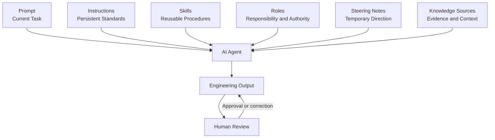

The diagram illustrates that Knowledge Sources are one input to agent reasoning. They do not replace Instructions, Skills, Prompts, Roles, or Steering Notes.

### 6.2 Knowledge-Source Classification Model

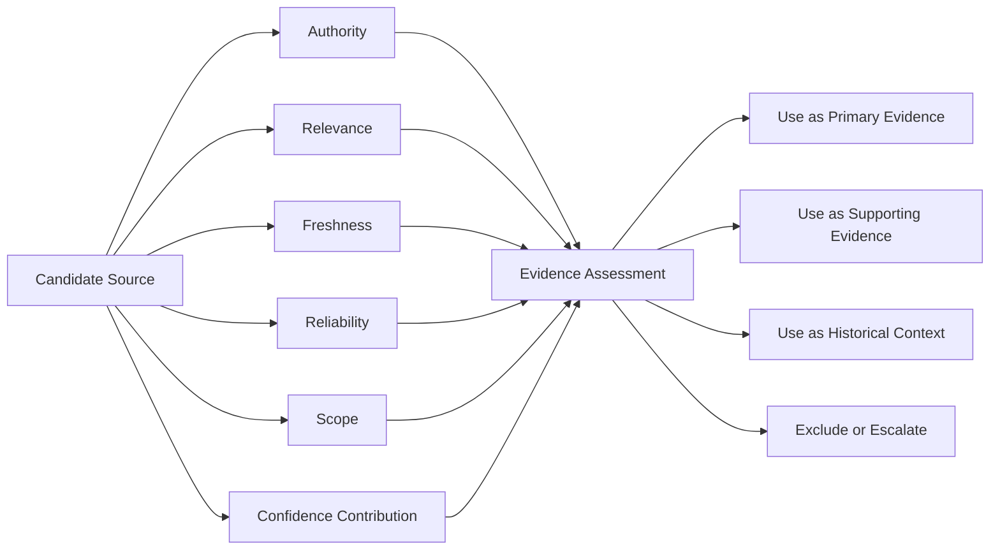

Classification prevents an agent from treating every retrieved artifact equally.

### 6.3 Knowledge Retrieval Architecture

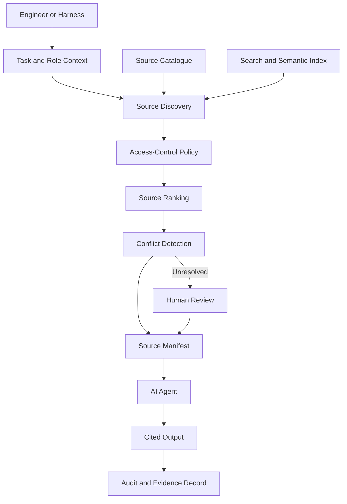

The architecture separates discovery from retrieval and retrieval from final agent execution. Access control is enforced before source content reaches the agent.

### 6.4 Source-Conflict Resolution

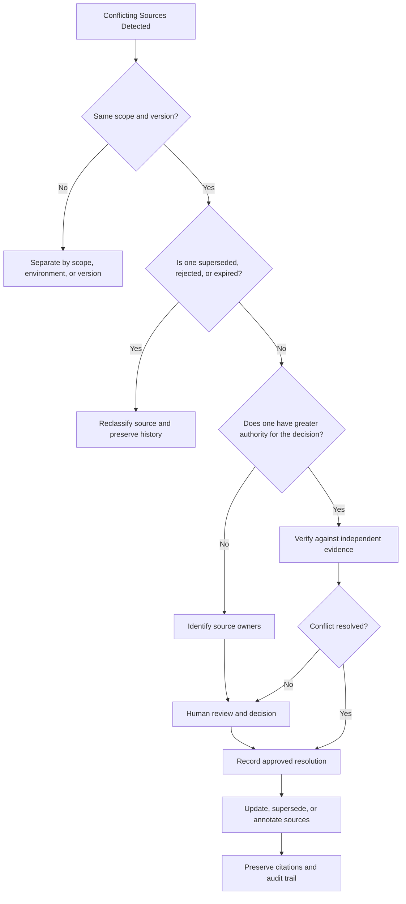

The agent does not silently select the most convenient source. It resolves differences through scope, status, authority, validation, and ownership.

### 6.5 Knowledge Sources in the AI Harness

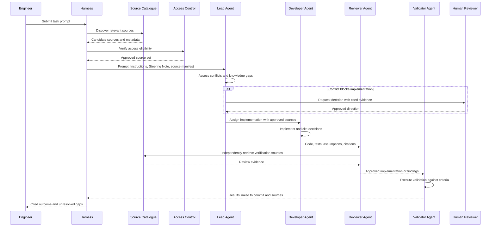

### 6.6 Alpha Car Detailing Source Map

```mermaid
flowchart TB
    CAP[Corporate Fleet Booking]

    CAP --> PROD[Product Requirements]
    CAP --> DOMAIN[Domain Documentation]
    CAP --> ADR[Architecture Decision Records]
    CAP --> API[API Contracts]
    CAP --> EVENTS[Event Schemas]
    CAP --> DB[Database Documentation and Migrations]
    CAP --> CODE[Source Code]
    CAP --> TEST[Test Specifications and Results]
    CAP --> PIPE[CI/CD Pipelines]
    CAP --> DEPLOY[Deployment Manifests]
    CAP --> RUN[Runbooks]
    CAP --> SEC[Security Guidance]
    CAP --> INC[Incident Reports]
    CAP --> PR[Pull Requests and Review Findings]
    CAP --> STEER[Active Steering Note]

    ADR --> DEC[Architecture Decision]
    API --> CONTRACT[Published Contract]
    CODE --> STATE[Current Implementation State]
    DB --> SCHEMA[Current and Intended Schema]
    TEST --> QUALITY[Validation Evidence]
    INC --> HISTORY[Known Failure Modes]
    STEER --> TEMP[Current Release Constraints]
    SEC --> CONTROL[Security Ownership and Controls]
```

This source map demonstrates that a business capability is understood through a collection of evidence. No individual node provides every answer.

### 6.7 Knowledge-Source Lifecycle

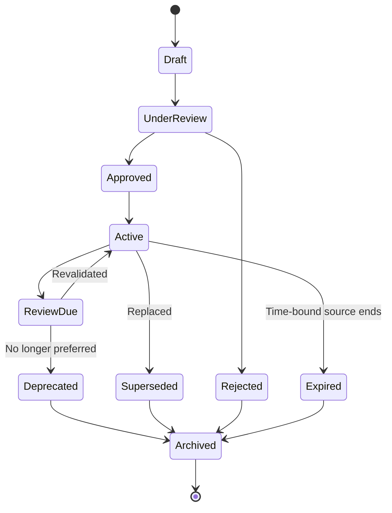

Lifecycle metadata helps agents distinguish current authority from historical context.

### 6.8 Source Ranking and Decision Confidence

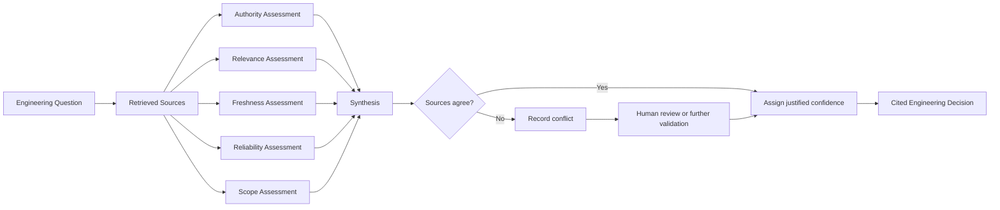

Chapter 11 status: In progress — next section: Hands-on Example

## 7. Hands-on Example

This section builds a practical Knowledge Source structure for the Alpha Car Detailing repository and applies it to the recurring corporate fleet-booking scenario.

The objective is not to create a large enterprise search platform. The objective is to establish a repository-level foundation that allows AI agents and human engineers to:

* discover relevant sources;
* understand source authority and ownership;
* evaluate freshness and scope;
* detect conflicts;
* cite evidence;
* record knowledge gaps; and
* route uncertain decisions for human review.

The example uses repository-managed Markdown and YAML files so that the approach remains transparent, version-controlled, and usable by Claude Code, GitHub Copilot, OpenAI Codex, and future AI coding agents.

### 7.1 Target Repository Structure

Add a dedicated knowledge area beside Instructions, Skills, Prompts, Roles, Steering Notes, and harness assets.

```text
alpha-car-detailing/
│
├── .ai/
│   ├── instructions/
│   │   ├── architecture.md
│   │   ├── coding-standards.md
│   │   ├── security.md
│   │   └── testing.md
│   │
│   ├── skills/
│   │   ├── discover-repository.md
│   │   ├── implement-api-change.md
│   │   ├── review-event-consumer.md
│   │   └── validate-knowledge-sources.md
│   │
│   ├── prompts/
│   │   ├── implement-recurring-fleet-booking.md
│   │   └── review-recurring-fleet-booking.md
│   │
│   ├── roles/
│   │   ├── lead-agent.md
│   │   ├── developer-agent.md
│   │   ├── reviewer-agent.md
│   │   ├── validator-agent.md
│   │   └── architect-agent.md
│   │
│   ├── steering/
│   │   └── release-3.8.md
│   │
│   └── knowledge/
│       ├── README.md
│       ├── catalogue.yaml
│       ├── authority-model.md
│       ├── source-types.md
│       ├── conflicts/
│       │   └── KG-BOOKING-017.md
│       ├── manifests/
│       │   └── ACD-FLEET-284.yaml
│       └── refresh/
│           └── source-review-status.yaml
│
├── architecture/
│   ├── decisions/
│   │   ├── ADR-009-synchronous-recurring-booking.md
│   │   └── ADR-014-recurring-booking-scheduling.md
│   ├── diagrams/
│   └── service-boundaries.md
│
├── requirements/
│   ├── corporate-fleet-booking.md
│   └── corporate-approval-policy.md
│
├── contracts/
│   ├── openapi/
│   │   └── booking-api.v2.yaml
│   └── events/
│       └── fleet-booking-scheduled.v1.json
│
├── database/
│   └── booking/
│       ├── schema.md
│       └── migrations/
│
├── runbooks/
│   └── recurring-booking-processing.md
│
├── incidents/
│   └── INC-2026-031-duplicate-fleet-bookings.md
│
├── security/
│   └── corporate-account-authorization.md
│
├── tests/
│   └── reports/
│       └── recurring-booking-validation.md
│
├── src/
├── deploy/
└── README.md
```

The `.ai/knowledge` directory does not replace the original sources.

It provides:

* source metadata;
* discovery guidance;
* source manifests;
* conflict records;
* review status;
* knowledge-gap tracking; and
* governance information.

The authoritative content remains in the appropriate architectural, technical, business, security, operational, or historical location.

### 7.2 Create the Knowledge Directory README

Create:

```text
.ai/knowledge/README.md
```

```markdown
# Alpha Car Detailing Knowledge Sources

This directory contains metadata and governance records for Knowledge Sources
used by human engineers and AI agents.

Knowledge Sources provide evidence and context. They do not define persistent
agent behaviour.

Persistent engineering standards belong in `.ai/instructions/`.

Reusable procedures belong in `.ai/skills/`.

Task requests belong in `.ai/prompts/`.

Responsibility and authority belong in `.ai/roles/`.

Temporary mission direction belongs in `.ai/steering/`.

## Objectives

The Knowledge Source model must help agents:

1. discover relevant evidence;
2. classify sources by authority, relevance, freshness, reliability, and scope;
3. preserve source ownership;
4. detect conflicting evidence;
5. cite sources used in decisions;
6. identify stale or missing knowledge;
7. avoid exposing sensitive information;
8. request human review when evidence is insufficient.

## Rules

- Do not treat every source equally.
- Do not use a source outside its stated scope.
- Do not treat a draft or rejected source as approved.
- Do not assume a recently modified source is current.
- Do not silently resolve conflicting authoritative sources.
- Do not use sensitive sources without explicit access.
- Do not modify authoritative sources unless the task explicitly permits it.
- Record unsupported assumptions as knowledge gaps.
- Include citations in architecture, implementation, review, and validation outputs.

## Source Catalogue

The source catalogue is stored in:

`catalogue.yaml`

## Source Manifests

Task-specific source manifests are stored in:

`manifests/`

## Conflicts and Knowledge Gaps

Unresolved conflicts and missing knowledge are stored in:

`conflicts/`

## Refresh Governance

Source review and freshness information is stored in:

`refresh/`
```

This file explains the purpose of the knowledge area without duplicating detailed source content.

### 7.3 Define the Source Authority Model

Create:

```text
.ai/knowledge/authority-model.md
```

```markdown
# Knowledge Source Authority Model

Authority is evaluated within the scope of the current engineering question.

No source is universally authoritative for every decision.

## Authority Levels

### Mandatory

Defines a policy, regulatory requirement, security control, approved contract,
or other requirement that must be followed.

Examples:

- security policy;
- regulatory control;
- published API contract;
- approved data-classification rule.

### Authoritative

Primary maintained evidence for a defined system, business capability,
architecture decision, or operational process.

Examples:

- accepted Architecture Decision Record;
- current source code for implementation state;
- current database migrations for schema evolution;
- approved product requirement;
- active runbook.

### Supporting

Provides corroborating information or implementation detail but should not
determine a high-impact decision alone.

Examples:

- architecture diagram;
- database documentation;
- design note;
- test specification;
- service README.

### Informational

Provides useful context without formal authority.

Examples:

- onboarding notes;
- examples;
- training material;
- explanatory diagrams.

### Historical

Explains a previous state, decision, incident, or implementation.

Examples:

- superseded ADR;
- retired design;
- old pull request;
- incident report;
- release retrospective.

### Unverified

Has not been approved, reviewed, or validated.

Examples:

- draft requirement;
- proposed ADR;
- developer scratch note;
- generated document awaiting review.

### Superseded

Was previously valid but has been replaced by another source.

### Rejected

Documents an option that was considered but not adopted.

## Decision Rule

When sources disagree:

1. compare scope;
2. compare lifecycle status;
3. compare authority for the specific question;
4. compare freshness;
5. validate against independent evidence;
6. identify owners;
7. request human resolution when conflict remains.

The agent must not silently select the easiest or most convenient source.
```

### 7.4 Define Source Types

Create:

```text
.ai/knowledge/source-types.md
```

```markdown
# Knowledge Source Types

## Technical

Examples:

- source code;
- package manifests;
- database migrations;
- API contracts;
- event schemas;
- deployment manifests;
- infrastructure-as-code;
- automated tests.

## Business

Examples:

- product requirements;
- business rules;
- domain documentation;
- acceptance criteria;
- pricing policies;
- customer agreements.

## Architectural

Examples:

- Architecture Decision Records;
- service-boundary documentation;
- architecture diagrams;
- dependency rules;
- technology standards.

## Operational

Examples:

- runbooks;
- release records;
- alert definitions;
- deployment guidance;
- operational-readiness reviews.

## Historical

Examples:

- incident reports;
- pull requests;
- review findings;
- retired ADRs;
- migration reports;
- retrospectives.

## Security and Compliance

Examples:

- security guidance;
- threat models;
- data-classification policies;
- vulnerability findings;
- privacy controls;
- audit requirements.

## Validation and Quality

Examples:

- test results;
- code-coverage reports;
- contract-test reports;
- performance benchmarks;
- security-scan results;
- acceptance evidence.
```

### 7.5 Create the Source Catalogue

The source catalogue provides structured metadata that an AI harness or agent can inspect before opening source contents.

Create:

```text
.ai/knowledge/catalogue.yaml
```

```yaml
catalogueVersion: "1.0"
system: Alpha Car Detailing
lastReviewedOn: 2026-07-25
owner: Enterprise Architecture Team

sources:
  - id: ADR-014
    title: Recurring Booking Scheduling
    type: ArchitectureDecisionRecord
    path: architecture/decisions/ADR-014-recurring-booking-scheduling.md
    status: Accepted
    authority: Authoritative
    owner: Architecture Council
    classification: Internal
    scope:
      capabilities:
        - RecurringFleetBooking
      services:
        - Booking
        - Scheduling
    freshness:
      approvedOn: 2026-06-12
      lastReviewedOn: 2026-07-15
      nextReviewDue: 2026-10-15
    reliability:
      reviewStatus: PeerReviewed
      validatedAgainst:
        - ReleasePlanning-3.8
    supersedes:
      - ADR-009
    keywords:
      - recurring booking
      - fleet schedule
      - background worker
      - idempotency

  - id: ADR-009
    title: Synchronous Recurring Booking
    type: ArchitectureDecisionRecord
    path: architecture/decisions/ADR-009-synchronous-recurring-booking.md
    status: Superseded
    authority: Historical
    owner: Architecture Council
    classification: Internal
    scope:
      capabilities:
        - RecurringFleetBooking
    freshness:
      approvedOn: 2025-11-04
      supersededOn: 2026-06-12
    supersededBy:
      - ADR-014
    keywords:
      - recurring booking
      - synchronous processing

  - id: REQ-FLEET-002
    title: Corporate Fleet Booking Requirements
    type: ProductRequirement
    path: requirements/corporate-fleet-booking.md
    status: Approved
    authority: Authoritative
    owner: Fleet Product Owner
    classification: Internal
    scope:
      capabilities:
        - FleetBooking
        - RecurringFleetBooking
      customerTypes:
        - Corporate
        - Government
    freshness:
      approvedOn: 2026-06-18
      lastReviewedOn: 2026-07-18
      nextReviewDue: 2026-09-18
    keywords:
      - fleet
      - recurring booking
      - station capacity
      - approval

  - id: REQ-APPROVAL-004
    title: Corporate Booking Approval Policy
    type: BusinessPolicy
    path: requirements/corporate-approval-policy.md
    status: UnderReview
    authority: Unverified
    owner: Corporate Accounts Product Owner
    classification: Confidential
    scope:
      capabilities:
        - CorporateApproval
      services:
        - CorporateAccounts
    freshness:
      createdOn: 2026-07-12
      lastReviewedOn: null
    keywords:
      - approval limit
      - monthly limit
      - corporate account

  - id: API-BOOKING-V2
    title: Booking API Version 2
    type: OpenApiContract
    path: contracts/openapi/booking-api.v2.yaml
    status: Published
    authority: Mandatory
    owner: Booking Service Team
    classification: Internal
    scope:
      services:
        - Booking
      apiVersions:
        - v2
    freshness:
      generatedOn: 2026-07-20
      validatedAgainst:
        commit: "a84f2c1"
        environment: Integration
    reliability:
      generationMethod: BuildGenerated
      reviewStatus: PipelineValidated
    keywords:
      - booking API
      - recurrence pattern
      - fleet booking

  - id: EVENT-FLEET-SCHEDULED-V1
    title: Fleet Booking Scheduled Event
    type: EventSchema
    path: contracts/events/fleet-booking-scheduled.v1.json
    status: Draft
    authority: Unverified
    owner: Integration Architecture Team
    classification: Internal
    scope:
      capabilities:
        - RecurringFleetBooking
      schemaVersions:
        - "1.0"
    freshness:
      createdOn: 2026-07-19
    keywords:
      - event
      - fleet booking
      - schedule

  - id: DB-BOOKING-SCHEMA
    title: Booking Database Documentation
    type: DatabaseDocumentation
    path: database/booking/schema.md
    status: Active
    authority: Supporting
    owner: Booking Service Team
    classification: Internal
    scope:
      services:
        - Booking
      databases:
        - BookingDb
    freshness:
      lastReviewedOn: 2026-02-10
      nextReviewDue: 2026-05-10
    reliability:
      reviewStatus: ReviewOverdue
      generatedFromMigrations: false
    keywords:
      - booking database
      - fleet schedule
      - recurring booking

  - id: INC-2026-031
    title: Duplicate Fleet Bookings During Worker Retry
    type: IncidentReport
    path: incidents/INC-2026-031-duplicate-fleet-bookings.md
    status: Closed
    authority: Historical
    owner: Booking Service Team
    classification: Confidential
    scope:
      capabilities:
        - RecurringFleetBooking
      environments:
        - Production
    freshness:
      incidentDate: 2026-05-27
      closedOn: 2026-06-04
    reliability:
      reviewStatus: ApprovedPostIncidentReview
    keywords:
      - duplicate booking
      - retry
      - idempotency
      - worker

  - id: SEC-CORP-007
    title: Corporate Account Authorization
    type: SecurityGuidance
    path: security/corporate-account-authorization.md
    status: Active
    authority: Mandatory
    owner: Application Security
    classification: Confidential
    scope:
      services:
        - CorporateAccounts
        - Booking
      capabilities:
        - CorporateApproval
        - FleetBooking
    freshness:
      approvedOn: 2026-04-09
      lastReviewedOn: 2026-07-09
      nextReviewDue: 2026-10-09
    keywords:
      - corporate authorization
      - approval limit
      - booking permissions

  - id: RUN-BOOKING-012
    title: Recurring Booking Processing Runbook
    type: Runbook
    path: runbooks/recurring-booking-processing.md
    status: Draft
    authority: Unverified
    owner: Platform Operations
    classification: Internal
    scope:
      capabilities:
        - RecurringFleetBooking
      environments:
        - Integration
    freshness:
      createdOn: 2026-07-21
    keywords:
      - operations
      - recurring booking
      - retry
      - replay
```

The catalogue exposes several important facts before source content is retrieved:

* `ADR-009` is superseded.
* The corporate approval policy is still under review.
* The event schema is only a draft.
* Database documentation is overdue for review.
* The incident report is confidential.
* The security guidance is mandatory.
* The API contract was generated and validated against a known commit.

An agent that opens documents without checking this metadata could misclassify all of these sources.

### 7.6 Add the Accepted Architecture Decision

Create:

```text
architecture/decisions/ADR-014-recurring-booking-scheduling.md
```

```markdown
# ADR-014 — Recurring Booking Scheduling

## Status

Accepted

## Date

2026-06-12

## Owners

Architecture Council

## Context

Corporate fleet customers require recurring service schedules across multiple
detailing stations.

The initial implementation created future bookings synchronously during the
API request. This caused long-running requests, partial failures, and duplicate
bookings during retries.

## Decision

The Booking service will store a recurring schedule definition.

A background-processing component will create individual booking occurrences.

Every schedule execution must use an idempotency key derived from:

- schedule identifier;
- planned occurrence date;
- station identifier.

The Booking service owns booking creation.

The Corporate Accounts service owns account-level approval decisions.

The scheduling component must not make authorization decisions.

## Consequences

- The API request will create or update a schedule definition.
- Booking occurrences will be generated asynchronously.
- Duplicate event delivery must not create duplicate bookings.
- Schedule execution and booking creation must be observable.
- Failed occurrences must be retryable.
- Approval must be confirmed before an occurrence becomes active.

## Supersedes

ADR-009 — Synchronous Recurring Booking
```

This ADR defines the long-term architecture but does not by itself prove that the implementation exists.

### 7.7 Add the Current Steering Note

Create:

```text
.ai/steering/release-3.8.md
```

```markdown
# Release 3.8 Steering Note

## Status

Active

## Effective Period

2026-07-20 to 2026-08-15

## Current Priority

Deliver recurring corporate fleet booking for the pilot customer.

## In Scope

- Booking service;
- Corporate Accounts integration;
- existing background worker;
- idempotent booking occurrence creation;
- integration and contract tests;
- operational logging and metrics.

## Out of Scope

- new distributed scheduling platform;
- user-interface redesign;
- pricing-engine changes;
- replacement of the existing background worker;
- migration to a new message broker.

## Constraints

- Reuse the current booking background worker.
- Do not add a new infrastructure product.
- Preserve the Booking API v2 contract.
- Corporate approval remains owned by the Corporate Accounts service.
- The pilot must be deployable through the existing CI/CD pipeline.

## Known Risks

- Existing database documentation may not match the current migration history.
- Previous retry handling created duplicate bookings.
- The fleet scheduling event schema is still under review.

## Human Approval Required

- changes to service ownership;
- changes to approval policy;
- new infrastructure dependencies;
- changes to the published API contract.
```

The Steering Note does not replace ADR-014.

It temporarily narrows the acceptable implementation.

### 7.8 Add the Historical Incident Report

Create:

```text
incidents/INC-2026-031-duplicate-fleet-bookings.md
```

```markdown
# INC-2026-031 — Duplicate Fleet Bookings During Worker Retry

## Classification

Confidential

## Status

Closed

## Incident Date

2026-05-27

## Affected Capability

Recurring Fleet Booking Prototype

## Summary

A background worker retried a failed recurring schedule execution.

The retry created a second booking because the original execution had completed
booking creation but failed before recording schedule completion.

## Customer Impact

Three corporate fleet accounts received duplicate bookings for the same vehicle,
station, and service date.

## Root Cause

The worker used a generated request identifier for each retry.

The booking operation did not enforce uniqueness using the schedule occurrence.

## Contributing Factors

- No idempotency key was defined.
- No unique database constraint existed.
- The worker checkpoint was updated after booking creation.
- Tests covered worker failure before booking creation but not after booking
  creation and before checkpoint completion.

## Corrective Actions

- Define a deterministic idempotency key.
- Add a uniqueness constraint for schedule occurrences.
- Add retry tests for partial completion.
- Record execution status before external side effects where practical.
- Add duplicate-attempt telemetry.

## Architectural Outcome

ADR-014 was created to replace the synchronous prototype and formalize
idempotent asynchronous processing.
```

This report is historical, but it has high relevance to the new implementation because it documents an already observed failure mode.

### 7.9 Add the Product Requirement

Create:

```text
requirements/corporate-fleet-booking.md
```

```markdown
# Corporate Fleet Booking Requirements

## Status

Approved

## Owner

Fleet Product Owner

## Business Objective

Allow corporate and government customers to define recurring vehicle-detailing
schedules across approved Alpha Car Detailing stations.

## Functional Requirements

1. A corporate account administrator can create a recurring schedule.
2. A schedule can include one or more vehicles.
3. A schedule defines:
   - service type;
   - preferred station;
   - recurrence pattern;
   - start date;
   - optional end date;
   - requested service time.
4. Station capacity must be checked before a booking occurrence is confirmed.
5. Account approval must be verified before the booking becomes active.
6. Failed occurrence creation must be visible to operations.
7. Retrying a schedule occurrence must not create a duplicate booking.

## Acceptance Criteria

- Reprocessing the same schedule occurrence creates at most one booking.
- Approval decisions are obtained from the Corporate Accounts service.
- The Booking service does not calculate account-level approval thresholds.
- The API remains backward compatible with Booking API v2.
- All generated bookings include the originating schedule identifier.
```

The requirement establishes intended business behaviour, while the ADR defines architectural responsibilities.

### 7.10 Add the Conflicting Database Document

Create:

```text
database/booking/schema.md
```

```markdown
# Booking Database Schema

## Last Reviewed

2026-02-10

## FleetSchedule

Stores recurring fleet schedule definitions.

Columns:

- FleetScheduleId
- CorporateAccountId
- StationId
- RecurrencePattern
- StartDate
- EndDate
- IsActive
- CreatedOn
- ModifiedOn

## FleetScheduleExecution

Stores the latest execution state for a recurring fleet schedule.

Columns:

- FleetScheduleExecutionId
- FleetScheduleId
- PlannedDate
- Status
- LastAttemptOn
```

This document appears useful but is stale.

It omits:

* idempotency keys;
* uniqueness constraints;
* approval state;
* execution-attempt history;
* error details;
* references to ADR-014;
* evidence that the tables were actually migrated.

The source catalogue correctly classifies it as supporting evidence with an overdue review.

### 7.11 Create the Knowledge Gap Record

The agent has found conflicting evidence regarding corporate approval limits.

Create:

```text
.ai/knowledge/conflicts/KG-BOOKING-017.md
```

```markdown
# KG-BOOKING-017 — Corporate Fleet Approval Limit

## Status

Awaiting Human Decision

## Severity

High

## Detected During

ACD-FLEET-284 — Add Recurring Corporate Fleet Booking

## Question

What approval limit applies to recurring corporate fleet bookings, and which
service is responsible for enforcing it?

## Evidence

### Corporate Fleet Booking Requirement

Source:

`requirements/corporate-fleet-booking.md`

Finding:

The Booking service must obtain an approval decision from the Corporate Accounts
service.

The requirement does not define a monetary threshold.

### Corporate Approval Policy

Source:

`requirements/corporate-approval-policy.md`

Finding:

The draft policy references a monthly approval limit of £25,000.

Status:

Under Review

Authority:

Unverified

### Security Guidance

Source:

`security/corporate-account-authorization.md`

Finding:

The Corporate Accounts service owns authorization and approval decisions.

The Booking service must not calculate or store approval thresholds.

Status:

Active

Authority:

Mandatory

## Assessment

There is sufficient evidence to determine service ownership.

There is insufficient approved evidence to determine the current monetary
threshold.

## Safe Implementation Direction

The Booking service should request an approval decision from the Corporate
Accounts service without embedding a monetary threshold.

## Blocked Decisions

- approval-policy documentation;
- test fixtures requiring a specific threshold;
- customer-facing messages that state a numeric limit.

## Required Reviewers

- Corporate Accounts Product Owner;
- Application Security;
- Fleet Product Owner.

## Resolution Required

Confirm the current threshold and approve the authoritative policy source.

The AI agent must not infer or hard-code £25,000 from the draft policy.
```

This record distinguishes between what is known and what remains unresolved.

The service boundary is sufficiently supported.

The numeric threshold is not.

### 7.12 Create the Task Source Manifest

Create:

```text
.ai/knowledge/manifests/ACD-FLEET-284.yaml
```

```yaml
manifestVersion: "1.0"

task:
  id: ACD-FLEET-284
  title: Add Recurring Corporate Fleet Booking
  capability: RecurringFleetBooking
  risk: High

role:
  primary: DeveloperAgent
  requiredReviewers:
    - ReviewerAgent
    - ValidatorAgent
    - ArchitectAgent
    - SecurityReviewer

instructions:
  - path: .ai/instructions/architecture.md
  - path: .ai/instructions/security.md
  - path: .ai/instructions/testing.md

skills:
  - path: .ai/skills/discover-repository.md
  - path: .ai/skills/implement-api-change.md
  - path: .ai/skills/validate-knowledge-sources.md

steeringNotes:
  - path: .ai/steering/release-3.8.md
    status: Active

primarySources:
  - id: ADR-014
    purpose: Defines asynchronous recurring-booking architecture
  - id: REQ-FLEET-002
    purpose: Defines approved business behaviour
  - id: API-BOOKING-V2
    purpose: Defines published API contract
  - id: SEC-CORP-007
    purpose: Defines approval ownership and authorization boundaries
  - id: INC-2026-031
    purpose: Defines known retry and idempotency failure mode

supportingSources:
  - id: DB-BOOKING-SCHEMA
    caution: Review overdue and not generated from migrations
  - id: EVENT-FLEET-SCHEDULED-V1
    caution: Draft schema; not approved for publication
  - id: RUN-BOOKING-012
    caution: Draft operational procedure

excludedSources:
  - id: ADR-009
    reason: Superseded by ADR-014

conflicts:
  - id: KG-BOOKING-017
    subject: Corporate approval threshold
    implementationImpact: Do not hard-code a monetary threshold

requiredValidation:
  - Verify current migrations before designing persistence
  - Preserve Booking API v2 compatibility
  - Add deterministic idempotency-key tests
  - Add duplicate retry integration test
  - Verify approval call is owned by Corporate Accounts
  - Validate deployment through the existing worker

humanApproval:
  requiredFor:
    - Published API contract changes
    - New infrastructure dependencies
    - Service ownership changes
    - Numeric approval threshold
    - Modification of accepted ADRs

citationRequired: true
```

The manifest gives every participating role the same controlled starting point while still allowing independent retrieval during review.

### 7.13 Implement a Source-Assessment Template

Create:

```text
.ai/knowledge/source-assessment-template.md
```

```markdown
# Source Assessment

## Task

[Task identifier and title]

## Engineering Question

[Decision that requires evidence]

## Candidate Sources

| Source | Type | Status | Owner | Authority | Scope | Freshness | Reliability |
|---|---|---|---|---|---|---|---|
| | | | | | | | |

## Findings

### Confirmed Facts

- [Fact with citation]

### Intended Behaviour

- [Requirement or approved target with citation]

### Current Implementation State

- [Code, migration, deployment, or runtime evidence]

### Historical Evidence

- [Incident, pull request, or superseded design]

### Temporary Constraints

- [Active Steering Note]

## Conflicts

- [Source A conflicts with Source B because...]

## Missing Knowledge

- [Required information not found]

## Confidence

- High / Medium / Low / Unknown

## Human Review

- Required / Not Required

## Safe Next Action

[Action supported by current evidence]

## Citations

1. [Source and precise location]
2. [Source and precise location]
```

This template can be used manually or generated by the harness.

### 7.14 Create a Knowledge-Validation Skill

Create:

```text
.ai/skills/validate-knowledge-sources.md
```

```markdown
# Skill — Validate Knowledge Sources

## Purpose

Evaluate Knowledge Sources before using them for an engineering decision.

## Inputs

- task Prompt;
- assigned Role;
- applicable Instructions;
- active Steering Note;
- source catalogue;
- candidate sources.

## Procedure

1. Identify the exact engineering questions.
2. Locate candidate sources.
3. Read source metadata before relying on source content.
4. Classify each source by:
   - authority;
   - relevance;
   - freshness;
   - reliability;
   - scope;
   - lifecycle status.
5. Exclude:
   - rejected sources;
   - superseded sources, except as historical context;
   - inaccessible sources;
   - irrelevant sources;
   - sources outside the applicable scope.
6. Identify conflicting conclusions.
7. Validate important claims against independent evidence.
8. Record stale or missing knowledge.
9. Create or update the task source manifest.
10. Request human review for unresolved high-impact conflicts.
11. Cite sources used in the final decision.
12. Do not modify authoritative sources unless explicitly authorized.

## Required Output

- source assessment;
- selected primary sources;
- supporting sources;
- excluded sources and reasons;
- conflicts;
- knowledge gaps;
- confidence level;
- human-review requirement;
- citations.
```

The Skill defines the reusable procedure.

It does not embed the current fleet-booking sources.

### 7.15 Agent Assessment of the Fleet-Booking Task

Using the catalogue, sources, Steering Note, and validation Skill, the agent produces the following assessment.

```markdown
# Source Assessment — ACD-FLEET-284

## Engineering Question

How should recurring corporate fleet bookings be implemented during Release 3.8?

## Confirmed Facts

1. Recurring booking occurrences must be generated asynchronously.
   Citation: `ADR-014`, Decision section.

2. The existing background worker must be reused during Release 3.8.
   Citation: `.ai/steering/release-3.8.md`, Constraints section.

3. The Corporate Accounts service owns account approval decisions.
   Citations:
   - `ADR-014`, Decision section.
   - `security/corporate-account-authorization.md`,
     Service Responsibilities section.

4. Retry processing must not create duplicate bookings.
   Citations:
   - `requirements/corporate-fleet-booking.md`,
     Acceptance Criteria.
   - `INC-2026-031`, Root Cause and Corrective Actions.

5. Booking API v2 must remain backward compatible.
   Citation: `.ai/steering/release-3.8.md`, Constraints section.

## Current Implementation State

- No recurring schedule entity exists in the current domain model.
- No applicable recurring-schedule migration exists.
- The current worker can process queued booking operations.
- The published API contract contains recurrence fields not implemented by the
  current application.

## Source Concerns

- `database/booking/schema.md` is overdue for review and does not match the
  migration history.
- `fleet-booking-scheduled.v1.json` is a draft and must not be treated as an
  approved integration contract.
- The current recurring-booking runbook is a draft.
- The corporate approval threshold is not defined in an approved source.

## Conflict

The API contract exposes recurrence fields, while the current application does
not implement them.

This requires contract validation and may indicate an incomplete deployment,
a prematurely published contract, or missing implementation.

## Knowledge Gap

The numeric corporate approval threshold is unresolved.

The implementation must request approval from the Corporate Accounts service
without embedding a threshold.

## Confidence

Medium.

The architectural direction and service ownership are clear.

The current API contract and implementation state conflict.

## Human Review Required

Yes.

Required review:

- confirm that Booking API v2 recurrence fields are intentionally published;
- confirm whether implementation must complete the existing contract or whether
  the contract requires correction;
- approve any change to the published contract.

## Safe Next Action

Proceed with persistence and worker design based on ADR-014 and the active
Steering Note.

Do not:

- introduce a new scheduler;
- publish the draft event schema;
- hard-code an approval threshold;
- modify the accepted ADR;
- silently change the API contract.
```

This assessment allows implementation work to begin within safe boundaries while preserving the unresolved contract question for human review.

### 7.16 Proposed Domain Model

The source evidence supports introducing a recurring schedule aggregate without embedding approval-policy calculations.

```csharp
namespace AlphaCarDetailing.Booking.Domain.FleetSchedules;

public sealed class FleetSchedule
{
    private readonly List<FleetScheduleVehicle> _vehicles = [];

    private FleetSchedule()
    {
    }

    public FleetSchedule(
        Guid id,
        Guid corporateAccountId,
        Guid stationId,
        string recurrencePattern,
        DateOnly startDate,
        DateOnly? endDate)
    {
        if (id == Guid.Empty)
        {
            throw new ArgumentException(
                "Fleet schedule identifier is required.",
                nameof(id));
        }

        if (corporateAccountId == Guid.Empty)
        {
            throw new ArgumentException(
                "Corporate account identifier is required.",
                nameof(corporateAccountId));
        }

        if (stationId == Guid.Empty)
        {
            throw new ArgumentException(
                "Station identifier is required.",
                nameof(stationId));
        }

        if (string.IsNullOrWhiteSpace(recurrencePattern))
        {
            throw new ArgumentException(
                "Recurrence pattern is required.",
                nameof(recurrencePattern));
        }

        if (endDate.HasValue && endDate.Value < startDate)
        {
            throw new ArgumentException(
                "End date cannot be earlier than start date.",
                nameof(endDate));
        }

        Id = id;
        CorporateAccountId = corporateAccountId;
        StationId = stationId;
        RecurrencePattern = recurrencePattern;
        StartDate = startDate;
        EndDate = endDate;
        Status = FleetScheduleStatus.PendingApproval;
        CreatedOnUtc = DateTimeOffset.UtcNow;
    }

    public Guid Id { get; private set; }

    public Guid CorporateAccountId { get; private set; }

    public Guid StationId { get; private set; }

    public string RecurrencePattern { get; private set; } = string.Empty;

    public DateOnly StartDate { get; private set; }

    public DateOnly? EndDate { get; private set; }

    public FleetScheduleStatus Status { get; private set; }

    public DateTimeOffset CreatedOnUtc { get; private set; }

    public IReadOnlyCollection<FleetScheduleVehicle> Vehicles => _vehicles;

    public void AddVehicle(Guid vehicleId)
    {
        if (vehicleId == Guid.Empty)
        {
            throw new ArgumentException(
                "Vehicle identifier is required.",
                nameof(vehicleId));
        }

        if (_vehicles.Any(vehicle => vehicle.VehicleId == vehicleId))
        {
            return;
        }

        _vehicles.Add(new FleetScheduleVehicle(Id, vehicleId));
    }

    public void Approve()
    {
        if (Status != FleetScheduleStatus.PendingApproval)
        {
            throw new InvalidOperationException(
                $"Fleet schedule cannot be approved from status {Status}.");
        }

        Status = FleetScheduleStatus.Active;
    }

    public void Reject()
    {
        if (Status != FleetScheduleStatus.PendingApproval)
        {
            throw new InvalidOperationException(
                $"Fleet schedule cannot be rejected from status {Status}.");
        }

        Status = FleetScheduleStatus.Rejected;
    }
}
```

The domain model reflects approved evidence:

* the schedule belongs to a corporate account;
* the schedule targets a station;
* recurrence is represented;
* approval is external to the Booking service;
* the Booking service stores the resulting approval state;
* no monetary threshold is embedded.

### 7.17 Deterministic Idempotency Key

ADR-014 and the incident report both require deterministic idempotency.

```csharp
using System.Security.Cryptography;
using System.Text;

namespace AlphaCarDetailing.Booking.Application.FleetSchedules;

public static class FleetScheduleIdempotencyKey
{
    public static string Create(
        Guid scheduleId,
        Guid stationId,
        DateOnly plannedServiceDate)
    {
        if (scheduleId == Guid.Empty)
        {
            throw new ArgumentException(
                "Schedule identifier is required.",
                nameof(scheduleId));
        }

        if (stationId == Guid.Empty)
        {
            throw new ArgumentException(
                "Station identifier is required.",
                nameof(stationId));
        }

        var source = string.Create(
            provider: null,
            $"{scheduleId:N}:{stationId:N}:{plannedServiceDate:yyyy-MM-dd}");

        var bytes = Encoding.UTF8.GetBytes(source);
        var hash = SHA256.HashData(bytes);

        return Convert.ToHexString(hash);
    }
}
```

The key is based on the schedule, station, and occurrence date. Retries for the same occurrence generate the same key.

### 7.18 Persistence Constraint

The incident report shows that application-level checking alone is insufficient.

The persistence model should enforce uniqueness.

```csharp
using Microsoft.EntityFrameworkCore;
using Microsoft.EntityFrameworkCore.Metadata.Builders;

namespace AlphaCarDetailing.Booking.Infrastructure.Persistence.Configurations;

internal sealed class FleetScheduleOccurrenceConfiguration
    : IEntityTypeConfiguration<FleetScheduleOccurrence>
{
    public void Configure(
        EntityTypeBuilder<FleetScheduleOccurrence> builder)
    {
        builder.ToTable("FleetScheduleOccurrences");

        builder.HasKey(occurrence => occurrence.Id);

        builder.Property(occurrence => occurrence.IdempotencyKey)
            .HasMaxLength(64)
            .IsRequired();

        builder.HasIndex(occurrence => occurrence.IdempotencyKey)
            .IsUnique();

        builder.HasIndex(
                occurrence => new
                {
                    occurrence.FleetScheduleId,
                    occurrence.StationId,
                    occurrence.PlannedServiceDate
                })
            .IsUnique();

        builder.Property(occurrence => occurrence.Status)
            .HasConversion<string>()
            .HasMaxLength(32)
            .IsRequired();
    }
}
```

The implementation is supported by:

* ADR-014;
* the incident corrective actions;
* the approved acceptance criteria.

It is not derived from the stale database document alone.

### 7.19 Approval Integration Boundary

The Booking service requests an approval decision but does not calculate the threshold.

```csharp
namespace AlphaCarDetailing.Booking.Application.CorporateAccounts;

public interface ICorporateBookingApprovalClient
{
    Task<CorporateBookingApprovalResult> RequestApprovalAsync(
        CorporateBookingApprovalRequest request,
        CancellationToken cancellationToken);
}

public sealed record CorporateBookingApprovalRequest(
    Guid CorporateAccountId,
    Guid FleetScheduleId,
    decimal EstimatedMonthlyValue,
    string Currency);

public sealed record CorporateBookingApprovalResult(
    bool IsApproved,
    string DecisionCode,
    string? Reason);
```

The request may include the estimated monthly booking value because the Corporate Accounts service needs it to decide.

The Booking service does not compare that value with £25,000 or any other threshold.

This follows the approved ownership boundary while preserving the unresolved policy value outside the Booking implementation.

### 7.20 Knowledge-Aware Pull Request Description

The Developer Agent should include sources and unresolved issues in the pull request.

```markdown
# Add Recurring Corporate Fleet Booking

## Summary

Adds recurring fleet schedule persistence and idempotent occurrence creation
using the existing Booking background worker.

## Implemented

- Fleet schedule aggregate;
- schedule occurrence persistence;
- deterministic idempotency key;
- unique occurrence constraint;
- Corporate Accounts approval integration;
- retry-safe worker processing;
- duplicate-delivery tests;
- operational metrics for occurrence processing.

## Knowledge Sources Used

1. `ADR-014 — Recurring Booking Scheduling`
   - asynchronous occurrence creation;
   - Booking owns booking creation;
   - Corporate Accounts owns approval;
   - deterministic idempotency is required.

2. `Corporate Fleet Booking Requirements`
   - recurring schedules;
   - station-capacity validation;
   - approval integration;
   - retry must not create duplicates.

3. `INC-2026-031`
   - duplicate bookings occurred after partial worker completion;
   - deterministic idempotency and database uniqueness are required.

4. `Release 3.8 Steering Note`
   - reused the current background worker;
   - introduced no new scheduling infrastructure;
   - preserved Booking API v2.

5. `Corporate Account Authorization`
   - approval thresholds remain outside the Booking service.

## Sources Not Treated as Authoritative

- `database/booking/schema.md`
  - review overdue;
  - does not match current migrations.

- `fleet-booking-scheduled.v1.json`
  - draft schema;
  - not published.

- `ADR-009`
  - superseded by ADR-014.

## Open Knowledge Gap

`KG-BOOKING-017`

The numeric approval threshold is not defined in an approved source.

No monetary threshold has been embedded in the Booking service.

## Human Review Required

- confirm API v2 recurrence fields match the intended published contract;
- approve any required contract correction;
- confirm the final corporate approval policy.
```

This pull request is more auditable than a description that merely lists changed files.

### 7.21 Knowledge-Aware Review Checklist

The Reviewer Agent should verify both implementation quality and evidence quality.

```markdown
# Knowledge Source Review Checklist

## Source Selection

- [ ] Relevant authoritative sources are cited.
- [ ] Superseded and rejected sources were not treated as current.
- [ ] Historical sources are clearly identified as historical.
- [ ] Source scope matches the affected capability and services.
- [ ] Sensitive sources were accessed appropriately.

## Conflict Handling

- [ ] Source conflicts are visible.
- [ ] No conflict was silently resolved.
- [ ] Human approval is recorded where required.
- [ ] Knowledge gaps are documented.

## Implementation Alignment

- [ ] Architecture aligns with ADR-014.
- [ ] Existing worker is reused as required by the Steering Note.
- [ ] Corporate Accounts owns approval decisions.
- [ ] Booking does not hard-code the approval threshold.
- [ ] Idempotency is deterministic.
- [ ] Database uniqueness prevents duplicates.
- [ ] Retry tests reproduce the historical incident failure mode.

## Citations

- [ ] Major design claims include citations.
- [ ] Test claims reference actual execution results.
- [ ] Contract claims reference the published API version.
- [ ] Deployment claims reference current pipeline or manifest evidence.

## Source Maintenance

- [ ] Stale documentation is flagged for update.
- [ ] Proposed source changes are separated from implementation changes.
- [ ] No authoritative source was silently rewritten.
```

### 7.22 Record Source Refresh Status

Create:

```text
.ai/knowledge/refresh/source-review-status.yaml
```

```yaml
reviewDate: 2026-07-25

sources:
  - id: ADR-014
    status: Current
    nextAction: Review before Release 4.0 architecture planning

  - id: REQ-FLEET-002
    status: Current
    nextAction: Review after pilot acceptance

  - id: API-BOOKING-V2
    status: ConflictDetected
    nextAction: Compare published contract with runtime implementation
    owner: Booking Service Team
    priority: High

  - id: DB-BOOKING-SCHEMA
    status: Stale
    nextAction: Regenerate from current migrations after ACD-FLEET-284
    owner: Booking Service Team
    priority: Medium

  - id: EVENT-FLEET-SCHEDULED-V1
    status: Draft
    nextAction: Complete architecture and consumer review
    owner: Integration Architecture Team
    priority: Medium

  - id: RUN-BOOKING-012
    status: Draft
    nextAction: Validate during release rehearsal
    owner: Platform Operations
    priority: Medium

  - id: REQ-APPROVAL-004
    status: HumanDecisionRequired
    nextAction: Approve threshold and effective date
    owner: Corporate Accounts Product Owner
    priority: High
```

The refresh record turns documentation quality into visible engineering work.

### 7.23 Expected Harness Output

When the task completes, the harness should produce an evidence summary similar to the following.

```markdown
# Harness Evidence Summary

## Task

ACD-FLEET-284 — Add Recurring Corporate Fleet Booking

## Result

Implementation completed with human-reviewed contract assumptions.

## Primary Evidence

- ADR-014;
- Corporate Fleet Booking Requirements;
- Booking API v2;
- Corporate Account Authorization;
- INC-2026-031;
- Release 3.8 Steering Note.

## Validation Evidence

- Build: Passed
- Unit tests: Passed
- Integration tests: Passed
- Duplicate retry scenario: Passed
- API compatibility check: Passed with approved exception
- Security review: Passed
- Deployment rehearsal: Passed

## Confidence

High for implementation behaviour.

Medium for final approval-policy documentation until
`REQ-APPROVAL-004` is approved.

## Remaining Knowledge Gaps

- Corporate approval policy requires formal publication.

## Source Refresh Actions

- Regenerate Booking database documentation.
- Publish the recurring-booking runbook after production readiness review.
- Approve or revise the draft fleet scheduling event schema.
- Close `KG-BOOKING-017` after policy approval.
```

The task is technically complete, but the harness does not pretend that all repository knowledge is complete.

### 7.24 Hands-on Example Outcome

The hands-on implementation demonstrates several important principles.

The agent did not treat the stale database document as current schema truth.

It did not treat the draft event schema as an approved contract.

It did not use the superseded ADR.

It did not ignore the historical incident because it was old.

It did not hard-code an unapproved monetary threshold.

It did not interpret the Steering Note as a permanent architecture decision.

It did not silently update trusted sources.

It preserved citations and created explicit knowledge-refresh work.

Most importantly, the agent proceeded where evidence was sufficient and escalated only the decisions that genuinely required human authority.

That balance is central to Enterprise AI Engineering.

Chapter 11 status: In progress — next section: Claude Example

## 8. Claude Example

Claude Code can work effectively with Knowledge Sources because it operates directly within the repository, can inspect multiple related files, follow repository-level Instructions, execute reusable Skills, and produce evidence-based implementation or review outputs.

However, repository access alone does not ensure correct source use.

Claude must still be directed to:

* distinguish Instructions from Knowledge Sources;
* inspect source metadata before relying on source content;
* identify accepted, draft, superseded, historical, and stale sources;
* compare conflicting evidence;
* preserve source citations;
* avoid retrieving unnecessary sensitive material;
* report knowledge gaps;
* request human review when authority is unclear; and
* avoid silently modifying trusted sources.

The following example applies Claude Code to the Alpha Car Detailing recurring fleet-booking task.

### 8.1 Claude Repository Context

Assume the repository contains the following AI engineering assets:

```text
alpha-car-detailing/
│
├── CLAUDE.md
├── .claude/
│   └── skills/
│       ├── repository-discovery/
│       │   └── SKILL.md
│       ├── validate-knowledge-sources/
│       │   └── SKILL.md
│       └── implement-api-change/
│           └── SKILL.md
│
├── .ai/
│   ├── instructions/
│   ├── prompts/
│   ├── roles/
│   ├── steering/
│   └── knowledge/
│       ├── catalogue.yaml
│       ├── authority-model.md
│       ├── conflicts/
│       ├── manifests/
│       └── refresh/
│
├── architecture/
├── requirements/
├── contracts/
├── database/
├── incidents/
├── security/
├── runbooks/
├── src/
├── tests/
└── deploy/
```

`CLAUDE.md` should contain persistent repository behaviour, not the full body of every Knowledge Source.

A suitable excerpt might be:

```markdown
# Alpha Car Detailing Repository Instructions

## Repository Intelligence

Before making changes:

1. complete Repository Discovery;
2. identify applicable Instructions;
3. read the active Steering Note;
4. inspect `.ai/knowledge/catalogue.yaml`;
5. retrieve only sources relevant to the task;
6. classify sources by authority, status, freshness, reliability, and scope;
7. report conflicting evidence;
8. cite significant implementation decisions;
9. do not silently update authoritative Knowledge Sources;
10. request human review for unresolved high-impact conflicts.

## Knowledge Source Rules

- Accepted ADRs are authoritative within their stated scope.
- Superseded ADRs may be used only as historical context.
- Draft contracts must not be treated as published contracts.
- Source code is evidence of current implementation, not automatic evidence of
  architectural correctness.
- Database migrations take precedence over manually maintained schema
  documentation when determining implemented schema state.
- Active security guidance is mandatory within its scope.
- Active Steering Notes define temporary mission constraints.
- Sensitive sources must not be copied into logs, prompts, or generated reports
  unless explicitly required and approved.

## Output Requirements

For architecture, implementation, and review tasks, include:

- sources consulted;
- sources excluded and reasons;
- conflicts;
- assumptions;
- knowledge gaps;
- confidence;
- human approvals required;
- citations.
```

This file tells Claude how to behave.

It does not attempt to reproduce ADR-014, the incident report, the API specification, or the product requirements.

### 8.2 Claude Task Prompt

A concise task Prompt might be stored at:

```text
.ai/prompts/implement-recurring-fleet-booking.md
```

```markdown
# Task — Implement Recurring Corporate Fleet Booking

Implement recurring corporate fleet booking for Release 3.8.

Use the existing background worker.

Preserve Booking API v2 compatibility.

Do not introduce a new scheduling platform.

Corporate Accounts owns approval decisions.

Before modifying code:

1. perform Repository Discovery;
2. inspect the Knowledge Source catalogue;
3. create or update the task source manifest;
4. report conflicts and knowledge gaps;
5. stop for human review if a high-impact conflict prevents safe implementation.

Required output:

- implementation;
- tests;
- source assessment;
- citations;
- unresolved knowledge gaps;
- source-refresh recommendations.
```

The Prompt defines the current task.

The detailed evidence remains in the Knowledge Sources.

### 8.3 Initial Claude Command

The engineer may invoke Claude Code with a direct request:

```text
Read CLAUDE.md and the task prompt at
.ai/prompts/implement-recurring-fleet-booking.md.

Work as the Developer Agent defined in
.ai/roles/developer-agent.md.

Before changing code, use the validate-knowledge-sources Skill.

Inspect .ai/knowledge/catalogue.yaml, identify the relevant sources, and produce
a source assessment.

Do not begin implementation until you have reported:

- primary sources;
- supporting sources;
- excluded sources;
- conflicts;
- knowledge gaps;
- confidence;
- required human decisions.
```

This command separates discovery and evidence assessment from implementation.

### 8.4 Expected Claude Discovery Process

Claude should first inspect the repository-level guidance and source metadata.

A disciplined sequence would be:

```text
1. Read CLAUDE.md.
2. Read the Developer Agent role.
3. Read the active Release 3.8 Steering Note.
4. Read the source-validation Skill.
5. Read the Knowledge Source authority model.
6. Inspect the source catalogue.
7. Search for recurring fleet-booking implementation.
8. Inspect current API contracts.
9. Inspect current database migrations.
10. Inspect ADR-014 and ADR-009 status.
11. Inspect the fleet-booking requirement.
12. Inspect the applicable security guidance.
13. Inspect the previous incident report if authorized.
14. Inspect related pull requests, tests, and deployment files.
15. Create a source assessment.
```

Claude should not immediately open every file containing the word `booking`.

It should use the catalogue and task scope to narrow retrieval.

### 8.5 Example Claude Source Assessment

A suitable Claude response before implementation would be:

```markdown
## Knowledge Source Assessment

### Task

ACD-FLEET-284 — Add recurring corporate fleet booking.

### Primary Sources

1. `architecture/decisions/ADR-014-recurring-booking-scheduling.md`
   - Status: Accepted
   - Authority: Authoritative
   - Scope: Booking, Scheduling, recurring fleet booking
   - Use: Defines asynchronous occurrence generation and deterministic
     idempotency.

2. `requirements/corporate-fleet-booking.md`
   - Status: Approved
   - Authority: Authoritative
   - Scope: Corporate and government fleet booking
   - Use: Defines required behaviour and acceptance criteria.

3. `contracts/openapi/booking-api.v2.yaml`
   - Status: Published
   - Authority: Mandatory for API compatibility
   - Use: Defines the current client-facing contract.

4. `security/corporate-account-authorization.md`
   - Status: Active
   - Authority: Mandatory
   - Scope: Booking and Corporate Accounts
   - Use: Defines approval ownership and authorization boundaries.

5. `incidents/INC-2026-031-duplicate-fleet-bookings.md`
   - Status: Closed
   - Authority: Historical
   - Use: Defines the known duplicate-processing failure mode.

6. `.ai/steering/release-3.8.md`
   - Status: Active
   - Authority: Temporary mission direction
   - Use: Requires reuse of the existing worker and prohibits a new scheduling
     platform.

### Supporting Sources

1. `database/booking/schema.md`
   - Status: Active
   - Authority: Supporting
   - Concern: Review overdue and not generated from migrations.

2. `runbooks/recurring-booking-processing.md`
   - Status: Draft
   - Authority: Unverified
   - Use: Operational context only.

3. `contracts/events/fleet-booking-scheduled.v1.json`
   - Status: Draft
   - Authority: Unverified
   - Use: Proposed event shape only.

### Excluded Sources

1. `ADR-009-synchronous-recurring-booking.md`
   - Reason: Superseded by ADR-014.
   - May be cited only for historical context.

### Current-State Findings

- The current domain model has no recurring schedule aggregate.
- No applicable recurring-schedule migration exists.
- The existing background worker is available for reuse.
- Booking API v2 includes recurrence fields not handled by the current
  implementation.

### Conflicts

The published API contract exposes recurrence fields, but the current
application does not implement them.

Possible explanations:

- the contract was published before implementation;
- implementation files are missing;
- the deployed service differs from the repository;
- the contract is stale or incorrect.

Human confirmation is required before changing the published contract.

### Knowledge Gap

The corporate approval policy includes a draft £25,000 monthly threshold, but
the source is under review.

The active security guidance confirms that Corporate Accounts owns the
decision.

Safe direction:

- call Corporate Accounts for approval;
- do not embed a threshold in Booking;
- do not describe £25,000 as approved policy.

### Confidence

Medium.

Architecture, service ownership, and retry requirements are clear.

The API contract conflict remains unresolved.

### Proposed Next Step

Proceed with a design that:

- stores recurring schedules;
- uses the existing worker;
- creates occurrences asynchronously;
- uses deterministic idempotency;
- enforces database uniqueness;
- delegates approval to Corporate Accounts;
- preserves the published contract unless human review authorizes a change.
```

This assessment demonstrates an important Claude behaviour: it separates evidence from inference.

For example, Claude may infer that the API contract was published before implementation, but it should label that as one possible explanation rather than a confirmed fact.

### 8.6 Human Review Before Implementation

The API conflict is high impact because the OpenAPI specification is classified as a published contract.

Claude should pause only the decisions affected by that conflict.

It should not unnecessarily block unrelated work.

A useful escalation would be:

```markdown
## Human Decision Required

The repository contains a published Booking API v2 contract with recurrence
fields that are not implemented by the current service.

Please confirm one of the following:

1. The API contract is intentional and the implementation must be completed.
2. The contract was published prematurely and must be corrected.
3. The deployed implementation exists elsewhere and must be located before
   changes continue.

Until confirmed, I will not modify the published API contract.

I can continue with internal schedule persistence, idempotency design, and
worker-processing tests because those decisions are independently supported by
ADR-014, the approved requirement, the Steering Note, and the incident report.
```

This is preferable to either extreme:

* continuing as though no conflict exists; or
* stopping all work even where the evidence is sufficient.

### 8.7 Continuing After Human Direction

Assume the human reviewer responds:

```text
The API contract is intentional. Complete the implementation without changing
the contract. The recurrence fields were published for the pilot integration.
```

Claude should record this decision in the task manifest or decision log.

Example:

```yaml
humanDecisions:
  - id: HD-ACD-FLEET-284-001
    date: 2026-07-28
    decision: Booking API v2 recurrence fields are intentional
    instruction: Complete implementation without changing the published contract
    approvedBy: Booking Service Owner
    affectedSources:
      - API-BOOKING-V2
```

Claude may then proceed.

### 8.8 Claude Implementation Plan

Before editing, Claude should produce an evidence-linked implementation plan.

```markdown
## Implementation Plan

### 1. Domain

Add:

- `FleetSchedule`;
- `FleetScheduleVehicle`;
- `FleetScheduleOccurrence`;
- schedule and occurrence statuses.

Evidence:

- ADR-014;
- Corporate Fleet Booking Requirements.

### 2. Persistence

Add migrations for:

- fleet schedules;
- schedule vehicles;
- schedule occurrences;
- deterministic idempotency key;
- unique occurrence constraint.

Evidence:

- ADR-014;
- INC-2026-031;
- current migration history.

The stale database document will not be used as implemented-schema truth.

### 3. Application Flow

Implement:

- create recurring schedule;
- request Corporate Accounts approval;
- activate or reject schedule;
- enqueue due occurrence processing through the existing worker.

Evidence:

- ADR-014;
- Corporate Fleet Booking Requirements;
- Corporate Account Authorization;
- Release 3.8 Steering Note.

### 4. Worker Processing

Implement:

- due-schedule retrieval;
- deterministic occurrence key;
- atomic duplicate prevention;
- retry-safe booking creation;
- failure-state recording;
- structured telemetry.

Evidence:

- ADR-014;
- INC-2026-031;
- active testing Instructions.

### 5. API

Map existing Booking API v2 recurrence fields to the new use case.

Do not modify the published contract.

Evidence:

- Booking API v2;
- human decision HD-ACD-FLEET-284-001.

### 6. Testing

Add:

- schedule-domain tests;
- approval integration tests;
- API contract tests;
- duplicate retry integration tests;
- database uniqueness tests;
- worker partial-failure tests.

Evidence:

- acceptance criteria;
- INC-2026-031 corrective actions;
- repository testing Instructions.

### 7. Documentation

Propose updates to:

- database schema documentation;
- recurring-booking runbook;
- source refresh status.

Do not publish draft event schema changes without architecture approval.
```

The plan demonstrates that each implementation area is tied to specific evidence.

### 8.9 Claude File Modification Boundaries

Claude should explicitly state which files it may modify.

```markdown
## Planned File Changes

### Application and Domain

- `src/Booking/.../FleetSchedules/`
- `src/Booking/.../CorporateAccounts/`
- `src/Booking/.../Workers/`

### Persistence

- `src/Booking/.../Persistence/Configurations/`
- `src/Booking/.../Persistence/Migrations/`

### Tests

- `tests/Booking.UnitTests/`
- `tests/Booking.IntegrationTests/`
- `tests/Booking.ContractTests/`

### Knowledge Governance

- `.ai/knowledge/manifests/ACD-FLEET-284.yaml`
- `.ai/knowledge/refresh/source-review-status.yaml`
- proposed documentation updates in the working branch

### Protected Sources

The following will not be changed without explicit approval:

- `architecture/decisions/ADR-014-recurring-booking-scheduling.md`
- `contracts/openapi/booking-api.v2.yaml`
- `security/corporate-account-authorization.md`
- `requirements/corporate-approval-policy.md`
- `incidents/INC-2026-031-duplicate-fleet-bookings.md`
```

This boundary reduces the risk that Claude “fixes” a conflict by rewriting the authoritative evidence.

### 8.10 Claude Implementation Behaviour

During implementation, Claude should continue to test source assumptions.

For example, it may discover that:

* the existing worker supports only one message type;
* the migration naming convention differs from the database document;
* station-capacity checks belong to another service;
* the Corporate Accounts client already exposes a suitable approval operation;
* the deployed API contract contains additional validation constraints;
* existing retry middleware affects the worker design.

When new evidence appears, Claude should update the source assessment.

It should not treat the initial manifest as immutable.

A task source manifest is a controlled working record, not a substitute for continued Repository Discovery.

### 8.11 Example Claude Mid-Task Finding

Claude might report:

```markdown
## Additional Source Finding

While implementing station-capacity validation, I found:

`architecture/service-boundaries.md`

The document states that station capacity is owned by the Station Operations
service.

The current Booking service contains a local `StationCapacityCalculator`, but
it is marked obsolete and has no active tests.

Assessment:

- The approved requirement says capacity must be checked.
- The service-boundary document assigns that responsibility to Station
  Operations.
- Current Booking code contains an obsolete local implementation.

Proposed action:

- use the existing Station Operations client;
- do not revive the obsolete local calculator;
- add an integration test for an unavailable station response.

Confidence:

High, subject to confirmation that the service-boundary document remains active.
```

Claude should then inspect:

* source status;
* owner;
* active clients;
* recent pull requests;
* integration tests;
* deployment configuration.

Only after corroboration should it commit to the integration.

### 8.12 Claude Citation Format

Claude outputs should use precise, reviewable citations.

A design decision might be documented as:

```markdown
### Decision: Occurrence Idempotency

Each occurrence uses a deterministic key composed of:

- fleet schedule identifier;
- station identifier;
- planned service date.

Evidence:

- `architecture/decisions/ADR-014-recurring-booking-scheduling.md`,
  **Decision**: requires a deterministic idempotency key using the schedule,
  occurrence date, and station.
- `incidents/INC-2026-031-duplicate-fleet-bookings.md`,
  **Root Cause**: retry-generated request identifiers allowed duplicate booking
  creation.
- `requirements/corporate-fleet-booking.md`,
  **Acceptance Criteria**: processing the same occurrence must create at most
  one booking.
```

For code-level evidence, Claude may include a commit and symbol:

```markdown
- `src/Booking/Workers/BookingWorker.cs`
  - Commit: `a84f2c1`
  - Symbol: `BookingWorker.ProcessAsync`
  - Finding: existing worker already supports retry and cancellation handling.
```

For test evidence:

```markdown
- Test run: `Booking.IntegrationTests`
- Commit: `c3e119a`
- Scenario:
  `ProcessOccurrence_WhenRetryOccursAfterBookingInsert_DoesNotCreateDuplicate`
- Result: Passed
```

A test file alone is not proof that the test passed.

### 8.13 Claude Review Invocation

After implementation, the engineer should invoke a separate review role.

```text
Review ACD-FLEET-284 as the Reviewer Agent.

Do not rely only on the Developer Agent’s source manifest.

Independently inspect:

- applicable Instructions;
- active Steering Note;
- source catalogue;
- ADR-014;
- Booking API v2;
- corporate fleet requirements;
- security guidance;
- INC-2026-031;
- current migrations;
- implementation and test results.

Verify:

- citations support the implementation;
- no contrary source was ignored;
- approval logic remains in Corporate Accounts;
- retries cannot create duplicates;
- the published API contract was not changed;
- sensitive source content was not exposed;
- authoritative sources were not silently rewritten.

Report findings, confidence, and unresolved knowledge gaps.
```

Independent source retrieval reduces confirmation bias.

The Reviewer Agent should not simply accept the Developer Agent’s evidence selection.

### 8.14 Example Claude Reviewer Output

```markdown
## Review Result

Approved with one documentation follow-up.

## Evidence Alignment

### Architecture

The implementation aligns with ADR-014:

- schedule definitions are persisted;
- occurrences are generated asynchronously;
- the existing worker is reused;
- idempotency is deterministic.

### Service Ownership

The Booking service requests approval from Corporate Accounts.

No approval threshold is embedded in the Booking service.

This aligns with:

- `security/corporate-account-authorization.md`;
- `ADR-014`;
- `KG-BOOKING-017`.

### Retry Safety

The implementation includes:

- deterministic idempotency keys;
- a unique database constraint;
- retry-safe occurrence status transitions;
- a test reproducing the partial-completion failure from INC-2026-031.

### API Contract

`booking-api.v2.yaml` was not changed.

The implementation accepts the published recurrence fields.

Human decision `HD-ACD-FLEET-284-001` confirms that the contract is intentional.

## Finding

### Medium — Database Documentation Is Stale

`database/booking/schema.md` does not describe the new persistence model and was
already overdue for review.

Recommendation:

Generate an updated schema document from the approved migration and route it to
the Booking Service Team for review.

The implementation should not be blocked because migrations and tests provide
stronger current-state evidence.

## Knowledge Gap

The numeric corporate approval threshold remains unresolved.

This does not affect Booking implementation because threshold evaluation remains
inside Corporate Accounts.

## Confidence

High.
```

The reviewer distinguishes between a code defect and a documentation-maintenance issue.

### 8.15 Claude Validation Invocation

The Validator Agent should focus on execution evidence.

```text
Validate ACD-FLEET-284 as the Validator Agent.

Use the approved requirements, ADR-014, INC-2026-031, the active Steering Note,
and the task source manifest.

Execute all applicable tests.

Specifically validate:

- published API v2 compatibility;
- schedule persistence;
- Corporate Accounts approval integration;
- deterministic idempotency;
- duplicate retry behaviour;
- partial worker failure;
- database uniqueness;
- station-capacity rejection;
- logging and metrics;
- deployment through the existing pipeline.

Associate every validation claim with a test run, build, commit, or deployment
record.

Do not report a scenario as passed merely because a test exists.
```

### 8.16 Example Claude Validation Output

```markdown
## Validation Result

Passed.

## Build Evidence

- Solution build: Passed
- Commit: `c3e119a`
- Configuration: Release

## Test Evidence

### Unit Tests

- Total: 148
- Passed: 148
- Failed: 0

### Integration Tests

- Total: 43
- Passed: 43
- Failed: 0

### Required Scenarios

1. Create recurring corporate fleet schedule
   - Result: Passed
   - Test:
     `CreateFleetSchedule_WithApprovedAccount_PersistsActiveSchedule`

2. Reject schedule when Corporate Accounts denies approval
   - Result: Passed
   - Test:
     `CreateFleetSchedule_WhenApprovalDenied_PersistsRejectedSchedule`

3. Retry after booking insertion
   - Result: Passed
   - Test:
     `ProcessOccurrence_WhenRetryOccursAfterBookingInsert_DoesNotCreateDuplicate`

4. Duplicate worker delivery
   - Result: Passed
   - Test:
     `ProcessOccurrence_WhenDeliveredTwice_CreatesOneBooking`

5. Database uniqueness
   - Result: Passed
   - Test:
     `FleetScheduleOccurrence_DuplicateNaturalKey_IsRejected`

6. Station capacity unavailable
   - Result: Passed
   - Test:
     `ProcessOccurrence_WhenStationCapacityUnavailable_RecordsFailure`

7. Booking API v2 compatibility
   - Result: Passed
   - Contract report:
     `artifacts/contracts/booking-api-v2-compatibility.json`

## Deployment Evidence

- Existing Booking worker deployment updated successfully.
- No new infrastructure resource was created.
- Release 3.8 deployment validation: Passed.

## Source Alignment

- ADR-014: Satisfied
- Corporate Fleet Booking Requirements: Satisfied
- Release 3.8 Steering Note: Satisfied
- INC-2026-031 corrective actions: Covered
- Corporate Account Authorization: Satisfied

## Remaining Knowledge Gap

Corporate approval threshold policy remains under review.

No threshold is present in the Booking implementation.

## Confidence

High.
```

### 8.17 Claude Knowledge Refresh Proposal

Once implementation and validation are complete, Claude may propose source updates.

```markdown
## Proposed Knowledge Source Refresh

### 1. Booking Database Documentation

Current status:

- stale;
- review overdue;
- inconsistent with current migrations.

Proposed action:

- generate schema documentation from migration `AddFleetScheduling`;
- include `FleetSchedules`, `FleetScheduleVehicles`, and
  `FleetScheduleOccurrences`;
- document uniqueness and idempotency constraints;
- route to the Booking Service Team for approval.

### 2. Recurring Booking Runbook

Current status:

- draft.

Proposed action:

- add worker retry procedure;
- add failed-occurrence replay steps;
- add duplicate-attempt telemetry query;
- validate during release rehearsal;
- route to Platform Operations for publication.

### 3. Event Schema

Current status:

- draft.

Proposed action:

- do not publish during this task;
- schedule Integration Architecture review;
- confirm whether an external event is required.

### 4. Approval Policy

Current status:

- under review.

Proposed action:

- confirm threshold, currency, effective date, and exception process;
- publish through the Corporate Accounts Product Owner;
- close `KG-BOOKING-017` after approval.
```

Claude may prepare these updates in a branch, but the relevant owners must approve them.

### 8.18 Example Claude Command for Source Refresh

```text
Prepare proposed Knowledge Source updates for ACD-FLEET-284.

You may:

- update the generated database schema documentation;
- draft changes to the recurring-booking runbook;
- update source-review-status.yaml;
- prepare a knowledge-gap closure template.

You may not:

- change ADR-014;
- approve the event schema;
- define the corporate approval threshold;
- mark draft sources as approved;
- rewrite the incident report;
- change source ownership.

Place all proposed changes in the current branch and identify the required
owners for each file.
```

This preserves human authority while using Claude to reduce maintenance effort.

### 8.19 Claude Anti-Patterns in Knowledge Retrieval

Claude Code is capable of broad repository exploration, but several unsafe patterns must be avoided.

#### Loading All Documentation into Persistent Context

A large `CLAUDE.md` containing entire ADRs, API contracts, requirements, and runbooks becomes difficult to maintain and expensive to load.

It also hides lifecycle differences between sources.

Keep persistent Instructions concise and retrieve Knowledge Sources when relevant.

#### Trusting Search Order

The first search result is not necessarily the most authoritative source.

Claude should inspect metadata, status, ownership, and scope.

#### Treating Source Code as Universal Truth

Code demonstrates current implementation.

It does not automatically prove:

* business intent;
* policy compliance;
* correct architecture;
* public contract;
* production deployment;
* organizational approval.

#### Correcting Sources Without Permission

Claude may discover that a requirement, ADR, or runbook appears incorrect.

It should propose a change, not silently rewrite the evidence to match its implementation.

#### Hiding Conflicts to Maintain Momentum

Claude should not resolve a contradiction privately and present only the selected source.

The conflict itself is important engineering information.

#### Quoting Sensitive Content in Reports

A confidential incident report may be relevant to the design.

Claude should summarize only what is necessary and avoid copying customer identifiers, security details, or operational secrets into pull requests and logs.

### 8.20 Recommended Claude Operating Pattern

A reliable Claude workflow for Knowledge Sources is:

```text
Prompt
  ↓
Read CLAUDE.md
  ↓
Read Role
  ↓
Read Active Steering Note
  ↓
Read Source Catalogue
  ↓
Discover Candidate Sources
  ↓
Classify and Rank
  ↓
Detect Conflicts and Gaps
  ↓
Human Review Where Required
  ↓
Create Source Manifest
  ↓
Plan with Citations
  ↓
Implement
  ↓
Independent Review
  ↓
Validation with Execution Evidence
  ↓
Propose Source Refresh
  ↓
Human Approval
```

This pattern uses Claude as an evidence-aware engineering agent rather than a repository text generator.

### 8.21 Practical Claude Prompt

The following prompt can be adapted for other enterprise tasks.

```markdown
Read the repository Instructions, your assigned Role, and the active Steering
Note.

Before modifying any file:

1. identify the exact engineering decisions required by the task;
2. inspect the Knowledge Source catalogue;
3. retrieve only relevant and accessible sources;
4. classify each source by:
   - authority;
   - relevance;
   - freshness;
   - reliability;
   - scope;
   - status;
5. identify superseded, rejected, draft, stale, or historical sources;
6. compare source code, contracts, migrations, requirements, architecture,
   security guidance, tests, deployment evidence, and operational history where
   applicable;
7. report conflicting evidence;
8. record missing knowledge;
9. state your confidence;
10. request human review for unresolved high-impact decisions.

Do not:

- treat every document equally;
- use modification date as the only freshness signal;
- treat source availability as proof of accuracy;
- embed unapproved assumptions;
- expose sensitive source content;
- retrieve excessive irrelevant context;
- silently change authoritative sources;
- silently choose the most convenient conflicting source.

After approval:

- create a task source manifest;
- produce an evidence-linked implementation plan;
- implement the change;
- cite significant decisions;
- validate claims against tests, builds, contracts, or deployments;
- propose source-refresh actions separately from authoritative approvals.
```

### 8.22 Claude Example Outcome

Claude Code is most effective when the repository gives it more than files.

It needs:

* clear persistent Instructions;
* explicit source metadata;
* source ownership;
* lifecycle status;
* task-specific retrieval;
* conflict-handling rules;
* access controls;
* citation expectations;
* role separation;
* validation evidence;
* human-approval boundaries.

In the Alpha Car Detailing example, Claude does not merely locate text about recurring bookings.

It determines:

* which architecture decision is accepted;
* which ADR is superseded;
* which contract is published;
* which schema is only a draft;
* which database document is stale;
* which incident provides historical risk evidence;
* which security source defines service ownership;
* which Steering Note constrains the current release;
* which business value remains unresolved;
* which decisions can proceed safely;
* which decisions require human authority.

That is the difference between repository search and Repository Intelligence.

Chapter 11 status: In progress — next section: GitHub Copilot Comparison

## 9. GitHub Copilot Comparison

GitHub Copilot can use repository knowledge effectively, but its operating model differs from Claude Code in several important ways.

Claude Code commonly works as a repository-level agent that can inspect files, execute commands, follow multi-step workflows, and maintain task context across an implementation session.

GitHub Copilot is more frequently experienced through:

* IDE chat;
* inline code completion;
* repository-aware chat;
* agent mode;
* pull request assistance;
* code review;
* custom instructions;
* reusable prompt files; and
* workspace context selected by the developer.

Both platforms can participate in evidence-based engineering.

The difference is not whether GitHub Copilot can use Knowledge Sources. The difference is how repository context is supplied, how much orchestration surrounds the agent, and how explicitly the team must structure discovery, retrieval, and validation.

The principles established in this chapter remain unchanged:

* Instructions define persistent standards.
* Skills define reusable procedures.
* Prompts define the current task.
* Roles define responsibility and authority.
* Steering Notes define temporary direction.
* Knowledge Sources provide evidence and context.

GitHub Copilot should not collapse these elements into one large instruction file.

### 9.1 Typical GitHub Copilot Repository Structure

A Copilot-oriented Alpha Car Detailing repository might use:

```text
alpha-car-detailing/
│
├── .github/
│   ├── copilot-instructions.md
│   ├── instructions/
│   │   ├── architecture.instructions.md
│   │   ├── api.instructions.md
│   │   ├── testing.instructions.md
│   │   └── security.instructions.md
│   │
│   ├── prompts/
│   │   ├── discover-knowledge-sources.prompt.md
│   │   ├── implement-recurring-fleet-booking.prompt.md
│   │   ├── review-recurring-fleet-booking.prompt.md
│   │   └── validate-recurring-fleet-booking.prompt.md
│   │
│   ├── PULL_REQUEST_TEMPLATE.md
│   └── CODEOWNERS
│
├── .ai/
│   ├── roles/
│   ├── steering/
│   └── knowledge/
│       ├── README.md
│       ├── catalogue.yaml
│       ├── authority-model.md
│       ├── conflicts/
│       ├── manifests/
│       └── refresh/
│
├── architecture/
├── requirements/
├── contracts/
├── database/
├── incidents/
├── security/
├── runbooks/
├── src/
├── tests/
└── deploy/
```

The repository may continue to use `.ai/` for vendor-neutral assets while storing Copilot-specific Instructions and Prompts under `.github/`.

This approach avoids duplicating the full knowledge estate for every AI platform.

The same ADRs, API contracts, product requirements, incident reports, and runbooks remain shared Knowledge Sources.

### 9.2 Copilot Instructions

Create:

```text
.github/copilot-instructions.md
```

A suitable excerpt might be:

```markdown
# GitHub Copilot Repository Instructions

## Repository Intelligence

Before proposing implementation changes:

1. identify the affected business capability and services;
2. inspect `.ai/steering/` for an active Steering Note;
3. inspect `.ai/knowledge/catalogue.yaml`;
4. retrieve only relevant Knowledge Sources;
5. distinguish accepted, active, draft, superseded, rejected, stale, and
   historical sources;
6. report material source conflicts;
7. record unsupported assumptions as knowledge gaps;
8. cite significant engineering decisions;
9. do not silently modify authoritative sources;
10. request human review when unresolved evidence affects a high-impact
    decision.

## Knowledge Source Rules

- Instructions define behaviour; Knowledge Sources provide evidence.
- Source code represents current implementation state, not universal authority.
- Current migrations are stronger evidence of implemented schema than manually
  maintained database documentation.
- Published API contracts must not be changed without explicit approval.
- Accepted ADRs are authoritative within their stated scope.
- Superseded ADRs may be used only as historical context.
- Draft requirements and contracts must not be treated as approved.
- Active security guidance is mandatory within scope.
- Active Steering Notes define temporary delivery constraints.
- Sensitive information must not be copied into chat, generated code comments,
  pull requests, or logs unless explicitly authorized.

## Required Output

For significant implementation or review work, include:

- sources consulted;
- sources excluded;
- conflicts;
- assumptions;
- knowledge gaps;
- confidence;
- human approvals required;
- source citations.
```

The Copilot instruction file should remain concise.

It should explain how Copilot must work with evidence rather than embedding the evidence itself.

### 9.3 Path-Specific Instructions

GitHub Copilot can benefit from instructions scoped to particular areas of the repository.

For example:

```text
.github/instructions/architecture.instructions.md
```

```markdown
---
applyTo: "architecture/**,.ai/knowledge/**"
---

# Architecture and Knowledge Governance

- Check the status of every ADR before relying on it.
- Do not treat proposed, rejected, or superseded ADRs as current decisions.
- Preserve the historical record of architecture decisions.
- Do not rewrite accepted ADRs to match implementation changes.
- New architectural direction requires a new or superseding ADR.
- Every material architecture conclusion must cite the relevant ADR, source
  code, contract, deployment evidence, or approved requirement.
- Record conflicting authoritative sources before proposing resolution.
- AI-generated architecture updates remain proposals until approved by the
  designated owner.
```

A security-specific instruction might contain:

```markdown
---
applyTo: "src/**,security/**,deploy/**"
---

# Security Source Handling

- Treat active security policies as mandatory within scope.
- Do not expose secrets, credentials, vulnerability details, customer data, or
  confidential incident content in generated responses.
- Do not infer access merely because a file is visible in the workspace.
- Summarize only the minimum necessary sensitive evidence.
- Escalate conflicts between product requirements and security controls.
```

Path-specific Instructions improve relevance, but they do not replace source classification.

A file matched by an instruction pattern is not automatically authoritative.

### 9.4 Copilot Prompt for Source Discovery

Create:

```text
.github/prompts/discover-knowledge-sources.prompt.md
```

```markdown
---
mode: agent
description: Discover and assess Knowledge Sources before implementation
---

Act as the Repository Discovery role for the current task.

Read:

- repository-wide Copilot Instructions;
- applicable path-specific Instructions;
- the active Steering Note;
- `.ai/knowledge/authority-model.md`;
- `.ai/knowledge/catalogue.yaml`.

Identify the exact engineering questions raised by the task.

Discover relevant sources across:

- source code;
- Architecture Decision Records;
- product requirements;
- domain documentation;
- API contracts;
- event schemas;
- database migrations and documentation;
- tests and test results;
- deployment files;
- runbooks;
- security guidance;
- incident reports;
- pull requests and review findings.

Classify each source by:

- authority;
- relevance;
- freshness;
- reliability;
- scope;
- lifecycle status.

Produce:

1. primary sources;
2. supporting sources;
3. historical sources;
4. excluded sources and reasons;
5. conflicts;
6. missing knowledge;
7. confidence;
8. human decisions required;
9. a proposed task source manifest.

Do not modify implementation files during this discovery step.

Do not silently resolve conflicting evidence.
```

This Prompt gives Copilot a reusable task-specific workflow.

It does not define permanent standards or contain project evidence.

### 9.5 Copilot Task Prompt

Create:

```text
.github/prompts/implement-recurring-fleet-booking.prompt.md
```

```markdown
---
mode: agent
description: Implement recurring corporate fleet booking using governed sources
---

Implement recurring corporate fleet booking for Release 3.8.

Before changing code, run the repository Knowledge Source discovery process.

Task constraints:

- use the existing Booking background worker;
- preserve Booking API v2 compatibility;
- do not introduce a new scheduling platform;
- Corporate Accounts owns approval decisions;
- retries must not create duplicate bookings;
- do not hard-code an unapproved monetary approval threshold.

Required sources include, where applicable:

- ADR-014;
- approved corporate fleet requirements;
- Booking API v2;
- corporate authorization guidance;
- the active Release 3.8 Steering Note;
- current source code and migrations;
- INC-2026-031;
- applicable tests and deployment files.

Before implementation, report:

- source assessment;
- conflicting evidence;
- knowledge gaps;
- required human approval;
- proposed implementation plan.

During implementation:

- cite major decisions;
- update the task source manifest;
- add unit, integration, contract, and retry-safety tests;
- preserve protected Knowledge Sources;
- propose source-refresh work separately.

Do not modify accepted ADRs, published contracts, security policy, incident
records, or source ownership without explicit approval.
```

### 9.6 Starting the Task in Copilot Chat

An engineer may begin with:

```text
Use the implement-recurring-fleet-booking prompt.

First perform Knowledge Source discovery only.

Do not modify code yet.

Show me:

- primary evidence;
- supporting evidence;
- stale, draft, superseded, or excluded sources;
- conflicts;
- knowledge gaps;
- confidence;
- decisions requiring human approval.
```

This creates a deliberate review point before code generation.

Without this separation, the agent may combine discovery, assumptions, and implementation in one opaque step.

### 9.7 Expected Copilot Source Assessment

A suitable Copilot response would resemble:

```markdown
## Knowledge Source Assessment

### Primary Sources

- `ADR-014`
  - Accepted
  - Authoritative for recurring-booking architecture
  - Requires asynchronous occurrence creation and deterministic idempotency

- `requirements/corporate-fleet-booking.md`
  - Approved
  - Authoritative for business behaviour and acceptance criteria

- `contracts/openapi/booking-api.v2.yaml`
  - Published
  - Mandatory for API compatibility

- `security/corporate-account-authorization.md`
  - Active
  - Mandatory for approval ownership

- `.ai/steering/release-3.8.md`
  - Active
  - Temporary delivery constraint
  - Requires reuse of the current worker

- `INC-2026-031`
  - Historical
  - Reliable evidence of duplicate booking creation during retry

### Supporting Sources

- `database/booking/schema.md`
  - Supporting only
  - Review overdue
  - Does not match migration history

- `runbooks/recurring-booking-processing.md`
  - Draft
  - Operational context only

- `fleet-booking-scheduled.v1.json`
  - Draft
  - Must not be treated as a published event contract

### Excluded Source

- `ADR-009`
  - Superseded by ADR-014
  - Historical context only

### Conflict

Booking API v2 contains recurrence fields not implemented by the current
application.

Human confirmation is required before changing the published contract.

### Knowledge Gap

The corporate approval threshold is referenced only by an under-review policy.

Safe direction:

- delegate the decision to Corporate Accounts;
- do not embed a monetary threshold in Booking.

### Confidence

Medium.

Architecture, ownership, and retry requirements are supported.

The API contract and current implementation conflict.
```

The quality of this assessment depends heavily on how much workspace context Copilot can inspect and how well the repository exposes source metadata.

### 9.8 Workspace Context and Source Selection

GitHub Copilot often relies on the files available or selected in the current workspace context.

This creates both an advantage and a risk.

The advantage is precision. The engineer can deliberately provide:

* the task Prompt;
* the current Steering Note;
* the source catalogue;
* relevant ADRs;
* the current API contract;
* implementation files;
* migrations;
* tests;
* incident evidence.

The risk is accidental omission.

If the engineer selects only:

* the controller;
* the service;
* the current test file;

Copilot may produce a locally reasonable change that ignores:

* service boundaries;
* historical incidents;
* active Steering Notes;
* security ownership;
* published contracts;
* stale documentation;
* unresolved policy decisions.

The repository should therefore provide reusable discovery Prompts rather than relying entirely on manual file selection.

### 9.9 Copilot Agent Mode

Agent mode is better suited than inline completion for Knowledge Source workflows because it can perform multi-file discovery and modification.

A governed Agent Mode flow should still be divided into phases:

```text
Discovery
  ↓
Source Assessment
  ↓
Human Decision
  ↓
Implementation Plan
  ↓
Code Changes
  ↓
Review
  ↓
Validation
  ↓
Knowledge Refresh Proposal
```

The engineer should not assume that selecting Agent Mode automatically enforces this process.

The workflow must be defined through Instructions, Prompts, review gates, and repository structure.

### 9.10 Copilot Inline Completion

Inline completion is useful for local implementation tasks, such as:

* generating a guard clause;
* completing a mapping;
* adding test cases;
* implementing an interface;
* creating an EF Core configuration;
* adding structured logging.

It is less suitable for independently resolving broad source conflicts.

An inline suggestion may use the local file and nearby code while lacking awareness of:

* accepted ADRs;
* current Steering Notes;
* confidential incidents;
* published API contracts;
* service ownership;
* source freshness;
* knowledge gaps.

For high-impact work, inline completion should operate inside an already approved evidence-based implementation plan.

For example, after the team has approved deterministic idempotency, Copilot may help complete:

```csharp
public static string Create(
    Guid scheduleId,
    Guid stationId,
    DateOnly plannedServiceDate)
{
    // Copilot may assist with the local implementation here.
}
```

It should not be expected to determine independently whether those fields constitute the correct business idempotency boundary unless it has been given the applicable evidence.

### 9.11 Copilot Chat for Evidence Questions

Copilot Chat can be used to ask focused repository questions.

Examples:

```text
Which accepted ADR currently governs recurring fleet booking?
```

```text
Find all active and published sources that define the Booking API recurrence
contract.
```

```text
Compare the current Booking migrations with database/booking/schema.md.
Report differences without modifying either source.
```

```text
Find evidence of previous duplicate-booking failures during retry.
Classify each source as current guidance or historical evidence.
```

```text
Which service owns corporate approval decisions?
Cite architecture, security, and implementation evidence separately.
```

Focused questions can reveal contradictions before implementation begins.

### 9.12 Example: Comparing Database Sources

A useful Copilot request would be:

```text
Compare:

- database/booking/schema.md;
- current EF Core migrations;
- current entity configurations;
- integration-test database setup.

Determine:

- what schema is documented;
- what schema is implemented;
- what schema is tested;
- where they differ;
- which source is authoritative for each conclusion.

Do not update documentation yet.
```

A suitable result might be:

```markdown
## Database Source Comparison

### Documented State

`database/booking/schema.md` describes:

- `FleetSchedule`;
- `FleetScheduleExecution`.

### Migration State

Current migrations contain neither table.

Therefore, the documented tables have not been introduced through the current
migration history.

### Entity Configuration State

No active entity configurations exist for recurring schedules.

### Test State

Integration-test setup creates the schema from current migrations and therefore
does not contain recurring schedule tables.

### Assessment

- Current migrations are the strongest repository evidence of implemented
  schema evolution.
- Integration-test schema corroborates the migration state.
- The manual database document is supporting evidence for a previous or proposed
  design.
- The document is stale or premature and must not be treated as deployed truth.

### Confidence

High.
```

This is a strong use of Copilot because it compares multiple repository artifacts while preserving their different evidentiary roles.

### 9.13 Example: Pull Request Assistance

GitHub Copilot can help draft a source-aware pull request description.

The repository’s pull request template might include:

```markdown
## Task

[Work item identifier and title]

## Summary

[What changed]

## Knowledge Sources Used

| Source | Status | Purpose |
|---|---|---|
| | | |

## Sources Excluded

| Source | Reason |
|---|---|
| | |

## Conflicts

[Conflicting evidence and resolution]

## Knowledge Gaps

[Unresolved missing information]

## Human Decisions

[Decision identifier, approver, and outcome]

## Validation Evidence

- Build:
- Unit tests:
- Integration tests:
- Contract tests:
- Security review:
- Deployment rehearsal:

## Source Refresh Recommendations

[Documents, contracts, runbooks, or catalogue entries requiring review]
```

Copilot may populate this template using the implementation session.

A human reviewer must still verify the accuracy of the cited sources.

### 9.14 Copilot Code Review

Copilot-assisted code review can check whether implementation aligns with repository sources.

A review Prompt might be stored at:

```text
.github/prompts/review-recurring-fleet-booking.prompt.md
```

```markdown
---
mode: agent
description: Review recurring fleet booking against approved evidence
---

Review the current changes independently.

Do not rely only on the implementation summary.

Read:

- applicable Copilot Instructions;
- the active Steering Note;
- `.ai/knowledge/catalogue.yaml`;
- the task source manifest;
- ADR-014;
- approved fleet-booking requirements;
- Booking API v2;
- security guidance;
- INC-2026-031;
- current migrations;
- changed code;
- test results.

Verify:

1. the existing worker is reused;
2. no new scheduler was introduced;
3. approval remains owned by Corporate Accounts;
4. no approval threshold is hard-coded;
5. idempotency is deterministic;
6. database uniqueness prevents duplicates;
7. retry tests reproduce the historical failure mode;
8. the published API contract was preserved;
9. draft or stale sources were not treated as authoritative;
10. protected Knowledge Sources were not silently rewritten;
11. sensitive evidence was not exposed.

Produce:

- findings by severity;
- evidence citations;
- confidence;
- unresolved knowledge gaps;
- required owner actions.
```

### 9.15 Example Copilot Review Finding

Copilot might identify:

```markdown
## High — Idempotency Key Is Retry-Specific

The worker creates the idempotency key using a newly generated operation
identifier.

This does not satisfy ADR-014 because each retry receives a different value.

It also reproduces the root cause described in INC-2026-031.

Evidence:

- `ADR-014`, Decision section;
- `INC-2026-031`, Root Cause section;
- `FleetScheduleWorker.cs`, `ProcessOccurrenceAsync`.

Required correction:

Derive the key from the schedule identifier, station identifier, and planned
service date.

Add a test that performs a retry after booking insertion but before schedule
completion is recorded.
```

This review is valuable because it connects code behaviour to both architecture and historical incident evidence.

### 9.16 Copilot Validation Prompt

Create:

```text
.github/prompts/validate-recurring-fleet-booking.prompt.md
```

```markdown
---
mode: agent
description: Validate recurring fleet booking with execution evidence
---

Validate the current implementation against:

- approved product requirements;
- ADR-014;
- Booking API v2;
- the active Steering Note;
- corporate authorization guidance;
- INC-2026-031;
- the task source manifest.

Run applicable:

- builds;
- unit tests;
- integration tests;
- contract tests;
- database tests;
- security checks;
- deployment validation.

For every reported result, include:

- command or pipeline;
- commit;
- test or report identifier;
- result;
- relevant source requirement.

Do not state that a scenario passed merely because a test exists.

Report:

- passed requirements;
- failed requirements;
- untested requirements;
- inconclusive evidence;
- confidence;
- remaining knowledge gaps.
```

The distinction between a test definition and a test result should remain explicit.

### 9.17 Pull Requests and Review Findings as Knowledge Sources

GitHub’s native workflow makes pull requests especially important Knowledge Sources.

Pull requests can preserve:

* implementation rationale;
* reviewer objections;
* rejected alternatives;
* approved exceptions;
* source citations;
* test evidence;
* security findings;
* operational concerns;
* links to requirements and ADRs.

However, pull request comments vary in authority.

A review comment may be:

* an informal suggestion;
* a required change;
* an architecture decision;
* a security blocker;
* an outdated opinion;
* a resolved misunderstanding.

An agent should not treat every pull request comment equally.

The source catalogue or harness may record important review findings separately.

Example:

```yaml
- id: PRF-ACD-482-03
  type: PullRequestFinding
  pullRequest: 482
  status: Resolved
  authority: Historical
  owner: Booking Service Team
  subject: Retry idempotency
  finding: Random operation identifiers permit duplicate occurrence creation
  resolution: Deterministic occurrence key required
  relatedSources:
    - ADR-014
    - INC-2026-031
```

This makes a significant review lesson discoverable without requiring the agent to interpret an entire historical discussion every time.

### 9.18 CODEOWNERS and Source Ownership

A `CODEOWNERS` file can provide useful ownership evidence.

Example:

```text
# Architecture decisions
/architecture/decisions/ @alpha-architecture-council

# Booking service
/src/Booking/ @alpha-booking-team
/database/booking/ @alpha-booking-team

# API and event contracts
/contracts/openapi/booking-* @alpha-booking-team
/contracts/events/ @alpha-integration-architecture

# Security guidance
/security/ @alpha-application-security

# Operational runbooks
/runbooks/ @alpha-platform-operations

# Product requirements
/requirements/corporate-* @alpha-fleet-product
```

`CODEOWNERS` helps route reviews.

It should not be treated as complete proof of business or governance ownership.

For example, a repository team may own file maintenance while a product owner owns the underlying business decision.

The Knowledge Source catalogue should preserve this distinction.

### 9.19 GitHub Issues as Knowledge Sources

Issues may contain valuable context, but their authority varies.

An issue can represent:

* an approved work item;
* an unverified defect;
* a product request;
* a technical investigation;
* a rejected proposal;
* a duplicate;
* a stale backlog item.

Agents should inspect:

* state;
* labels;
* milestone;
* linked pull request;
* owner;
* acceptance criteria;
* decision history;
* closing reason.

An open issue titled “Add £25,000 fleet approval limit” is not automatically an approved policy.

It may be a proposal awaiting product review.

### 9.20 GitHub Actions as Validation Sources

CI/CD workflows and their execution results provide different forms of evidence.

The workflow definition describes:

* what should run;
* when it should run;
* which gates exist;
* which artifacts are produced.

The workflow run records:

* what actually ran;
* against which commit;
* in which environment;
* with what result.

An agent should not claim that a security scan passed because the workflow contains a security-scan step.

It must inspect the applicable run result.

Similarly:

* the existence of a contract-test job is not proof of compatibility;
* the existence of a deployment workflow is not proof of deployment;
* the existence of a migration-validation step is not proof that the current migration passed.

### 9.21 Copilot and Sensitive Sources

GitHub Copilot users must exercise care when adding workspace context or pasting source content into chat.

Sensitive sources may include:

* confidential incident reports;
* vulnerability findings;
* private customer contracts;
* production logs;
* credentials;
* access tokens;
* customer vehicle records;
* internal infrastructure details.

A governed workflow should:

* enforce repository permissions;
* restrict sensitive directories;
* use sanitized incident summaries where possible;
* prevent secrets from being committed;
* avoid pasting sensitive content into prompts;
* keep confidential evidence out of pull request descriptions;
* ensure generated logs do not reproduce sensitive text;
* preserve audit records of source access where required.

A source may be relevant without being appropriate for full inclusion in model context.

### 9.22 Copilot and Excessive Retrieval

Copilot workspace context should remain focused.

A poor request might be:

```text
Read the whole repository and implement recurring bookings.
```

A better request is:

```text
Use the source catalogue to retrieve the smallest sufficient evidence set for
recurring corporate fleet booking.

Prioritize:

- accepted architecture decisions;
- approved requirements;
- the published Booking API contract;
- current migrations;
- current implementation;
- active security guidance;
- the current Steering Note;
- the duplicate-booking incident;
- applicable tests.

Exclude unrelated services and clearly identify draft, stale, superseded, and
historical sources.
```

This reduces irrelevant context and makes source use easier to review.

### 9.23 Copilot Knowledge Gap Handling

Copilot should record missing knowledge rather than filling gaps with plausible values.

For the Alpha Car Detailing approval policy, an unsafe Copilot implementation might generate:

```csharp
private const decimal CorporateApprovalLimit = 25_000m;
```

This value appears in a draft policy, but the policy is not approved.

A safe implementation delegates the decision:

```csharp
var approval = await corporateApprovalClient.RequestApprovalAsync(
    new CorporateBookingApprovalRequest(
        command.CorporateAccountId,
        schedule.Id,
        command.EstimatedMonthlyValue,
        command.Currency),
    cancellationToken);
```

The unresolved threshold remains owned by Corporate Accounts.

Copilot should also add or preserve the knowledge-gap record rather than hiding the uncertainty.

### 9.24 Copilot Source Refresh Workflow

After implementation, Copilot can help prepare source updates.

A Prompt might state:

```text
Review the completed recurring fleet-booking implementation and propose
Knowledge Source refresh actions.

You may prepare changes for:

- generated database documentation;
- runbook procedures;
- source catalogue metadata;
- source review status;
- knowledge-gap records.

Do not:

- approve draft policies;
- modify accepted architectural decisions;
- publish draft event schemas;
- change source owners;
- rewrite incident history;
- mark any source approved without owner review.

For every proposed update, identify:

- why it is needed;
- evidence supporting it;
- required owner;
- required reviewer;
- whether the change is generated, editorial, architectural, operational, or
  policy-related.
```

This makes source maintenance part of the delivery workflow.

### 9.25 Claude Code and GitHub Copilot Comparison

The following comparison focuses specifically on Knowledge Source usage.

| Area                     | Claude Code                                               | GitHub Copilot                                                                          |
| ------------------------ | --------------------------------------------------------- | --------------------------------------------------------------------------------------- |
| Primary interaction      | Repository-level agent and command-line workflow          | IDE chat, agent mode, inline completion, pull requests                                  |
| Persistent guidance      | Commonly `CLAUDE.md` and related project files            | `.github/copilot-instructions.md` and path-specific Instructions                        |
| Reusable workflows       | Claude Skills and commands                                | Prompt files, custom instructions, agent workflows                                      |
| Repository exploration   | Often broad and autonomous                                | Often IDE- and workspace-context-driven                                                 |
| Context selection        | Agent can traverse repository and tools                   | Frequently influenced by open files, selected files, workspace, and agent mode          |
| Knowledge catalogue      | Can inspect vendor-neutral catalogue                      | Can inspect the same catalogue                                                          |
| Multi-role harness       | Commonly external scripts and role prompts                | Usually composed through prompts, IDE sessions, GitHub workflows, or external harnesses |
| Inline assistance        | Less central                                              | Major strength                                                                          |
| Pull request integration | Can create or review through tooling                      | Strong native GitHub workflow alignment                                                 |
| Risk                     | Broad autonomy may retrieve too much or modify too widely | Narrow context may omit critical sources                                                |
| Governance need          | Strong modification boundaries and tool controls          | Strong context-selection, prompt, and review discipline                                 |
| Evidence principle       | Same                                                      | Same                                                                                    |

Neither platform removes the need for source governance.

Claude Code’s broad repository access can increase the risk of excessive retrieval or broad modification.

Copilot’s contextual workflow can increase the risk of missing sources that are not selected or easily discoverable.

The repository and harness must compensate for the operating model of each platform.

### 9.26 Recommended GitHub Copilot Operating Pattern

A reliable Copilot workflow is:

```text
Task or Issue
  ↓
Repository Instructions
  ↓
Path-Specific Instructions
  ↓
Discovery Prompt
  ↓
Source Catalogue
  ↓
Focused Workspace Context
  ↓
Source Assessment
  ↓
Human Decision
  ↓
Implementation Prompt
  ↓
Agent Mode and Inline Assistance
  ↓
Pull Request with Citations
  ↓
Independent Review Prompt
  ↓
CI/CD Validation Evidence
  ↓
Source Refresh Proposal
  ↓
Owner Approval
```

The workflow uses GitHub Copilot’s IDE and GitHub integration strengths without assuming that context awareness is automatic.

### 9.27 Practical GitHub Copilot Prompt

The following Prompt can be adapted for other enterprise repository tasks.

```markdown
Use repository-wide and path-specific GitHub Copilot Instructions.

Before changing code:

1. define the engineering questions raised by the task;
2. inspect the active Steering Note;
3. inspect the Knowledge Source catalogue;
4. discover relevant sources;
5. classify each source by:
   - authority;
   - relevance;
   - freshness;
   - reliability;
   - scope;
   - status;
6. distinguish:
   - current implementation;
   - intended behaviour;
   - published contracts;
   - approved architecture;
   - temporary direction;
   - historical evidence;
7. identify source conflicts;
8. record knowledge gaps;
9. state confidence;
10. request human review for unresolved high-impact decisions.

Do not:

- trust every file equally;
- use the first search result as automatic truth;
- treat old documentation as current;
- treat code as proof of business intent;
- treat a test file as proof of a passing test;
- use draft policies as approved requirements;
- expose sensitive source content;
- load excessive irrelevant context;
- silently rewrite trusted sources;
- resolve conflicts without recording them.

After approval:

- update the task source manifest;
- create an evidence-linked implementation plan;
- implement with focused workspace context;
- include citations in the pull request;
- validate against actual workflow and test results;
- propose source refresh actions for owner review.
```

### 9.28 GitHub Copilot Comparison Outcome

GitHub Copilot can participate effectively in a governed Knowledge Source model when the repository provides:

* concise repository Instructions;
* path-specific guidance;
* reusable discovery and validation Prompts;
* a vendor-neutral source catalogue;
* explicit source metadata;
* focused workspace context;
* pull request citation requirements;
* CODEOWNERS routing;
* independent code review;
* CI/CD execution evidence;
* source-refresh governance.

In the Alpha Car Detailing scenario, Copilot should not merely complete the local Booking-service code.

It should help engineers establish:

* which recurring-booking ADR is active;
* whether the API contract is published;
* whether the database document matches migrations;
* whether the event schema is approved;
* which security source defines approval ownership;
* which incident explains retry risk;
* which temporary release constraints apply;
* which policy remains unresolved;
* which tests prove the failure mode has been addressed.

GitHub Copilot is therefore most effective when the repository turns evidence discovery into an explicit engineering workflow rather than leaving source selection to chance.

Chapter 11 status: In progress — next section: Codex Comparison

## 10. Codex Comparison

OpenAI Codex can participate in the same governed Knowledge Source model used by Claude Code and GitHub Copilot.

The enterprise principles do not change with the platform:

* Instructions define persistent standards.
* Skills define reusable procedures.
* Prompts define the current task.
* Roles define responsibility and authority.
* Steering Notes define temporary direction.
* Knowledge Sources provide evidence and context.

Codex should therefore be given more than a coding request and repository access. It should receive a controlled operating model that explains:

* which sources are relevant;
* how source authority is assessed;
* which sources are current or historical;
* what access restrictions apply;
* how conflicts must be reported;
* which decisions require human approval;
* how citations must be preserved;
* which files may be modified; and
* how implementation claims must be validated.

Codex may be used through command-line workflows, coding environments, APIs, or an external AI harness. The exact interface may evolve, but the repository-engineering requirements remain stable.

### 10.1 Codex Repository Structure

A Codex-compatible Alpha Car Detailing repository can retain the vendor-neutral `.ai` structure.

```text
alpha-car-detailing/
│
├── AGENTS.md
│
├── .ai/
│   ├── instructions/
│   │   ├── architecture.md
│   │   ├── coding-standards.md
│   │   ├── security.md
│   │   ├── testing.md
│   │   └── knowledge-source-governance.md
│   │
│   ├── skills/
│   │   ├── discover-repository.md
│   │   ├── validate-knowledge-sources.md
│   │   ├── implement-api-change.md
│   │   └── review-implementation.md
│   │
│   ├── prompts/
│   │   ├── implement-recurring-fleet-booking.md
│   │   ├── review-recurring-fleet-booking.md
│   │   └── validate-recurring-fleet-booking.md
│   │
│   ├── roles/
│   │   ├── lead-agent.md
│   │   ├── developer-agent.md
│   │   ├── reviewer-agent.md
│   │   ├── validator-agent.md
│   │   └── architect-agent.md
│   │
│   ├── steering/
│   │   └── release-3.8.md
│   │
│   └── knowledge/
│       ├── README.md
│       ├── catalogue.yaml
│       ├── authority-model.md
│       ├── conflicts/
│       ├── manifests/
│       └── refresh/
│
├── architecture/
├── requirements/
├── contracts/
├── database/
├── incidents/
├── security/
├── runbooks/
├── src/
├── tests/
└── deploy/
```

`AGENTS.md` provides persistent repository instructions applicable to Codex and other compatible agents.

The `.ai` directory preserves the broader vendor-neutral engineering model.

### 10.2 Codex Repository Instructions

A suitable `AGENTS.md` excerpt might be:

```markdown
# Alpha Car Detailing Agent Instructions

## Required Workflow

Before modifying repository files:

1. identify the assigned Role;
2. read applicable repository Instructions;
3. read the active Steering Note;
4. perform Repository Discovery;
5. inspect `.ai/knowledge/catalogue.yaml`;
6. retrieve the smallest sufficient set of Knowledge Sources;
7. classify sources by authority, relevance, freshness, reliability, scope,
   status, and access classification;
8. report material conflicts and knowledge gaps;
9. create or update the task source manifest;
10. request human review where evidence is insufficient.

## Knowledge Source Policy

Knowledge Sources provide evidence and context.

They are not persistent agent Instructions.

Do not:

- treat all repository files as equally authoritative;
- use superseded or rejected sources as current decisions;
- use draft contracts as published contracts;
- treat manually maintained schema documentation as stronger evidence than
  current migrations;
- treat source code as proof of business approval;
- treat test definitions as proof of passing execution;
- expose sensitive or confidential content unnecessarily;
- silently choose between conflicting authoritative sources;
- silently rewrite accepted ADRs, policies, requirements, contracts, incident
  records, or ownership metadata.

## Citation Requirements

Significant conclusions must identify:

- source path or identifier;
- applicable section, symbol, schema, operation, test, build, or commit;
- source status;
- relevance to the conclusion.

## Human Review

Human approval is required for:

- unresolved conflicts between authoritative sources;
- changes to published contracts;
- changes to accepted architecture decisions;
- changes to security policy;
- changes to service ownership;
- use of unapproved business thresholds;
- introduction of new infrastructure;
- publication of draft Knowledge Sources.
```

This instruction file establishes how Codex should behave without embedding the entire repository knowledge estate.

### 10.3 Codex Task Invocation

A task can be given directly or executed through a harness.

A suitable request would be:

```text
Work as the Developer Agent for ACD-FLEET-284.

Read:

- AGENTS.md;
- .ai/roles/developer-agent.md;
- .ai/steering/release-3.8.md;
- .ai/skills/validate-knowledge-sources.md;
- .ai/knowledge/authority-model.md;
- .ai/knowledge/catalogue.yaml;
- .ai/prompts/implement-recurring-fleet-booking.md.

Do not modify code during the first phase.

First produce:

1. engineering questions;
2. primary sources;
3. supporting sources;
4. historical sources;
5. excluded sources and reasons;
6. source conflicts;
7. missing knowledge;
8. confidence;
9. human approvals required;
10. a proposed source manifest.

Do not silently resolve conflicting evidence.
```

This invocation uses the same discovery-first discipline applied to Claude Code and GitHub Copilot.

### 10.4 Codex Discovery Phase

Codex should inspect the repository in a controlled sequence.

```text
Task
  ↓
AGENTS.md
  ↓
Assigned Role
  ↓
Active Steering Note
  ↓
Knowledge Source Skill
  ↓
Authority Model
  ↓
Source Catalogue
  ↓
Relevant Repository Search
  ↓
Source Assessment
  ↓
Human Review
```

The source catalogue should guide search but not replace direct verification.

For example, the catalogue may state that database documentation is stale. Codex should still inspect:

* the current migrations;
* EF Core configurations;
* integration-test schema setup;
* deployment or release evidence.

Metadata tells Codex how cautiously to treat a source. It does not answer every technical question by itself.

### 10.5 Example Codex Source Assessment

A suitable initial Codex output might be:

```markdown
# Knowledge Source Assessment

## Task

ACD-FLEET-284 — Add recurring corporate fleet booking.

## Engineering Questions

1. Which component creates recurring booking occurrences?
2. Which service owns corporate approval?
3. What public API contract must be preserved?
4. What persistence model is currently deployed?
5. How must retries prevent duplicate bookings?
6. Which release constraints limit the implementation?
7. Which source changes require human approval?

## Primary Sources

### ADR-014

Path:

`architecture/decisions/ADR-014-recurring-booking-scheduling.md`

Status:

Accepted

Authority:

Authoritative

Finding:

Recurring booking occurrences must be generated asynchronously. Booking owns
booking creation. Corporate Accounts owns approval. Idempotency must be
deterministic.

### Corporate Fleet Booking Requirements

Path:

`requirements/corporate-fleet-booking.md`

Status:

Approved

Authority:

Authoritative

Finding:

Recurring schedules, station-capacity checks, approval integration, operational
visibility, and duplicate prevention are required.

### Booking API v2

Path:

`contracts/openapi/booking-api.v2.yaml`

Status:

Published

Authority:

Mandatory for client compatibility

Finding:

The contract includes recurrence fields that are not implemented by the current
service.

### Corporate Account Authorization

Path:

`security/corporate-account-authorization.md`

Status:

Active

Authority:

Mandatory

Finding:

Corporate Accounts owns approval decisions. Booking must not evaluate or store
the approval threshold as policy.

### Release 3.8 Steering Note

Path:

`.ai/steering/release-3.8.md`

Status:

Active

Authority:

Temporary mission direction

Finding:

Reuse the existing worker and introduce no new scheduling platform.

### INC-2026-031

Path:

`incidents/INC-2026-031-duplicate-fleet-bookings.md`

Status:

Closed

Authority:

Historical evidence

Finding:

Retry-specific request identifiers allowed duplicate bookings after partial
worker completion.

## Supporting Sources

### Booking Database Documentation

Concern:

Review overdue and inconsistent with current migration history.

Use:

Proposed or previous design context only.

### Recurring Booking Runbook

Concern:

Draft and not operationally validated.

Use:

Supporting operational context only.

### Fleet Booking Scheduled Event Schema

Concern:

Draft and not approved.

Use:

Proposed event shape only.

## Excluded Source

### ADR-009

Reason:

Superseded by ADR-014.

It may be used only to explain the historical synchronous design.

## Conflict

The published Booking API v2 contract exposes recurrence fields that are absent
from the current implementation.

This conflict affects contract handling and requires human confirmation.

## Knowledge Gap

A £25,000 monthly threshold appears only in an under-review policy.

The threshold must not be embedded in Booking.

## Confidence

Medium.

The architecture, approval ownership, release constraints, and retry
requirements are strongly supported.

The published API contract and implementation state conflict.

## Human Review Required

Confirm whether Booking API v2 is intentionally ahead of implementation or
requires correction.
```

This output distinguishes facts from interpretation and identifies where work may proceed safely.

### 10.6 Codex and Human Approval

Assume the Booking Service Owner confirms:

> The Booking API v2 contract is intentional. Implement the existing recurrence fields. Do not modify the published contract.

Codex should persist this decision in the task source manifest.

```yaml
humanDecisions:
  - id: HD-ACD-FLEET-284-001
    subject: Booking API v2 recurrence fields
    decision: Published recurrence fields are intentional
    action: Complete implementation without changing the contract
    approvedBy: Booking Service Owner
    recordedOn: 2026-07-28
    affectedSources:
      - API-BOOKING-V2
```

A chat response alone is weaker than a recorded decision linked to the task.

The harness should preserve:

* who approved;
* what was decided;
* when it was decided;
* which sources were affected;
* whether the decision is temporary;
* whether source refresh is required.

### 10.7 Codex Implementation Plan

Codex should next produce an implementation plan linked to evidence.

```markdown
# Evidence-Linked Implementation Plan

## Domain Model

Add:

- FleetSchedule;
- FleetScheduleVehicle;
- FleetScheduleOccurrence;
- schedule status;
- occurrence status.

Evidence:

- ADR-014;
- Corporate Fleet Booking Requirements.

## Persistence

Add:

- schedule table;
- schedule vehicle table;
- occurrence table;
- deterministic idempotency key;
- unique occurrence constraint;
- approval status;
- failure information.

Evidence:

- ADR-014;
- INC-2026-031;
- current migration conventions.

Do not copy the stale database document without validating it.

## Application Flow

Implement:

1. receive the published recurrence fields;
2. create a schedule definition;
3. request approval from Corporate Accounts;
4. activate or reject the schedule;
5. process due occurrences using the existing worker;
6. check station capacity;
7. create one booking per unique occurrence;
8. record failure and retry information.

Evidence:

- Booking API v2;
- Corporate Fleet Booking Requirements;
- Corporate Account Authorization;
- Release 3.8 Steering Note.

## Retry Safety

Use a deterministic key derived from:

- schedule identifier;
- station identifier;
- planned service date.

Enforce uniqueness in the database.

Evidence:

- ADR-014;
- INC-2026-031.

## Validation

Add:

- domain tests;
- approval integration tests;
- API contract tests;
- duplicate-delivery tests;
- partial-completion retry tests;
- database uniqueness tests;
- worker deployment validation.

Evidence:

- approved acceptance criteria;
- incident corrective actions;
- repository testing Instructions.
```

Codex should not start implementation from an unreviewed assumption when the task contains a material source conflict.

### 10.8 Codex Modification Boundaries

Codex should explicitly define protected and editable areas.

```markdown
## Editable Areas

- `src/Booking/`
- `tests/Booking.UnitTests/`
- `tests/Booking.IntegrationTests/`
- `tests/Booking.ContractTests/`
- Booking migrations
- task source manifest
- source refresh proposal

## Protected Sources

Do not modify without explicit approval:

- `architecture/decisions/ADR-014-recurring-booking-scheduling.md`
- `contracts/openapi/booking-api.v2.yaml`
- `security/corporate-account-authorization.md`
- `requirements/corporate-approval-policy.md`
- `incidents/INC-2026-031-duplicate-fleet-bookings.md`
- source ownership metadata

## Conditional Updates

The following may be drafted but require owner approval:

- `database/booking/schema.md`
- `runbooks/recurring-booking-processing.md`
- event schema;
- source catalogue freshness metadata.
```

These boundaries reduce the risk of accidental source manipulation.

### 10.9 Codex Tool Use

When Codex operates through a command-line or harness environment, it may be able to:

* search repository files;
* inspect Git history;
* read pull request metadata;
* execute builds;
* run tests;
* compare contracts;
* inspect migrations;
* generate diffs;
* update files;
* create commits.

Tool access should be governed according to the assigned role.

For example:

| Role                 | Read access                               | Write access                          | Execution access              |
| -------------------- | ----------------------------------------- | ------------------------------------- | ----------------------------- |
| Repository Discovery | Repository and approved metadata          | Source manifest only                  | Search and inspection         |
| Developer            | Relevant implementation sources           | Application, tests, approved metadata | Build and tests               |
| Reviewer             | Repository and change set                 | Review report only                    | Build, tests, static analysis |
| Validator            | Requirements, implementation, test assets | Validation report                     | Tests and deployment checks   |
| Architect            | Architecture and affected sources         | Proposed ADRs and review reports      | Analysis tools                |
| Security Reviewer    | Approved security sources                 | Security findings                     | Security scans                |
| Lead                 | Cross-role summaries and source manifests | Task orchestration records            | Harness operations            |

A Developer Agent should not automatically have permission to approve architecture or security documents.

### 10.10 Codex in an External Harness

Codex can be incorporated into a PowerShell, Python, .NET, or CI/CD-based harness.

A conceptual execution sequence might be:

```text
lead.ps1
  ↓
Load Prompt
  ↓
Load Instructions
  ↓
Load Role
  ↓
Load Steering Note
  ↓
Build Source Manifest
  ↓
Invoke Codex Developer
  ↓
Run Review
  ↓
Run Validation
  ↓
Run Evaluation
  ↓
Produce Evidence Report
```

The harness should not pass every repository file to Codex.

It should create a controlled context package.

Example:

```json
{
  "taskId": "ACD-FLEET-284",
  "role": "DeveloperAgent",
  "prompt": ".ai/prompts/implement-recurring-fleet-booking.md",
  "instructions": [
    "AGENTS.md",
    ".ai/instructions/architecture.md",
    ".ai/instructions/security.md",
    ".ai/instructions/testing.md"
  ],
  "steeringNotes": [
    ".ai/steering/release-3.8.md"
  ],
  "knowledgeManifest": ".ai/knowledge/manifests/ACD-FLEET-284.yaml",
  "allowedWritePaths": [
    "src/Booking/",
    "tests/Booking.UnitTests/",
    "tests/Booking.IntegrationTests/",
    "tests/Booking.ContractTests/",
    ".ai/knowledge/manifests/"
  ],
  "protectedPaths": [
    "architecture/decisions/",
    "security/",
    "incidents/",
    "contracts/openapi/"
  ]
}
```

The harness enforces modification boundaries outside the model’s own reasoning.

This is stronger than relying only on written instructions.

### 10.11 Codex Source Retrieval Package

A context package might include:

```text
.ai/context/ACD-FLEET-284/
│
├── task.md
├── instructions.md
├── role.md
├── steering-note.md
├── source-manifest.yaml
├── source-summaries/
│   ├── ADR-014.md
│   ├── requirements.md
│   ├── api-contract.md
│   ├── security-boundary.md
│   └── incident-summary.md
└── access-record.yaml
```

The package should preserve links to original sources.

Summaries must not replace the originals for high-impact decisions.

A source summary may omit a qualification, scope limitation, or contradictory detail. Codex should be able to inspect the original source where necessary and where access permits.

### 10.12 Sensitive Source Summarization

The duplicate-booking incident is confidential.

Codex may need the technical lesson but not customer-specific details.

The harness can provide a sanitized source summary:

```markdown
# Sanitized Incident Evidence

Source:

`INC-2026-031`

Classification:

Confidential

Permitted technical findings:

- a retry occurred after booking persistence but before schedule completion;
- each retry generated a new request identifier;
- no uniqueness constraint prevented duplicate booking creation;
- tests did not cover partial completion after persistence;
- corrective actions require deterministic idempotency and duplicate-attempt
  validation.

Excluded content:

- customer identifiers;
- affected vehicle records;
- operational account details;
- internal escalation contacts.
```

The summary should retain the source identifier and classification so Codex can cite the evidence without reproducing restricted information.

### 10.13 Codex Implementation Review

A separate Codex invocation should perform review independently.

```text
Work as the Reviewer Agent.

Review the changes for ACD-FLEET-284.

Do not rely only on the Developer Agent’s source assessment.

Independently inspect:

- AGENTS.md;
- applicable Instructions;
- active Steering Note;
- source catalogue;
- task source manifest;
- accepted ADRs;
- published API contract;
- approved requirements;
- security guidance;
- current migrations;
- current implementation;
- tests and execution results;
- sanitized incident evidence.

Verify:

- the existing worker is reused;
- no new scheduling platform is introduced;
- Corporate Accounts owns approval;
- no monetary threshold is embedded in Booking;
- idempotency is deterministic;
- persistence prevents duplicates;
- partial-completion retries are tested;
- the published API contract is preserved;
- draft and stale sources are correctly classified;
- protected sources were not silently modified;
- all significant claims are cited.

Report findings by severity, confidence, and owner.
```

Role-separated review is especially important when the same model family performed the implementation.

The independent invocation should receive:

* a clean review Prompt;
* the change set;
* the controlled source manifest;
* actual validation evidence;
* no instruction to defend the implementation.

### 10.14 Example Codex Review Finding

```markdown
## High — Approval Threshold Embedded in Booking

### Finding

`CorporateBookingApprovalService` compares the estimated monthly value against a
constant of £25,000 before calling Corporate Accounts.

### Why This Is Incorrect

The only source containing £25,000 is:

`requirements/corporate-approval-policy.md`

That source is under review and classified as unverified.

The active security guidance states that Corporate Accounts owns the approval
decision.

ADR-014 also assigns approval ownership to Corporate Accounts.

### Evidence

- `security/corporate-account-authorization.md`,
  **Service Responsibilities**
- `ADR-014`,
  **Decision**
- `.ai/knowledge/conflicts/KG-BOOKING-017.md`,
  **Safe Implementation Direction**

### Required Correction

Remove the threshold from Booking.

Send the estimated monthly value and currency to Corporate Accounts and use the
returned decision.

### Severity

High

### Confidence

High
```

This is an evidence-quality defect as well as an architectural defect.

### 10.15 Codex Validation

Validation should use actual execution evidence.

A suitable validation request would be:

```text
Work as the Validator Agent for ACD-FLEET-284.

Use:

- the approved requirements;
- ADR-014;
- Booking API v2;
- the active Steering Note;
- corporate authorization guidance;
- the task source manifest;
- INC-2026-031 technical findings.

Run all applicable builds and tests.

For every claim, record:

- command;
- commit;
- environment;
- test or report;
- result;
- source requirement being validated.

Classify each requirement as:

- Passed;
- Failed;
- Not Tested;
- Inconclusive;
- Not Applicable.

Do not infer success from test definitions or workflow files.
```

Example output:

```markdown
# Validation Report

## Commit

`c3e119a`

## Build

Command:

`dotnet build AlphaCarDetailing.sln -c Release`

Result:

Passed

## Unit Tests

Command:

`dotnet test tests/Booking.UnitTests -c Release --no-build`

Result:

148 passed, 0 failed.

## Integration Tests

Command:

`dotnet test tests/Booking.IntegrationTests -c Release --no-build`

Result:

43 passed, 0 failed.

## Contract Tests

Command:

`dotnet test tests/Booking.ContractTests -c Release --no-build`

Result:

12 passed, 0 failed.

## Requirement Validation

| Requirement | Result | Evidence |
|---|---|---|
| Persist recurring schedule | Passed | `CreateFleetSchedule_WithValidRequest_PersistsSchedule` |
| Delegate approval to Corporate Accounts | Passed | `CreateFleetSchedule_RequestsExternalApproval` |
| Do not hard-code threshold | Passed | Code inspection and approval integration tests |
| Use existing worker | Passed | Deployment diff and worker integration test |
| Prevent duplicate retry | Passed | `RetryAfterInsert_CreatesSingleBooking` |
| Enforce unique occurrence | Passed | Database constraint integration test |
| Preserve API v2 | Passed | Contract compatibility report |
| Introduce no new scheduler | Passed | Infrastructure diff |
| Operational visibility | Passed | Structured-log and metric tests |

## Historical Failure Reproduction

The partial-completion sequence from INC-2026-031 was reproduced.

The retry returned the existing occurrence result and did not create a second
booking.

## Confidence

High.
```

### 10.16 Codex and Source-Citation Enforcement

A harness can validate whether Codex outputs include citations.

For example, the evaluator may check that:

* architectural claims cite ADRs;
* business claims cite approved requirements;
* contract claims cite API or event versions;
* schema claims cite migrations or deployed schema evidence;
* operational claims cite runbooks, deployment records, or telemetry;
* test claims cite execution results;
* historical claims cite incidents or pull requests;
* human decisions cite recorded approvals.

A simple evidence table might be required in every implementation report:

```markdown
| Decision or claim | Source | Status | Evidence location |
|---|---|---|---|
| Use asynchronous processing | ADR-014 | Accepted | Decision |
| Reuse existing worker | Release 3.8 Steering Note | Active | Constraints |
| Delegate approval | Corporate Account Authorization | Active | Service Responsibilities |
| Prevent retry duplicates | INC-2026-031 | Historical | Root Cause |
| Preserve recurrence fields | Booking API v2 | Published | Fleet booking request schema |
```

The harness may reject an output when high-impact decisions lack supporting citations.

### 10.17 Codex and Pull Request Creation

When Codex creates or updates a pull request, the description should include:

* task scope;
* implementation summary;
* Knowledge Sources used;
* excluded or downgraded sources;
* conflicts;
* human decisions;
* test evidence;
* source-refresh actions;
* remaining knowledge gaps.

Example:

```markdown
## Knowledge Sources Used

| Source | Classification | Use |
|---|---|---|
| ADR-014 | Accepted, authoritative | Asynchronous scheduling and idempotency |
| Corporate Fleet Booking Requirements | Approved, authoritative | Functional and acceptance criteria |
| Booking API v2 | Published, mandatory | Request and response compatibility |
| Corporate Account Authorization | Active, mandatory | Approval ownership |
| INC-2026-031 | Historical | Retry failure mode |
| Release 3.8 Steering Note | Active, temporary | Reuse existing worker |

## Sources Not Used as Current Authority

| Source | Reason |
|---|---|
| ADR-009 | Superseded |
| Database schema document | Review overdue and inconsistent with migrations |
| Fleet scheduling event schema | Draft |
| Corporate approval policy | Under review |

## Human Decision

`HD-ACD-FLEET-284-001`

The published Booking API v2 recurrence fields are intentional and must be
implemented without contract modification.

## Remaining Knowledge Gap

The corporate approval threshold policy is not formally approved.

No threshold is embedded in the Booking service.
```

### 10.18 Codex and Generated Source Changes

Codex may be asked to generate documentation after implementation.

For example:

```text
Generate a proposed update to database/booking/schema.md from the approved
migration and current entity configurations.

Do not mark the document reviewed or approved.

Add metadata showing:

- generated commit;
- migration identifier;
- generation date;
- required owner;
- review status: Proposed.

Do not modify ADRs, requirements, security guidance, or incident records.
```

A suitable generated header would be:

```markdown
# Booking Database Schema

## Status

Proposed Update

## Generated From

- Commit: `c3e119a`
- Migration: `202607281145_AddFleetScheduling`
- Entity configurations:
  - `FleetScheduleConfiguration`
  - `FleetScheduleVehicleConfiguration`
  - `FleetScheduleOccurrenceConfiguration`

## Owner

Booking Service Team

## Review Required

Yes
```

Codex may generate evidence accurately, but only the owner should approve the refreshed source.

### 10.19 Codex Anti-Patterns

#### Treating `AGENTS.md` as the Knowledge Base

`AGENTS.md` should define persistent behaviour.

It should not become a large copy of:

* ADRs;
* API contracts;
* requirements;
* runbooks;
* incident reports;
* test evidence.

Embedding volatile evidence in Instructions makes freshness and authority difficult to manage.

#### Trusting Every Repository File

Codex may discover a large number of related files.

Search relevance is not authority.

A copied example or abandoned prototype can appear highly relevant while being unsuitable for implementation.

#### Editing Evidence to Remove Conflict

An agent may be tempted to update the OpenAPI contract, ADR, or requirement so that all sources agree.

This destroys the evidence trail.

Conflicts must be resolved through owners and explicit decisions.

#### Treating Generated Text as Approved Knowledge

A Codex-generated runbook, ADR, or policy remains a proposal until reviewed.

The fact that the content is technically plausible does not make it authoritative.

#### Over-Broad Tool Permissions

Allowing a Developer Agent to modify all repository paths increases the risk of:

* rewriting architecture decisions;
* changing security policy;
* deleting incident history;
* altering published contracts;
* changing ownership records.

Write access should reflect Role authority.

#### Reporting Unexecuted Validation

Codex should not state that the implementation passes because:

* the code compiles visually;
* tests were generated;
* workflow files exist;
* test names appear relevant.

Validation requires actual execution evidence.

#### Retrieving Confidential Content Unnecessarily

A full incident report may contain more information than the task requires.

Use access-controlled summaries and preserve source references.

### 10.20 Claude Code, GitHub Copilot, and Codex Comparison

| Area                 | Claude Code                               | GitHub Copilot                                            | Codex                                                      |
| -------------------- | ----------------------------------------- | --------------------------------------------------------- | ---------------------------------------------------------- |
| Typical environment  | Repository-oriented command-line agent    | IDE, GitHub, chat, agent mode, inline completion          | Command-line, coding environment, API, or external harness |
| Persistent guidance  | `CLAUDE.md`                               | `.github/copilot-instructions.md` and scoped Instructions | `AGENTS.md` and repository Instructions                    |
| Reusable procedures  | Skills and commands                       | Prompt files and agent workflows                          | Skills, Prompts, scripts, and harness procedures           |
| Context behaviour    | Broad repository exploration              | Often influenced by workspace and selected context        | Depends on invocation and harness-provided context         |
| Strongest use        | Multi-step repository work                | IDE assistance and GitHub workflow integration            | Controlled coding and automation workflows                 |
| Main source risk     | Excessive retrieval or broad modification | Missing evidence outside active context                   | Poorly governed context packages or tool permissions       |
| Review integration   | Separate agent or external harness        | Pull requests and GitHub review workflow                  | Separate invocation or harness role                        |
| Validation           | Commands and tools                        | IDE plus CI/CD workflows                                  | Commands, CI/CD, or harness execution                      |
| Knowledge catalogue  | Shared vendor-neutral catalogue           | Shared vendor-neutral catalogue                           | Shared vendor-neutral catalogue                            |
| Governance principle | Same                                      | Same                                                      | Same                                                       |

The platform-specific files differ.

The evidence model should not.

### 10.21 Recommended Codex Operating Pattern

A reliable Codex workflow is:

```text
Task Prompt
  ↓
AGENTS.md
  ↓
Assigned Role
  ↓
Applicable Instructions
  ↓
Active Steering Note
  ↓
Knowledge Source Catalogue
  ↓
Controlled Discovery
  ↓
Source Assessment
  ↓
Human Approval
  ↓
Task Source Manifest
  ↓
Evidence-Linked Plan
  ↓
Restricted Implementation
  ↓
Independent Review
  ↓
Executed Validation
  ↓
Source Refresh Proposal
  ↓
Owner Approval
```

This sequence can be implemented manually or through an enterprise harness.

### 10.22 Practical Codex Prompt

```markdown
Work according to `AGENTS.md`, the assigned Role, applicable Instructions, and
the active Steering Note.

Before editing files:

1. define the engineering decisions required;
2. inspect `.ai/knowledge/catalogue.yaml`;
3. retrieve the smallest sufficient set of accessible Knowledge Sources;
4. classify each source by:
   - authority;
   - relevance;
   - freshness;
   - reliability;
   - scope;
   - lifecycle status;
5. distinguish current implementation, approved intent, published contract,
   temporary direction, and historical evidence;
6. identify conflicts;
7. document missing knowledge;
8. state confidence;
9. identify decisions requiring human approval;
10. create or update the task source manifest.

Do not:

- treat every source equally;
- treat file availability as proof of accuracy;
- treat a recent timestamp as proof of freshness;
- treat source code as proof of business or security approval;
- use draft or superseded sources as current authority;
- silently resolve conflicting evidence;
- expose sensitive content unnecessarily;
- modify protected sources without approval;
- report tests or deployments as successful without execution evidence.

After required decisions are approved:

- produce an evidence-linked plan;
- modify only authorized paths;
- cite significant decisions;
- run builds and tests;
- record validation evidence;
- perform independent review;
- propose source-refresh actions separately;
- preserve human approval for authoritative changes.
```

### 10.23 Codex Comparison Outcome

Codex can be a strong participant in Enterprise AI Engineering when it is operated inside a controlled repository and harness model.

For the Alpha Car Detailing recurring fleet-booking task, Codex should not simply inspect the nearest implementation files and generate a solution.

It should establish:

* which ADR is accepted;
* which ADR is superseded;
* which requirement is approved;
* which policy remains under review;
* which API contract is published;
* which event schema is still a draft;
* which database document is stale;
* which migrations reflect implementation state;
* which incident describes a known failure mode;
* which service owns approval;
* which temporary release constraint applies;
* which decisions can proceed;
* which decisions require human authority.

The effectiveness of Codex therefore depends less on the volume of repository context and more on the quality of source classification, access control, role boundaries, evidence preservation, and validation.

Claude Code, GitHub Copilot, and Codex can all work with the same Knowledge Source foundation.

The enterprise should maintain one governed evidence model and adapt only the platform-specific invocation, instruction files, and orchestration mechanisms.

Chapter 11 status: In progress — next section: Best Practices

## 11. Best Practices

Knowledge Sources become valuable only when teams manage them as governed engineering assets.

A repository may contain excellent code, detailed ADRs, accurate runbooks, and comprehensive product documentation, yet still provide poor Repository Intelligence if agents cannot determine:

* which sources are authoritative;
* which versions are current;
* who owns each source;
* what scope each source covers;
* how conflicts should be resolved;
* what information may be retrieved;
* how conclusions should be cited; and
* when human review is required.

The following practices help organizations build a dependable Knowledge Source model for human engineers, Claude Code, GitHub Copilot, Codex, and future AI agents.

### 11.1 Separate Instructions from Evidence

Keep persistent behavioural guidance separate from the sources that support engineering decisions.

Instructions should state rules such as:

```markdown
- Preserve public API compatibility.
- All event consumers must be idempotent.
- Do not expose confidential data.
- Cite the evidence used for architecture decisions.
```

Knowledge Sources should contain the detailed evidence:

* the published API contract;
* event schemas;
* idempotency design;
* incident reports;
* data-classification policy;
* test results;
* deployment records.

This separation improves:

* maintainability;
* freshness;
* context efficiency;
* retrieval precision;
* ownership;
* auditability;
* platform portability.

A large instruction file containing copied requirements, ADRs, schemas, and runbooks quickly becomes difficult to govern.

> **Enterprise Tip**
>
> Keep Instructions concise enough to load persistently. Retrieve Knowledge Sources only when their evidence is relevant to the current task.

### 11.2 Define Authority Within Scope

Do not assign authority without defining where that authority applies.

For example:

| Source              | Authoritative for                              | Not necessarily authoritative for          |
| ------------------- | ---------------------------------------------- | ------------------------------------------ |
| Source code         | Current implementation behaviour               | Business intent or policy correctness      |
| Database migrations | Schema evolution represented in the repository | Whether every migration reached production |
| OpenAPI contract    | Published interface expectations               | Internal implementation architecture       |
| ADR                 | Approved architectural direction               | Current deployment status                  |
| Product requirement | Intended business outcome                      | Technical implementation detail            |
| Security policy     | Security controls and ownership                | Product prioritization                     |
| Steering Note       | Current initiative constraints                 | Long-term architecture                     |
| Incident report     | Recorded historical failure                    | Current implementation design              |
| Test result         | Behaviour observed in a specific execution     | Behaviour of later commits                 |

Agents should ask:

> Authoritative for which question?

This prevents simplistic rules such as “code is always the truth” or “the latest document wins.”

### 11.3 Assign an Owner to Every Critical Source

Every high-value Knowledge Source should have an accountable owner.

The owner should be able to:

* confirm accuracy;
* approve changes;
* answer questions;
* resolve conflicts;
* set review frequency;
* classify sensitivity;
* retire or supersede the source;
* identify dependent sources.

Ownership may differ between the artifact and the underlying decision.

For example:

* the Booking Service Team may maintain an API specification;
* the Fleet Product Owner may own the business behaviour;
* Application Security may own authorization controls;
* the Architecture Council may own service-boundary decisions;
* Platform Operations may own the runbook.

A repository ownership file such as `CODEOWNERS` helps route reviews, but it may not fully represent business or policy ownership.

The source catalogue should preserve both technical maintenance and decision ownership where they differ.

### 11.4 Make Lifecycle Status Explicit

Important sources should clearly state whether they are:

* draft;
* proposed;
* under review;
* approved;
* accepted;
* active;
* deprecated;
* superseded;
* expired;
* rejected;
* archived.

Do not force agents to infer status from file names, directory locations, or timestamps.

For example:

```yaml
id: ADR-014
type: ArchitectureDecisionRecord
status: Accepted
authority: Authoritative
supersedes:
  - ADR-009
```

A file called `new-scheduling-design.md` may be newer than an accepted ADR but still be only a proposal.

Explicit lifecycle metadata prevents the proposal from being treated as approved architecture.

### 11.5 Record Meaningful Freshness Metadata

A file’s last-modified date is not sufficient evidence of freshness.

Record dates that explain the source lifecycle:

* creation date;
* approval date;
* effective date;
* last review date;
* validation date;
* generated date;
* deployment date;
* expiry date;
* superseded date;
* next review date.

Where possible, link the source to the version it represents.

```yaml
freshness:
  generatedOn: 2026-07-28
  validatedAgainst:
    commit: c3e119a
    release: 3.8.0-rc2
    environment: Integration
```

This allows an agent to determine whether an API contract, test result, or schema document applies to the current task.

### 11.6 Prefer Generated Evidence Where Appropriate

Automatically generated sources can reduce drift.

Examples include:

* OpenAPI contracts generated from application builds;
* database documentation generated from migrations;
* dependency graphs generated from project references;
* event catalogues generated from schemas;
* test reports generated by CI/CD;
* deployment inventories generated from environments;
* coverage reports generated from test execution;
* service ownership reports generated from repository metadata.

Generated evidence is not automatically correct, but it improves traceability and reproducibility.

A generated source should record:

* the generating tool;
* source commit;
* generation date;
* inputs;
* environment;
* validation status.

Manually edited copies of generated contracts should be avoided unless the workflow clearly defines which version is authoritative.

### 11.7 Preserve Provenance

Every important source should be traceable to its origin.

Useful provenance includes:

* repository;
* path;
* branch;
* commit;
* pull request;
* author;
* approver;
* build;
* release;
* environment;
* generating system;
* retrieval date.

A test claim such as “duplicate retry passed” should be traceable to:

* the test name;
* commit;
* execution;
* result;
* build or pipeline.

A contract claim should identify:

* API version;
* operation;
* schema;
* publication or deployment evidence.

Provenance allows a reviewer to reproduce the agent’s reasoning.

### 11.8 Use a Source Catalogue

Maintain a catalogue for important enterprise sources.

The catalogue should not duplicate complete source contents. It should make them understandable and discoverable.

Useful catalogue fields include:

```yaml
id:
title:
type:
path:
status:
authority:
owner:
classification:
scope:
freshness:
reliability:
supersedes:
supersededBy:
relatedSources:
keywords:
```

For large organizations, the catalogue may be implemented through:

* repository YAML;
* a service catalogue;
* an API registry;
* a schema registry;
* a document management system;
* a knowledge graph;
* a dedicated search service.

The storage technology is less important than the governance model.

### 11.9 Create Task-Specific Source Manifests

A source catalogue describes the available evidence estate.

A task source manifest records the evidence selected for a particular piece of work.

The manifest should identify:

* Prompt;
* Role;
* applicable Instructions;
* active Steering Note;
* primary sources;
* supporting sources;
* historical sources;
* excluded sources;
* conflicts;
* knowledge gaps;
* human decisions;
* access restrictions;
* required validation;
* citation requirements.

Example:

```yaml
task:
  id: ACD-FLEET-284
  capability: RecurringFleetBooking

primarySources:
  - ADR-014
  - REQ-FLEET-002
  - API-BOOKING-V2
  - SEC-CORP-007

historicalSources:
  - INC-2026-031

excludedSources:
  - id: ADR-009
    reason: Superseded

knowledgeGaps:
  - KG-BOOKING-017

humanDecisions:
  - HD-ACD-FLEET-284-001
```

The manifest creates a visible evidence boundary for the task.

### 11.10 Retrieve the Smallest Sufficient Evidence Set

More context is not always better.

Retrieve enough information to make the decision safely, but avoid loading unrelated material.

A useful retrieval sequence is:

1. identify the exact engineering question;
2. identify affected services and capabilities;
3. search the source catalogue;
4. retrieve high-authority and high-relevance sources;
5. include historical evidence where known failure modes matter;
6. expand retrieval when conflicts or gaps remain;
7. exclude irrelevant sources;
8. preserve citations.

For recurring fleet booking, the agent may need:

* the accepted scheduling ADR;
* approved fleet-booking requirements;
* Booking API v2;
* current migrations;
* current worker code;
* authorization guidance;
* incident evidence;
* the active Steering Note;
* relevant tests.

It does not need every product document or every service runbook in the organization.

### 11.11 Retrieve by Engineering Question

Search should be driven by a decision, not merely a keyword.

Weak:

```text
booking
```

Better:

```text
Find current and approved sources defining recurring corporate fleet booking,
including scheduling ownership, API compatibility, approval responsibility,
idempotency, persistence, current release constraints, and known retry failures.
```

Question-driven retrieval improves relevance and reduces accidental dependence on unrelated files.

### 11.12 Rank Sources Using Multiple Signals

Semantic similarity should not be the only ranking factor.

Consider:

* authority;
* relevance;
* scope match;
* freshness;
* reliability;
* lifecycle status;
* provenance;
* access eligibility;
* corroboration;
* conflict history.

A rejected proposal may be semantically very similar to the task but should not outrank an accepted ADR.

An old incident may be highly relevant when it documents the exact failure mode being addressed.

A current API contract may be mandatory even when its implementation is incomplete.

### 11.13 Distinguish Current State from Intended State

Agents should report at least two separate views:

#### Current state

What the repository, deployment, tests, and runtime evidence show now.

#### Intended state

What approved requirements, ADRs, contracts, policies, and current mission direction require.

For example:

```markdown
Current state:
- no recurring schedule aggregate exists;
- no schedule migration exists;
- the current worker does not process schedule occurrences.

Intended state:
- API v2 exposes recurrence fields;
- ADR-014 requires asynchronous processing;
- approved requirements require recurring schedules;
- Release 3.8 requires use of the existing worker.
```

This distinction prevents agents from assuming that implementation is correct merely because it exists.

It also prevents them from assuming that approved design has already been delivered.

### 11.14 Distinguish Evidence from Inference

Agents should label interpretations clearly.

Evidence:

> Booking API v2 contains a `recurrencePattern` field.

Inference:

> The contract may have been published before the implementation was completed.

The first statement can be verified directly.

The second is a possible explanation.

Inference is often necessary in engineering, but it should not be presented as established fact.

A useful output structure is:

```markdown
## Confirmed Evidence

- [Cited fact]

## Inference

- [Interpretation based on cited facts]

## Uncertainty

- [What cannot yet be confirmed]
```

### 11.15 Validate High-Impact Claims Independently

Important conclusions should be corroborated.

Examples:

| Claim                   | Independent validation                                           |
| ----------------------- | ---------------------------------------------------------------- |
| Schema is implemented   | Migrations, entity configurations, and integration-test database |
| API is published        | Contract repository, deployed endpoint, and release record       |
| Test scenario passes    | Actual test execution tied to a commit                           |
| Worker is deployed      | Deployment manifest and environment evidence                     |
| Service owns a decision | ADR, security guidance, and implementation boundary              |
| Runbook is current      | Successful rehearsal or recent operational validation            |
| Incident risk is fixed  | Reproduction test and passing corrective-action validation       |

A single source may be enough for low-risk facts.

High-impact decisions should use corroborating evidence where practical.

### 11.16 Make Conflicts Visible

When applicable sources disagree, preserve the disagreement.

A conflict report should include:

* source identifiers;
* source statuses;
* owners;
* scope;
* each source’s conclusion;
* impact;
* possible explanations;
* validation performed;
* unresolved questions;
* required decision owner.

Example:

```markdown
## Conflict

`booking-api.v2.yaml` exposes recurrence fields.

The current Booking implementation does not process them.

Impact:

The agent cannot determine whether the contract is intentionally ahead of
implementation or is stale.

Required owner:

Booking Service Owner.
```

Do not resolve a conflict by excluding the inconvenient source from the report.

### 11.17 Use a Formal Conflict-Resolution Sequence

Apply a consistent sequence:

1. compare scope;
2. compare version;
3. compare lifecycle status;
4. compare authority for the specific decision;
5. compare freshness;
6. validate against independent evidence;
7. identify owners;
8. request human resolution;
9. record the decision;
10. update or annotate affected sources.

This process prevents arbitrary source selection.

### 11.18 Record Knowledge Gaps as Engineering Work

When required information is missing, create a knowledge-gap record.

The record should include:

* question;
* missing evidence;
* sources already checked;
* affected decision;
* business or technical impact;
* probable owner;
* safe temporary direction;
* resolution status.

Knowledge gaps should appear in:

* task reports;
* pull requests;
* architecture reviews;
* harness metrics;
* governance dashboards;
* source-refresh backlogs.

Repeated gaps often indicate a systemic repository-quality problem.

### 11.19 Use Safe Defaults Only Within Authority

A safe default may allow work to continue without making an unapproved decision.

In the Alpha Car Detailing example, the monetary approval threshold is unresolved.

A safe default is:

* call Corporate Accounts for approval;
* do not embed a threshold in Booking.

This works because authoritative sources already establish service ownership.

An unsafe default would be:

* assume £25,000;
* hard-code it;
* describe it as approved policy.

Safe defaults should preserve decision ownership rather than bypass it.

### 11.20 Require Human Review Proportionate to Risk

Not every uncertainty requires the same review.

Human review should be based on:

* decision impact;
* source authority;
* conflict severity;
* security implications;
* customer impact;
* reversibility;
* compliance risk;
* confidence;
* deployment scope.

Examples requiring human review include:

* changing a published API contract;
* changing service ownership;
* introducing a new infrastructure platform;
* selecting between conflicting approved requirements;
* applying an unapproved security exception;
* exposing confidential source content;
* modifying an accepted ADR.

A stale diagram with no impact on implementation may require documentation follow-up but not block delivery.

### 11.21 Preserve Role Separation

Different roles should assess the evidence independently.

The Developer Agent should not be the sole authority for:

* source selection;
* implementation;
* review;
* validation;
* final approval.

A stronger workflow is:

```text
Lead Agent
  ↓
Source Assessment
  ↓
Developer Agent
  ↓
Reviewer Agent
  ↓
Validator Agent
  ↓
Evaluator Agent
  ↓
Human Approval
```

The Reviewer Agent should be permitted to discover additional sources rather than relying only on the Developer Agent’s manifest.

The Validator Agent should rely on execution evidence rather than implementation claims.

### 11.22 Cite Significant Decisions

Require citations for decisions involving:

* architecture;
* business behaviour;
* API contracts;
* event contracts;
* database design;
* security;
* deployment;
* operational procedures;
* historical failure modes;
* test results;
* human approvals.

A useful citation identifies:

* source;
* status;
* relevant location;
* commit, version, or execution where applicable.

Example:

```markdown
Decision:

Use the existing background worker for Release 3.8.

Evidence:

- `.ai/steering/release-3.8.md`
- Status: Active
- Section: Constraints
```

Citations should be precise enough for another engineer to verify the conclusion.

### 11.23 Cite Execution Evidence for Validation Claims

Do not report:

> All tests pass.

Report:

```markdown
Command:
dotnet test tests/Booking.IntegrationTests -c Release

Commit:
c3e119a

Result:
43 passed, 0 failed.

Relevant scenario:
RetryAfterInsert_CreatesSingleBooking
```

Validation evidence should identify:

* command or pipeline;
* commit;
* environment;
* result;
* report;
* requirement covered.

This is particularly important for autonomous or semi-autonomous harnesses.

### 11.24 Protect Sensitive Sources Before Retrieval

Apply access control before content reaches the AI model.

Sensitive sources may require:

* access checks;
* redaction;
* sanitised summaries;
* field-level filtering;
* restricted context packages;
* audit records;
* non-persistence;
* exclusion from generated logs.

The agent should receive only the minimum sensitive content required for the task.

For example, the retry failure mechanism from an incident may be relevant, while customer identifiers are not.

### 11.25 Preserve Source Classification in Summaries

When a harness creates a source summary, preserve:

* source identifier;
* classification;
* lifecycle status;
* authority;
* scope;
* owner;
* restrictions;
* link to the original source.

A summary without metadata can make a draft look approved or a historical source look current.

Example:

```markdown
Source: INC-2026-031
Type: Incident Report
Status: Closed
Authority: Historical
Classification: Confidential
Permitted use: Retry and idempotency failure analysis
```

### 11.26 Prevent Silent Modification of Trusted Sources

Authoritative sources should be protected through both policy and tooling.

Controls may include:

* read-only agent paths;
* branch protection;
* required reviewers;
* CODEOWNERS;
* approval gates;
* change-type detection;
* signed commits;
* audit logs.

Agents may propose updates to:

* ADRs;
* requirements;
* contracts;
* policies;
* incident records;
* runbooks.

They should not approve or publish these updates merely because they generated them.

### 11.27 Separate Implementation Changes from Source Governance Changes

A pull request may contain both implementation and documentation updates, but the review responsibilities differ.

For example:

| Change                        | Required owner                           |
| ----------------------------- | ---------------------------------------- |
| Booking source code           | Booking Service Team                     |
| Database schema documentation | Booking Service Team                     |
| Runbook                       | Platform Operations                      |
| API contract                  | Booking Service Owner and API governance |
| ADR                           | Architecture Council                     |
| Security guidance             | Application Security                     |
| Product requirement           | Product Owner                            |

Where governance is complex, use separate pull requests.

This avoids a code reviewer unintentionally approving a policy or architecture change outside their authority.

### 11.28 Automate Stale-Source Detection

A source-governance pipeline can flag:

* overdue reviews;
* missing owners;
* missing status;
* broken links;
* references to superseded ADRs;
* diagrams inconsistent with repository structure;
* contracts inconsistent with generated output;
* database documents inconsistent with migrations;
* expired Steering Notes;
* stale service ownership;
* draft sources used as active references.

Example validation output:

```text
WARNING: DB-BOOKING-SCHEMA review overdue by 76 days.
ERROR: ADR-009 is superseded but referenced by active runbook.
ERROR: Booking API contract differs from generated integration contract.
WARNING: RUN-BOOKING-012 has no approval date.
```

Automation does not decide whether the source is correct. It identifies where review is needed.

### 11.29 Link Source Refresh to Delivery Events

Review sources when relevant events occur.

Examples:

* after a major architecture change;
* after publishing an API version;
* after a database migration;
* after an incident;
* after a security review;
* after service ownership changes;
* after a release;
* after a production rollback;
* after a dependency migration;
* after a repeated agent conflict.

Event-driven refresh is often more effective than relying only on calendar reviews.

### 11.30 Record Supersession Explicitly

When a source is replaced, link both directions.

The old source should state:

```yaml
status: Superseded
supersededBy:
  - ADR-014
```

The new source should state:

```yaml
status: Accepted
supersedes:
  - ADR-009
```

Do not delete important historical sources merely because they are no longer current.

They may explain:

* why a decision changed;
* what risks were observed;
* which migration occurred;
* how previous approaches failed.

### 11.31 Treat Historical Evidence as Historical

Incident reports, old pull requests, retired designs, and superseded ADRs remain useful.

Use them to understand:

* prior decisions;
* failure modes;
* rejected approaches;
* migration lessons;
* reviewer concerns.

Do not use them as current implementation direction unless a current authoritative source adopts their conclusions.

For example, INC-2026-031 proves that a duplicate-booking failure occurred.

It does not by itself define every detail of the current design.

ADR-014 and approved requirements translate that lesson into current direction.

### 11.32 Keep Steering Notes Time-Bound

A Steering Note should include:

* status;
* effective date;
* expiry date;
* owner;
* mission;
* scope;
* constraints;
* known risks;
* approval requirements.

Expired Steering Notes should no longer affect current tasks unless retrieved as historical context.

This prevents temporary delivery constraints from becoming accidental long-term architecture.

### 11.33 Monitor Source Use

A harness should record which sources agents actually use.

Useful metrics include:

* most frequently retrieved sources;
* sources repeatedly excluded as stale;
* sources involved in conflicts;
* tasks blocked by missing knowledge;
* uncited decisions;
* expired sources still referenced;
* sources with no owner;
* sensitive-source access;
* source-refresh completion time;
* human escalation frequency.

These metrics help identify where repository knowledge is weak.

### 11.34 Measure Quality, Not Only Retrieval Volume

Do not measure Knowledge Source maturity by the number of indexed documents.

Better measures include:

* percentage of critical sources with owners;
* percentage with lifecycle status;
* percentage reviewed on schedule;
* number of unresolved conflicts;
* percentage of significant decisions with citations;
* percentage of validation claims linked to execution evidence;
* rate of stale-source findings;
* frequency of draft sources used incorrectly;
* time required to resolve knowledge gaps;
* reduction in repeated architecture misunderstandings.

A large index of ungoverned material may be less useful than a smaller set of well-maintained sources.

### 11.35 Provide Graceful Degradation

An agent should still behave safely when the knowledge system is incomplete.

If the source catalogue is unavailable, it should:

1. inspect repository Instructions;
2. search for likely authoritative files;
3. examine status and ownership manually;
4. report that catalogue metadata is unavailable;
5. lower confidence;
6. avoid high-impact assumptions;
7. request review where required.

A missing index should reduce convenience, not eliminate governance discipline.

### 11.36 Use Platform-Neutral Source Assets

Maintain shared source metadata and evidence in vendor-neutral formats where possible.

Examples:

* Markdown;
* YAML;
* JSON;
* OpenAPI;
* JSON Schema;
* Mermaid;
* test reports;
* standard repository paths.

Claude Code, GitHub Copilot, and Codex may each use different instruction or invocation files, but they should consume the same underlying evidence.

This prevents:

* duplicated source catalogues;
* platform-specific truth;
* inconsistent status metadata;
* divergent governance.

### 11.37 Adapt Invocation, Not Principles

Platform-specific differences should affect:

* instruction-file location;
* Prompt format;
* context packaging;
* tool permissions;
* orchestration;
* pull request integration.

They should not change:

* source authority;
* ownership;
* freshness;
* reliability;
* scope;
* conflict handling;
* access control;
* citation;
* human approval.

The evidence model belongs to the enterprise, not the AI vendor.

### 11.38 Keep Source Assessments Reviewable

A source assessment should be understandable without reconstructing the entire agent session.

A strong assessment includes:

* task;
* engineering questions;
* primary sources;
* supporting sources;
* excluded sources;
* current state;
* intended state;
* conflicts;
* gaps;
* confidence;
* human decisions;
* safe next action.

This structure allows an architect, reviewer, or auditor to inspect the evidence quickly.

### 11.39 Update Confidence as Evidence Changes

Confidence should not remain fixed throughout the task.

Example:

```text
Initial confidence: Medium
Reason: API contract conflicts with implementation.

After owner decision: Medium to High
Reason: Published contract intent confirmed.

After implementation tests: High
Reason: Architecture, contract, and retry behaviour validated.

Remaining policy confidence: Medium
Reason: Approval threshold policy remains under review.
```

Confidence may differ by conclusion.

The implementation can have high confidence while documentation completeness remains medium.

### 11.40 Preserve Uncertainty in Final Reports

A final report should not erase unresolved gaps merely because the implementation passed.

For example:

```markdown
Implementation confidence: High.

Operational readiness confidence: High after deployment rehearsal.

Approval-policy documentation confidence: Medium because the numeric threshold
remains under review.
```

This is more accurate than declaring the entire capability fully resolved.

### 11.41 Treat Source Governance as Part of Definition of Done

For significant changes, Definition of Done should include:

* required sources identified;
* conflicts resolved or recorded;
* knowledge gaps recorded;
* major decisions cited;
* tests executed;
* documentation refresh assessed;
* source catalogue updated where needed;
* protected sources reviewed by owners;
* Steering Note implications checked;
* sensitive evidence handled correctly.

Code completion alone is insufficient when the implementation changes contracts, architecture, operations, or business behaviour.

### 11.42 Alpha Car Detailing Best-Practice Checklist

For the recurring corporate fleet-booking capability, the team should verify:

#### Discovery

* [ ] The active Steering Note was read.
* [ ] The source catalogue was inspected.
* [ ] ADR-014 was identified as accepted.
* [ ] ADR-009 was identified as superseded.
* [ ] Current migrations were compared with database documentation.
* [ ] Booking API v2 was compared with implementation.
* [ ] Security guidance was checked.
* [ ] INC-2026-031 was reviewed through approved access.

#### Classification

* [ ] Sources were classified by authority.
* [ ] Scope was confirmed.
* [ ] Freshness was assessed.
* [ ] Draft and stale sources were identified.
* [ ] Historical evidence was not treated as current direction.

#### Conflict Handling

* [ ] The API contract conflict was recorded.
* [ ] Human confirmation was obtained.
* [ ] The approval-threshold gap was recorded.
* [ ] No unapproved threshold was embedded.

#### Implementation

* [ ] The existing worker was reused.
* [ ] No new scheduling platform was introduced.
* [ ] Corporate Accounts retained approval ownership.
* [ ] Deterministic idempotency was implemented.
* [ ] Database uniqueness was enforced.
* [ ] Retry failure modes were tested.

#### Validation

* [ ] API compatibility was executed and recorded.
* [ ] Duplicate-delivery tests passed.
* [ ] Partial-completion retry tests passed.
* [ ] Deployment validation used the current pipeline.
* [ ] Validation claims identify the commit and execution result.

#### Governance

* [ ] Protected sources were not silently changed.
* [ ] Database documentation refresh was proposed.
* [ ] Runbook review was assigned to Platform Operations.
* [ ] Draft event schema remained unapproved.
* [ ] Remaining knowledge gaps were preserved in the final report.

### 11.43 Best-Practice Outcome

A mature Knowledge Source model does not attempt to remove all uncertainty from enterprise software development.

That is not realistic.

Instead, it ensures that uncertainty is:

* visible;
* classified;
* cited;
* owned;
* reviewed;
* resolved through the correct authority;
* preserved when still unresolved.

The objective is not to give AI agents unlimited access to more documents.

The objective is to give them controlled access to better evidence and a disciplined method for using it.

Chapter 11 status: In progress — next section: Anti-patterns

## 12. Anti-patterns

Knowledge Source failures rarely begin with obviously malicious behaviour.

They usually begin with shortcuts that appear reasonable:

* trusting the nearest document;
* using the newest timestamp;
* copying background material into Instructions;
* accepting generated summaries without checking provenance;
* treating code as the final authority;
* ignoring source ownership;
* suppressing contradictions to maintain delivery speed;
* giving an agent unrestricted access to every available source.

These shortcuts become dangerous when AI agents convert weak evidence into rapid, large-scale implementation changes.

The following anti-patterns should be identified during repository design, AI harness development, code review, architecture review, and governance assessment.

### 12.1 Trusting Every Document Equally

In an ungoverned repository, an agent may find:

* an accepted ADR;
* a rejected proposal;
* a current API contract;
* an archived contract;
* a product requirement;
* a developer note;
* an incident report;
* a copied example.

If all sources are treated equally, search relevance becomes a substitute for authority.

A highly similar but rejected proposal may rank above an accepted decision because it uses more of the task’s keywords.

For Alpha Car Detailing, an agent might retrieve both:

```text
ADR-009-synchronous-recurring-booking.md
ADR-014-recurring-booking-scheduling.md
```

Without lifecycle metadata, it may combine the two designs or choose ADR-009 because it contains a simpler implementation.

#### Why It Fails

* source status is ignored;
* authority is not scoped;
* rejected or superseded options influence current work;
* contradictory decisions are blended;
* reviewers cannot determine which evidence governed the result.

#### Better Approach

Require classification before use:

| Source                | Status     | Permitted use                       |
| --------------------- | ---------- | ----------------------------------- |
| ADR-014               | Accepted   | Current architecture                |
| ADR-009               | Superseded | Historical context only             |
| Draft scheduling note | Proposed   | Candidate option requiring approval |
| Incident report       | Closed     | Historical failure evidence         |

The agent should explain why each source is included or excluded.

### 12.2 Treating Old Documentation as Current Truth

Old documentation often remains coherent, detailed, and easy to retrieve.

Current implementation may be fragmented across code, migrations, configuration, and deployment files.

An agent may therefore prefer the older document because it provides a clearer narrative.

In the recurring fleet-booking example, `database/booking/schema.md` describes schedule tables that do not exist in the current migration history.

A careless agent might build on the documented table names without checking:

* migrations;
* entity configurations;
* integration-test schema;
* deployed database evidence.

#### Why It Fails

* planned design is mistaken for implemented state;
* removed or abandoned structures are revived;
* migration conventions are violated;
* code and database drift increases;
* generated changes may conflict with production.

#### Better Approach

Compare manual documentation with stronger implementation evidence.

Report separately:

```markdown
Documented state:
- FleetSchedule
- FleetScheduleExecution

Implemented state:
- No applicable migrations
- No entity configurations
- No integration-test schema

Assessment:
The document represents a proposed or stale design.
```

The document may still provide useful context, but it should not be treated as current schema truth.

### 12.3 Treating the Most Recently Modified Source as Authoritative

Modification time is easy to measure and easy to misuse.

A file changed yesterday may be:

* a copied old document;
* a formatting-only update;
* an unapproved draft;
* a rejected proposal;
* a generated artefact from an outdated branch.

An accepted ADR written months earlier may remain authoritative.

#### Why It Fails

* recency is confused with approval;
* editorial changes appear more significant than they are;
* unreviewed sources outrank governed decisions;
* copied historical material appears current.

#### Better Approach

Evaluate freshness using meaningful metadata:

* approval date;
* effective date;
* last review date;
* source commit;
* release;
* validation date;
* status;
* owner.

Freshness should influence ranking, but it should not replace authority or scope.

### 12.4 Ignoring Source Ownership

An agent discovers two contradictory sources and chooses one without identifying their owners.

For example:

* a product document says Booking should enforce approval limits;
* security guidance says Corporate Accounts owns approval decisions.

If ownership is ignored, the agent may select whichever source is easier to implement.

#### Why It Fails

* the conflict is resolved outside the correct authority;
* business, architecture, and security responsibilities are blurred;
* no accountable person corrects the source;
* the same contradiction reappears in future tasks.

#### Better Approach

Record:

* source owner;
* decision owner;
* affected teams;
* required reviewer;
* escalation path.

For the Alpha Car Detailing conflict:

| Question                                      | Responsible authority                         |
| --------------------------------------------- | --------------------------------------------- |
| What business approval behaviour is required? | Corporate Accounts Product Owner              |
| Which service owns enforcement?               | Application Security and Architecture Council |
| How does Booking integrate?                   | Booking and Corporate Accounts service teams  |
| What applies to the release?                  | Release Lead through the active Steering Note |

### 12.5 Using Uncited Assumptions

An agent may make a plausible statement such as:

> The monthly corporate approval limit is £25,000.

The value exists in a draft document, so the statement appears credible.

However, without a citation and source status, reviewers cannot see that the policy is unapproved.

#### Why It Fails

* assumptions appear as facts;
* draft values become embedded in code;
* reviewers cannot reproduce the reasoning;
* unsupported behaviour becomes difficult to remove;
* later agents treat the implementation as corroboration.

#### Better Approach

Label evidence and uncertainty:

```markdown
Evidence:
A draft policy references £25,000.

Status:
Under Review.

Conclusion:
The threshold is not approved and must not be embedded in Booking.

Safe implementation:
Delegate the approval decision to Corporate Accounts.
```

Significant decisions should always identify the supporting source.

### 12.6 Mixing Instructions with Knowledge Sources

A team copies entire ADRs, API specifications, incident summaries, and product requirements into `CLAUDE.md`, `AGENTS.md`, or Copilot Instructions.

The file becomes a large repository encyclopaedia.

#### Why It Fails

* volatile evidence is loaded persistently;
* stale content remains hidden inside Instructions;
* conflicting sources are flattened into one narrative;
* ownership and lifecycle metadata are lost;
* context consumption increases;
* task relevance decreases;
* platform-specific copies drift apart.

#### Better Approach

Keep Instructions behavioural:

```markdown
- Inspect the source catalogue.
- Use accepted ADRs within scope.
- Report conflicts.
- Cite significant decisions.
- Do not modify trusted sources without approval.
```

Retrieve the actual ADRs, contracts, and requirements only when relevant.

### 12.7 Treating Instructions as Evidence

The reverse problem also occurs.

An Instruction may say:

> Preserve Booking API v2 compatibility.

An agent treats this as sufficient proof of the current API shape and never inspects the published contract.

#### Why It Fails

Instructions define what behaviour is required, not the detailed state of every contract.

The agent may preserve the wrong assumptions about:

* fields;
* validation;
* error responses;
* optionality;
* versioning;
* operation semantics.

#### Better Approach

Use both:

* the Instruction establishes the compatibility requirement;
* the OpenAPI specification provides the contract evidence;
* contract tests provide execution evidence.

### 12.8 Ignoring Conflicting Evidence

An agent finds that the API contract includes recurrence fields while the code does not.

It silently assumes the code is incomplete and implements the contract.

That assumption may be correct.

It may also be wrong.

The contract could be stale, prematurely published, environment-specific, or generated from another branch.

#### Why It Fails

* high-impact ambiguity is hidden;
* the agent makes an ownership decision;
* reviewers see only the selected conclusion;
* incorrect contracts may be reinforced;
* deployment drift may remain undiscovered.

#### Better Approach

Create a visible conflict:

```markdown
Conflict:
Published API v2 contains recurrence fields.
Current implementation does not process them.

Impact:
Contract handling cannot be determined safely.

Required owner:
Booking Service Owner.

Permitted work:
Internal persistence and retry-safety design may proceed.
Contract modification may not.
```

### 12.9 Silently Choosing the Most Convenient Source

When sources disagree, an agent may choose the one that minimises implementation effort.

For example:

* a stale database document suggests a simple two-table design;
* an accepted ADR requires idempotent occurrence processing and approval separation.

The simpler document is selected because it produces less code.

#### Why It Fails

The selection criterion becomes convenience rather than evidence.

This creates:

* architectural non-compliance;
* repeated production failures;
* hidden technical debt;
* unapproved service ownership;
* misleading documentation.

#### Better Approach

Use a formal conflict-resolution sequence:

1. scope;
2. version;
3. status;
4. authority;
5. freshness;
6. independent validation;
7. ownership;
8. human decision.

Convenience may be considered only after valid options have been established.

### 12.10 Treating Source Availability as Proof of Accuracy

A source appears in search results, so the agent assumes it is usable.

The repository may contain:

* copied vendor examples;
* archived incident notes;
* generated files from failed builds;
* outdated branches;
* temporary developer experiments;
* speculative designs.

#### Why It Fails

Retrievability proves only that the source can be found.

It does not prove:

* approval;
* correctness;
* applicability;
* ownership;
* freshness;
* completeness;
* permission.

#### Better Approach

Every retrieved source should be assessed before use.

At minimum, inspect:

* type;
* status;
* authority;
* owner;
* scope;
* freshness;
* reliability;
* provenance.

### 12.11 Treating Source Code as Universal Truth

Source code is often the strongest evidence of repository implementation state.

It is not automatically the strongest evidence of:

* intended business behaviour;
* policy;
* published contract;
* architecture;
* deployment;
* production behaviour;
* compliance.

For example, Booking code may contain a local approval threshold calculation.

That does not prove Booking owns the policy. It may prove that the implementation violates current security guidance.

#### Why It Fails

* defects become requirements;
* workarounds become architecture;
* policy violations are preserved;
* temporary code becomes permanent;
* current behaviour is confused with correct behaviour.

#### Better Approach

Distinguish:

```markdown
Current implementation:
Booking calculates the threshold locally.

Approved direction:
Corporate Accounts owns the decision.

Assessment:
Current code conflicts with the authoritative security boundary.
```

### 12.12 Treating Documentation as More Correct Than Runtime Evidence

The opposite mistake is to assume that approved documentation proves deployment state.

An ADR may require asynchronous scheduling, but production may still run a synchronous implementation.

A runbook may describe a recovery process that has never been rehearsed.

A deployment document may mention a worker that does not exist.

#### Why It Fails

* intended state is confused with actual state;
* operational risk is hidden;
* agents report capabilities that are not deployed;
* validation becomes documentation review rather than execution.

#### Better Approach

Use operational and execution evidence:

* deployment records;
* environment inventory;
* telemetry;
* release records;
* test runs;
* database state;
* runtime contracts.

Report intended and actual state separately.

### 12.13 Treating a Test File as Proof of Correctness

An agent finds a test named:

```text
RetryAfterInsert_CreatesSingleBooking
```

It reports that retry safety is implemented.

The test may:

* never run;
* be skipped;
* fail;
* use ineffective assertions;
* target an obsolete code path;
* belong to another branch.

#### Why It Fails

* validation claims are unsupported;
* generated tests create false confidence;
* CI/CD failures are ignored;
* coverage is confused with correctness.

#### Better Approach

Require execution evidence:

```markdown
Test:
RetryAfterInsert_CreatesSingleBooking

Commit:
c3e119a

Execution:
Booking.IntegrationTests run 1842

Result:
Passed
```

Test definitions are Knowledge Sources for intended verification. Test results are Knowledge Sources for observed execution.

### 12.14 Treating a Pipeline Definition as Proof of Delivery

A deployment workflow exists, so the agent reports that the capability is deployable or deployed.

A workflow definition does not prove:

* the workflow ran;
* the correct commit was used;
* approvals were obtained;
* deployment succeeded;
* health checks passed;
* rollback was unnecessary.

#### Why It Fails

Expected process is confused with actual outcome.

#### Better Approach

Cite both:

* pipeline definition for intended process;
* pipeline run and environment evidence for actual delivery.

### 12.15 Treating Historical Evidence as Current Direction

An incident report, old pull request, or superseded ADR may contain detailed recommendations.

An agent applies them directly without checking whether current sources adopted them.

#### Why It Fails

* temporary corrective actions become permanent architecture;
* superseded constraints are revived;
* later decisions are ignored;
* historical context is mistaken for mandate.

#### Better Approach

Use historical sources to identify risks and lessons.

Use current approved sources to determine present direction.

For Alpha Car Detailing:

* INC-2026-031 establishes the duplicate-retry failure;
* ADR-014 establishes the current architecture response;
* the Steering Note establishes the current release boundary.

### 12.16 Deleting Superseded Sources

A team removes old ADRs, pull request findings, and incident records to prevent agents from using them.

This reduces search confusion but destroys important historical evidence.

#### Why It Fails

* decision rationale disappears;
* rejected options are reconsidered repeatedly;
* migrations become difficult to understand;
* incident lessons are lost;
* audit history becomes incomplete.

#### Better Approach

Preserve the source with explicit status:

```yaml
status: Superseded
supersededBy:
  - ADR-014
```

Retrieval should rank it as historical rather than current.

### 12.17 Leaving Draft Sources Unmarked

A document is created for review but contains no visible status.

Because it is detailed and recent, an agent treats it as approved.

Examples include:

* draft event schema;
* proposed runbook;
* preliminary product requirement;
* security design awaiting review.

#### Why It Fails

* proposals become contracts;
* unapproved business values enter code;
* interfaces are published prematurely;
* temporary ideas become dependencies.

#### Better Approach

Require status metadata in the document and catalogue:

```yaml
status: Draft
authority: Unverified
publicationAllowed: false
```

### 12.18 Allowing Expired Steering Notes to Remain Active

A Steering Note created for a release remains in the repository without an expiry status.

Months later, an agent interprets its temporary restriction as current policy.

For example:

> Do not introduce a new scheduling platform.

This may have been valid only for Release 3.8.

#### Why It Fails

* temporary constraints become permanent architecture;
* future improvements are incorrectly blocked;
* old priorities override current strategy;
* agents cannot distinguish mission context from lasting standards.

#### Better Approach

Every Steering Note should include:

* effective date;
* expiry date;
* status;
* owner;
* superseding note where applicable.

Expired notes should be retrievable only as historical mission context.

### 12.19 Retrieving Excessive Irrelevant Context

An agent loads:

* every ADR;
* every product requirement;
* every incident;
* all service documentation;
* all test results.

The task concerns one Booking-service capability.

#### Why It Fails

* important evidence is buried;
* unrelated contradictions distract the agent;
* context cost increases;
* response quality may decline;
* sensitive data exposure expands;
* citation precision decreases.

#### Better Approach

Retrieve the smallest sufficient evidence set, then expand when:

* a conflict appears;
* a dependency is discovered;
* an ownership question remains;
* validation requires additional evidence.

### 12.20 Retrieving Only the Nearest Context

The inverse anti-pattern is excessive narrowness.

An IDE agent sees only the open controller and service file.

It implements recurrence without retrieving:

* ADR-014;
* the published API contract;
* the security boundary;
* the incident report;
* the active Steering Note.

#### Why It Fails

* local consistency replaces enterprise correctness;
* service boundaries are ignored;
* known failure modes return;
* contract changes occur accidentally;
* temporary constraints are missed.

#### Better Approach

Use task-oriented discovery before local implementation.

Inline completion should support an approved plan, not define architecture independently.

### 12.21 Exposing Sensitive Information

An agent copies a confidential incident report into:

* a pull request;
* generated code comments;
* a test name;
* an implementation report;
* a harness log.

The technical lesson may be relevant, but customer identifiers and operational details are not.

#### Why It Fails

* confidentiality is breached;
* data spreads to additional systems;
* logs become sensitive records;
* access controls are bypassed;
* retention and compliance obligations increase.

#### Better Approach

Provide sanitised evidence:

```markdown
Permitted finding:
Retry after partial completion created duplicate bookings.

Excluded:
Customer identifiers, account details, vehicle records, and escalation contacts.
```

Apply access controls before retrieval, not after the model has already received the content.

### 12.22 Assuming Repository Access Grants Knowledge Access

A coding agent can read the repository, so the team assumes it may access all linked systems and documents.

Knowledge Sources may exist in:

* incident platforms;
* security systems;
* customer portals;
* production logs;
* internal document repositories;
* legal systems.

#### Why It Fails

Technical reachability is confused with authorization.

#### Better Approach

Define access by:

* identity;
* role;
* task;
* classification;
* need to know;
* environment;
* customer;
* jurisdiction.

### 12.23 Copying Sensitive Knowledge into a Shared Catalogue

A source catalogue should contain metadata, not unrestricted confidential content.

An unsafe catalogue may include:

* full vulnerability descriptions;
* customer identifiers;
* credentials;
* production connection details;
* confidential business terms.

#### Why It Fails

The catalogue becomes a high-risk aggregation point.

#### Better Approach

Store only the metadata required for discovery:

```yaml
id: INC-2026-031
classification: Confidential
permittedSummary: Retry and idempotency failure
accessPath: Controlled incident system
```

### 12.24 Allowing AI Agents to Silently Rewrite Trusted Sources

An agent finds that ADR-014 conflicts with its implementation plan.

It edits the ADR so that the plan becomes compliant.

Or it changes:

* a product requirement;
* a security policy;
* an incident report;
* a published contract;
* source ownership.

#### Why It Fails

* evidence is altered to fit the output;
* authority is bypassed;
* auditability is destroyed;
* reviewers cannot see the original conflict;
* AI generation is confused with approval.

#### Better Approach

The agent may:

* propose a new ADR;
* prepare a contract change;
* draft a requirement update;
* create a source-refresh pull request;
* identify required owners.

It may not approve those changes.

### 12.25 Marking AI-Generated Sources as Approved

An agent generates a polished runbook or architecture document and labels it “Approved” because it appears complete.

#### Why It Fails

Approval is an authority decision, not a quality judgement.

#### Better Approach

Use statuses such as:

* Proposed;
* Generated Draft;
* Awaiting Review;
* Validation Required.

Only the designated owner may approve the source.

### 12.26 Changing Source Metadata Without Authority

An agent may leave content unchanged but alter metadata:

```yaml
status: Draft
```

to:

```yaml
status: Approved
```

This is equally serious.

#### Why It Fails

Metadata controls retrieval, ranking, and agent confidence.

Changing it can make unapproved material appear authoritative across every future task.

#### Better Approach

Protect catalogue status, ownership, and classification changes through required reviewers and audit logs.

### 12.27 Collapsing Conflicts into a Generated Summary

A harness produces one summary from several sources.

The summary says:

> Recurring bookings should use the existing worker.

It omits that:

* ADR-014 defines a broader scheduling architecture;
* the Steering Note imposes only a temporary restriction;
* a draft runbook proposes another future design.

#### Why It Fails

* disagreement disappears;
* temporary direction appears permanent;
* provenance is lost;
* reviewers cannot inspect alternative evidence.

#### Better Approach

Summaries should preserve:

* source identifiers;
* statuses;
* conflicting conclusions;
* scope;
* expiry;
* links to originals.

### 12.28 Using Source Summaries as Permanent Substitutes

Summaries are useful for efficient retrieval, especially for sensitive or lengthy sources.

They should not permanently replace originals for high-impact decisions.

#### Why It Fails

A summary may omit:

* exceptions;
* scope limitations;
* dissent;
* assumptions;
* status;
* supersession links.

#### Better Approach

Use summaries for initial discovery.

Require original-source inspection for decisions involving:

* architecture;
* security;
* public contracts;
* policy;
* customer commitments;
* major operational risk.

### 12.29 Hiding Low Confidence

An agent has conflicting or incomplete evidence but presents a decisive recommendation without stating uncertainty.

#### Why It Fails

* reviewers cannot assess risk;
* assumptions are mistaken for facts;
* human review is not triggered;
* future agents inherit false certainty.

#### Better Approach

State confidence by conclusion:

```markdown
Architecture direction: High confidence.
API deployment state: Medium confidence.
Approval threshold: Unknown.
```

### 12.30 Using Confidence Scores Without Explanation

A harness reports:

```text
Confidence: 87%
```

No method or evidence is provided.

#### Why It Fails

The number creates false precision.

#### Better Approach

Use interpretable confidence:

```markdown
Confidence: Medium

Reason:
Two authoritative sources agree on service ownership, but the published
contract conflicts with current implementation.
```

### 12.31 Filling Missing Knowledge with Common Practice

An agent cannot find an approved retry policy, so it applies a familiar industry pattern and presents it as repository intent.

The pattern may be technically sound, but it is not source-derived.

#### Why It Fails

* external assumptions are hidden;
* local constraints may be ignored;
* the repository appears more complete than it is;
* governance decisions are bypassed.

#### Better Approach

Separate:

```markdown
Repository evidence:
No approved retry schedule was found.

General engineering recommendation:
Use bounded exponential back-off with jitter.

Status:
Recommendation requiring owner approval.
```

### 12.32 Failing to Record Human Decisions

A human resolves the API conflict in chat:

> The contract is intentional.

The decision is not recorded in the repository or harness.

Later agents rediscover the conflict.

#### Why It Fails

* decisions are not reproducible;
* work is repeatedly blocked;
* authority cannot be verified;
* chat history becomes an unofficial source of truth.

#### Better Approach

Record:

* decision identifier;
* date;
* approver;
* scope;
* affected sources;
* expiry if temporary;
* required refresh actions.

### 12.33 Treating Human Review as a Generic Approval

A reviewer clicks “Approve” on a pull request containing:

* code;
* an ADR change;
* a security-policy change;
* a product requirement update.

The reviewer may have authority only over the code.

#### Why It Fails

One approval is incorrectly interpreted across multiple governance domains.

#### Better Approach

Route each source change to the appropriate owner:

| Source change          | Approval authority                 |
| ---------------------- | ---------------------------------- |
| Code                   | Service maintainers                |
| ADR                    | Architecture Council               |
| Product requirement    | Product Owner                      |
| Security policy        | Application Security               |
| Runbook                | Platform Operations                |
| Published API contract | API owner and governance reviewers |

### 12.34 Coupling Knowledge to One AI Platform

An organisation copies Knowledge Sources into:

* Claude-specific files;
* Copilot-specific files;
* Codex-specific files.

The copies drift.

#### Why It Fails

* the enterprise develops multiple versions of truth;
* status changes are inconsistent;
* governance depends on vendor tooling;
* migrations between platforms become difficult.

#### Better Approach

Maintain shared sources and metadata in vendor-neutral formats.

Adapt only:

* instruction locations;
* Prompt syntax;
* tool integrations;
* context packaging;
* orchestration.

### 12.35 Building a Large Index Without Governance

A team indexes every repository, document store, incident system, and wiki.

No source has:

* status;
* ownership;
* classification;
* scope;
* freshness;
* authority.

#### Why It Fails

The organisation creates faster access to ungoverned information.

AI agents can now make wrong decisions more efficiently.

#### Better Approach

Prioritise critical source quality before index size.

Start with:

* accepted ADRs;
* published contracts;
* approved requirements;
* active security guidance;
* current migrations;
* validated runbooks;
* significant incidents;
* source ownership.

### 12.36 Measuring Success by Retrieval Count

A dashboard reports that the agent retrieved 47 sources for a task.

This is treated as evidence of thoroughness.

#### Why It Fails

High retrieval volume may indicate:

* poor ranking;
* excessive context;
* low relevance;
* duplicated evidence;
* weak source classification.

#### Better Approach

Measure:

* citation quality;
* conflict detection;
* source freshness;
* owner coverage;
* knowledge-gap resolution;
* proportion of high-impact decisions with evidence;
* reduction in repeated errors.

### 12.37 Ignoring Source Refresh After Delivery

The code is merged, but:

* database documentation remains stale;
* the runbook remains a draft;
* the catalogue still marks the contract conflict as unresolved;
* the knowledge gap remains open;
* the test evidence is not linked.

#### Why It Fails

Future agents retrieve the same contradictions.

Delivery increases knowledge debt.

#### Better Approach

Include source refresh in Definition of Done:

* update or propose documentation;
* update freshness metadata;
* close resolved conflicts;
* preserve remaining gaps;
* link validation evidence;
* assign owner actions.

### 12.38 Updating Documentation Without Validation

An agent updates the database document based on its intended model before the migration is final or tested.

#### Why It Fails

The document may become ahead of implementation again.

#### Better Approach

Generate or update the source from:

* approved migration;
* entity configuration;
* successful integration tests;
* validated commit.

Mark it as proposed until owner review.

### 12.39 Allowing Stale Sources to Retain Full Retrieval Weight

A source is overdue for review but continues to rank alongside recently validated evidence.

#### Why It Fails

The retrieval system hides governance risk.

#### Better Approach

Downgrade, annotate, or warn:

```yaml
status: Active
freshnessAssessment: ReviewOverdue
retrievalWarning: Validate before use
```

Do not automatically discard the source. It may still be accurate. Make the uncertainty visible.

### 12.40 Automatically Deleting Unused Sources

A governance job removes sources that have not been retrieved recently.

#### Why It Fails

Low usage does not mean low value.

Rarely used sources may be critical during:

* incidents;
* audits;
* migrations;
* disaster recovery;
* legal review.

#### Better Approach

Use owner-led retirement based on:

* lifecycle;
* replacement;
* retention requirements;
* historical value;
* compliance obligations.

### 12.41 Allowing Knowledge Gaps to Remain Informal

Agents mention missing knowledge in chat or pull request comments but do not create a tracked record.

#### Why It Fails

* gaps disappear after the task;
* recurring uncertainty is not measured;
* owners are not assigned;
* future agents repeat the same search.

#### Better Approach

Create structured gap records and track them through resolution.

### 12.42 Over-Escalating Every Uncertainty

An overly cautious harness stops for human review whenever a minor source detail is unclear.

#### Why It Fails

* delivery slows unnecessarily;
* reviewers become overloaded;
* teams bypass the harness;
* genuine high-risk escalations receive less attention.

#### Better Approach

Escalate proportionately.

The agent may continue when:

* evidence is sufficient for a reversible decision;
* uncertainty does not affect the implementation boundary;
* a safe default preserves ownership;
* the issue can be recorded as non-blocking source refresh.

For example, stale database documentation need not block implementation when migrations and tests provide strong evidence.

### 12.43 Under-Escalating High-Impact Conflicts

The opposite anti-pattern is allowing the agent to continue through:

* conflicting security controls;
* incompatible published contracts;
* uncertain service ownership;
* unapproved customer commitments;
* regulated data handling ambiguity.

#### Why It Fails

The implementation crosses authority boundaries.

#### Better Approach

Define mandatory escalation conditions in Instructions and the harness.

### 12.44 Treating Source Governance as Documentation Administration

Knowledge Source governance may be delegated entirely to technical writers or documentation teams.

#### Why It Fails

Many sources are generated and owned throughout engineering:

* code;
* migrations;
* contracts;
* tests;
* deployment records;
* incidents;
* architecture decisions.

Source quality is a shared engineering responsibility.

#### Better Approach

Assign ownership across:

* product;
* architecture;
* development;
* security;
* quality;
* platform operations;
* governance.

### 12.45 Anti-pattern Scenario: The Convenient Fleet-Booking Implementation

Consider the following unsafe agent behaviour.

The agent is asked to implement recurring fleet booking.

It discovers:

* `database/booking/schema.md`;
* `ADR-009`;
* a draft approval policy;
* a local station-capacity calculator.

It does not inspect the source catalogue.

It generates:

* synchronous creation of twelve future bookings;
* a £25,000 threshold inside Booking;
* no deterministic idempotency;
* a new API field not present in the published contract;
* use of the obsolete capacity calculator.

It then updates:

* ADR-014 to describe synchronous processing;
* the approval policy status to approved;
* the database document to match its tables.

The code compiles.

Unit tests pass.

The output is still an enterprise failure.

The agent has:

* used a superseded ADR;
* trusted stale database documentation;
* treated a draft policy as approved;
* ignored service ownership;
* ignored the production incident;
* bypassed the Steering Note;
* altered authoritative sources;
* changed metadata without authority;
* validated only local implementation;
* removed evidence of conflict.

This example demonstrates why code quality alone is not a sufficient measure of AI engineering quality.

### 12.46 Corrected Behaviour

A governed agent would instead:

1. inspect the catalogue;
2. identify ADR-014 as accepted;
3. classify ADR-009 as historical;
4. compare database documentation with migrations;
5. detect that the approval policy is under review;
6. retrieve active security guidance;
7. inspect the duplicate-booking incident;
8. read the current Steering Note;
9. preserve the published API contract;
10. record conflicts and knowledge gaps;
11. request human decisions where required;
12. implement within authorised boundaries;
13. execute retry and contract tests;
14. propose source refresh separately;
15. route source changes to the correct owners.

### 12.47 Anti-pattern Review Checklist

Before approving AI-assisted work, reviewers should ask:

#### Source Selection

* Did the agent trust all retrieved files equally?
* Were draft, superseded, rejected, expired, and historical sources identified?
* Did the agent rely on the first or nearest search result?
* Was authority evaluated within scope?

#### Evidence

* Are significant claims cited?
* Are assumptions labelled?
* Are test claims backed by execution?
* Are deployment claims backed by deployment records?
* Are implementation and intended state separated?

#### Conflicts

* Were contradictory sources reported?
* Was any source silently ignored?
* Was a convenient source selected without justification?
* Were owners involved where necessary?

#### Security

* Was sensitive information retrieved unnecessarily?
* Was confidential content copied into reports or code?
* Were access restrictions preserved?
* Did catalogue metadata expose restricted details?

#### Modification Control

* Were trusted sources changed?
* Were status, ownership, or classification fields altered?
* Were AI-generated sources incorrectly marked approved?
* Were source-governance changes reviewed by the right owners?

#### Context Quality

* Was excessive irrelevant material loaded?
* Were critical sources omitted due to narrow context?
* Were summaries used without links to originals?
* Was source provenance preserved?

#### Completion

* Were knowledge gaps recorded?
* Were human decisions persisted?
* Were stale-source actions assigned?
* Was the final confidence level honest?

### 12.48 Anti-pattern Outcome

The central Knowledge Source anti-pattern is not simply “using bad documentation.”

It is allowing an AI agent to transform uncertain, stale, conflicting, or unauthorised information into apparently confident engineering output without preserving the evidence trail.

A governed enterprise system must ensure that agents cannot gain apparent certainty by:

* ignoring status;
* hiding conflicts;
* rewriting sources;
* inventing missing facts;
* over-retrieving context;
* bypassing ownership;
* reporting unexecuted validation.

Knowledge Sources improve AI engineering only when the organisation treats source quality, source access, source interpretation, and source change as first-class architectural concerns.

Chapter 11 status: In progress — next section: Architect’s Notes

## 13. Architect’s Notes

Knowledge Sources are often introduced as a documentation concern.

At enterprise scale, they are an architecture concern.

They influence:

* how AI agents understand system boundaries;
* how decisions are justified;
* how historical failures are prevented from recurring;
* how security and policy constraints are enforced;
* how repository intelligence is transferred between teams;
* how autonomous workflows are governed;
* how uncertainty is surfaced;
* how human authority is preserved.

An architecture that ignores Knowledge Sources eventually allows engineering decisions to depend on whichever information an agent happens to retrieve first.

That is not intelligence.

It is uncontrolled evidence selection.

The following notes highlight architectural concerns that require deliberate design.

### 13.1 There Is No Universal Source of Truth

Architects often use the phrase “single source of truth.”

The phrase is useful only when its scope is explicit.

A system normally has multiple authoritative sources for different questions.

For Alpha Car Detailing:

| Question                               | Likely authoritative source        |
| -------------------------------------- | ---------------------------------- |
| What business behaviour is approved?   | Product requirements               |
| Which service owns approval?           | Security guidance and accepted ADR |
| What API has been published?           | Published OpenAPI contract         |
| What code currently exists?            | Current source code                |
| What schema evolution is defined?      | Database migrations                |
| What is deployed?                      | Release and environment evidence   |
| What failed previously?                | Incident report                    |
| What constraints apply to Release 3.8? | Active Steering Note               |
| What test passed for a commit?         | Test execution report              |

The architecture should therefore support **scoped authority**, not universal authority.

A source can be correct and authoritative for one question while being irrelevant to another.

> **Architect’s Note**
>
> When designing a source catalogue, require every authoritative classification to include scope. “Authoritative” without scope creates false certainty.

### 13.2 Knowledge Architecture Must Reflect System Architecture

Knowledge should be organized around the same boundaries used to organize the system.

If the enterprise uses:

* bounded contexts;
* microservices;
* domains;
* platforms;
* capabilities;
* environments;
* products;

the Knowledge Source model should represent those same structures.

For Alpha Car Detailing, sources should be discoverable through capabilities such as:

* Walk-in Booking;
* Corporate Fleet Booking;
* Station Operations;
* Corporate Accounts;
* Pricing;
* Vehicle Management;
* Payment;
* Notification;
* Scheduling.

They should also be discoverable through service ownership:

* Booking;
* Corporate Accounts;
* Station Operations;
* Customer;
* Billing;
* Notification.

If the source catalogue is organized only by document type, an agent may find every ADR but still fail to identify the complete evidence set for one business capability.

A capability-oriented view might look like:

```yaml
capability: RecurringFleetBooking

services:
  - Booking
  - CorporateAccounts
  - StationOperations

sources:
  architecture:
    - ADR-014
  business:
    - REQ-FLEET-002
  contracts:
    - API-BOOKING-V2
  security:
    - SEC-CORP-007
  operational:
    - RUN-BOOKING-012
  historical:
    - INC-2026-031
```

This view allows an agent to understand the capability as a cross-source system.

### 13.3 Repository Intelligence Is a Graph Problem

Knowledge Sources are not independent records.

They form relationships.

Examples include:

* an ADR supersedes another ADR;
* a requirement is implemented by a use case;
* an API operation is validated by contract tests;
* an incident leads to an ADR;
* a pull request implements a requirement;
* a runbook applies to a deployment;
* a test report validates a commit;
* a Steering Note constrains a release;
* a security policy applies to a data type;
* a service owns an event;
* a migration changes a documented schema.

These relationships form a graph.

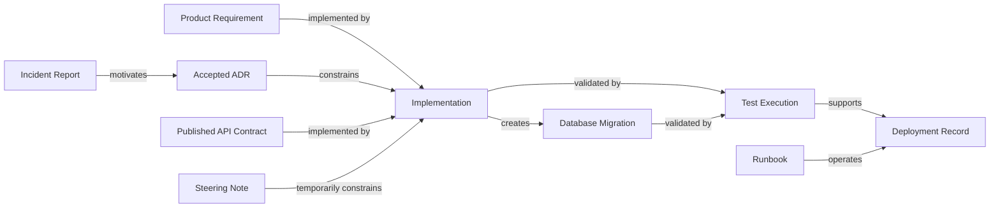

A flat semantic index can find related text.

A knowledge graph can answer stronger questions:

* Which accepted decision governs this service?
* Which requirements are implemented by this pull request?
* Which tests validate this incident corrective action?
* Which active sources still reference a superseded ADR?
* Which runbooks are affected by this deployment change?
* Which source owners must approve this contract update?

> **Architect’s Note**
>
> Semantic retrieval helps an agent find documents. Relationships help it understand why those documents matter together.

### 13.4 Knowledge Graphs Should Not Manufacture Authority

A knowledge graph can show that many sources reference a document.

That does not make the document authoritative.

Popularity, connectivity, and search frequency are not substitutes for:

* approval;
* ownership;
* lifecycle status;
* scope;
* validation.

A highly connected wiki page may still be stale.

A rarely referenced security policy may still be mandatory.

Graph ranking should therefore incorporate governance metadata.

### 13.5 Architecture Decisions Require Evidence Chains

A high-impact architecture decision should be supported by an evidence chain.

For recurring fleet booking, the chain might be:

```text
Production Incident
  ↓
Root Cause
  ↓
Corrective Requirement
  ↓
Architecture Decision
  ↓
Implementation
  ↓
Tests
  ↓
Deployment Validation
  ↓
Operational Runbook
```

More specifically:

```text
INC-2026-031
  ↓
Duplicate processing requires deterministic idempotency
  ↓
ADR-014
  ↓
FleetScheduleOccurrence design
  ↓
Unique database constraint
  ↓
Partial-completion retry test
  ↓
Release 3.8 deployment
  ↓
Recurring booking runbook
```

This chain allows architects to verify not only that a decision was made, but that it was implemented and validated.

### 13.6 Architecture Documentation Should Declare Decision State

Architecture material often combines:

* current architecture;
* target architecture;
* transitional architecture;
* proposed architecture;
* historical architecture.

If these states are not distinguished, agents may implement the wrong target.

An architecture document should explicitly label its view.

Example:

```yaml
architectureView:
  state: Transitional
  effectiveRelease: "3.8"
  targetStateReference: ADR-021
  currentConstraints:
    - Reuse existing Booking worker
  temporaryComponents:
    - Booking worker schedule processor
  plannedReplacement:
    - Enterprise Scheduling Platform
```

This is especially important when a Steering Note temporarily constrains implementation.

### 13.7 Distinguish Architectural Authority from Delivery Authority

An Architecture Council may define the target design.

A Release Lead may define what can be delivered during the current release.

These are different forms of authority.

ADR-014 may establish:

> Recurring schedules must be processed asynchronously.

The Release 3.8 Steering Note may establish:

> Reuse the existing worker and introduce no new scheduling platform.

The Steering Note does not overrule the architectural principle. It constrains the implementation route for the release.

The architecture model should permit both sources to remain valid.

### 13.8 Temporary Decisions Need Exit Conditions

A temporary design often becomes permanent because no source defines when it should end.

For example:

> Use the existing Booking worker for Release 3.8.

Architects should require:

* effective period;
* reason;
* owner;
* exit condition;
* review date;
* target replacement;
* consequences if retained.

Example:

```yaml
temporaryDecision:
  decision: Reuse existing Booking worker
  effectiveRelease: "3.8"
  expiresAfter: Pilot completion
  owner: Release Architecture Lead
  reviewTrigger:
    - Pilot volume exceeds 50,000 monthly occurrences
    - Cross-region scheduling is introduced
    - Release 4.0 planning begins
  longTermReference: ADR-021
```

Without an exit condition, temporary direction becomes undocumented architecture.

### 13.9 Source Quality Should Influence Automation Authority

Not every task should receive the same level of agent autonomy.

An AI harness may allow automatic implementation when:

* authoritative sources agree;
* source ownership is clear;
* required contracts are current;
* tests exist;
* the change is reversible;
* the risk is low.

It should require human review when:

* authoritative sources conflict;
* critical knowledge is missing;
* a sensitive source is required;
* the decision changes architecture or policy;
* the implementation affects public contracts;
* confidence is low;
* the change is difficult to reverse.

A conceptual authority model might be:

```text
High Source Confidence + Low Change Risk
  → Agent may implement and open PR

High Source Confidence + High Change Risk
  → Agent may propose; human approval required

Low Source Confidence + Low Change Risk
  → Agent may prepare a limited draft

Low Source Confidence + High Change Risk
  → Stop and escalate
```

### 13.10 Source Confidence Should Be Decision-Specific

A task should not receive one global confidence score.

For ACD-FLEET-284:

| Decision                                  | Confidence                    |
| ----------------------------------------- | ----------------------------- |
| Use asynchronous processing               | High                          |
| Reuse existing worker for Release 3.8     | High                          |
| Delegate approval to Corporate Accounts   | High                          |
| Preserve Booking API v2 recurrence fields | High after owner confirmation |
| Use £25,000 as threshold                  | Unknown                       |
| Publish draft event schema                | Low                           |
| Treat database document as current        | Low                           |
| Implement deterministic idempotency       | High                          |

Decision-specific confidence is more useful than a single task percentage.

### 13.11 Confidence Must Not Replace Approval

An agent may have high confidence that an ADR should change.

It still does not possess the authority to approve that change.

Confidence answers:

> How strong is the evidence?

Authority answers:

> Who may decide?

These must remain separate.

### 13.12 Source Conflicts Are Architectural Signals

Conflicts are not merely documentation defects.

They may reveal:

* unclear service ownership;
* incomplete migration;
* broken governance;
* inconsistent deployment;
* premature contract publication;
* architectural drift;
* policy ambiguity;
* duplicate sources of truth;
* missing approval workflows.

For example, the conflict between Booking API v2 and current implementation may indicate:

* contract-first delivery in progress;
* an incomplete release;
* repository drift;
* deployment drift;
* a failed rollback;
* a missing branch;
* an invalid published contract.

The architect should treat the conflict as evidence about the delivery system, not only the document.

### 13.13 Repeated Conflicts Reveal Systemic Weakness

If agents repeatedly report:

* contracts that differ from code;
* diagrams that differ from deployment;
* stale runbooks;
* missing owners;
* draft requirements used as approved;
* tests unlinked to requirements;

the issue is not isolated documentation quality.

It indicates a weak knowledge architecture.

Architectural remedies may include:

* generated contracts;
* automated schema documentation;
* source catalogue enforcement;
* ownership validation;
* release-linked evidence;
* required ADR status;
* contract drift detection;
* knowledge-gap dashboards.

### 13.14 Retrieval Architecture Must Enforce Security

Access control cannot be added after retrieval.

The retrieval layer should evaluate:

* user identity;
* agent Role;
* task;
* source classification;
* project;
* environment;
* customer;
* geography;
* purpose.

A secure architecture should resemble:

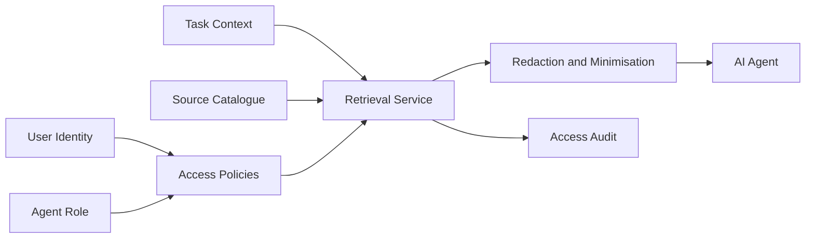

The model should receive only authorised, task-relevant content.

### 13.15 Retrieval and Modification Permissions Must Be Separate

An agent may be allowed to read an accepted ADR without being allowed to modify it.

It may be allowed to read a published contract but only draft a proposed change.

It may be allowed to read a sanitised incident summary but not the full report.

Permission types should include:

* discover;
* retrieve metadata;
* read summary;
* read full content;
* cite;
* propose change;
* modify;
* approve;
* publish;
* retire.

A simple read/write model is insufficient for enterprise Knowledge Sources.

### 13.16 Protected Sources Need Technical Controls

Instructions such as “do not modify ADRs” are useful but insufficient.

Use:

* branch protection;
* required reviewers;
* path restrictions;
* CODEOWNERS;
* policy checks;
* commit validation;
* protected storage;
* signed approvals;
* immutable incident archives.

Model behaviour and repository controls should reinforce each other.

### 13.17 Source Summarisation Is an Architectural Boundary

Summaries can reduce context size and protect sensitive content.

However, summarisation changes the evidence.

A summary may remove:

* exceptions;
* minority opinions;
* scope limitations;
* caveats;
* unresolved questions.

Architects should define:

* which source types may be summarised;
* who approves summary templates;
* what metadata must be retained;
* when original inspection is mandatory;
* how summaries are refreshed;
* whether summaries may be used for final decisions.

For high-impact decisions, summaries should support discovery, not replace original evidence.

### 13.18 Generated Documentation Needs Reproducibility

If documentation is generated, the architecture should record:

* source inputs;
* generator version;
* command;
* commit;
* timestamp;
* output checksum;
* validation status.

Example:

```yaml
generatedSource:
  id: DB-BOOKING-SCHEMA
  generator: Alpha.SchemaDoc
  generatorVersion: "2.4.1"
  command: "dotnet schema-doc --service Booking"
  sourceCommit: c3e119a
  generatedOn: 2026-07-28
  reviewedBy: Booking Service Team
```

Without reproducibility, generated documents become another manual artefact.

### 13.19 Runtime Evidence Has Its Own Scope

Production telemetry is powerful evidence.

It is not automatically complete.

A dashboard may show no duplicate bookings because:

* instrumentation is missing;
* the query is wrong;
* only one region is included;
* the time window is too short;
* failed events are not recorded;
* sampling removed relevant data.

Runtime evidence should include:

* environment;
* time range;
* query;
* service version;
* data completeness;
* known instrumentation gaps.

### 13.20 Production State May Differ from Repository State

The repository may show:

* a migration;
* a deployment manifest;
* a feature flag;
* an API contract.

Production may run a different:

* commit;
* schema version;
* configuration;
* contract;
* feature state.

An architecture decision about current behaviour may require both repository and environment evidence.

This is especially important for:

* incident response;
* rollback;
* compatibility analysis;
* migration planning;
* security review.

### 13.21 Knowledge Sources Must Survive Platform Change

The enterprise may change its preferred AI agent.

Knowledge architecture should survive migration from:

* Claude Code;
* GitHub Copilot;
* Codex;
* a future internal agent;
* a multi-agent harness.

Platform-specific files may change.

The following should remain portable:

* source catalogue;
* metadata;
* authority model;
* source ownership;
* status;
* scope;
* knowledge gaps;
* evidence links;
* approval records;
* validation evidence.

> **Architect’s Note**
>
> Do not allow the AI platform to become the owner of enterprise knowledge. The platform consumes the evidence model; it does not define it.

### 13.22 Multi-Agent Systems Need Shared Evidence Boundaries

In a multi-agent harness, agents may otherwise work from different assumptions.

For example:

* the Developer Agent reads ADR-014;
* the Reviewer Agent retrieves ADR-009;
* the Validator Agent sees only the requirement;
* the Evaluator Agent receives a generated summary.

This produces inconsistent reasoning.

A shared task source manifest should define the baseline evidence set.

Independent reviewers may retrieve additional sources, but they should record any difference.

### 13.23 Shared Evidence Must Not Eliminate Independent Review

A common manifest improves consistency.

It can also create shared blind spots.

The Reviewer Agent should verify:

* whether the manifest omitted contrary sources;
* whether source statuses remain accurate;
* whether new evidence appeared during implementation;
* whether access filtering removed important context.

Shared evidence establishes the baseline, not the final limit.

### 13.24 Evidence Drift Must Be Detected During Long Tasks

A task may remain open while:

* requirements change;
* a new ADR is accepted;
* a contract is republished;
* a Steering Note expires;
* a new incident occurs;
* a deployment changes.

The source manifest can become stale during the task.

Long-running harness workflows should:

* record source versions;
* detect changes;
* revalidate before merge;
* report material updates;
* repeat review when necessary.

Example:

```text
WARNING:
ADR-014 changed after implementation began.

Initial commit:
9ab42f1

Current commit:
b7e8034

Action:
Review the new decision text before merge.
```

### 13.25 Knowledge Sources Should Be Part of Architecture Reviews

Architecture review templates should include:

* sources used;
* source authority;
* unresolved conflicts;
* missing evidence;
* implementation-state evidence;
* intended-state evidence;
* affected owners;
* source-refresh plan.

A design diagram without source references may be visually strong but difficult to govern.

### 13.26 Decision Records Should Explain Evidence Selection

An ADR should not only state the decision.

For complex decisions, it should identify:

* primary evidence;
* rejected evidence;
* historical incidents;
* constraints;
* unresolved assumptions;
* temporary conditions.

Example:

```markdown
## Evidence Considered

- INC-2026-031
- Booking API v2
- Corporate Fleet Booking Requirements
- Worker capacity benchmark
- Release 3.8 Steering Note

## Sources Excluded

- ADR-009, superseded
- Draft fleet event schema, not approved
```

This helps future agents understand why the decision was made.

### 13.27 Architecture Diagrams Are Knowledge Sources

Diagrams should have:

* title;
* owner;
* status;
* scope;
* version;
* last review date;
* source references;
* intended architectural state.

A diagram without metadata may be:

* current;
* proposed;
* historical;
* conceptual;
* environment-specific.

Agents should not infer which one.

### 13.28 Contracts Require Consumer Evidence

A published API or event contract may affect multiple consumers.

Before changing it, architects should identify:

* registered consumers;
* generated clients;
* contract tests;
* usage telemetry;
* version support;
* migration paths;
* deprecation periods.

The contract itself is not the complete evidence set for compatibility decisions.

### 13.29 Database Truth Is Multi-Layered

Database knowledge may come from:

* domain model;
* ORM configuration;
* migrations;
* generated schema;
* deployed schema;
* data dictionary;
* performance indexes;
* operational scripts.

Each source answers a different question.

| Source            | Question                                      |
| ----------------- | --------------------------------------------- |
| Domain model      | What concepts does the application represent? |
| ORM configuration | How are concepts mapped?                      |
| Migration         | What schema change was defined?               |
| Deployed schema   | What exists in an environment?                |
| Data dictionary   | What does each field mean?                    |
| Query telemetry   | How is the schema used operationally?         |

An architect should avoid referring simply to “the database source of truth.”

### 13.30 Incident Reports Should Influence Architecture

Incidents are often archived after corrective actions are assigned.

They should remain linked to:

* ADRs;
* tests;
* monitoring;
* runbooks;
* future implementations.

For INC-2026-031, the architecture should trace:

* root cause;
* idempotency requirement;
* uniqueness constraint;
* retry test;
* duplicate-attempt telemetry;
* operational procedure.

Otherwise, future agents may recreate the same defect.

### 13.31 Test Evidence Should Map to Risk

A large number of passing tests does not necessarily cover the most important failure mode.

Knowledge-aware validation should connect:

```text
Risk
  ↓
Historical Evidence
  ↓
Requirement
  ↓
Test Scenario
  ↓
Execution Result
```

For recurring fleet booking:

```text
Risk:
Duplicate booking after worker retry

Historical evidence:
INC-2026-031

Requirement:
At most one booking per schedule occurrence

Test:
RetryAfterInsert_CreatesSingleBooking

Execution:
Passed for commit c3e119a
```

This is more meaningful than a total test count alone.

### 13.32 Knowledge Debt Is Architectural Debt

Knowledge debt includes:

* stale ADRs;
* missing owners;
* outdated diagrams;
* unvalidated runbooks;
* contract drift;
* undocumented service boundaries;
* unresolved knowledge gaps;
* test evidence not linked to requirements.

Knowledge debt increases:

* onboarding time;
* AI error rate;
* architecture drift;
* review effort;
* incident recurrence;
* migration risk.

It should be managed alongside code and infrastructure debt.

### 13.33 Knowledge Debt Should Be Prioritised by Decision Risk

Not every stale document deserves equal attention.

Prioritise sources that influence:

* security;
* public contracts;
* money;
* customer commitments;
* regulatory controls;
* production recovery;
* service ownership;
* data integrity;
* architecture boundaries.

A stale internal tutorial is lower risk than stale disaster-recovery instructions.

### 13.34 Knowledge Governance Requires Architecture Ownership

A documentation team can support formatting, publishing, and editorial consistency.

It cannot own every underlying engineering decision.

Knowledge governance should involve:

* Enterprise Architecture;
* service teams;
* product owners;
* Application Security;
* Platform Operations;
* Quality Engineering;
* compliance and data governance.

The architecture function should define the model, while domain owners maintain source correctness.

### 13.35 The Harness Should Record Evidence, Not Only Output

A harness that stores only generated code and final responses loses the reasoning basis for the work.

It should record:

* Prompt;
* Instructions;
* Role;
* Steering Note;
* source manifest;
* source versions;
* conflicts;
* human decisions;
* implementation commit;
* review findings;
* test results;
* evaluation outcome;
* source-refresh recommendations.

This record supports:

* audit;
* reproduction;
* learning;
* governance;
* future source improvement.

### 13.36 Harness Memory Must Not Turn Conclusions into Truth Automatically

A self-learning harness may observe that many implementations use a pattern.

It should not automatically convert that pattern into an authoritative source.

For example:

> Five recent changes used the Booking worker for scheduling.

This may indicate a reusable practice.

It does not prove a permanent architecture standard.

The harness may propose:

* a Skill update;
* an Instruction change;
* a new ADR;
* a source catalogue update.

Human approval remains mandatory.

### 13.37 Learned Knowledge Needs Provenance

If a harness generates a recommendation from previous runs, it should record:

* source runs;
* contributing pull requests;
* test outcomes;
* reviewer findings;
* confidence;
* affected scope;
* owner;
* approval status.

A learned recommendation without provenance becomes another uncited assumption.

### 13.38 Retrieval Failure Must Be Visible

If an agent cannot access a required source, it should not proceed as though the source does not exist.

It should report:

```markdown
Required source:
SEC-CORP-007

Access status:
Denied

Impact:
Approval ownership cannot be independently verified.

Next action:
Request Security Reviewer participation or an approved sanitised summary.
```

Access failure and missing knowledge are not the same.

### 13.39 Missing Source and Negative Evidence Are Different

The absence of a file does not prove the absence of a capability.

For example:

* no scheduling worker appears in the current folder;
* no migration exists in the searched project;
* no incident appears in the local repository.

The evidence may exist:

* in another repository;
* in another branch;
* in an external platform;
* in production;
* under restricted access.

Agents should state:

> No evidence was found in the searched scope.

They should not state:

> The evidence does not exist.

### 13.40 Architecture Should Support Evidence Escalation

When evidence is insufficient, the system should know where to route the question.

Possible routing:

```text
Business ambiguity
  → Product Owner

Architecture conflict
  → Architecture Council

Security ambiguity
  → Application Security

Deployment uncertainty
  → Platform Operations

Schema uncertainty
  → Service Team or Database Owner

Contract conflict
  → API Owner and Consumer Representatives

Incident interpretation
  → Service Owner and Reliability Team
```

A source catalogue without ownership and escalation metadata is incomplete.

### 13.41 Architect’s Decision Framework

Before approving AI-assisted architecture work, ask:

#### Evidence

* What sources support the decision?
* Are they current, approved, and within scope?
* What source proves current state?
* What source defines intended state?
* What historical evidence applies?

#### Conflict

* Which sources disagree?
* Is the conflict caused by scope, version, status, or actual contradiction?
* Who owns resolution?
* Was the decision recorded?

#### Authority

* Which Role is proposing the change?
* Which human or group may approve it?
* Are modification permissions aligned with authority?
* Did the agent change any protected source?

#### Security

* Were source access controls applied before retrieval?
* Was sensitive content minimised?
* Were summaries used appropriately?
* Is source access auditable?

#### Validation

* Which tests validate the important risks?
* Are test results tied to the implementation commit?
* Is deployment evidence available?
* Does production state match repository state?

#### Governance

* Which sources need refresh?
* Which source owners must review?
* Are unresolved gaps visible?
* Will future agents retrieve the corrected evidence?

### 13.42 Architect’s Note for Alpha Car Detailing

For recurring fleet booking, the architecture decision should be accepted only when the evidence chain demonstrates:

* approved business need;
* accepted asynchronous scheduling architecture;
* clear Booking and Corporate Accounts ownership;
* published API compatibility;
* persistence designed for deterministic idempotency;
* tests reproducing the historical retry failure;
* use of the existing worker for Release 3.8;
* no unapproved threshold in Booking;
* operational visibility;
* source refresh assigned to owners.

The architecture review should not accept “the code compiles” or “the tests pass” as sufficient evidence without confirming that the tested behaviour is aligned with the correct sources.

### 13.43 Architect’s Notes Outcome

The architect’s responsibility is not to choose one document and declare it the truth.

It is to design a system in which:

* evidence is discoverable;
* authority is scoped;
* ownership is explicit;
* conflicts are visible;
* access is controlled;
* historical lessons remain connected;
* current and intended state are distinguished;
* decisions are cited;
* validation is reproducible;
* knowledge gaps are governed;
* AI authority remains bounded.

Knowledge Sources are therefore part of the architecture of AI-assisted delivery itself.

Without that architecture, AI agents may produce technically sophisticated outputs based on the wrong evidence.

Chapter 11 status: In progress — next section: Enterprise Tips

## 14. Enterprise Tips

Enterprise Knowledge Sources must work across teams, repositories, environments, business domains, and AI platforms.

A repository-level catalogue is a strong starting point, but large organisations must also consider:

* federated ownership;
* shared governance;
* source classification;
* access boundaries;
* cross-repository discovery;
* lifecycle automation;
* evidence retention;
* auditability;
* regional and regulatory differences;
* multi-agent consistency.

The following tips focus on scaling Knowledge Sources beyond a single project.

### 14.1 Start with High-Risk Sources

Do not begin by cataloguing every document in the organisation.

Start with sources that influence:

* security;
* public contracts;
* financial rules;
* customer commitments;
* regulatory obligations;
* production recovery;
* data ownership;
* service boundaries;
* architecture decisions.

For Alpha Car Detailing, priority sources include:

* Booking API contracts;
* corporate approval guidance;
* accepted ADRs;
* database migrations;
* incident reports;
* operational runbooks;
* deployment records;
* active Steering Notes.

A smaller governed set is more useful than a large unclassified index.

### 14.2 Use Federated Ownership

A central architecture or governance team should define:

* metadata standards;
* lifecycle states;
* authority classifications;
* citation requirements;
* access rules;
* refresh expectations;
* escalation patterns.

Domain teams should own source accuracy.

For example:

| Governance area         | Central ownership       | Domain ownership                     |
| ----------------------- | ----------------------- | ------------------------------------ |
| Source metadata schema  | Enterprise Architecture | Service teams populate metadata      |
| Security classification | Security Governance     | Source owners classify content       |
| API source standards    | API Governance          | API teams maintain contracts         |
| ADR lifecycle           | Architecture Council    | Decision owners maintain ADRs        |
| Runbook standards       | Platform Operations     | Service teams validate procedures    |
| Product requirements    | Product Governance      | Product owners maintain requirements |

Centralising every source creates bottlenecks.

Decentralising every rule creates inconsistency.

Federated governance balances both.

### 14.3 Establish a Minimum Source Contract

Every critical Knowledge Source should include a minimum metadata contract.

Example:

```yaml
id: SEC-CORP-007
title: Corporate Account Authorization
type: SecurityGuidance
status: Active
authority: Mandatory
owner: Application Security
scope:
  services:
    - Booking
    - CorporateAccounts
classification: Confidential
lastReviewedOn: 2026-07-09
nextReviewDue: 2026-10-09
```

At minimum, require:

* identifier;
* title;
* type;
* status;
* authority;
* owner;
* scope;
* classification;
* last review;
* next review.

Sources lacking required metadata should be flagged during validation.

### 14.4 Standardise Source Identifiers

Use stable identifiers for important sources.

Examples:

```text
ADR-014
REQ-FLEET-002
API-BOOKING-V2
SEC-CORP-007
INC-2026-031
RUN-BOOKING-012
KG-BOOKING-017
```

Stable identifiers improve:

* citations;
* search;
* relationships;
* audit records;
* source manifests;
* pull request references;
* cross-repository links.

File paths may change.

Stable identifiers should remain.

### 14.5 Build Capability-Based Discovery

Enterprise search should support questions such as:

> Show all current sources affecting recurring fleet booking.

The answer should include sources across:

* Booking;
* Corporate Accounts;
* Station Operations;
* Security;
* Platform Operations;
* Product Management.

Capability-based discovery is more useful than requiring agents to know every repository location.

### 14.6 Maintain a Service Catalogue

A service catalogue should identify:

* service owner;
* product owner;
* architecture owner;
* support team;
* repository;
* API contracts;
* event contracts;
* database;
* runbooks;
* dashboards;
* security classification;
* active ADRs;
* dependent services.

A Knowledge Source system can link to this catalogue rather than duplicating ownership information.

For Alpha Car Detailing:

```yaml
service: Booking
repository: alpha-car-detailing
technicalOwner: Booking Service Team
productOwner: Fleet Product Owner
architectureOwner: Solution Architecture
securityReviewer: Application Security
capabilities:
  - WalkInBooking
  - CorporateFleetBooking
contracts:
  - API-BOOKING-V2
activeDecisions:
  - ADR-014
runbooks:
  - RUN-BOOKING-012
```

### 14.7 Link Sources Across Repositories

Enterprise capabilities often span multiple repositories.

Recurring fleet booking may involve:

* Booking repository;
* Corporate Accounts repository;
* Station Operations repository;
* shared contracts repository;
* infrastructure repository;
* security-policy repository.

A task manifest should preserve cross-repository references.

Example:

```yaml
sources:
  - id: API-BOOKING-V2
    repository: alpha-booking
    path: contracts/openapi/booking-api.v2.yaml

  - id: SEC-CORP-007
    repository: enterprise-security
    path: policies/corporate-account-authorization.md
```

Do not assume all authoritative evidence resides in the implementation repository.

### 14.8 Apply Consistent Status Vocabulary

Avoid one repository using:

* Current;
* Final;
* Valid;

while another uses:

* Active;
* Approved;
* Accepted.

Define a controlled vocabulary.

Recommended lifecycle vocabulary:

```text
Draft
Proposed
Under Review
Approved
Accepted
Active
Deprecated
Superseded
Expired
Rejected
Archived
```

Document when each term applies.

For example:

* `Accepted` may be used for ADRs.
* `Approved` may be used for requirements.
* `Published` may be used for contracts.
* `Active` may be used for policies and runbooks.

The catalogue can normalize these into broader lifecycle categories.

### 14.9 Separate Status from Authority

A source can be active but supporting.

A source can be historical but highly reliable.

A source can be published but limited in scope.

Example:

```yaml
status: Active
authority: Supporting
```

Do not overload one metadata field to represent:

* approval;
* freshness;
* reliability;
* authority.

These are separate dimensions.

### 14.10 Use Retrieval Warnings

When a source may still be useful but carries risk, attach a retrieval warning.

Example:

```yaml
id: DB-BOOKING-SCHEMA
status: Active
authority: Supporting
freshnessAssessment: ReviewOverdue
retrievalWarning: Validate against current migrations before use
```

This is better than either:

* ranking it as fully trusted; or
* deleting it from retrieval.

### 14.11 Use Source Access Tiers

A practical enterprise access model may include:

| Tier         | Example                                                  |
| ------------ | -------------------------------------------------------- |
| Public       | Published external API documentation                     |
| Internal     | Standard architecture and engineering material           |
| Confidential | Incident reports, customer agreements, internal topology |
| Restricted   | Vulnerability details, legal records, regulated data     |
| Secret       | Credentials and cryptographic material                   |

AI agents should never retrieve secrets as Knowledge Sources.

Secret values belong in managed secret stores and should be referenced indirectly.

### 14.12 Provide Sanitised Source Views

For confidential sources, provide approved views.

An incident system might expose:

* full report to Site Reliability Engineering;
* sanitised technical summary to Developer and Reviewer Agents;
* high-level control lesson to the wider organisation.

The source identifier and classification should remain visible.

This preserves provenance without unnecessary disclosure.

### 14.13 Keep Secrets Out of Knowledge Indexes

Do not index:

* passwords;
* tokens;
* private keys;
* connection strings;
* certificate private material;
* customer credentials.

The catalogue may contain a reference such as:

```yaml
configurationSource:
  type: ManagedSecret
  location: Azure Key Vault
  secretNameReference: Booking--CorporateAccounts--ClientCredential
```

It should not contain the secret value.

### 14.14 Integrate Knowledge Validation into CI/CD

Source validation can run alongside code validation.

Possible checks include:

* missing metadata;
* expired sources;
* overdue reviews;
* references to superseded ADRs;
* API contract drift;
* event schema drift;
* database documentation drift;
* broken source links;
* missing owners;
* invalid status transitions;
* protected-source modifications;
* missing required reviewers.

Example pipeline output:

```text
Knowledge Source Validation

Passed:
- All accepted ADRs have owners.
- All published API contracts have versions.
- No active source references ADR-009.

Warnings:
- DB-BOOKING-SCHEMA review overdue.
- RUN-BOOKING-012 remains draft.

Blocked:
- API-BOOKING-V2 changed without API owner approval.
```

### 14.15 Add Source-Aware Pull Request Gates

A pull request should trigger additional review when it changes:

* an ADR;
* a public contract;
* a security source;
* an incident report;
* source classification;
* ownership metadata;
* a Steering Note;
* a product requirement.

Example policy:

```text
Path: architecture/decisions/**
Required reviewer: Architecture Council

Path: security/**
Required reviewer: Application Security

Path: contracts/openapi/**
Required reviewer: API Owner

Path: requirements/**
Required reviewer: Product Owner
```

### 14.16 Detect Cross-Source Drift

Automate comparisons where possible.

Examples:

* OpenAPI contract versus generated runtime contract;
* event schema versus producer serialization model;
* database document versus migrations;
* service diagram versus deployment manifests;
* ownership catalogue versus `CODEOWNERS`;
* runbook commands versus current tooling;
* requirement acceptance criteria versus test mapping.

Cross-source drift is often more important than individual file freshness.

### 14.17 Use Evidence Links in Work Items

Work items should link to relevant sources.

For ACD-FLEET-284:

```text
Requirement: REQ-FLEET-002
Architecture: ADR-014
API: API-BOOKING-V2
Security: SEC-CORP-007
Incident: INC-2026-031
Knowledge Gap: KG-BOOKING-017
Steering Note: Release 3.8
```

This gives both humans and AI agents a stronger starting point.

The agent should still verify the source status and scope.

### 14.18 Preserve Human Decisions as First-Class Records

When a human resolves a source conflict, record the decision in a durable form.

A decision record should include:

* identifier;
* question;
* decision;
* approver;
* date;
* scope;
* affected sources;
* expiry;
* required source updates.

Example:

```yaml
id: HD-ACD-FLEET-284-001
question: Are Booking API v2 recurrence fields intentional?
decision: Yes
approvedBy: Booking Service Owner
scope:
  task: ACD-FLEET-284
effectiveOn: 2026-07-28
affectedSources:
  - API-BOOKING-V2
followUp:
  - Complete implementation
  - Add contract tests
```

### 14.19 Avoid Chat as the Final Decision Store

Chat, email, and meeting notes may help resolve a question.

They should not remain the only evidence of the outcome.

Convert the result into:

* an ADR;
* requirement update;
* approved source note;
* decision record;
* pull request approval;
* issue resolution.

This prevents future agents from depending on inaccessible conversation history.

### 14.20 Create a Knowledge Review Board Only for High-Risk Domains

Do not route every source change through one enterprise board.

Use specialised review paths for high-risk sources:

* Architecture Council for architectural decisions;
* Security Governance for security controls;
* API Governance for public contracts;
* Data Governance for regulated data;
* Product Governance for customer commitments.

Routine implementation documentation should remain with domain teams.

### 14.21 Use Review Service-Level Objectives

Set expectations for source review.

Examples:

| Source type                       | Review expectation              |
| --------------------------------- | ------------------------------- |
| Critical security guidance        | Within one business day         |
| Public API contract change        | Before merge                    |
| Incident corrective source        | Within five business days       |
| Runbook update                    | Before production release       |
| Product requirement clarification | Before implementation continues |
| Low-risk supporting documentation | Within the sprint               |

Without review expectations, knowledge gaps can block delivery indefinitely.

### 14.22 Track Knowledge Gaps Centrally

A central view should show:

* gap identifier;
* affected capability;
* severity;
* owner;
* age;
* blocked decision;
* temporary direction;
* status.

Example:

| Gap            | Capability                  | Severity | Owner                            | Status            |
| -------------- | --------------------------- | -------: | -------------------------------- | ----------------- |
| KG-BOOKING-017 | Recurring Fleet Booking     |     High | Corporate Accounts Product Owner | Awaiting decision |
| KG-STATION-006 | Station Capacity            |   Medium | Station Operations               | In review         |
| KG-SEC-012     | Vehicle data classification |     High | Data Governance                  | Open              |

This helps leadership see where missing knowledge is creating delivery risk.

### 14.23 Measure Source Conflict Recurrence

If the same conflict appears repeatedly, investigate why it remains unresolved.

Recurring conflicts may indicate:

* no source owner;
* failed refresh process;
* duplicated repositories;
* missing supersession;
* undocumented deployment differences;
* weak release governance.

The goal is not merely to close each individual conflict.

It is to remove the systemic cause.

### 14.24 Use Knowledge Quality Metrics Carefully

Useful measures include:

* critical-source owner coverage;
* review-date compliance;
* source citation coverage;
* unresolved high-severity conflicts;
* average gap resolution time;
* contract drift rate;
* stale runbook rate;
* protected-source approval compliance;
* source access violations;
* repeated incident lessons.

Avoid vanity metrics such as:

* total documents indexed;
* total embeddings created;
* average sources retrieved per task.

Volume does not equal quality.

### 14.25 Monitor Agent Source Behaviour

Record:

* which sources an agent retrieved;
* which sources it cited;
* which sources it excluded;
* whether it used stale or draft material;
* whether it detected known conflicts;
* whether it requested human review;
* whether it attempted protected modifications.

These records can improve:

* Instructions;
* Skills;
* retrieval ranking;
* catalogue quality;
* governance policies.

### 14.26 Use Source Quality to Tune Agent Autonomy

An enterprise may define autonomy levels.

#### Level 1 — Advisory

The agent may discover and summarize sources.

#### Level 2 — Drafting

The agent may prepare implementation and source updates for review.

#### Level 3 — Controlled Implementation

The agent may modify approved paths and open a pull request.

#### Level 4 — Automated Merge for Low Risk

The agent may merge only when:

* source confidence is high;
* change risk is low;
* tests pass;
* no protected source changes exist;
* policy gates pass.

#### Level 5 — Restricted Autonomous Operation

Reserved for highly controlled, reversible workflows with strong evidence and monitoring.

Knowledge quality should be one of the inputs to autonomy decisions.

### 14.27 Establish Source Fallback Behaviour

When an authoritative source is unavailable, define what the agent should do.

Example:

```text
Primary source unavailable
  ↓
Retrieve approved summary
  ↓
Check supporting evidence
  ↓
Lower confidence
  ↓
Request owner confirmation
  ↓
Do not make irreversible changes
```

This is safer than either complete failure or unsupported continuation.

### 14.28 Design for Regional Scope

Enterprise policies may differ by geography.

Alpha Car Detailing may operate across several countries.

A pricing, privacy, or retention source should specify:

```yaml
scope:
  regions:
    - UnitedKingdom
  effectiveFrom: 2026-08-01
```

An agent must not apply a United Kingdom rule globally unless the source explicitly says so.

### 14.29 Preserve Currency and Policy Scope

A business policy containing £25,000 must clarify:

* currency;
* customer type;
* region;
* time period;
* contract type;
* effective date;
* exception process.

Example:

```yaml
approvalLimit:
  amount: 25000
  currency: GBP
  period: Monthly
  customerType: Corporate
  region: UnitedKingdom
  status: UnderReview
```

A number without scope is not an actionable policy.

### 14.30 Support Environment-Specific Evidence

Sources should distinguish:

* development;
* integration;
* staging;
* production;
* disaster-recovery environments.

An API contract generated in integration may not prove what is deployed in production.

A deployment manifest may be environment-specific.

An incident may apply only to one region or version.

### 14.31 Record Feature-Flag State

Current behaviour may depend on feature flags.

A source assessment should identify:

* flag name;
* environment;
* value;
* effective date;
* owning team;
* rollout percentage.

Without feature-flag evidence, code and deployment records may not explain actual user behaviour.

### 14.32 Include External Systems in the Evidence Model

Some sources exist outside version control:

* API management;
* cloud configuration;
* monitoring dashboards;
* incident-management systems;
* schema registries;
* service catalogues;
* customer contract systems.

The catalogue should store controlled references and retrieval methods.

Do not copy all external content into the repository merely to make it searchable.

### 14.33 Use Connectors with Explicit Trust Boundaries

A harness connector should declare:

* system;
* source type;
* authentication method;
* permitted roles;
* data classification;
* retrieval limits;
* audit behaviour;
* caching rules.

Example:

```yaml
connector:
  id: IncidentManagement
  permittedRoles:
    - LeadAgent
    - ReviewerAgent
    - SecurityReviewer
  defaultView: SanitisedSummary
  fullAccessRequires:
    - HumanApproval
  audit: Required
```

### 14.34 Do Not Treat Search-System Ranking as Governance

Enterprise search may rank a source highly because it is:

* popular;
* recent;
* frequently linked;
* semantically similar.

Governance metadata must still determine whether it is usable.

Search ranking and source authority are separate layers.

### 14.35 Preserve Negative and Rejected Decisions

A rejected ADR or design option can save future teams from repeating analysis.

Record:

* what was considered;
* why it was rejected;
* under what conditions it might be reconsidered;
* which risks were identified.

Agents should retrieve rejected sources only when analysing alternatives or history.

### 14.36 Archive Without Erasing Discoverability

Archived sources should remain discoverable for:

* audit;
* incident investigation;
* migration analysis;
* historical architecture;
* compliance.

They should be clearly excluded from current default retrieval.

### 14.37 Use Knowledge Packs for Repeated Tasks

For recurring high-value workflows, create curated knowledge packs.

Example:

```text
Fleet Booking Knowledge Pack

- active ADRs;
- current API contracts;
- service ownership;
- approved requirements;
- known incidents;
- current migrations;
- runbooks;
- test mapping;
- active Steering Notes.
```

The pack should be generated from the catalogue, not manually copied and forgotten.

### 14.38 Version Knowledge Packs

A knowledge pack should identify:

* generation time;
* included sources;
* source versions;
* exclusions;
* access level;
* task or capability scope.

This allows agents and auditors to reproduce the context used.

### 14.39 Require Original Inspection for High-Risk Decisions

Knowledge packs and summaries improve speed.

For high-risk decisions, require inspection of original sources.

Examples:

* changing authentication;
* changing public contracts;
* modifying approval policy;
* changing data retention;
* altering production recovery;
* changing service ownership.

### 14.40 Build Source-Aware Developer Portals

An internal developer portal can show, for each service:

* owners;
* repositories;
* active ADRs;
* API contracts;
* event schemas;
* database documentation;
* runbooks;
* dashboards;
* incidents;
* active gaps;
* current Steering Notes.

This improves human and AI discovery.

### 14.41 Make Source Health Visible

A service page could display:

```text
Knowledge Health: Amber

- API contract: Current
- ADRs: Current
- Runbook: Review overdue
- Database documentation: Stale
- Ownership: Current
- Open knowledge gaps: 2
- Contract drift: None
```

This allows teams to address knowledge debt before it affects delivery.

### 14.42 Include Knowledge Health in Architecture Reviews

Architecture reviews should examine both system design and evidence quality.

Questions include:

* Are service boundaries documented and owned?
* Are contracts current?
* Are operational procedures validated?
* Are previous incidents linked?
* Are critical knowledge gaps open?
* Can an AI agent discover the correct sources?

### 14.43 Include Knowledge Health in Release Readiness

Before release, verify:

* API and event contracts;
* database documentation;
* runbooks;
* deployment evidence;
* rollback procedures;
* monitoring;
* ownership;
* known gaps;
* expired Steering Notes;
* unresolved source conflicts.

Release readiness should not rely only on code and test status.

### 14.44 Use Post-Incident Reviews to Refresh the Knowledge Estate

After an incident:

1. record technical findings;
2. update or create ADRs;
3. add regression tests;
4. update runbooks;
5. update monitoring;
6. update source metadata;
7. link corrective actions;
8. update retrieval keywords;
9. validate that future agents can discover the lesson.

An incident report that is never connected to future work has limited preventive value.

### 14.45 Protect Legal and Regulatory Sources

Legal and regulatory material may require:

* restricted access;
* jurisdiction scope;
* effective dates;
* legal-owner review;
* non-summarisation rules;
* retention;
* citation restrictions.

An AI agent should not interpret legal text as implementation authority without approved organisational guidance.

### 14.46 Distinguish External Standards from Internal Policy

An external standard may recommend a practice.

An internal policy may mandate how the organisation applies it.

Agents should distinguish:

```text
External standard
  → Reference guidance

Internal approved policy
  → Organisational requirement

Repository Instruction
  → Agent behaviour

Implementation evidence
  → Current state
```

### 14.47 Plan for Mergers and Organisational Change

Source ownership may become stale when:

* teams merge;
* services transfer;
* products are acquired;
* repositories move;
* naming changes.

Ownership validation should be automated where possible.

Sources with inactive owners should be flagged.

### 14.48 Use Retention Policies

Historical sources may have legal, operational, or audit value.

Define retention by source type.

Examples:

| Source type          | Example retention consideration        |
| -------------------- | -------------------------------------- |
| Incident report      | Operational and audit policy           |
| Test result          | Release and compliance requirements    |
| ADR                  | Lifetime of system plus archive period |
| Pull request         | Repository retention                   |
| Customer requirement | Contract duration and legal policy     |
| Security finding     | Security and legal retention           |
| Steering Note        | Project history with expiry status     |

### 14.49 Avoid Cross-Project Leakage

An agent working on Alpha Car Detailing should not retrieve unrelated confidential sources merely because they share keywords.

Retrieval should filter by:

* tenant;
* project;
* repository;
* customer;
* business unit;
* role;
* task.

### 14.50 Test the Retrieval System

Knowledge retrieval itself should be tested.

Create scenarios such as:

* accepted ADR outranks superseded ADR;
* draft contract is labelled unverified;
* confidential incident is summarised rather than exposed;
* stale database document triggers warning;
* active Steering Note is selected for the current release;
* expired Steering Note is excluded;
* API conflict is detected;
* missing owner triggers a knowledge gap.

These tests validate Repository Intelligence, not application code.

### 14.51 Use Golden Evidence Sets

For important tasks, maintain expected source sets.

Example:

```yaml
scenario: RecurringFleetBookingImplementation

mustRetrieve:
  - ADR-014
  - REQ-FLEET-002
  - API-BOOKING-V2
  - SEC-CORP-007
  - INC-2026-031
  - Release-3.8-Steering

mustClassifyAsHistorical:
  - ADR-009

mustWarn:
  - DB-BOOKING-SCHEMA

mustNotExpose:
  - Incident customer identifiers
```

A harness evaluation can compare actual retrieval with the expected set.

### 14.52 Evaluate Citation Quality

Do not check only whether citations exist.

Evaluate whether they:

* support the claim;
* identify the correct source;
* include status;
* identify relevant location;
* use the applicable version;
* distinguish evidence from inference.

A citation to an unrelated source provides false assurance.

### 14.53 Evaluate Conflict Detection

A retrieval evaluation should ask:

* Did the agent find both sides?
* Did it identify the contradiction?
* Did it classify the conflict correctly?
* Did it route to the correct owner?
* Did it preserve a safe implementation path?

### 14.54 Evaluate Sensitive-Source Handling

Test whether the harness:

* denies unauthorised access;
* returns sanitised summaries;
* excludes restricted fields;
* prevents sensitive text in logs;
* records access;
* avoids cross-task persistence.

### 14.55 Use Source Governance in Supplier and Vendor Work

External development partners should receive:

* approved Instructions;
* scoped Knowledge Sources;
* access-controlled context;
* clear ownership;
* citation requirements;
* protected-source boundaries.

Do not expose the entire enterprise knowledge estate.

### 14.56 Support Audit Reconstruction

For regulated or high-risk changes, the enterprise should reconstruct:

* what the agent was asked;
* what Instructions applied;
* what Role it used;
* which Steering Note was active;
* which sources were retrieved;
* which versions were used;
* what conflicts existed;
* who approved decisions;
* what code changed;
* what tests ran;
* what was deployed.

This requires durable evidence records.

### 14.57 Make Audit Records Tamper-Resistant

For high-risk workflows, store evidence records in systems with:

* append-only logs;
* signatures;
* immutable build records;
* approval history;
* access audits.

An agent should not be able to rewrite its own audit trail.

### 14.58 Prepare for Self-Learning Harnesses

A future harness may analyse:

* repeated reviewer findings;
* recurring source conflicts;
* frequently missing knowledge;
* common stale sources;
* successful retrieval patterns.

It may recommend:

* catalogue improvements;
* new Skills;
* better Instructions;
* new ADRs;
* source consolidation;
* review automation.

It must not silently convert recommendations into approved knowledge.

### 14.59 Preserve Human Approval for Source Evolution

The self-learning loop should be:

```text
Observe
  ↓
Detect Pattern
  ↓
Generate Recommendation
  ↓
Identify Evidence
  ↓
Assign Owner
  ↓
Human Review
  ↓
Approve or Reject
  ↓
Publish
```

This protects enterprise standards from uncontrolled model drift.

### 14.60 Enterprise Tip for Alpha Car Detailing

For Alpha Car Detailing, establish a capability-level Knowledge Source package for Corporate Fleet Booking that is automatically assembled from:

* accepted ADRs;
* approved requirements;
* published contracts;
* security guidance;
* current migrations;
* validated runbooks;
* active Steering Notes;
* recent incidents;
* test evidence;
* open knowledge gaps.

Require every major fleet-booking pull request to attach:

* source manifest;
* conflict report;
* validation evidence;
* source-refresh actions.

This creates a repeatable evidence model for future additions such as:

* fleet invoicing;
* government approvals;
* cross-region scheduling;
* account-level service plans;
* recurring payment integration.

### 14.61 Enterprise Tips Outcome

Enterprise Knowledge Source maturity is not achieved by indexing more files.

It is achieved when the organisation can reliably answer:

* Which evidence applies?
* Who owns it?
* Is it current?
* Is it authorised?
* Is it accessible?
* Does it conflict?
* What confidence does it support?
* Who must decide?
* Can the decision be reproduced?
* Will future agents retrieve the corrected result?

A mature organisation treats these questions as part of software architecture, delivery governance, security, and operational readiness.

Chapter 11 status: In progress — next section: Decision Points

## 15. Decision Points

Knowledge Source design requires explicit choices.

An enterprise cannot avoid these decisions by leaving them undocumented. When no formal choice is made, AI agents and engineers create informal rules based on convenience, tool behaviour, file location, or personal experience.

The following Decision Points help architects and engineering leaders define how Knowledge Sources should be discovered, classified, retrieved, cited, protected, refreshed, and governed.

Each decision should be documented according to organisational risk, system complexity, regulatory obligations, and AI-agent autonomy.

### 15.1 Decision Point: What Qualifies as a Knowledge Source?

**Question**

Which artefacts should be formally treated as Knowledge Sources?

Possible scope includes:

* source code;
* Architecture Decision Records;
* product requirements;
* API contracts;
* event schemas;
* database migrations;
* schema documentation;
* runbooks;
* CI/CD pipelines;
* deployment manifests;
* security guidance;
* incident reports;
* pull requests;
* review findings;
* test definitions;
* test results;
* production telemetry;
* service catalogues;
* human decision records.

**Option A — Documentation Only**

Only explicitly authored documentation is catalogued.

Advantages:

* simpler governance;
* smaller catalogue;
* easier manual review.

Risks:

* code and deployment evidence remain outside the model;
* agents may confuse documented intention with implementation state;
* test and runtime evidence are difficult to trace;
* important historical evidence is missed.

**Option B — Repository Artefacts**

Documents, code, contracts, migrations, tests, and deployment files are treated as Knowledge Sources.

Advantages:

* stronger Repository Intelligence;
* current implementation evidence is available;
* better cross-source validation.

Risks:

* larger metadata estate;
* more ownership and classification work;
* generated artefacts require provenance.

**Option C — Enterprise Evidence Estate**

Repository artefacts plus external operational, security, incident, service-catalogue, and governance systems are included.

Advantages:

* complete lifecycle evidence;
* stronger deployment and operational validation;
* cross-repository decisions become possible.

Risks:

* complex access control;
* connector governance;
* sensitive information exposure;
* higher operational cost.

**Recommended Direction**

Begin with critical repository artefacts and expand to external systems through controlled connectors.

For Alpha Car Detailing, the initial model should include:

* accepted ADRs;
* approved requirements;
* published contracts;
* current migrations;
* source code;
* active security guidance;
* validated runbooks;
* significant incidents;
* test execution records;
* active Steering Notes.

> **Decision Point**
>
> Do not define Knowledge Sources as “all searchable content.” Searchability is a technical property. Knowledge Source status is a governance decision.

### 15.2 Decision Point: Where Should Source Metadata Live?

**Question**

Should status, ownership, authority, scope, and freshness metadata live inside each source, in a central catalogue, or both?

**Option A — Embedded Metadata Only**

Each document contains its own metadata.

Advantages:

* metadata travels with the source;
* easy for human readers;
* versioned with content.

Risks:

* difficult to query across repositories;
* inconsistent schemas;
* code and generated artefacts may not support embedded metadata;
* duplicate ownership data may drift.

**Option B — Central Catalogue Only**

All metadata lives in one catalogue.

Advantages:

* central search and reporting;
* consistent schema;
* easier automation.

Risks:

* catalogue may drift from source content;
* source viewed alone lacks context;
* central system can become a bottleneck.

**Option C — Hybrid Model**

Sources include essential metadata, while the catalogue stores normalised and cross-source information.

Advantages:

* local clarity;
* enterprise discoverability;
* supports relationships and reporting;
* resilient when one system is unavailable.

Risks:

* requires synchronisation;
* duplicate fields need validation.

**Recommended Direction**

Use a hybrid model.

Embed:

* identifier;
* status;
* owner;
* scope;
* review date.

Use the catalogue for:

* authority classification;
* access classification;
* source relationships;
* supersession;
* retrieval keywords;
* cross-repository location;
* governance reporting.

### 15.3 Decision Point: How Should Source Authority Be Defined?

**Question**

Should authority be based on source type, file location, ownership, approval, or decision scope?

**Option A — Type-Based Authority**

All ADRs are authoritative. All incidents are historical. All source code is current truth.

Advantages:

* simple;
* easy to automate.

Risks:

* proposed ADRs may be mistaken for accepted decisions;
* source code may violate approved policy;
* incidents vary in reliability;
* scope is ignored.

**Option B — Location-Based Authority**

Files under specific directories are trusted.

Advantages:

* easy repository convention;
* simple retrieval filtering.

Risks:

* directory location does not prove approval;
* copied or stale sources may remain;
* external sources are difficult to represent.

**Option C — Metadata and Scope-Based Authority**

Authority depends on:

* type;
* lifecycle status;
* owner;
* approval;
* scope;
* provenance;
* decision question.

Advantages:

* accurate;
* supports complex enterprise decisions;
* prevents universal truth assumptions.

Risks:

* more metadata and governance;
* requires disciplined maintenance.

**Recommended Direction**

Use metadata and scope-based authority.

The question should always be:

> Which source is authoritative for this specific decision?

### 15.4 Decision Point: Should Source Code Be Treated as the Truth?

**Question**

What authority should source code have?

**Option A — Code Is Always the Truth**

Advantages:

* direct view of implementation;
* simple rule.

Risks:

* defects become requirements;
* policy violations become accepted;
* unapproved workarounds become architecture;
* deployment state may differ.

**Option B — Code Is One Source Among Many**

Advantages:

* balances implementation and intent;
* supports architecture and policy validation.

Risks:

* conflicts require more analysis.

**Recommended Direction**

Treat source code as primary evidence of repository implementation state.

Do not treat it as automatic authority for:

* business intent;
* security policy;
* public contract;
* architecture approval;
* production deployment.

### 15.5 Decision Point: Which Source Defines Database State?

**Question**

Should agents rely on entity models, migrations, schema documents, or deployed database inspection?

**Option A — Entity Model**

Useful for domain representation and ORM intent.

Risk:

The model may not reflect executed migrations.

**Option B — Migration History**

Useful for repository-defined schema evolution.

Risk:

Migrations may not have reached every environment.

**Option C — Deployed Schema**

Useful for actual environment state.

Risk:

May include manual drift and requires controlled access.

**Option D — Multi-Layer Evidence**

Use:

* domain model for conceptual meaning;
* ORM mapping for persistence intent;
* migrations for defined evolution;
* deployed schema for environment state;
* tests for behavioural validation.

**Recommended Direction**

Use the multi-layer model and identify which question is being answered.

For Alpha Car Detailing:

* migrations determine what schema changes are defined;
* integration-test schema corroborates repository state;
* production inspection determines deployed state;
* database documentation explains meaning but does not override migrations.

### 15.6 Decision Point: Should Agents Access Original Sources or Summaries?

**Question**

Should AI agents receive full original sources, generated summaries, or both?

**Option A — Original Sources Only**

Advantages:

* preserves complete evidence;
* avoids summary distortion.

Risks:

* high context usage;
* sensitive data exposure;
* slower retrieval;
* difficult for long incidents and policies.

**Option B — Summaries Only**

Advantages:

* concise;
* easier redaction;
* lower context cost.

Risks:

* missing caveats;
* lost scope;
* hidden disagreement;
* provenance degradation.

**Option C — Progressive Retrieval**

Use summaries for discovery and originals for high-impact decisions.

Advantages:

* efficient;
* preserves access to full evidence;
* supports sensitive-source minimisation.

Risks:

* requires summary governance;
* retrieval layer is more complex.

**Recommended Direction**

Use progressive retrieval.

Require original inspection for:

* accepted architecture decisions;
* security policies;
* published contracts;
* regulated requirements;
* customer commitments;
* conflict resolution.

### 15.7 Decision Point: How Much Context Should Be Retrieved?

**Question**

Should the agent receive broad repository context or a targeted evidence set?

**Option A — Broad Context**

Advantages:

* reduces accidental omission;
* supports unexpected discovery.

Risks:

* excessive irrelevant information;
* context dilution;
* higher cost;
* more sensitive exposure;
* more unclassified conflicts.

**Option B — Strictly Targeted Context**

Advantages:

* focused;
* efficient;
* easier citation.

Risks:

* important sources may be omitted;
* retrieval bias may reinforce the initial assumption.

**Option C — Progressive Expansion**

Begin with the smallest sufficient evidence set and expand when:

* conflicts appear;
* dependencies are discovered;
* confidence remains low;
* reviewers identify omissions.

**Recommended Direction**

Use progressive expansion with an independently reviewable source manifest.

### 15.8 Decision Point: Who Creates the Task Source Manifest?

**Question**

Should the engineer, Lead Agent, Developer Agent, or retrieval service define the task’s evidence set?

**Option A — Human Engineer**

Advantages:

* direct control;
* domain knowledge.

Risks:

* inconsistent;
* time-consuming;
* may omit unfamiliar sources.

**Option B — Developer Agent**

Advantages:

* automated;
* closely tied to implementation.

Risks:

* confirmation bias;
* may select evidence supporting its preferred plan.

**Option C — Lead Agent or Discovery Role**

Advantages:

* separates evidence discovery from implementation;
* supports role governance.

Risks:

* additional workflow stage.

**Option D — Retrieval Service with Human Review**

Advantages:

* consistent classification;
* scalable;
* auditable.

Risks:

* catalogue quality becomes critical;
* automated ranking may still miss nuance.

**Recommended Direction**

Have a Lead Agent or dedicated Repository Discovery role generate the initial manifest using the retrieval service.

Allow the Developer Agent to extend it.

Require independent review before merge for high-risk work.

### 15.9 Decision Point: Can Reviewers Retrieve Additional Sources?

**Question**

Should the Reviewer Agent be limited to the Developer Agent’s source manifest?

**Option A — Manifest Only**

Advantages:

* consistent evidence;
* efficient review.

Risks:

* shared blind spots;
* omitted contrary evidence remains hidden.

**Option B — Independent Retrieval**

Advantages:

* detects omissions;
* reduces confirmation bias.

Risks:

* more time and context;
* source sets may differ.

**Recommended Direction**

Use the manifest as the baseline but permit independent retrieval.

Reviewers should record:

* additional sources found;
* differences in classification;
* material omissions;
* new conflicts.

### 15.10 Decision Point: When Must Work Stop for Human Review?

**Question**

What conditions require mandatory escalation?

Potential triggers include:

* conflict between authoritative sources;
* unapproved public contract change;
* unclear security control;
* unresolved business rule;
* missing source owner;
* low confidence for a high-impact change;
* sensitive information access;
* architecture-boundary change;
* new infrastructure dependency;
* irreversible migration.

**Option A — Agent Discretion**

Advantages:

* flexible;
* fewer interruptions.

Risks:

* inconsistent;
* high-impact uncertainty may be hidden.

**Option B — Fixed Rules**

Advantages:

* predictable;
* auditable.

Risks:

* may over-escalate;
* cannot cover every situation.

**Option C — Risk-Based Rules with Agent Reporting**

Advantages:

* combines consistency and judgement;
* supports proportional escalation.

**Recommended Direction**

Define mandatory triggers in Instructions and harness policy, then allow agents to escalate additional uncertainty.

For Alpha Car Detailing, mandatory review is required for:

* Booking API v2 changes;
* service ownership changes;
* approval-threshold decisions;
* new scheduling infrastructure;
* modifications to accepted ADRs;
* publication of draft event schemas.

### 15.11 Decision Point: Can Work Continue While a Knowledge Gap Remains?

**Question**

Should every knowledge gap block delivery?

**Option A — Block All Gaps**

Advantages:

* maximum caution.

Risks:

* delivery becomes impractical;
* minor documentation gaps stop valid work.

**Option B — Block No Gaps**

Advantages:

* fast delivery.

Risks:

* unsupported assumptions enter production.

**Option C — Impact-Based Gaps**

Classify gaps as:

* blocking;
* conditionally non-blocking;
* documentation follow-up;
* informational.

**Recommended Direction**

Use impact-based classification.

For ACD-FLEET-284:

* API contract intent was blocking until owner confirmation.
* Approval threshold was non-blocking because Booking could delegate the decision.
* Stale database documentation was a follow-up because migrations and tests provided stronger evidence.

### 15.12 Decision Point: What Is a Safe Default?

**Question**

When knowledge is incomplete, may an agent apply a safe default?

A safe default should:

* preserve ownership;
* avoid irreversible change;
* avoid new policy;
* minimise customer and security risk;
* be explicitly documented;
* remain reviewable.

For the approval gap:

**Safe**

Delegate the decision to Corporate Accounts.

**Unsafe**

Hard-code £25,000.

**Recommended Direction**

Allow safe defaults only when supported by higher-authority boundaries and when the assumption is recorded.

### 15.13 Decision Point: How Should Conflicts Be Resolved?

**Question**

Should the latest source, highest-authority source, or source owner always win?

No single rule is sufficient.

**Recommended Conflict Sequence**

1. confirm that the sources apply to the same scope;
2. compare version and environment;
3. compare lifecycle status;
4. compare authority for the specific question;
5. compare freshness and reliability;
6. validate against independent evidence;
7. identify owners;
8. request human resolution;
9. record the decision;
10. refresh or annotate affected sources.

The process should be encoded as a Skill and harness policy.

### 15.14 Decision Point: Where Should Human Decisions Be Recorded?

**Option A — Chat or Email**

Advantages:

* convenient.

Risks:

* difficult to discover;
* weak provenance;
* inaccessible to future agents.

**Option B — Pull Request Comment**

Advantages:

* linked to implementation.

Risks:

* difficult to query across tasks;
* context may be buried.

**Option C — Structured Decision Record**

Advantages:

* durable;
* searchable;
* source-linked;
* auditable.

**Recommended Direction**

Record material decisions in a structured decision record and link the pull request or work item.

### 15.15 Decision Point: May AI Agents Modify Knowledge Sources?

**Option A — No Knowledge Source Changes**

Advantages:

* strong protection.

Risks:

* loses automation benefits;
* documentation remains stale.

**Option B — Unrestricted Modification**

Advantages:

* fast refresh.

Risks:

* authority bypass;
* evidence manipulation;
* silent policy changes.

**Option C — Proposal-Based Modification**

Agents may:

* draft changes;
* generate updated evidence;
* open pull requests;
* assign owners.

They may not:

* approve;
* publish;
* change authority;
* change ownership;
* alter protected history without permission.

**Recommended Direction**

Use proposal-based modification with technical path controls and required reviewers.

### 15.16 Decision Point: Should Source Status Affect Retrieval Ranking?

**Option A — Status Does Not Affect Ranking**

Risk:

Draft and superseded sources may outrank current evidence.

**Option B — Exclude All Non-Current Sources**

Risk:

Historical lessons and rejected options disappear.

**Option C — Status-Aware Ranking**

* active and approved sources rank as current evidence;
* historical sources rank for relevant failure or decision history;
* draft sources appear with warnings;
* superseded sources are excluded from current direction but remain discoverable.

**Recommended Direction**

Use status-aware ranking.

### 15.17 Decision Point: How Should Stale Sources Be Handled?

**Option A — Delete or Exclude Automatically**

Risk:

Potentially accurate and historically valuable evidence disappears.

**Option B — Continue Full Trust**

Risk:

Old information remains influential.

**Option C — Downgrade and Warn**

Use:

```yaml
freshnessAssessment: ReviewOverdue
retrievalWarning: Validate before use
```

**Recommended Direction**

Downgrade and warn, then assign refresh work.

Automatically exclude only sources that are explicitly expired, rejected, or superseded for the current question.

### 15.18 Decision Point: What Review Frequency Should Apply?

Review frequency should depend on change rate and impact.

| Source type            | Suggested review trigger                 |
| ---------------------- | ---------------------------------------- |
| API contract           | Every contract change and release        |
| Security guidance      | Policy schedule and threat change        |
| Runbook                | Quarterly and after incidents            |
| ADR                    | Major architecture change                |
| Database documentation | Migration or release                     |
| Product requirement    | Scope or policy change                   |
| Steering Note          | Mission expiry                           |
| Service ownership      | Organisational change                    |
| Incident report        | Closure and corrective-action validation |

Avoid applying one calendar interval to every source type.

### 15.19 Decision Point: Should Generated Sources Be Preferred?

**Question**

Should generated contracts, schema documents, and reports outrank manually maintained sources?

**Option A — Always Prefer Generated**

Risk:

Generation inputs or configuration may be wrong.

**Option B — Always Prefer Manual**

Risk:

Manual drift and stale copies.

**Option C — Prefer Reproducible Generated Evidence for State, Human-Owned Sources for Meaning**

For example:

* generated OpenAPI proves the implemented contract shape;
* approved API documentation explains public semantics;
* generated schema proves mapped structure;
* data dictionary explains business meaning.

**Recommended Direction**

Use generated evidence for reproducible technical state and governed human sources for intent and semantics.

### 15.20 Decision Point: Should Runtime Evidence Override Repository Evidence?

**Question**

What happens when production differs from the repository?

Runtime evidence should define actual environment state.

It should not automatically redefine intended architecture or policy.

Example:

```markdown
Repository intent:
ADR-014 requires idempotent asynchronous processing.

Production evidence:
Version 3.7 still uses synchronous prototype processing.

Conclusion:
Production is not aligned with the accepted target architecture.
```

**Recommended Direction**

Preserve both.

Treat the mismatch as architectural or release drift requiring resolution.

### 15.21 Decision Point: How Should Sensitive Sources Be Exposed?

**Option A — Full Source Access**

Risk:

Unnecessary exposure and data leakage.

**Option B — No AI Access**

Risk:

Agents miss important security and incident evidence.

**Option C — Tiered Access**

Provide:

* metadata to authorised discovery roles;
* sanitised summaries to implementation roles;
* full content only to approved specialist roles;
* audit records for access.

**Recommended Direction**

Use tiered access and data minimisation.

### 15.22 Decision Point: Should Source Access Be Logged?

For low-risk internal documentation, detailed access logs may be unnecessary.

For confidential and restricted sources, logs may need to capture:

* user;
* agent Role;
* task;
* source;
* access type;
* timestamp;
* purpose;
* output destination.

**Recommended Direction**

Use classification-based audit requirements.

### 15.23 Decision Point: Where Should Sanitisation Occur?

**Option A — Inside the Prompt**

Unsafe because the model receives the full source first.

**Option B — Retrieval Layer**

Safer because restricted content is removed before model exposure.

**Option C — Pre-Approved Sanitised Source**

Strongest for repeated use.

**Recommended Direction**

Sanitise before retrieval output reaches the agent.

### 15.24 Decision Point: How Should Citations Be Enforced?

**Option A — Style Guidance Only**

Advantages:

* simple.

Risks:

* inconsistent compliance.

**Option B — Required Output Template**

Advantages:

* more consistent;
* easy review.

**Option C — Automated Citation Validation**

The harness verifies that significant decisions map to source identifiers.

Advantages:

* stronger governance;
* measurable.

Risks:

* citations can exist without supporting the claim.

**Recommended Direction**

Use required templates plus evaluator checks for citation relevance.

### 15.25 Decision Point: What Requires a Citation?

Not every line of generated code needs a citation.

Require citations for:

* architecture decisions;
* business rules;
* service ownership;
* security controls;
* contract behaviour;
* data design;
* operational constraints;
* historical failure claims;
* validation outcomes;
* human approvals.

Code style and obvious local implementation details may rely on Instructions and conventions.

### 15.26 Decision Point: How Should Source Quality Affect Agent Autonomy?

Define an autonomy matrix.

| Source confidence | Change risk | Permitted action                               |
| ----------------- | ----------- | ---------------------------------------------- |
| High              | Low         | Implement and open PR                          |
| High              | High        | Propose and request approval                   |
| Medium            | Low         | Implement with explicit assumptions and review |
| Medium            | High        | Draft only                                     |
| Low or unknown    | Low         | Investigate and propose                        |
| Low or unknown    | High        | Stop and escalate                              |

The matrix should also consider:

* reversibility;
* security;
* customer impact;
* compliance;
* protected-source changes.

### 15.27 Decision Point: Should the Source Manifest Be Versioned?

**Option A — Mutable Latest Manifest**

Advantages:

* simple.

Risks:

* cannot reconstruct initial evidence;
* mid-task changes are hidden.

**Option B — Versioned Manifest**

Records:

* creation;
* source additions;
* source removals;
* status changes;
* human decisions;
* revalidation before merge.

**Recommended Direction**

Version manifests for high-risk and long-running tasks.

### 15.28 Decision Point: When Should Sources Be Revalidated During a Task?

Potential triggers include:

* before implementation;
* after human decision;
* before review;
* before merge;
* before deployment;
* after source change notification.

**Recommended Direction**

At minimum:

1. create the manifest before implementation;
2. revalidate protected and authoritative sources before merge;
3. revalidate deployment and operational evidence before release.

### 15.29 Decision Point: Should Knowledge Packs Be Static or Generated?

**Static Pack**

Advantages:

* predictable;
* manually curated.

Risks:

* becomes stale;
* duplicates sources.

**Generated Pack**

Advantages:

* source versions and status can be current;
* reproducible;
* capability-based.

Risks:

* depends on catalogue quality;
* generation rules need testing.

**Recommended Direction**

Generate knowledge packs from the catalogue and preserve a versioned manifest.

### 15.30 Decision Point: How Should External Sources Be Integrated?

Options include:

* copying into the repository;
* linking only;
* controlled connector retrieval;
* approved summaries.

**Recommended Direction**

Use controlled references and connectors.

Copy content only when:

* licensing permits;
* retention is approved;
* ownership is clear;
* refresh responsibility is assigned.

### 15.31 Decision Point: How Should Pull Request Findings Be Promoted?

Most review comments should remain in the pull request.

Promote findings when they:

* reveal a reusable failure mode;
* establish an architecture boundary;
* correct a recurring misunderstanding;
* identify a security requirement;
* create a new Skill or Instruction candidate.

Promotion options include:

* ADR;
* source catalogue entry;
* incident corrective source;
* Skill update;
* Instruction proposal;
* review pattern.

Human approval should remain required.

### 15.32 Decision Point: When Does a Knowledge Gap Become an ADR?

A knowledge gap records missing or conflicting information.

It should become an ADR when resolution requires an architectural choice involving:

* service ownership;
* integration pattern;
* persistence strategy;
* deployment topology;
* cross-cutting quality attributes;
* technology selection;
* significant trade-offs.

A simple missing threshold may require policy approval, not an ADR.

### 15.33 Decision Point: Who Owns Source Refresh?

The owner of the source should normally own refresh.

However, the team causing the change should identify the refresh need and provide evidence.

Example:

* Developer Agent detects stale database documentation.
* Booking Service Team owns the document.
* Agent generates a proposed update.
* Team reviews and approves.
* Catalogue freshness is updated.

### 15.34 Decision Point: Should Source Refresh Block Merge?

Block merge when stale sources would make the delivered capability unsafe or unoperable.

Examples:

* public contract is wrong;
* runbook is required for production support;
* security guidance is unresolved;
* migration documentation is legally required.

Allow follow-up when:

* stronger evidence already exists;
* source is supporting rather than mandatory;
* ownership and deadline are recorded.

For ACD-FLEET-284, stale database documentation may be a follow-up. An incorrect published API contract would be blocking.

### 15.35 Decision Point: What Should Be Retained?

Retention should consider:

* audit;
* legal obligations;
* incident learning;
* architecture history;
* customer contracts;
* operational recovery.

Do not let retrieval optimisation delete required historical evidence.

### 15.36 Decision Point: How Should Archived Sources Appear?

Archived sources should:

* remain discoverable for historical queries;
* not appear as default current evidence;
* preserve status and supersession;
* retain ownership or archival custodian;
* honour access classification.

### 15.37 Decision Point: Should Knowledge Quality Be a Release Gate?

For high-risk systems, release readiness should include:

* current contracts;
* validated runbooks;
* resolved high-severity gaps;
* approved architecture decisions;
* ownership;
* deployment evidence.

For lower-risk systems, knowledge health may produce warnings rather than blocking.

**Recommended Direction**

Use risk-tiered gates.

### 15.38 Decision Point: Should Retrieval Be Centralised?

**Centralised Retrieval Service**

Advantages:

* consistent policy;
* unified audit;
* common ranking.

Risks:

* central bottleneck;
* context may lose domain nuance.

**Repository-Local Retrieval**

Advantages:

* close to source;
* team autonomy.

Risks:

* inconsistent governance;
* cross-repository gaps.

**Federated Retrieval**

Central standards and identity with domain-owned indexes and metadata.

**Recommended Direction**

Use a federated model for enterprise scale.

### 15.39 Decision Point: How Should Vendor-Specific Context Be Managed?

Maintain:

* vendor-neutral sources;
* vendor-neutral source catalogue;
* platform-specific Instructions and invocation files;
* common source manifests;
* shared governance.

Avoid creating:

* Claude truth;
* Copilot truth;
* Codex truth.

### 15.40 Decision Point: Should AI-Generated Knowledge Be Stored?

AI-generated knowledge may include:

* summaries;
* recommendations;
* draft ADRs;
* proposed runbooks;
* source conflict reports;
* learned patterns.

Store it only with:

* provenance;
* status;
* owner;
* source evidence;
* approval state.

Use labels such as:

```yaml
origin: AIGenerated
status: Proposed
authority: Unverified
```

### 15.41 Decision Point: Can the Harness Learn from Source Use?

A self-learning harness may observe that:

* one ADR is repeatedly omitted;
* one runbook is frequently stale;
* one source conflict appears across tasks;
* reviewers repeatedly request the same evidence.

The harness may propose:

* better retrieval keywords;
* source links;
* Skill improvements;
* catalogue updates;
* governance changes.

It should not silently:

* alter authority;
* approve sources;
* change Instructions;
* modify architecture.

### 15.42 Decision Point: What Metrics Matter?

Recommended metrics:

* critical sources with owners;
* sources reviewed on schedule;
* high-impact decisions with citations;
* unresolved source conflicts;
* average knowledge-gap age;
* protected-source approval compliance;
* contract and schema drift;
* repeat conflict rate;
* sensitive-source access violations;
* source-refresh completion.

Avoid using document count as the primary maturity measure.

### 15.43 Decision Point: How Should Retrieval Quality Be Tested?

Use controlled scenarios with expected outcomes.

For recurring fleet booking:

```yaml
mustRetrieve:
  - ADR-014
  - REQ-FLEET-002
  - API-BOOKING-V2
  - SEC-CORP-007
  - INC-2026-031
  - Release-3.8-Steering

mustClassifyAsHistorical:
  - ADR-009

mustWarn:
  - DB-BOOKING-SCHEMA

mustDetectConflict:
  - API contract versus implementation

mustNotExpose:
  - confidential incident customer details
```

This evaluates Repository Intelligence as a system.

### 15.44 Decision Point: How Should the Enterprise Handle Missing Owners?

Options include:

* block use;
* assign temporary custodian;
* downgrade source authority;
* create a governance ticket.

**Recommended Direction**

For critical sources:

* assign a temporary custodian;
* downgrade confidence;
* open an ownership gap;
* restrict modification until ownership is resolved.

### 15.45 Decision Point: When Should a Source Be Retired?

Retire when:

* replaced;
* no longer applicable;
* system is decommissioned;
* retention allows removal;
* owner approves;
* historical value has been preserved where needed.

Do not retire solely because a source is rarely retrieved.

### 15.46 Decision Point: How Should the Enterprise Define Done?

For significant AI-assisted work, Definition of Done should require:

* applicable sources identified;
* source manifest recorded;
* conflicts resolved or tracked;
* knowledge gaps classified;
* human decisions recorded;
* significant claims cited;
* tests executed;
* source refresh assessed;
* protected changes approved;
* final confidence reported.

### 15.47 Alpha Car Detailing Decision Record

For the recurring fleet-booking task, the following decisions should be recorded.

| Decision                    | Outcome                                                              |
| --------------------------- | -------------------------------------------------------------------- |
| Primary architecture source | ADR-014                                                              |
| Superseded architecture     | ADR-009, historical only                                             |
| Current release constraint  | Reuse existing Booking worker                                        |
| API contract handling       | Preserve Booking API v2                                              |
| Approval ownership          | Corporate Accounts                                                   |
| Numeric threshold           | Not embedded; policy remains unresolved                              |
| Idempotency                 | Deterministic occurrence key                                         |
| Duplicate prevention        | Application logic plus unique database constraint                    |
| Event schema                | Draft; not published                                                 |
| Database documentation      | Supporting and stale; refresh required                               |
| Incident evidence           | Sanitised technical findings used                                    |
| Human approval              | Required for contract, ownership, policy, and infrastructure changes |

### 15.48 Decision Tree for Source Use

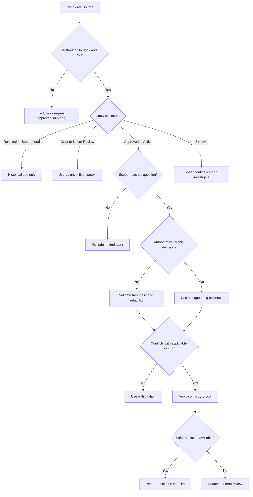

### 15.49 Decision Matrix for Human Review

| Conflict or gap                                       |              Risk | Continue?           | Required action                       |
| ----------------------------------------------------- | ----------------: | ------------------- | ------------------------------------- |
| Stale supporting document; migrations agree           |               Low | Yes                 | Record refresh action                 |
| Draft event schema not required by task               |               Low | Yes                 | Exclude from publication              |
| Published API conflicts with code                     |              High | Partially           | Owner decision before contract action |
| Security policy conflicts with requirement            |          Critical | No                  | Security and product review           |
| Missing business threshold but external owner decides |            Medium | Yes                 | Delegate decision and record gap      |
| Unknown data classification                           |              High | No                  | Data-governance decision              |
| Expired Steering Note                                 |            Medium | Yes after exclusion | Locate current direction              |
| Missing source owner                                  | Depends on source | Limited             | Assign custodian and lower confidence |

### 15.50 Decision Points Outcome

The purpose of these Decision Points is not to create bureaucracy around every file.

It is to prevent implicit, inconsistent, and unauthorised choices from shaping AI-assisted engineering.

A mature organisation should be able to explain:

* what qualifies as evidence;
* where its metadata lives;
* who owns it;
* how authority is scoped;
* how retrieval works;
* what conflicts require review;
* what agents may modify;
* how sensitive sources are protected;
* how conclusions are cited;
* how knowledge is refreshed;
* how autonomy changes with evidence quality.

When these decisions are explicit, Claude Code, GitHub Copilot, Codex, and future agents can operate within the same enterprise evidence model.

Chapter 11 status: In progress — next section: Exercises

## 16. Exercises

The exercises in this section are designed for architects, senior developers, engineering leads, platform engineers, security reviewers, and teams building AI-assisted development workflows.

The exercises should not be treated as simple documentation tasks.

Their purpose is to help teams practise:

* source discovery;
* source classification;
* authority assessment;
* conflict detection;
* source ranking;
* citation;
* access control;
* human escalation;
* harness integration;
* knowledge refresh.

Use the Alpha Car Detailing repository as the primary environment.

Where the required files do not yet exist, create representative sources consistent with the repository structure introduced in this chapter.

### Exercise 16.1 — Build a Knowledge Source Inventory

Create an inventory of Knowledge Sources for the Corporate Fleet Booking capability.

Include at least:

* two Architecture Decision Records;
* one product requirement;
* one API contract;
* one event schema;
* one database source;
* one runbook;
* one security source;
* one incident report;
* one test result;
* one pull request or review finding;
* one active Steering Note.

For each source, record:

* identifier;
* title;
* type;
* path or system;
* owner;
* status;
* authority;
* scope;
* classification;
* last review date;
* next review date;
* reliability;
* related sources.

Expected output:

```yaml
capability: CorporateFleetBooking

sources:
  - id:
    title:
    type:
    location:
    owner:
    status:
    authority:
    scope:
    classification:
    lastReviewedOn:
    nextReviewDue:
    reliability:
    relatedSources:
```

Review questions:

1. Which sources describe intended behaviour?
2. Which sources prove current implementation?
3. Which sources prove deployment or execution?
4. Which sources are historical?
5. Which sources lack owners?
6. Which sources are overdue for review?

### Exercise 16.2 — Classify Conflicting Architecture Sources

Create two ADRs:

```text
ADR-009 — Synchronous Recurring Booking
ADR-014 — Recurring Booking Scheduling
```

Set:

* ADR-009 to `Superseded`;
* ADR-014 to `Accepted`.

Write a source assessment that explains:

* why ADR-009 remains useful;
* why it must not govern the current implementation;
* how ADR-014 affects the current task;
* what evidence would prove whether ADR-014 has been implemented.

Your assessment must distinguish:

* architectural authority;
* historical value;
* implementation state;
* deployment state.

### Exercise 16.3 — Detect Documentation Drift

Compare the following Alpha Car Detailing sources:

* `database/booking/schema.md`;
* EF Core entity configurations;
* migration history;
* integration-test database setup.

Assume the database document includes:

```text
FleetSchedule
FleetScheduleExecution
```

but the migration history does not contain those tables.

Produce a drift report containing:

* documented state;
* implemented repository state;
* tested state;
* deployed state, if available;
* confidence;
* source owner;
* proposed refresh action.

Do not automatically update the database document.

Explain which owner should approve the correction.

### Exercise 16.4 — Create a Task Source Manifest

Create a source manifest for:

```text
ACD-FLEET-284 — Add Recurring Corporate Fleet Booking
```

The manifest must include:

* Prompt;
* assigned Role;
* applicable Instructions;
* active Steering Note;
* primary sources;
* supporting sources;
* historical sources;
* excluded sources;
* sensitive sources;
* conflicts;
* knowledge gaps;
* required tests;
* human approvals;
* protected paths.

Include at least one source that is excluded because it is superseded and one source that is included only as historical evidence.

### Exercise 16.5 — Rank Candidate Sources

Rank the following sources for the engineering question:

> How should retry-safe recurring booking occurrences be implemented?

Candidate sources:

1. accepted ADR requiring deterministic idempotency;
2. current worker source code;
3. stale database document;
4. closed duplicate-booking incident;
5. general background-processing guide;
6. draft event schema;
7. current release Steering Note;
8. published API contract;
9. old pull request discussing retry failure;
10. current integration-test result.

Score or classify each source using:

* authority;
* relevance;
* freshness;
* reliability;
* scope;
* lifecycle status.

Then classify each as:

* primary evidence;
* supporting evidence;
* historical evidence;
* unverified context;
* excluded.

Explain why semantic similarity alone would not produce a safe ranking.

### Exercise 16.6 — Resolve an API Contract Conflict

Assume:

* Booking API v2 contains `recurrencePattern`;
* the current Booking controller ignores the field;
* the API contract is marked `Published`;
* the implementation contains no recurring schedule use case.

Write a conflict report that includes:

* confirmed evidence;
* possible explanations;
* affected decisions;
* owner;
* work that may proceed;
* work that must stop;
* required human decision;
* final citation list.

Do not choose an explanation without evidence.

### Exercise 16.7 — Separate Evidence from Inference

For each statement below, classify it as:

* confirmed evidence;
* inference;
* assumption;
* unresolved question.

Statements:

1. Booking API v2 contains a recurrence field.
2. The API contract was published before implementation.
3. No recurring schedule migration exists in the current repository branch.
4. No recurring scheduling capability exists anywhere in the enterprise.
5. The existing worker should be reused for Release 3.8.
6. The existing worker is the permanent enterprise scheduling platform.
7. Corporate Accounts owns approval decisions.
8. The monthly approval threshold is £25,000.
9. Retry after partial completion caused duplicate bookings in production.
10. The current implementation fully resolves the incident.

Rewrite every inference and assumption so that uncertainty is visible.

### Exercise 16.8 — Design a Knowledge Gap Record

Create a knowledge-gap record for:

> The corporate fleet approval threshold is not defined in an approved source.

Include:

* gap identifier;
* severity;
* task;
* missing information;
* sources checked;
* conflicting sources;
* blocked decisions;
* safe temporary direction;
* probable owners;
* required reviewers;
* resolution criteria;
* expiry or follow-up date.

Explain why the gap should not necessarily block the Booking-service implementation.

### Exercise 16.9 — Design a Safe Approval Boundary

Assume a draft source contains:

```text
Monthly corporate approval limit: £25,000
```

An active security source states:

```text
Corporate Accounts owns approval decisions.
```

Design an application interface that:

* sends required information to Corporate Accounts;
* does not embed the threshold in Booking;
* records the returned decision;
* remains compatible with future policy changes.

Provide:

* interface;
* request model;
* response model;
* error-handling expectations;
* test scenarios;
* supporting source citations.

### Exercise 16.10 — Create an Idempotency Evidence Chain

Build an evidence chain from incident to validation.

Use:

```text
INC-2026-031
  ↓
ADR-014
  ↓
Implementation decision
  ↓
Database constraint
  ↓
Integration test
  ↓
Test execution
```

For each step, record:

* source;
* claim;
* relationship;
* owner;
* status;
* evidence location.

The final output should prove why deterministic idempotency is required and how the implementation was validated.

### Exercise 16.11 — Design a Source-Aware Pull Request Template

Create a pull request template containing:

* task;
* summary;
* Knowledge Sources used;
* excluded sources;
* conflicts;
* knowledge gaps;
* human decisions;
* validation evidence;
* sensitive-source handling;
* source-refresh actions;
* required owners.

Include checklist items that prevent:

* using draft policy as approved;
* changing protected sources;
* reporting unexecuted tests;
* hiding conflicting evidence.

### Exercise 16.12 — Review an Unsafe Agent Output

Assume an AI agent produces the following implementation summary:

```markdown
Implemented recurring fleet booking.

The monthly approval limit is £25,000.

Recurring bookings are created synchronously because ADR-009 defines that
approach.

The database schema already contains FleetSchedule and FleetScheduleExecution.

All retry tests pass.

Updated ADR-014 and the corporate approval policy to match the implementation.
```

Identify every source-governance failure.

Your review should address:

* superseded architecture;
* unapproved business policy;
* stale database documentation;
* unsupported validation claim;
* silent modification of authoritative sources;
* missing citations;
* missing human approval;
* conflict suppression;
* confidence.

Rewrite the summary as a safe evidence-based report.

### Exercise 16.13 — Create a Retrieval Query

Write a structured retrieval query for the recurring fleet-booking task.

It should request:

* accepted architecture decisions;
* approved requirements;
* published API contracts;
* active security sources;
* current migrations;
* current implementation;
* active Steering Notes;
* historical duplicate-processing evidence;
* current test results.

It should exclude or downgrade:

* rejected sources;
* superseded sources;
* expired Steering Notes;
* draft contracts;
* unrelated services.

Example structure:

```yaml
task:
  capability:
  operation:

services:

requiredSourceTypes:

filters:

ranking:

access:

historicalEvidence:

exclusions:
```

### Exercise 16.14 — Design Role-Based Retrieval

Define different source packages for:

* Lead Agent;
* Developer Agent;
* Reviewer Agent;
* Validator Agent;
* Architect Agent;
* Security Reviewer.

For each Role, specify:

* required source types;
* optional source types;
* sensitive-source access;
* permitted modifications;
* required output;
* escalation conditions.

Explain why every Role should not receive the same context.

### Exercise 16.15 — Design a Sensitive Incident Summary

Create a sanitised summary of a confidential duplicate-booking incident.

The summary may include:

* technical root cause;
* failure sequence;
* relevant corrective actions;
* testing implications.

It must exclude:

* customer names;
* corporate account identifiers;
* vehicle registrations;
* internal escalation contacts;
* production credentials;
* unnecessary infrastructure details.

Preserve:

* incident identifier;
* classification;
* permitted use;
* source owner;
* access restrictions.

### Exercise 16.16 — Protect Knowledge Sources Technically

Design repository controls for:

```text
architecture/decisions/**
security/**
contracts/openapi/**
incidents/**
requirements/**
.ai/knowledge/catalogue.yaml
```

Specify:

* read permissions;
* write permissions;
* required reviewers;
* branch protection;
* CODEOWNERS;
* audit requirements;
* agent modification restrictions.

Explain why written Instructions alone are insufficient.

### Exercise 16.17 — Validate Citations

Review the following claims:

1. “Recurring bookings must be asynchronous.”
2. “Booking API v2 is backward compatible.”
3. “The duplicate-retry scenario passes.”
4. “The current database contains a FleetSchedule table.”
5. “Corporate Accounts owns approval.”
6. “No new scheduling platform was introduced.”

For each claim, identify the evidence needed.

Your answer should distinguish between:

* architecture source;
* contract source;
* test execution;
* deployed schema;
* security source;
* infrastructure diff.

### Exercise 16.18 — Design a Knowledge Source CI Gate

Create a pipeline design that checks:

* missing source identifiers;
* missing owners;
* missing statuses;
* expired sources;
* overdue reviews;
* references to superseded ADRs;
* API contract drift;
* database documentation drift;
* protected-source changes;
* missing required reviewers;
* unresolved high-severity knowledge gaps.

Classify each check as:

* warning;
* pull request blocker;
* release blocker.

Explain why the severity may differ by source type.

### Exercise 16.19 — Create a Source Refresh Plan

After implementing recurring fleet booking, create a refresh plan for:

* database documentation;
* runbook;
* event schema;
* approval policy;
* source catalogue;
* knowledge-gap record;
* test evidence.

For each item, specify:

* current status;
* proposed change;
* owner;
* reviewer;
* approval required;
* blocking or non-blocking;
* target completion event.

### Exercise 16.20 — Design a Knowledge Health Dashboard

Design a dashboard for Alpha Car Detailing Knowledge Sources.

Include metrics such as:

* critical sources with owners;
* current sources;
* overdue sources;
* expired Steering Notes;
* unresolved conflicts;
* open knowledge gaps;
* published contract drift;
* runbook validation status;
* protected-source approval compliance;
* source citation coverage.

Create a sample capability-level status:

```text
Corporate Fleet Booking Knowledge Health: Amber
```

Explain why the status is Amber rather than Green or Red.

### Exercise 16.21 — Create Golden Retrieval Tests

Define a golden retrieval test for the recurring fleet-booking task.

Expected behaviour:

```yaml
mustRetrieve:
  - ADR-014
  - REQ-FLEET-002
  - API-BOOKING-V2
  - SEC-CORP-007
  - INC-2026-031
  - Release-3.8-Steering

mustClassifyAsHistorical:
  - ADR-009

mustWarn:
  - DB-BOOKING-SCHEMA

mustDetectConflict:
  - API contract versus implementation

mustNotExpose:
  - customer identifiers from INC-2026-031
```

Add test cases for:

* an expired Steering Note;
* an inaccessible security source;
* a newly accepted ADR;
* a stale source catalogue;
* a missing owner.

### Exercise 16.22 — Compare Platform Implementations

Create equivalent Knowledge Source workflows for:

* Claude Code;
* GitHub Copilot;
* OpenAI Codex.

For each platform, identify:

* persistent instruction file;
* reusable discovery procedure;
* task Prompt;
* context selection method;
* source manifest use;
* protected-file controls;
* review workflow;
* validation workflow.

Then identify which assets remain vendor-neutral.

Expected vendor-neutral assets include:

* Knowledge Sources;
* source catalogue;
* authority model;
* task manifest;
* knowledge gaps;
* human decision records;
* source refresh status.

### Exercise 16.23 — Design an External Connector

Design a controlled connector between an AI harness and an incident-management system.

Include:

* authentication;
* permitted Roles;
* metadata discovery;
* sanitised summary access;
* full-content approval;
* audit logging;
* retention;
* citation;
* error handling.

Explain what the agent should report when:

* access is denied;
* the incident does not exist;
* the incident exists but is outside task scope;
* only a summary is available.

### Exercise 16.24 — Model a Knowledge Graph

Create a graph for:

* REQ-FLEET-002;
* ADR-014;
* API-BOOKING-V2;
* INC-2026-031;
* recurring-booking implementation;
* migration;
* integration test;
* deployment record;
* runbook.

Use relationships such as:

* `motivates`;
* `implements`;
* `constrains`;
* `validates`;
* `deploys`;
* `operates`;
* `supersedes`.

Write at least five useful queries the graph should answer.

Examples:

* Which tests validate the corrective action from INC-2026-031?
* Which active sources depend on ADR-014?
* Which requirements lack implementation evidence?
* Which deployed components lack validated runbooks?
* Which sources still reference ADR-009?

### Exercise 16.25 — Evaluate Agent Autonomy

Classify each task using the autonomy matrix.

#### Scenario A

Update a code comment using current source code.

#### Scenario B

Add a test for a clearly defined validation rule.

#### Scenario C

Change the published Booking API contract.

#### Scenario D

Refactor worker internals while preserving behaviour.

#### Scenario E

Introduce a new scheduling platform despite an active Steering Note.

#### Scenario F

Generate proposed database documentation from an approved migration.

For each scenario, decide whether the agent may:

* implement directly;
* implement and open a pull request;
* draft only;
* stop and escalate.

Explain how source confidence and change risk affect the decision.

### Exercise 16.26 — Handle Mid-Task Evidence Drift

Assume that while the Developer Agent is implementing ACD-FLEET-284:

* ADR-014 is updated;
* the Release 3.8 Steering Note expires;
* a new API contract is published;
* an additional incident is recorded.

Design a harness response that:

* detects source-version changes;
* compares old and new evidence;
* identifies affected implementation decisions;
* pauses only where necessary;
* re-runs review;
* updates the task manifest;
* preserves the original evidence record.

### Exercise 16.27 — Design a Human Decision Record

Create a human decision record for:

> Booking API v2 recurrence fields are intentional and must be implemented without modifying the contract.

Include:

* identifier;
* question;
* evidence reviewed;
* decision;
* approver;
* authority;
* date;
* scope;
* expiry;
* affected sources;
* affected implementation;
* required follow-up;
* audit reference.

### Exercise 16.28 — Review Source Scope

Assume the catalogue contains a pricing policy with:

```yaml
amount: 25000
currency: GBP
customerType: Corporate
region: UnitedKingdom
```

Identify what additional scope is required before the policy can be implemented.

Consider:

* period;
* effective date;
* contract type;
* service types;
* exceptions;
* approval owner;
* policy status.

Explain what could go wrong if an agent applies the value globally.

### Exercise 16.29 — Distinguish Missing Evidence from Negative Evidence

For each statement, rewrite it safely.

Unsafe statement:

> No scheduling worker exists.

Available evidence:

> No scheduling worker was found in the Booking repository.

Unsafe statement:

> The database has no schedule table.

Available evidence:

> No schedule-table migration exists in the current branch.

Unsafe statement:

> No incident has occurred.

Available evidence:

> No applicable incident was found in the accessible repository scope.

Your rewritten statements should include:

* searched scope;
* access limitations;
* confidence;
* next search location.

### Exercise 16.30 — Create a Definition of Done

Create a Knowledge Source-aware Definition of Done for high-risk AI-assisted work.

Include:

* discovery;
* source manifest;
* authority classification;
* conflict resolution;
* knowledge gaps;
* human decisions;
* citations;
* implementation;
* review;
* validation;
* security handling;
* source refresh;
* final confidence.

The Definition of Done should be suitable for inclusion in the Alpha Car Detailing contribution guidelines.

### Exercise 16.31 — Architecture Workshop

Run a team workshop using the recurring fleet-booking scenario.

Assign participants to:

* Lead Agent;
* Developer Agent;
* Reviewer Agent;
* Validator Agent;
* Architect;
* Security Reviewer;
* Product Owner;
* Platform Operations.

Provide each participant with different source access.

For example:

* Developer sees code and requirements.
* Security Reviewer sees security guidance and a sanitised incident.
* Product Owner sees requirements and approval policy.
* Architect sees ADRs and service boundaries.
* Platform Operations sees deployment and runbooks.

Ask the team to produce one implementation decision.

Observe:

* where source conflicts appear;
* whether participants confuse scope;
* whether unavailable evidence is mistaken for absent evidence;
* whether ownership is clear;
* how the final decision is recorded.

### Exercise 16.32 — Source Governance Retrospective

After completing the exercises, answer:

1. Which sources were hardest to classify?
2. Which sources lacked clear owners?
3. Which conflicts were caused by stale content?
4. Which conflicts were caused by different scopes?
5. Which decisions required human authority?
6. Which sources should be generated automatically?
7. Which sources require stronger access controls?
8. Which repeated gaps suggest a new ADR, Skill, or Instruction?
9. Which platform-specific assets can be removed in favour of vendor-neutral sources?
10. What changes should be added to the repository Definition of Done?

### Exercise 16.33 — Advanced Challenge: Build a Source-Aware Harness Stage

Create a harness stage called:

```text
validate-knowledge.ps1
```

or an equivalent implementation in another language.

The stage should:

1. read the task Prompt;
2. read the assigned Role;
3. read the active Steering Note;
4. parse the source catalogue;
5. validate source metadata;
6. retrieve candidate sources;
7. classify sources;
8. detect expired or superseded material;
9. identify conflicts;
10. create a task source manifest;
11. detect protected-source changes;
12. determine whether human review is required;
13. produce a machine-readable report;
14. fail safely when required evidence is unavailable.

Suggested output:

```json
{
  "taskId": "ACD-FLEET-284",
  "status": "HumanReviewRequired",
  "confidence": "Medium",
  "primarySources": [],
  "supportingSources": [],
  "historicalSources": [],
  "excludedSources": [],
  "conflicts": [],
  "knowledgeGaps": [],
  "protectedSources": [],
  "requiredApprovals": []
}
```

The stage should not attempt to resolve business, security, or architecture conflicts by itself.

### Exercise 16.34 — Advanced Challenge: Build a Citation Evaluator

Design an Evaluator Agent that checks whether:

* every architecture claim cites an accepted ADR or equivalent evidence;
* every business claim cites an approved source;
* every contract claim cites a published version;
* every test claim cites execution evidence;
* every deployment claim cites an environment record;
* every human decision cites an approval record;
* citations support the actual claim;
* superseded sources are not used as current authority.

The evaluator should produce:

* passed citation checks;
* missing citations;
* misleading citations;
* unsupported claims;
* confidence;
* required corrections.

### Exercise 16.35 — Advanced Challenge: Design Knowledge Refresh Automation

Design a refresh service that responds to:

* new migrations;
* API contract changes;
* accepted ADRs;
* incidents;
* release completion;
* service ownership changes;
* expired Steering Notes.

For each event, define:

* affected source types;
* owner notification;
* validation process;
* proposed updates;
* approval path;
* catalogue changes;
* audit records.

The automation may recommend or draft source updates.

It must not approve authoritative changes.

### 16.36 Exercise Completion Criteria

The exercises are complete when the participant can demonstrate that they can:

* identify relevant Knowledge Sources;
* distinguish source types and lifecycle states;
* assess authority within scope;
* separate current and intended state;
* distinguish evidence from inference;
* detect stale and conflicting sources;
* preserve historical evidence correctly;
* record missing knowledge;
* apply safe defaults without inventing policy;
* protect sensitive sources;
* produce task-specific source manifests;
* cite engineering decisions;
* require execution evidence for validation;
* route decisions to correct owners;
* prevent silent source modification;
* integrate source governance into an AI harness;
* preserve vendor-neutral principles across AI platforms.

Chapter 11 status: In progress — next section: Interview Questions

## 17. Interview Questions

The following interview questions are designed for senior developers, software architects, engineering managers, platform engineers, AI engineering leads, security reviewers, and technical leaders.

They assess whether a candidate understands Knowledge Sources as governed evidence rather than as a collection of searchable documents.

Strong answers should demonstrate awareness of:

* source authority;
* ownership;
* lifecycle status;
* freshness;
* reliability;
* scope;
* provenance;
* conflict resolution;
* access control;
* citations;
* human review;
* AI harness integration;
* vendor-neutral implementation.

### 17.1 Foundational Questions

#### Question 1

What is a Knowledge Source in Enterprise AI Engineering?

**Expected Answer**

A Knowledge Source is a controlled reference that provides evidence or context about a system, business domain, architectural decision, operating environment, historical event, security control, or organisational constraint.

Examples include:

* source code;
* Architecture Decision Records;
* product requirements;
* API contracts;
* event schemas;
* database migrations;
* runbooks;
* incident reports;
* security guidance;
* deployment records;
* test results;
* pull requests and review findings.

A Knowledge Source helps an AI agent determine what evidence supports a decision. It does not automatically define persistent agent behaviour.

#### Question 2

How do Knowledge Sources differ from Instructions?

**Expected Answer**

Instructions define persistent standards and constraints that guide agent behaviour.

Knowledge Sources provide evidence and context used to reason about a task.

For example:

* an Instruction may require backward-compatible API changes;
* an OpenAPI specification is the Knowledge Source that defines the current contract.

Instructions are prescriptive.

Knowledge Sources are evidentiary.

#### Question 3

How do Knowledge Sources differ from Prompts?

**Expected Answer**

A Prompt defines the current task, expected outcome, scope, and acceptance criteria.

Knowledge Sources provide the detailed evidence needed to complete the task.

A Prompt might ask an agent to add recurring fleet booking.

Relevant Knowledge Sources might include:

* product requirements;
* ADRs;
* API contracts;
* current code;
* incident reports;
* security guidance.

#### Question 4

How do Knowledge Sources differ from Steering Notes?

**Expected Answer**

Steering Notes define temporary priorities, boundaries, risks, and constraints for a current initiative, sprint, release, or mission.

Knowledge Sources provide evidence that may have a longer lifecycle.

For example:

* an ADR may define the long-term scheduling architecture;
* a Steering Note may temporarily require reuse of an existing worker for one release.

The Steering Note does not necessarily supersede the ADR. It constrains the current delivery approach.

#### Question 5

How do Knowledge Sources differ from Skills?

**Expected Answer**

A Skill defines a reusable procedure.

Knowledge Sources provide the project-specific evidence consumed by that procedure.

For example, a `validate-api-compatibility` Skill explains how to compare contracts, while the actual OpenAPI documents and consumer records are Knowledge Sources.

#### Question 6

Why should Knowledge Sources not be copied into repository Instructions?

**Expected Answer**

Copying Knowledge Sources into Instructions:

* mixes behavioural rules with evidence;
* creates stale duplicated content;
* increases persistent context;
* hides source lifecycle and ownership;
* makes conflict detection difficult;
* causes platform-specific copies to drift.

Instructions should explain how to discover, assess, and use Knowledge Sources rather than reproduce all source content.

### 17.2 Source Authority Questions

#### Question 7

Is source code always the source of truth?

**Expected Answer**

No.

Source code is strong evidence of current repository implementation state.

It is not automatically authoritative for:

* business intent;
* security policy;
* published contracts;
* architecture approval;
* deployment state;
* production behaviour.

Current code may contain defects, workarounds, policy violations, or incomplete implementation.

#### Question 8

What does source authority mean?

**Expected Answer**

Source authority represents the degree to which a source is empowered to define or prove something within a specific scope.

Authority depends on the question.

Examples:

* an accepted ADR may be authoritative for architecture;
* a published API contract may be mandatory for client compatibility;
* migrations may be authoritative for repository-defined schema evolution;
* an incident report may be authoritative evidence that a failure occurred.

#### Question 9

Why must source authority include scope?

**Expected Answer**

A source may be authoritative for one decision but irrelevant to another.

For example:

* a security policy may be authoritative for approval ownership;
* it may not define business pricing;
* source code may be authoritative for current implementation;
* it may not define intended architecture.

“Authoritative” without scope creates false certainty.

#### Question 10

Should the newest source always win when sources conflict?

**Expected Answer**

No.

Recency is only one factor.

The newer source may be:

* a draft;
* a rejected proposal;
* a copied old document;
* outside the applicable scope.

Conflict resolution should consider:

* scope;
* version;
* lifecycle status;
* authority;
* freshness;
* reliability;
* independent evidence;
* ownership.

#### Question 11

How should an agent treat a superseded ADR?

**Expected Answer**

A superseded ADR should not govern current implementation.

It may still be used as historical evidence to explain:

* the previous design;
* why it changed;
* which risks were identified;
* what migration occurred.

The accepted replacement ADR should define current direction.

#### Question 12

Can an incident report be an authoritative source?

**Expected Answer**

It can be authoritative evidence that a historical event occurred and that certain root causes or effects were recorded.

It is not automatically current architecture guidance.

A current ADR, policy, requirement, or corrective-action source should establish how the lesson applies now.

### 17.3 Freshness and Reliability Questions

#### Question 13

Why is file modification time an unreliable freshness signal?

**Expected Answer**

A recently modified file may contain old content, formatting changes, copied material, or an unapproved proposal.

A stable source may remain accurate even if it has not changed recently.

Meaningful freshness signals include:

* approval date;
* effective date;
* last review date;
* validation date;
* source commit;
* release;
* expiry date;
* supersession date.

#### Question 14

What is the difference between freshness and reliability?

**Expected Answer**

Freshness describes how recently a source was created, reviewed, generated, or validated.

Reliability describes how likely the source is to accurately represent what it claims.

A recent source may be unreliable if it is unreviewed.

An older source may remain reliable if it describes a stable historical event or approved decision.

#### Question 15

When might a generated source be more reliable than a manual source?

**Expected Answer**

Examples include:

* an OpenAPI contract generated from the build;
* database documentation generated from migrations;
* a test report generated by CI/CD;
* a dependency graph generated from project references.

Generated sources improve reproducibility and reduce manual drift.

However, their inputs, generator version, source commit, and validation status must still be recorded.

#### Question 16

Should a stale source be deleted from retrieval?

**Expected Answer**

Not automatically.

A stale source may still contain useful or historically important information.

A better approach is to:

* downgrade its ranking;
* add a warning;
* validate it against current evidence;
* assign refresh work;
* exclude it only when it is explicitly expired, rejected, or superseded for the current question.

### 17.4 Source Scope Questions

#### Question 17

What types of scope should a Knowledge Source define?

**Expected Answer**

Scope may include:

* service;
* bounded context;
* business capability;
* environment;
* API version;
* event version;
* customer type;
* geography;
* release;
* branch;
* database;
* time period;
* regulatory jurisdiction.

#### Question 18

Why is geographic scope important?

**Expected Answer**

Policies may vary by country or region.

For example, a £25,000 approval policy may apply only to:

* corporate customers;
* United Kingdom operations;
* a specific contract type;
* a specific effective period.

Applying it globally could produce incorrect business and compliance behaviour.

#### Question 19

How should an agent interpret a source that applies only to integration?

**Expected Answer**

It should not use the source as proof of production state.

The agent should clearly state the environment scope and retrieve production evidence if the decision concerns production.

### 17.5 Discovery and Retrieval Questions

#### Question 20

What is the difference between source discovery and source retrieval?

**Expected Answer**

Source discovery identifies potentially relevant sources.

Source retrieval selects the specific content provided to the agent for a task.

Discovery may be broad.

Retrieval should be:

* task-aware;
* scope-aware;
* access-controlled;
* relevance-ranked;
* citation-preserving.

#### Question 21

Why is semantic similarity insufficient for source ranking?

**Expected Answer**

A semantically similar source may be:

* rejected;
* superseded;
* stale;
* outside scope;
* unverified.

Ranking must also consider:

* authority;
* lifecycle status;
* freshness;
* reliability;
* scope;
* access eligibility;
* provenance.

#### Question 22

What is the smallest sufficient evidence set?

**Expected Answer**

It is the minimum set of relevant, authorised, and sufficiently strong sources required to make a safe decision.

The agent should begin with focused evidence and expand retrieval when:

* conflicts appear;
* dependencies are discovered;
* confidence remains low;
* reviewers find omissions.

#### Question 23

What is a task source manifest?

**Expected Answer**

A task source manifest records the evidence context selected for one task.

It may include:

* Prompt;
* Role;
* Instructions;
* Steering Note;
* primary sources;
* supporting sources;
* historical sources;
* excluded sources;
* conflicts;
* knowledge gaps;
* human decisions;
* validation requirements;
* protected paths.

It creates a visible and auditable evidence boundary.

#### Question 24

Should a Reviewer Agent be limited to the Developer Agent’s manifest?

**Expected Answer**

No.

The manifest should be the baseline, but reviewers should be able to perform independent discovery.

This helps identify:

* omitted sources;
* contrary evidence;
* classification errors;
* new evidence introduced during implementation.

### 17.6 Conflict Questions

#### Question 25

How should an AI agent handle conflicting Knowledge Sources?

**Expected Answer**

It should:

1. preserve both sources;
2. compare scope;
3. compare version;
4. compare lifecycle status;
5. compare authority;
6. compare freshness and reliability;
7. validate against independent evidence;
8. identify owners;
9. request human review if unresolved;
10. record the decision and update affected sources.

It must not silently choose the most convenient source.

#### Question 26

What kinds of source conflicts commonly occur?

**Expected Answer**

Examples include:

* code versus documentation;
* contract versus runtime;
* requirement versus security policy;
* ADR versus implementation;
* migration versus database document;
* Steering Note versus long-term target architecture;
* two environment configurations;
* two active requirements;
* old and new versions.

#### Question 27

What is the difference between a real conflict and a scope difference?

**Expected Answer**

Two sources may appear contradictory but apply to different:

* environments;
* versions;
* regions;
* customer types;
* releases;
* services.

A real conflict exists when applicable sources within the same scope support incompatible conclusions.

#### Question 28

Give an example of a conflict that should block implementation.

**Expected Answer**

A published API contract conflicts with the current implementation, and the task requires changing the interface.

Because the contract is mandatory and affects clients, the owner must clarify whether:

* the contract is intentional;
* the implementation is incomplete;
* the contract requires correction.

#### Question 29

Give an example of a conflict that may not need to block implementation.

**Expected Answer**

A stale database document differs from current migrations, but:

* migrations;
* entity configurations;
* integration-test schema;

all agree.

Implementation may continue using the stronger evidence, while documentation refresh is tracked as a follow-up.

### 17.7 Missing Knowledge Questions

#### Question 30

What is a knowledge gap?

**Expected Answer**

A knowledge gap is a documented difference between the information needed for a decision and the information currently available.

It should identify:

* the missing information;
* why it matters;
* the affected decision;
* sources already checked;
* probable owners;
* severity;
* safe temporary direction;
* resolution status.

#### Question 31

Should all knowledge gaps block delivery?

**Expected Answer**

No.

Gaps should be classified by impact.

A gap may be:

* blocking;
* conditionally non-blocking;
* documentation follow-up;
* informational.

For example, an unresolved approval threshold may not block Booking implementation if Booking delegates approval to the owning service.

#### Question 32

What is a safe default?

**Expected Answer**

A safe default is a temporary implementation direction that:

* preserves ownership;
* avoids irreversible change;
* does not invent policy;
* minimises risk;
* is explicitly documented.

Delegating approval to Corporate Accounts is safe.

Hard-coding an unapproved threshold is unsafe.

#### Question 33

What should an agent say when it cannot find a source?

**Expected Answer**

It should report:

* what scope was searched;
* what access was available;
* what was not found;
* why it matters;
* where it should search next;
* its confidence.

It should say:

> No applicable source was found in the accessible scope.

It should not claim:

> The source does not exist.

### 17.8 Citation Questions

#### Question 34

Why are source citations important in AI-assisted engineering?

**Expected Answer**

Citations make decisions:

* reviewable;
* reproducible;
* auditable;
* correctable;
* trustworthy.

They allow engineers to verify whether the source actually supports the claim.

#### Question 35

What should a useful citation include?

**Expected Answer**

Depending on source type:

* identifier;
* repository path;
* section;
* symbol;
* schema;
* API operation;
* version;
* commit;
* build;
* test run;
* environment;
* source status.

#### Question 36

Does the presence of a citation prove the claim?

**Expected Answer**

No.

A citation may be irrelevant, outdated, or outside scope.

Reviewers and evaluator agents should verify that the cited source supports the actual statement.

#### Question 37

How should test claims be cited?

**Expected Answer**

A test claim should identify:

* test name;
* commit;
* execution or pipeline;
* environment where relevant;
* result.

The existence of a test file is not proof that it passed.

#### Question 38

How should a deployment claim be cited?

**Expected Answer**

Use:

* deployment pipeline run;
* release record;
* environment;
* deployed version;
* health or readiness evidence.

A deployment workflow definition alone is insufficient.

### 17.9 Security and Access Questions

#### Question 39

Why must access control occur before source retrieval reaches the model?

**Expected Answer**

Once sensitive content enters model context, later filtering cannot undo the exposure.

The retrieval layer should enforce:

* user identity;
* agent Role;
* task scope;
* classification;
* need to know;
* environment;
* customer boundary.

#### Question 40

How should confidential incident reports be used by Developer Agents?

**Expected Answer**

Provide a sanitised technical summary containing only:

* failure sequence;
* root cause;
* relevant corrective actions;
* testing implications.

Exclude:

* customer identifiers;
* vehicle data;
* account information;
* credentials;
* unnecessary infrastructure detail.

Preserve the source identifier and classification.

#### Question 41

Should secrets be indexed as Knowledge Sources?

**Expected Answer**

No.

The catalogue may reference a managed secret location, but it must not contain:

* passwords;
* tokens;
* private keys;
* connection strings;
* certificate private material.

#### Question 42

What is the difference between access to source metadata and access to source content?

**Expected Answer**

An agent may be allowed to discover that a confidential incident exists without being allowed to read its full contents.

Permissions may include:

* discover;
* read metadata;
* read summary;
* read full content;
* cite;
* propose changes;
* modify;
* approve.

### 17.10 Governance Questions

#### Question 43

Who should own Knowledge Sources?

**Expected Answer**

Ownership should follow the underlying decision or evidence.

Examples:

* product owner for requirements;
* Architecture Council for ADRs;
* service team for implementation and database documentation;
* API owner for published contracts;
* Application Security for security guidance;
* Platform Operations for runbooks;
* service owner and reliability team for incident records.

#### Question 44

Why is `CODEOWNERS` not sufficient for Knowledge Source ownership?

**Expected Answer**

`CODEOWNERS` identifies repository review responsibility.

It may not identify:

* business decision ownership;
* security authority;
* policy authority;
* architecture approval;
* operational ownership.

The source catalogue should preserve these distinctions.

#### Question 45

Can an AI agent update a trusted Knowledge Source?

**Expected Answer**

It may draft or propose an update if authorised.

It should not:

* approve;
* publish;
* change ownership;
* change authority;
* alter lifecycle status;
* rewrite historical evidence;

without the correct human approval.

#### Question 46

Why must status metadata be protected?

**Expected Answer**

Changing a source from `Draft` to `Approved` can alter retrieval ranking and make unverified content appear authoritative.

Metadata changes can be as consequential as content changes.

#### Question 47

What should happen when an AI agent identifies stale documentation?

**Expected Answer**

It should:

* record the mismatch;
* identify stronger current evidence;
* assess implementation impact;
* propose an update;
* assign the source owner;
* preserve approval requirements.

It should not silently rewrite the source.

#### Question 48

How should human decisions be recorded?

**Expected Answer**

Use a durable decision record containing:

* identifier;
* question;
* evidence reviewed;
* decision;
* approver;
* date;
* scope;
* affected sources;
* follow-up work;
* expiry if temporary.

Chat or email should not remain the only record.

### 17.11 Architecture Questions

#### Question 49

Why are Knowledge Sources an architecture concern?

**Expected Answer**

They affect:

* service boundaries;
* contract decisions;
* security controls;
* operational readiness;
* agent autonomy;
* evidence flow;
* conflict handling;
* auditability;
* self-learning harness behaviour.

An agent’s engineering output is only as reliable as the evidence architecture supporting it.

#### Question 50

Why is repository intelligence a graph problem?

**Expected Answer**

Sources are connected through relationships such as:

* supersedes;
* implements;
* validates;
* motivates;
* constrains;
* deploys;
* operates;
* owns.

A graph can answer questions that a flat index cannot easily answer, such as:

* which tests validate an incident corrective action;
* which active sources depend on an ADR;
* which requirements lack implementation evidence.

#### Question 51

What is an evidence chain?

**Expected Answer**

An evidence chain links a risk or requirement through decision, implementation, validation, and operation.

Example:

```text
Incident
  ↓
Corrective requirement
  ↓
ADR
  ↓
Implementation
  ↓
Test
  ↓
Execution result
  ↓
Deployment
  ↓
Runbook
```

#### Question 52

How should architecture distinguish current, target, and transitional states?

**Expected Answer**

Architecture sources should explicitly label their state.

For example:

* current architecture;
* transitional Release 3.8 architecture;
* target Release 4.0 architecture.

Without this distinction, temporary delivery constraints may be mistaken for permanent design.

#### Question 53

How should source confidence affect AI autonomy?

**Expected Answer**

High source confidence and low-risk changes may permit controlled implementation.

Low confidence or high-risk changes should reduce autonomy.

A common model is:

| Source confidence | Change risk | Agent action                   |
| ----------------- | ----------- | ------------------------------ |
| High              | Low         | Implement and open PR          |
| High              | High        | Propose and request approval   |
| Medium            | Low         | Implement with explicit review |
| Medium            | High        | Draft only                     |
| Low               | High        | Stop and escalate              |

### 17.12 Harness Questions

#### Question 54

How should an AI harness use Knowledge Sources?

**Expected Answer**

The harness should:

1. receive the Prompt;
2. load Instructions;
3. load the assigned Role;
4. load the active Steering Note;
5. discover relevant sources;
6. enforce access;
7. classify and rank sources;
8. detect conflicts;
9. create a source manifest;
10. provide controlled context;
11. require citations;
12. validate claims;
13. record gaps and human decisions;
14. propose refresh actions.

#### Question 55

Why should source discovery be separated from implementation?

**Expected Answer**

Separation reduces confirmation bias.

A Developer Agent may otherwise select sources that support its preferred implementation.

A dedicated Discovery or Lead role can establish the evidence baseline before coding begins.

#### Question 56

Why should reviewers perform independent retrieval?

**Expected Answer**

To detect:

* omitted contrary sources;
* stale manifest entries;
* status changes;
* new evidence;
* classification mistakes.

Shared context improves consistency but can create shared blind spots.

#### Question 57

What should the harness record for auditability?

**Expected Answer**

It should record:

* Prompt;
* Instructions;
* Role;
* Steering Note;
* source manifest;
* source versions;
* conflicts;
* gaps;
* human decisions;
* implementation commit;
* review findings;
* test results;
* deployment evidence;
* final evaluation;
* source-refresh recommendations.

#### Question 58

How should the harness behave when a required source is inaccessible?

**Expected Answer**

It should:

* report access denial;
* distinguish it from missing knowledge;
* lower confidence;
* request an approved summary or specialist Role;
* avoid irreversible decisions;
* record the access event where required.

#### Question 59

Can a self-learning harness automatically promote repeated patterns into Instructions?

**Expected Answer**

No.

It may identify patterns and propose:

* a new Instruction;
* a Skill update;
* an ADR;
* catalogue improvement.

Human approval remains mandatory.

#### Question 60

Why must learned knowledge include provenance?

**Expected Answer**

Without provenance, a learned recommendation becomes an uncited assumption.

The harness should record:

* contributing tasks;
* pull requests;
* test outcomes;
* review findings;
* scope;
* confidence;
* owner;
* approval state.

### 17.13 Platform Comparison Questions

#### Question 61

How does Claude Code typically consume Knowledge Sources?

**Expected Answer**

Claude Code commonly works as a repository-level agent that can inspect files, execute commands, follow Skills, and perform multi-step workflows.

It can use:

* `CLAUDE.md`;
* repository Instructions;
* Skills;
* Prompts;
* Roles;
* Steering Notes;
* source catalogues;
* task manifests.

Its broad repository access creates strong discovery capability but also risks excessive retrieval or overly broad modification.

#### Question 62

How does GitHub Copilot typically consume Knowledge Sources?

**Expected Answer**

GitHub Copilot commonly works through:

* IDE chat;
* agent mode;
* inline completion;
* repository instructions;
* path-specific instructions;
* prompt files;
* pull request workflows;
* selected workspace context.

Its key risk is missing important evidence outside the active workspace or selected files.

#### Question 63

How does Codex typically consume Knowledge Sources?

**Expected Answer**

Codex may operate through:

* command-line workflows;
* coding environments;
* APIs;
* external harnesses.

It commonly uses:

* `AGENTS.md`;
* vendor-neutral Instructions;
* source manifests;
* controlled context packages;
* path-level permissions;
* external orchestration.

Its key risks include poorly governed context packaging and excessive tool permissions.

#### Question 64

Which Knowledge Source assets should remain vendor-neutral?

**Expected Answer**

The following should remain vendor-neutral:

* source content;
* source catalogue;
* authority model;
* ownership;
* lifecycle status;
* scope;
* knowledge gaps;
* task source manifests;
* human decision records;
* validation evidence;
* refresh status.

Only invocation and platform-specific Instructions should differ.

### 17.14 Alpha Car Detailing Scenario Questions

#### Question 65

An agent finds that ADR-009 requires synchronous processing, while ADR-014 requires asynchronous processing. What should it do?

**Expected Answer**

Inspect lifecycle status.

If ADR-009 is superseded and ADR-014 is accepted:

* use ADR-014 for current architecture;
* preserve ADR-009 as historical context;
* do not merge the two designs;
* cite the supersession relationship.

#### Question 66

The Booking API contract contains recurrence fields, but the service ignores them. What is the correct response?

**Expected Answer**

Record a contract-versus-implementation conflict.

Possible explanations should be treated as inferences.

The agent should identify the API owner and request confirmation before changing the published contract.

Internal persistence and retry-safe design may proceed if independently supported.

#### Question 67

A draft corporate policy contains a £25,000 threshold. Should the Booking service use it?

**Expected Answer**

No.

The policy is unverified.

If active security guidance states that Corporate Accounts owns approval, Booking should delegate the decision and avoid embedding the threshold.

The gap should be recorded.

#### Question 68

The database document describes schedule tables, but migrations do not. Which source should the agent trust?

**Expected Answer**

For repository-defined schema state, migrations are stronger evidence.

Entity configurations and integration-test schema should be used for corroboration.

The manual database document should be classified as stale, premature, or proposed until refreshed.

#### Question 69

Why is INC-2026-031 relevant even though it is historical?

**Expected Answer**

It records the exact retry failure mode:

* booking created;
* worker completion not recorded;
* retry created a duplicate.

It provides strong risk evidence and supports:

* deterministic idempotency;
* database uniqueness;
* partial-completion retry tests.

#### Question 70

The current Steering Note prohibits a new scheduler. Does that mean the organisation should never introduce one?

**Expected Answer**

No.

The Steering Note is temporary mission direction.

It applies to Release 3.8 and should have an expiry or review condition.

Long-term architecture should be defined through an ADR or equivalent decision source.

#### Question 71

What evidence proves that duplicate processing has been fixed?

**Expected Answer**

A complete evidence chain should include:

* incident root cause;
* accepted idempotency requirement;
* deterministic implementation;
* database uniqueness;
* test reproducing partial completion;
* passing test execution tied to the commit;
* deployment validation;
* operational telemetry where applicable.

#### Question 72

Should the AI agent update ADR-014 after implementation?

**Expected Answer**

Only if the task explicitly authorises a proposed update and the Architecture Council reviews it.

The agent must not rewrite the ADR merely to make the implementation appear compliant.

### 17.15 Advanced Scenario Questions

#### Question 73

A published API contract, production telemetry, and repository code all disagree. How would you investigate?

**Expected Answer**

Separate the questions:

* what contract is published;
* what code exists in the repository;
* what version is deployed;
* what behaviour telemetry records.

Then inspect:

* contract version and publication evidence;
* repository commit;
* deployment version;
* feature flags;
* environment;
* telemetry query scope;
* release history.

Do not force one source to answer all questions.

#### Question 74

An agent retrieves an approved architecture summary but cannot access the original ADR. Can it proceed?

**Expected Answer**

It depends on risk.

For low-risk work, it may proceed with reduced confidence if the summary is approved, current, and sufficient.

For high-impact architecture decisions, it should request original access or human review.

The access limitation must be reported.

#### Question 75

A Knowledge Source has no owner but appears current and useful. How should it be handled?

**Expected Answer**

The agent should:

* lower confidence;
* create an ownership gap;
* identify a temporary custodian;
* avoid unauthorised modifications;
* validate against independent evidence;
* route ownership resolution.

#### Question 76

A Reviewer Agent discovers a newer accepted ADR after implementation is complete. What should happen?

**Expected Answer**

The source manifest should be revalidated.

The reviewer should:

* compare the old and new decisions;
* identify affected implementation;
* pause merge where necessary;
* update the manifest;
* rerun relevant review and validation;
* preserve the original evidence record.

#### Question 77

How would you prevent an AI agent from marking a draft source as approved?

**Expected Answer**

Use both procedural and technical controls:

* Instructions;
* Role-based authority;
* protected metadata;
* CODEOWNERS;
* required reviewers;
* branch protection;
* policy validation;
* audit logs.

#### Question 78

How would you test a Knowledge Source retrieval system?

**Expected Answer**

Use golden evidence sets.

For a known task, define:

* sources that must be retrieved;
* sources that must be historical;
* sources that must trigger warnings;
* conflicts that must be detected;
* sensitive details that must not be exposed.

Then evaluate:

* recall;
* classification;
* ranking;
* access enforcement;
* conflict detection;
* citation quality.

#### Question 79

How would you measure Knowledge Source maturity?

**Expected Answer**

Useful measures include:

* critical sources with owners;
* lifecycle-status coverage;
* review compliance;
* citation coverage;
* unresolved conflict count;
* knowledge-gap age;
* contract drift;
* source-refresh completion;
* protected-source approval compliance;
* repeated source failure rate.

Document count is not a reliable maturity measure.

#### Question 80

What is knowledge debt?

**Expected Answer**

Knowledge debt is the accumulated risk caused by:

* stale ADRs;
* outdated diagrams;
* missing ownership;
* undocumented boundaries;
* contract drift;
* unvalidated runbooks;
* unresolved gaps;
* unlinked test evidence.

It increases review cost, onboarding time, architecture drift, and AI error rates.

### 17.16 Design Questions

#### Question 81

Design a metadata schema for enterprise Knowledge Sources.

**Expected Answer**

A strong schema includes:

```yaml
id:
title:
type:
location:
status:
authority:
owner:
classification:
scope:
freshness:
reliability:
provenance:
supersedes:
supersededBy:
relatedSources:
retrievalWarnings:
```

The candidate should explain why authority, status, freshness, and reliability are separate fields.

#### Question 82

Design a source-conflict resolution workflow.

**Expected Answer**

A strong workflow includes:

```text
Detect conflict
  ↓
Compare scope
  ↓
Compare version
  ↓
Compare lifecycle status
  ↓
Compare authority
  ↓
Validate independently
  ↓
Identify owners
  ↓
Human resolution
  ↓
Record decision
  ↓
Refresh affected sources
```

#### Question 83

Design a source-aware AI harness stage.

**Expected Answer**

The stage should:

* load task context;
* identify applicable Instructions and Steering Notes;
* query the source catalogue;
* enforce access;
* rank evidence;
* detect conflicts;
* create a manifest;
* identify gaps;
* determine review requirements;
* generate machine-readable output;
* fail safely when required evidence is unavailable.

#### Question 84

Design role-based access for Developer and Security Reviewer Agents.

**Expected Answer**

The Developer Agent may receive:

* implementation sources;
* approved requirements;
* sanitised security guidance;
* sanitised incident evidence.

The Security Reviewer may receive:

* full approved security policies;
* threat models;
* vulnerability findings where authorised;
* implementation;
* deployment configuration.

Write permissions should also differ.

#### Question 85

Design a knowledge refresh process after a production incident.

**Expected Answer**

The process should:

1. record the incident;
2. approve the post-incident review;
3. update or create ADRs;
4. add regression tests;
5. update runbooks;
6. update monitoring;
7. link corrective actions;
8. refresh source metadata;
9. validate retrieval;
10. preserve human approval.

### 17.17 Leadership Questions

#### Question 86

Why should engineering leadership invest in Knowledge Source governance?

**Expected Answer**

Because AI agents amplify both good and bad information.

Governed sources reduce:

* architecture drift;
* repeated incidents;
* contract errors;
* security violations;
* review effort;
* unsupported assumptions;
* dependency on individual memory.

They also improve:

* auditability;
* onboarding;
* delivery consistency;
* agent autonomy;
* cross-team coordination.

#### Question 87

How would you introduce Knowledge Source governance without creating excessive bureaucracy?

**Expected Answer**

Start with high-risk sources.

Use:

* minimum metadata;
* existing owners;
* automation;
* generated evidence;
* risk-based review;
* capability-based catalogues;
* focused release gates.

Do not catalogue every low-value document initially.

#### Question 88

What should be centralised and what should remain with domain teams?

**Expected Answer**

Central teams should define:

* metadata standards;
* lifecycle vocabulary;
* authority model;
* access controls;
* citation expectations;
* audit requirements.

Domain teams should maintain source accuracy and approve decisions within their authority.

#### Question 89

How should source quality affect autonomous AI adoption?

**Expected Answer**

Autonomy should increase only when:

* sources are current;
* ownership is clear;
* authoritative evidence agrees;
* tests are strong;
* changes are reversible;
* governance controls are enforced.

Poor source quality should reduce autonomy.

#### Question 90

What is the greatest organisational risk of ungoverned Knowledge Sources?

**Expected Answer**

The greatest risk is not merely that an agent retrieves incorrect information.

It is that the agent converts uncertain or unauthorised information into confident code, contracts, documentation, and deployment changes faster than human review can detect the evidence failure.

### 17.18 Practical Whiteboard Scenario

Provide the candidate with the following Alpha Car Detailing sources:

| Source                             | Status                                   |
| ---------------------------------- | ---------------------------------------- |
| ADR-009 synchronous scheduling     | Superseded                               |
| ADR-014 asynchronous scheduling    | Accepted                                 |
| Booking API v2 recurrence contract | Published                                |
| Current Booking code               | No recurrence support                    |
| Database document                  | Contains schedule tables                 |
| Migrations                         | No schedule tables                       |
| Approval policy with £25,000       | Under Review                             |
| Security guidance                  | Active; Corporate Accounts owns approval |
| Release Steering Note              | Active; reuse current worker             |
| Duplicate-booking incident         | Closed                                   |
| Event schema                       | Draft                                    |

Ask the candidate to explain:

1. which sources are primary;
2. which are supporting;
3. which are historical;
4. which are excluded;
5. what conflicts exist;
6. what work may begin;
7. what must wait;
8. what human decisions are required;
9. what tests are necessary;
10. what sources need refresh.

A strong candidate should conclude:

* ADR-014 governs current architecture;
* ADR-009 is historical;
* API contract conflict requires owner confirmation;
* migrations outweigh stale schema documentation for repository state;
* £25,000 must not be embedded;
* Corporate Accounts retains approval ownership;
* the existing worker should be reused for Release 3.8;
* the incident requires deterministic idempotency and duplicate-retry tests;
* the draft event schema cannot be published;
* source refresh must be tracked separately.

### 17.19 Interview Evaluation Guide

Use the following indicators when evaluating candidates.

#### Strong Candidate

The candidate:

* scopes authority;
* distinguishes current from intended state;
* separates evidence from inference;
* identifies ownership;
* preserves conflicts;
* requires citations;
* uses execution evidence;
* protects sensitive sources;
* understands role separation;
* proposes risk-based human review;
* preserves vendor neutrality.

#### Moderate Candidate

The candidate:

* recognises that sources may conflict;
* understands basic source freshness and ownership;
* proposes manual review;
* may not fully distinguish authority, reliability, and scope;
* may over-rely on source code or documentation.

#### Weak Candidate

The candidate:

* treats all documents equally;
* assumes newest means correct;
* says code is always the truth;
* ignores lifecycle status;
* silently chooses one source;
* treats tests as passed because files exist;
* embeds unapproved business values;
* allows AI agents to rewrite authoritative sources;
* does not consider access control or citations.

### 17.20 Interview Questions Outcome

Knowledge Source interview questions should test more than repository search skills.

They should reveal whether the candidate understands that reliable AI-assisted engineering requires:

* governed evidence;
* scoped authority;
* explicit ownership;
* source lifecycle;
* conflict visibility;
* access control;
* human decision rights;
* citation;
* reproducible validation;
* controlled source evolution.

A candidate who can generate code but cannot evaluate evidence quality is not yet prepared to design enterprise AI engineering systems.

Chapter 11 status: In progress — next section: Chapter Summary

## 18. Chapter Summary

Knowledge Sources provide the evidence and context that AI agents need to make accurate, reviewable, and governable engineering decisions.

They are distinct from the other Repository Intelligence elements established in Part II:

* Instructions define persistent standards and constraints.
* Skills define reusable procedures.
* Prompts define the current task.
* Roles define responsibility and authority.
* Steering Notes define temporary mission direction.
* Knowledge Sources provide evidence and context.

This distinction prevents enterprise repositories from collapsing all guidance, decisions, documentation, and task details into one overloaded instruction file.

A Knowledge Source can be technical, business, architectural, operational, historical, security-related, or validation-related.

Examples include:

* Architecture Decision Records;
* product requirements;
* domain documentation;
* API contracts;
* event schemas;
* source code;
* database migrations;
* schema documentation;
* runbooks;
* CI/CD definitions;
* deployment manifests;
* security guidance;
* incident reports;
* pull requests;
* review findings;
* test definitions;
* test results;
* release records;
* operational evidence.

The existence of a source does not prove that it is accurate.

Before an AI agent relies on a source, it should evaluate:

* authority;
* relevance;
* freshness;
* reliability;
* scope;
* lifecycle status;
* provenance;
* access classification;
* confidence contribution.

Authority must always be interpreted within scope.

Source code may be authoritative evidence of current repository implementation but not of business intent or security approval.

A published API contract may be mandatory for client compatibility but may not describe internal architecture.

An accepted ADR may define intended architectural direction without proving that the design has been deployed.

A production incident report may reliably prove that a failure occurred while remaining historical rather than current implementation guidance.

A Steering Note may define a temporary release constraint without permanently replacing an architecture decision.

Source ownership is essential.

Every critical source should identify who:

* maintains it;
* verifies its accuracy;
* approves changes;
* resolves conflicts;
* reviews freshness;
* authorises access;
* retires or supersedes it.

Without ownership, stale and contradictory knowledge remains unresolved.

Freshness should not be inferred only from file modification time.

Meaningful freshness includes:

* approval date;
* effective date;
* last review date;
* validation date;
* generation date;
* release;
* environment;
* expiry;
* supersession.

Reliability depends on how a source is produced, reviewed, validated, and traced.

Generated evidence may reduce drift when it records:

* generating tool;
* source commit;
* generation date;
* inputs;
* environment;
* validation status.

Manual sources remain valuable for meaning, rationale, business context, and governance, but they should be checked against implementation and runtime evidence where appropriate.

Source discovery and source retrieval are separate activities.

Discovery identifies candidate evidence.

Retrieval selects the smallest sufficient, authorised, task-relevant evidence set for the AI agent.

Effective retrieval should be:

* task-aware;
* role-aware;
* scope-aware;
* status-aware;
* access-controlled;
* citation-preserving;
* conflict-aware;
* context-efficient.

Semantic similarity alone is not enough.

A rejected or superseded source may be highly similar to the task while still being unsuitable as current direction.

Ranking should also consider:

* authority;
* lifecycle state;
* freshness;
* reliability;
* scope;
* provenance;
* access eligibility;
* relevance to known risks.

A source catalogue makes important evidence discoverable and governable.

It should include metadata such as:

```yaml id="8asxtm"
id:
title:
type:
location:
status:
authority:
owner:
classification:
scope:
freshness:
reliability:
provenance:
supersedes:
supersededBy:
relatedSources:
retrievalWarnings:
```

The catalogue should not duplicate every source.

It should explain what each source is, how it should be interpreted, and where it can be found.

A task-specific source manifest records the evidence used for one engineering task.

It should identify:

* Prompt;
* assigned Role;
* applicable Instructions;
* active Steering Note;
* primary sources;
* supporting sources;
* historical sources;
* excluded sources;
* conflicts;
* knowledge gaps;
* human decisions;
* access restrictions;
* validation requirements;
* protected paths.

The manifest creates a visible evidence boundary while still allowing independent review.

Source conflicts should never be hidden.

An AI agent should not silently choose whichever source supports the quickest or easiest implementation.

It should:

1. preserve all relevant evidence;
2. compare scope;
3. compare version and environment;
4. compare lifecycle status;
5. compare authority;
6. compare freshness and reliability;
7. validate against independent evidence;
8. identify source owners;
9. request human review when necessary;
10. record the decision;
11. refresh, supersede, or annotate affected sources.

Not every apparent contradiction is a real conflict.

Two sources may apply to different:

* services;
* releases;
* environments;
* customer types;
* geographies;
* versions;
* time periods.

A real conflict exists when applicable sources within the same scope support incompatible conclusions.

Missing knowledge must also be made visible.

An agent should not replace missing evidence with a plausible uncited assumption.

A knowledge-gap record should explain:

* what information is missing;
* why it matters;
* which decision is affected;
* what sources were checked;
* who probably owns the answer;
* whether the gap blocks work;
* what safe temporary direction is available;
* how the gap will be resolved.

Safe defaults preserve authority rather than invent policy.

In the Alpha Car Detailing example, the numeric corporate approval threshold remained unapproved.

The safe implementation was to delegate the approval decision to the Corporate Accounts service.

The unsafe implementation would have hard-coded £25,000 in the Booking service.

Citations make AI-assisted engineering decisions reviewable and reproducible.

Significant claims should identify evidence such as:

* source identifier;
* path;
* section;
* symbol;
* schema version;
* API operation;
* commit;
* build;
* test execution;
* deployment record;
* environment;
* human approval.

The existence of a citation does not prove that the claim is valid.

Reviewer and Evaluator Agents should verify that the source actually supports the conclusion.

Validation claims require execution evidence.

A test file is not proof that a test passed.

A workflow definition is not proof that deployment succeeded.

A migration is not proof that production was updated.

Validation should identify:

* command or pipeline;
* commit;
* environment;
* test or report;
* result;
* requirement covered.

Sensitive Knowledge Sources require access control before retrieval reaches the model.

Sensitive material may include:

* customer data;
* credentials;
* security findings;
* confidential incidents;
* production topology;
* internal legal material;
* commercially sensitive agreements.

The retrieval layer should apply:

* user identity;
* agent Role;
* task scope;
* classification;
* need to know;
* environment;
* project and customer boundaries.

Where full access is unnecessary, the harness may provide a sanitised summary that preserves:

* source identifier;
* classification;
* permitted technical finding;
* provenance;
* access limitations.

AI agents must not silently rewrite trusted sources.

They may:

* identify stale content;
* draft corrections;
* generate proposed documentation;
* create a new ADR proposal;
* prepare source-refresh pull requests;
* recommend ownership updates.

They must not independently:

* approve a source;
* publish a contract;
* change authority;
* alter ownership;
* rewrite incident history;
* convert draft policy into approved policy;
* change accepted architecture to match generated code.

Human authority remains mandatory.

Technical controls should reinforce this boundary through:

* protected paths;
* branch protection;
* required reviewers;
* CODEOWNERS;
* role-based permissions;
* policy checks;
* audit logs.

Inside an AI harness, Knowledge Sources should participate in a repeatable workflow:

```text id="onay0a"
Prompt
  ↓
Instructions
  ↓
Role
  ↓
Active Steering Note
  ↓
Source Discovery
  ↓
Access Control
  ↓
Classification and Ranking
  ↓
Conflict and Gap Detection
  ↓
Task Source Manifest
  ↓
Human Review Where Required
  ↓
Implementation
  ↓
Independent Review
  ↓
Executed Validation
  ↓
Source Refresh Proposal
  ↓
Owner Approval
```

Role separation strengthens evidence quality.

The Lead Agent coordinates evidence and escalation.

The Developer Agent implements within approved boundaries.

The Reviewer Agent independently checks evidence and contrary sources.

The Validator Agent produces execution evidence.

The Evaluator Agent assesses whether the outcome satisfies business and engineering expectations.

The Architect and Security Reviewer interpret specialised sources within their authority.

The Alpha Car Detailing recurring fleet-booking scenario demonstrated how a governed agent should handle conflicting repository evidence.

The agent discovered:

* current code without recurrence support;
* an accepted asynchronous scheduling ADR;
* a superseded synchronous ADR;
* a published API contract containing recurrence fields;
* stale database documentation;
* migration history without schedule tables;
* a draft event schema;
* mandatory security guidance assigning approval ownership;
* an active Steering Note requiring reuse of the current worker;
* a confidential incident describing duplicate booking creation;
* an unapproved corporate approval threshold.

The agent did not combine these sources into one unqualified narrative.

It classified them.

It concluded that:

* ADR-014 defined the current architecture;
* ADR-009 remained historical only;
* the existing worker should be reused for Release 3.8;
* Booking should create occurrences asynchronously;
* Corporate Accounts should retain approval ownership;
* the unapproved threshold should not be embedded;
* deterministic idempotency and database uniqueness were required;
* the published API conflict required owner confirmation;
* the draft event schema should not be published;
* stale database documentation required refresh;
* the incident should inform retry tests without exposing confidential details.

The same source-governance principles apply to Claude Code, GitHub Copilot, and OpenAI Codex.

The platforms differ in:

* instruction-file location;
* interaction model;
* context selection;
* tool integration;
* repository exploration;
* pull request workflow;
* harness orchestration.

They should still consume the same vendor-neutral foundation:

* Knowledge Sources;
* source catalogue;
* authority model;
* source ownership;
* lifecycle status;
* task manifests;
* knowledge gaps;
* human decision records;
* citations;
* validation evidence;
* refresh governance.

Claude Code’s broad repository access creates strong multi-step discovery capability but requires careful control of retrieval and modification scope.

GitHub Copilot’s IDE and GitHub workflow integration makes it effective for local implementation and pull request review, but teams must prevent narrow workspace context from omitting critical evidence.

Codex can operate effectively through controlled command-line, API, or harness workflows when context packages, tool permissions, protected paths, and evidence requirements are explicit.

The enterprise should adapt invocation, not principles.

The most important Knowledge Source anti-patterns include:

* trusting every document equally;
* treating old documentation as current;
* assuming the newest file is authoritative;
* ignoring ownership;
* using uncited assumptions;
* mixing Instructions with Knowledge Sources;
* treating Instructions as detailed evidence;
* ignoring conflicting sources;
* choosing the most convenient source;
* treating availability as proof of accuracy;
* treating source code as universal truth;
* treating documentation as proof of runtime state;
* treating test definitions as execution results;
* treating pipelines as proof of deployment;
* using historical evidence as current direction;
* exposing sensitive information;
* retrieving excessive irrelevant context;
* retrieving only the nearest context;
* allowing agents to rewrite trusted sources;
* marking generated sources as approved;
* hiding low confidence;
* failing to record human decisions;
* coupling knowledge to one AI platform;
* indexing large volumes of ungoverned content;
* ignoring source refresh after delivery.

Knowledge Source governance should be incorporated into Definition of Done.

For significant AI-assisted work, teams should verify that:

* relevant sources were discovered;
* authority and scope were assessed;
* current and intended state were separated;
* conflicts were resolved or recorded;
* knowledge gaps were classified;
* human decisions were preserved;
* major claims were cited;
* validation was executed;
* sensitive information was handled safely;
* source-refresh work was assigned;
* protected sources were reviewed by the correct owners;
* final confidence remained honest.

The objective is not to give AI agents access to every available document.

The objective is to provide controlled access to the right evidence and a governed process for interpreting it.

When Knowledge Sources are well managed, AI agents become more accurate, more reviewable, more secure, and more useful.

When Knowledge Sources are poorly governed, AI agents can turn stale, conflicting, incomplete, or unauthorised information into convincing engineering output at enterprise speed.

Knowledge Sources are therefore not an optional documentation layer.

They are a foundational component of Repository Intelligence and Enterprise AI Engineering.

Chapter 11 status: In progress — next section: Further Reading

## 19. Further Reading

Knowledge Sources sit at the intersection of software architecture, information governance, retrieval systems, security, documentation engineering, and AI-assisted development.

The following areas provide useful foundations for teams that want to extend the practices introduced in this chapter.

### 19.1 Architecture Decision Records

Study Architecture Decision Records to understand how important technical decisions can be documented with:

* context;
* decision status;
* considered options;
* consequences;
* ownership;
* supersession;
* supporting evidence.

Useful topics include:

* lightweight Architecture Decision Records;
* decision lifecycle management;
* accepted, rejected, deprecated, and superseded decisions;
* linking decisions to implementation;
* documenting transitional architecture;
* recording evidence used in architectural decisions.

Teams should pay particular attention to the difference between:

* an architectural proposal;
* an accepted decision;
* an implemented decision;
* a deployed decision.

An ADR proves that a decision was documented and approved within its stated process. It does not prove that every affected system has implemented the decision.

### 19.2 Software Architecture Documentation

Review established approaches to software architecture documentation, including:

* system context;
* container and component views;
* runtime views;
* deployment views;
* data views;
* quality attributes;
* architecture decisions;
* risks and technical debt.

The C4 model is particularly useful for creating consistent views of:

* people;
* software systems;
* containers;
* components;
* relationships.

For AI-assisted engineering, diagrams should include metadata describing:

* owner;
* status;
* scope;
* version;
* architectural state;
* last review date;
* related ADRs.

A diagram without this context may be current, proposed, historical, or environment-specific.

### 19.3 Domain-Driven Design

Domain-Driven Design provides useful techniques for structuring business Knowledge Sources.

Important areas include:

* bounded contexts;
* ubiquitous language;
* aggregates;
* domain services;
* context maps;
* ownership boundaries;
* domain events;
* anti-corruption layers.

For Alpha Car Detailing, Domain-Driven Design helps distinguish responsibilities across:

* Booking;
* Corporate Accounts;
* Station Operations;
* Pricing;
* Billing;
* Customer Management.

A domain glossary and context map can become important Knowledge Sources for AI agents attempting to interpret business terminology and service ownership.

### 19.4 API and Contract Governance

Study API governance practices covering:

* OpenAPI;
* API versioning;
* backward compatibility;
* breaking-change detection;
* consumer inventories;
* contract testing;
* deprecation;
* lifecycle management;
* generated contracts;
* API review processes.

An API specification should be treated as a versioned contract with:

* an owner;
* publication status;
* effective version;
* validation process;
* known consumers;
* deployment evidence.

For event-driven systems, extend the same principles to:

* event schemas;
* schema registries;
* compatibility rules;
* producer and consumer ownership;
* event versioning;
* replay behaviour;
* idempotency.

### 19.5 Database Migration and Schema Governance

Further study should include:

* migration-based schema evolution;
* generated schema documentation;
* production schema drift;
* database ownership;
* data dictionaries;
* rollback strategies;
* online schema changes;
* database compatibility;
* environment comparison.

AI agents should understand the different roles of:

* domain models;
* ORM configurations;
* migrations;
* generated schemas;
* deployed schemas;
* database documentation;
* operational query evidence.

No single database artefact answers every question.

### 19.6 Technical Documentation Engineering

Documentation engineering treats documentation as a maintained product rather than an informal collection of files.

Relevant topics include:

* documentation as code;
* version control;
* review workflows;
* generated documentation;
* link validation;
* metadata;
* ownership;
* documentation testing;
* content lifecycle;
* source-of-truth design;
* automated freshness checks.

Particular attention should be given to documentation that can be validated against technical evidence, such as:

* generated API contracts;
* database schema references;
* configuration documentation;
* command examples;
* deployment procedures;
* dependency maps.

### 19.7 Runbook and Operational Readiness Practices

Operational Knowledge Sources should be studied alongside Site Reliability Engineering practices.

Important topics include:

* runbook design;
* operational readiness reviews;
* incident response;
* service-level indicators;
* service-level objectives;
* error budgets;
* alert design;
* recovery procedures;
* rollback;
* disaster recovery;
* capacity planning;
* production verification.

A runbook should not be considered reliable merely because it is detailed.

Its reliability improves when it has:

* an owner;
* a recent review;
* rehearsal evidence;
* tested commands;
* environment scope;
* links to dashboards and alerts;
* known limitations.

### 19.8 Incident Management and Post-Incident Reviews

Incident reports are among the most valuable historical Knowledge Sources.

Further study should include:

* blameless post-incident reviews;
* timeline construction;
* root-cause analysis;
* contributing factors;
* corrective actions;
* ownership;
* verification of corrective actions;
* incident-to-test traceability;
* incident-to-ADR traceability.

A strong incident process should connect the historical event to:

* architecture decisions;
* implementation changes;
* tests;
* monitoring;
* operational procedures;
* future retrieval metadata.

The Alpha Car Detailing duplicate-booking incident illustrates why historical evidence should remain connected to current implementation and validation.

### 19.9 Security Knowledge Management

Security Knowledge Sources require stronger controls than general engineering documentation.

Further reading should cover:

* information classification;
* least privilege;
* role-based access control;
* attribute-based access control;
* secrets management;
* secure logging;
* data minimisation;
* audit trails;
* threat modelling;
* vulnerability handling;
* privacy engineering;
* secure AI retrieval.

Important architectural questions include:

* Can an agent discover that a source exists without reading its contents?
* Can a Developer Agent receive a sanitised summary?
* Which Roles may access full vulnerability details?
* How is sensitive-source access audited?
* How are secrets excluded from indexes and prompts?
* How is cross-project leakage prevented?

### 19.10 Information Governance

Enterprise Knowledge Source design also benefits from information-governance practices.

Relevant areas include:

* records management;
* retention;
* archival;
* legal hold;
* ownership;
* data classification;
* access review;
* source disposition;
* provenance;
* auditability.

These practices are especially important for:

* incident reports;
* security findings;
* customer agreements;
* regulatory guidance;
* approval records;
* production evidence.

Historical sources should not be removed simply because they are no longer active. Their retention and retrieval behaviour should follow organisational policy.

### 19.11 Knowledge Graphs

Knowledge graphs provide a useful model for connecting:

* requirements;
* decisions;
* services;
* contracts;
* code;
* tests;
* deployments;
* incidents;
* owners;
* runbooks.

Further study should include:

* entities;
* relationships;
* graph traversal;
* provenance;
* graph-based retrieval;
* ontology design;
* confidence;
* temporal relationships.

Useful relationships for enterprise AI engineering include:

```text
supersedes
implements
validates
motivates
constrains
owns
depends-on
deploys
operates
affects
```

A knowledge graph should not infer authority from popularity or connectivity. Governance metadata must remain explicit.

### 19.12 Information Retrieval

Study information-retrieval concepts that affect AI-agent source selection:

* lexical search;
* semantic search;
* hybrid retrieval;
* ranking;
* filtering;
* reranking;
* metadata search;
* query expansion;
* recall;
* precision;
* relevance;
* context windows.

Enterprise retrieval should combine semantic similarity with:

* authority;
* lifecycle status;
* scope;
* freshness;
* reliability;
* access eligibility;
* provenance.

A highly similar rejected proposal should not outrank an accepted architecture decision.

### 19.13 Retrieval-Augmented Generation

Retrieval-Augmented Generation provides a technical foundation for supplying relevant external context to language models.

Further reading should examine:

* document chunking;
* embeddings;
* vector indexes;
* hybrid retrieval;
* reranking;
* source attribution;
* context assembly;
* grounding;
* retrieval evaluation;
* hallucination reduction;
* access-controlled retrieval.

Enterprise teams should also study the limitations of retrieval-augmented systems:

* retrieved content may be stale;
* ranking does not prove authority;
* chunking can remove context;
* summaries may omit qualifications;
* source conflicts may be hidden;
* access controls may be incorrectly applied;
* citations may not support claims.

Retrieval infrastructure does not replace Knowledge Source governance.

### 19.14 Retrieval Evaluation

Study methods for evaluating whether retrieval systems select the correct evidence.

Useful techniques include:

* golden evidence sets;
* must-retrieve source lists;
* must-exclude source lists;
* classification tests;
* conflict-detection tests;
* sensitive-data exposure tests;
* source-ranking evaluation;
* citation-quality evaluation;
* scope-awareness tests.

For the Alpha Car Detailing scenario, an evaluation set should verify that the agent:

* retrieves ADR-014;
* identifies ADR-009 as superseded;
* finds the active Steering Note;
* detects the API contract conflict;
* warns about stale database documentation;
* uses the incident as historical evidence;
* does not expose confidential customer details.

### 19.15 Provenance and Data Lineage

Provenance and lineage practices help teams answer:

* Where did this source come from?
* Which source version was used?
* Which transformation produced this summary?
* Which commit was tested?
* Which build generated this contract?
* Which deployment produced this telemetry?
* Which human approved this decision?

Relevant areas include:

* software supply-chain provenance;
* build attestations;
* data lineage;
* document lineage;
* signed artefacts;
* immutable audit records.

AI-generated summaries and recommendations should also retain provenance.

### 19.16 Software Supply-Chain Security

Software supply-chain practices provide useful models for source integrity.

Further study should include:

* signed commits;
* protected branches;
* build provenance;
* dependency manifests;
* software bills of materials;
* artefact attestation;
* trusted build pipelines;
* tamper-resistant audit records.

These practices can help protect:

* source metadata;
* generated contracts;
* validation reports;
* human approvals;
* source manifests.

### 19.17 Testing and Evidence-Based Validation

Further study should cover:

* unit testing;
* integration testing;
* contract testing;
* end-to-end testing;
* mutation testing;
* performance testing;
* security testing;
* chaos engineering;
* test traceability.

The key Knowledge Source distinction is between:

* test definition;
* test execution;
* test result;
* requirement covered;
* commit tested;
* environment tested.

A test file describes intended verification.

A passing execution provides observed evidence.

### 19.18 Idempotency and Distributed Processing

The recurring fleet-booking example depends heavily on idempotency.

Further reading should cover:

* at-least-once delivery;
* duplicate messages;
* deterministic idempotency keys;
* inbox patterns;
* outbox patterns;
* unique constraints;
* retry behaviour;
* partial failure;
* checkpoint ordering;
* replay;
* poison messages;
* eventual consistency.

Incident evidence should be used to identify which failure sequences require explicit tests.

### 19.19 Human-in-the-Loop AI Systems

Human review is a central part of governed AI engineering.

Relevant areas include:

* escalation design;
* approval workflows;
* confidence thresholds;
* exception handling;
* decision rights;
* reviewer fatigue;
* proportional review;
* auditability.

Human review should not be treated as a generic approval click.

The correct owner must review the correct decision.

Examples include:

* architects approving ADRs;
* product owners approving business requirements;
* security teams approving controls;
* API owners approving contracts;
* operations teams approving runbooks.

### 19.20 AI Governance

Knowledge Sources are part of broader AI governance.

Further study should include:

* AI risk management;
* model access controls;
* data governance;
* prompt injection;
* tool permissions;
* audit trails;
* human oversight;
* change management;
* explainability;
* output validation;
* policy enforcement.

An AI agent’s ability to read, cite, summarise, and modify sources should be governed independently.

### 19.21 Agent Evaluation

Agent quality should be evaluated not only by code output but by evidence behaviour.

Useful evaluation areas include:

* correct source discovery;
* source classification;
* conflict detection;
* citation relevance;
* access-control compliance;
* uncertainty reporting;
* human escalation;
* protected-source handling;
* validation quality;
* source-refresh recommendations.

An agent that writes technically correct code from unauthorised or stale sources is not operating correctly.

### 19.22 Multi-Agent Systems

Further reading on multi-agent systems should examine:

* role separation;
* task delegation;
* shared context;
* independent review;
* consensus;
* disagreement handling;
* memory;
* orchestration;
* authority boundaries.

For Knowledge Sources, the important design challenge is balancing:

* a shared baseline manifest;
* independent source discovery;
* consistent access control;
* role-specific context;
* preserved disagreement.

### 19.23 Organisational Memory

Knowledge Sources form part of organisational memory.

Useful topics include:

* tacit versus explicit knowledge;
* decision retention;
* staff turnover;
* communities of practice;
* knowledge transfer;
* documentation ownership;
* organisational learning.

AI agents should help expose and structure knowledge, but they should not silently transform repeated behaviour into approved standards.

### 19.24 Self-Learning Harnesses

Later chapters will examine self-learning AI systems in greater detail.

For Knowledge Sources, the important principle is:

> The harness may learn from evidence, but it must not silently redefine authority.

A self-learning harness may identify:

* frequently missing sources;
* repeated conflicts;
* commonly stale documents;
* recurring review findings;
* source-ranking failures;
* useful source relationships.

It may recommend:

* catalogue updates;
* new Skills;
* new Instructions;
* new ADRs;
* better retrieval rules;
* improved source ownership.

Human approval must remain mandatory for changes to trusted knowledge.

### 19.25 Recommended Internal Reading Set

An enterprise adopting Knowledge Sources should create an internal reading set containing:

1. the organisation’s architecture documentation standard;
2. ADR guidance;
3. API governance policy;
4. event-schema governance policy;
5. database migration standard;
6. secure development policy;
7. incident-management process;
8. runbook standard;
9. records-retention policy;
10. AI governance policy;
11. source-classification model;
12. source-citation standard;
13. source-manifest template;
14. conflict-resolution procedure;
15. human-approval matrix.

These materials should be linked from the enterprise Knowledge Source catalogue rather than copied into each AI platform’s instruction file.

### 19.26 Suggested Alpha Car Detailing Reading Path

For teams continuing the Alpha Car Detailing implementation, review the following source sequence before expanding Corporate Fleet Booking:

#### Business

* corporate fleet-booking requirements;
* corporate approval policy;
* station-capacity rules;
* fleet-service pricing;
* government-customer exceptions.

#### Architecture

* ADR-014;
* service-boundary documentation;
* integration architecture;
* background-processing standards;
* idempotency guidance.

#### Contracts

* Booking API v2;
* Corporate Accounts API;
* Station Operations API;
* approved event schemas;
* contract compatibility reports.

#### Data

* Booking migrations;
* recurring-schedule persistence design;
* data dictionary;
* uniqueness constraints;
* retention requirements.

#### Operations

* Booking worker deployment;
* recurring-booking runbook;
* retry and replay procedure;
* monitoring and alerts;
* release-readiness evidence.

#### History

* INC-2026-031;
* related pull requests;
* review findings;
* previous ADRs;
* corrective-action validation.

#### Governance

* active Steering Note;
* source catalogue;
* open knowledge gaps;
* human decision records;
* source-refresh status.

### 19.27 Final Reading Principle

Further reading should expand the team’s ability to evaluate evidence, not merely increase the number of documents available to AI agents.

The most valuable question is not:

> How can the agent search more content?

It is:

> How can the enterprise ensure that the agent finds the right evidence, understands its authority, preserves its limitations, and acts within human-approved boundaries?

Knowledge Sources complete Part II of the handbook’s Repository Intelligence foundation.

Together, Chapters 5–11 establish a disciplined repository model:

* Repository Discovery prevents premature modification.
* Instructions define persistent standards.
* Skills define reusable procedures.
* Prompts define current work.
* Roles define responsibility and authority.
* Steering Notes define temporary mission direction.
* Knowledge Sources provide evidence and context.

These elements prepare the foundation for Part III: Harness Engineering, where the handbook will explain how to orchestrate agents, validation, evaluation, approvals, metrics, and evidence into repeatable enterprise workflows.

Chapter 11 status: Complete
