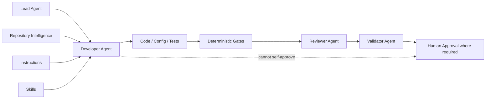
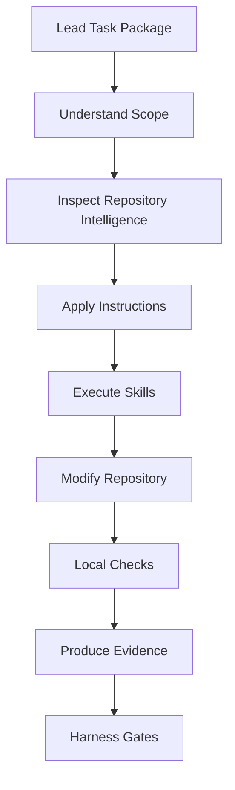
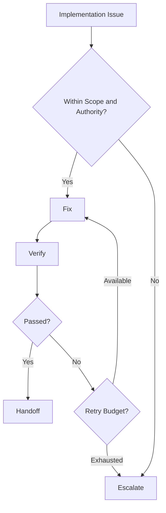
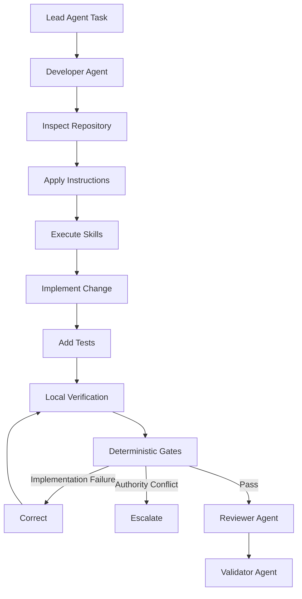
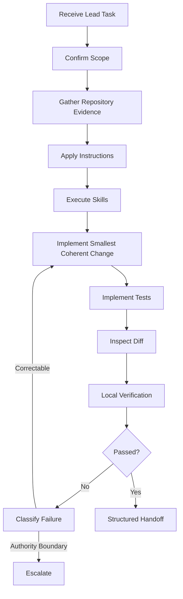
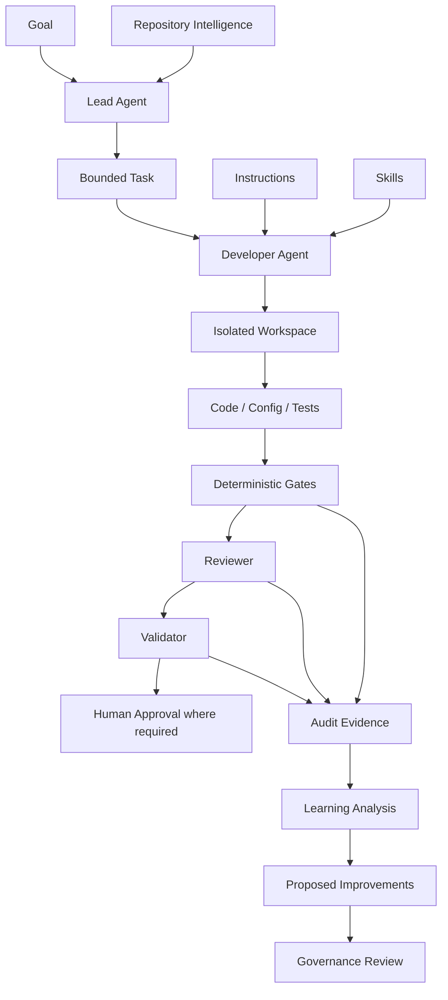
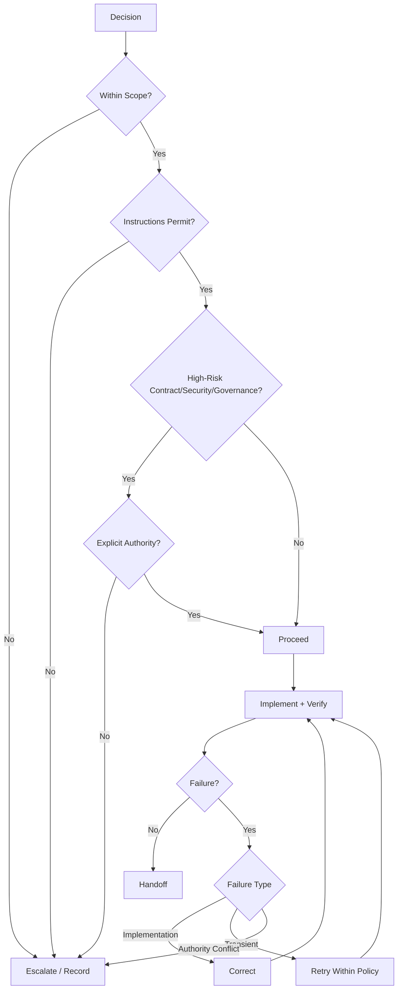
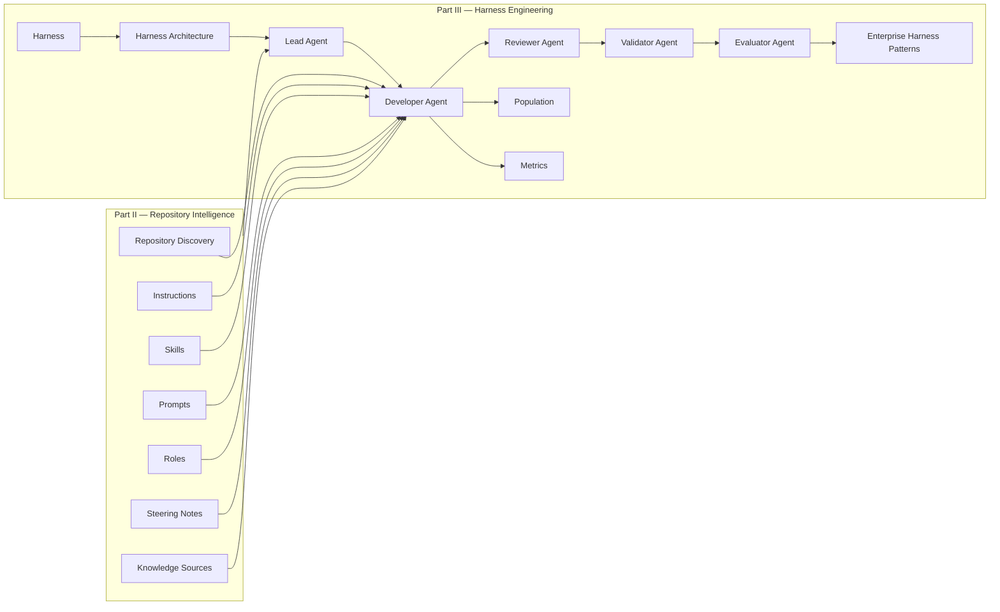

# Chapter 15 — Developer Agent

**Part III — Harness Engineering**

The Developer Agent is the implementation role within the enterprise AI Engineering Harness. It transforms a bounded task into repository changes while remaining constrained by the Lead Agent plan, applicable Instructions, selected Skills, Repository Intelligence, acceptance criteria, deterministic validation, independent review, and human approval boundaries.

> **Core principle:** The Developer Agent implements the assigned work but does not approve its own output or replace deterministic validation, review, evaluation, or human approval.

---

# Story-driven Opening

Alpha Car Detailing is preparing a new Corporate Fleet Booking capability. The Lead Agent has already interpreted the business goal, inspected the repository, identified the relevant services, selected reusable Skills, and produced a bounded implementation task.

The Developer Agent receives that task.

Its assignment is to implement:

- `POST /api/fleet-bookings`;
- application behavior for creating a corporate fleet booking;
- domain invariants;
- persistence;
- transactional outbox publication of `FleetBookingCreated`;
- authorization;
- observability;
- unit and integration tests.

The Developer Agent is not asked to redesign the Fleet Booking service. It is not asked to change the public event contract. It is not allowed to weaken architecture or security gates. It is not responsible for approving its own implementation.

The workflow is therefore not:

```text
Prompt
  ↓
AI writes code
  ↓
AI says complete
```

It is:

```text
Lead Agent
 ↓
Developer Agent
 ↓
Apply Instructions + Skills
 ↓
Implement Changes
 ↓
Local Checks
 ↓
Deterministic Gates
 ↓
Reviewer Agent
 ↓
Validator Agent
```

The difference is fundamental. The Developer Agent is powerful inside its implementation boundary and deliberately constrained outside it.

---

# Learning Objectives

By the end of this chapter, you should be able to:

- define the Developer Agent as a governed implementation role;
- distinguish implementation authority from planning, validation, review, and approval;
- describe the task package the Developer Agent receives from the Lead Agent;
- use Repository Intelligence to guide implementation;
- apply Instructions and selected Skills correctly;
- preserve architecture, API, event, persistence, security, and observability boundaries;
- design local verification and deterministic gate handoffs;
- classify failures and apply bounded correction or escalation;
- produce implementation evidence suitable for Reviewer and Validator Agents;
- compare how Claude Code, GitHub Copilot, and OpenAI Codex can execute the same Developer Agent contract.

---

# Background

## From AI Code Generation to Governed Implementation

AI-assisted development began largely as code suggestion and code completion. Modern coding Agents can inspect repositories, modify multiple files, execute commands, run tests, create migrations, and iterate on failures.

That capability changes the engineering problem.

The important question is no longer only:

```text
Can the AI write the code?
```

It becomes:

```text
Can the AI implement the change
while preserving scope, architecture,
security, contracts, validation,
and organizational authority?
```

The Developer Agent is the role that answers that question.

## The Developer Agent Within the Role Model

The enterprise Harness separates major responsibilities:

```text
Lead Agent
    plans and coordinates

Developer Agent
    implements

Reviewer Agent
    reviews

Validator Agent
    validates

Evaluator Agent
    evaluates

Human
    approves where required
```

These roles may be implemented by the same model family or different platforms, but their responsibilities should remain distinct.

The Developer Agent can inspect and self-check its work. It cannot convert self-checking into self-approval.

---

# Concepts

## What Is a Developer Agent?

A Developer Agent is the governed implementation responsibility within the Harness.

Its normal operating sequence is:

```text
Understand
   ↓
Inspect
   ↓
Implement
   ↓
Check
   ↓
Report
   ↓
Handoff
```

The role is defined by responsibility and authority, not by vendor.

Claude Code, GitHub Copilot, OpenAI Codex, or another future coding Agent can all implement the role.

## Primary Responsibilities

The Developer Agent may be responsible for:

- understanding the assigned task;
- inspecting affected repository areas;
- reading applicable Instructions;
- executing selected Skills;
- planning local implementation steps;
- modifying code and configuration;
- implementing domain behavior;
- creating or updating tests;
- implementing approved API and event behavior;
- making persistence changes;
- applying security requirements;
- adding observability;
- running local verification;
- classifying failures;
- performing bounded corrections;
- recording assumptions, risks, and unresolved issues;
- producing a structured handoff.

## Authority and Limits

The Developer Agent should not:

- redefine scope without coordination;
- ignore applicable Instructions;
- bypass failed deterministic gates;
- approve its own implementation;
- hide assumptions or failures;
- change public contracts without authority;
- weaken security controls;
- modify governance artifacts without authorization;
- retry indefinitely;
- claim success without evidence.

A useful principle is:

> **Capability does not equal authority.**

The fact that an Agent can execute a command does not mean the Developer Agent role is authorized to execute it.

## Receiving Work from the Lead Agent

A strong task package includes:

```text
Goal
Scope
Exclusions
Acceptance Criteria
Applicable Instructions
Selected Skills
Repository Evidence
Dependencies
Risks
Approval Boundaries
Required Evidence
```

The Lead Agent determines what work should be performed.

The Developer Agent determines how to implement that assigned work safely.

## Understanding Task Scope

The Developer Agent should identify:

- what must change;
- what may change;
- what must not change;
- which contracts are frozen;
- which modules are affected;
- which decisions require escalation.

The central rule is:

> **Discover broadly. Modify narrowly.**

The Agent may inspect many areas of the repository to understand the task while modifying only the areas required for the implementation.

## Repository Intelligence Usage

Repository Intelligence may provide:

- solution and project structure;
- service boundaries;
- dependency graphs;
- architecture patterns;
- test conventions;
- build and validation commands;
- contract locations;
- known ADRs;
- deployment constraints.

Repository Intelligence accelerates understanding, but critical facts should still be verified against the current repository.

## Applying Instructions

Instructions define persistent standards and constraints.

Examples:

```text
Application must not reference Infrastructure.
Public event contracts require compatibility.
Integration events use the transactional outbox.
Sensitive data must not be logged.
New endpoints require integration tests.
```

Instructions constrain implementation.

If a task cannot be completed without violating an Instruction, the Developer Agent should escalate rather than silently bypassing the rule.

## Executing Skills

Skills encode reusable implementation workflows.

Examples:

```text
create-rest-endpoint
add-application-command
add-domain-behavior
add-integration-event
add-transactional-outbox
add-api-tests
```

A Skill guides execution but does not grant additional authority.

If a Skill conflicts with an applicable Instruction, the Instruction wins.

## Local Implementation Planning

The Developer Agent may sequence the implementation:

```text
1. Inspect similar endpoint.
2. Add request/command.
3. Add validation.
4. Extend domain behavior.
5. Update persistence.
6. Add outbox mapping.
7. Add endpoint.
8. Add observability.
9. Add tests.
10. Run verification.
```

This is local implementation planning.

It is not permission to redesign the overall work package.

## Code Modification

The Developer Agent should aim for the **smallest coherent change**.

A coherent change may touch multiple layers if the architecture requires it.

For Alpha Car Detailing:

```text
API
Application
Domain
Persistence
Events
Observability
Tests
```

may all be legitimate.

Adding unrelated refactors, package upgrades, or framework replacements is not.

## API and Event Contracts

Published contracts require stronger governance than private implementation details.

The Developer Agent should establish:

- whether the contract is public or internal;
- whether compatibility is required;
- whether the task authorizes change;
- whether versioning is required;
- whether a contract gate exists.

If a contract must remain unchanged, the Developer Agent must preserve it.

## Persistence Changes

Persistence changes should consider:

- existing data;
- migration safety;
- nullability;
- indexes;
- rollback;
- transaction boundaries;
- rolling deployment compatibility.

Generated migrations must be inspected.

Generated output is not generated correctness.

## Security

Security must be implemented as part of the feature.

The Developer Agent should preserve:

```text
Authentication
    ↓
Policy Authorization
    ↓
Resource Authorization
    ↓
Safe Data Access
    ↓
Safe Logging
```

It must not disable or weaken security controls to make implementation easier.

## Observability

The Developer Agent should add observability according to repository conventions:

- structured logs;
- traces;
- correlation;
- metrics;
- error visibility.

Operational evidence should be useful without exposing secrets or unnecessary sensitive data.

## Configuration

Configuration should remain separate from secrets.

The Developer Agent should:

- reuse approved configuration mechanisms;
- validate important options at startup where appropriate;
- preserve compatibility with deployment tooling;
- avoid hard-coded environment values.

## Tests

Tests are part of implementation.

The Developer Agent may need:

- domain tests;
- application tests;
- endpoint tests;
- persistence tests;
- integration tests;
- contract tests.

Tests should prove behavior, not merely implementation mechanics.

## Tool Usage

Tool access should be least privilege.

Typical Developer Agent permissions may include:

```text
read repository
modify authorized repository files
build
test
lint
inspect git state
generate local migration
```

They do not automatically include:

```text
production database access
production deployment
secret administration
branch-protection changes
governance modification
```

## Local Verification Versus Deterministic Gates

The Developer Agent should perform focused local verification.

The Harness should still run independent deterministic gates.

```text
Developer local checks
       ↓
Deterministic Harness gates
       ↓
Independent review
```

Local success means ready for the next stage, not approved.

## Failure Classification

A failure should be classified before correction.

| Failure | Typical response |
|---|---|
| Compiler error | Correct implementation |
| Feature test failure | Correct implementation |
| Architecture failure | Correct design or escalate |
| Security finding | Correct or escalate policy conflict |
| Contract failure | Restore compatibility or escalate |
| Transient tool failure | Retry within policy |
| Existing unrelated failure | Record evidence |
| Requirement conflict | Escalate |

## Bounded Retry

Retries should be explicit and limited.

Unbounded retries can cause:

- code churn;
- scope expansion;
- hidden workaround behavior;
- excessive compute cost;
- difficult audit trails.

When the retry budget is exhausted, the Developer Agent should preserve evidence and escalate.

## Assumptions and Risks

Material assumptions should be explicit.

Example:

```text
Assumption:
One fleet booking belongs to one service station.

Evidence:
Existing aggregate contains one StationId.

Impact:
API and persistence design use a single StationId.
```

The Agent should distinguish facts, assumptions, and recommendations.

## Implementation Evidence

A strong handoff includes:

```text
Task
Implementation status
Files changed
Behavior implemented
Tests
Local checks
Contract status
Persistence changes
Configuration changes
Assumptions
Risks
Known failures
Out-of-scope observations
Escalations
Next role
```

---

# Architecture Discussion

## Developer Agent as an Execution Boundary

The Developer Agent belongs in the execution plane of the Harness.

It consumes governed inputs and produces repository changes plus evidence.

```text
Harness Control Plane
        ↓
Bounded Developer Task
        ↓
Developer Agent
        ↓
Repository Changes
        ↓
Validation Pipeline
```

The Agent does not own the entire workflow.

## Implementation Plane Versus Approval Plane

Implementation and approval should remain separate.

```text
Implementation Plane
Developer Agent
      ↓
Code + Tests + Evidence

Approval Plane
Deterministic Gates
      ↓
Reviewer
      ↓
Validator
      ↓
Human Approval
```

Combining these planes creates conflicts of responsibility.

## Inputs and Outputs

### Inputs

- Lead Agent task;
- Repository Intelligence;
- Instructions;
- selected Skills;
- Knowledge Sources;
- acceptance criteria;
- tool permissions.

### Outputs

- code;
- configuration;
- tests;
- migrations;
- implementation evidence;
- assumptions;
- risks;
- escalation requests.

## Independent Deterministic Gates

The Developer Agent may execute the same checks locally, but the Harness should execute important gates independently.

This prevents:

- hidden local dependencies;
- gate suppression;
- stale local environments;
- unsupported success claims.

## Retry and Correction Architecture

A mature Harness can support:

```text
Implement
   ↓
Validate
   ↓
Failure?
 ┌─┴─────────────┐
Yes              No
 ↓                ↓
Classify       Reviewer
 ↓
Correct / Retry / Escalate
```

The correction loop should be bounded.

## Human Approval Boundaries

Human approval should remain for decisions whose organizational impact exceeds normal implementation authority.

Examples:

- breaking contract changes;
- security exceptions;
- high-risk migrations;
- architecture exceptions;
- governance changes;
- production deployment.

---

# Professional Diagrams

## Developer Agent Responsibility Boundary



## Information Flow



## Decision Model



---

# Hands-on Example

## Scenario

Alpha Car Detailing requires:

```text
POST /api/fleet-bookings
```

The requirements are:

- caller must be an authorized `CorporateFleetManager`;
- caller must belong to the corporate customer;
- at least one vehicle is required;
- booking cannot exceed the configured fleet maximum;
- selected station must support corporate fleet bookings;
- booking must be persisted;
- `FleetBookingCreated` must be written through the transactional outbox;
- correlation must be preserved;
- observability must be added;
- unit and integration tests are required.

Explicit exclusions:

- do not change the public `FleetBookingCreated` contract;
- do not redefine authorization policy names;
- do not modify architecture Instructions;
- do not modify deterministic gate definitions;
- do not refactor unrelated booking flows.

Selected Skills:

```text
create-rest-endpoint
add-application-command
add-domain-behavior
add-integration-event
add-transactional-outbox
add-api-tests
```

## Step 1 — Confirm Scope

The Developer Agent records the boundary before modifying code.

## Step 2 — Inspect Existing Patterns

Inspect:

- similar booking endpoints;
- application handlers;
- domain aggregates;
- repository abstractions;
- outbox mappings;
- authorization services;
- integration-test fixtures.

## Step 3 — Apply Instructions

The Agent confirms architecture, security, testing, event, and observability constraints.

## Step 4 — Execute Skills

The selected Skills guide the implementation sequence without overriding repository Instructions.

## Step 5 — Preserve Contracts

The Agent verifies the existing `FleetBookingCreated` schema and confirms it is frozen for the task.

## Step 6 — Add the Request Model

```csharp
public sealed record CreateFleetBookingRequest(
    Guid CorporateCustomerId,
    Guid StationId,
    IReadOnlyCollection<Guid> VehicleIds,
    DateTimeOffset RequestedStartTime);
```

## Step 7 — Add the Application Command

```csharp
public sealed record CreateFleetBookingCommand(
    Guid CorporateCustomerId,
    Guid StationId,
    IReadOnlyCollection<Guid> VehicleIds,
    DateTimeOffset RequestedStartTime);
```

## Step 8 — Add Validation

Validate required fields and request shape using repository-standard validation.

## Step 9 — Add Domain Behavior

The domain should enforce invariants such as:

- at least one vehicle;
- no duplicate vehicles;
- maximum fleet size.

## Step 10 — Enforce Resource Authorization

The handler verifies that the authenticated user can manage the specified corporate customer.

## Step 11 — Validate Station Capability

Use the approved station boundary rather than direct cross-service database access.

## Step 12 — Implement the Handler

The handler coordinates the use case without violating architecture boundaries.

## Step 13 — Use the Transactional Outbox

Persist:

```text
FleetBooking
+
FleetBookingCreated outbox message
```

inside the same transaction.

## Step 14 — Preserve the Event Contract

Do not add `VehicleIds` merely because they are available.

## Step 15 — Update EF Core Mapping

Add the minimum mapping needed for persistence.

## Step 16 — Generate and Inspect Migration

Inspect every generated operation.

Unexpected drops or renames should block handoff until explained.

## Step 17 — Add the Endpoint

Keep the endpoint thin.

```text
HTTP Request
   ↓
Map to Command
   ↓
Application Handler
   ↓
Protocol Response
```

## Step 18 — Add Observability

Use structured logging, tracing, and correlation according to repository conventions.

## Step 19 — Add Unit Tests

Test domain invariants and application behavior.

## Step 20 — Add Integration Tests

Verify:

- valid request returns `201`;
- unauthorized customer returns `403`;
- booking is persisted;
- outbox message is persisted;
- public contract remains unchanged.

## Step 21 — Run Focused Local Verification

```text
dotnet build
focused unit tests
fleet booking integration tests
architecture tests
```

## Step 22 — Handle Architecture Failure Correctly

If an architecture gate reports:

```text
FleetBookings.Application references FleetBookings.Infrastructure
```

fix the implementation.

Do not modify the gate.

## Step 23 — Record Out-of-Scope Findings

Example:

```text
Observation:
Existing correlation identifier is already present in the shared event envelope.

Action:
Reused existing mechanism.
No new correlation field added to the public event.
```

## Step 24 — Prepare Structured Handoff

Include files changed, tests, local evidence, assumptions, risks, and any unresolved issues.

## Step 25 — Deterministic Gates

The Harness independently executes its gate pipeline.

## Step 26 — Bounded Correction

Correct valid implementation failures within scope.

Escalate authority conflicts.

## Step 27 — Reviewer Handoff

The Reviewer receives a fresh context containing the task, diff, evidence, and gate results.

## Step 28 — Validator Handoff

The Validator determines whether acceptance criteria are satisfied.

## Full Workflow



The Developer Agent implemented the work. It did not approve it.

---

# Claude Example

Claude Code can serve as the primary implementation platform while the Developer Agent contract remains vendor-neutral.

A practical Claude-oriented Developer Agent prompt might include:

```text
Role:
You are the Developer Agent.

Goal:
Implement POST /api/fleet-bookings.

Scope:
Modify only the Fleet Booking implementation and directly required tests/configuration.

Instructions:
Read and comply with all applicable repository and scoped instructions.

Skills:
Use the selected endpoint, application-command, domain-behavior,
integration-event, transactional-outbox, and API-test Skills.

Repository Intelligence:
Inspect existing patterns before modifying files.

Do not:
- change FleetBookingCreated;
- change architecture policy;
- change security policy;
- bypass deterministic gates;
- modify Steering Notes;
- self-approve.

Required local checks:
- build;
- focused tests;
- integration tests;
- architecture checks where available.

Required output:
- files changed;
- behavior implemented;
- test evidence;
- assumptions;
- risks;
- unresolved failures;
- handoff status.
```

Claude should inspect similar repository patterns before editing.

It should use bounded local planning, preserve existing architecture, inspect final diffs, and provide evidence.

If it accidentally adds `VehicleIds` to `FleetBookingCreated` and the contract gate fails, the correct response is to restore the approved schema—not update the baseline.

If an architecture gate fails because the Application layer references Infrastructure, Claude should correct the dependency direction rather than suppress the architecture rule.

If a test expects `403` but receives `201`, Claude should trace the result back to the authorization requirement rather than merely changing the test.

If repository evidence conflicts materially with the assigned task, Claude should escalate with evidence.

Claude's ability to execute commands or modify many files does not grant authority to modify every file it can access.

---

# GitHub Copilot Comparison

GitHub Copilot can implement the same Developer Agent role through a more IDE- and GitHub-centered workflow.

The core responsibilities remain unchanged:

```text
Understand task
 ↓
Inspect repository context
 ↓
Apply Instructions
 ↓
Implement incrementally
 ↓
Run checks
 ↓
Prepare evidence
 ↓
Independent review
```

Copilot can be particularly effective when a human developer remains closely in the loop through the IDE.

The enterprise risk is treating suggestions as automatically correct.

A suggestion that injects Infrastructure directly into Application remains an architecture violation even if it is syntactically correct.

A suggested public contract expansion remains governed.

A generated test should still be checked against acceptance criteria.

Repository instructions, path-specific guidance, pull-request workflows, and GitHub-native review can strengthen the workflow, but they do not remove the need for deterministic gates and independent role separation.

The platform changes.

The Developer Agent contract does not.

---

# Codex Comparison

OpenAI Codex can also implement the Developer Agent role in repository-oriented and isolated task environments.

Its ability to inspect repositories, execute terminal commands, work in isolated worktrees, and perform delegated implementation makes it suitable for bounded Developer Agent tasks.

The same controls should apply:

- scoped task package;
- repository Instructions;
- reusable Skills;
- controlled tool permissions;
- contract boundaries;
- deterministic validation;
- bounded retries;
- independent review.

Parallel Developer Agents can improve throughput when tasks are genuinely independent.

They should not be parallelized blindly when they share evolving domain or contract boundaries.

Codex sandboxing or worktree isolation improves execution safety, but workspace isolation is not the same as organizational authority.

The Harness should still determine what the Developer Agent may modify and what requires escalation.

---

# Best Practices

The following practices improve Developer Agent reliability:

- begin with the assigned task, not with code;
- discover broadly and modify narrowly;
- prefer repository evidence over generic model knowledge;
- inspect similar implementations before creating new patterns;
- read Instructions before executing Skills;
- treat Skills as workflows, not permissions;
- make the smallest coherent change;
- preserve architecture boundaries;
- keep API endpoints thin;
- place true business invariants in the domain;
- treat authorization as more than authentication;
- never weaken security to complete a task;
- treat public contracts as controlled assets;
- prefer additive contract evolution where appropriate;
- respect service ownership boundaries;
- preserve transactional consistency;
- inspect generated migrations;
- consider rolling-deployment compatibility;
- reuse approved dependencies;
- keep secrets out of configuration files;
- validate important configuration;
- make observability part of implementation;
- use structured logging;
- avoid logging unnecessary sensitive data;
- write tests against requirements;
- do not modify tests merely to make them pass;
- inspect the final diff;
- keep deterministic validation independent;
- treat gate failures as evidence;
- classify failures before correcting them;
- use bounded retries;
- escalate decisions rather than routine work;
- make assumptions explicit;
- preserve failure evidence;
- produce structured handoffs;
- distinguish implementation completion from acceptance;
- never self-approve;
- preserve Reviewer and Validator independence;
- protect governance artifacts;
- use least-privilege tool access;
- isolate parallel Agent workspaces.

A disciplined Developer Agent cycle is:



---

# Anti-patterns

Common Developer Agent anti-patterns include:

- unbounded repository modification;
- coding before repository discovery;
- generic best practice over repository practice;
- treating Instructions as suggestions;
- self-modifying governance;
- scope-creep refactoring;
- architecture rewrite disguised as feature work;
- contract drift;
- updating baselines merely to make contract gates pass;
- direct event publication around an outbox requirement;
- cross-service database access;
- business logic in endpoints;
- validation only at the API boundary;
- treating authentication as complete authorization;
- removing security controls while debugging;
- logging entire request objects;
- hard-coded secrets;
- dependency shopping;
- package upgrades as side effects;
- trusting generated migrations without inspection;
- destructive migrations without operational thinking;
- changing tests to match bugs;
- deleting or skipping failing tests;
- excessive mocking;
- claiming “all tests passed” after running only a subset;
- treating local success as final success;
- bypassing deterministic gates;
- blanket warning suppression;
- infinite retry loops;
- random-walk debugging;
- hiding pre-existing failures;
- claiming failures are pre-existing without evidence;
- hidden assumptions;
- converting uncertainty into confidence;
- silently reinterpreting acceptance criteria;
- implementing the original prompt instead of the bounded Lead plan;
- Developer Agent acting as Architect, Security Approver, Reviewer, Validator, or Human Approver;
- same conversation for implementation and independent review;
- abstraction explosion;
- premature optimization;
- accidental repository-wide formatting;
- silent configuration defaults;
- assuming tool access equals permission;
- production validation during development;
- force-push as routine recovery;
- vague success or failure reporting;
- claiming production readiness without evidence.

The central warning is:

> A Developer Agent should solve implementation problems without changing the definition of acceptable implementation.

---

# Architect’s Notes

The Developer Agent should be designed as part of the Harness, not in isolation.

Key architectural considerations include:

- define the role independently from the model vendor;
- make authority more explicit than capability;
- bound autonomy by change type and risk;
- keep planning authority separate from implementation authority;
- make Repository Intelligence a first-class service;
- refresh Repository Intelligence against live repository state;
- assign clear ownership to Instructions and governance artifacts;
- reinforce machine-testable Instructions with deterministic gates;
- avoid giant prompts by separating role, Instructions, Skills, task, Steering Notes, and Repository Intelligence;
- version Skills and govern their evolution;
- optimize for reviewable diffs, not generated code volume;
- route review based on the actual final diff;
- run cheap deterministic gates before expensive review;
- provide actionable gate diagnostics;
- prevent the Developer Agent from controlling its own gates;
- separate test creation from independent acceptance validation;
- build independent Reviewer contexts;
- support replaceable model providers;
- protect public contracts more strongly than private code;
- establish event contract ownership;
- include operational context in persistence changes;
- treat configuration as a contract;
- standardize observability conventions;
- make architecture executable through tests;
- prefer technical security controls over prompt-only security;
- design escalation as a first-class result;
- preserve iteration history;
- measure engineering outcomes;
- guard against reward hacking;
- isolate parallel Agent workspaces;
- define merge ownership;
- keep human approval risk-based and meaningful;
- preserve auditability;
- fail closed on high-risk authority uncertainty;
- allow “no change” as a valid result;
- design future learning around evidence, not silent standard changes.

A mature reference model is:



---

# Enterprise Tips

Enterprise adoption should focus on safe delegation rather than maximum code generation.

Recommended practices include:

- start with narrow, high-confidence tasks;
- standardize the Developer Agent contract;
- keep the contract vendor-neutral;
- centralize critical enterprise Instructions;
- keep repository Instructions concise and scoped;
- standardize common engineering Skills;
- allow repository-specific Skill extensions;
- version Skills;
- build and incrementally refresh Repository Intelligence;
- separate trusted and untrusted context;
- use dedicated Agent identities;
- use least-privilege credentials;
- use ephemeral development environments;
- isolate parallel Developer Agents;
- enforce high-risk file protections;
- classify final diffs automatically;
- protect governance files through ownership rules;
- use Agent branches and pull requests;
- make pull requests evidence-rich;
- run deterministic gates before human review;
- keep gate ownership separate from implementation ownership;
- prefer actionable gate diagnostics;
- separate fast and deep gates;
- baseline known failures carefully;
- track flaky tests separately;
- establish retry budgets;
- track correction cycles and first-pass gate success;
- measure Reviewer findings and escaped defects;
- avoid lines-of-code metrics;
- classify human intervention;
- create an escalation taxonomy and router;
- classify task risk;
- increase risk when the actual diff warrants it;
- keep human approvals focused on real decisions;
- establish API/event contract governance;
- protect database changes;
- provide deterministic test-data strategies;
- make local setup reproducible;
- expose wrapper validation commands;
- make architecture executable;
- standardize correlation and event metadata;
- standardize idempotent consumer patterns;
- enforce sensitive-data policies automatically;
- record Harness, model, role, Instruction, and Skill versions;
- use operational dashboards, alerts, kill switches, budgets, and concurrency limits;
- train teams on role boundaries;
- improve acceptance criteria;
- improve repositories rather than only prompts;
- treat Agent failures as architecture feedback;
- roll out autonomy based on repository readiness;
- test and red-team the Developer Agent role;
- use canary repositories for Harness changes;
- version and progressively roll out Harness updates;
- optimize the full delivery pipeline.

---

# Decision Points

The Developer Agent repeatedly needs to decide whether to continue, correct, retry, escalate, or stop.

Key questions include:

- Is the task sufficiently defined?
- Is the proposed change in scope?
- Does an approved repository pattern already exist?
- Is a new abstraction necessary?
- Can an existing dependency solve the problem?
- Does the change affect a public contract?
- Is the event internal or published?
- Is the contract change additive or breaking?
- Does the change affect configuration as a contract?
- Is the rule input validation or a domain invariant?
- Is authentication sufficient, or is resource authorization required?
- Does a security control block the implementation?
- Is the log data necessary and safe?
- Does the feature need a new metric?
- Can the existing correlation mechanism be reused?
- Is direct event publication permitted?
- Is cross-service data access allowed?
- Is a database migration required?
- Is the migration safe for existing data and rolling deployment?
- Should a generated migration be trusted?
- Should the behavior be tested at unit or integration level?
- Should a failing test change, or should the code change?
- Is a failure genuinely pre-existing?
- Should a warning be suppressed?
- Is a build failure routine or structural?
- Can a failed gate be corrected within scope?
- Is the gate itself demonstrably wrong?
- Should the Agent retry?
- Is the retry budget exhausted?
- Is the Agent about to modify governance?
- Is a Steering Note change required?
- Is a new Skill genuinely reusable?
- Should an existing Skill change through governance?
- Is new infrastructure required?
- Is performance optimization actually justified?
- Is the final diff still within scope?
- Has the risk classification increased?
- Has enough local verification been performed?
- Is it accurate to claim implementation complete?
- Is independent review required?
- Does a specialist Reviewer need to participate?
- Is human approval required?
- Should the Agent stop?

A practical decision tree is:



---

# Exercises

1. Define the Developer Agent boundary for `POST /api/fleet-bookings/{bookingId}/cancel`.
2. Identify scope creep in adjacent refactoring opportunities.
3. Create a Repository Intelligence investigation plan for a new endpoint.
4. Resolve an Instruction-versus-Skill conflict.
5. Detect architecture violations in a handler that directly uses `DbContext` and publishes events.
6. Analyze an unauthorized `FleetBookingCreated` contract expansion.
7. Classify additive versus breaking contract changes.
8. Classify API validation versus domain invariants.
9. Design resource-level authorization for corporate fleet booking.
10. Respond correctly to a sensitive-logging security gate.
11. Design tracing, metrics, logs, and correlation for fleet booking.
12. Correct a direct-publish implementation to use the transactional outbox.
13. Analyze cross-service database access.
14. Inspect an EF Core migration containing an unrelated `DropColumn`.
15. Design a staged migration for a required field on a populated table.
16. Treat configuration-key changes as deployment contracts.
17. Design stronger behavioral tests.
18. Classify a `403` versus `201` test failure.
19. Establish evidence for a pre-existing failure.
20. Correct an architecture gate failure without changing the gate.
21. Resolve a business/security instruction conflict.
22. Design a Developer Agent retry policy.
23. Replace random-walk debugging with hypothesis-driven correction.
24. Review a suspiciously large final diff.
25. Analyze unauthorized modification of `AGENTS.md`.
26. Create an assumptions register.
27. Separate facts, assumptions, and recommendations.
28. Build a structured implementation evidence package.
29. Practice stage-accurate status reporting.
30. Design the Reviewer handoff.
31. Preserve independent review when the same model performs multiple roles.
32. Write a Claude Developer Agent prompt.
33. Design a GitHub Copilot Developer workflow.
34. Design a Codex Developer workflow.
35. Analyze multi-Agent decomposition and merge risks.
36. Design risk-based review routing.
37. Build a tool-permissions matrix.
38. Design a deterministic validation pipeline.
39. Improve gate diagnostic quality.
40. Define Developer Agent effectiveness metrics.
41. Detect reward hacking.
42. Assess repository readiness.
43. Design an autonomy maturity model.
44. Treat repeated Agent failures as architecture feedback.
45. Propose a governed Skill improvement.
46. Design self-learning without silent governance change.
47. Model the complete Alpha Car Detailing Developer workflow.
48. Design `roles/developer.md`.
49. Design a machine-readable Developer handoff schema.
50. Review a flawed workflow where one Agent implements, reviews, merges, and deploys.
51. Implement the corporate fleet booking feature in the sample application.
52. Run a Developer Agent retrospective.
53. Conduct a Lead/Developer/Reviewer team workshop.
54. Assess enterprise repository readiness.
55. Design the complete enterprise Developer Agent subsystem.

---

# Interview Questions

## 1. What is a Developer Agent?

A Developer Agent is the governed implementation role responsible for making authorized repository changes according to the Lead Agent plan, Instructions, Skills, Repository Intelligence, and acceptance criteria.

## 2. Why should it not approve its own work?

Because implementation and independent judgment should remain separate. The execution context that created the solution may preserve its own assumptions and blind spots.

## 3. What does “discover broadly, modify narrowly” mean?

The Agent may inspect a wide area of the repository to understand a task but should modify only the areas required by the assigned scope.

## 4. What is the difference between Instructions and Skills?

Instructions define standards and constraints. Skills define reusable implementation workflows within those constraints.

## 5. What happens when a Skill conflicts with an Instruction?

The Instruction takes precedence. The Skill should be adapted or a governed improvement proposed separately.

## 6. What is the smallest coherent change?

The minimum complete change that satisfies the task and preserves architecture, even if it spans multiple layers.

## 7. Why are public contracts special?

They may have external consumers and therefore require stronger compatibility and ownership controls.

## 8. Why should generated migrations be inspected?

They can contain unrelated or unsafe operations even when generated successfully.

## 9. What is the Developer Agent’s security responsibility?

Implement security requirements, preserve authorization boundaries, protect secrets and sensitive data, and never weaken controls to make code pass.

## 10. Why does the transactional outbox matter?

It prevents the dual-write failure between database persistence and message publication.

## 11. Why are Developer-written tests not final validation?

The Developer Agent may encode its own misunderstanding into the tests. Validator responsibility remains independent.

## 12. What is failure classification?

Determining whether a failure should trigger correction, retry, evidence recording, escalation, or stopping.

## 13. Why must retries be bounded?

To prevent code churn, runaway cost, hidden workaround behavior, and uncontrolled scope expansion.

## 14. When should the Developer Agent escalate?

When requirements conflict, authority is insufficient, public contracts or architecture must change, security exceptions are required, or repeated failures exceed the retry budget.

## 15. Why is changing a gate to make implementation pass dangerous?

It allows the implementation role to redefine the criteria evaluating its own work.

## 16. What is implementation evidence?

Objective information such as files changed, tests run, build results, contract status, assumptions, risks, and failures.

## 17. What is stage-accurate status reporting?

Reporting exactly what is complete and what remains, rather than claiming approval or production readiness prematurely.

## 18. Why is capability different from authority?

An Agent may technically be able to perform an operation without being organizationally permitted to do it.

## 19. How can the same model act as Developer and Reviewer safely?

Use independent execution contexts and provide the Reviewer with the original task, diff, deterministic results, and handoff evidence.

## 20. What is the most important architectural principle?

The Developer Agent should be powerful inside its implementation boundary and constrained outside it.

---

# Chapter Summary

The Developer Agent is the implementation role within the enterprise AI Engineering Harness.

Its responsibility is to transform an approved task into repository changes while operating within the boundaries established by the Lead Agent plan, Repository Intelligence, applicable Instructions, selected Skills, acceptance criteria, and organizational governance.

The core principle of this chapter is:

> **The Developer Agent implements the work but does not approve its own implementation.**

The Developer Agent is a role, not a product. Claude Code, GitHub Copilot, OpenAI Codex, and future coding Agents can all implement the same architectural contract.

The Agent receives a bounded task from the Lead Agent, uses Repository Intelligence and Instructions to understand how the repository must be changed, executes selected Skills, produces the smallest coherent implementation, adds tests and observability, performs local checks, classifies failures, and prepares evidence.

Architecture boundaries remain requirements. Public contracts require stronger governance. Persistence changes have operational consequences. Security and observability belong inside implementation. Tests belong to the Developer Agent, but final validation does not.

Local verification does not replace deterministic gates. Gate failures should lead to correction, bounded retry, or escalation—not gate bypass.

Assumptions must remain visible. The final diff is the actual implementation evidence. Stage-accurate status reporting matters.

The Developer Agent should be capable enough to perform meaningful multi-file implementation while remaining unable by default to redefine scope, rewrite governance, weaken security, bypass validation, change governed contracts, self-approve, or deploy production without authority.

The Alpha Car Detailing workflow can be summarized as:

```text
Lead Agent
    ↓
Developer Agent
    ↓
Repository Intelligence
    ↓
Instructions
    ↓
Skills
    ↓
Implementation
    ↓
Tests + Local Verification
    ↓
Evidence
    ↓
Deterministic Gates
    ↓
Reviewer Agent
    ↓
Validator Agent
```

That transition—from “AI writes code” to “AI performs a governed implementation role”—is the foundation for the next roles in the Harness.

---

# Chapter 15 Cross-Reference Map

The Developer Agent is the implementation role that connects the repository-intelligence concepts introduced in Part II with the orchestration, validation, review, governance, and learning mechanisms developed throughout the rest of the handbook.



## Inputs from Part II — Repository Intelligence

| Chapter | Concept | How the Developer Agent Uses It |
|---|---|---|
| Chapter 5 | Repository Discovery | Finds existing architecture, implementation patterns, dependencies, contracts, tests, and conventions |
| Chapter 6 | Instructions | Applies persistent engineering standards and constraints |
| Chapter 7 | Skills | Executes approved reusable implementation workflows |
| Chapter 8 | Prompts | Receives the current engineering objective and acceptance criteria |
| Chapter 9 | Roles | Establishes implementation responsibility, authority, output, and limits |
| Chapter 10 | Steering Notes | Applies temporary release priorities and constraints |
| Chapter 11 | Knowledge Sources | Consults ADRs, specifications, schemas, and trusted engineering evidence |

## Harness and Lead Agent Context

| Chapter | Responsibility | Connection to Developer Agent |
|---|---|---|
| Chapter 12 — What Is a Harness? | Defines the controlled execution environment | Places implementation inside validation, review, approval, and audit workflows |
| Chapter 13 — Harness Architecture | Defines orchestration, tools, gates, state, evidence, and handoffs | Supplies the architecture in which the Developer Agent operates |
| Chapter 14 — Lead Agent | Understands the goal, decomposes work, selects Skills and Roles | Produces the bounded implementation task consumed by the Developer Agent |

The Lead Agent determines **what work should be performed**.

The Developer Agent determines **how to implement that assigned work safely**.

## Deterministic Gates and Automated Guardrails

The Developer Agent performs local verification. The Harness independently evaluates machine-verifiable constraints.

Typical gates include:

```text
Build
 ↓
Unit Tests
 ↓
Integration Tests
 ↓
Formatting / Lint
 ↓
Architecture
 ↓
Security
 ↓
Contract Compatibility
```

Hooks can block protected-file modifications or trigger validation automatically.

## Downstream Role Handoffs

| Role | Primary Question | Developer Agent Contribution |
|---|---|---|
| Reviewer Agent | Is the implementation well engineered? | Diff, evidence, assumptions, risks, gate results |
| Validator Agent | Does the implementation satisfy acceptance criteria? | Tests and implementation evidence |
| Evaluator Agent | How well does the result meet broader quality criteria? | Completed implementation and validated evidence |

The Developer Agent creates evidence.

It does not decide that its own evidence is sufficient.

## Feedback into Population, Metrics, and Enterprise Patterns

Developer Agent executions produce:

```text
successful implementations
failed implementations
correction cycles
review findings
gate failures
escalations
```

These can support Population, Metrics, and later Enterprise Harness Patterns.

They should not automatically become new enterprise standards without governance.

## Forward Cross-References to Governance

Later governance chapters control:

- Developer Agent policy ownership;
- allowed autonomy levels;
- approval requirements;
- tool permissions;
- security boundaries;
- audit evidence.

Typical human or specialist approval areas include:

```text
breaking contracts
security exceptions
major architecture changes
high-risk migrations
governance changes
production deployment
```

## Forward Cross-References to the Self-Learning Harness

Developer Agent evidence can feed controlled learning:

```text
Execution Evidence
        ↓
Learning Analysis
        ↓
Improvement Recommendation
        ↓
Human / Governance Review
        ↓
Approved Skill or Instruction Version
```

The Harness may learn from Developer Agent behavior.

It must not silently rewrite engineering standards.

## Alpha Car Detailing Cross-Reference Example

| Concept | Chapter | Application to Fleet Booking |
|---|---|---|
| Repository Discovery | 5 | Find booking, event, persistence, authorization, and testing patterns |
| Instructions | 6 | Preserve architecture, security, outbox, logging, and testing requirements |
| Skills | 7 | Execute endpoint, command, domain, event, outbox, and test workflows |
| Prompts | 8 | Define the fleet-booking objective |
| Roles | 9 | Assign implementation responsibility |
| Steering Notes | 10 | Preserve temporary release constraints |
| Knowledge Sources | 11 | Consult ADRs, API specifications, schemas, deployment docs |
| Harness | 12 | Control execution around the Developer Agent |
| Harness Architecture | 13 | Coordinate tools, gates, retries, evidence, and handoffs |
| Lead Agent | 14 | Produce the bounded task |
| Developer Agent | 15 | Implement code, configuration, tests, and evidence |
| Reviewer Agent | 16 | Independently review implementation quality |
| Validator Agent | 17 | Verify acceptance criteria |
| Evaluator Agent | 18 | Assess broader implementation quality |
| Population | 19 | Capture governed examples and patterns |
| Metrics | 20 | Measure implementation and validation outcomes |
| Enterprise Harness Patterns | 21 | Operationalize Developer Agents at scale |

Chapter 15 is therefore a convergence point between context, execution, and control.

---

# Further Reading

## Anthropic — Claude Code

Study Claude Code documentation for:

- repository-oriented workflows;
- project instructions;
- tool permissions;
- command execution;
- automated operation;
- security controls.

- [Claude Code Documentation](https://docs.anthropic.com/en/docs/claude-code/getting-started)
- [Claude Code CLI Usage](https://docs.anthropic.com/en/docs/claude-code/cli-usage)

## GitHub — GitHub Copilot

Useful topics include:

- repository custom instructions;
- path-specific instructions;
- `AGENTS.md`;
- Agent workflows;
- Copilot code review.

- [GitHub Copilot Repository Custom Instructions](https://docs.github.com/en/copilot/how-tos/copilot-on-github/customize-copilot/add-custom-instructions/add-repository-instructions)
- [GitHub Copilot Code Review](https://docs.github.com/en/copilot/how-tos/use-copilot-agents/request-a-code-review/use-code-review)

## OpenAI — Codex

Useful topics include:

- isolated Agent execution;
- sandboxing;
- command permissions;
- network boundaries;
- approvals;
- Agent telemetry.

- [Running Codex Safely at OpenAI](https://openai.com/index/running-codex-safely/)
- [Building a Safe Codex Sandbox on Windows](https://openai.com/index/building-codex-windows-sandbox/)

## Microsoft — .NET Architecture Guidance

Useful topics include:

- separation of concerns;
- dependency direction;
- domain modeling;
- microservice boundaries;
- testing;
- resilient distributed systems.

- [Microsoft .NET Architecture Guidance](https://learn.microsoft.com/dotnet/architecture/)

## Martin Fowler — Patterns of Enterprise Application Architecture

Relevant concepts include:

- Repository;
- Unit of Work;
- Service Layer;
- Data Mapper;
- Domain Model;
- transaction boundaries.

## Eric Evans — Domain-Driven Design

Useful topics include:

- aggregates;
- entities;
- value objects;
- domain invariants;
- bounded contexts;
- ubiquitous language.

## Sam Newman — Building Microservices

Useful topics include:

- service boundaries;
- deployment independence;
- data ownership;
- distributed contracts;
- inter-service communication.

## Chris Richardson — Microservices Patterns

Relevant topics include:

- transactional outbox;
- Saga;
- API composition;
- service data ownership;
- event-driven communication;
- idempotent processing.

## OWASP — Application Security Guidance

Use OWASP guidance when designing Developer Agent security requirements and deterministic security gates.

- [OWASP Top 10](https://owasp.org/www-project-top-ten/)

## OpenTelemetry

Use OpenTelemetry for vendor-neutral tracing, metrics, logs, and context propagation.

- [OpenTelemetry Documentation](https://opentelemetry.io/docs/)

## Recommended Reading Path

```text
1. Repository Instructions
        ↓
2. Claude Code / Copilot / Codex execution controls
        ↓
3. Clean Architecture and domain boundaries
        ↓
4. Testing and deterministic validation
        ↓
5. Security and least privilege
        ↓
6. Transactional messaging and distributed contracts
        ↓
7. Observability
        ↓
8. Independent review and approval architecture
```

Platform documentation explains what an Agent **can** do.

Architecture, security, testing, and governance determine what the Developer Agent **should be allowed** to do.

---

**Chapter 15 status: Complete**
